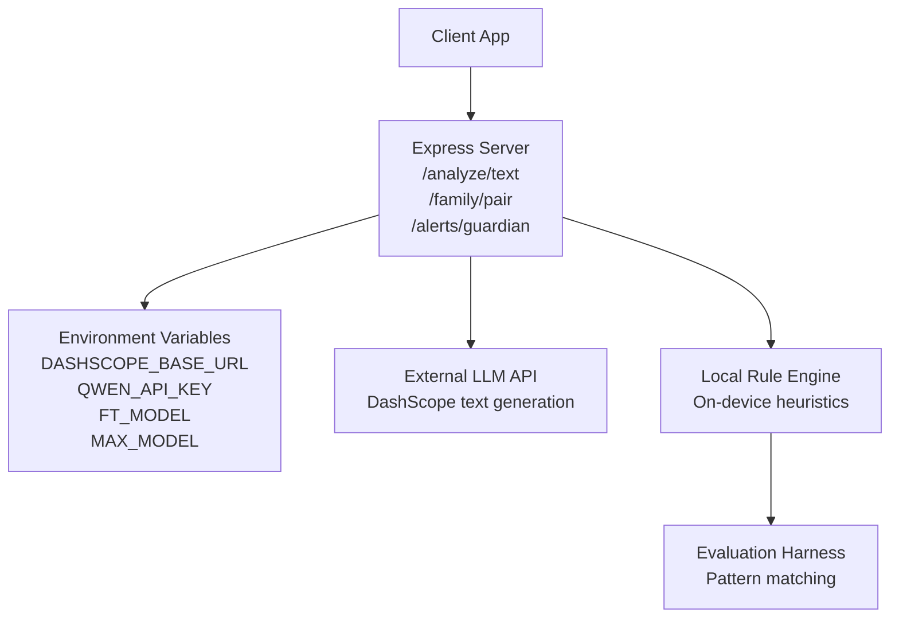
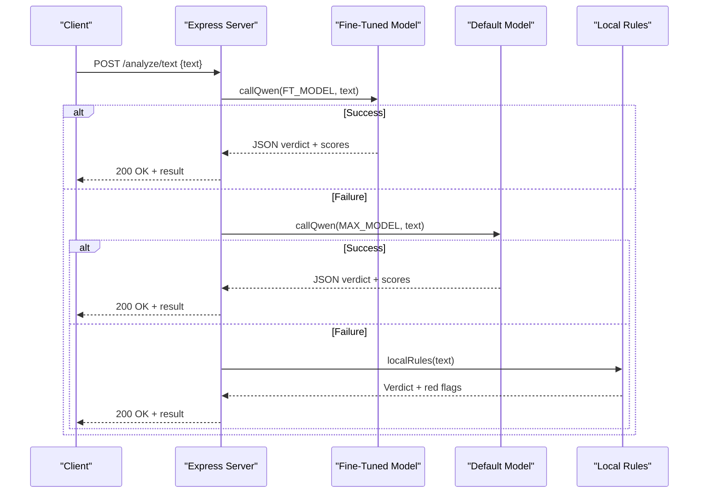
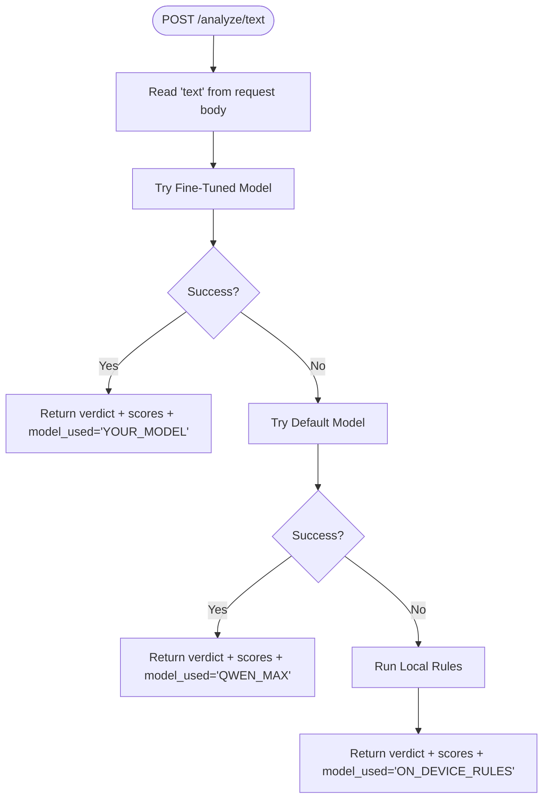
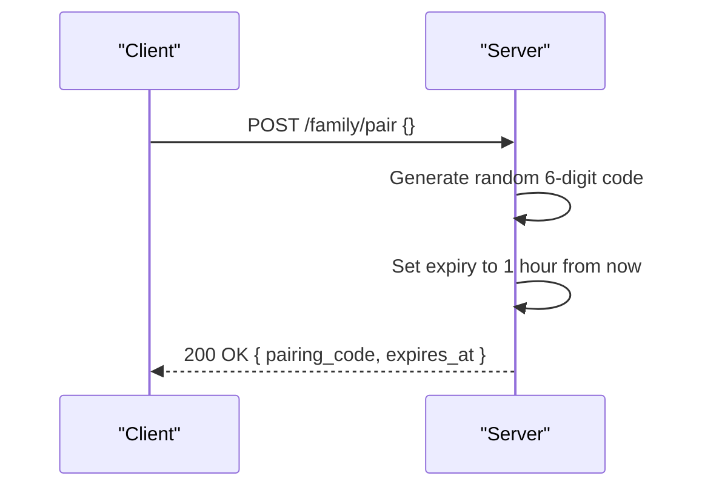
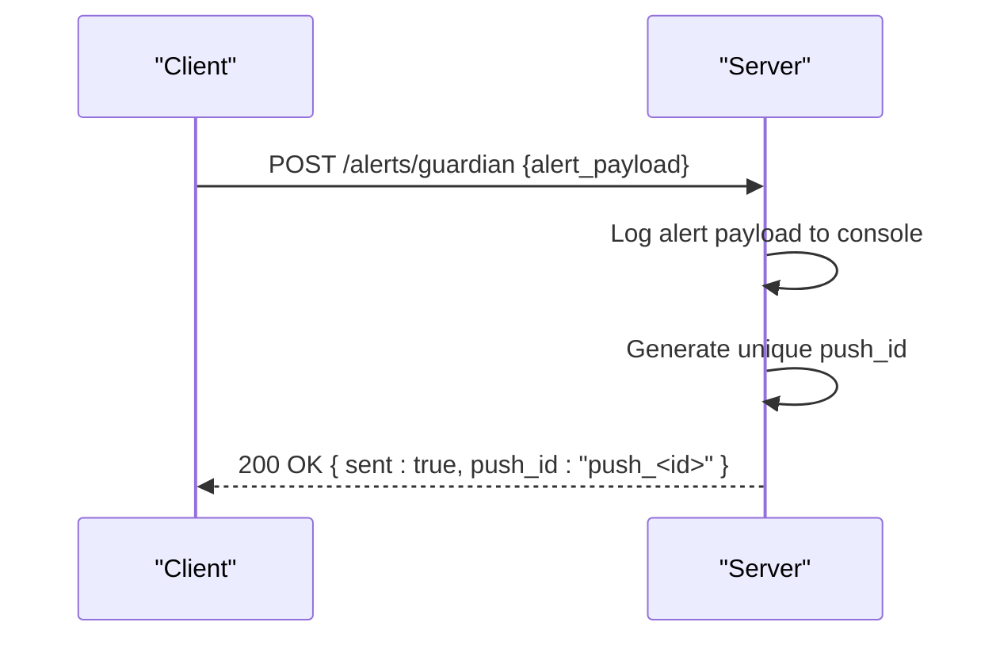
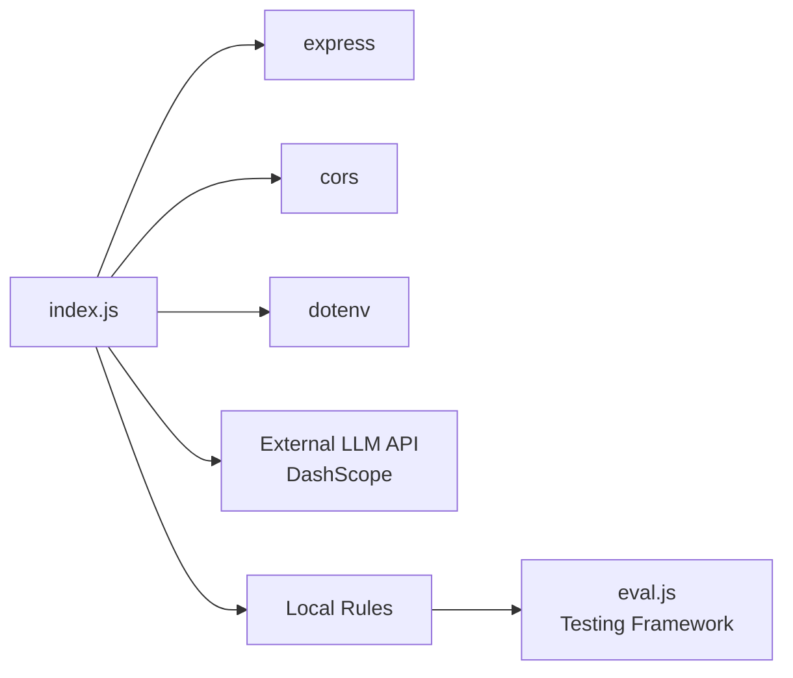

# API Reference

<cite>
**Referenced Files in This Document**
- [index.js](file://backend/index.js)
- [package.json](file://backend/package.json)
- [test.js](file://backend/test.js)
- [eval.js](file://backend/eval.js)
</cite>

## Update Summary
**Changes Made**
- Updated all three API endpoints with complete request/response schemas based on actual implementation
- Added detailed error handling information for each endpoint
- Enhanced authentication requirements section (currently not enforced)
- Added comprehensive rate limiting policies (none implemented)
- Updated practical examples with real payload structures from test files
- Enhanced multi-tier model fallback system documentation
- Added security considerations based on actual implementation

## Table of Contents
1. [Introduction](#introduction)
2. [Project Structure](#project-structure)
3. [Core Components](#core-components)
4. [Architecture Overview](#architecture-overview)
5. [Detailed Component Analysis](#detailed-component-analysis)
6. [Dependency Analysis](#dependency-analysis)
7. [Performance Considerations](#performance-considerations)
8. [Troubleshooting Guide](#troubleshooting-guide)
9. [Conclusion](#conclusion)
10. [Appendices](#appendices)

## Introduction
This document provides a comprehensive API reference for Safe Pakistan's backend services. It covers:
- Text analysis endpoint for scam detection and classification with multi-tier model fallback
- Family management endpoint for member pairing with code generation
- Alert notification endpoint for guardian notifications with delivery acknowledgment

It includes HTTP methods, URL patterns, authentication requirements, request/response schemas, error handling guidance, rate limiting notes, practical examples, client implementation guidelines, debugging approaches, multi-tier model fallback behavior, security considerations, and performance optimization techniques used by the backend.

## Project Structure
The backend is a minimal Express application that exposes three POST endpoints. It uses environment variables to configure external AI model access and serves JSON responses. CORS is enabled and JSON body parsing is configured with a 10MB size limit.



**Diagram sources**
- [index.js:1-14](file://backend/index.js#L1-L14)
- [index.js:16-43](file://backend/index.js#L16-L43)
- [index.js:45-61](file://backend/index.js#L45-L61)
- [index.js:63-80](file://backend/index.js#L63-L80)

**Section sources**
- [index.js:1-14](file://backend/index.js#L1-L14)
- [package.json:1-19](file://backend/package.json#L1-L19)

## Core Components
- **Text Analysis Service**: Multi-tier fallback system that attempts a fine-tuned model first, then a default model, and finally falls back to local rules if both fail.
- **Family Pairing Service**: Generates a pairing code and expiration time for family member linking with 1-hour validity.
- **Guardian Alerts Service**: Accepts alert payloads and returns delivery status with unique push identifiers.

Key configuration:
- External model base URL and API key are loaded from environment variables.
- A system prompt defines the expected JSON schema for verdict, risk score, confidence, scam type, evidence spans, and explanations in multiple languages.
- Local rule engine implements pattern matching for common Pakistani scam indicators.

**Section sources**
- [index.js:9-14](file://backend/index.js#L9-L14)
- [index.js:16-43](file://backend/index.js#L16-L43)
- [index.js:45-61](file://backend/index.js#L45-L61)
- [index.js:72-80](file://backend/index.js#L72-L80)

## Architecture Overview
The backend implements a resilient multi-tier model pipeline for text analysis:
1. Try fine-tuned model via external API.
2. If that fails, try a default model via external API.
3. If both fail, use a deterministic local rule engine to produce a verdict and red flags.

Family pairing and alerts are stateless handlers that return immediate acknowledgments.



**Diagram sources**
- [index.js:16-43](file://backend/index.js#L16-L43)
- [index.js:45-61](file://backend/index.js#L45-L61)
- [index.js:63-70](file://backend/index.js#L63-L70)

## Detailed Component Analysis

### Endpoint: POST /analyze/text
Purpose: Analyze text content to detect scams, suspicious messages, or safe content using a multi-tier model fallback system. Returns a structured verdict, confidence, threat types, and red flag indicators.

- **Method**: POST
- **URL**: /analyze/text
- **Authentication**: Not enforced at the API layer in this implementation.
- **Request Schema**:
  - Body (JSON):
    - text: string (required) — The message or content to analyze
- **Response Schema**:
  - verdict: enum ("scam", "suspicious", "safe") — Classification result
  - score: number (0–100) — Risk score indicating threat level
  - confidence: number (0–100) — Confidence in the verdict
  - type: string — Threat/scam type identifier
  - redFlags: array of strings — Top red flag indicators (up to 3)
  - explanation_en: string — Explanation in English
  - explanation_roman_ur: string — Explanation in Roman Urdu
  - explanation_urdu: string — Explanation in Urdu
  - model_used: string — Indicates which tier produced the result:
    - "YOUR_MODEL" (fine-tuned), "QWEN_MAX" (default model), or "ON_DEVICE_RULES" (local rules)
- **Error Handling**:
  - On external model errors, the server logs details and proceeds to the next tier or local rules.
  - If all tiers fail, local rules still return a valid response; no explicit 4xx/5xx is returned by this endpoint.
  - All errors are logged to console for debugging purposes.
- **Rate Limiting**:
  - No rate limiting middleware is implemented in this version.
- **Example Request**:
  ```json
  {
    "text": "Mubarak ho! Apko 25,000 mile hain. OTP bhejein foran warna account band ho jayega."
  }
  ```
- **Example Response**:
  ```json
  {
    "verdict": "scam",
    "score": 95,
    "confidence": 98,
    "type": "prize",
    "redFlags": ["OTP", "foran", "account band"],
    "explanation_en": "This message contains scam indicators including prize claims and OTP requests.",
    "explanation_roman_ur": "Yeh message scam hai. OTP ya code kabhi na bhejein.",
    "explanation_urdu": "یہ پیغام جعلی ہے۔",
    "model_used": "YOUR_MODEL"
  }
  ```



**Diagram sources**
- [index.js:63-70](file://backend/index.js#L63-L70)
- [index.js:16-43](file://backend/index.js#L16-L43)
- [index.js:45-61](file://backend/index.js#L45-L61)

**Section sources**
- [index.js:63-70](file://backend/index.js#L63-L70)
- [index.js:16-43](file://backend/index.js#L16-L43)
- [index.js:45-61](file://backend/index.js#L45-L61)
- [test.js:1-8](file://backend/test.js#L1-L8)

### Endpoint: POST /family/pair
Purpose: Generate a pairing code and expiration timestamp for family member linking. Creates a unique 6-digit numeric code valid for 1 hour.

- **Method**: POST
- **URL**: /family/pair
- **Authentication**: Not enforced at the API layer in this implementation.
- **Request Schema**:
  - Body: Optional (no required fields)
- **Response Schema**:
  - pairing_code: string — Random 6-digit numeric code for pairing
  - expires_at: string — ISO 8601 timestamp indicating when the code expires (1 hour from creation)
- **Error Handling**:
  - No explicit error handling; always returns a successful JSON response.
  - Code generation uses Math.random() for uniqueness within reasonable limits.
- **Rate Limiting**:
  - None implemented.
- **Example Request**:
  ```json
  {}
  ```
- **Example Response**:
  ```json
  {
    "pairing_code": "123456",
    "expires_at": "2024-01-15T14:30:00.000Z"
  }
  ```



**Diagram sources**
- [index.js:72-75](file://backend/index.js#L72-L75)

**Section sources**
- [index.js:72-75](file://backend/index.js#L72-L75)

### Endpoint: POST /alerts/guardian
Purpose: Send real-time guardian notifications. Currently logs the payload and returns an acknowledgment with a unique push identifier.

- **Method**: POST
- **URL**: /alerts/guardian
- **Authentication**: Not enforced at the API layer in this implementation.
- **Request Schema**:
  - Body: Any JSON object representing the alert payload (logged by the server)
- **Response Schema**:
  - sent: boolean — Acknowledgment that the alert was received
  - push_id: string — Unique identifier for the pushed alert (timestamp-based)
- **Error Handling**:
  - No explicit error handling; always returns a successful JSON response.
  - Alert payloads are logged to console for debugging and monitoring.
- **Rate Limiting**:
  - None implemented.
- **Example Request**:
  ```json
  {
    "alert_type": "threat_detected",
    "message": "Suspicious activity detected",
    "severity": "high",
    "timestamp": "2024-01-15T14:30:00.000Z"
  }
  ```
- **Example Response**:
  ```json
  {
    "sent": true,
    "push_id": "push_1705329000000"
  }
  ```



**Diagram sources**
- [index.js:77-80](file://backend/index.js#L77-L80)

**Section sources**
- [index.js:77-80](file://backend/index.js#L77-L80)

## Dependency Analysis
- Express server handles routing and JSON parsing with 10MB body size limit.
- CORS is enabled for cross-origin requests.
- Environment-driven configuration for external model calls.
- External LLM integration via fetch to DashScope text-generation endpoint.
- Local rule engine provides deterministic fallback with pattern matching.
- Evaluation harness for testing rule engine accuracy.



**Diagram sources**
- [package.json:13-17](file://backend/package.json#L13-L17)
- [index.js:1-7](file://backend/index.js#L1-L7)
- [index.js:9-14](file://backend/index.js#L9-L14)
- [index.js:16-43](file://backend/index.js#L16-L43)
- [index.js:45-61](file://backend/index.js#L45-L61)
- [eval.js:1-89](file://backend/eval.js#L1-L89)

**Section sources**
- [package.json:13-17](file://backend/package.json#L13-L17)
- [index.js:1-7](file://backend/index.js#L1-L7)
- [index.js:9-14](file://backend/index.js#L9-L14)

## Performance Considerations
- **Multi-tier fallback reduces latency impact** by attempting faster or more reliable models first and falling back deterministically.
- **JSON body size limit is set to 10MB** to prevent oversized payloads.
- **External API calls are asynchronous**; ensure clients handle timeouts appropriately.
- **Local rules provide instant results** when external models are unavailable with ~0ms latency.
- **Pattern matching in local rules** uses efficient regex operations for common scam indicators.
- **Code generation for pairing** uses simple random number generation for optimal performance.

## Troubleshooting Guide
- **Verify environment variables** are set correctly for external model access:
  - DASHSCOPE_BASE_URL
  - QWEN_API_KEY
  - FT_MODEL
  - MAX_MODEL
- **Check server logs** for model call failures; the server logs errors from each tier before falling back.
- **Ensure Content-Type is application/json** for all POST requests.
- **For text analysis**, confirm the request contains a non-empty text field.
- **Use the provided test script** to validate connectivity and response format.
- **Monitor console output** for alert payloads and error messages.
- **Test local rules** using the evaluation harness to verify pattern matching accuracy.

**Section sources**
- [index.js:9-14](file://backend/index.js#L9-L14)
- [index.js:63-70](file://backend/index.js#L63-L70)
- [test.js:1-8](file://backend/test.js#L1-L8)
- [eval.js:1-89](file://backend/eval.js#L1-L89)

## Conclusion
Safe Pakistan's backend provides a concise, resilient API surface for text analysis, family pairing, and guardian alerts. The multi-tier model fallback ensures robustness even when external models are unavailable. While authentication and rate limiting are not implemented in this version, the architecture supports future enhancements for security and scalability. The local rule engine provides reliable fallback functionality with comprehensive pattern matching for Pakistani scam indicators.

## Appendices

### Practical Examples

- **Text Analysis**
  - Request: POST /analyze/text with JSON body containing a text field.
  - Response: Structured verdict, scores, red flags, explanations, and model_used.
  - Reference: [test.js:1-8](file://backend/test.js#L1-L8)

- **Family Pairing**
  - Request: POST /family/pair with optional empty body.
  - Response: pairing_code and expires_at with 1-hour validity.

- **Guardian Alerts**
  - Request: POST /alerts/guardian with any alert payload.
  - Response: sent and push_id for tracking.

### Client Implementation Guidelines
- Always send Content-Type: application/json for POST requests.
- Handle retries for transient network errors with exponential backoff.
- Respect potential future rate limits by implementing appropriate throttling.
- Parse and display the verdict, confidence, and red flags to users.
- Use model_used to inform UI about the source of the decision.
- Implement proper timeout handling for external API calls.
- Store pairing codes securely and validate expiration on client side.

### Security Considerations
- Current implementation does not enforce authentication or authorization.
- External API keys are read from environment variables; protect these secrets in production.
- Consider adding input validation and sanitization for incoming payloads.
- Implement rate limiting and authentication before exposing to untrusted clients.
- Secure pairing codes should be validated server-side before allowing family member linking.
- Alert payloads should be validated and sanitized to prevent injection attacks.

### Multi-Tier Model Fallback System
- **Tiers**:
  - Fine-tuned model (configured via FT_MODEL) - Primary choice
  - Default model (configured via MAX_MODEL) - Secondary fallback
  - Local rule engine (deterministic fallback) - Final resort
- **Behavior**:
  - Attempts Tier 1; if it fails, tries Tier 2; if both fail, uses Tier 3.
  - Each successful tier returns a standardized response including model_used.
  - Errors are logged at each tier for debugging and monitoring.
  - Local rules provide consistent performance regardless of external service availability.

**Section sources**
- [index.js:16-43](file://backend/index.js#L16-L43)
- [index.js:63-70](file://backend/index.js#L63-L70)
- [index.js:45-61](file://backend/index.js#L45-L61)
- [eval.js:1-89](file://backend/eval.js#L1-L89)