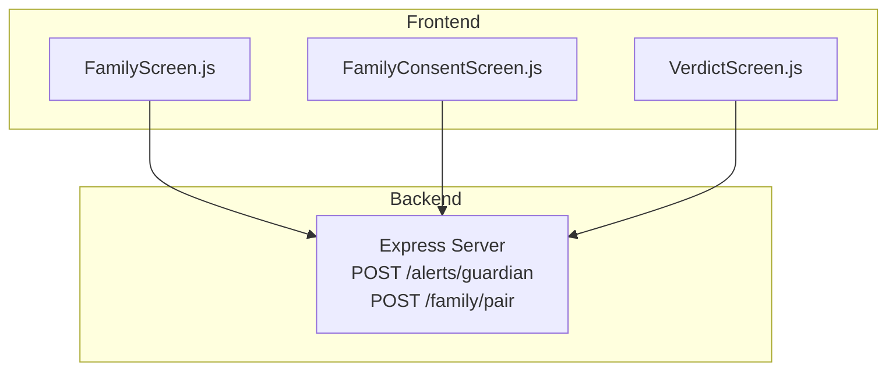
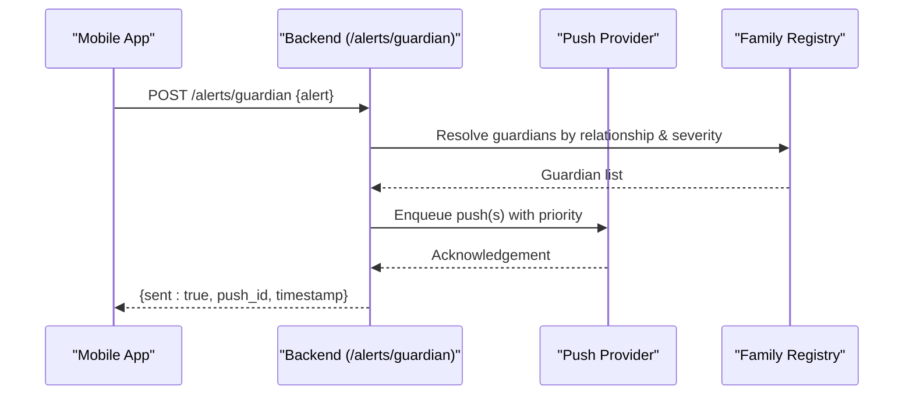
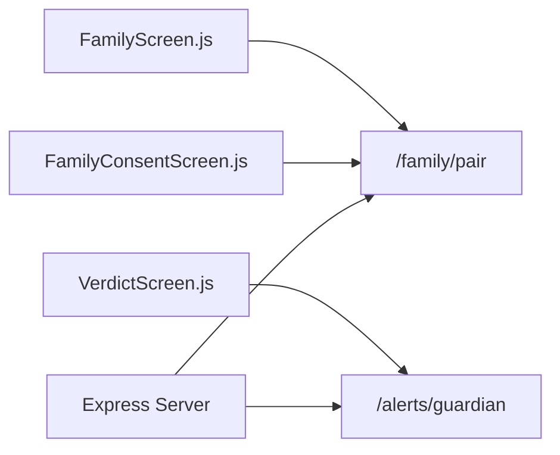

# Alert Notification API

<cite>
**Referenced Files in This Document**
- [backend/index.js](file://backend/index.js)
- [backend/package.json](file://backend/package.json)
- [src/screens/FamilyConsentScreen.js](file://src/screens/FamilyConsentScreen.js)
- [src/screens/FamilyScreen.js](file://src/screens/FamilyScreen.js)
- [src/screens/VerdictScreen.js](file://src/screens/VerdictScreen.js)
</cite>

## Table of Contents
1. Introduction
2. Project Structure
3. Core Components
4. Architecture Overview
5. Detailed Component Analysis
6. Dependency Analysis
7. Performance Considerations
8. Troubleshooting Guide
9. Conclusion
10. Appendices

## Introduction
This document specifies the Alert Notification API for real-time guardian notifications, centered on the POST /alerts/guardian endpoint. It defines the request schema (recipient identifiers, alert types, message templates, urgency levels), response format (delivery status confirmation, push notification IDs, timestamps), and explains how alerts are routed to guardians based on family relationships and threat severity. It also provides practical examples for different threat scenarios, expected delivery confirmations, error handling guidance, retry strategies, prioritization rules, delivery guarantees, and integration patterns for real-time threat monitoring systems.

## Project Structure
The alert system spans a minimal backend service and a React Native frontend that orchestrates family pairing and displays threat outcomes. The key pieces:
- Backend Express server exposing endpoints including /alerts/guardian and /family/pair
- Frontend screens for family management and consent, and verdict display

**Diagram sources**
- [backend/index.js:72-80](file://backend/index.js#L72-L80)
- [src/screens/FamilyScreen.js:20-82](file://src/screens/FamilyScreen.js#L20-L82)
- [src/screens/FamilyConsentScreen.js:16-35](file://src/screens/FamilyConsentScreen.js#L16-L35)
- [src/screens/VerdictScreen.js:19-87](file://src/screens/VerdictScreen.js#L19-L87)

**Section sources**
- [backend/index.js:72-80](file://backend/index.js#L72-L80)
- [backend/package.json:1-19](file://backend/package.json#L1-L19)
- [src/screens/FamilyScreen.js:20-82](file://src/screens/FamilyScreen.js#L20-L82)
- [src/screens/FamilyConsentScreen.js:16-35](file://src/screens/FamilyConsentScreen.js#L16-L35)
- [src/screens/VerdictScreen.js:19-87](file://src/screens/VerdictScreen.js#L19-L87)

## Core Components
- POST /alerts/guardian: Accepts an alert payload and returns immediate delivery confirmation with a push ID.
- POST /family/pair: Generates a pairing code and expiry used to establish guardian relationships between family members.
- Family consent flow: Defines what data is shared with guardians (threat alerts, risk scores, protection status).
- Verdict flow: Displays threat outcomes and actions; can trigger guardian alerts when threats are detected.

Key responsibilities:
- Alert ingestion and acknowledgment
- Relationship establishment via pairing codes
- Consent-driven sharing scope
- UI-driven triggers for alerts

**Section sources**
- [backend/index.js:72-80](file://backend/index.js#L72-L80)
- [src/screens/FamilyConsentScreen.js:16-35](file://src/screens/FamilyConsentScreen.js#L16-L35)
- [src/screens/VerdictScreen.js:19-87](file://src/screens/VerdictScreen.js#L19-L87)

## Architecture Overview
The alert notification architecture integrates detection results with family-based routing and push delivery.

**Diagram sources**
- [backend/index.js:77-80](file://backend/index.js#L77-L80)
- [src/screens/FamilyConsentScreen.js:16-35](file://src/screens/FamilyConsentScreen.js#L16-L35)

## Detailed Component Analysis

### Endpoint: POST /alerts/guardian
Purpose:
- Receive an alert event from the app or upstream services
- Route to appropriate guardians based on family relationships and threat severity
- Return immediate delivery confirmation with a push ID and timestamp

Request schema:
- recipient_ids: array of strings — unique identifiers for guardians to notify
- alert_type: string — one of scam_detected, suspicious_activity, emergency_alert
- message_template: object — localized text fields for the notification content
  - title: string
  - body: string
  - urdu_body: string (optional)
- urgency_level: string — one of low, medium, high, critical
- metadata: object — optional context such as threat_score, verdict, type, evidence_spans
- correlation_id: string — optional client-generated ID for tracing

Response schema:
- sent: boolean — indicates successful acceptance for delivery
- push_id: string — unique identifier for this delivery batch
- timestamp: string — ISO-8601 timestamp of acceptance
- recipients_count: number — number of guardians targeted
- warnings: array of strings — optional delivery warnings (e.g., throttling)

Behavioral notes:
- The endpoint logs the incoming payload and responds immediately with a success acknowledgement and a generated push ID.
- Actual push dispatching and routing logic should be implemented around this handler.

Example request:
- Scenario: Scam detected
  - alert_type: scam_detected
  - urgency_level: high
  - message_template.title: "Scam Detected"
  - message_template.body: "A potential scam was blocked."
  - metadata.threat_score: 96
  - metadata.verdict: scam
  - metadata.type: BISP 8171 Fraud

- Scenario: Suspicious activity
  - alert_type: suspicious_activity
  - urgency_level: medium
  - message_template.title: "Suspicious Activity"
  - message_template.body: "Unusual activity detected. Review recommended."

- Scenario: Emergency alert
  - alert_type: emergency_alert
  - urgency_level: critical
  - message_template.title: "Emergency Alert"
  - message_template.body: "Immediate action required."

Expected response:
- { sent: true, push_id: "push_<timestamp>", timestamp: "<ISO time>", recipients_count: <n>, warnings: [] }

Error handling:
- Invalid or missing required fields: return 400 with descriptive errors
- Unknown alert_type or urgency_level: return 400
- Internal processing failure: return 500 with error details
- Rate limiting/throttling: return 429 with retry-after guidance

Retry mechanisms:
- Client-side exponential backoff with jitter for transient failures
- Idempotency using correlation_id to prevent duplicate deliveries
- Dead-letter queue for failed pushes after max retries

Delivery guarantees:
- At-least-once delivery semantics with idempotent consumers
- Priority queuing for critical and high urgency alerts
- Retry policy with bounded attempts and backoff

Prioritization:
- Critical > High > Medium > Low
- Critical alerts bypass normal batching to minimize latency

Integration patterns:
- Use correlation_id to correlate alerts with upstream events
- Include metadata for analytics and post-delivery reporting
- Integrate with device token management for accurate targeting

**Section sources**
- [backend/index.js:77-80](file://backend/index.js#L77-L80)

### Family Pairing and Relationship Management
Purpose:
- Establish guardian relationships so alerts can be routed to the correct recipients
- Define consent boundaries for what information is shared with guardians

Pairing flow:
- Generate a pairing code with expiration via POST /family/pair
- Share the code with the invited guardian
- On accept, link devices and define sharing scope per consent

Consent scope:
- Shared: threat alerts, risk scores, protection status
- Never shared: message text, contacts, photos, location

Operational notes:
- Store pairing_code and expires_at for validation
- Persist accepted relationships and consent preferences
- Enforce consent at alert routing time

**Section sources**
- [backend/index.js:72-75](file://backend/index.js#L72-L75)
- [src/screens/FamilyConsentScreen.js:16-35](file://src/screens/FamilyConsentScreen.js#L16-L35)

### Threat Outcomes and Alert Triggers
Purpose:
- Present verdicts and enable user actions
- Trigger guardian alerts when threats are detected

Flow:
- Verdict screen shows threat score, confidence, and type
- For scam verdicts, users can block sender, inform family, or report
- Informing family can invoke POST /alerts/guardian with appropriate alert_type and urgency

UI elements:
- Threat ring visualization
- Evidence chips for scam indicators
- Action sheet with family notification option

**Section sources**
- [src/screens/VerdictScreen.js:19-113](file://src/screens/VerdictScreen.js#L19-L113)

## Dependency Analysis
The alert system depends on:
- Express server for HTTP endpoints
- Environment variables for external model calls (not directly related to alerts but part of backend)
- Frontend screens for initiating alerts and managing family relationships

**Diagram sources**
- [backend/index.js:72-80](file://backend/index.js#L72-L80)
- [src/screens/FamilyScreen.js:20-82](file://src/screens/FamilyScreen.js#L20-L82)
- [src/screens/FamilyConsentScreen.js:16-35](file://src/screens/FamilyConsentScreen.js#L16-L35)
- [src/screens/VerdictScreen.js:19-113](file://src/screens/VerdictScreen.js#L19-L113)

**Section sources**
- [backend/index.js:72-80](file://backend/index.js#L72-L80)
- [backend/package.json:1-19](file://backend/package.json#L1-L19)

## Performance Considerations
- Keep /alerts/guardian synchronous for quick acknowledgment; offload heavy routing to background jobs if needed
- Batch non-critical alerts to reduce overhead
- Use correlation_id for deduplication and efficient tracking
- Implement rate limiting to protect downstream push providers
- Cache family relationships and consent states to minimize lookups during alert routing

[No sources needed since this section provides general guidance]

## Troubleshooting Guide
Common issues and resolutions:
- Missing required fields: validate request schema before sending
- Unknown alert_type or urgency_level: ensure values match allowed enums
- Delivery failures: check push provider connectivity and device tokens
- Duplicate notifications: verify correlation_id usage and idempotency
- Excessive retries: implement exponential backoff and circuit breakers

Validation checklist:
- Confirm recipient_ids exist and are active
- Ensure message_template contains required title and body
- Validate urgency_level against allowed values
- Log correlation_id for traceability

**Section sources**
- [backend/index.js:77-80](file://backend/index.js#L77-L80)

## Conclusion
The POST /alerts/guardian endpoint provides a foundation for real-time guardian notifications within the Safe Pakistan application. By combining family pairing, consent-driven sharing, and structured alert payloads, the system enables timely and relevant notifications tailored to threat severity. Implement robust routing, prioritization, and retry mechanisms to ensure reliable delivery and a positive user experience.

[No sources needed since this section summarizes without analyzing specific files]

## Appendices

### Request and Response Schemas

Alert request:
- recipient_ids: array of strings
- alert_type: enum ["scam_detected", "suspicious_activity", "emergency_alert"]
- message_template: object
  - title: string
  - body: string
  - urdu_body: string (optional)
- urgency_level: enum ["low", "medium", "high", "critical"]
- metadata: object (optional)
  - threat_score: number
  - verdict: string
  - type: string
  - evidence_spans: array of strings
- correlation_id: string (optional)

Alert response:
- sent: boolean
- push_id: string
- timestamp: string (ISO-8601)
- recipients_count: number
- warnings: array of strings

**Section sources**
- [backend/index.js:77-80](file://backend/index.js#L77-L80)

### Example Scenarios

- Scam detected
  - Request includes alert_type scam_detected, urgency high, metadata with threat_score and verdict
  - Expected response confirms sent and provides push_id and timestamp

- Suspicious activity
  - Request includes alert_type suspicious_activity, urgency medium
  - Expected response confirms sent and provides push_id and timestamp

- Emergency alert
  - Request includes alert_type emergency_alert, urgency critical
  - Expected response confirms sent and provides push_id and timestamp

**Section sources**
- [backend/index.js:77-80](file://backend/index.js#L77-L80)

### Error Handling and Retries

- Validation errors: 400 Bad Request with field-level messages
- Processing errors: 500 Internal Server Error with concise error message
- Rate limits: 429 Too Many Requests with retry-after seconds
- Retry strategy: exponential backoff with jitter, max retries, idempotency via correlation_id

**Section sources**
- [backend/index.js:77-80](file://backend/index.js#L77-L80)