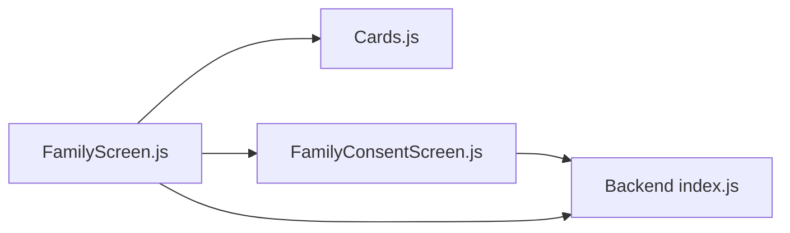

# Family Management API

<cite>
**Referenced Files in This Document**
- [backend/index.js](file://backend/index.js)
- [src/screens/FamilyScreen.js](file://src/screens/FamilyScreen.js)
- [src/screens/FamilyConsentScreen.js](file://src/screens/FamilyConsentScreen.js)
- [src/components/Cards.js](file://src/components/Cards.js)
</cite>

## Table of Contents
1. [Introduction](#introduction)
2. [Project Structure](#project-structure)
3. [Core Components](#core-components)
4. [Architecture Overview](#architecture-overview)
5. [Detailed Component Analysis](#detailed-component-analysis)
6. [Dependency Analysis](#dependency-analysis)
7. [Performance Considerations](#performance-considerations)
8. [Troubleshooting Guide](#troubleshooting-guide)
9. [Conclusion](#conclusion)
10. [Appendices](#appendices)

## Introduction
This document provides comprehensive API documentation for family management endpoints with a focus on the POST /family/pair endpoint used to initiate member pairing. It explains the request and response schemas, the consent-driven registration workflow between devices, and how real-time synchronization can be implemented. It also includes practical examples, error scenarios, client implementation patterns, and security considerations such as token validation, rate limiting, and privacy protections.

## Project Structure
The family management feature spans both backend and frontend:
- Backend exposes REST endpoints for pairing and alerts.
- Frontend screens implement the user-facing flow for inviting and accepting family members, including consent presentation and navigation.

```mermaid
graph TB
subgraph "Frontend"
FS["FamilyScreen.js"]
FCS["FamilyConsentScreen.js"]
Cards["Cards.js"]
end
subgraph "Backend"
API["Express App<br/>index.js"]
end
FS --> |"Initiate pairing"<br/>POST /family/pair| API
FCS --> |"Accept/Decline invite"<br/>Service calls (placeholder)"| API
Cards --> |"Member UI components"| FS
```

**Diagram sources**
- [backend/index.js:72-75](file://backend/index.js#L72-L75)
- [src/screens/FamilyScreen.js:66-81](file://src/screens/FamilyScreen.js#L66-L81)
- [src/screens/FamilyConsentScreen.js:24-35](file://src/screens/FamilyConsentScreen.js#L24-L35)
- [src/components/Cards.js:61-86](file://src/components/Cards.js#L61-L86)

**Section sources**
- [backend/index.js:72-75](file://backend/index.js#L72-L75)
- [src/screens/FamilyScreen.js:66-81](file://src/screens/FamilyScreen.js#L66-L81)
- [src/screens/FamilyConsentScreen.js:24-35](file://src/screens/FamilyConsentScreen.js#L24-L35)
- [src/components/Cards.js:61-86](file://src/components/Cards.js#L61-L86)

## Core Components
- Pairing Endpoint: POST /family/pair generates a pairing code and an expiration timestamp for linking family members.
- Consent Screen: Presents what data will be shared and what will never be shared, allowing the invited member to accept or decline.
- Family Screen: Displays existing family members and provides an entry point to add new members.

Key responsibilities:
- Generate secure, time-bound pairing codes.
- Present clear consent information to the invited member.
- Provide UI for viewing and managing family members.

**Section sources**
- [backend/index.js:72-75](file://backend/index.js#L72-L75)
- [src/screens/FamilyConsentScreen.js:16-22](file://src/screens/FamilyConsentScreen.js#L16-L22)
- [src/screens/FamilyScreen.js:20-25](file://src/screens/FamilyScreen.js#L20-L25)

## Architecture Overview
The pairing flow involves two devices:
- Inviter device requests a pairing code from the backend.
- Invitee device receives a deep link with a token and shows the consent screen.
- Upon acceptance, the invitee’s device confirms the invitation via a service call (placeholder), completing the linkage.

```mermaid
sequenceDiagram
participant Inviter as "Inviter Device"
participant Backend as "API Server"
participant Invitee as "Invitee Device"
Inviter->>Backend : POST /family/pair
Backend-->>Inviter : { pairing_code, expires_at }
Note over Inviter : Share pairing_code or deep-link with token
Invitee->>Invitee : Show FamilyConsentScreen
Invitee->>Backend : Service call to accept invite (placeholder)
Backend-->>Invitee : Success
Note over Invitee,Backend : Link established; future sync via alerts
```

**Diagram sources**
- [backend/index.js:72-75](file://backend/index.js#L72-L75)
- [src/screens/FamilyConsentScreen.js:24-35](file://src/screens/FamilyConsentScreen.js#L24-L35)

## Detailed Component Analysis

### POST /family/pair — Member Pairing
Purpose:
- Initiate family member pairing by generating a short-lived pairing code and expiration time.

Request:
- Method: POST
- Path: /family/pair
- Body: Not required by current implementation (no fields validated).

Response:
- pairing_code: string (six-digit numeric code)
- expires_at: ISO 8601 timestamp indicating when the code expires

Notes:
- The current implementation does not validate input or enforce rate limits.
- In production, consider adding authentication, rate limiting, and persistent storage for pairing sessions.

Security considerations:
- Enforce HTTPS/TLS in production.
- Add rate limiting to prevent abuse.
- Validate and rotate tokens server-side before finalizing the link.
- Store minimal metadata and ensure encryption at rest for sensitive relationships.

Error scenarios:
- If pairing codes are reused after expiration, return a specific error indicating expiry.
- If invalid or tampered tokens are presented during acceptance, return an authorization error.

Client implementation pattern:
- Request a pairing code when the inviter taps “Add Family”.
- Display the code to the invitee or generate a deep link containing a secure token.
- Poll or wait for confirmation that the invitee accepted the invitation.

**Section sources**
- [backend/index.js:72-75](file://backend/index.js#L72-L75)

### Family Consent Workflow
Purpose:
- Ensure explicit, informed consent from the invited member before sharing any data within the family group.

Flow:
- Deep link opens FamilyConsentScreen with inviter details and a token.
- The screen clearly lists what is shared (threat alerts, risk scores, protection status) and what is never shared (message text, contacts, photos, location).
- Accepting triggers a service call to finalize the relationship; declining returns the user to the previous screen.

Privacy protections:
- Only non-sensitive indicators are shared by design.
- Sensitive personal data is explicitly excluded from sharing.

Implementation notes:
- The accept/decline handlers currently contain placeholder service calls; integrate with your backend to persist consent and establish the family link.

**Section sources**
- [src/screens/FamilyConsentScreen.js:16-22](file://src/screens/FamilyConsentScreen.js#L16-L22)
- [src/screens/FamilyConsentScreen.js:24-35](file://src/screens/FamilyConsentScreen.js#L24-L35)

### Family Member UI
Purpose:
- Display existing family members and provide an entry point to add more.

Components:
- FamilyMemberCard renders each member’s name, role, last protected time, and status indicator.
- FamilyScreen aggregates members and offers an “Add” action to start the pairing flow.

Integration:
- Use the pairing endpoint to obtain a code/token and navigate to the consent flow on the invitee’s device.

**Section sources**
- [src/components/Cards.js:61-86](file://src/components/Cards.js#L61-L86)
- [src/screens/FamilyScreen.js:66-81](file://src/screens/FamilyScreen.js#L66-L81)

## Dependency Analysis
- The pairing endpoint depends on Express middleware for CORS and JSON parsing.
- The frontend screens depend on theme tokens and typography for consistent UI.
- The consent screen references placeholders for service calls that should connect to backend logic for accepting invitations.



**Diagram sources**
- [src/screens/FamilyScreen.js:66-81](file://src/screens/FamilyScreen.js#L66-L81)
- [src/components/Cards.js:61-86](file://src/components/Cards.js#L61-L86)
- [src/screens/FamilyConsentScreen.js:24-35](file://src/screens/FamilyConsentScreen.js#L24-L35)
- [backend/index.js:72-75](file://backend/index.js#L72-L75)

**Section sources**
- [backend/index.js:1-7](file://backend/index.js#L1-L7)
- [src/screens/FamilyScreen.js:66-81](file://src/screens/FamilyScreen.js#L66-L81)
- [src/screens/FamilyConsentScreen.js:24-35](file://src/screens/FamilyConsentScreen.js#L24-L35)

## Performance Considerations
- Keep pairing code generation lightweight; avoid heavy computations.
- Cache or store pairing sessions server-side to minimize repeated lookups.
- Use efficient polling intervals or WebSocket connections for real-time updates once linked.
- Minimize payload sizes for alerts and status updates to reduce bandwidth usage.

[No sources needed since this section provides general guidance]

## Troubleshooting Guide
Common issues and resolutions:
- Expired pairing code:
  - Symptom: Acceptance fails with an authorization error.
  - Resolution: Regenerate a new pairing code and re-invite the member.
- Invalid or tampered token:
  - Symptom: Acceptance rejected due to invalid token.
  - Resolution: Verify token integrity and ensure it was transmitted securely.
- Rate limiting triggered:
  - Symptom: Too many pairing attempts in a short period.
  - Resolution: Implement exponential backoff on the client and review server rate limit policies.
- Consent not persisted:
  - Symptom: Invitee accepts but family list does not update.
  - Resolution: Ensure the accept service call completes successfully and persists the relationship.

**Section sources**
- [backend/index.js:72-75](file://backend/index.js#L72-L75)
- [src/screens/FamilyConsentScreen.js:24-35](file://src/screens/FamilyConsentScreen.js#L24-L35)

## Conclusion
The family management API centers around a simple yet effective pairing mechanism using POST /family/pair to generate secure, time-bound codes. The consent-driven workflow ensures privacy and explicit permission before any data sharing occurs. For production readiness, implement robust token validation, rate limiting, secure transport, and real-time synchronization mechanisms to maintain a safe and responsive family shield experience.

[No sources needed since this section summarizes without analyzing specific files]

## Appendices

### API Reference: POST /family/pair
- Endpoint: POST /family/pair
- Purpose: Generate a pairing code and expiration for family member linking.
- Request body: None (current implementation).
- Response fields:
  - pairing_code: string (numeric code)
  - expires_at: string (ISO 8601 timestamp)

Example responses:
- Success: Returns a pairing code and expiration timestamp.
- Error: When implementing validation, return appropriate error codes for expired or invalid codes.

**Section sources**
- [backend/index.js:72-75](file://backend/index.js#L72-L75)

### Consent Data Sharing Policy
- Shared: Threat alerts, risk scores, protection status.
- Never shared: Message text, contacts, photos, location.

**Section sources**
- [src/screens/FamilyConsentScreen.js:16-22](file://src/screens/FamilyConsentScreen.js#L16-L22)

### Real-Time Synchronization Patterns
- Use push notifications or WebSockets to notify paired devices of threat events and status changes.
- Maintain a lightweight heartbeat to detect online/offline status among family members.
- Ensure idempotent updates to avoid duplicate notifications.

[No sources needed since this section provides general guidance]