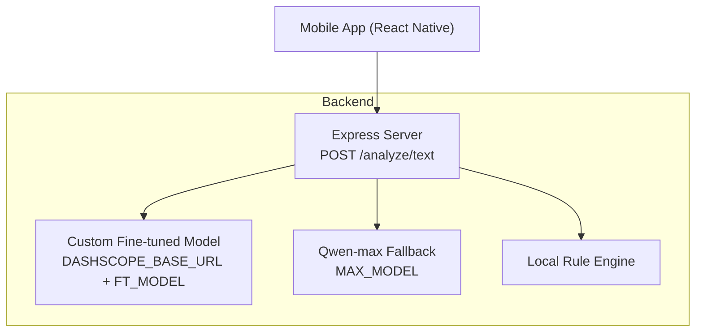
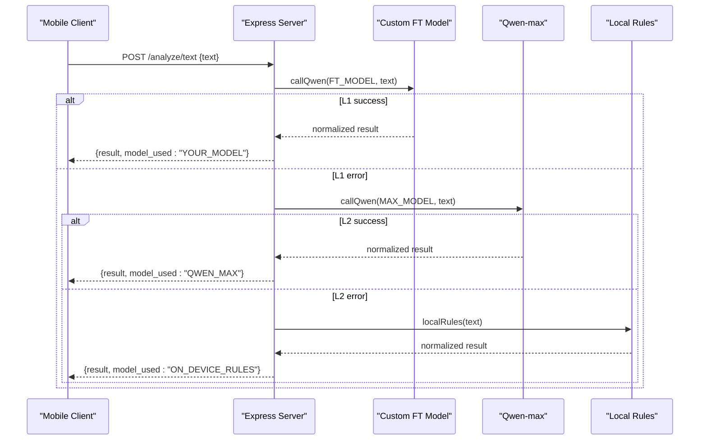
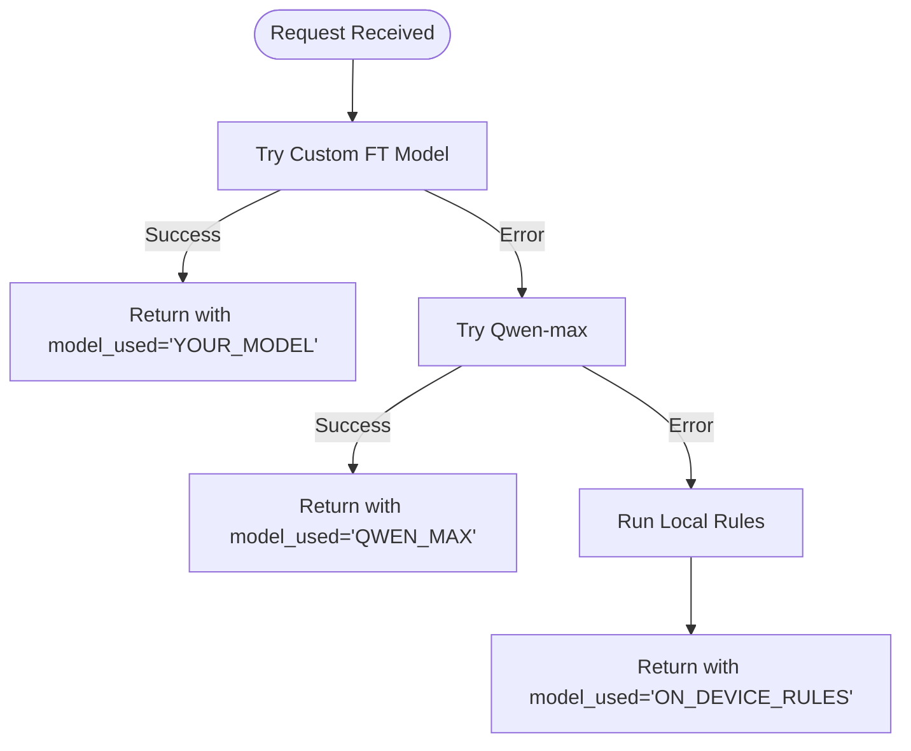
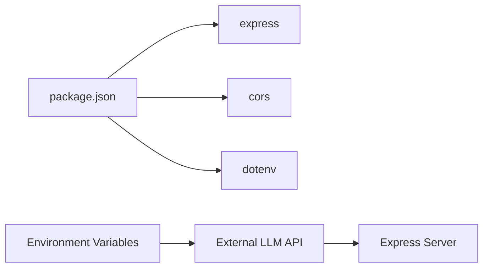

# Text Analysis API

<cite>
**Referenced Files in This Document**
- [backend/index.js](file://backend/index.js)
- [backend/test.js](file://backend/test.js)
- [backend/package.json](file://backend/package.json)
- [src/screens/ScanScreen.js](file://src/screens/ScanScreen.js)
- [README.md](file://README.md)
</cite>

## Table of Contents
1. Introduction
2. Project Structure
3. Core Components
4. Architecture Overview
5. Detailed Component Analysis
6. Dependency Analysis
7. Performance Considerations
8. Troubleshooting Guide
9. Conclusion
10. Appendices

## Introduction
This document provides detailed API documentation for the text analysis endpoint POST /analyze/text used by the Safe Pakistan application to detect SMS and message-based scams. It covers request/response schemas, multi-tier model fallback behavior, error handling patterns, example payloads, integration guidance for mobile clients, and operational considerations such as rate limiting and performance.

## Project Structure
The backend is a minimal Express server that exposes:
- POST /analyze/text — primary text analysis endpoint
- POST /family/pair — family pairing helper
- POST /alerts/guardian — push alert helper

The frontend includes a Scan screen where users paste or type messages to analyze. The README documents how to wire the mobile app to the backend.

**Diagram sources**
- [backend/index.js:63-70](file://backend/index.js#L63-L70)
- [backend/index.js:16-43](file://backend/index.js#L16-L43)
- [backend/index.js:45-61](file://backend/index.js#L45-L61)

**Section sources**
- [backend/index.js:1-82](file://backend/index.js#L1-L82)
- [README.md:173-203](file://README.md#L173-L203)

## Core Components
- Request handler for POST /analyze/text
- Multi-tier model caller to external LLM service
- Local rule-based detector
- Environment-driven configuration for models and credentials

Key responsibilities:
- Accept JSON payload with at least a text field
- Attempt custom fine-tuned model first, then Qwen-max, then local rules
- Normalize and return a consistent response schema including verdict, risk score, confidence, scam type, evidence spans, and multilingual explanations
- Attach model_used to indicate which layer produced the result

**Section sources**
- [backend/index.js:63-70](file://backend/index.js#L63-L70)
- [backend/index.js:16-43](file://backend/index.js#L16-L43)
- [backend/index.js:45-61](file://backend/index.js#L45-L61)

## Architecture Overview
The endpoint implements a three-layer fallback strategy:
1. Custom fine-tuned model via DASHSCOPE_BASE_URL using FT_MODEL
2. Qwen-max via MAX_MODEL if the first layer fails
3. Local rule-based detection if both layers fail

**Diagram sources**
- [backend/index.js:63-70](file://backend/index.js#L63-L70)
- [backend/index.js:16-43](file://backend/index.js#L16-L43)
- [backend/index.js:45-61](file://backend/index.js#L45-L61)

## Detailed Component Analysis

### Endpoint: POST /analyze/text
- Purpose: Analyze message content to classify scam risk and provide explanations in multiple languages.
- Authentication: Not enforced in code; secure deployments should add authentication middleware.
- Rate Limiting: Not implemented in code; consider adding a rate limiter for production.
- Content-Type: application/json
- Request body:
  - Required: text (string) — message content to analyze
  - Optional: lang (string) — language hint (e.g., "en", "ur", "roman_ur") — not consumed by the current implementation but can be passed from clients
- Response body:
  - verdict: string — one of "scam", "suspicious", "safe"
  - risk_score: number — integer 0–100
  - confidence: number — integer 0–100
  - scam_type: string — identified scam category or "Unknown"
  - evidence_spans: array of strings — short trigger phrases or flags
  - explanation_en: string — English explanation
  - explanation_roman_ur: string — Roman Urdu explanation
  - explanation_urdu: string — Urdu explanation
  - model_used: string — indicates which layer responded ("YOUR_MODEL", "QWEN_MAX", or "ON_DEVICE_RULES")

Notes:
- The system prompt instructs the model to return only valid JSON with the specified fields.
- The response is normalized to ensure consistent field names and value ranges.

**Section sources**
- [backend/index.js:63-70](file://backend/index.js#L63-L70)
- [backend/index.js:14-43](file://backend/index.js#L14-L43)
- [backend/index.js:45-61](file://backend/index.js#L45-L61)

### Multi-Tier Model Fallback System
- Layer 1: Custom fine-tuned model
  - Uses DASHSCOPE_BASE_URL and FT_MODEL environment variables
  - Sends a structured prompt with system instructions and user text
  - Parses JSON output and normalizes fields
- Layer 2: Qwen-max fallback
  - Uses MAX_MODEL (defaults to qwen-max)
  - Same parsing and normalization logic
- Layer 3: Local rule-based detection
  - Applies regex-based heuristics for OTP/PIN/CNIC requests, urgency cues, prize offers, links, etc.
  - Produces a deterministic verdict and explanations when remote calls fail

**Diagram sources**
- [backend/index.js:63-70](file://backend/index.js#L63-L70)
- [backend/index.js:16-43](file://backend/index.js#L16-L43)
- [backend/index.js:45-61](file://backend/index.js#L45-L61)

**Section sources**
- [backend/index.js:16-43](file://backend/index.js#L16-L43)
- [backend/index.js:45-61](file://backend/index.js#L45-L61)

### Local Rule-Based Detection
- Heuristics include:
  - OTP/PIN/password/CVV mentions
  - Account block warnings
  - Urgency words
  - Prize/lottery/bonus keywords
  - CNIC/shanakht references
  - Links or verification prompts
- Scoring accumulates weights per matched pattern, capped at 100
- Verdict thresholds:
  - >= 75 → scam
  - >= 40 → suspicious
  - < 40 → safe
- Returns standardized fields including redFlags/evidence_spans and multilingual explanations

**Section sources**
- [backend/index.js:45-61](file://backend/index.js#L45-L61)

### Mobile Integration Points
- The Scan screen is designed to accept pasted or typed messages and navigate to a verdict view after analysis.
- The README shows an example fetch call to a backend URL with a JSON body containing text and optional lang.
- Clients should handle loading states and display verdict details based on the response schema.

**Section sources**
- [src/screens/ScanScreen.js:15-23](file://src/screens/ScanScreen.js#L15-L23)
- [README.md:173-203](file://README.md#L173-L203)

## Dependency Analysis
- Backend dependencies:
  - express: HTTP server framework
  - cors: Cross-origin resource sharing
  - dotenv: Environment variable loading
- External integrations:
  - DASHSCOPE_BASE_URL: Base URL for text generation API
  - QWEN_API_KEY: Authorization token for model calls
  - FT_MODEL: Custom fine-tuned model identifier
  - MAX_MODEL: Fallback model identifier (default qwen-max)

**Diagram sources**
- [backend/package.json:13-17](file://backend/package.json#L13-L17)
- [backend/index.js:9-12](file://backend/index.js#L9-L12)

**Section sources**
- [backend/package.json:1-19](file://backend/package.json#L1-L19)
- [backend/index.js:9-12](file://backend/index.js#L9-L12)

## Performance Considerations
- Payload size limit: The JSON parser is configured with a 10mb limit, suitable for large messages.
- Network latency: Remote model calls introduce latency; the fallback ensures availability even if upstream services are down.
- Throughput: No built-in rate limiting; deploy behind a reverse proxy or add middleware to throttle requests.
- Caching: Consider caching results for identical inputs to reduce redundant calls.
- Concurrency: Ensure the hosting environment supports concurrent requests appropriately.

[No sources needed since this section provides general guidance]

## Troubleshooting Guide
Common issues and resolutions:
- Missing or invalid environment variables:
  - Ensure DASHSCOPE_BASE_URL and QWEN_API_KEY are set before starting the server.
  - Verify FT_MODEL and MAX_MODEL values match your provider’s expectations.
- Upstream API errors:
  - If the custom model fails, the server automatically falls back to Qwen-max, then to local rules.
  - Check logs for error messages indicating network or authentication failures.
- Malformed model output:
  - The server expects JSON in the model response; malformed output triggers fallback.
  - Validate system prompt and model settings to ensure consistent JSON responses.
- Frontend integration:
  - Confirm the client sends Content-Type: application/json and a valid text field.
  - Handle loading states and display errors gracefully when the backend is unreachable.

**Section sources**
- [backend/index.js:9-12](file://backend/index.js#L9-L12)
- [backend/index.js:16-43](file://backend/index.js#L16-L43)
- [backend/index.js:63-70](file://backend/index.js#L63-L70)

## Conclusion
The POST /analyze/text endpoint provides robust scam detection with a resilient multi-tier fallback system. It returns a standardized response with verdict, risk score, confidence, scam type, evidence spans, and multilingual explanations. For production use, implement authentication and rate limiting, monitor upstream dependencies, and ensure mobile clients handle loading and error states appropriately.

[No sources needed since this section summarizes without analyzing specific files]

## Appendices

### A. Request Schema
- Method: POST
- Path: /analyze/text
- Headers:
  - Content-Type: application/json
- Body:
  - text: string (required) — message content to analyze
  - lang: string (optional) — language hint (not consumed by current implementation)

Example payload path:
- [backend/test.js:1-8](file://backend/test.js#L1-L8)

**Section sources**
- [backend/test.js:1-8](file://backend/test.js#L1-L8)

### B. Response Schema
- Fields:
  - verdict: string — "scam" | "suspicious" | "safe"
  - risk_score: number — 0–100
  - confidence: number — 0–100
  - scam_type: string — identified scam category or "Unknown"
  - evidence_spans: array of strings — trigger phrases or flags
  - explanation_en: string — English explanation
  - explanation_roman_ur: string — Roman Urdu explanation
  - explanation_urdu: string — Urdu explanation
  - model_used: string — "YOUR_MODEL" | "QWEN_MAX" | "ON_DEVICE_RULES"

Normalization and mapping occur in the model caller and local rules functions.

**Section sources**
- [backend/index.js:16-43](file://backend/index.js#L16-L43)
- [backend/index.js:45-61](file://backend/index.js#L45-L61)

### C. Example Calls and Responses
- Example request:
  - See test script for a sample payload with a typical scam message.
- Expected response:
  - Follows the response schema above; exact values depend on input and active model layer.

Integration note:
- The README demonstrates fetching the backend with a JSON body containing text and lang, and navigating to a verdict screen with result fields.

**Section sources**
- [backend/test.js:1-8](file://backend/test.js#L1-L8)
- [README.md:173-203](file://README.md#L173-L203)

### D. Authentication and Security
- Current state: No authentication middleware is present in the server code.
- Recommendation: Add JWT or API key validation before processing requests in production.
- CORS: Enabled for all origins; restrict to trusted domains in production.

**Section sources**
- [backend/index.js:1-7](file://backend/index.js#L1-L7)

### E. Rate Limiting
- Current state: No rate limiting implemented.
- Recommendation: Add a rate limiter (e.g., express-rate-limit) to protect against abuse and manage load.

[No sources needed since this section provides general guidance]

### F. Error Handling Patterns
- Upstream errors: Caught and logged; fallback to next layer.
- Invalid model output: Detected and triggers fallback.
- Client-side handling: Display errors and retry options when appropriate.

**Section sources**
- [backend/index.js:16-43](file://backend/index.js#L16-L43)
- [backend/index.js:63-70](file://backend/index.js#L63-L70)