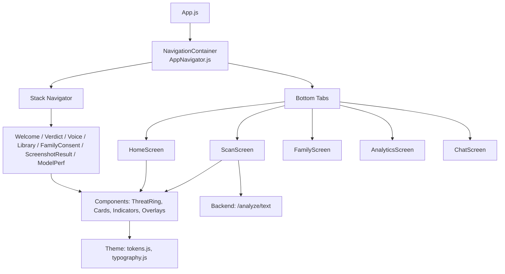
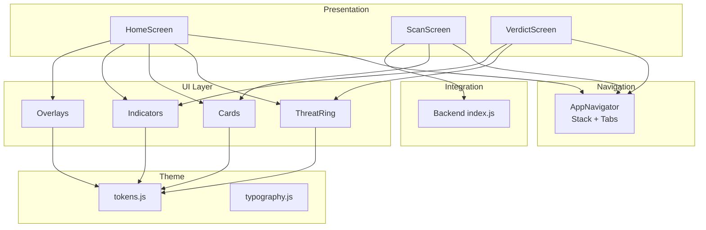
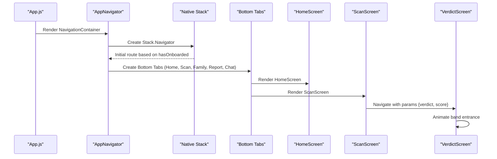
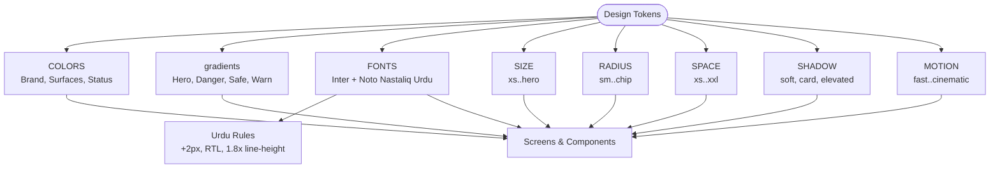
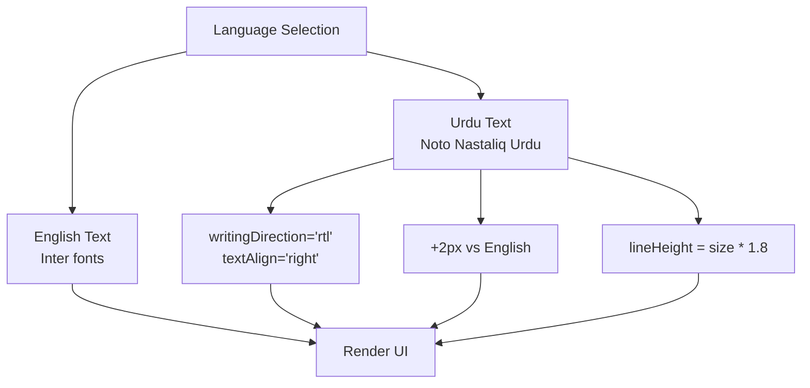
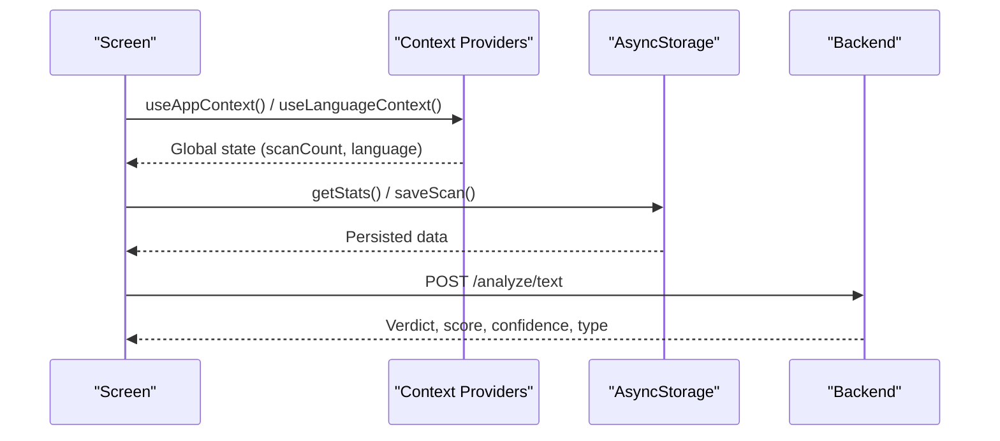
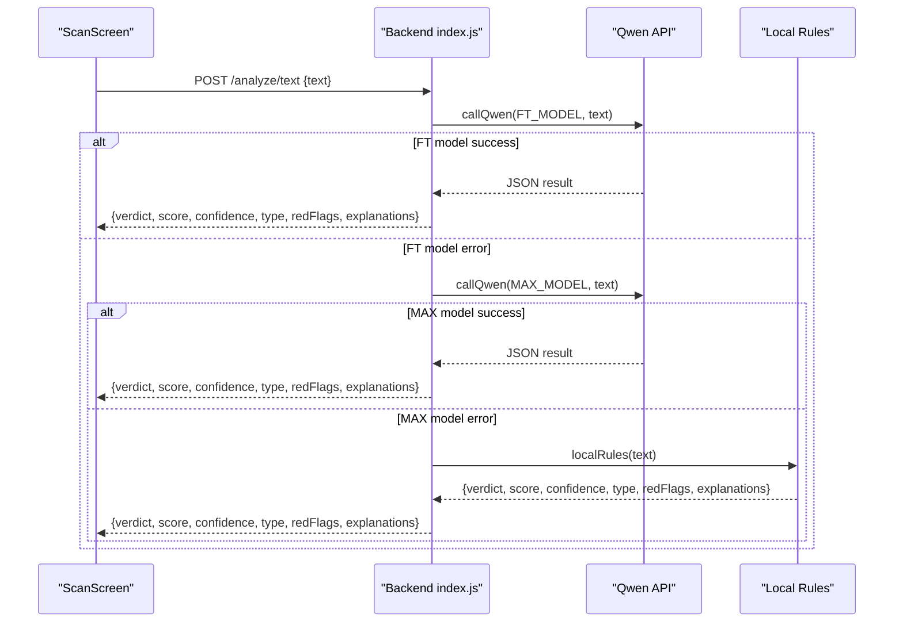
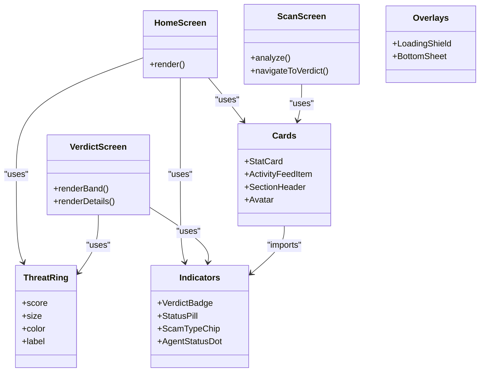
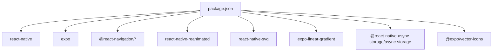

# Architecture & Design

<cite>
**Referenced Files in This Document**
- [App.js](file://App.js)
- [package.json](file://package.json)
- [src/navigation/AppNavigator.js](file://src/navigation/AppNavigator.js)
- [src/theme/tokens.js](file://src/theme/tokens.js)
- [src/theme/typography.js](file://src/theme/typography.js)
- [src/components/ThreatRing.js](file://src/components/ThreatRing.js)
- [src/components/Cards.js](file://src/components/Cards.js)
- [src/components/Indicators.js](file://src/components/Indicators.js)
- [src/components/Overlays.js](file://src/components/Overlays.js)
- [src/screens/HomeScreen.js](file://src/screens/HomeScreen.js)
- [src/screens/ScanScreen.js](file://src/screens/ScanScreen.js)
- [src/screens/VerdictScreen.js](file://src/screens/VerdictScreen.js)
- [backend/index.js](file://backend/index.js)
- [README.md](file://README.md)
</cite>

## Table of Contents
1. Introduction
2. Project Structure
3. Core Components
4. Architecture Overview
5. Detailed Component Analysis
6. Dependency Analysis
7. Performance Considerations
8. Troubleshooting Guide
9. Conclusion
10. Appendices

## Introduction
Safe Pakistan is a React Native (Expo) application that helps users detect scams and threats in SMS, voice, links, and family communications. It combines a consistent design system, reusable UI components, a clear navigation model, and backend integration for AI-powered analysis. The app supports bilingual content (English and Urdu) with RTL considerations and provides screens for scanning, verdicts, analytics, family management, and chat.

## Project Structure
The project follows a feature-oriented layout:
- App entry mounts fonts and the navigation container
- Navigation defines stack and tab routes
- Screens implement user flows
- Reusable components encapsulate UI primitives
- Theme tokens centralize colors, typography, spacing, shadows, gradients, and motion
- Backend exposes endpoints for analysis and family features

**Diagram sources**
- [App.js:21-43](file://App.js#L21-L43)
- [src/navigation/AppNavigator.js:32-101](file://src/navigation/AppNavigator.js#L32-L101)
- [src/screens/HomeScreen.js:23-104](file://src/screens/HomeScreen.js#L23-L104)
- [src/screens/ScanScreen.js:15-95](file://src/screens/ScanScreen.js#L15-L95)
- [src/theme/tokens.js:7-129](file://src/theme/tokens.js#L7-L129)
- [src/theme/typography.js:14-59](file://src/theme/typography.js#L14-L59)
- [backend/index.js:63-70](file://backend/index.js#L63-L70)

**Section sources**
- [App.js:21-43](file://App.js#L21-L43)
- [src/navigation/AppNavigator.js:32-101](file://src/navigation/AppNavigator.js#L32-L101)
- [package.json:11-34](file://package.json#L11-L34)

## Core Components
Reusable components provide consistent UI building blocks across screens:
- ThreatRing: Animated SVG ring showing threat score with smooth fill animation
- Cards: StatCard, FamilyMemberCard, ActivityFeedItem, SectionHeader, Avatar, LanguageChip, EmptyState
- Indicators: VerdictBadge, StatusPill, ScamTypeChip, AgentStatusDot
- Overlays: LoadingShield (animated shield + progress ring), BottomSheet

These components consume centralized theme tokens and typography presets to ensure visual consistency and accessibility.

**Section sources**
- [src/components/ThreatRing.js:18-83](file://src/components/ThreatRing.js#L18-L83)
- [src/components/Cards.js:13-145](file://src/components/Cards.js#L13-L145)
- [src/components/Indicators.js:11-77](file://src/components/Indicators.js#L11-L77)
- [src/components/Overlays.js:19-94](file://src/components/Overlays.js#L19-L94)
- [src/theme/tokens.js:7-129](file://src/theme/tokens.js#L7-L129)
- [src/theme/typography.js:14-59](file://src/theme/typography.js#L14-L59)

## Architecture Overview
Safe Pakistan uses a layered architecture:
- Presentation layer: Screens composed from reusable components
- Navigation layer: React Navigation v6 with native stack and bottom tabs
- Theme layer: Centralized tokens and typography presets
- Integration layer: Backend API for analysis and family features
- State layer: Context providers (planned) and local storage for persistence

**Diagram sources**
- [src/navigation/AppNavigator.js:32-101](file://src/navigation/AppNavigator.js#L32-L101)
- [src/screens/HomeScreen.js:23-104](file://src/screens/HomeScreen.js#L23-L104)
- [src/screens/ScanScreen.js:15-95](file://src/screens/ScanScreen.js#L15-L95)
- [src/screens/VerdictScreen.js:19-115](file://src/screens/VerdictScreen.js#L19-L115)
- [src/components/ThreatRing.js:18-83](file://src/components/ThreatRing.js#L18-L83)
- [src/components/Cards.js:13-145](file://src/components/Cards.js#L13-L145)
- [src/components/Indicators.js:11-77](file://src/components/Indicators.js#L11-L77)
- [src/components/Overlays.js:19-94](file://src/components/Overlays.js#L19-L94)
- [src/theme/tokens.js:7-129](file://src/theme/tokens.js#L7-L129)
- [src/theme/typography.js:14-59](file://src/theme/typography.js#L14-L59)
- [backend/index.js:63-70](file://backend/index.js#L63-L70)

## Detailed Component Analysis

### Navigation Structure (React Navigation v6)
- Stack navigator hosts full-screen flows: Welcome, Main, Verdict, Voice, Library, FamilyConsent, ScreenshotResult, ModelPerf
- Bottom tabs host primary destinations: Home, Scan, Family, Report (Analytics), Chat
- Tab bar styling uses theme tokens for active/inactive colors and elevation
- Animations are configured per screen (fade, slide_from_bottom)

**Diagram sources**
- [App.js:21-43](file://App.js#L21-L43)
- [src/navigation/AppNavigator.js:32-101](file://src/navigation/AppNavigator.js#L32-L101)
- [src/screens/ScanScreen.js:18-23](file://src/screens/ScanScreen.js#L18-L23)
- [src/screens/VerdictScreen.js:19-33](file://src/screens/VerdictScreen.js#L19-L33)

**Section sources**
- [src/navigation/AppNavigator.js:32-101](file://src/navigation/AppNavigator.js#L32-L101)

### Design System Implementation
- Colors: Brand palette (primary, accent, danger, warning), surfaces (light/dark), status helpers, transparent overlays
- Gradients: Hero, danger, safe, warn, safeBg with start/end positions
- Typography: English Inter weights; Urdu Noto Nastaliq Urdu with RTL rules (+2px size, right alignment, 1.8x line-height)
- Spacing and Radius: Consistent scale for padding/margins and corner radii
- Shadows: Brand-blue tinted shadows with platform-aware elevation
- Motion: Animation timings for Reanimated usage

**Diagram sources**
- [src/theme/tokens.js:7-129](file://src/theme/tokens.js#L7-L129)
- [src/theme/typography.js:14-59](file://src/theme/typography.js#L14-L59)

**Section sources**
- [src/theme/tokens.js:7-129](file://src/theme/tokens.js#L7-L129)
- [src/theme/typography.js:14-59](file://src/theme/typography.js#L14-L59)

### Bilingual Support (English and Urdu)
- English uses Inter font weights via FONTS.en*
- Urdu uses Noto Nastaliq Urdu with RTL direction and right-aligned text
- Typography presets enforce Urdu-specific sizing and line height
- Mixed language should be split into separate Text components to avoid layout issues
- Full RTL can be enabled at app start using I18nManager when needed

**Diagram sources**
- [src/theme/tokens.js:56-68](file://src/theme/tokens.js#L56-L68)
- [src/theme/typography.js:21-29](file://src/theme/typography.js#L21-L29)
- [README.md:130-153](file://README.md#L130-L153)

**Section sources**
- [src/theme/tokens.js:56-68](file://src/theme/tokens.js#L56-L68)
- [src/theme/typography.js:21-29](file://src/theme/typography.js#L21-L29)
- [README.md:130-153](file://README.md#L130-L153)

### State Management Approach
- Context providers are prepared but currently commented out in App.js; intended for global state (e.g., scan counts, language)
- Local storage via AsyncStorage is available for data persistence
- Screens include placeholders for context hooks and can be wired once import paths are confirmed

**Diagram sources**
- [App.js:17-20](file://App.js#L17-L20)
- [package.json:33-33](file://package.json#L33-L33)
- [README.md:173-201](file://README.md#L173-L201)

**Section sources**
- [App.js:17-20](file://App.js#L17-L20)
- [package.json:33-33](file://package.json#L33-L33)
- [README.md:173-201](file://README.md#L173-L201)

### Backend Integration Patterns
- Analysis endpoint accepts text and returns structured JSON with verdict, risk score, confidence, scam type, evidence spans, and explanations in multiple languages
- Fallback chain: custom fine-tuned model -> qwen-max -> local rule engine
- Additional endpoints for family pairing and guardian alerts

**Diagram sources**
- [src/screens/ScanScreen.js:18-23](file://src/screens/ScanScreen.js#L18-L23)
- [backend/index.js:16-43](file://backend/index.js#L16-L43)
- [backend/index.js:45-61](file://backend/index.js#L45-L61)
- [backend/index.js:63-70](file://backend/index.js#L63-L70)

**Section sources**
- [backend/index.js:16-43](file://backend/index.js#L16-L43)
- [backend/index.js:45-61](file://backend/index.js#L45-L61)
- [backend/index.js:63-70](file://backend/index.js#L63-L70)

### Component Relationships and Data Flow
- HomeScreen composes ThreatRing, StatCard, ActivityFeedItem, StatusPill, AgentStatusDot
- ScanScreen collects input and navigates to VerdictScreen with parameters
- VerdictScreen renders ThreatRing and indicators based on verdict type
- All components consume theme tokens and typography presets

**Diagram sources**
- [src/screens/HomeScreen.js:23-104](file://src/screens/HomeScreen.js#L23-L104)
- [src/screens/ScanScreen.js:15-95](file://src/screens/ScanScreen.js#L15-L95)
- [src/screens/VerdictScreen.js:19-115](file://src/screens/VerdictScreen.js#L19-L115)
- [src/components/ThreatRing.js:18-83](file://src/components/ThreatRing.js#L18-L83)
- [src/components/Cards.js:13-145](file://src/components/Cards.js#L13-L145)
- [src/components/Indicators.js:11-77](file://src/components/Indicators.js#L11-L77)
- [src/components/Overlays.js:19-94](file://src/components/Overlays.js#L19-L94)

**Section sources**
- [src/screens/HomeScreen.js:23-104](file://src/screens/HomeScreen.js#L23-L104)
- [src/screens/ScanScreen.js:15-95](file://src/screens/ScanScreen.js#L15-L95)
- [src/screens/VerdictScreen.js:19-115](file://src/screens/VerdictScreen.js#L19-L115)

## Dependency Analysis
Key dependencies enabling the architecture:
- Expo SDK and core RN libraries
- Navigation v6 packages for stack and tabs
- Reanimated for animations
- SVG for rings and graphics
- Linear gradient for hero surfaces
- AsyncStorage for persistence
- Vector icons for UI elements

**Diagram sources**
- [package.json:11-34](file://package.json#L11-L34)

**Section sources**
- [package.json:11-34](file://package.json#L11-L34)

## Performance Considerations
- Use shared values and animated props for smooth animations (Reanimated)
- Prefer lightweight components and avoid unnecessary re-renders
- Keep text concise and readable; large verdict explanations should be split into short lines
- Ensure touch targets meet minimum sizes for accessibility
- Use platform-aware shadows and elevation appropriately

[No sources needed since this section provides general guidance]

## Troubleshooting Guide
Common issues and resolutions:
- Font loading: Ensure all fonts are registered before rendering the navigator
- Navigation errors: Verify route names match those defined in AppNavigator
- Backend connectivity: Check environment variables and network requests; fallback to local rules if models fail
- RTL layout: Confirm writingDirection and textAlign for Urdu text; avoid mixing languages in single Text nodes
- Dependencies: Align versions of Reanimated, SVG, Screens, and Safe Area Context with Expo SDK

**Section sources**
- [App.js:21-43](file://App.js#L21-L43)
- [src/navigation/AppNavigator.js:32-101](file://src/navigation/AppNavigator.js#L32-L101)
- [backend/index.js:63-70](file://backend/index.js#L63-L70)
- [README.md:130-153](file://README.md#L130-L153)

## Conclusion
Safe Pakistan’s architecture separates concerns clearly: screens compose reusable components, navigation organizes flows, theme tokens unify visuals, and backend services provide intelligent analysis. The bilingual support ensures inclusive UX for English and Urdu audiences. With context providers and local storage ready for integration, the app is positioned for scalable state management and persistent data handling.

[No sources needed since this section summarizes without analyzing specific files]

## Appendices

### API Endpoints Summary
- POST /analyze/text: Analyzes text and returns verdict, score, confidence, type, evidence spans, and multilingual explanations
- POST /family/pair: Generates pairing code and expiration
- POST /alerts/guardian: Sends push notifications to guardians

**Section sources**
- [backend/index.js:63-80](file://backend/index.js#L63-L80)