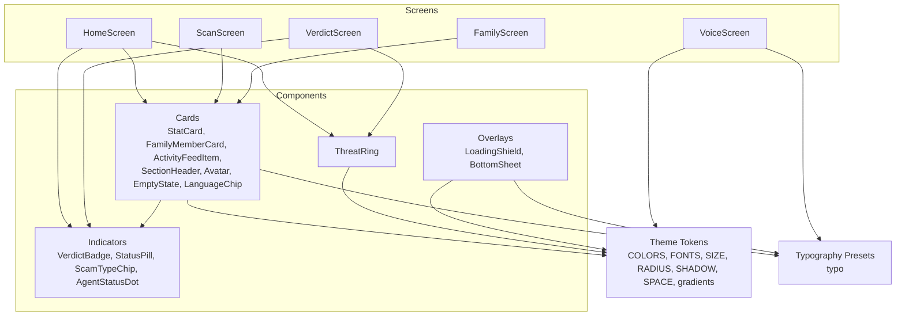
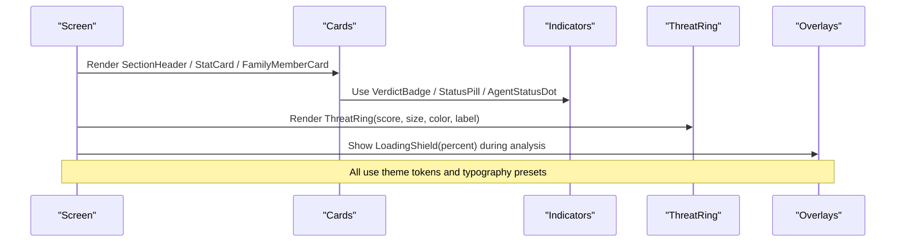
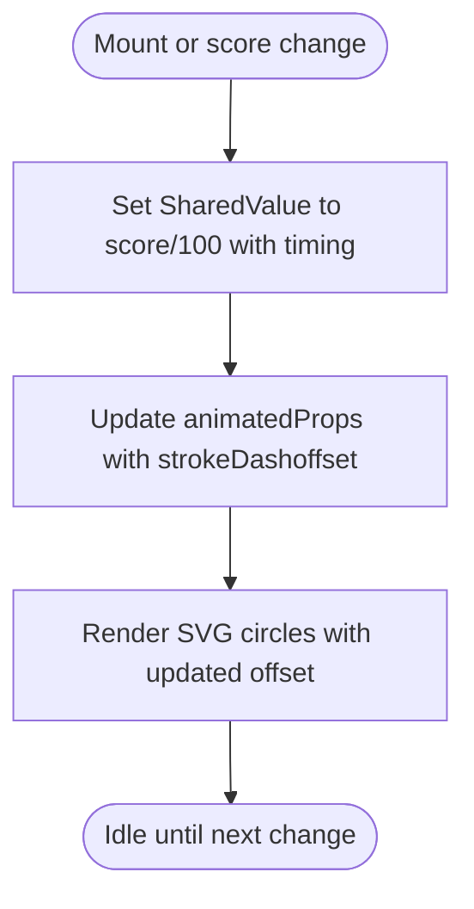
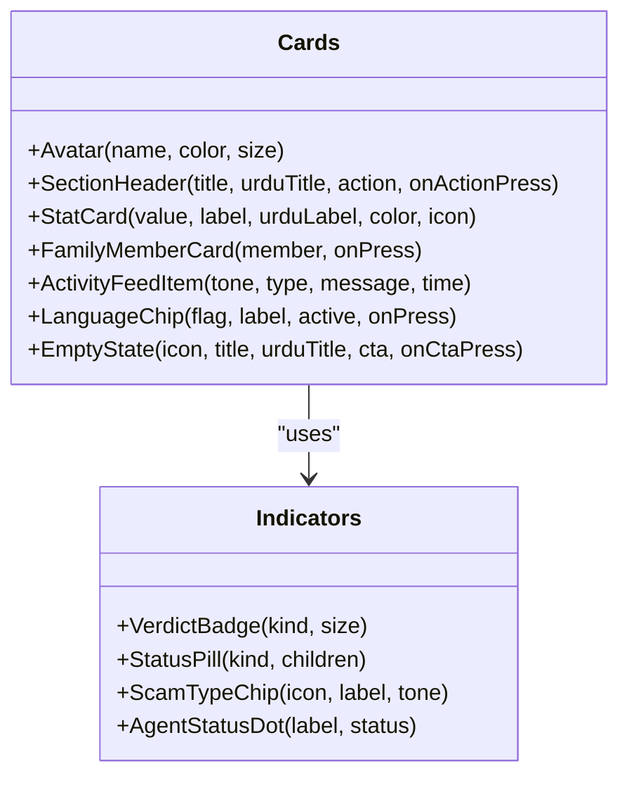
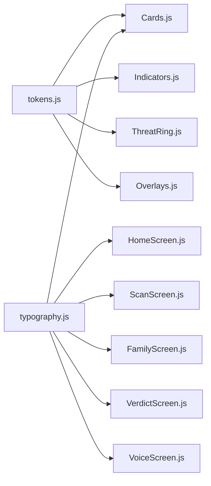

# Component Composition

<cite>
**Referenced Files in This Document**
- [ThreatRing.js](file://src/components/ThreatRing.js)
- [Cards.js](file://src/components/Cards.js)
- [Indicators.js](file://src/components/Indicators.js)
- [Overlays.js](file://src/components/Overlays.js)
- [tokens.js](file://src/theme/tokens.js)
- [typography.js](file://src/theme/typography.js)
- [HomeScreen.js](file://src/screens/HomeScreen.js)
- [ScanScreen.js](file://src/screens/ScanScreen.js)
- [FamilyScreen.js](file://src/screens/FamilyScreen.js)
- [VerdictScreen.js](file://src/screens/VerdictScreen.js)
- [VoiceScreen.js](file://src/screens/VoiceScreen.js)
</cite>

## Table of Contents
1. Introduction
2. Project Structure
3. Core Components
4. Architecture Overview
5. Detailed Component Analysis
6. Dependency Analysis
7. Performance Considerations
8. Troubleshooting Guide
9. Conclusion

## Introduction
This document explains how the Safe Pakistan application composes reusable UI components to build rich screens. It focuses on the component hierarchy and composition patterns used across the app, with special attention to:
- ThreatRing (animated circular progress indicator)
- Cards (content containers such as StatCard, FamilyMemberCard, ActivityFeedItem, SectionHeader, Avatar, EmptyState, LanguageChip)
- Indicators (status and progress indicators like VerdictBadge, StatusPill, ScamTypeChip, AgentStatusDot)
- Overlays (LoadingShield and BottomSheet)

It also documents props interfaces, event handling, styling overrides, animation implementation using React Native Reanimated, and performance best practices for reusability.

## Project Structure
The app organizes UI into a clear separation:
- Components: small, reusable building blocks (cards, indicators, overlays, ring)
- Screens: compose multiple components to implement user flows
- Theme: centralized design tokens (colors, typography, spacing, shadows, gradients)

**Diagram sources**
- [HomeScreen.js:17-19](file://src/screens/HomeScreen.js#L17-L19)
- [ScanScreen.js:13](file://src/screens/ScanScreen.js#L13)
- [FamilyScreen.js:18](file://src/screens/FamilyScreen.js#L18)
- [VerdictScreen.js:14-15](file://src/screens/VerdictScreen.js#L14-L15)
- [VoiceScreen.js:18-19](file://src/screens/VoiceScreen.js#L18-L19)
- [Cards.js:8-10](file://src/components/Cards.js#L8-L10)
- [ThreatRing.js:14](file://src/components/ThreatRing.js#L14)
- [Overlays.js:13](file://src/components/Overlays.js#L13)

**Section sources**
- [HomeScreen.js:1-158](file://src/screens/HomeScreen.js#L1-L158)
- [ScanScreen.js:1-151](file://src/screens/ScanScreen.js#L1-L151)
- [FamilyScreen.js:1-101](file://src/screens/FamilyScreen.js#L1-L101)
- [VerdictScreen.js:1-268](file://src/screens/VerdictScreen.js#L1-L268)
- [VoiceScreen.js:1-228](file://src/screens/VoiceScreen.js#L1-L228)
- [Cards.js:1-193](file://src/components/Cards.js#L1-L193)
- [Indicators.js:1-106](file://src/components/Indicators.js#L1-L106)
- [ThreatRing.js:1-92](file://src/components/ThreatRing.js#L1-L92)
- [Overlays.js:1-123](file://src/components/Overlays.js#L1-L123)
- [tokens.js:1-129](file://src/theme/tokens.js#L1-L129)
- [typography.js:1-60](file://src/theme/typography.js#L1-L60)

## Core Components
This section summarizes each core component’s purpose, props interface, customization options, events, and styling hooks.

### ThreatRing
- Purpose: Animated circular SVG progress ring that visualizes a score from 0–100 with smooth fill animation.
- Props:
  - score: number (0–100), default 96
  - size: number, default 140
  - color: string (color token or hex), default danger
  - label: string, optional; shown below the score
- Events: none
- Styling:
  - Uses theme tokens for colors and fonts
  - Stroke width is derived from size
  - Center text uses tabular numerals and custom font weights
- Animation:
  - Uses Reanimated SharedValue and Animated.createAnimatedComponent for circle strokeDashoffset
  - Animates on mount and when score changes with easing

**Section sources**
- [ThreatRing.js:18-83](file://src/components/ThreatRing.js#L18-L83)
- [ThreatRing.js:29-38](file://src/components/ThreatRing.js#L29-L38)
- [ThreatRing.js:40-81](file://src/components/ThreatRing.js#L40-L81)

### Cards
- Purpose: Reusable content containers and list items for dashboards and lists.
- Key exports and props:
  - Avatar(name, color, size): displays initials in a colored circle
  - SectionHeader(title, urduTitle, action, onActionPress): section title with optional action button
  - StatCard(value, label, urduLabel, color, icon): metric card with icon and optional Urdu label
  - FamilyMemberCard(member, onPress): row with avatar, name, role badge, last protected time, and status pill
  - ActivityFeedItem(tone, type, message, time): feed item with dot, verdict badge, and timestamp
  - LanguageChip(flag, label, active, onPress): language selector chip
  - EmptyState(icon, title, urduTitle, cta, onCtaPress): empty state with optional call-to-action
- Events:
  - onActionPress for SectionHeader
  - onPress for FamilyMemberCard, LanguageChip, EmptyState CTA
- Styling:
  - Uses tokens for colors, radii, shadows, spacing
  - Typography via typo presets for consistent English/Urdu styles

**Section sources**
- [Cards.js:12-26](file://src/components/Cards.js#L12-L26)
- [Cards.js:29-45](file://src/components/Cards.js#L29-L45)
- [Cards.js:47-59](file://src/components/Cards.js#L47-L59)
- [Cards.js:61-86](file://src/components/Cards.js#L61-L86)
- [Cards.js:88-110](file://src/components/Cards.js#L88-L110)
- [Cards.js:112-127](file://src/components/Cards.js#L112-L127)
- [Cards.js:129-145](file://src/components/Cards.js#L129-L145)

### Indicators
- Purpose: Small inline status and verdict indicators used across cards and screens.
- Exports and props:
  - VerdictBadge(kind, size): kind can be scam/safe/susp; size sm/md; shows icon + label
  - StatusPill(kind, children): kind safe/danger/warn/info/off; left border color and background/text vary
  - ScamTypeChip(icon, label, tone): tone danger/warn/info; styled chip
  - AgentStatusDot(label, status): status on/busy/default; shows dot and label
- Styling:
  - Uses tokens for colors, radii, sizes
  - Consistent small-footprint design for dense layouts

**Section sources**
- [Indicators.js:10-27](file://src/components/Indicators.js#L10-L27)
- [Indicators.js:29-43](file://src/components/Indicators.js#L29-L43)
- [Indicators.js:45-58](file://src/components/Indicators.js#L45-L58)
- [Indicators.js:60-77](file://src/components/Indicators.js#L60-L77)

### Overlays
- Purpose: Modal-like overlays for loading states and bottom sheets.
- Exports and props:
  - LoadingShield(percent, size): animated shield with gradient and pulsing core; ring fills based on percent
  - BottomSheet(visible, onClose, children, title): modal with backdrop, handle, optional title, and slide animation
- Events:
  - onClose for BottomSheet
- Styling:
  - Uses tokens for gradients, colors, fonts
  - Backdrop overlay and sheet radius/shadow

**Section sources**
- [Overlays.js:18-80](file://src/components/Overlays.js#L18-L80)
- [Overlays.js:82-94](file://src/components/Overlays.js#L82-L94)

## Architecture Overview
The app follows a layered composition model:
- Screens import and combine components to build complex UIs
- Components consume shared design tokens and typography presets for consistency
- Animations are implemented with Reanimated for smooth transitions and interactions

**Diagram sources**
- [HomeScreen.js:17-19](file://src/screens/HomeScreen.js#L17-L19)
- [VerdictScreen.js:14-15](file://src/screens/VerdictScreen.js#L14-L15)
- [Cards.js:8-10](file://src/components/Cards.js#L8-L10)
- [ThreatRing.js:14](file://src/components/ThreatRing.js#L14)
- [Overlays.js:13](file://src/components/Overlays.js#L13)

## Detailed Component Analysis

### ThreatRing: Animated Circular Progress Indicator
- Data flow:
  - On mount or prop change, a SharedValue animates from 0 to score/100
  - AnimatedProps update strokeDashoffset to reflect progress
- Complexity:
  - Time complexity per render: O(1)
  - Space complexity: O(1) additional memory for SharedValues
- Optimization opportunities:
  - Memoize expensive calculations if size changes frequently
  - Avoid unnecessary re-renders by stabilizing props
- Error handling:
  - Ensures stroke width is at least a minimum value to prevent rendering issues
- Best practices:
  - Keep score within 0–100
  - Use theme tokens for color consistency

**Diagram sources**
- [ThreatRing.js:27-38](file://src/components/ThreatRing.js#L27-L38)
- [ThreatRing.js:40-64](file://src/components/ThreatRing.js#L40-L64)

**Section sources**
- [ThreatRing.js:18-83](file://src/components/ThreatRing.js#L18-L83)

### Cards: Content Containers and List Items
- Composition patterns:
  - SectionHeader composes Text and Pressable for actions
  - StatCard combines Icon, Text, and shadow tokens
  - FamilyMemberCard composes Avatar, StatusPill, and layout primitives
  - ActivityFeedItem composes VerdictBadge and typography presets
- Event handling:
  - onActionPress triggers navigation or other side effects
  - onPress on FamilyMemberCard and LanguageChip enables user interaction
- Styling:
  - Uses tokens for consistent radii, shadows, and colors
  - Leverages typography presets for bilingual support

**Diagram sources**
- [Cards.js:12-145](file://src/components/Cards.js#L12-L145)
- [Indicators.js:10-77](file://src/components/Indicators.js#L10-L77)

**Section sources**
- [Cards.js:12-145](file://src/components/Cards.js#L12-L145)
- [Indicators.js:10-77](file://src/components/Indicators.js#L10-L77)

### Indicators: Status and Progress Indicators
- Design:
  - VerdictBadge maps kinds to labels, backgrounds, and icons
  - StatusPill uses left border color and themed backgrounds/text
  - ScamTypeChip provides tone-based chips for evidence display
  - AgentStatusDot shows agent availability with subtle glow
- Usage:
  - Embedded in Cards and Screens for compact status communication

**Section sources**
- [Indicators.js:10-77](file://src/components/Indicators.js#L10-L77)

### Overlays: Modal and Popup Components
- LoadingShield:
  - Animates ring fill and pulsing core using Reanimated
  - Uses gradients and SVG for visual polish
- BottomSheet:
  - Modal wrapper with backdrop and slide animation
  - Provides handle and optional title for context

**Section sources**
- [Overlays.js:18-94](file://src/components/Overlays.js#L18-L94)

### Screen Composition Examples
- HomeScreen:
  - Composes Hero gradient, ThreatRing, StatusPill, AgentStatusDot, StatCard, SectionHeader, ActivityFeedItem
  - Demonstrates combining indicators and cards for dashboard layout
- ScanScreen:
  - Uses SectionHeader and ActivityFeedItem for recent activity
  - Local input and CTA demonstrate simple composition without heavy dependencies
- FamilyScreen:
  - Uses Avatar, SectionHeader, FamilyMemberCard to present family members
  - Shows stacked composition of cards for lists
- VerdictScreen:
  - Combines ThreatRing, ScamTypeChip, and local detail components
  - Uses Reanimated entrance animations for band and ring
- VoiceScreen:
  - Implements advanced Reanimated animations (ripples, waveform)
  - Uses typography presets and gradients for immersive experience

**Section sources**
- [HomeScreen.js:23-104](file://src/screens/HomeScreen.js#L23-L104)
- [ScanScreen.js:15-95](file://src/screens/ScanScreen.js#L15-L95)
- [FamilyScreen.js:27-85](file://src/screens/FamilyScreen.js#L27-L85)
- [VerdictScreen.js:19-116](file://src/screens/VerdictScreen.js#L19-L116)
- [VoiceScreen.js:27-120](file://src/screens/VoiceScreen.js#L27-L120)

## Dependency Analysis
- Theme tokens provide a single source of truth for colors, fonts, sizes, radii, shadows, and gradients
- Typography presets standardize English and Urdu text styles
- Components depend on tokens and typography for consistent visuals
- Screens orchestrate components and may add local animations

**Diagram sources**
- [tokens.js:7-54](file://src/theme/tokens.js#L7-L54)
- [typography.js:31-55](file://src/theme/typography.js#L31-L55)
- [Cards.js:8-10](file://src/components/Cards.js#L8-L10)
- [Indicators.js:8](file://src/components/Indicators.js#L8)
- [ThreatRing.js:14](file://src/components/ThreatRing.js#L14)
- [Overlays.js:13](file://src/components/Overlays.js#L13)

**Section sources**
- [tokens.js:1-129](file://src/theme/tokens.js#L1-L129)
- [typography.js:1-60](file://src/theme/typography.js#L1-L60)

## Performance Considerations
- Prefer functional components and memoization where props change frequently
- Use Reanimated SharedValues for smooth animations off the main thread
- Avoid deep nesting of animated views; keep animations localized to specific components
- Stabilize props to minimize re-renders (e.g., pass stable handlers and objects)
- Use theme tokens consistently to reduce style duplication and improve maintainability
- For lists (e.g., ActivityFeedItem), ensure keys are stable and data is minimal

[No sources needed since this section provides general guidance]

## Troubleshooting Guide
- ThreatRing not animating:
  - Ensure score prop updates trigger re-render and SharedValue reset
  - Verify react-native-svg and Reanimated are installed and linked
- BottomSheet not closing:
  - Confirm visible prop toggles correctly and onRequestClose/onClose handlers are wired
- Inconsistent styling:
  - Check that components import tokens and typography presets correctly
  - Validate color tokens exist and match expected values
- Animation jank:
  - Reduce number of concurrent animations
  - Use withTiming/withSpring appropriately and avoid heavy computations inside animated callbacks

**Section sources**
- [ThreatRing.js:29-38](file://src/components/ThreatRing.js#L29-L38)
- [Overlays.js:82-94](file://src/components/Overlays.js#L82-L94)

## Conclusion
Safe Pakistan’s UI is built around a cohesive set of reusable components that leverage shared design tokens and typography presets. The component hierarchy emphasizes clarity and reusability:
- ThreatRing provides animated progress visualization
- Cards offer flexible content containers and list items
- Indicators communicate status and verdicts succinctly
- Overlays deliver modal experiences with polished animations

By composing these components thoughtfully, screens achieve rich, accessible interfaces while maintaining performance and consistency. Following the documented props interfaces, event handling patterns, and animation practices ensures scalable and maintainable development.