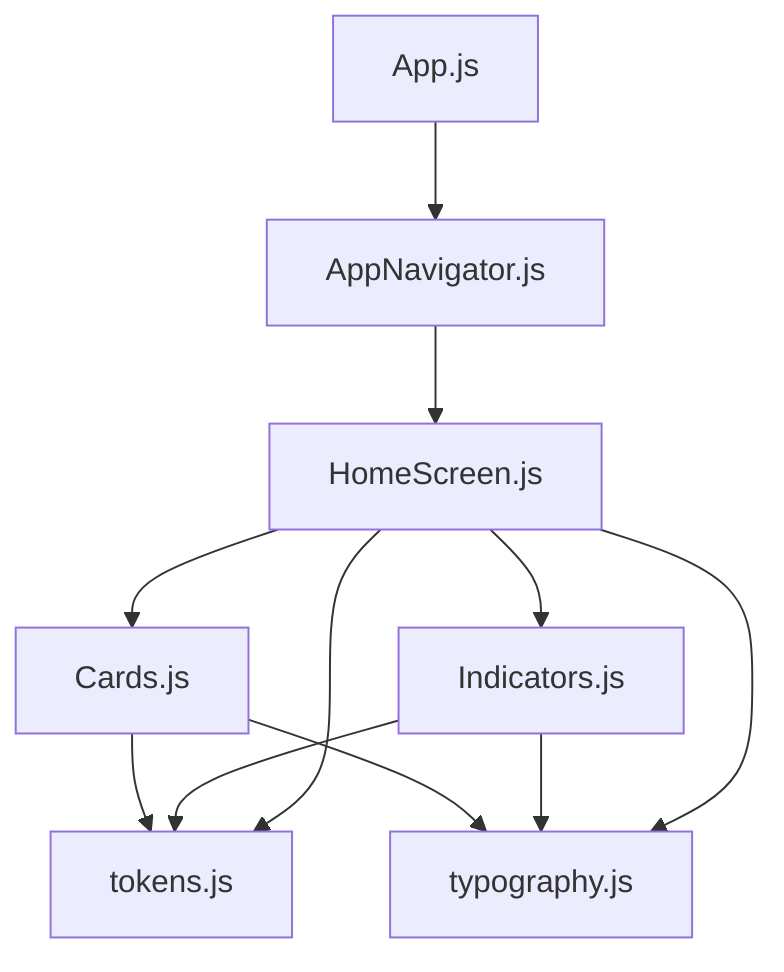
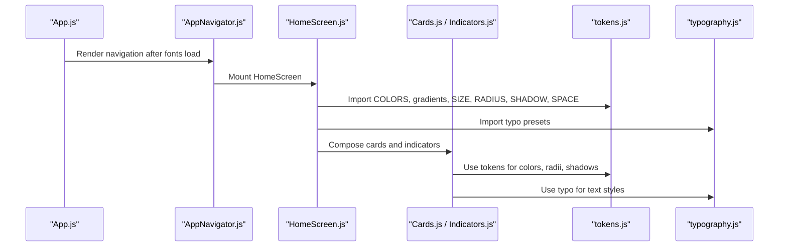
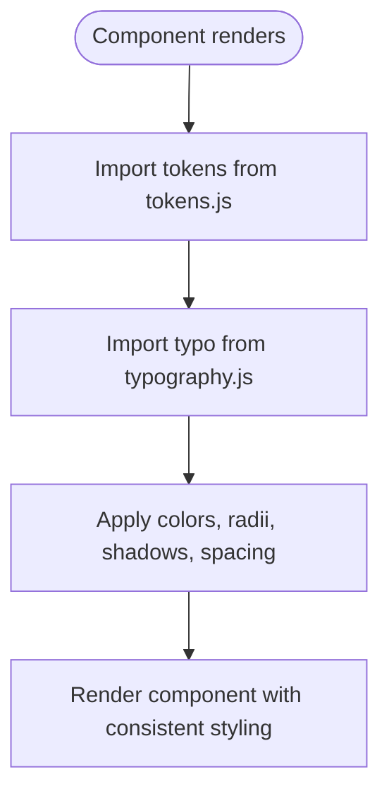
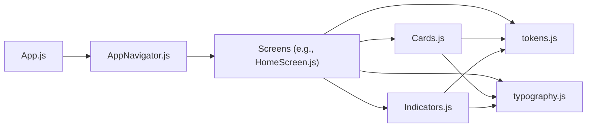

# Design System

<cite>
**Referenced Files in This Document**
- [tokens.js](file://src/theme/tokens.js)
- [typography.js](file://src/theme/typography.js)
- [App.js](file://App.js)
- [DESIGN_RULES.md](file://DESIGN_RULES.md)
- [README.md](file://README.md)
- [Cards.js](file://src/components/Cards.js)
- [Indicators.js](file://src/components/Indicators.js)
- [HomeScreen.js](file://src/screens/HomeScreen.js)
- [AppNavigator.js](file://src/navigation/AppNavigator.js)
</cite>

## Table of Contents
1. Introduction
2. Project Structure
3. Core Components
4. Architecture Overview
5. Detailed Component Analysis
6. Dependency Analysis
7. Performance Considerations
8. Troubleshooting Guide
9. Conclusion
10. Appendices

## Introduction
This document describes the Safe Pakistan design system with a focus on token-based theming, typography, color scheme (including dark mode tokens), responsive behavior, bilingual support (English and Urdu with RTL considerations), and guidelines for extending the system consistently across the application. It explains how components consume tokens to maintain visual consistency and accessibility.

## Project Structure
The design system is centralized under src/theme:
- tokens.js defines colors, gradients, fonts, sizes, spacing, radius, shadows, and motion timings.
- typography.js builds reusable text styles for English and Urdu, enforcing RTL rules and size adjustments for Nastaliq.

Components and screens import these tokens to style UI elements uniformly. The app entry loads fonts required by the typography system before rendering navigation.

**Diagram sources**
- [App.js:21-43](file://App.js#L21-L43)
- [AppNavigator.js:17-30](file://src/navigation/AppNavigator.js#L17-L30)
- [HomeScreen.js:15-20](file://src/screens/HomeScreen.js#L15-L20)
- [Cards.js:8-10](file://src/components/Cards.js#L8-L10)
- [Indicators.js:8-8](file://src/components/Indicators.js#L8-L8)
- [tokens.js:1-129](file://src/theme/tokens.js#L1-L129)
- [typography.js:1-60](file://src/theme/typography.js#L1-L60)

**Section sources**
- [App.js:21-43](file://App.js#L21-L43)
- [AppNavigator.js:17-30](file://src/navigation/AppNavigator.js#L17-L30)
- [tokens.js:1-129](file://src/theme/tokens.js#L1-L129)
- [typography.js:1-60](file://src/theme/typography.js#L1-L60)

## Core Components
- Token registry: Centralized values for colors, gradients, fonts, sizes, spacing, radius, shadows, and motion.
- Typography presets: Prebuilt TextStyle objects for English and Urdu that enforce RTL, sizing rules, and line-heights.
- Reusable UI primitives: Cards and indicators that consume tokens and typography to render consistent UI.

Key responsibilities:
- tokens.js: Single source of truth for all visual values.
- typography.js: Encapsulates language-specific styling rules and provides ready-to-use text styles.
- Components: Apply tokens and typography without hardcoding values.

**Section sources**
- [tokens.js:7-129](file://src/theme/tokens.js#L7-L129)
- [typography.js:14-59](file://src/theme/typography.js#L14-L59)
- [Cards.js:8-10](file://src/components/Cards.js#L8-L10)
- [Indicators.js:8-8](file://src/components/Indicators.js#L8-L8)

## Architecture Overview
The design system follows a token-driven architecture:
- Tokens define brand colors, surfaces, status helpers, gradients, fonts, sizes, spacing, radius, shadows, and motion.
- Typography composes tokens into reusable text styles for English and Urdu, including RTL and line-height rules.
- Screens and components import tokens and typography to build UI consistently.

**Diagram sources**
- [App.js:21-43](file://App.js#L21-L43)
- [AppNavigator.js:17-30](file://src/navigation/AppNavigator.js#L17-L30)
- [HomeScreen.js:15-20](file://src/screens/HomeScreen.js#L15-L20)
- [Cards.js:8-10](file://src/components/Cards.js#L8-L10)
- [Indicators.js:8-8](file://src/components/Indicators.js#L8-L8)
- [tokens.js:1-129](file://src/theme/tokens.js#L1-L129)
- [typography.js:1-60](file://src/theme/typography.js#L1-L60)

## Detailed Component Analysis

### Token-Based Theming (tokens.js)
- Color palette:
  - Brand: primary, primaryDk, primaryLt, accent, accentDk, danger, warning.
  - Surfaces (light): bg, surface, surface2, text, textMuted, border.
  - Surfaces (dark): bgDark, surfaceDark, surface2Dark, textDark, borderDark.
  - Status helpers: safeBg/safeText, dangerBg/dangerText, warnBg/warnText.
  - Transparent: white, black, overlay.
- Gradients: hero, danger, safe, warn, safeBg with start/end vectors for linear gradients.
- Fonts: Inter variants for English; Noto Nastaliq Urdu for Urdu.
- Sizes: xs through hero for font sizes.
- Spacing: 8pt-derived scale (xs, sm, md, lg, xl, xxl).
- Radius: sm, icon, btn, card, chip.
- Shadows: soft, card, elevated — brand-blue tinted with elevation and iOS shadow properties.
- Motion: fast, base, slow, cinematic timings.

Usage examples in code:
- Colors applied to backgrounds, borders, and text via tokens.
- Gradients used on hero surfaces.
- Shadows applied to cards and elevated surfaces.
- Radii applied to buttons and chips.

Accessibility notes:
- Contrast ratios meet WCAG AA for key pairs as documented.
- Hit targets are sized appropriately per design rules.

Extending tokens:
- Add new semantic colors or status helpers to COLORS.
- Extend gradients with new color stops and directions.
- Add new sizes or spacing values only when necessary, then update typography and components accordingly.

**Section sources**
- [tokens.js:7-129](file://src/theme/tokens.js#L7-L129)
- [DESIGN_RULES.md:53-113](file://DESIGN_RULES.md#L53-L113)
- [README.md:85-101](file://README.md#L85-L101)

### Typography System (typography.js)
- English presets: heroEn, titleEn, h1En, h2En, bodyEn, bodyEnSm, labelEn, numberEn, scoreEn.
- Urdu presets: heroUr, titleUr, bodyUr, bodyUrSm, labelUr.
- Inverse presets for dark/gradient backgrounds: heroEnInv, titleEnInv, bodyEnInv, bodyUrInv.
- Rules enforced:
  - Urdu uses FONTS.urdu.
  - Urdu size = English equivalent + 2px via urduSize helper.
  - Urdu lineHeight = fontSize * 1.8.
  - writingDirection: 'rtl', textAlign: 'right'.
  - Never mix Urdu and English in one Text node.

Typography consumption:
- Components use typo presets for headings, body text, labels, and numbers.
- Screens apply inverse presets for text over gradients or dark surfaces.

**Section sources**
- [typography.js:14-59](file://src/theme/typography.js#L14-L59)
- [Cards.js:33-34](file://src/components/Cards.js#L33-L34)
- [HomeScreen.js:71-72](file://src/screens/HomeScreen.js#L71-L72)

### Color Scheme and Dark Mode
- Light mode surfaces: bg, surface, surface2, text, textMuted, border.
- Dark mode surfaces: bgDark, surfaceDark, surface2Dark, textDark, borderDark.
- Status helpers provide accessible backgrounds and text for safe, danger, and warning states.
- README documents contrast ratios for key combinations.
- Note: Dark mode tokens exist; theme switching can be implemented by swapping color sets based on color scheme context.

Guidelines:
- Use semantic tokens (e.g., COLORS.text vs hardcoded hex).
- Ensure contrast meets WCAG AA for both light and dark modes.
- Use status helpers for feedback states to maintain consistency.

**Section sources**
- [tokens.js:17-44](file://src/theme/tokens.js#L17-L44)
- [README.md:226-235](file://README.md#L226-L235)
- [README.md:268-270](file://README.md#L268-L270)

### Responsive Design Patterns
- Layout constraints:
  - Frame target 390 × 844; screens should fit without vertical scroll unless designated scrollers.
  - Horizontal overflow allowed for swipeable chip rails.
- Spacing and radii:
  - Use SPACE tokens for gutters and paddings.
  - Use RADIUS tokens for consistent corner radii.
- Hit targets:
  - Minimum 44 × 44 for interactive elements.
- Navigation:
  - Bottom tab bar fixed with appropriate height and safe area handling.

Implementation references:
- HomeScreen uses ScrollView with padding and contentContainerStyle for layout.
- AppNavigator configures tab bar height and platform differences.

**Section sources**
- [DESIGN_RULES.md:142-154](file://DESIGN_RULES.md#L142-L154)
- [HomeScreen.js:37-40](file://src/screens/HomeScreen.js#L37-L40)
- [AppNavigator.js:104-120](file://src/navigation/AppNavigator.js#L104-L120)

### Bilingual Support and RTL Layout
- English uses Inter fonts; Urdu uses Noto Nastaliq Urdu.
- Urdu typography enforces RTL direction, right alignment, increased line-height, and +2px size adjustment.
- Separate Text nodes for English and Urdu to avoid mixed-direction issues.
- Roman Urdu uses English medium font and LTR direction.

Font loading:
- App.js loads Inter and Noto Nastaliq Urdu fonts before rendering navigation.

**Section sources**
- [typography.js:21-29](file://src/theme/typography.js#L21-L29)
- [DESIGN_RULES.md:116-126](file://DESIGN_RULES.md#L116-L126)
- [App.js:22-26](file://App.js#L22-L26)

### How Components Consume Design Tokens
Examples:
- Cards:
  - StatCard applies SHADOW.card, RADIUS.card, COLORS.surface/border, and typography presets.
  - SectionHeader uses typo.h2En and typo.bodyUrSm for bilingual headers.
- Indicators:
  - VerdictBadge and StatusPill use COLORS for backgrounds and text, RADIUS.chip for rounded shapes.
- HomeScreen:
  - Hero uses gradients.hero and SHADOW.elevated.
  - Uses STATUS helpers and typography for bilingual messaging.

**Diagram sources**
- [Cards.js:8-10](file://src/components/Cards.js#L8-L10)
- [Indicators.js:8-8](file://src/components/Indicators.js#L8-L8)
- [HomeScreen.js:15-20](file://src/screens/HomeScreen.js#L15-L20)
- [tokens.js:1-129](file://src/theme/tokens.js#L1-L129)
- [typography.js:1-60](file://src/theme/typography.js#L1-L60)

**Section sources**
- [Cards.js:48-58](file://src/components/Cards.js#L48-L58)
- [Indicators.js:11-27](file://src/components/Indicators.js#L11-L27)
- [HomeScreen.js:61-82](file://src/screens/HomeScreen.js#L61-L82)

## Dependency Analysis
- App.js depends on font loaders and mounts AppNavigator.
- AppNavigator imports tokens for tab bar styling and registers screens.
- Screens import tokens and typography to compose layouts and text.
- Components import tokens and typography to render consistent UI primitives.

**Diagram sources**
- [App.js:21-43](file://App.js#L21-L43)
- [AppNavigator.js:17-30](file://src/navigation/AppNavigator.js#L17-L30)
- [HomeScreen.js:15-20](file://src/screens/HomeScreen.js#L15-L20)
- [Cards.js:8-10](file://src/components/Cards.js#L8-L10)
- [Indicators.js:8-8](file://src/components/Indicators.js#L8-L8)
- [tokens.js:1-129](file://src/theme/tokens.js#L1-L129)
- [typography.js:1-60](file://src/theme/typography.js#L1-L60)

**Section sources**
- [App.js:21-43](file://App.js#L21-L43)
- [AppNavigator.js:17-30](file://src/navigation/AppNavigator.js#L17-L30)
- [HomeScreen.js:15-20](file://src/screens/HomeScreen.js#L15-L20)
- [Cards.js:8-10](file://src/components/Cards.js#L8-L10)
- [Indicators.js:8-8](file://src/components/Indicators.js#L8-L8)

## Performance Considerations
- Prefer token usage to avoid recalculating or duplicating values.
- Use prebuilt typography presets to reduce style object creation overhead.
- Keep animations within MOTION timings for consistent performance.
- Avoid mixing languages in a single Text node to prevent shaping/layout costs.
- Use ScrollView sparingly; prefer horizontal swipeable lists where appropriate.

[No sources needed since this section provides general guidance]

## Troubleshooting Guide
Common issues and checks:
- Hardcoded colors outside tokens:
  - Run grep to find raw hex values in screens/components; ensure they are replaced with tokens.
- Forbidden fonts:
  - Ensure only Inter and Noto Nastaliq Urdu are used.
- Animation libraries:
  - Confirm Reanimated usage instead of core Animated.
- Boot issues:
  - Verify fonts are loaded before rendering navigation.

Validation steps:
- Check for zero hardcoded colors outside tokens.
- Inspect animation imports.
- Validate font names.
- Start the app to confirm clean boot.

**Section sources**
- [DESIGN_RULES.md:172-189](file://DESIGN_RULES.md#L172-L189)
- [App.js:21-43](file://App.js#L21-L43)

## Conclusion
Safe Pakistan’s design system centralizes visual identity through tokens and typography, ensuring consistency, accessibility, and bilingual support. Components consume these tokens to render cohesive UIs across screens. Extending the system requires adding tokens first and then applying them throughout the app to maintain uniformity.

[No sources needed since this section summarizes without analyzing specific files]

## Appendices

### Guidelines for Extending the Design System
- Adding colors:
  - Define new semantic colors in COLORS in tokens.js.
  - Update components to use the new tokens rather than hardcoding values.
- Adding fonts:
  - Register fonts in App.js and add entries in FONTS in tokens.js.
  - Create corresponding typography presets if needed.
- Adding spacing or sizes:
  - Extend SIZE or SPACE in tokens.js.
  - Update typography presets and components to use the new values.
- Maintaining RTL and accessibility:
  - For Urdu, always apply RTL direction, right alignment, and adjusted line-height.
  - Ensure contrast ratios meet WCAG AA for new color combinations.

**Section sources**
- [tokens.js:7-129](file://src/theme/tokens.js#L7-L129)
- [typography.js:14-59](file://src/theme/typography.js#L14-L59)
- [App.js:22-26](file://App.js#L22-L26)
- [DESIGN_RULES.md:116-126](file://DESIGN_RULES.md#L116-L126)