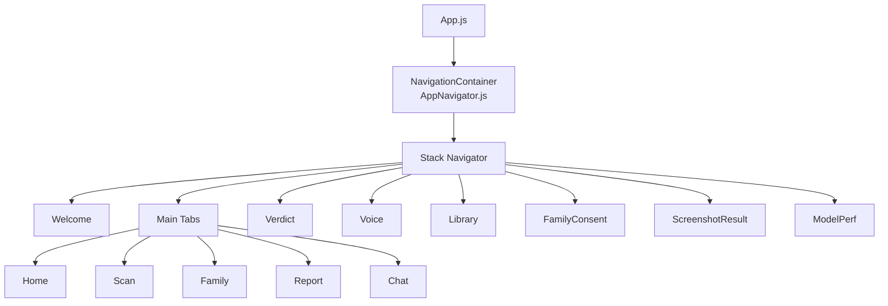
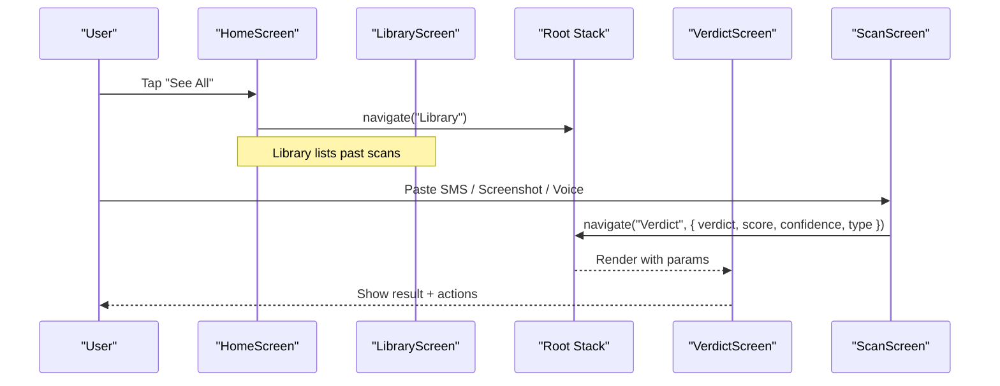
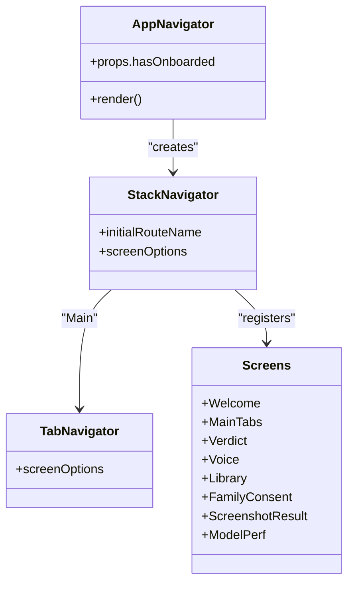
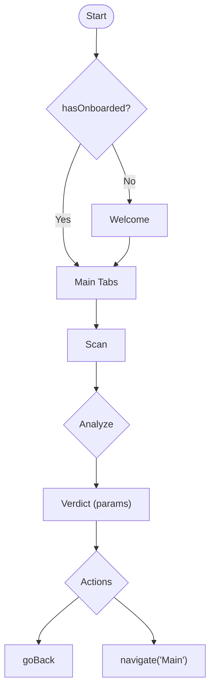
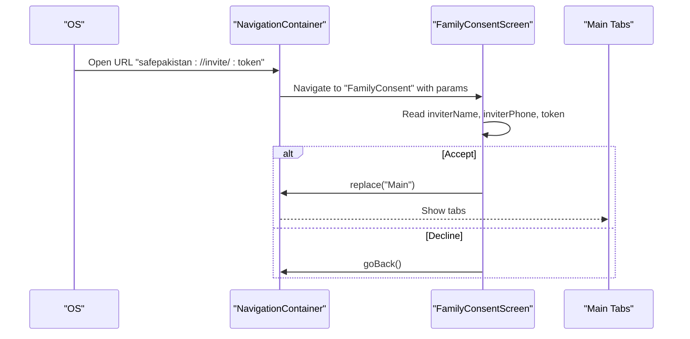
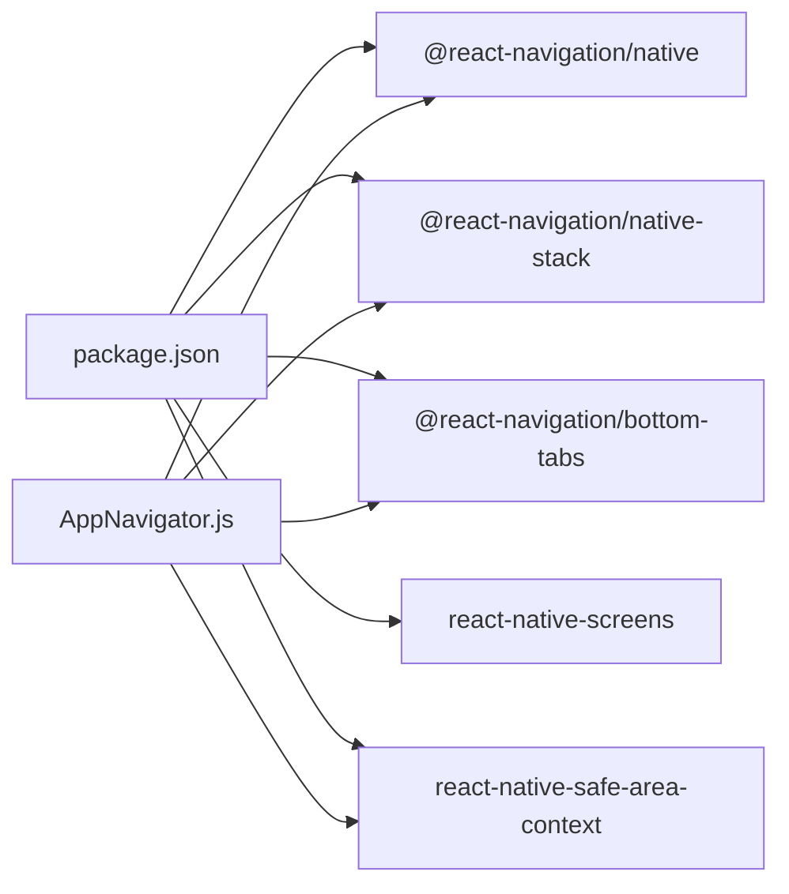

# Navigation Structure

<cite>
**Referenced Files in This Document**
- [App.js](file://App.js)
- [package.json](file://package.json)
- [AppNavigator.js](file://src/navigation/AppNavigator.js)
- [HomeScreen.js](file://src/screens/HomeScreen.js)
- [ScanScreen.js](file://src/screens/ScanScreen.js)
- [VerdictScreen.js](file://src/screens/VerdictScreen.js)
- [FamilyScreen.js](file://src/screens/FamilyScreen.js)
- [LibraryScreen.js](file://src/screens/LibraryScreen.js)
- [AnalyticsScreen.js](file://src/screens/AnalyticsScreen.js)
- [FamilyConsentScreen.js](file://src/screens/FamilyConsentScreen.js)
</cite>

## Table of Contents
1. [Introduction](#introduction)
2. [Project Structure](#project-structure)
3. [Core Components](#core-components)
4. [Architecture Overview](#architecture-overview)
5. [Detailed Component Analysis](#detailed-component-analysis)
6. [Dependency Analysis](#dependency-analysis)
7. [Performance Considerations](#performance-considerations)
8. [Troubleshooting Guide](#troubleshooting-guide)
9. [Conclusion](#conclusion)
10. [Appendices](#appendices)

## Introduction
This document explains the navigation structure of the Safe Pakistan application built with React Navigation v6. It covers:
- Stack navigation for full-screen flows (onboarding, results, voice input, consent).
- Bottom tab navigation for main sections (Home, Scan, Family, Report, Chat).
- Deep linking support for family invitations and shareable content.
- Parameter passing between screens for data transfer (scan results, family member information).
- Programmatic navigation usage across screens.
- Navigation state management and integration points with global state.
- Accessibility considerations for screen readers and keyboard navigation.

## Project Structure
The app entry point mounts a safe area provider and renders the navigator. The navigator defines a native stack that wraps a bottom tab navigator for primary sections and additional full-screen routes for focused tasks.

**Diagram sources**
- [App.js:21-43](file://App.js#L21-L43)
- [AppNavigator.js:80-102](file://src/navigation/AppNavigator.js#L80-L102)

**Section sources**
- [App.js:21-43](file://App.js#L21-L43)
- [AppNavigator.js:80-102](file://src/navigation/AppNavigator.js#L80-L102)

## Core Components
- AppNavigator.js: Defines the root stack and tab navigators, registers all screens, and configures animations and tab styling.
- Screens: Each screen receives navigation props and uses programmatic navigation to move between routes and pass parameters.

Key responsibilities:
- Root stack controls transitions like fade or slide from bottom for full-screen flows.
- Tab navigator groups Home, Scan, Family, Report, and Chat as persistent destinations.
- Screens implement user-driven navigation (e.g., scanning leads to verdict; voice opens voice flow; library navigates from home).

**Section sources**
- [AppNavigator.js:32-102](file://src/navigation/AppNavigator.js#L32-L102)
- [HomeScreen.js:23-104](file://src/screens/HomeScreen.js#L23-L104)
- [ScanScreen.js:15-95](file://src/screens/ScanScreen.js#L15-L95)
- [VerdictScreen.js:19-115](file://src/screens/VerdictScreen.js#L19-L115)
- [FamilyScreen.js:27-85](file://src/screens/FamilyScreen.js#L27-L85)
- [LibraryScreen.js:23-64](file://src/screens/LibraryScreen.js#L23-L64)
- [AnalyticsScreen.js:24-118](file://src/screens/AnalyticsScreen.js#L24-L118)
- [FamilyConsentScreen.js:24-35](file://src/screens/FamilyConsentScreen.js#L24-L35)

## Architecture Overview
The navigation architecture separates persistent tabs from full-screen flows:
- MainTabs is a child route of the root stack, enabling overlay-style transitions for critical flows (verdict, voice, consent).
- Initial route depends on an onboarded flag to show either Welcome or Main.
- All screens are registered once at the root stack level, allowing deep links and programmatic navigation from anywhere.

**Diagram sources**
- [HomeScreen.js:91-97](file://src/screens/HomeScreen.js#L91-L97)
- [ScanScreen.js:18-23](file://src/screens/ScanScreen.js#L18-L23)
- [VerdictScreen.js:19-24](file://src/screens/VerdictScreen.js#L19-L24)
- [AppNavigator.js:80-102](file://src/navigation/AppNavigator.js#L80-L102)

## Detailed Component Analysis

### Root Stack and Tabs Configuration
- Root stack:
  - Wraps the entire app inside NavigationContainer.
  - Uses fade animation by default; specific screens override with slide_from_bottom.
  - Initial route switches based on hasOnboarded prop.
- Tabs:
  - Five tabs: Home, Scan, Family, Report, Chat.
  - Custom tab icons with active/inactive states and platform-aware padding.
  - No header shown for tab screens.

**Diagram sources**
- [AppNavigator.js:32-102](file://src/navigation/AppNavigator.js#L32-L102)

**Section sources**
- [AppNavigator.js:32-102](file://src/navigation/AppNavigator.js#L32-L102)

### Screen Transitions and Flows
- Welcome to Main: Controlled by initialRouteName.
- Scan to Verdict: Parameters include verdict, score, confidence, and type.
- Voice flow: Registered as a full-screen stack route with slide animation.
- Consent flow: Full-screen route for family invitation acceptance.

**Diagram sources**
- [AppNavigator.js:80-102](file://src/navigation/AppNavigator.js#L80-L102)
- [ScanScreen.js:18-23](file://src/screens/ScanScreen.js#L18-L23)
- [VerdictScreen.js:19-24](file://src/screens/VerdictScreen.js#L19-L24)

**Section sources**
- [AppNavigator.js:80-102](file://src/navigation/AppNavigator.js#L80-L102)
- [ScanScreen.js:18-23](file://src/screens/ScanScreen.js#L18-L23)
- [VerdictScreen.js:19-24](file://src/screens/VerdictScreen.js#L19-L24)

### Deep Linking Support for Family Invitations and Shareable Content
- Family invitation flow:
  - FamilyConsentScreen is designed to be reached via deep link (comment indicates safepakistan://invite/:token).
  - Accepting replaces the stack with Main; declining goes back.
- Shareable content:
  - Analytics screen includes a “Share” action button suitable for sharing reports.

**Diagram sources**
- [FamilyConsentScreen.js:24-35](file://src/screens/FamilyConsentScreen.js#L24-L35)
- [AppNavigator.js:94-95](file://src/navigation/AppNavigator.js#L94-L95)

**Section sources**
- [FamilyConsentScreen.js:24-35](file://src/screens/FamilyConsentScreen.js#L24-L35)
- [AnalyticsScreen.js:113-116](file://src/screens/AnalyticsScreen.js#L113-L116)

### Navigation Parameters Passing Between Screens
- Scan to Verdict:
  - Passes verdict, score, confidence, and type to customize result display.
- Family consent:
  - Reads inviter name and phone from route params to personalize the consent UI.

Examples of parameter usage:
- Reading params in destination screens.
- Passing params when navigating from source screens.

**Section sources**
- [ScanScreen.js:18-23](file://src/screens/ScanScreen.js#L18-L23)
- [VerdictScreen.js:19-24](file://src/screens/VerdictScreen.js#L19-L24)
- [FamilyConsentScreen.js:24-35](file://src/screens/FamilyConsentScreen.js#L24-L35)

### Programmatic Navigation Usage Throughout the Application
Common patterns observed:
- Navigate to another screen:
  - From Home to Library.
  - From Scan to Verdict with parameters.
  - From Scan to Voice.
- Replace current stack with Main after accepting family invite.
- Go back from Verdict or consent screens.

These patterns ensure consistent navigation behavior across the app.

**Section sources**
- [HomeScreen.js:91-97](file://src/screens/HomeScreen.js#L91-L97)
- [ScanScreen.js:18-23](file://src/screens/ScanScreen.js#L18-L23)
- [VerdictScreen.js:46-48](file://src/screens/VerdictScreen.js#L46-L48)
- [FamilyConsentScreen.js:28-35](file://src/screens/FamilyConsentScreen.js#L28-L35)

### Navigation State Management and Global Integration
- Entry point:
  - App.js mounts SafeAreaProvider and AppNavigator.
  - Context providers are present but currently commented out; this leaves navigation state isolated within React Navigation.
- Implications:
  - Without context providers, navigation state remains local to the navigator.
  - When adding global state (e.g., authentication, language), integrate it around AppNavigator to influence initial route and shared data.

Recommendations:
- Wrap AppNavigator with your global providers to manage flags like hasOnboarded and user session.
- Keep navigation configuration centralized in AppNavigator to avoid duplication.

**Section sources**
- [App.js:21-43](file://App.js#L21-L43)
- [AppNavigator.js:80-102](file://src/navigation/AppNavigator.js#L80-L102)

## Dependency Analysis
React Navigation dependencies are declared in package.json and used in AppNavigator.js.

**Diagram sources**
- [package.json:11-33](file://package.json#L11-L33)
- [AppNavigator.js:10-17](file://src/navigation/AppNavigator.js#L10-L17)

**Section sources**
- [package.json:11-33](file://package.json#L11-L33)
- [AppNavigator.js:10-17](file://src/navigation/AppNavigator.js#L10-L17)

## Performance Considerations
- Use minimal re-renders in screens by keeping navigation logic lightweight.
- Prefer replace over navigate when transitioning to top-level flows (e.g., after accepting family invite) to avoid stacking unnecessary routes.
- Avoid heavy computations during navigation; defer to background tasks where possible.
- Keep tab bar icons simple to reduce layout overhead.

[No sources needed since this section provides general guidance]

## Troubleshooting Guide
Common issues and resolutions:
- Deep links not opening expected screen:
  - Ensure the target screen is registered in the root stack.
  - Verify the deep link scheme matches the app configuration.
- Params missing in destination:
  - Confirm source screen passes params correctly.
  - Check destination reads params safely with optional chaining.
- Unexpected back behavior:
  - Use goBack only when there is a previous route.
  - Use replace for flows that should not allow returning (e.g., post-invite acceptance).

**Section sources**
- [FamilyConsentScreen.js:24-35](file://src/screens/FamilyConsentScreen.js#L24-L35)
- [ScanScreen.js:18-23](file://src/screens/ScanScreen.js#L18-L23)
- [VerdictScreen.js:46-48](file://src/screens/VerdictScreen.js#L46-L48)

## Conclusion
Safe Pakistan’s navigation is structured around a root stack with a nested tab navigator for core sections and full-screen overlays for focused tasks. This design supports clear transitions, parameterized data flow, and deep linking for family invitations. Integrating global state around the navigator will enable richer behaviors such as conditional routing and shared session management.

[No sources needed since this section summarizes without analyzing specific files]

## Appendices

### Accessibility Considerations
- Add meaningful accessibility labels to interactive elements (buttons, chips, cards) to support screen readers.
- Ensure focus order follows logical reading order for keyboard navigation.
- Provide accessible descriptions for charts and visual indicators (e.g., threat ring scores).
- Test with TalkBack (Android) and VoiceOver (iOS) to verify announcements and interactions.

[No sources needed since this section provides general guidance]