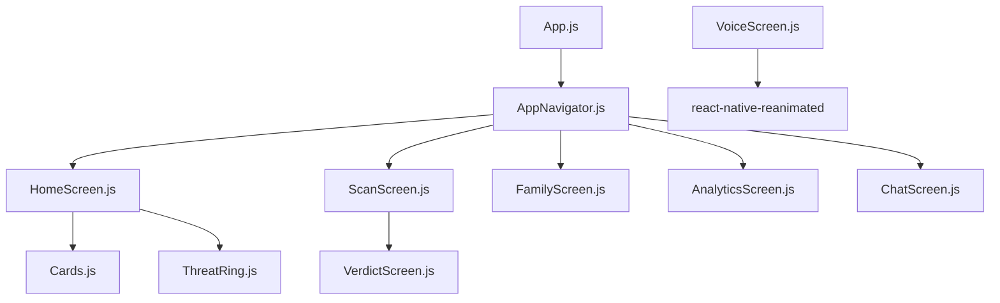
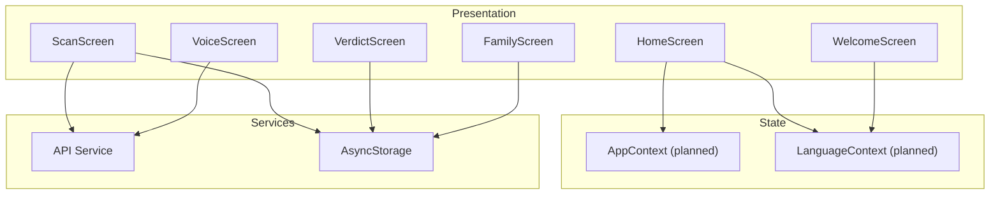
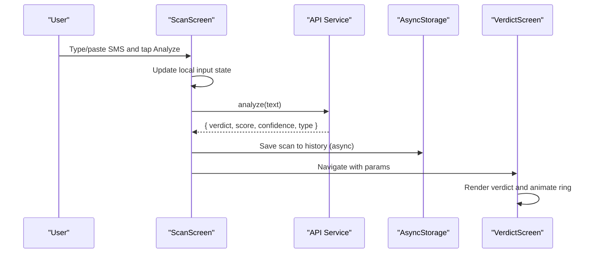
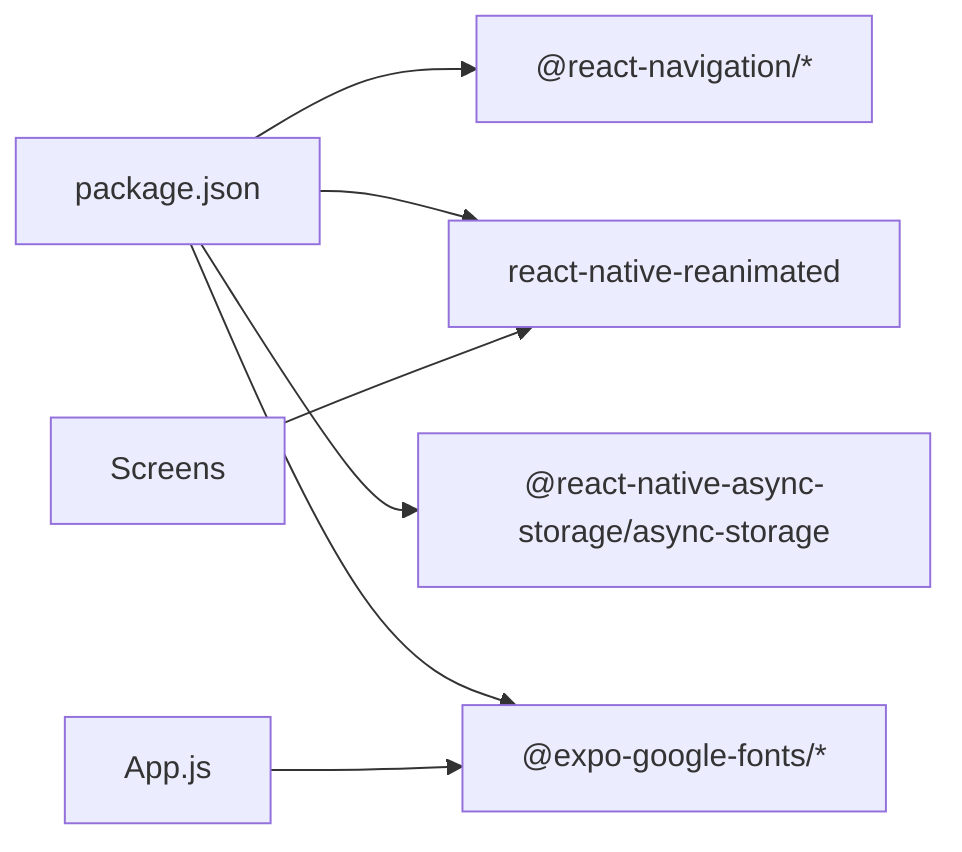

# State Management

<cite>
**Referenced Files in This Document**
- [App.js](file://App.js)
- [package.json](file://package.json)
- [AppNavigator.js](file://src/navigation/AppNavigator.js)
- [HomeScreen.js](file://src/screens/HomeScreen.js)
- [ScanScreen.js](file://src/screens/ScanScreen.js)
- [VerdictScreen.js](file://src/screens/VerdictScreen.js)
- [VoiceScreen.js](file://src/screens/VoiceScreen.js)
- [WelcomeScreen.js](file://src/screens/WelcomeScreen.js)
- [FamilyScreen.js](file://src/screens/FamilyScreen.js)
- [Cards.js](file://src/components/Cards.js)
- [ThreatRing.js](file://src/components/ThreatRing.js)
</cite>

## Table of Contents
1. Introduction
2. Project Structure
3. Core Components
4. Architecture Overview
5. Detailed Component Analysis
6. Dependency Analysis
7. Performance Considerations
8. Troubleshooting Guide
9. Conclusion

## Introduction
This document explains the state management approach for the Safe Pakistan application. It covers:
- Global state strategy using React Context providers (planned) for user preferences, language settings, and family member data
- Local state within screens using useState and useEffect for screen-specific data and UI animations
- Data persistence strategy with AsyncStorage (installed) for scan history, family members, and preferences
- API integration patterns to communicate with backend services, including error handling and loading states
- End-to-end data flow from user interactions through state updates to UI re-renders
- Examples of context provider implementation and consumption patterns
- Performance optimization techniques for state updates and synchronization between local storage and backend services

## Project Structure
The app is a React Native (Expo) project with:
- A root App component that sets up safe area and navigation
- A tab-based navigator routing to Home, Scan, Family, Report, and Chat screens
- Reusable components for cards, indicators, overlays, and animated rings
- Theme tokens and typography utilities
- Dependencies include React Navigation, Reanimated, and AsyncStorage

**Diagram sources**
- [App.js:21-43](file://App.js#L21-L43)
- [AppNavigator.js:58-78](file://src/navigation/AppNavigator.js#L58-L78)
- [HomeScreen.js:23-104](file://src/screens/HomeScreen.js#L23-L104)
- [ScanScreen.js:15-95](file://src/screens/ScanScreen.js#L15-L95)
- [FamilyScreen.js:27-85](file://src/screens/FamilyScreen.js#L27-L85)
- [ThreatRing.js:18-83](file://src/components/ThreatRing.js#L18-L83)

**Section sources**
- [App.js:21-43](file://App.js#L21-L43)
- [package.json:11-34](file://package.json#L11-L34)
- [AppNavigator.js:58-78](file://src/navigation/AppNavigator.js#L58-L78)

## Core Components
- App entrypoint initializes fonts and renders the navigator inside a SafeAreaProvider. Context providers are prepared but not yet active at runtime.
- Navigator defines tabs for core features: Home, Scan, Family, Report, Chat.
- Screens manage their own local state:
  - WelcomeScreen manages selected language locally.
  - ScanScreen manages input text and triggers analysis flow.
  - VerdictScreen displays results and uses animations for entrance effects.
  - VoiceScreen manages voice state machine and animated waveform.
  - FamilyScreen renders static family list via reusable card components.
- Shared components:
  - Cards provide presentational UI for avatars, stat cards, activity items, and family member cards.
  - ThreatRing animates a score ring using Reanimated shared values.

Key responsibilities:
- Global state (planned): AppContext for analytics and family metrics; LanguageContext for i18n and language preference.
- Local state: Per-screen inputs, flags, and transient UI states.
- Persistence: AsyncStorage available for storing preferences, scan history, and family data.
- API layer: Placeholder service calls in screens ready to be wired to backend endpoints.

**Section sources**
- [App.js:21-43](file://App.js#L21-L43)
- [AppNavigator.js:58-78](file://src/navigation/AppNavigator.js#L58-L78)
- [WelcomeScreen.js:18-80](file://src/screens/WelcomeScreen.js#L18-L80)
- [ScanScreen.js:15-95](file://src/screens/ScanScreen.js#L15-L95)
- [VerdictScreen.js:19-115](file://src/screens/VerdictScreen.js#L19-L115)
- [VoiceScreen.js:27-33](file://src/screens/VoiceScreen.js#L27-L33)
- [FamilyScreen.js:27-85](file://src/screens/FamilyScreen.js#L27-L85)
- [Cards.js:61-85](file://src/components/Cards.js#L61-L85)
- [ThreatRing.js:18-83](file://src/components/ThreatRing.js#L18-L83)

## Architecture Overview
The intended architecture separates concerns across layers:
- Presentation: Screens and components render UI based on props and local state.
- State: React Context provides global state (app metrics, language).
- Services: API clients encapsulate network calls; StorageService wraps AsyncStorage.
- Navigation: React Navigation routes between screens and passes parameters.

[No sources needed since this diagram shows conceptual workflow, not actual code structure]

## Detailed Component Analysis

### Global State Strategy (React Context)
- AppContext (planned) will expose:
  - Metrics: scanCount, blockedCount, recentScans
  - Actions: increment scans, add recent item, update family count
- LanguageContext (planned) will expose:
  - Current language code
  - Translation function t(key)
  - Persisted language preference via AsyncStorage
- Provider placement: Wrap AppNavigator in App.js to make contexts available throughout the app.

Consumption pattern:
- Use hooks like useAppContext() and useLanguageContext() inside screens to read state and dispatch actions.
- Keep heavy computations out of render paths; memoize derived values where necessary.

Example references:
- App.js includes commented imports for AppProvider and LanguageProvider, indicating intended provider usage.
- HomeScreen.js comments show expected usage of useAppContext and useLanguageContext.

**Section sources**
- [App.js:17-20](file://App.js#L17-L20)
- [App.js:36-41](file://App.js#L36-L41)
- [HomeScreen.js:20-25](file://src/screens/HomeScreen.js#L20-L25)

### Local State Management with useState and useEffect
- WelcomeScreen: Manages selected language locally for onboarding selection.
- ScanScreen: Holds input text and triggers analysis flow; placeholder for API call and navigation to verdict.
- VerdictScreen: Reads route params, computes display values, and animates entrance using Reanimated shared values.
- VoiceScreen: Implements a simple state machine (idle/listening/processing/done) and animated waveform using shared values.

Effects and lifecycle:
- VerdictScreen uses useEffect to animate band entrance on mount.
- ThreatRing uses useEffect to animate progress when score changes.

**Section sources**
- [WelcomeScreen.js:18-80](file://src/screens/WelcomeScreen.js#L18-L80)
- [ScanScreen.js:15-23](file://src/screens/ScanScreen.js#L15-L23)
- [VerdictScreen.js:19-33](file://src/screens/VerdictScreen.js#L19-L33)
- [VoiceScreen.js:27-33](file://src/screens/VoiceScreen.js#L27-L33)
- [ThreatRing.js:29-34](file://src/components/ThreatRing.js#L29-L34)

### Data Persistence with AsyncStorage
- AsyncStorage is included as a dependency and can be used to persist:
  - User preferences (e.g., language)
  - Scan history (recent scans, counts)
  - Family member information (members, statuses)
- Recommended pattern:
  - Create a StorageService module with async functions to get/set keys
  - On app start, load persisted preferences into LanguageContext and AppContext
  - On state changes (e.g., new scan), write to AsyncStorage asynchronously
  - Debounce or batch writes for frequent updates (e.g., recent scans)

Integration points:
- LanguageContext: Save language code on change
- AppContext: Save scanCount, blockedCount, recentScans
- Family flows: Save/update family members list after invite acceptance

**Section sources**
- [package.json:33-33](file://package.json#L33-L33)

### API Integration Patterns
- Placeholder service calls exist in screens:
  - ScanScreen: analyze(text) returns verdict, score, confidence, type
  - VoiceScreen: hook up speech/recognition to update state machine
  - FamilyConsentScreen: acceptInvite/declineInvite placeholders
- Recommended pattern:
  - Centralized API client with base URL and interceptors
  - Standardized response shape: { success, data, error }
  - Error handling: network errors, server errors, timeouts
  - Loading states: per-action flags to show spinners or disable buttons
  - Retry logic for transient failures

Example references:
- ScanScreen navigates to Verdict with mock result; replace with real API call
- VoiceScreen comments indicate where to integrate speech/recognition

**Section sources**
- [ScanScreen.js:18-23](file://src/screens/ScanScreen.js#L18-L23)
- [VoiceScreen.js:1-7](file://src/screens/VoiceScreen.js#L1-L7)

### Data Flow: From Interaction to Re-render

**Diagram sources**
- [ScanScreen.js:15-23](file://src/screens/ScanScreen.js#L15-L23)
- [VerdictScreen.js:19-33](file://src/screens/VerdictScreen.js#L19-L33)

### Example: Context Provider Implementation and Consumption
- Provider setup in App.js:
  - Wrap AppNavigator with AppProvider and LanguageProvider
  - Initialize contexts with persisted values on mount
- Consumption in screens:
  - HomeScreen reads metrics and translations via context hooks
  - WelcomeScreen selects language and persists it via LanguageContext

References:
- App.js contains commented provider imports and wrapper
- HomeScreen.js comments show expected context usage

**Section sources**
- [App.js:17-20](file://App.js#L17-L20)
- [App.js:36-41](file://App.js#L36-L41)
- [HomeScreen.js:20-25](file://src/screens/HomeScreen.js#L20-L25)

### Animated Score Ring Component
- ThreatRing uses Reanimated shared values to animate strokeDashoffset based on score prop
- Uses useEffect to trigger animation when score changes
- Provides label and color customization

**Diagram sources**
- [ThreatRing.js:24-38](file://src/components/ThreatRing.js#L24-L38)
- [ThreatRing.js:29-34](file://src/components/ThreatRing.js#L29-L34)

**Section sources**
- [ThreatRing.js:18-83](file://src/components/ThreatRing.js#L18-L83)

## Dependency Analysis
- Navigation dependencies:
  - @react-navigation/native, native-stack, bottom-tabs define the tab navigator and screens
- UI and animation:
  - react-native-reanimated powers animated rings and waveform
  - expo-linear-gradient for hero visuals
- Storage:
  - @react-native-async-storage/async-storage installed for persistence
- Fonts:
  - @expo-google-fonts packages loaded in App.js

**Diagram sources**
- [package.json:11-34](file://package.json#L11-L34)
- [App.js:9-15](file://App.js#L9-L15)

**Section sources**
- [package.json:11-34](file://package.json#L11-L34)
- [App.js:9-15](file://App.js#L9-L15)

## Performance Considerations
- Minimize re-renders:
  - Lift minimal state to Context; keep heavy lists in components with memoization
  - Use React.memo for pure presentational components (e.g., Card items)
- Optimize animations:
  - Prefer Reanimated shared values for smooth UI transitions
  - Avoid expensive work in render callbacks
- Storage efficiency:
  - Batch or debounce writes to AsyncStorage for frequent updates (e.g., recent scans)
  - Use separate keys for preferences vs large datasets
- Network efficiency:
  - Cache responses when appropriate
  - Show optimistic UI updates and reconcile on success/failure
- Memory:
  - Unsubscribe listeners and cancel animations on unmount
  - Clear temporary state when navigating away

[No sources needed since this section provides general guidance]

## Troubleshooting Guide
Common issues and resolutions:
- Context not providing values:
  - Ensure providers wrap AppNavigator in App.js
  - Verify hooks are imported from correct context modules
- AsyncStorage not persisting:
  - Check permissions and platform-specific behavior
  - Validate key names and JSON serialization
- API errors:
  - Handle network errors and timeouts gracefully
  - Provide user feedback and retry options
- Animation glitches:
  - Ensure shared values are reset on unmount
  - Avoid updating too many shared values simultaneously

**Section sources**
- [App.js:17-20](file://App.js#L17-L20)
- [App.js:36-41](file://App.js#L36-L41)
- [package.json:33-33](file://package.json#L33-L33)

## Conclusion
Safe Pakistan’s state management combines:
- Planned React Context providers for global app state and language preferences
- Local state with useState and useEffect for screen-specific logic and animations
- AsyncStorage for persistent storage of preferences, scan history, and family data
- Clear API integration patterns ready to connect to backend services
- Robust data flow from user interactions to UI updates with performance best practices in mind

Implementing the planned Context providers and wiring API/storage services will complete a scalable, maintainable state architecture for the app.