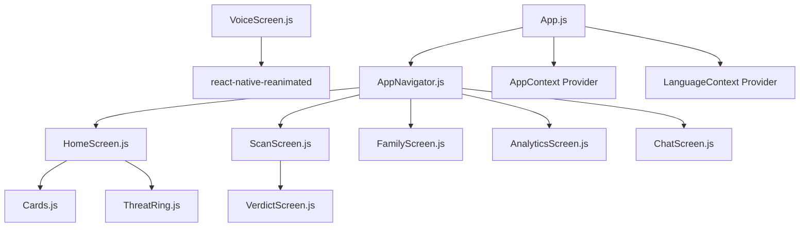
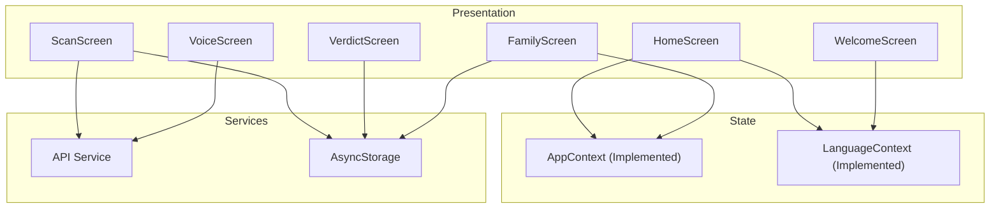
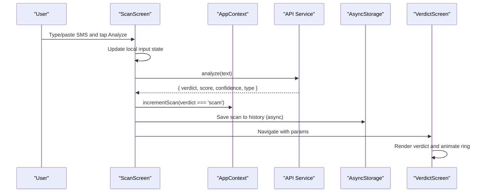
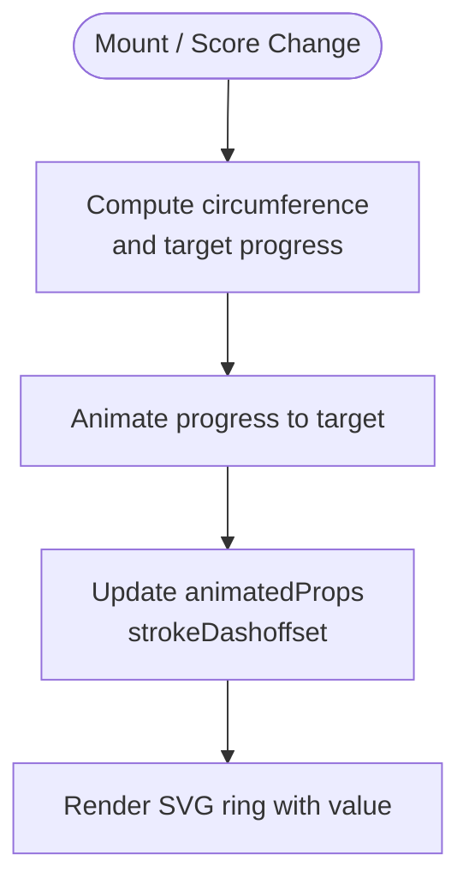
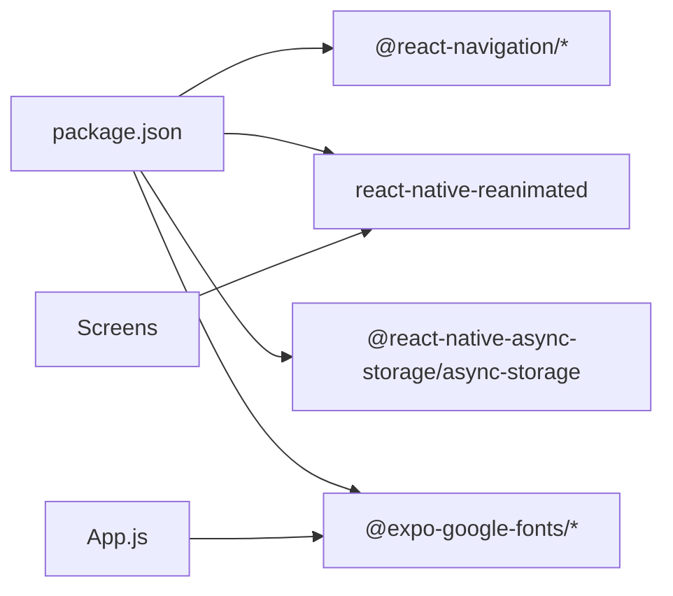

# State Management

<cite>
**Referenced Files in This Document**
- [App.js](file://App.js)
- [package.json](file://package.json)
- [AppNavigator.js](file://src/navigation/AppNavigator.js)
- [HomeScreen.js](file://src/screens/HomeScreen.js)
- [ScanScreen.js](file://src/screens/ScanScreen.js)
- [VerdictScreen.js](file://src/screens/VerdictScreen.js)
- [VoiceScreen.js](file://src/screens/VoiceScreen.js)
- [WelcomeScreen.js](file://src/screens/WelcomeScreen.js)
- [FamilyScreen.js](file://src/screens/FamilyScreen.js)
- [Cards.js](file://src/components/Cards.js)
- [ThreatRing.js](file://src/components/ThreatRing.js)
- [AppContext.js](file://src/context/AppContext.js)
- [LanguageContext.js](file://src/context/LanguageContext.js)
- [mockData.js](file://src/data/mockData.js)
- [PushService.js](file://src/services/PushService.js)
</cite>

## Update Summary
**Changes Made**
- Updated Context providers section to reflect fully implemented AppContext and LanguageContext
- Added detailed documentation for scan tracking and blocked message counting functionality
- Enhanced language support documentation covering English/Urdu/Roman Urdu with RTL support
- Updated integration patterns to show actual context consumption in FamilyScreen
- Added comprehensive examples of provider implementation and usage patterns

## Table of Contents
1. Introduction
2. Project Structure
3. Core Components
4. Architecture Overview
5. Detailed Component Analysis
6. Dependency Analysis
7. Performance Considerations
8. Troubleshooting Guide
9. Conclusion

## Introduction
This document explains the state management approach for the Safe Pakistan application. It covers:
- **Fully implemented** global state strategy using React Context providers (AppContext and LanguageContext) for user preferences, language settings, and family member data
- Local state within screens using useState and useEffect for screen-specific data and UI animations
- Data persistence strategy with AsyncStorage (installed) for scan history, family members, and preferences
- API integration patterns to communicate with backend services, including error handling and loading states
- End-to-end data flow from user interactions through state updates to UI re-renders
- Examples of context provider implementation and consumption patterns throughout the application
- Performance optimization techniques for state updates and synchronization between local storage and backend services

## Project Structure
The app is a React Native (Expo) project with:
- A root App component that sets up safe area and navigation with fully integrated context providers
- A tab-based navigator routing to Home, Scan, Family, Report, and Chat screens
- Reusable components for cards, indicators, overlays, and animated rings
- Theme tokens and typography utilities with RTL support
- Dependencies include React Navigation, Reanimated, and AsyncStorage

**Diagram sources**
- [App.js:42-48](file://App.js#L42-L48)
- [AppNavigator.js:58-78](file://src/navigation/AppNavigator.js#L58-L78)
- [HomeScreen.js:23-104](file://src/screens/HomeScreen.js#L23-L104)
- [ScanScreen.js:15-95](file://src/screens/ScanScreen.js#L15-L95)
- [FamilyScreen.js:27-85](file://src/screens/FamilyScreen.js#L27-L85)
- [ThreatRing.js:18-83](file://src/components/ThreatRing.js#L18-L83)

**Section sources**
- [App.js:21-48](file://App.js#L21-L48)
- [package.json:11-34](file://package.json#L11-L34)
- [AppNavigator.js:58-78](file://src/navigation/AppNavigator.js#L58-L78)

## Core Components
- **App entrypoint** initializes fonts and renders the navigator inside a SafeAreaProvider with fully active context providers
- **Navigator** defines tabs for core features: Home, Scan, Family, Report, Chat
- **Screens manage their own local state**:
  - WelcomeScreen manages selected language locally
  - ScanScreen manages input text and triggers analysis flow
  - VerdictScreen displays results and uses animations for entrance effects
  - VoiceScreen manages voice state machine and animated waveform
  - FamilyScreen renders static family list via reusable card components and consumes AppContext
- **Shared components**:
  - Cards provide presentational UI for avatars, stat cards, activity items, and family member cards
  - ThreatRing animates a score ring using Reanimated shared values

Key responsibilities:
- **Global state (implemented)**: AppContext for analytics and family metrics; LanguageContext for i18n and language preference
- **Local state**: Per-screen inputs, flags, and transient UI states
- **Persistence**: AsyncStorage available for storing preferences, scan history, and family data
- **API layer**: Placeholder service calls in screens ready to be wired to backend endpoints

**Section sources**
- [App.js:21-48](file://App.js#L21-L48)
- [AppNavigator.js:58-78](file://src/navigation/AppNavigator.js#L58-L78)
- [WelcomeScreen.js:18-80](file://src/screens/WelcomeScreen.js#L18-L80)
- [ScanScreen.js:15-95](file://src/screens/ScanScreen.js#L15-L95)
- [VerdictScreen.js:19-115](file://src/screens/VerdictScreen.js#L19-L115)
- [VoiceScreen.js:27-33](file://src/screens/VoiceScreen.js#L27-L33)
- [FamilyScreen.js:27-85](file://src/screens/FamilyScreen.js#L27-L85)
- [Cards.js:61-85](file://src/components/Cards.js#L61-L85)
- [ThreatRing.js:18-83](file://src/components/ThreatRing.js#L18-L83)

## Architecture Overview
The architecture separates concerns across layers with fully implemented context providers:
- **Presentation**: Screens and components render UI based on props and local state
- **State**: React Context provides global state (app metrics, language) with AppContext and LanguageContext
- **Services**: API clients encapsulate network calls; StorageService wraps AsyncStorage
- **Navigation**: React Navigation routes between screens and passes parameters

[No sources needed since this diagram shows conceptual workflow, not actual code structure]

## Detailed Component Analysis

### Global State Strategy (React Context - Fully Implemented)
**Updated** The context providers are now fully implemented and actively used throughout the application.

- **AppContext** exposes:
  - `scanCount`: Total number of scans performed
  - `blockedCount`: Number of blocked/scam messages detected
  - `isAnalyzing`: Current analysis state flag
  - `incrementScan(blocked?)`: Function to increment scan count and optionally blocked count when verdict is SCAM
  - `setIsAnalyzing`: Function to control analysis state

- **LanguageContext** exposes:
  - `language`: Current language code ('en', 'ur', 'roman')
  - `setLang`: Function to change language
  - `t(key)`: Translation function for supported keys
  - `isRTL`: Boolean indicating right-to-left layout mode (true for Urdu)
  - `ttsLocale`: Text-to-speech locale ('ur-PK' for Urdu, 'en-US' for others)

- **Provider placement**: Both providers are wrapped around AppNavigator in App.js, making contexts available throughout the entire application

**Consumption pattern**:
- Use hooks like `useAppContext()` and `useLanguageContext()` inside screens to read state and dispatch actions
- Keep heavy computations out of render paths; memoize derived values where necessary
- Example usage in FamilyScreen demonstrates real-time scan counting when family alerts are sent

**Section sources**
- [AppContext.js:10-30](file://src/context/AppContext.js#L10-L30)
- [LanguageContext.js:47-67](file://src/context/LanguageContext.js#L47-L67)
- [App.js:42-48](file://App.js#L42-L48)
- [FamilyScreen.js:29-36](file://src/screens/FamilyScreen.js#L29-L36)

### Local State Management with useState and useEffect
- **WelcomeScreen**: Manages selected language locally for onboarding selection
- **ScanScreen**: Holds input text and triggers analysis flow; placeholder for API call and navigation to verdict
- **VerdictScreen**: Reads route params, computes display values, and animates entrance using Reanimated shared values
- **VoiceScreen**: Implements a simple state machine (idle/listening/processing/done) and animated waveform using shared values

Effects and lifecycle:
- VerdictScreen uses useEffect to animate band entrance on mount
- ThreatRing uses useEffect to animate progress when score changes

**Section sources**
- [WelcomeScreen.js:18-80](file://src/screens/WelcomeScreen.js#L18-L80)
- [ScanScreen.js:15-23](file://src/screens/ScanScreen.js#L15-L23)
- [VerdictScreen.js:19-33](file://src/screens/VerdictScreen.js#L19-L33)
- [VoiceScreen.js:27-33](file://src/screens/VoiceScreen.js#L27-L33)
- [ThreatRing.js:29-34](file://src/components/ThreatRing.js#L29-L34)

### Data Persistence with AsyncStorage
- **AsyncStorage** is included as a dependency and can be used to persist:
  - User preferences (e.g., language)
  - Scan history (recent scans, counts)
  - Family member information (members, statuses)
- **Recommended pattern**:
  - Create a StorageService module with async functions to get/set keys
  - On app start, load persisted preferences into LanguageContext and AppContext
  - On state changes (e.g., new scan), write to AsyncStorage asynchronously
  - Debounce or batch writes for frequent updates (e.g., recent scans)

**Integration points**:
- LanguageContext: Save language code on change
- AppContext: Save scanCount, blockedCount, recentScans
- Family flows: Save/update family members list after invite acceptance
- Mock data structure provided in mockData.js for development

**Section sources**
- [package.json:33-33](file://package.json#L33-L33)
- [mockData.js:20-24](file://src/data/mockData.js#L20-L24)

### API Integration Patterns
- **Placeholder service calls exist in screens**:
  - ScanScreen: analyze(text) returns verdict, score, confidence, type
  - VoiceScreen: hook up speech/recognition to update state machine
  - FamilyConsentScreen: acceptInvite/declineInvite placeholders
- **Recommended pattern**:
  - Centralized API client with base URL and interceptors
  - Standardized response shape: { success, data, error }
  - Error handling: network errors, server errors, timeouts
  - Loading states: per-action flags to show spinners or disable buttons
  - Retry logic for transient failures

**Example references**:
- ScanScreen navigates to Verdict with mock result; replace with real API call
- VoiceScreen comments indicate where to integrate speech/recognition
- README provides example backend integration pattern

**Section sources**
- [ScanScreen.js:18-23](file://src/screens/ScanScreen.js#L18-L23)
- [VoiceScreen.js:1-7](file://src/screens/VoiceScreen.js#L1-L7)
- [README.md:186-201](file://README.md#L186-L201)

### Data Flow: From Interaction to Re-render

**Diagram sources**
- [ScanScreen.js:15-23](file://src/screens/ScanScreen.js#L15-L23)
- [VerdictScreen.js:19-33](file://src/screens/VerdictScreen.js#L19-L33)
- [AppContext.js:15-19](file://src/context/AppContext.js#L15-L19)

### Example: Context Provider Implementation and Consumption
**Updated** Context providers are now fully implemented and actively used.

- **Provider setup in App.js**:
  - Both AppProvider and LanguageProvider wrap AppNavigator
  - Providers are initialized with default values on mount
  - SafeAreaProvider wraps the entire application

- **Consumption in screens**:
  - FamilyScreen demonstrates real usage of useAppContext() for scan counting
  - HomeScreen has commented imports showing expected context usage patterns
  - LanguageContext provides translation support and RTL layout detection

**Real-world usage example**:
- FamilyScreen imports and uses `useAppContext()` to access `incrementScan`
- When family alert is sent successfully, it calls `incrementScan()` to update global scan count
- This demonstrates how user actions trigger global state updates

**Section sources**
- [App.js:17-20](file://App.js#L17-L20)
- [App.js:42-48](file://App.js#L42-L48)
- [FamilyScreen.js:20-36](file://src/screens/FamilyScreen.js#L20-L36)
- [HomeScreen.js:20-25](file://src/screens/HomeScreen.js#L20-L25)

### Animated Score Ring Component
- **ThreatRing** uses Reanimated shared values to animate strokeDashoffset based on score prop
- Uses useEffect to trigger animation when score changes
- Provides label and color customization

**Diagram sources**
- [ThreatRing.js:24-38](file://src/components/ThreatRing.js#L24-L38)
- [ThreatRing.js:29-34](file://src/components/ThreatRing.js#L29-L34)

**Section sources**
- [ThreatRing.js:18-83](file://src/components/ThreatRing.js#L18-L83)

### Language Support and RTL Handling
**Updated** Comprehensive language support is implemented with full RTL capabilities.

- **Supported languages**:
  - English (LTR): Default language with standard left-to-right layout
  - Urdu (RTL): Full Arabic script support with Nastaliq font and right-to-left layout
  - Roman Urdu (LTR): Roman script representation of Urdu language

- **RTL Features**:
  - Automatic `isRTL` detection based on current language
  - Proper text alignment and writing direction for Urdu content
  - Font switching between Inter (English/Roman Urdu) and Noto Nastaliq Urdu
  - Typography system with separate English and Urdu style presets

- **Translation System**:
  - Built-in dictionary with common app strings
  - Fallback mechanism to English if translations missing
  - Extensible string key system for adding new translations

**Section sources**
- [LanguageContext.js:8-12](file://src/context/LanguageContext.js#L8-L12)
- [LanguageContext.js:15-43](file://src/context/LanguageContext.js#L15-L43)
- [LanguageContext.js:47-64](file://src/context/LanguageContext.js#L47-L64)
- [typography.js:21-29](file://src/theme/typography.js#L21-L29)

## Dependency Analysis
- **Navigation dependencies**:
  - @react-navigation/native, native-stack, bottom-tabs define the tab navigator and screens
- **UI and animation**:
  - react-native-reanimated powers animated rings and waveform
  - expo-linear-gradient for hero visuals
- **Storage**:
  - @react-native-async-storage/async-storage installed for persistence
- **Fonts**:
  - @expo-google-fonts packages loaded in App.js with both Inter and Noto Nastaliq Urdu

**Diagram sources**
- [package.json:11-34](file://package.json#L11-L34)
- [App.js:9-15](file://App.js#L9-L15)

**Section sources**
- [package.json:11-34](file://package.json#L11-L34)
- [App.js:9-15](file://App.js#L9-L15)

## Performance Considerations
- **Minimize re-renders**:
  - Lift minimal state to Context; keep heavy lists in components with memoization
  - Use React.memo for pure presentational components (e.g., Card items)
  - Context providers use useMemo to optimize value object creation
- **Optimize animations**:
  - Prefer Reanimated shared values for smooth UI transitions
  - Avoid expensive work in render callbacks
- **Storage efficiency**:
  - Batch or debounce writes to AsyncStorage for frequent updates (e.g., recent scans)
  - Use separate keys for preferences vs large datasets
- **Network efficiency**:
  - Cache responses when appropriate
  - Show optimistic UI updates and reconcile on success/failure
- **Memory**:
  - Unsubscribe listeners and cancel animations on unmount
  - Clear temporary state when navigating away

[No sources needed since this section provides general guidance]

## Troubleshooting Guide
Common issues and resolutions:
- **Context not providing values**:
  - Ensure providers wrap AppNavigator in App.js (already implemented)
  - Verify hooks are imported from correct context modules
  - Check that components are properly nested within providers
- **AsyncStorage not persisting**:
  - Check permissions and platform-specific behavior
  - Validate key names and JSON serialization
  - Implement proper error handling for storage operations
- **API errors**:
  - Handle network errors and timeouts gracefully
  - Provide user feedback and retry options
  - Use loading states to prevent multiple simultaneous requests
- **Animation glitches**:
  - Ensure shared values are reset on unmount
  - Avoid updating too many shared values simultaneously
- **Language/RTL issues**:
  - Verify font loading completes before rendering
  - Check proper font family assignment for each language
  - Ensure text direction is correctly applied for RTL languages

**Section sources**
- [App.js:42-48](file://App.js#L42-L48)
- [package.json:33-33](file://package.json#L33-L33)

## Conclusion
Safe Pakistan's state management combines:
- **Fully implemented React Context providers** (AppContext and LanguageContext) for global app state and language preferences
- Local state with useState and useEffect for screen-specific logic and animations
- AsyncStorage for persistent storage of preferences, scan history, and family data
- Clear API integration patterns ready to connect to backend services
- Robust data flow from user interactions to UI updates with performance best practices in mind
- Comprehensive language support with English, Urdu, and Roman Urdu including full RTL capabilities

The context providers are now production-ready and actively used throughout the application, particularly for scan tracking and family member management. The architecture provides a solid foundation for scaling the application with additional features while maintaining clean separation of concerns and optimal performance.