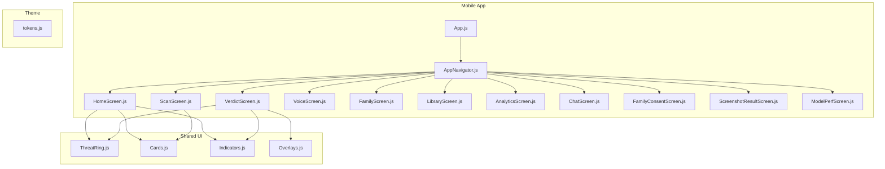
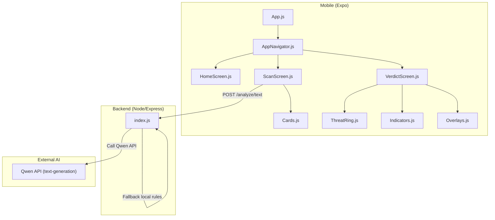
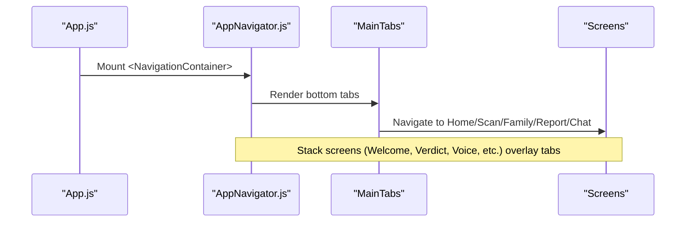
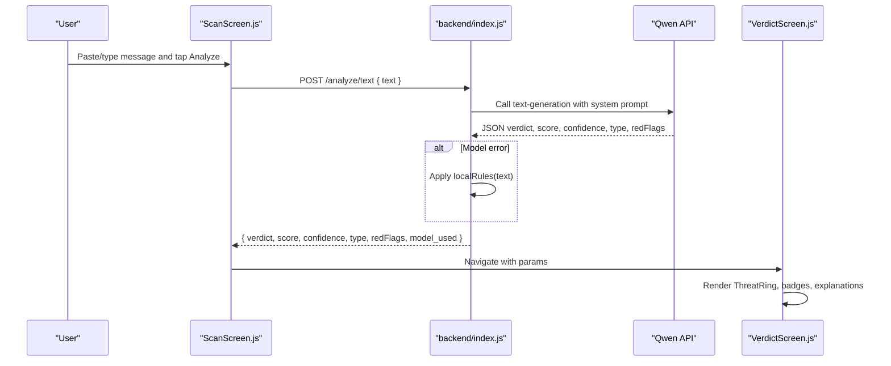
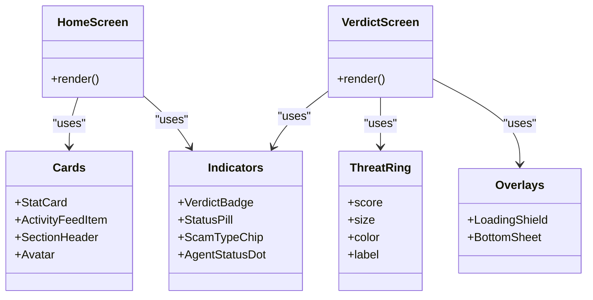
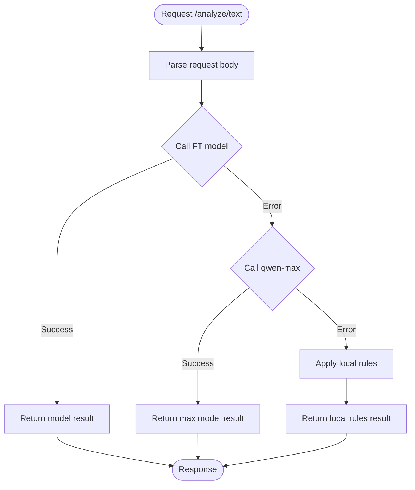
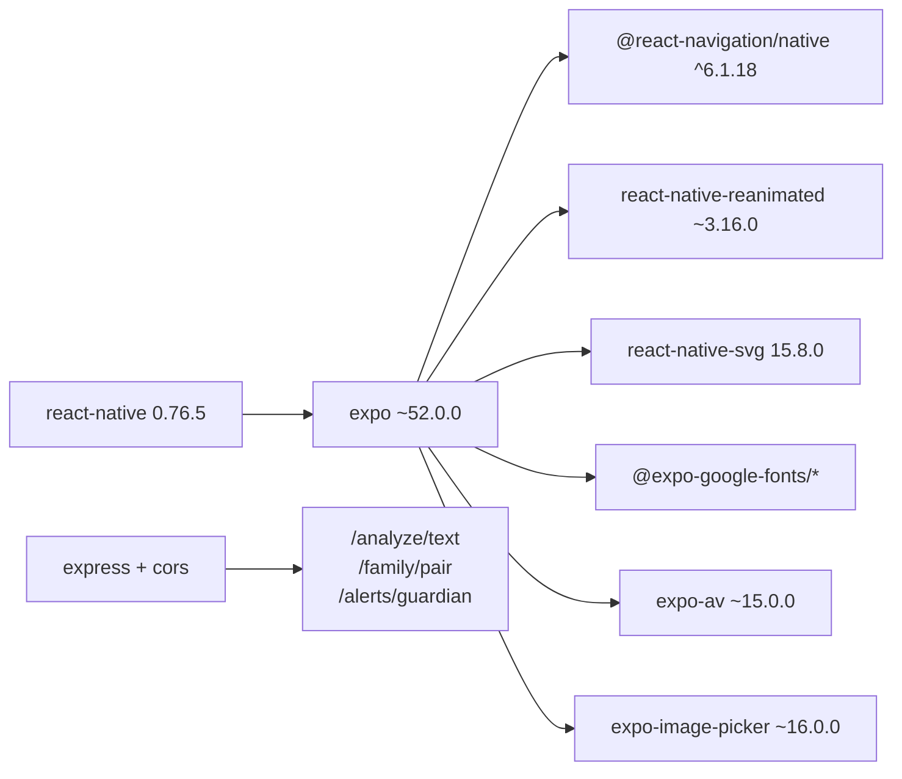
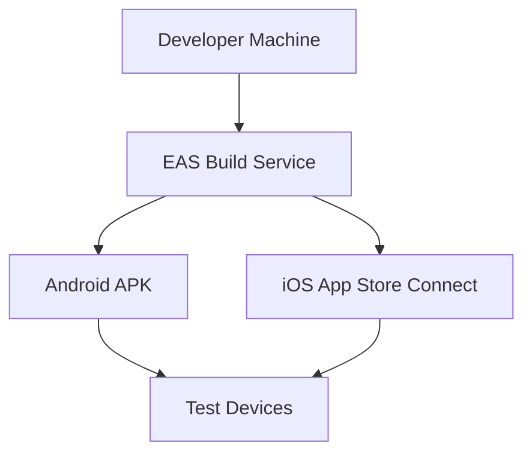
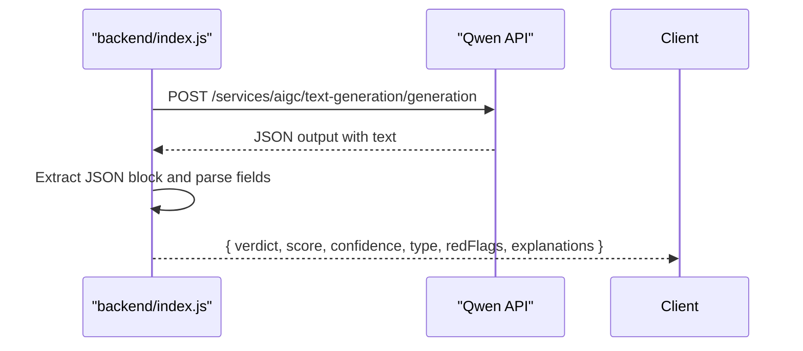

# System Architecture

<cite>
**Referenced Files in This Document**
- [App.js](file://App.js)
- [package.json](file://package.json)
- [app.json](file://app.json)
- [eas.json](file://eas.json)
- [README.md](file://README.md)
- [src/navigation/AppNavigator.js](file://src/navigation/AppNavigator.js)
- [src/screens/HomeScreen.js](file://src/screens/HomeScreen.js)
- [src/screens/ScanScreen.js](file://src/screens/ScanScreen.js)
- [src/screens/VerdictScreen.js](file://src/screens/VerdictScreen.js)
- [src/components/ThreatRing.js](file://src/components/ThreatRing.js)
- [src/components/Cards.js](file://src/components/Cards.js)
- [src/components/Indicators.js](file://src/components/Indicators.js)
- [src/components/Overlays.js](file://src/components/Overlays.js)
- [src/theme/tokens.js](file://src/theme/tokens.js)
- [backend/index.js](file://backend/index.js)
</cite>

## Table of Contents
1. Introduction
2. Project Structure
3. Core Components
4. Architecture Overview
5. Detailed Component Analysis
6. Dependency Analysis
7. Performance Considerations
8. Troubleshooting Guide
9. Conclusion
10. Appendices

## Introduction
Safe Pakistan is a React Native mobile application built with Expo SDK 52 that helps users detect scams and suspicious messages through an AI-powered analysis pipeline. The app separates concerns into:
- Frontend screens (React Native) for user interactions
- Reusable UI components for consistent design
- A navigation layer using React Navigation v6
- A Node.js/Express backend that integrates external AI models and provides local rule-based fallbacks

The system emphasizes clarity, accessibility, and bilingual support (English and Urdu), with a focus on scam detection across SMS, voice, and screenshots.

## Project Structure
The project follows a feature-oriented structure under src/:
- screens: User-facing pages such as Home, Scan, Verdict, Voice, Family, Library, Analytics, Chat, Consent, ScreenshotResult, ModelPerf
- components: Reusable UI building blocks like ThreatRing, Cards, Indicators, Overlays
- navigation: Centralized routing configuration
- theme: Design tokens (colors, typography, spacing, shadows, gradients)

At the root:
- App.js initializes fonts and mounts the navigator
- package.json defines dependencies and scripts
- app.json configures Expo metadata and platform-specific settings
- eas.json configures builds via Expo Application Services
- README.md documents setup, design rules, and integration points

**Diagram sources**
- [App.js:17-41](file://App.js#L17-L41)
- [src/navigation/AppNavigator.js:19-30](file://src/navigation/AppNavigator.js#L19-L30)
- [src/screens/HomeScreen.js:17-19](file://src/screens/HomeScreen.js#L17-L19)
- [src/screens/ScanScreen.js:13-13](file://src/screens/ScanScreen.js#L13-L13)
- [src/screens/VerdictScreen.js:14-15](file://src/screens/VerdictScreen.js#L14-L15)
- [src/components/ThreatRing.js:1-14](file://src/components/ThreatRing.js#L1-L14)
- [src/components/Cards.js:1-10](file://src/components/Cards.js#L1-L10)
- [src/components/Indicators.js:1-8](file://src/components/Indicators.js#L1-L8)
- [src/components/Overlays.js:1-14](file://src/components/Overlays.js#L1-L14)
- [src/theme/tokens.js:1-5](file://src/theme/tokens.js#L1-L5)

**Section sources**
- [App.js:1-44](file://App.js#L1-L44)
- [package.json:1-41](file://package.json#L1-L41)
- [app.json:1-36](file://app.json#L1-L36)
- [eas.json:1-14](file://eas.json#L1-L14)
- [README.md:11-46](file://README.md#L11-L46)

## Core Components
Reusable components encapsulate visual and interaction patterns:
- ThreatRing: Animated SVG ring showing threat score with smooth fill animation
- Cards: StatCard, FamilyMemberCard, ActivityFeedItem, SectionHeader, Avatar, LanguageChip, EmptyState
- Indicators: VerdictBadge, StatusPill, ScamTypeChip, AgentStatusDot
- Overlays: LoadingShield (animated shield with progress ring), BottomSheet (action menu modal)

These components are styled via centralized design tokens to ensure consistency across screens.

**Section sources**
- [src/components/ThreatRing.js:1-92](file://src/components/ThreatRing.js#L1-L92)
- [src/components/Cards.js:1-193](file://src/components/Cards.js#L1-L193)
- [src/components/Indicators.js:1-106](file://src/components/Indicators.js#L1-L106)
- [src/components/Overlays.js:1-123](file://src/components/Overlays.js#L1-L123)
- [src/theme/tokens.js:7-54](file://src/theme/tokens.js#L7-L54)

## Architecture Overview
The Safe Pakistan architecture separates the mobile UI from backend services:
- Mobile app: React Native + Expo SDK 52, React Navigation v6 for routing, Reanimated for animations, SVG for graphics
- Backend: Node.js/Express server exposing endpoints for text analysis, family pairing, and alerts
- External AI: The backend calls an external model service; if unavailable, it falls back to local rule-based analysis

**Diagram sources**
- [App.js:17-41](file://App.js#L17-L41)
- [src/navigation/AppNavigator.js:19-30](file://src/navigation/AppNavigator.js#L19-L30)
- [src/screens/ScanScreen.js:18-23](file://src/screens/ScanScreen.js#L18-L23)
- [src/screens/VerdictScreen.js:19-24](file://src/screens/VerdictScreen.js#L19-L24)
- [src/components/ThreatRing.js:18-34](file://src/components/ThreatRing.js#L18-L34)
- [src/components/Indicators.js:11-27](file://src/components/Indicators.js#L11-L27)
- [src/components/Overlays.js:19-79](file://src/components/Overlays.js#L19-L79)
- [backend/index.js:1-82](file://backend/index.js#L1-L82)

## Detailed Component Analysis

### Navigation Layer
- AppNavigator sets up a native stack with a bottom tab navigator for main destinations
- Screens include Welcome, Main (tabs: Home, Scan, Family, Report, Chat), Verdict, Voice, Library, FamilyConsent, ScreenshotResult, ModelPerf
- Tab icons and active states are managed centrally

**Diagram sources**
- [App.js:17-41](file://App.js#L17-L41)
- [src/navigation/AppNavigator.js:32-101](file://src/navigation/AppNavigator.js#L32-L101)

**Section sources**
- [src/navigation/AppNavigator.js:1-121](file://src/navigation/AppNavigator.js#L1-L121)

### Data Flow: From Input to Verdict
- User inputs text or media in ScanScreen
- On analyze, the screen navigates to a loading state and calls backend endpoint
- Backend attempts AI model call; if failed, uses local rules
- Result is returned to the app and displayed in VerdictScreen with animated indicators

**Diagram sources**
- [src/screens/ScanScreen.js:18-23](file://src/screens/ScanScreen.js#L18-L23)
- [backend/index.js:16-70](file://backend/index.js#L16-L70)
- [src/screens/VerdictScreen.js:19-24](file://src/screens/VerdictScreen.js#L19-L24)

**Section sources**
- [src/screens/ScanScreen.js:1-151](file://src/screens/ScanScreen.js#L1-L151)
- [backend/index.js:1-82](file://backend/index.js#L1-L82)
- [src/screens/VerdictScreen.js:1-268](file://src/screens/VerdictScreen.js#L1-L268)

### UI Component Hierarchy
- HomeScreen composes cards, indicators, and rings to present dashboard metrics and recent activity
- VerdictScreen uses ThreatRing and indicators to visualize results and actions
- Overlays provide loading states and action sheets

**Diagram sources**
- [src/screens/HomeScreen.js:17-19](file://src/screens/HomeScreen.js#L17-L19)
- [src/screens/VerdictScreen.js:14-15](file://src/screens/VerdictScreen.js#L14-L15)
- [src/components/ThreatRing.js:18-34](file://src/components/ThreatRing.js#L18-L34)
- [src/components/Cards.js:12-145](file://src/components/Cards.js#L12-L145)
- [src/components/Indicators.js:11-77](file://src/components/Indicators.js#L11-L77)
- [src/components/Overlays.js:19-94](file://src/components/Overlays.js#L19-L94)

**Section sources**
- [src/screens/HomeScreen.js:1-158](file://src/screens/HomeScreen.js#L1-L158)
- [src/screens/VerdictScreen.js:1-268](file://src/screens/VerdictScreen.js#L1-L268)
- [src/components/ThreatRing.js:1-92](file://src/components/ThreatRing.js#L1-L92)
- [src/components/Cards.js:1-193](file://src/components/Cards.js#L1-L193)
- [src/components/Indicators.js:1-106](file://src/components/Indicators.js#L1-L106)
- [src/components/Overlays.js:1-123](file://src/components/Overlays.js#L1-L123)

### Backend Processing Logic
- Express server parses JSON requests and forwards to external AI model
- If model fails, applies deterministic local rules to compute verdict and flags
- Provides additional endpoints for family pairing and guardian alerts

**Diagram sources**
- [backend/index.js:63-70](file://backend/index.js#L63-L70)
- [backend/index.js:16-61](file://backend/index.js#L16-L61)

**Section sources**
- [backend/index.js:1-82](file://backend/index.js#L1-L82)

## Dependency Analysis
Key dependencies and their roles:
- Expo SDK 52 and React Native 0.76.5 form the core runtime
- React Navigation v6 manages navigation flow
- Reanimated and SVG enable rich animations and graphics
- Theme tokens centralize styling and branding
- Backend uses Express and CORS for API exposure and cross-origin requests

**Diagram sources**
- [package.json:11-33](file://package.json#L11-L33)
- [backend/index.js:1-7](file://backend/index.js#L1-L7)

**Section sources**
- [package.json:1-41](file://package.json#L1-L41)
- [backend/index.js:1-82](file://backend/index.js#L1-L82)

## Performance Considerations
- Use Reanimated for smooth animations to avoid JS thread bottlenecks
- Prefer lightweight SVG components for score rings and overlays
- Keep network payloads minimal; send only necessary fields to backend
- Cache frequent data locally when possible (e.g., scan history)
- Ensure images and assets are optimized; leverage Expo’s asset bundling

[No sources needed since this section provides general guidance]

## Troubleshooting Guide
Common issues and resolutions:
- Font loading delays: Ensure fonts are loaded before rendering navigator; App.js handles this with a loading indicator
- Navigation errors: Verify routes exist in AppNavigator and parameters are passed correctly between screens
- Backend connectivity: Check environment variables for model base URL and API key; confirm CORS is enabled
- Model failures: The backend falls back to local rules; verify rule logic covers expected scam patterns
- Platform differences: Confirm iOS/Android configurations in app.json and permissions for media access

**Section sources**
- [App.js:21-34](file://App.js#L21-L34)
- [src/navigation/AppNavigator.js:80-101](file://src/navigation/AppNavigator.js#L80-L101)
- [backend/index.js:9-14](file://backend/index.js#L9-L14)
- [backend/index.js:63-70](file://backend/index.js#L63-L70)
- [app.json:18-33](file://app.json#L18-L33)

## Conclusion
Safe Pakistan combines a well-structured React Native frontend with a robust Node.js/Express backend to deliver AI-powered scam detection. The separation of screens, reusable components, and navigation ensures maintainability and scalability. The backend integrates external AI models with deterministic fallbacks, providing reliability even under network or model constraints. Expo Application Services streamline builds and distribution, while design tokens and animations enhance user experience.

[No sources needed since this section summarizes without analyzing specific files]

## Appendices

### Deployment Architecture with Expo Application Services
- eas.json configures preview builds with internal distribution for Android APK
- app.json defines app metadata, schemes, and plugins for fonts, audio, and image picking
- Production builds can be configured for both iOS and Android via EAS CLI

**Diagram sources**
- [eas.json:1-14](file://eas.json#L1-L14)
- [app.json:1-36](file://app.json#L1-L36)

**Section sources**
- [eas.json:1-14](file://eas.json#L1-L14)
- [app.json:1-36](file://app.json#L1-L36)

### Integration Points with External AI Models
- Backend calls Qwen text-generation API with a system prompt tailored for scam detection
- Response parsing extracts verdict, risk score, confidence, scam type, evidence spans, and multilingual explanations
- Fallback to local rules ensures continuity when external models are unavailable

**Diagram sources**
- [backend/index.js:16-43](file://backend/index.js#L16-L43)

**Section sources**
- [backend/index.js:1-82](file://backend/index.js#L1-L82)