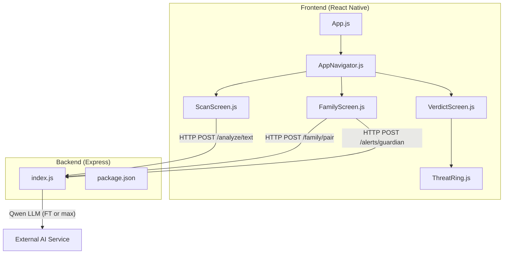
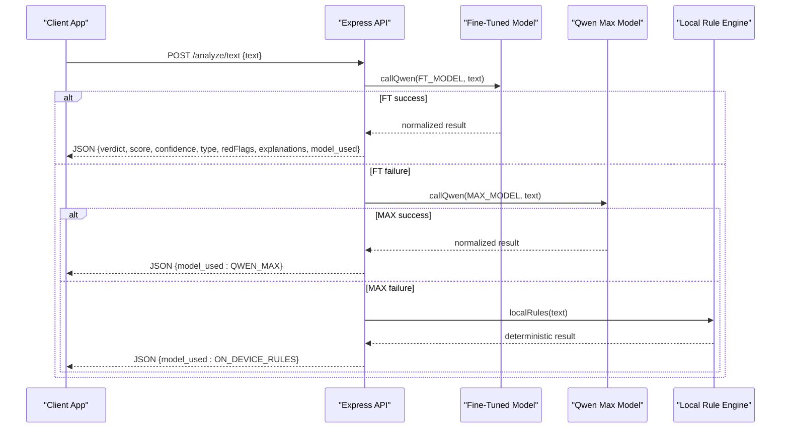
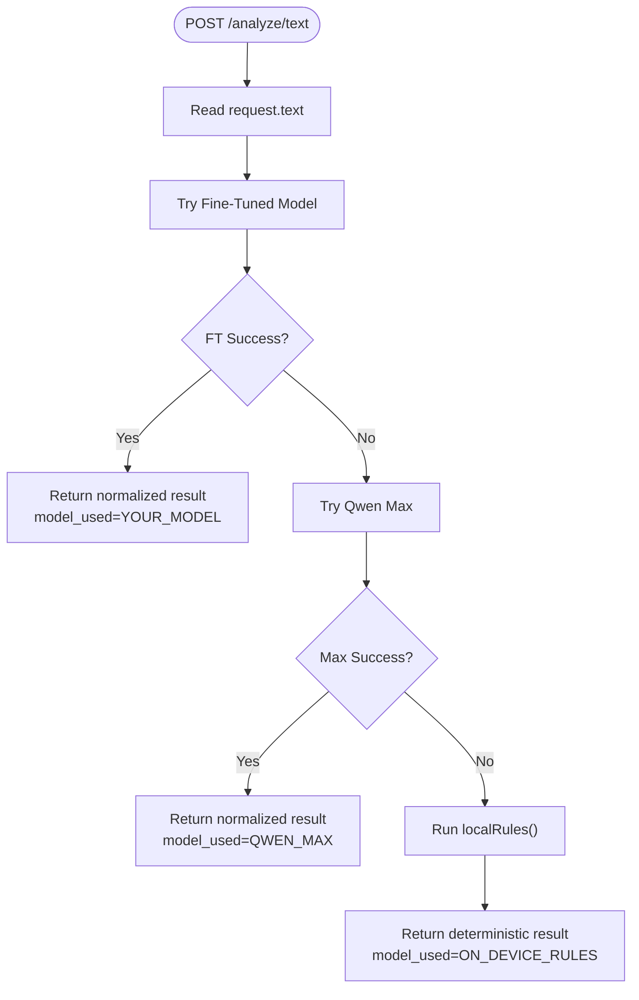
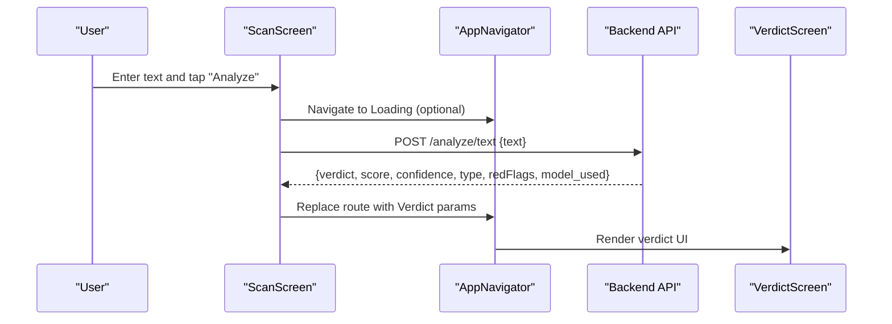
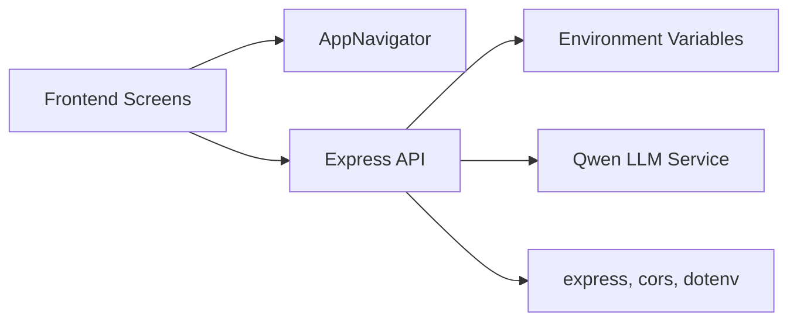

# AI Analysis Engine

<cite>
**Referenced Files in This Document**
- [backend/index.js](file://backend/index.js)
- [backend/package.json](file://backend/package.json)
- [backend/test.js](file://backend/test.js)
- [README.md](file://README.md)
- [App.js](file://App.js)
- [src/screens/ScanScreen.js](file://src/screens/ScanScreen.js)
- [src/screens/FamilyScreen.js](file://src/screens/FamilyScreen.js)
- [src/screens/VerdictScreen.js](file://src/screens/VerdictScreen.js)
- [src/components/ThreatRing.js](file://src/components/ThreatRing.js)
- [src/navigation/AppNavigator.js](file://src/navigation/AppNavigator.js)
</cite>

## Table of Contents
1. [Introduction](#introduction)
2. [Project Structure](#project-structure)
3. [Core Components](#core-components)
4. [Architecture Overview](#architecture-overview)
5. [Detailed Component Analysis](#detailed-component-analysis)
6. [Dependency Analysis](#dependency-analysis)
7. [Performance Considerations](#performance-considerations)
8. [Troubleshooting Guide](#troubleshooting-guide)
9. [Conclusion](#conclusion)
10. [Appendices](#appendices)

## Introduction
This document describes Safe Pakistan’s AI analysis engine and backend API system. It covers:
- Backend API endpoints for text analysis, family management, and alert notifications
- Request/response schemas and authentication methods
- Multi-tier model fallback system that switches between AI models based on availability and performance
- Local rule engine for deterministic threat detection when AI models are unavailable
- Response format specifications, error handling strategies, and rate limiting mechanisms
- Model selection algorithms, performance optimization techniques, caching strategies, and scalability considerations
- Examples of API integration, error handling patterns, and debugging approaches for production deployments

## Project Structure
The repository includes a React Native frontend and a Node.js Express backend. The backend exposes the AI analysis endpoints and supporting services. The frontend provides screens to capture input (text, voice, screenshots), display results, and manage family features.

**Diagram sources**
- [App.js:1-44](file://App.js#L1-L44)
- [src/navigation/AppNavigator.js:1-121](file://src/navigation/AppNavigator.js#L1-L121)
- [src/screens/ScanScreen.js:1-151](file://src/screens/ScanScreen.js#L1-L151)
- [src/screens/FamilyScreen.js:1-101](file://src/screens/FamilyScreen.js#L1-L101)
- [src/screens/VerdictScreen.js:1-268](file://src/screens/VerdictScreen.js#L1-L268)
- [src/components/ThreatRing.js:1-92](file://src/components/ThreatRing.js#L1-L92)
- [backend/index.js:1-82](file://backend/index.js#L1-L82)
- [backend/package.json:1-19](file://backend/package.json#L1-L19)

**Section sources**
- [backend/index.js:1-82](file://backend/index.js#L1-L82)
- [backend/package.json:1-19](file://backend/package.json#L1-L19)
- [README.md:1-279](file://README.md#L1-L279)
- [App.js:1-44](file://App.js#L1-L44)

## Core Components
- Text analysis endpoint with multi-tier model fallback and local rule engine
- Family pairing endpoint to generate temporary pairing codes
- Alert notification endpoint to push guardian alerts
- Frontend screens for scanning, verdict display, and family management

Key responsibilities:
- Backend orchestrates AI calls and falls back to local rules if needed
- Frontend captures user input and renders verdicts and metrics
- Navigation wires screens into a tabbed app with stack transitions

**Section sources**
- [backend/index.js:16-82](file://backend/index.js#L16-L82)
- [src/screens/ScanScreen.js:15-23](file://src/screens/ScanScreen.js#L15-L23)
- [src/screens/FamilyScreen.js:20-83](file://src/screens/FamilyScreen.js#L20-L83)
- [src/screens/VerdictScreen.js:19-116](file://src/screens/VerdictScreen.js#L19-L116)

## Architecture Overview
The backend implements a three-layer analysis pipeline:
1. Layer 1: Custom fine-tuned model (configurable via environment variable)
2. Layer 2: General-purpose model (qwen-max)
3. Layer 3: Deterministic local rule engine

If any layer fails, the next layer is attempted automatically. If all layers fail, the response still returns a safe result from the local rule engine.

**Diagram sources**
- [backend/index.js:16-70](file://backend/index.js#L16-L70)

**Section sources**
- [backend/index.js:16-70](file://backend/index.js#L16-L70)

## Detailed Component Analysis

### Text Analysis Endpoint (/analyze/text)
- Purpose: Analyze text for scam/suspicious/safe classification with risk scoring and evidence spans
- Input schema:
  - text: string (required)
- Output schema:
  - verdict: enum ("scam" | "suspicious" | "safe")
  - score: number (0–100)
  - confidence: number (0–100)
  - type: string (detected scam category)
  - redFlags: array of strings (evidence triggers, up to 3)
  - explanation_en: string
  - explanation_roman_ur: string
  - explanation_urdu: string
  - model_used: enum ("YOUR_MODEL" | "QWEN_MAX" | "ON_DEVICE_RULES")
- Authentication: Not implemented in current code; add middleware for production
- Rate limiting: Not implemented; add middleware for production
- Error handling:
  - Network or API errors from AI layers are caught and logged; fallback proceeds
  - Invalid JSON from AI output raises an error and triggers fallback
  - Final fallback always returns a valid response using local rules

**Diagram sources**
- [backend/index.js:45-70](file://backend/index.js#L45-L70)

**Section sources**
- [backend/index.js:16-70](file://backend/index.js#L16-L70)
- [backend/test.js:1-8](file://backend/test.js#L1-L8)

### Family Management Endpoint (/family/pair)
- Purpose: Generate a temporary pairing code for family linking
- Input schema: none required
- Output schema:
  - pairing_code: string (6-digit numeric)
  - expires_at: ISO timestamp (1 hour from now)
- Authentication: Not implemented; add token-based auth for production
- Rate limiting: Not implemented; add per-user throttling

**Section sources**
- [backend/index.js:72-75](file://backend/index.js#L72-L75)

### Alert Notification Endpoint (/alerts/guardian)
- Purpose: Send push notifications to guardians about threats
- Input schema: arbitrary payload (logged by server)
- Output schema:
  - sent: boolean
  - push_id: string (unique identifier)
- Authentication: Not implemented; add token-based auth for production
- Rate limiting: Not implemented; add burst protection

**Section sources**
- [backend/index.js:77-80](file://backend/index.js#L77-L80)

### Frontend Integration Points
- ScanScreen: Captures text input and navigates to Verdict; placeholder for backend call
- FamilyScreen: Displays family members and invites; can wire to /family/pair
- VerdictScreen: Renders verdict, threat ring, confidence, type, and actions
- ThreatRing: Animated SVG ring visualizing threat score

**Diagram sources**
- [src/screens/ScanScreen.js:15-23](file://src/screens/ScanScreen.js#L15-L23)
- [src/navigation/AppNavigator.js:80-101](file://src/navigation/AppNavigator.js#L80-L101)
- [src/screens/VerdictScreen.js:19-116](file://src/screens/VerdictScreen.js#L19-L116)
- [backend/index.js:63-70](file://backend/index.js#L63-L70)

**Section sources**
- [src/screens/ScanScreen.js:15-23](file://src/screens/ScanScreen.js#L15-L23)
- [src/screens/FamilyScreen.js:20-83](file://src/screens/FamilyScreen.js#L20-L83)
- [src/screens/VerdictScreen.js:19-116](file://src/screens/VerdictScreen.js#L19-L116)
- [src/components/ThreatRing.js:18-83](file://src/components/ThreatRing.js#L18-L83)
- [src/navigation/AppNavigator.js:80-101](file://src/navigation/AppNavigator.js#L80-L101)

## Dependency Analysis
- Backend dependencies:
  - express: HTTP server framework
  - cors: Cross-origin resource sharing
  - dotenv: Environment variable loading
- External dependency:
  - Qwen LLM service via HTTPS fetch (base URL and key from environment)
- Frontend navigation:
  - React Navigation v6 with native stack and bottom tabs
- Fonts and theme:
  - Inter and Noto Nastaliq Urdu fonts loaded at app start

**Diagram sources**
- [backend/package.json:13-17](file://backend/package.json#L13-L17)
- [backend/index.js:1-12](file://backend/index.js#L1-L12)
- [src/navigation/AppNavigator.js:10-33](file://src/navigation/AppNavigator.js#L10-L33)
- [App.js:9-15](file://App.js#L9-L15)

**Section sources**
- [backend/package.json:1-19](file://backend/package.json#L1-L19)
- [backend/index.js:1-12](file://backend/index.js#L1-L12)
- [src/navigation/AppNavigator.js:10-33](file://src/navigation/AppNavigator.js#L10-L33)
- [App.js:9-15](file://App.js#L9-L15)

## Performance Considerations
- Model selection algorithm:
  - Attempts fine-tuned model first for best accuracy and latency; falls back to qwen-max; finally uses local rules
  - Errors are caught per layer to ensure resilience
- Deterministic fallback:
  - Local rule engine runs regex-based heuristics to produce immediate verdicts without network calls
- Optimization opportunities:
  - Add request-level caching for repeated texts to reduce redundant AI calls
  - Implement rate limiting to protect external model quotas
  - Use connection pooling and timeouts for external API calls
  - Batch requests where possible to reduce overhead
- Scalability considerations:
  - Stateless API design allows horizontal scaling behind a load balancer
  - Introduce a message queue for async alert processing
  - Cache frequent responses in Redis or in-memory store
  - Monitor latency and error rates per model layer to adjust routing weights

[No sources needed since this section provides general guidance]

## Troubleshooting Guide
Common issues and resolutions:
- No JSON in AI output:
  - The parser expects a JSON object within the response text; if missing, it throws an error and triggers fallback
  - Check external model prompt and response formatting
- Bad JSON shape:
  - Ensure the response contains required fields like verdict; otherwise, normalize or reject
- Network errors:
  - Catch and log errors; rely on fallback layers to return a usable result
- Missing environment variables:
  - Ensure BASE URL and API key are set; otherwise, AI calls will fail
- Testing locally:
  - Use the provided test script to send sample text and inspect the response

Debugging steps:
- Run the backend locally and invoke /analyze/text with sample payloads
- Inspect logs for layer-specific errors and fallback behavior
- Validate environment configuration for external model access

**Section sources**
- [backend/index.js:24-31](file://backend/index.js#L24-L31)
- [backend/index.js:63-70](file://backend/index.js#L63-L70)
- [backend/test.js:1-8](file://backend/test.js#L1-L8)

## Conclusion
Safe Pakistan’s backend provides a resilient AI analysis pipeline with automatic fallback to deterministic local rules. The API exposes clear endpoints for text analysis, family pairing, and guardian alerts. While authentication and rate limiting are not yet implemented, the architecture supports adding these features for production readiness. The frontend integrates smoothly with the backend through well-defined request/response contracts and provides rich UI feedback for users.

[No sources needed since this section summarizes without analyzing specific files]

## Appendices

### API Reference

#### POST /analyze/text
- Description: Analyze text for scam detection using multi-tier model fallback
- Request body:
  - text: string
- Response body:
  - verdict: enum ("scam" | "suspicious" | "safe")
  - score: number (0–100)
  - confidence: number (0–100)
  - type: string
  - redFlags: array of strings
  - explanation_en: string
  - explanation_roman_ur: string
  - explanation_urdu: string
  - model_used: enum ("YOUR_MODEL" | "QWEN_MAX" | "ON_DEVICE_RULES")
- Authentication: None (add middleware for production)
- Rate limiting: None (add middleware for production)

**Section sources**
- [backend/index.js:16-70](file://backend/index.js#L16-L70)

#### POST /family/pair
- Description: Generate a temporary pairing code for family linking
- Request body: none
- Response body:
  - pairing_code: string
  - expires_at: ISO timestamp
- Authentication: None (add middleware for production)
- Rate limiting: None (add middleware for production)

**Section sources**
- [backend/index.js:72-75](file://backend/index.js#L72-L75)

#### POST /alerts/guardian
- Description: Send push notifications to guardians
- Request body: arbitrary payload
- Response body:
  - sent: boolean
  - push_id: string
- Authentication: None (add middleware for production)
- Rate limiting: None (add middleware for production)

**Section sources**
- [backend/index.js:77-80](file://backend/index.js#L77-L80)

### Example Integration Patterns

- Frontend call pattern:
  - Capture text input
  - POST to /analyze/text
  - Handle response and navigate to Verdict screen
  - Persist scan history locally

- Error handling pattern:
  - Wrap API calls in try/catch
  - Display user-friendly messages
  - Log detailed errors for debugging

- Debugging approach:
  - Use local backend and test script
  - Inspect logs for layer failures
  - Validate environment variables

**Section sources**
- [README.md:186-201](file://README.md#L186-L201)
- [backend/test.js:1-8](file://backend/test.js#L1-L8)