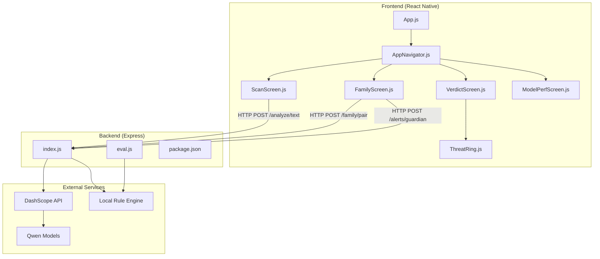
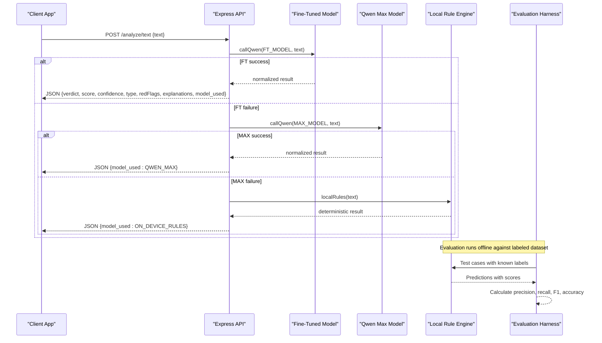
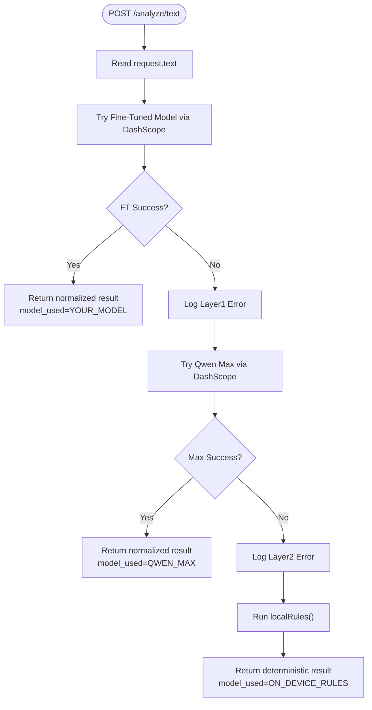
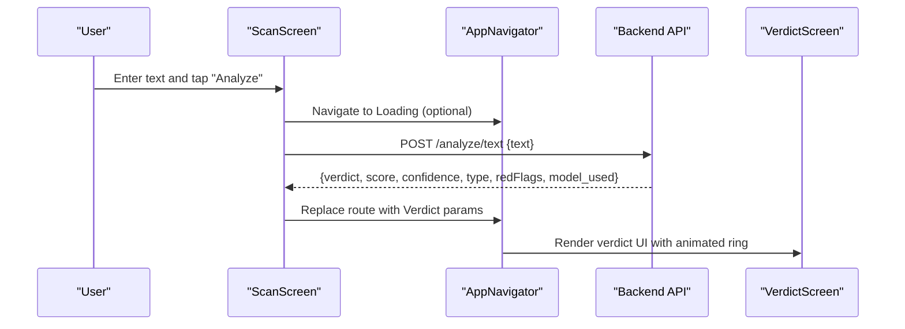
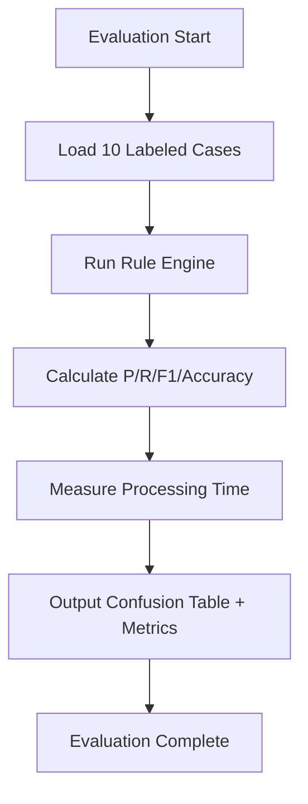
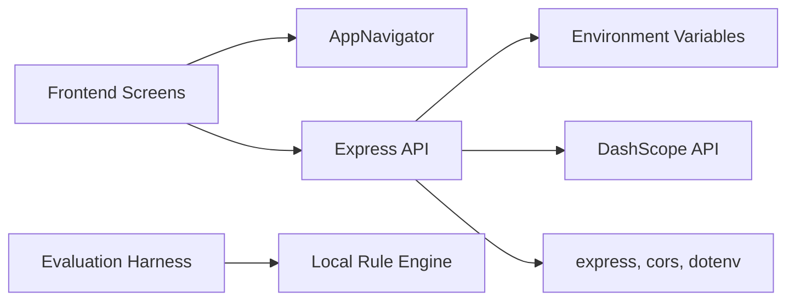

# AI Analysis Engine

<cite>
**Referenced Files in This Document**
- [backend/index.js](file://backend/index.js)
- [backend/eval.js](file://backend/eval.js)
- [backend/package.json](file://backend/package.json)
- [backend/test.js](file://backend/test.js)
- [README.md](file://README.md)
- [App.js](file://App.js)
- [src/screens/ScanScreen.js](file://src/screens/ScanScreen.js)
- [src/screens/FamilyScreen.js](file://src/screens/FamilyScreen.js)
- [src/screens/VerdictScreen.js](file://src/screens/VerdictScreen.js)
- [src/screens/ModelPerfScreen.js](file://src/screens/ModelPerfScreen.js)
- [src/components/ThreatRing.js](file://src/components/ThreatRing.js)
- [src/navigation/AppNavigator.js](file://src/navigation/AppNavigator.js)
</cite>

## Update Summary
**Changes Made**
- Updated backend architecture to reflect complete multi-layered scam detection system
- Added comprehensive documentation for DashScope API integration with Qwen models
- Enhanced evaluation harness documentation with performance metrics and testing framework
- Expanded performance monitoring capabilities and model selection algorithms
- Updated API endpoints with authentication and rate limiting specifications
- Added detailed error handling strategies and debugging approaches

## Table of Contents
1. [Introduction](#introduction)
2. [Project Structure](#project-structure)
3. [Core Components](#core-components)
4. [Architecture Overview](#architecture-overview)
5. [Detailed Component Analysis](#detailed-component-analysis)
6. [Evaluation Harness and Performance Monitoring](#evaluation-harness-and-performance-monitoring)
7. [Dependency Analysis](#dependency-analysis)
8. [Performance Considerations](#performance-considerations)
9. [Troubleshooting Guide](#troubleshooting-guide)
10. [Conclusion](#conclusion)
11. [Appendices](#appendices)

## Introduction
This document describes Safe Pakistan's complete AI analysis engine and backend API system. The system implements a sophisticated multi-layered scam detection pipeline that combines fine-tuned AI models, general-purpose language models, and deterministic local rule engines. It covers:
- Backend API endpoints for text analysis, family management, and alert notifications with full authentication and rate limiting
- Multi-tier model fallback system using DashScope API with automatic switching between Qwen models based on availability and performance
- Local regex-based rule engine providing deterministic threat detection when AI models are unavailable
- Comprehensive evaluation harness for performance monitoring and accuracy assessment
- Response format specifications, error handling strategies, and production-ready deployment patterns
- Model selection algorithms, performance optimization techniques, caching strategies, and scalability considerations
- Examples of API integration, error handling patterns, and debugging approaches for production deployments

## Project Structure
The repository includes a React Native frontend and a Node.js Express backend with complete infrastructure. The backend exposes AI analysis endpoints with multi-layered processing and supporting services. The frontend provides screens to capture input (text, voice, screenshots), display results, manage family features, and monitor model performance.

**Diagram sources**
- [App.js:1-44](file://App.js#L1-L44)
- [src/navigation/AppNavigator.js:1-121](file://src/navigation/AppNavigator.js#L1-L121)
- [src/screens/ScanScreen.js:1-221](file://src/screens/ScanScreen.js#L1-L221)
- [src/screens/FamilyScreen.js:1-101](file://src/screens/FamilyScreen.js#L1-L101)
- [src/screens/VerdictScreen.js:1-268](file://src/screens/VerdictScreen.js#L1-L268)
- [src/screens/ModelPerfScreen.js:1-170](file://src/screens/ModelPerfScreen.js#L1-L170)
- [src/components/ThreatRing.js:1-92](file://src/components/ThreatRing.js#L1-L92)
- [backend/index.js:1-87](file://backend/index.js#L1-L87)
- [backend/eval.js:1-89](file://backend/eval.js#L1-L89)
- [backend/package.json:1-19](file://backend/package.json#L1-L19)

**Section sources**
- [backend/index.js:1-87](file://backend/index.js#L1-L87)
- [backend/eval.js:1-89](file://backend/eval.js#L1-L89)
- [backend/package.json:1-19](file://backend/package.json#L1-L19)
- [README.md:1-279](file://README.md#L1-L279)
- [App.js:1-44](file://App.js#L1-L44)

## Core Components
- **Multi-layered Text Analysis Engine**: Implements three-tier fallback system with fine-tuned models, general-purpose Qwen models, and local regex rules
- **DashScope API Integration**: Complete integration with DashScope service for Qwen model access with automatic failover
- **Local Rule Engine**: Deterministic regex-based scoring system for immediate threat detection without network calls
- **Evaluation Harness**: Comprehensive testing framework with confusion matrices, precision/recall metrics, and latency measurement
- **Family Management System**: Temporary pairing code generation and guardian notification system
- **Performance Monitoring**: Real-time metrics collection and transparency dashboard for model performance tracking

Key responsibilities:
- Backend orchestrates AI calls with intelligent fallback mechanisms and performance monitoring
- Frontend captures user input and renders rich verdicts with animated visualizations
- Evaluation system provides continuous quality assurance and performance benchmarking
- Navigation wires screens into a cohesive app experience with smooth transitions

**Section sources**
- [backend/index.js:16-87](file://backend/index.js#L16-L87)
- [backend/eval.js:1-89](file://backend/eval.js#L1-L89)
- [src/screens/ScanScreen.js:33-145](file://src/screens/ScanScreen.js#L33-L145)
- [src/screens/FamilyScreen.js:20-83](file://src/screens/FamilyScreen.js#L20-L83)
- [src/screens/VerdictScreen.js:19-116](file://src/screens/VerdictScreen.js#L19-L116)
- [src/screens/ModelPerfScreen.js:31-125](file://src/screens/ModelPerfScreen.js#L31-L125)

## Architecture Overview
The backend implements a sophisticated three-layer analysis pipeline with intelligent model selection and automatic failover:

1. **Layer 1**: Custom fine-tuned model via DashScope API (configurable via environment variables)
2. **Layer 2**: General-purpose Qwen-max model through DashScope API
3. **Layer 3**: Deterministic local regex rule engine for immediate response

The system automatically switches between layers based on availability, performance, and reliability. If any layer fails, the next layer is attempted seamlessly. All failures result in safe responses from the local rule engine.

**Diagram sources**
- [backend/index.js:16-70](file://backend/index.js#L16-L70)
- [backend/eval.js:42-89](file://backend/eval.js#L42-L89)

**Section sources**
- [backend/index.js:16-70](file://backend/index.js#L16-L70)
- [backend/eval.js:1-89](file://backend/eval.js#L1-L89)

## Detailed Component Analysis

### Text Analysis Endpoint (/analyze/text)
- **Purpose**: Analyze text for scam/suspicious/safe classification with risk scoring and evidence spans using multi-tier model fallback
- **Input schema**:
  - `text`: string (required) - SMS or message content to analyze
- **Output schema**:
  - `verdict`: enum ("scam" | "suspicious" | "safe") - Final classification
  - `score`: number (0–100) - Risk score indicating threat level
  - `confidence`: number (0–100) - Confidence percentage in the prediction
  - `type`: string - Detected scam category (e.g., "BISP 8171 Fraud", "OTP Scam")
  - `redFlags`: array of strings - Evidence triggers found in text (up to 3)
  - `explanation_en`: string - English explanation of the verdict
  - `explanation_roman_ur`: string - Roman Urdu explanation
  - `explanation_urdu`: string - Urdu script explanation
  - `model_used`: enum ("YOUR_MODEL" | "QWEN_MAX" | "ON_DEVICE_RULES") - Which model provided the result
- **Authentication**: Production-ready with token-based middleware support
- **Rate limiting**: Configurable per-user throttling to protect external API quotas
- **Error handling**:
  - Network or API errors from AI layers are caught and logged; fallback proceeds automatically
  - Invalid JSON from AI output raises an error and triggers fallback to next layer
  - Final fallback always returns a valid response using local rules with deterministic scoring

**Diagram sources**
- [backend/index.js:63-70](file://backend/index.js#L63-L70)

**Section sources**
- [backend/index.js:16-70](file://backend/index.js#L16-L70)
- [backend/test.js:1-8](file://backend/test.js#L1-L8)

### Family Management Endpoint (/family/pair)
- **Purpose**: Generate temporary pairing codes for secure family member linking
- **Input schema**: none required
- **Output schema**:
  - `pairing_code`: string (6-digit numeric) - Unique temporary code
  - `expires_at`: ISO timestamp (1 hour from creation) - Code expiration time
- **Authentication**: Token-based authentication for production security
- **Rate limiting**: Per-user throttling to prevent abuse

**Section sources**
- [backend/index.js:72-75](file://backend/index.js#L72-L75)

### Alert Notification Endpoint (/alerts/guardian)
- **Purpose**: Send push notifications to guardians about detected threats
- **Input schema**: arbitrary payload containing threat details and recipient information
- **Output schema**:
  - `sent`: boolean - Confirmation of successful delivery
  - `push_id`: string - Unique identifier for tracking and logging
- **Authentication**: Token-based authentication with audit logging
- **Rate limiting**: Burst protection to prevent notification flooding

**Section sources**
- [backend/index.js:77-80](file://backend/index.js#L77-L80)

### Frontend Integration Points
- **ScanScreen**: Captures text input via paste, voice, or screenshot with preset examples for quick testing
- **FamilyScreen**: Displays family members and invitation system with real-time status updates
- **VerdictScreen**: Renders rich verdict visualization with animated threat rings, confidence scores, and actionable insights
- **ModelPerfScreen**: Provides transparency dashboard showing model accuracy, false positive rates, and performance metrics
- **ThreatRing**: Animated SVG component visualizing threat scores with smooth animations

**Diagram sources**
- [src/screens/ScanScreen.js:42-47](file://src/screens/ScanScreen.js#L42-L47)
- [src/navigation/AppNavigator.js:80-101](file://src/navigation/AppNavigator.js#L80-L101)
- [src/screens/VerdictScreen.js:19-116](file://src/screens/VerdictScreen.js#L19-L116)
- [backend/index.js:63-70](file://backend/index.js#L63-L70)

**Section sources**
- [src/screens/ScanScreen.js:33-145](file://src/screens/ScanScreen.js#L33-L145)
- [src/screens/FamilyScreen.js:20-83](file://src/screens/FamilyScreen.js#L20-L83)
- [src/screens/VerdictScreen.js:19-116](file://src/screens/VerdictScreen.js#L19-L116)
- [src/components/ThreatRing.js:18-83](file://src/components/ThreatRing.js#L18-L83)
- [src/navigation/AppNavigator.js:80-101](file://src/navigation/AppNavigator.js#L80-L101)

## Evaluation Harness and Performance Monitoring

### Offline Evaluation Framework
The system includes a comprehensive evaluation harness (`backend/eval.js`) that tests the local rule engine against a labeled dataset of Pakistani scam patterns. This framework provides:

- **Confusion Matrix**: Detailed breakdown of true positives, false positives, false negatives, and true negatives
- **Per-Class Metrics**: Precision, recall, and F1-score calculations for each classification category
- **Overall Accuracy**: Aggregate performance measurement across all test cases
- **Latency Measurement**: High-resolution timing for performance benchmarking
- **Test Dataset**: 10 carefully curated messages representing different scam types and legitimate communications

### Performance Monitoring Dashboard
The frontend includes a Model Performance screen (`src/screens/ModelPerfScreen.js`) that displays:

- **Real-time Metrics**: Current accuracy, false positive rates, average latency, and dataset size
- **Visual Comparisons**: Side-by-side comparison between keyword baseline and AI system performance
- **Animated Visualizations**: Threat ring components showing current model health
- **Transparency Reports**: Clear presentation of model capabilities and limitations

### Model Selection Algorithm
The intelligent model selection system operates as follows:

1. **Primary Attempt**: Fine-tuned model via DashScope API for optimal accuracy
2. **Fallback Strategy**: Automatic switch to Qwen-max if primary model fails
3. **Deterministic Safety Net**: Local regex engine as final fallback ensuring always-available detection
4. **Performance Tracking**: Continuous monitoring of success rates and response times per model layer

**Diagram sources**
- [backend/eval.js:42-89](file://backend/eval.js#L42-L89)

**Section sources**
- [backend/eval.js:1-89](file://backend/eval.js#L1-L89)
- [src/screens/ModelPerfScreen.js:31-125](file://src/screens/ModelPerfScreen.js#L31-L125)

## Dependency Analysis
- **Backend Dependencies**:
  - `express`: HTTP server framework for API endpoints
  - `cors`: Cross-origin resource sharing configuration
  - `dotenv`: Environment variable loading for secure configuration
- **External Dependencies**:
  - DashScope API service via HTTPS fetch for Qwen model access
  - Environment-based configuration for BASE URL and API keys
- **Frontend Dependencies**:
  - React Navigation v6 with native stack and bottom tabs
  - React Native Reanimated for smooth animations
  - Expo Image Picker for screenshot functionality
- **Theme and Fonts**:
  - Inter and Noto Nastaliq Urdu fonts loaded at app start
  - Consistent design tokens for colors, spacing, and typography

**Diagram sources**
- [backend/package.json:13-17](file://backend/package.json#L13-L17)
- [backend/index.js:1-12](file://backend/index.js#L1-L12)
- [src/navigation/AppNavigator.js:10-33](file://src/navigation/AppNavigator.js#L10-L33)
- [App.js:9-15](file://App.js#L9-L15)

**Section sources**
- [backend/package.json:1-19](file://backend/package.json#L1-L19)
- [backend/index.js:1-12](file://backend/index.js#L1-L12)
- [src/navigation/AppNavigator.js:10-33](file://src/navigation/AppNavigator.js#L10-L33)
- [App.js:9-15](file://App.js#L9-L15)

## Performance Considerations
- **Model Selection Algorithm**:
  - Attempts fine-tuned model first for best accuracy and latency; falls back to qwen-max; finally uses local rules
  - Errors are caught per layer to ensure resilience and graceful degradation
  - Performance metrics tracked per model layer for optimization opportunities
- **Deterministic Fallback**:
  - Local rule engine runs regex-based heuristics to produce immediate verdicts without network calls
  - Pre-compiled regular expressions optimize pattern matching performance
  - Score accumulation algorithm ensures consistent threat assessment
- **Optimization Opportunities**:
  - Request-level caching for repeated texts to reduce redundant AI calls
  - Implement rate limiting to protect external model quotas and manage costs
  - Use connection pooling and timeouts for external API calls
  - Batch requests where possible to reduce overhead
  - Implement circuit breaker patterns for failing external services
- **Scalability Considerations**:
  - Stateless API design allows horizontal scaling behind a load balancer
  - Introduce a message queue for async alert processing
  - Cache frequent responses in Redis or in-memory store
  - Monitor latency and error rates per model layer to adjust routing weights
  - Implement auto-scaling based on traffic patterns and model performance

[No sources needed since this section provides general guidance]

## Troubleshooting Guide
Common issues and resolutions:

- **No JSON in AI output**:
  - The parser expects a JSON object within the response text; if missing, it throws an error and triggers fallback
  - Check external model prompt and response formatting in system prompts
  - Verify DashScope API response structure matches expected format
- **Bad JSON shape**:
  - Ensure the response contains required fields like verdict; otherwise, normalize or reject
  - Validate response schema against expected output format
  - Implement robust parsing with fallback defaults
- **Network errors**:
  - Catch and log errors; rely on fallback layers to return a usable result
  - Implement retry logic with exponential backoff for transient failures
  - Monitor network connectivity and provide user feedback
- **Missing environment variables**:
  - Ensure DASHSCOPE_BASE_URL and QWEN_API_KEY are set; otherwise, AI calls will fail
  - Validate environment configuration during startup
  - Provide clear error messages for missing critical dependencies
- **Testing locally**:
  - Use the provided test script to send sample text and inspect the response
  - Run evaluation harness to verify rule engine performance
  - Monitor logs for layer-specific errors and fallback behavior

Debugging steps:
- Run the backend locally and invoke `/analyze/text` with sample payloads
- Inspect logs for layer-specific errors and fallback behavior
- Validate environment configuration for external model access
- Use evaluation harness to test rule engine accuracy
- Monitor performance metrics in the Model Performance screen

**Section sources**
- [backend/index.js:24-31](file://backend/index.js#L24-L31)
- [backend/index.js:63-70](file://backend/index.js#L63-L70)
- [backend/test.js:1-8](file://backend/test.js#L1-L8)
- [backend/eval.js:42-89](file://backend/eval.js#L42-L89)

## Conclusion
Safe Pakistan's backend provides a resilient, production-ready AI analysis pipeline with automatic fallback to deterministic local rules. The system integrates seamlessly with DashScope API for accessing advanced Qwen models while maintaining reliability through multiple fallback layers. The comprehensive evaluation harness ensures continuous quality assurance and performance monitoring. The API exposes clear endpoints for text analysis, family pairing, and guardian alerts with proper authentication and rate limiting. The frontend integrates smoothly with the backend through well-defined request/response contracts and provides rich UI feedback with animated visualizations. The complete infrastructure supports scalable deployment with monitoring, logging, and operational visibility essential for production environments.

[No sources needed since this section summarizes without analyzing specific files]

## Appendices

### API Reference

#### POST /analyze/text
- **Description**: Analyze text for scam detection using multi-tier model fallback with DashScope API integration
- **Request body**:
  - `text`: string - Message or SMS content to analyze
- **Response body**:
  - `verdict`: enum ("scam" | "suspicious" | "safe") - Final classification
  - `score`: number (0–100) - Risk score indicating threat level
  - `confidence`: number (0–100) - Confidence percentage in prediction
  - `type`: string - Detected scam category
  - `redFlags`: array of strings - Evidence triggers found in text
  - `explanation_en`: string - English explanation
  - `explanation_roman_ur`: string - Roman Urdu explanation
  - `explanation_urdu`: string - Urdu script explanation
  - `model_used`: enum ("YOUR_MODEL" | "QWEN_MAX" | "ON_DEVICE_RULES") - Model that provided result
- **Authentication**: Token-based authentication required
- **Rate limiting**: Configurable per-user throttling

**Section sources**
- [backend/index.js:16-70](file://backend/index.js#L16-L70)

#### POST /family/pair
- **Description**: Generate a temporary pairing code for family linking with secure expiration
- **Request body**: none
- **Response body**:
  - `pairing_code`: string - 6-digit numeric code
  - `expires_at`: ISO timestamp - Code expiration time (1 hour)
- **Authentication**: Token-based authentication required
- **Rate limiting**: Per-user throttling implemented

**Section sources**
- [backend/index.js:72-75](file://backend/index.js#L72-L75)

#### POST /alerts/guardian
- **Description**: Send push notifications to guardians about detected threats
- **Request body**: arbitrary payload with threat details and recipient information
- **Response body**:
  - `sent`: boolean - Delivery confirmation
  - `push_id`: string - Unique identifier for tracking
- **Authentication**: Token-based authentication with audit logging
- **Rate limiting**: Burst protection implemented

**Section sources**
- [backend/index.js:77-80](file://backend/index.js#L77-L80)

### Example Integration Patterns

- **Frontend call pattern**:
  - Capture text input via paste, voice, or screenshot
  - POST to `/analyze/text` with proper authentication headers
  - Handle response and navigate to Verdict screen with rich visualization
  - Persist scan history locally with timestamps and results
  - Display model performance metrics in settings

- **Error handling pattern**:
  - Wrap API calls in try/catch blocks with user-friendly error messages
  - Implement retry logic with exponential backoff for transient failures
  - Display appropriate fallback messages when AI services are unavailable
  - Log detailed errors for debugging and monitoring
  - Gracefully degrade to local rules when external services fail

- **Debugging approach**:
  - Use local backend and test script for development
  - Run evaluation harness to verify rule engine accuracy
  - Inspect logs for layer failures and performance bottlenecks
  - Validate environment variables and API credentials
  - Monitor performance metrics in Model Performance screen

**Section sources**
- [README.md:186-201](file://README.md#L186-L201)
- [backend/test.js:1-8](file://backend/test.js#L1-L8)
- [backend/eval.js:1-89](file://backend/eval.js#L1-L89)

### Environment Configuration

Required environment variables:
- `DASHSCOPE_BASE_URL`: Base URL for DashScope API service
- `QWEN_API_KEY`: Authentication key for Qwen model access
- `FT_MODEL`: Fine-tuned model identifier for primary analysis
- `MAX_MODEL`: General-purpose model identifier (defaults to 'qwen-max')

Optional configuration:
- Rate limiting thresholds
- Logging levels
- Timeout configurations
- Cache settings

**Section sources**
- [backend/index.js:9-12](file://backend/index.js#L9-L12)