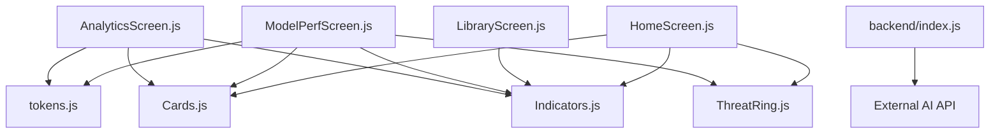
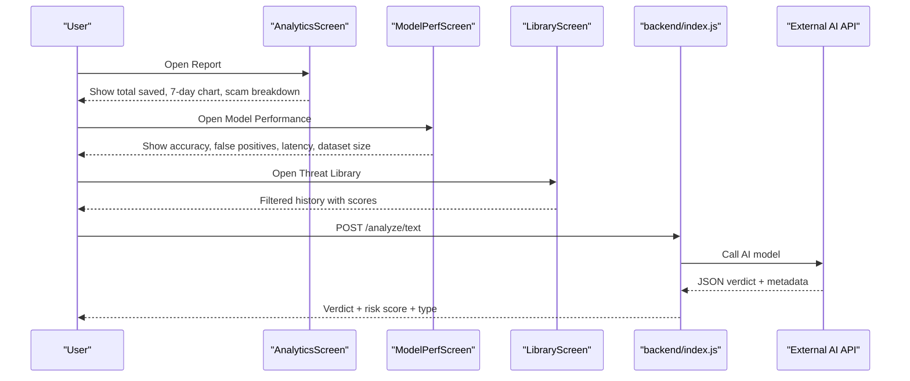
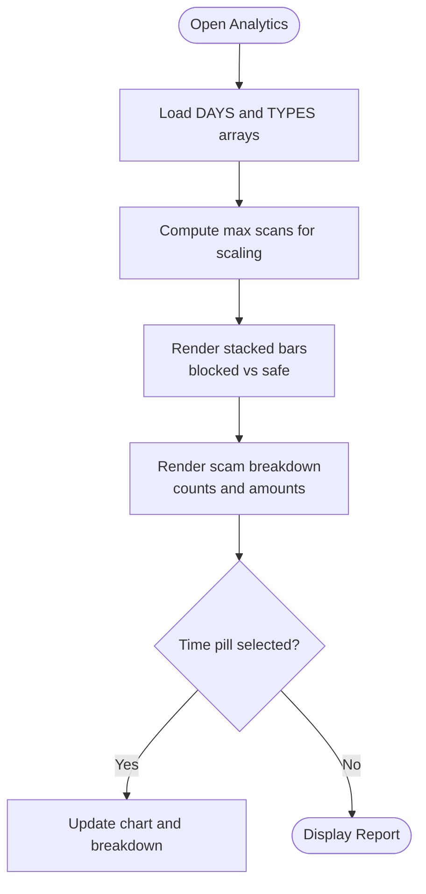
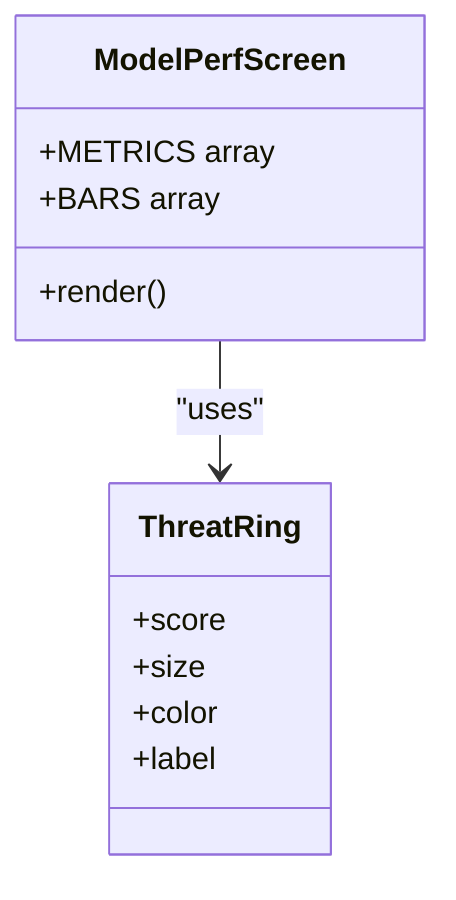
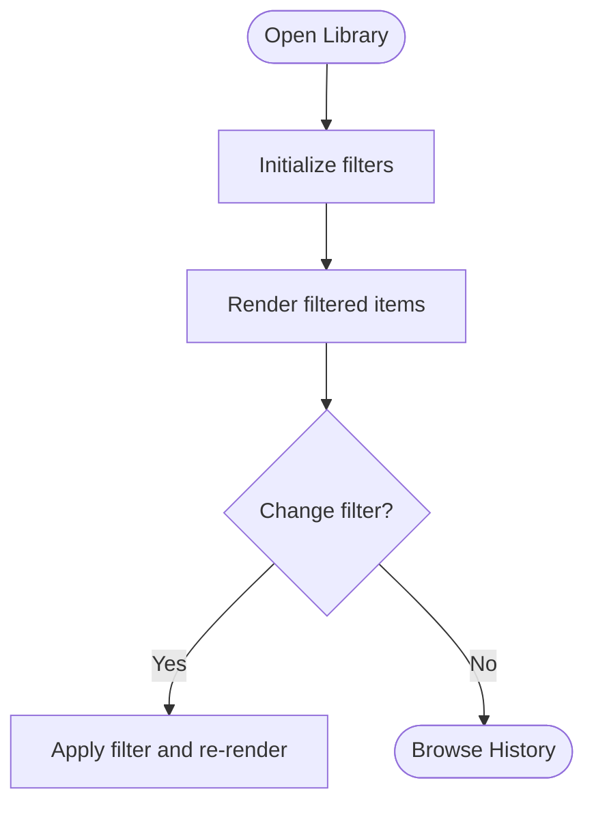
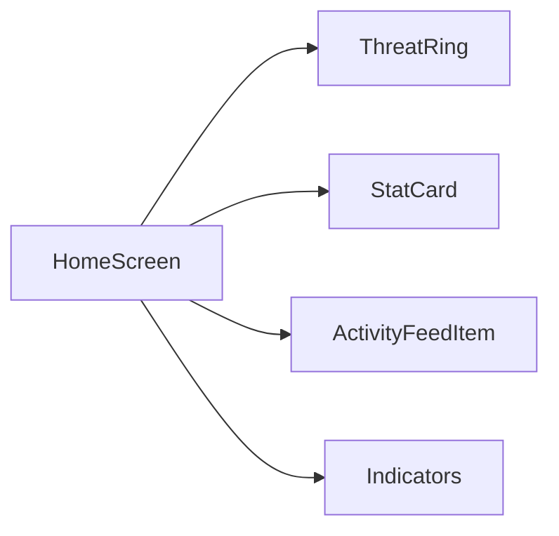
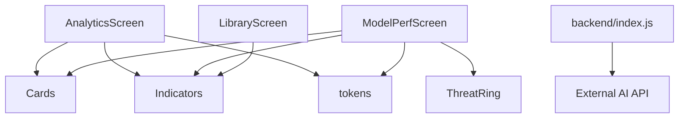

# Analytics & Reporting

<cite>
**Referenced Files in This Document**
- [AnalyticsScreen.js](file://src/screens/AnalyticsScreen.js)
- [ModelPerfScreen.js](file://src/screens/ModelPerfScreen.js)
- [LibraryScreen.js](file://src/screens/LibraryScreen.js)
- [HomeScreen.js](file://src/screens/HomeScreen.js)
- [Cards.js](file://src/components/Cards.js)
- [Indicators.js](file://src/components/Indicators.js)
- [ThreatRing.js](file://src/components/ThreatRing.js)
- [tokens.js](file://src/theme/tokens.js)
- [index.js](file://backend/index.js)
- [README.md](file://README.md)
</cite>

## Table of Contents
1. [Introduction](#introduction)
2. [Project Structure](#project-structure)
3. [Core Components](#core-components)
4. [Architecture Overview](#architecture-overview)
5. [Detailed Component Analysis](#detailed-component-analysis)
6. [Dependency Analysis](#dependency-analysis)
7. [Performance Considerations](#performance-considerations)
8. [Troubleshooting Guide](#troubleshooting-guide)
9. [Conclusion](#conclusion)
10. [Appendices](#appendices)

## Introduction
This document explains Safe Pakistan’s analytics and reporting capabilities as implemented in the codebase. It covers:
- Historical data visualization (weekly activity chart, scam type breakdown)
- Money saved calculations and tracking
- Scam type breakdown analysis
- Performance metrics monitoring (accuracy, false positives, latency, dataset size)
- Data aggregation and storage strategies referenced by screens and README
- Export functionality and privacy-preserving analytics considerations
- Report generation examples and dashboard customization options
- Integration points with external analytics platforms

The goal is to help developers and product owners understand how reports are rendered, where data comes from, and how to extend or integrate these features.

## Project Structure
Safe Pakistan organizes analytics and reporting across dedicated screens and reusable components:
- Analytics screen for weekly trends and money saved
- Model performance screen for accuracy and system health metrics
- Library screen for threat history and filtering
- Shared UI components for charts, badges, and rings
- Backend endpoints for analysis and alerts

**Diagram sources**
- [AnalyticsScreen.js:1-153](file://src/screens/AnalyticsScreen.js#L1-L153)
- [ModelPerfScreen.js:1-170](file://src/screens/ModelPerfScreen.js#L1-L170)
- [LibraryScreen.js:1-111](file://src/screens/LibraryScreen.js#L1-L111)
- [HomeScreen.js:1-158](file://src/screens/HomeScreen.js#L1-L158)
- [Cards.js:1-193](file://src/components/Cards.js#L1-L193)
- [Indicators.js:1-106](file://src/components/Indicators.js#L1-L106)
- [ThreatRing.js:1-92](file://src/components/ThreatRing.js#L1-L92)
- [tokens.js:1-129](file://src/theme/tokens.js#L1-L129)
- [index.js:1-82](file://backend/index.js#L1-L82)

**Section sources**
- [README.md:14-45](file://README.md#L14-L45)

## Core Components
- AnalyticsScreen: Displays a hero “Total Saved” card, a 7-day stacked bar chart of scans vs blocked, and a scam type breakdown with amounts per category. Includes time range pills (7 days, 30 days, year).
- ModelPerfScreen: Shows live model accuracy, false positive rate, average latency, dataset size, and a comparison between keyword baseline and AI detection.
- LibraryScreen: Provides a searchable, filterable list of past threats with scores and timestamps.
- Cards and Indicators: Reusable stat cards, section headers, verdict badges, status pills, and chips used across analytics views.
- ThreatRing: Animated circular progress ring used to visualize accuracy or protection score.
- tokens: Centralized design tokens (colors, gradients, typography) ensuring consistent visual presentation.

**Section sources**
- [AnalyticsScreen.js:10-117](file://src/screens/AnalyticsScreen.js#L10-L117)
- [ModelPerfScreen.js:19-121](file://src/screens/ModelPerfScreen.js#L19-L121)
- [LibraryScreen.js:8-64](file://src/screens/LibraryScreen.js#L8-L64)
- [Cards.js:28-127](file://src/components/Cards.js#L28-L127)
- [Indicators.js:10-77](file://src/components/Indicators.js#L10-L77)
- [ThreatRing.js:18-83](file://src/components/ThreatRing.js#L18-L83)
- [tokens.js:7-54](file://src/theme/tokens.js#L7-L54)

## Architecture Overview
The analytics and reporting architecture combines on-device UI rendering with backend-driven analysis and optional local persistence:
- The app renders historical summaries and trend charts using static or locally sourced datasets.
- Analysis results flow through a backend that can call an external AI service or fall back to local rules.
- Screens reference LocalDBService for saving and retrieving scan history and stats, enabling offline-first reporting.
- Design tokens standardize visuals across all analytics components.

**Diagram sources**
- [AnalyticsScreen.js:24-117](file://src/screens/AnalyticsScreen.js#L24-L117)
- [ModelPerfScreen.js:31-121](file://src/screens/ModelPerfScreen.js#L31-L121)
- [LibraryScreen.js:23-64](file://src/screens/LibraryScreen.js#L23-L64)
- [index.js:63-70](file://backend/index.js#L63-L70)

## Detailed Component Analysis

### Analytics Screen: Historical Visualization and Money Saved
- Hero “Total Saved”: Displays cumulative amount saved by preventing fraud. Calculated from aggregated scam prevention values per category.
- Weekly Activity Chart: Stacked bars showing daily scans and blocked counts; safe count derived as scans minus blocked.
- Scam Breakdown: Lists categories with counts and associated monetary impact; horizontal bars show relative proportions.
- Time Range Pills: Allow switching between 7 days, 30 days, and yearly views (UI present; data binding placeholder).
- Share Button: Enables sharing the report (UI present; share implementation placeholder).

**Diagram sources**
- [AnalyticsScreen.js:10-26](file://src/screens/AnalyticsScreen.js#L10-L26)
- [AnalyticsScreen.js:61-117](file://src/screens/AnalyticsScreen.js#L61-L117)

**Section sources**
- [AnalyticsScreen.js:10-117](file://src/screens/AnalyticsScreen.js#L10-L117)

### Model Performance Screen: Metrics Monitoring
- Accuracy Hero: Large percentage with animated ring indicating overall accuracy.
- Metric Grid: Displays accuracy, false positives, average latency, and dataset size with units and Urdu labels.
- Keyword vs AI Comparison: Two-bar chart comparing baseline keyword detection versus AI detection effectiveness.
- Footnote: Indicates evaluation dataset size and last evaluation date.

**Diagram sources**
- [ModelPerfScreen.js:19-121](file://src/screens/ModelPerfScreen.js#L19-L121)
- [ThreatRing.js:18-83](file://src/components/ThreatRing.js#L18-L83)

**Section sources**
- [ModelPerfScreen.js:19-121](file://src/screens/ModelPerfScreen.js#L19-L121)

### Library Screen: Interactive Exploration
- Search Bar: Placeholder for searching SMS content, sender, or scam type.
- Filters: Horizontal chips to filter by All, Scams, Suspicious, Safe with counts.
- History List: Rows showing type, message snippet, timestamp, and score with color-coded indicators.

**Diagram sources**
- [LibraryScreen.js:8-64](file://src/screens/LibraryScreen.js#L8-L64)

**Section sources**
- [LibraryScreen.js:8-64](file://src/screens/LibraryScreen.js#L8-L64)

### Home Screen: Dashboard Context
- Hero Card: Protection status and agent statuses (SMS, Voice, Link, Family).
- Stats Row: Threats blocked, total scans, family safe count.
- Recent Activity: Feed of recent scans with verdict badges and timestamps.

**Diagram sources**
- [HomeScreen.js:23-101](file://src/screens/HomeScreen.js#L23-L101)
- [Cards.js:47-127](file://src/components/Cards.js#L47-L127)
- [Indicators.js:10-77](file://src/components/Indicators.js#L10-L77)
- [ThreatRing.js:18-83](file://src/components/ThreatRing.js#L18-L83)

**Section sources**
- [HomeScreen.js:23-101](file://src/screens/HomeScreen.js#L23-L101)

## Dependency Analysis
- UI Dependencies:
  - AnalyticsScreen depends on Cards (SectionHeader), Indicators (VerdictBadge, StatusPill), and tokens (COLORS, gradients).
  - ModelPerfScreen depends on ThreatRing and shared components.
  - LibraryScreen uses Indicators for verdict badges and styling.
- Backend Dependencies:
  - index.js provides /analyze/text endpoint with fallback logic to external AI and local rules.
  - Additional endpoints for family pairing and guardian alerts exist but are not directly used by analytics screens.

**Diagram sources**
- [AnalyticsScreen.js:1-153](file://src/screens/AnalyticsScreen.js#L1-L153)
- [ModelPerfScreen.js:1-170](file://src/screens/ModelPerfScreen.js#L1-L170)
- [LibraryScreen.js:1-111](file://src/screens/LibraryScreen.js#L1-L111)
- [index.js:1-82](file://backend/index.js#L1-L82)

**Section sources**
- [AnalyticsScreen.js:1-153](file://src/screens/AnalyticsScreen.js#L1-L153)
- [ModelPerfScreen.js:1-170](file://src/screens/ModelPerfScreen.js#L1-L170)
- [LibraryScreen.js:1-111](file://src/screens/LibraryScreen.js#L1-L111)
- [index.js:1-82](file://backend/index.js#L1-L82)

## Performance Considerations
- Rendering Efficiency:
  - Charts compute heights based on max scans to avoid layout thrashing.
  - Tabular numbers ensure stable digit rendering during updates.
- Animation Costs:
  - ThreatRing uses Reanimated for smooth stroke animations; keep score updates minimal to avoid excessive recalculations.
- Network Calls:
  - Backend fallback ensures resilience; minimize retries and cache responses when possible.
- Memory Usage:
  - Avoid large datasets in memory; paginate or aggregate history in LibraryScreen if needed.

[No sources needed since this section provides general guidance]

## Troubleshooting Guide
- Missing Data:
  - If charts appear empty, verify DAYS and TYPES arrays are populated with valid numeric values.
- Incorrect Amounts:
  - Ensure scam breakdown amounts reflect actual prevented losses; validate aggregation logic before display.
- Backend Errors:
  - If /analyze/text fails, check environment variables (BASE URL, API key) and fallback to local rules.
- UI Inconsistencies:
  - Confirm tokens (COLORS, gradients) are correctly imported and applied consistently across screens.

**Section sources**
- [AnalyticsScreen.js:10-26](file://src/screens/AnalyticsScreen.js#L10-L26)
- [index.js:9-14](file://backend/index.js#L9-L14)
- [index.js:63-70](file://backend/index.js#L63-L70)
- [tokens.js:7-54](file://src/theme/tokens.js#L7-L54)

## Conclusion
Safe Pakistan’s analytics and reporting provide clear visibility into fraud prevention impact, model performance, and user activity. The current implementation includes robust UI for historical visualization, scam categorization, and performance metrics. To fully realize advanced features like dynamic data aggregation, export functionality, and privacy-preserving analytics, integrate LocalDBService calls and backend endpoints as indicated in the README and code comments.

[No sources needed since this section summarizes without analyzing specific files]

## Appendices

### Data Aggregation and Storage Strategies
- Local Persistence:
  - Use LocalDBService.getScanHistory() and getStats() to retrieve historical data for charts and summaries.
  - Save new scans via LocalDBService.saveScan({ verdict, score, type, text }) after analysis to maintain accurate records.
- Backend Integration:
  - Wire ScanScreen to call /analyze/text and persist results locally for reporting.
- Aggregation Logic:
  - Compute totals for “Money Saved” by summing prevented loss amounts per scam type.
  - Aggregate weekly scans and blocked counts to render the 7-day chart.

**Section sources**
- [README.md:173-201](file://README.md#L173-L201)

### Export Functionality
- Current State:
  - AnalyticsScreen includes a “Report Share Karein” button; implement share logic to export summary as image or PDF.
- Recommendations:
  - Generate a snapshot of the screen using platform-specific APIs.
  - Include key metrics: total saved, top scam types, accuracy, and date range.

[No sources needed since this section provides general guidance]

### Privacy-Preserving Analytics
- Anonymization:
  - Strip personally identifiable information from exported reports and logs.
- Consent:
  - Ensure users opt-in for analytics collection and can revoke consent at any time.
- Minimal Data:
  - Collect only necessary metrics (e.g., anonymized usage counts, model performance aggregates).

[No sources needed since this section provides general guidance]

### Report Generation Examples
- Weekly Summary:
  - Include total scans, blocked count, top scam types, and total saved amount.
- Monthly Trend:
  - Provide line or area charts for scans and blocked over time.
- Model Performance Snapshot:
  - Display accuracy, false positives, latency, and dataset size with comparison to baseline.

[No sources needed since this section provides general guidance]

### Dashboard Customization Options
- Time Range Selection:
  - Implement state management for 7 days, 30 days, and yearly views.
- Theme Variants:
  - Use tokens to support light/dark modes and brand variations.
- Language Support:
  - Maintain bilingual labels (English and Urdu) for accessibility and inclusivity.

**Section sources**
- [AnalyticsScreen.js:37-45](file://src/screens/AnalyticsScreen.js#L37-L45)
- [tokens.js:56-68](file://src/theme/tokens.js#L56-L68)

### Integration with External Analytics Platforms
- Event Tracking:
  - Track screen views (Analytics, Model Perf, Library) and interactions (filter changes, share actions).
- Metrics Export:
  - Periodically export aggregated metrics to external platforms via secure endpoints.
- Compliance:
  - Ensure data handling complies with privacy regulations and user consent preferences.

[No sources needed since this section provides general guidance]