# Core Features

<cite>
**Referenced Files in This Document**
- [README.md](file://README.md)
- [App.js](file://App.js)
- [package.json](file://package.json)
- [backend/index.js](file://backend/index.js)
- [backend/package.json](file://backend/package.json)
- [backend/test.js](file://backend/test.js)
- [src/navigation/AppNavigator.js](file://src/navigation/AppNavigator.js)
- [src/screens/ScanScreen.js](file://src/screens/ScanScreen.js)
- [src/screens/VoiceScreen.js](file://src/screens/VoiceScreen.js)
- [src/screens/FamilyScreen.js](file://src/screens/FamilyScreen.js)
- [src/screens/FamilyConsentScreen.js](file://src/screens/FamilyConsentScreen.js)
- [src/screens/AnalyticsScreen.js](file://src/screens/AnalyticsScreen.js)
- [src/screens/ScreenshotResultScreen.js](file://src/screens/ScreenshotResultScreen.js)
- [src/components/Cards.js](file://src/components/Cards.js)
</cite>

## Table of Contents
1. [Introduction](#introduction)
2. [Project Structure](#project-structure)
3. [Core Components](#core-components)
4. [Architecture Overview](#architecture-overview)
5. [Detailed Component Analysis](#detailed-component-analysis)
6. [Dependency Analysis](#dependency-analysis)
7. [Performance Considerations](#performance-considerations)
8. [Troubleshooting Guide](#troubleshooting-guide)
9. [Conclusion](#conclusion)
10. [Appendices](#appendices)

## Introduction
Safe Pakistan is a React Native (Expo) application that provides AI-powered scam detection and family protection features for users in Pakistan. It supports multi-modal threat detection across SMS text, voice calls, screenshots, and links; a family protection system with member management, consent flows, alerts, and guardian notifications; analytics and reporting with historical charts, money saved tracking, scam type breakdowns, and performance metrics; and an AI analysis engine with backend API endpoints, model fallbacks, local rule engine, and structured responses.

The app emphasizes accessibility, Urdu/RTL support, and clear verdict explanations to help users quickly understand threats and take action.

## Project Structure
At a high level:
- App entry loads fonts and mounts the navigation stack.
- Navigation defines a bottom-tab main shell and full-screen flows for scanning, voice, verdicts, library, family consent, screenshot results, and model performance.
- Screens implement core user workflows: scan input, voice recording UI, family shield, analytics/reporting, and screenshot result display.
- Backend exposes endpoints for text analysis, family pairing, and guardian alert notifications, including a multi-tier model fallback and local rule engine.

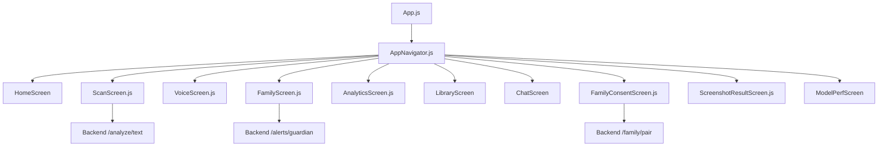

**Diagram sources**
- [App.js:21-43](file://App.js#L21-L43)
- [src/navigation/AppNavigator.js:80-102](file://src/navigation/AppNavigator.js#L80-L102)
- [src/screens/ScanScreen.js:15-23](file://src/screens/ScanScreen.js#L15-L23)
- [backend/index.js:63-80](file://backend/index.js#L63-L80)

**Section sources**
- [App.js:1-44](file://App.js#L1-L44)
- [src/navigation/AppNavigator.js:1-121](file://src/navigation/AppNavigator.js#L1-L121)

## Core Components
- Multi-modal threat detection:
  - SMS text analysis via paste/type input and backend analysis.
  - Voice call recording and audio processing with waveform visualization.
  - Screenshot scanning for visual threat detection.
  - Link verification service for URL safety assessment (integration point).
- Family protection system:
  - Member management and invitation workflow.
  - Consent management for privacy compliance.
  - Real-time alert notifications and guardian notification services.
- Analytics and reporting:
  - Historical data visualization with charts.
  - Money saved calculations and tracking.
  - Scam type breakdown analysis.
  - Performance metrics monitoring.
- AI analysis engine:
  - Backend API endpoints for analysis and family operations.
  - Multi-tier model fallback system.
  - Local rule engine implementation.
  - Structured response format specifications.

**Section sources**
- [src/screens/ScanScreen.js:15-23](file://src/screens/ScanScreen.js#L15-L23)
- [src/screens/VoiceScreen.js:27-119](file://src/screens/VoiceScreen.js#L27-L119)
- [src/screens/ScreenshotResultScreen.js:21-109](file://src/screens/ScreenshotResultScreen.js#L21-L109)
- [src/screens/FamilyScreen.js:27-85](file://src/screens/FamilyScreen.js#L27-L85)
- [src/screens/FamilyConsentScreen.js:24-131](file://src/screens/FamilyConsentScreen.js#L24-L131)
- [src/screens/AnalyticsScreen.js:24-119](file://src/screens/AnalyticsScreen.js#L24-L119)
- [backend/index.js:16-80](file://backend/index.js#L16-L80)

## Architecture Overview
The application follows a client-server architecture:
- Client (React Native/Expo): screens orchestrate user interactions, manage state, and call backend APIs when needed.
- Server (Express): handles analysis requests, applies model fallbacks, runs local rules, and returns standardized JSON responses.

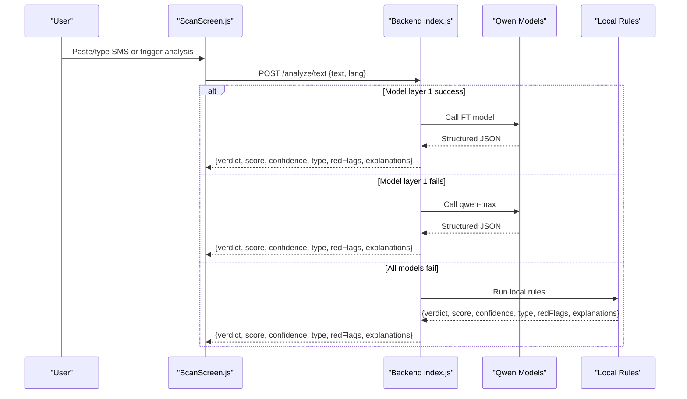

**Diagram sources**
- [src/screens/ScanScreen.js:18-23](file://src/screens/ScanScreen.js#L18-L23)
- [backend/index.js:63-70](file://backend/index.js#L63-L70)
- [backend/index.js:16-43](file://backend/index.js#L16-L43)
- [backend/index.js:45-61](file://backend/index.js#L45-L61)

## Detailed Component Analysis

### Multi-Modal Threat Detection

#### SMS Message Analysis
- Input: Text area for pasting or typing messages.
- Action: Analyze button triggers backend analysis.
- Output: Verdict screen displays risk score, confidence, scam type, evidence chips, and multilingual explanations.

Implementation highlights:
- ScanScreen wires analyze flow and navigates to Verdict with parameters.
- README documents the expected backend call shape and fields returned by the analysis endpoint.

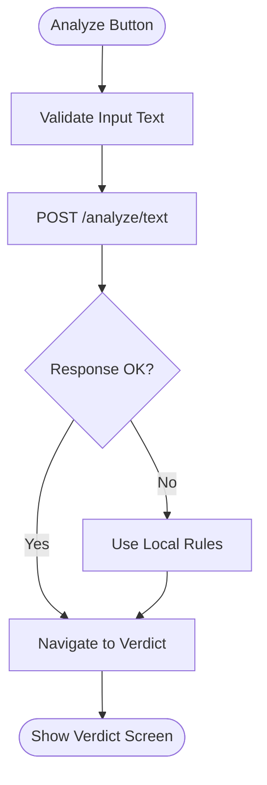

**Diagram sources**
- [src/screens/ScanScreen.js:18-23](file://src/screens/ScanScreen.js#L18-L23)
- [backend/index.js:63-70](file://backend/index.js#L63-L70)
- [README.md:186-201](file://README.md#L186-L201)

**Section sources**
- [src/screens/ScanScreen.js:15-96](file://src/screens/ScanScreen.js#L15-L96)
- [README.md:186-201](file://README.md#L186-L201)

#### Voice Call Recording and Audio Processing
- Full-screen mic interface with animated ripples and waveform visualization.
- State machine: idle → listening → processing → done.
- Language selection chips for English, Urdu, Roman Urdu.
- Placeholder for real audio levels from expo-av recording callbacks.

Implementation highlights:
- VoiceScreen manages state and animations using react-native-reanimated.
- Waveform bars animate heights to simulate live audio levels.

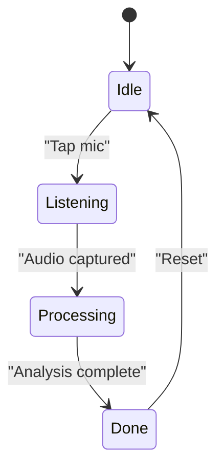

**Diagram sources**
- [src/screens/VoiceScreen.js:27-119](file://src/screens/VoiceScreen.js#L27-L119)
- [src/screens/VoiceScreen.js:122-185](file://src/screens/VoiceScreen.js#L122-L185)

**Section sources**
- [src/screens/VoiceScreen.js:1-228](file://src/screens/VoiceScreen.js#L1-L228)

#### Screenshot Scanning for Visual Threat Detection
- Displays thumbnail of picked image and verdict summary.
- Shows detected issues list with descriptions.
- Actions include blocking sender and re-scanning.

Implementation highlights:
- ScreenshotResultScreen expects route params imageUri and optional score/issues.
- Uses VerdictBadge and SectionHeader components for consistent UI.

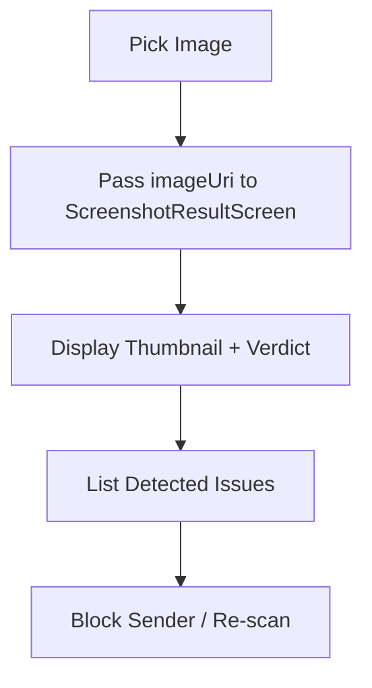

**Diagram sources**
- [src/screens/ScreenshotResultScreen.js:21-109](file://src/screens/ScreenshotResultScreen.js#L21-L109)

**Section sources**
- [src/screens/ScreenshotResultScreen.js:1-152](file://src/screens/ScreenshotResultScreen.js#L1-L152)

#### Link Verification Service for URL Safety Assessment
- Integration point for URL safety checks.
- Can be wired into ScanScreen or other flows to validate links before analysis.
- Expected behavior: return safe/suspicious/scam verdict with explanation.

Note: The current codebase does not include a dedicated link verification endpoint; integration should follow the same pattern as text analysis.

**Section sources**
- [README.md:252-267](file://README.md#L252-L267)

### Family Protection System

#### Member Management and Invitation Workflow
- FamilyScreen shows members, protection status, and invites new members.
- FamilyConsentScreen handles deep-linked invitations and consent choices.

Implementation highlights:
- FamilyScreen lists members with roles and last protected timestamps.
- FamilyConsentScreen presents shared vs never-shared data categories and accept/decline actions.

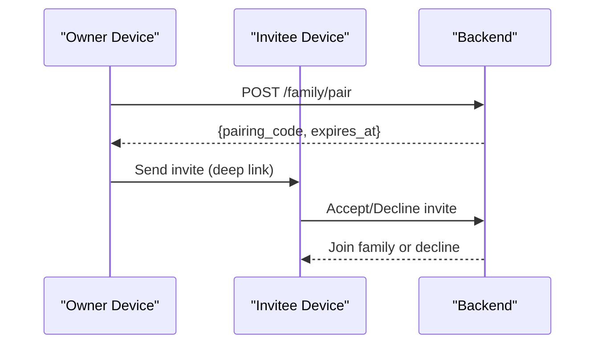

**Diagram sources**
- [src/screens/FamilyScreen.js:27-85](file://src/screens/FamilyScreen.js#L27-L85)
- [src/screens/FamilyConsentScreen.js:24-131](file://src/screens/FamilyConsentScreen.js#L24-L131)
- [backend/index.js:72-75](file://backend/index.js#L72-L75)

**Section sources**
- [src/screens/FamilyScreen.js:1-101](file://src/screens/FamilyScreen.js#L1-L101)
- [src/screens/FamilyConsentScreen.js:1-177](file://src/screens/FamilyConsentScreen.js#L1-L177)
- [backend/index.js:72-75](file://backend/index.js#L72-L75)

#### Consent Management for Privacy Compliance
- Clear separation of what will be shared and what will never be shared.
- User-friendly bilingual labels (English and Urdu).
- Explicit accept/decline actions with feedback.

**Section sources**
- [src/screens/FamilyConsentScreen.js:62-110](file://src/screens/FamilyConsentScreen.js#L62-L110)

#### Real-Time Alert Notifications and Guardian Notification Services
- Alerts can be sent to guardians via backend endpoint.
- Current implementation logs push payload and returns confirmation.

Implementation highlights:
- Backend /alerts/guardian accepts alert payloads and responds with sent status and push ID.

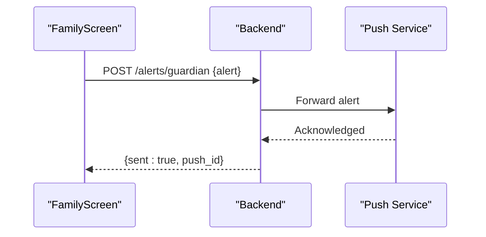

**Diagram sources**
- [backend/index.js:77-80](file://backend/index.js#L77-L80)

**Section sources**
- [backend/index.js:77-80](file://backend/index.js#L77-L80)

### Analytics and Reporting

#### Historical Data Visualization with Charts
- Displays 7-day activity chart with blocked vs safe counts.
- Time range filters: 7 days, 30 days, year.

Implementation highlights:
- AnalyticsScreen renders stacked bars per day and legends.

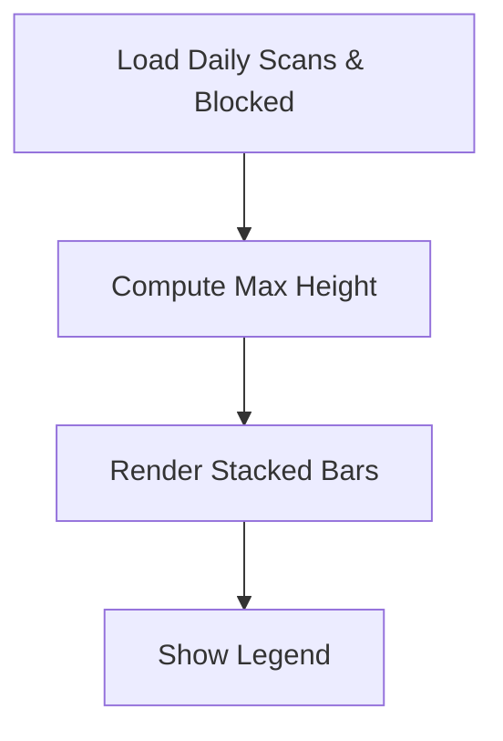

**Diagram sources**
- [src/screens/AnalyticsScreen.js:10-85](file://src/screens/AnalyticsScreen.js#L10-L85)

**Section sources**
- [src/screens/AnalyticsScreen.js:1-153](file://src/screens/AnalyticsScreen.js#L1-L153)

#### Money Saved Calculations and Tracking
- Hero card shows total amount saved for the family.
- Breakdown includes amounts per scam type.

Implementation highlights:
- AnalyticsScreen calculates totals and displays amounts per category.

**Section sources**
- [src/screens/AnalyticsScreen.js:48-59](file://src/screens/AnalyticsScreen.js#L48-L59)
- [src/screens/AnalyticsScreen.js:87-111](file://src/screens/AnalyticsScreen.js#L87-L111)

#### Scam Type Breakdown Analysis
- Lists top scam types with counts and monetary impact.
- Horizontal progress bars visualize relative frequency.

**Section sources**
- [src/screens/AnalyticsScreen.js:17-22](file://src/screens/AnalyticsScreen.js#L17-L22)
- [src/screens/AnalyticsScreen.js:87-111](file://src/screens/AnalyticsScreen.js#L87-L111)

#### Performance Metrics Monitoring
- ModelPerfScreen exists in navigation but not analyzed here.
- Intended for transparency on model usage and performance.

**Section sources**
- [src/navigation/AppNavigator.js:98-98](file://src/navigation/AppNavigator.js#L98-L98)

### AI Analysis Engine

#### Backend API Endpoints
- /analyze/text: Accepts text and language, returns structured verdict.
- /family/pair: Generates pairing code and expiry.
- /alerts/guardian: Logs and acknowledges guardian alerts.

Implementation highlights:
- Express server with CORS and JSON parsing.
- Environment variables for base URL, API key, and model names.

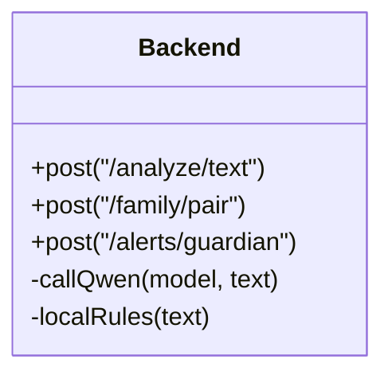

**Diagram sources**
- [backend/index.js:1-82](file://backend/index.js#L1-L82)

**Section sources**
- [backend/index.js:1-82](file://backend/index.js#L1-L82)

#### Multi-Tier Model Fallback System
- Tries fine-tuned model first, then qwen-max, then local rules.
- Each tier returns standardized JSON; errors are logged and handled gracefully.

Implementation highlights:
- callQwen fetches from configured base URL and parses output.
- localRules computes score and flags based on regex patterns.

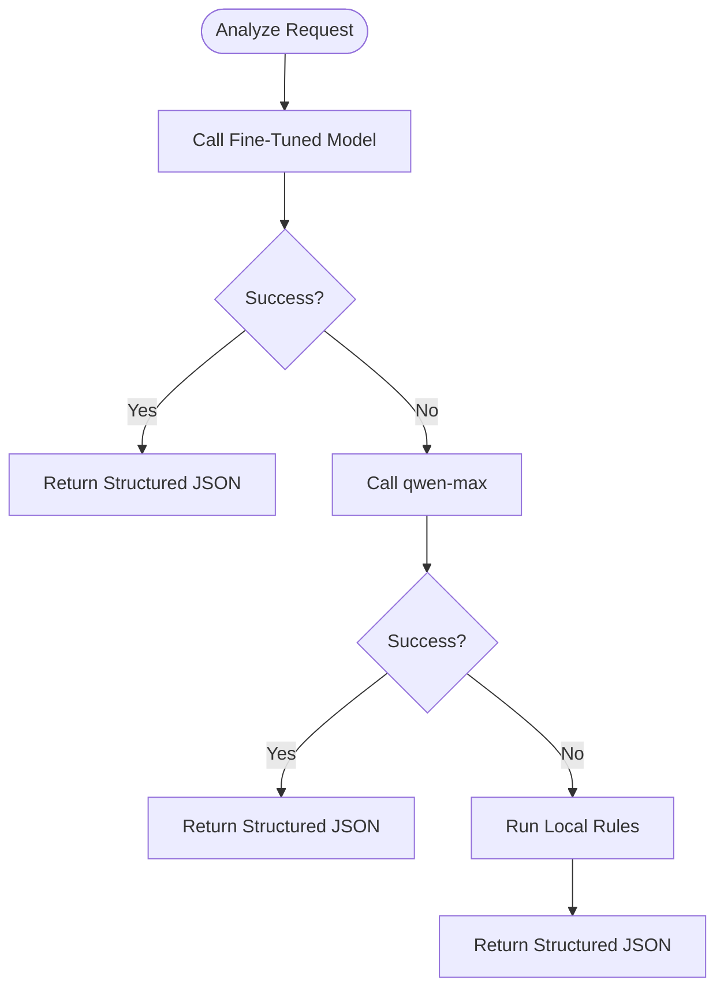

**Diagram sources**
- [backend/index.js:16-43](file://backend/index.js#L16-L43)
- [backend/index.js:45-61](file://backend/index.js#L45-L61)
- [backend/index.js:63-70](file://backend/index.js#L63-L70)

**Section sources**
- [backend/index.js:16-70](file://backend/index.js#L16-L70)

#### Local Rule Engine Implementation
- Regex-based scoring for common scam indicators (OTP/PIN/CNIC, urgency words, prize offers, links).
- Produces verdict and red flags even when models fail.

**Section sources**
- [backend/index.js:45-61](file://backend/index.js#L45-L61)

#### Response Format Specifications
- Standardized JSON includes verdict, score, confidence, type, redFlags, and multilingual explanations.
- Verdict normalized to scam/safe/suspicious.

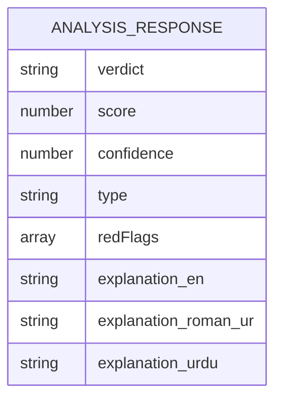

**Diagram sources**
- [backend/index.js:16-43](file://backend/index.js#L16-L43)

**Section sources**
- [backend/index.js:16-43](file://backend/index.js#L16-L43)

## Dependency Analysis
Key dependencies:
- Frontend: Expo SDK, React Navigation, Reanimated, SVG, haptics, speech, image picker, AV, fonts.
- Backend: Express, CORS, dotenv.

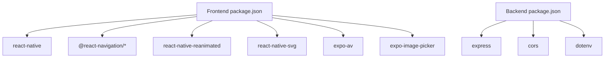

**Diagram sources**
- [package.json:11-34](file://package.json#L11-L34)
- [backend/package.json:13-17](file://backend/package.json#L13-L17)

**Section sources**
- [package.json:1-41](file://package.json#L1-L41)
- [backend/package.json:1-19](file://backend/package.json#L1-L19)

## Performance Considerations
- Use efficient animations with react-native-reanimated to avoid jank during waveform and ripple effects.
- Keep payload sizes reasonable for network calls; backend limits JSON body size.
- Prefer local rules for quick fallbacks when models are unavailable.
- Optimize image handling for screenshots to reduce memory pressure.

[No sources needed since this section provides general guidance]

## Troubleshooting Guide
Common issues and strategies:
- Backend connectivity: Ensure environment variables are set for base URL and API key; verify CORS configuration.
- Model failures: Check error logs for HTTP status and message; fallback to qwen-max or local rules.
- Parsing errors: Validate model output contains JSON; handle malformed responses gracefully.
- Deep links: Register scheme in app.json and map in linking config for family invites.

**Section sources**
- [backend/index.js:1-14](file://backend/index.js#L1-L14)
- [backend/index.js:16-43](file://backend/index.js#L16-L43)
- [README.md:252-267](file://README.md#L252-L267)

## Conclusion
Safe Pakistan delivers a robust, multi-modal threat detection system with strong family protection capabilities and comprehensive analytics. The backend’s multi-tier model fallback ensures reliability, while the local rule engine provides immediate protection when models are down. The UI prioritizes clarity and accessibility, especially for Urdu-speaking users, and integrates seamlessly with Expo and React Navigation.

[No sources needed since this section summarizes without analyzing specific files]

## Appendices

### API Schemas

#### Analyze Text Endpoint
- Method: POST
- Path: /analyze/text
- Request body:
  - text: string
  - lang: string
- Response body:
  - verdict: enum ["scam", "safe", "suspicious"]
  - score: number (0-100)
  - confidence: number (0-100)
  - type: string
  - redFlags: array of strings
  - explanation_en: string
  - explanation_roman_ur: string
  - explanation_urdu: string

**Section sources**
- [backend/index.js:63-70](file://backend/index.js#L63-L70)
- [backend/index.js:16-43](file://backend/index.js#L16-L43)

#### Family Pair Endpoint
- Method: POST
- Path: /family/pair
- Response body:
  - pairing_code: string
  - expires_at: ISO timestamp

**Section sources**
- [backend/index.js:72-75](file://backend/index.js#L72-L75)

#### Guardian Alert Endpoint
- Method: POST
- Path: /alerts/guardian
- Request body: alert object (implementation-defined)
- Response body:
  - sent: boolean
  - push_id: string

**Section sources**
- [backend/index.js:77-80](file://backend/index.js#L77-L80)

### Integration Examples

#### Text Analysis Flow
- From ScanScreen, call backend /analyze/text with text and language.
- Navigate to Verdict with returned fields.

**Section sources**
- [src/screens/ScanScreen.js:18-23](file://src/screens/ScanScreen.js#L18-L23)
- [README.md:186-201](file://README.md#L186-L201)

#### Voice Recording Integration
- Hook up expo-av recording to update waveform bars with metering values.
- Transition states based on recording lifecycle.

**Section sources**
- [src/screens/VoiceScreen.js:156-185](file://src/screens/VoiceScreen.js#L156-L185)
- [README.md:167-170](file://README.md#L167-L170)

#### Screenshot Scanning Integration
- Use expo-image-picker to pick image and pass URI to ScreenshotResultScreen.
- Optionally compute score and issues before rendering.

**Section sources**
- [src/screens/ScreenshotResultScreen.js:21-25](file://src/screens/ScreenshotResultScreen.js#L21-L25)
- [README.md:261-263](file://README.md#L261-L263)