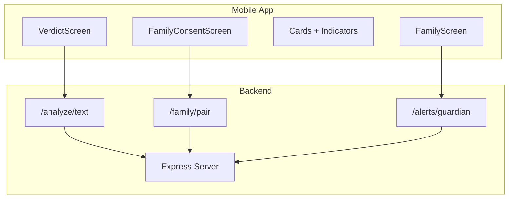
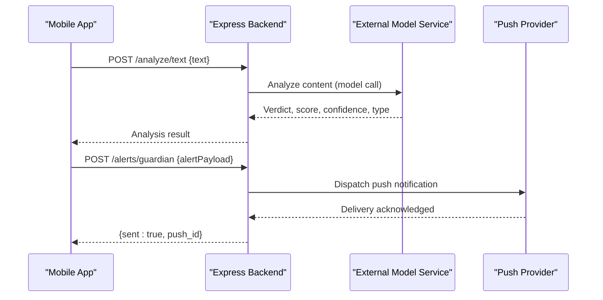
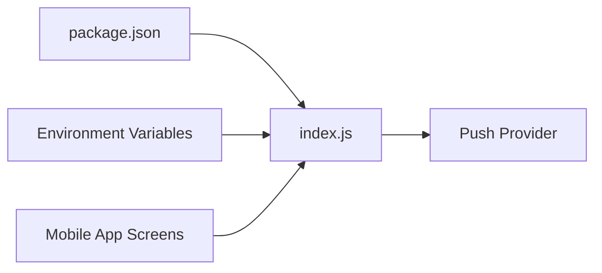

# Alert & Notification System

<cite>
**Referenced Files in This Document**
- [backend/index.js](file://backend/index.js)
- [backend/package.json](file://backend/package.json)
- [src/screens/FamilyConsentScreen.js](file://src/screens/FamilyConsentScreen.js)
- [src/screens/FamilyScreen.js](file://src/screens/FamilyScreen.js)
- [src/components/Cards.js](file://src/components/Cards.js)
- [src/components/Indicators.js](file://src/components/Indicators.js)
- [src/screens/VerdictScreen.js](file://src/screens/VerdictScreen.js)
</cite>

## Table of Contents
1. Introduction
2. Project Structure
3. Core Components
4. Architecture Overview
5. Detailed Component Analysis
6. Dependency Analysis
7. Performance Considerations
8. Troubleshooting Guide
9. Conclusion

## Introduction
This document describes the real-time alert notification system that keeps family members informed about threats and safety status. It focuses on:
- Backend API endpoints for sending alerts to family members, including /alerts/guardian
- Alert triggering mechanisms based on threat detection results
- Notification delivery methods and real-time synchronization considerations
- Alert types (threat warnings, safety confirmations, emergency alerts), notification preferences, and offline support
- Example alert data structures and payload formats
- Integration patterns with external notification services
- Error handling for failed deliveries and retry mechanisms

## Project Structure
The alert system spans a small Express backend and React Native screens that present family status and consent. The backend exposes endpoints for analysis, pairing, and guardian alerts. The frontend includes screens for family management and consent, plus UI indicators for verdicts and statuses.

**Diagram sources**
- [backend/index.js:63-80](file://backend/index.js#L63-L80)
- [src/screens/FamilyConsentScreen.js:1-177](file://src/screens/FamilyConsentScreen.js#L1-L177)
- [src/screens/FamilyScreen.js:1-101](file://src/screens/FamilyScreen.js#L1-L101)
- [src/components/Cards.js:1-193](file://src/components/Cards.js#L1-L193)
- [src/components/Indicators.js:1-106](file://src/components/Indicators.js#L1-L106)
- [src/screens/VerdictScreen.js:1-268](file://src/screens/VerdictScreen.js#L1-L268)

**Section sources**
- [backend/index.js:1-82](file://backend/index.js#L1-L82)
- [backend/package.json:1-19](file://backend/package.json#L1-L19)
- [src/screens/FamilyConsentScreen.js:1-177](file://src/screens/FamilyConsentScreen.js#L1-L177)
- [src/screens/FamilyScreen.js:1-101](file://src/screens/FamilyScreen.js#L1-L101)
- [src/components/Cards.js:1-193](file://src/components/Cards.js#L1-L193)
- [src/components/Indicators.js:1-106](file://src/components/Indicators.js#L1-L106)
- [src/screens/VerdictScreen.js:1-268](file://src/screens/VerdictScreen.js#L1-L268)

## Core Components
- Guardian Alert Endpoint: POST /alerts/guardian accepts an alert payload and returns a confirmation with a push identifier.
- Threat Analysis Endpoint: POST /analyze/text triggers threat detection using AI models or local rules and returns verdicts used to determine whether to send alerts.
- Family Pairing Endpoint: POST /family/pair generates a pairing code and expiry for inviting family members.
- Consent and Preferences: FamilyConsentScreen defines what is shared (threat alerts, risk scores, protection status) and what is never shared (message text, contacts, photos, location).
- Status and Verdict UI: Cards and Indicators provide visual feedback for protection status and verdicts, which can be extended to reflect alert states.

Key responsibilities:
- Backend: route handling, environment configuration, logging, and placeholder push dispatch.
- Frontend: family member management, consent capture, and display of alert-related information.

**Section sources**
- [backend/index.js:63-80](file://backend/index.js#L63-L80)
- [src/screens/FamilyConsentScreen.js:16-22](file://src/screens/FamilyConsentScreen.js#L16-L22)
- [src/components/Cards.js:61-86](file://src/components/Cards.js#L61-L86)
- [src/components/Indicators.js:11-27](file://src/components/Indicators.js#L11-L27)

## Architecture Overview
The alert flow integrates threat detection with guardian notifications:

**Diagram sources**
- [backend/index.js:16-43](file://backend/index.js#L16-L43)
- [backend/index.js:63-80](file://backend/index.js#L63-L80)

## Detailed Component Analysis

### Guardian Alert Endpoint: POST /alerts/guardian
- Purpose: Accepts alert payloads from the app and acknowledges receipt with a unique push ID.
- Behavior: Logs the incoming payload and responds with sent confirmation and a generated push identifier.
- Extensibility: Replace the console log with calls to a push provider (e.g., Firebase Cloud Messaging, APNs, or a custom gateway).

Example request payload fields (conceptual):
- recipient_id: string — identifies the guardian device or user
- alert_type: enum — e.g., threat_warning, safety_confirmation, emergency_alert
- severity: enum — e.g., low, medium, high
- source_user_id: string — who triggered the alert
- metadata: object — optional context such as scan_id, risk_score, scam_type, evidence_spans

Example response:
- sent: boolean
- push_id: string

Error handling:
- Currently no explicit error responses; add validation and error codes for malformed payloads or provider failures.

Retry mechanism:
- Implement exponential backoff retries on transient errors (network timeouts, provider rate limits).
- Persist failed deliveries to a queue for later replay.

Integration pattern:
- Use a service layer to abstract push provider calls.
- Maintain a delivery log with timestamps and status for auditability.

**Section sources**
- [backend/index.js:77-80](file://backend/index.js#L77-L80)

### Threat Detection and Alert Triggering
- Analysis endpoint: POST /analyze/text attempts model-based analysis first, then falls back to local rule engine if needed.
- Output fields include verdict (scam/suspicious/safe), risk score, confidence, scam type, and explanations.
- Trigger logic:
  - If verdict is scam or suspicious and risk score exceeds a threshold, trigger guardian alerts.
  - Safety confirmations may be sent when verdict is safe after scanning sensitive content.
  - Emergency alerts could be triggered by specific keywords or urgency patterns (e.g., “foran”, “account band”).

Alert types:
- Threat warning: High-risk or scam verdicts.
- Safety confirmation: Safe verdicts for transactions or messages.
- Emergency alert: Urgency signals or critical risk thresholds.

Real-time synchronization:
- After sending an alert, update family status views to reflect recent protection events.
- Optionally use WebSocket or polling to keep family dashboards current.

**Section sources**
- [backend/index.js:16-43](file://backend/index.js#L16-L43)
- [backend/index.js:63-70](file://backend/index.js#L63-L70)
- [src/screens/VerdictScreen.js:19-26](file://src/screens/VerdictScreen.js#L19-L26)

### Family Consent and Notification Preferences
- Shared data: threat alerts, risk scores, protection status.
- Never shared: message text, contacts, photos, location.
- Consent flow: Invited members review what will be shared and accept or decline.

Preference storage:
- Store per-user preferences locally or on the server to control which alert types are delivered.
- Provide toggles in settings to enable/disable categories like threat warnings or safety confirmations.

Offline support:
- Queue alerts locally when offline and sync when connectivity resumes.
- Persist preference changes and reconcile with server state upon reconnection.

**Section sources**
- [src/screens/FamilyConsentScreen.js:16-22](file://src/screens/FamilyConsentScreen.js#L16-L22)

### Status and Verdict UI
- FamilyScreen displays member status and last protection time.
- Cards and Indicators render verdict badges and status pills that can reflect alert outcomes.
- VerdictScreen shows detailed results and actions, including sharing with family.

Extending UI for alerts:
- Add an activity feed showing recent alerts with tone, type, and timestamp.
- Integrate status pills to show online/offline or protected/unprotected states.

**Section sources**
- [src/screens/FamilyScreen.js:20-25](file://src/screens/FamilyScreen.js#L20-L25)
- [src/components/Cards.js:61-86](file://src/components/Cards.js#L61-L86)
- [src/components/Indicators.js:11-27](file://src/components/Indicators.js#L11-L27)
- [src/screens/VerdictScreen.js:83-113](file://src/screens/VerdictScreen.js#L83-L113)

## Dependency Analysis
- Backend dependencies: express, cors, dotenv.
- External integrations:
  - AI model service via environment variables (base URL, API key, model names).
  - Push notification provider (to be integrated behind /alerts/guardian).
- Frontend components depend on theme tokens and typography for consistent UI.

**Diagram sources**
- [backend/package.json:13-17](file://backend/package.json#L13-L17)
- [backend/index.js:9-12](file://backend/index.js#L9-L12)
- [backend/index.js:77-80](file://backend/index.js#L77-L80)

**Section sources**
- [backend/package.json:1-19](file://backend/package.json#L1-L19)
- [backend/index.js:9-12](file://backend/index.js#L9-L12)

## Performance Considerations
- Keep alert payloads minimal to reduce network overhead.
- Batch multiple alerts if necessary to avoid excessive requests.
- Use idempotent push IDs to prevent duplicate notifications.
- Cache frequent reads (e.g., family status) on the client to reduce server load.
- Implement timeouts and circuit breakers for external model and push provider calls.

[No sources needed since this section provides general guidance]

## Troubleshooting Guide
Common issues and resolutions:
- Missing environment variables: Ensure BASE, KEY, FT_MODEL, MAX_MODEL are set for model calls.
- Model service errors: The backend logs errors and falls back to local rules; verify model availability and credentials.
- Push delivery failures: Log provider errors, implement retries with backoff, and surface actionable errors to the app.
- Invalid alert payloads: Validate required fields before processing; return clear error messages.

Operational tips:
- Monitor logs for “[PUSH]” entries to track alert submissions.
- Track push_id values to correlate alerts with delivery receipts.
- Add health checks for external services and expose readiness endpoints.

**Section sources**
- [backend/index.js:9-12](file://backend/index.js#L9-L12)
- [backend/index.js:63-70](file://backend/index.js#L63-L70)
- [backend/index.js:77-80](file://backend/index.js#L77-L80)

## Conclusion
The alert and notification system combines threat detection with guardian notifications to keep families informed. The backend exposes clear endpoints for analysis, pairing, and alerts, while the frontend manages consent and displays status. To complete the system:
- Integrate a push provider behind /alerts/guardian
- Implement robust error handling and retry logic
- Persist preferences and queue alerts for offline scenarios
- Extend UI to show real-time alert history and family synchronization

[No sources needed since this section summarizes without analyzing specific files]