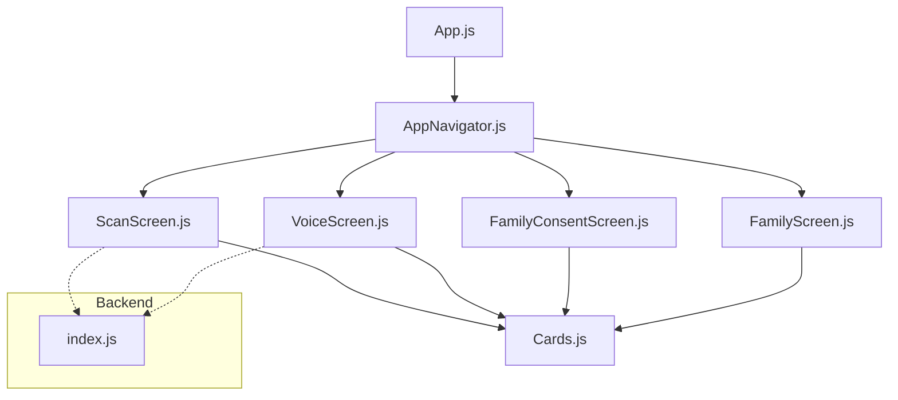
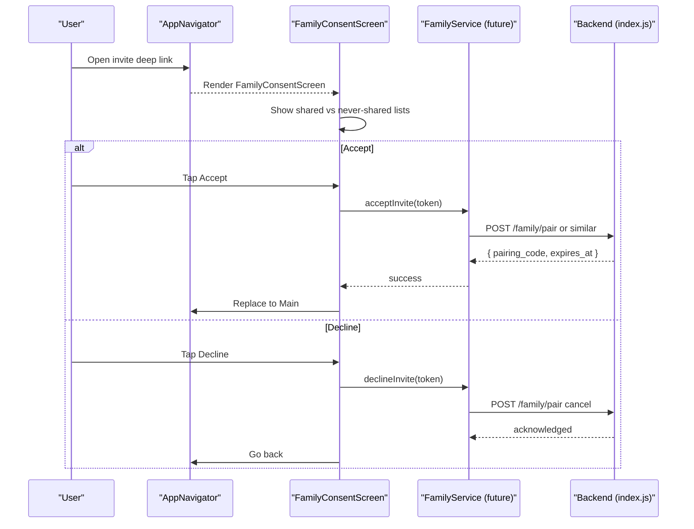
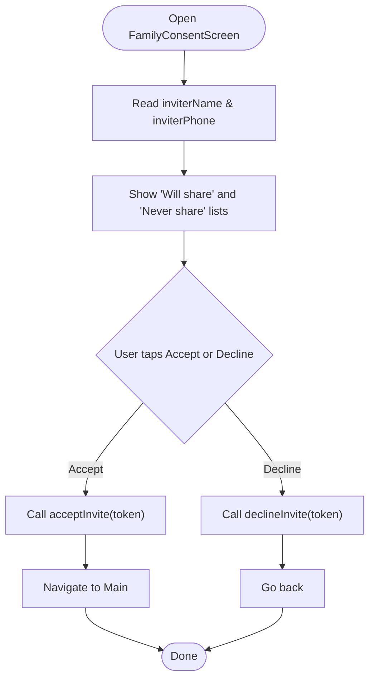
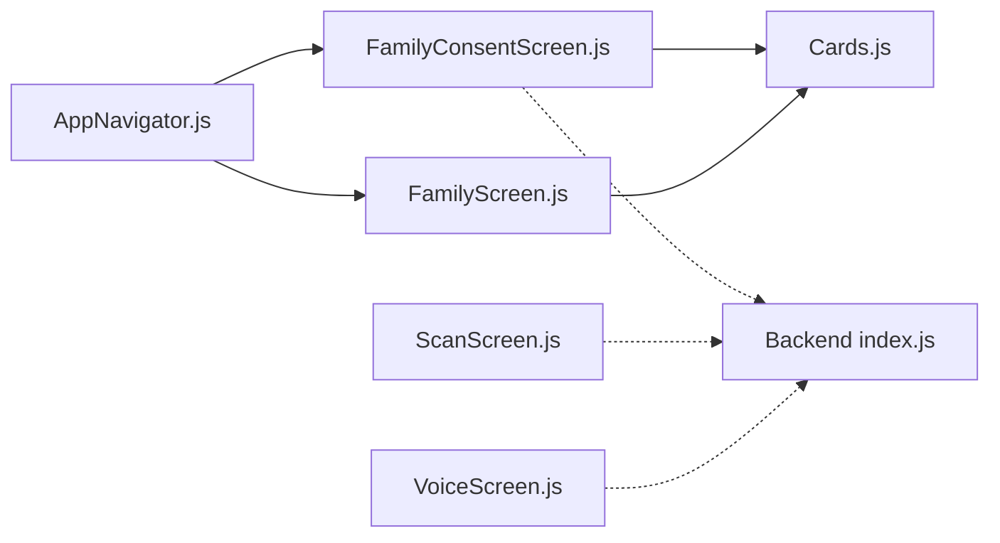

# Consent Management System

<cite>
**Referenced Files in This Document**
- [App.js](file://App.js)
- [package.json](file://package.json)
- [AppNavigator.js](file://src/navigation/AppNavigator.js)
- [FamilyConsentScreen.js](file://src/screens/FamilyConsentScreen.js)
- [FamilyScreen.js](file://src/screens/FamilyScreen.js)
- [Cards.js](file://src/components/Cards.js)
- [ScanScreen.js](file://src/screens/ScanScreen.js)
- [VoiceScreen.js](file://src/screens/VoiceScreen.js)
- [index.js](file://backend/index.js)
</cite>

## Table of Contents
1. Introduction
2. Project Structure
3. Core Components
4. Architecture Overview
5. Detailed Component Analysis
6. Dependency Analysis
7. Performance Considerations
8. Troubleshooting Guide
9. Conclusion

## Introduction
This document explains the consent management system that protects family members’ privacy while enabling secure collaboration. It focuses on the FamilyConsentScreen implementation, consent collection workflows, privacy policy acceptance, and permission handling for sensitive data such as SMS, voice recordings, and screenshots. It also covers consent revocation mechanisms, granular controls, state management across family members, legal compliance considerations, user experience design for consent flows, and integration with device permissions. Examples include consent data models, state transitions, and error handling patterns.

## Project Structure
The app is a React Native application built with Expo. The navigation layer defines screens including a dedicated FamilyConsent screen for inviting and consenting to family protection. Screens are organized under src/screens, shared UI components under src/components, and navigation configuration under src/navigation. The backend provides endpoints for analysis and family pairing/alerts.

**Diagram sources**
- [App.js:21-43](file://App.js#L21-L43)
- [AppNavigator.js:80-101](file://src/navigation/AppNavigator.js#L80-L101)
- [FamilyConsentScreen.js:24-35](file://src/screens/FamilyConsentScreen.js#L24-L35)
- [FamilyScreen.js:27-85](file://src/screens/FamilyScreen.js#L27-L85)
- [ScanScreen.js:15-93](file://src/screens/ScanScreen.js#L15-L93)
- [VoiceScreen.js:31-119](file://src/screens/VoiceScreen.js#L31-L119)
- [Cards.js:61-86](file://src/components/Cards.js#L61-L86)
- [index.js:63-80](file://backend/index.js#L63-L80)

**Section sources**
- [App.js:21-43](file://App.js#L21-L43)
- [AppNavigator.js:80-101](file://src/navigation/AppNavigator.js#L80-L101)
- [package.json:11-34](file://package.json#L11-L34)

## Core Components
- FamilyConsentScreen: Presents an invitation-based consent flow that clearly separates what will be shared versus what will never be shared. Acceptance navigates to the main app; decline returns to the previous screen.
- FamilyScreen: Displays family members and invites new members, which can trigger the consent flow.
- Cards: Reusable UI elements (avatars, member cards, activity items) used across consent and family views.
- ScanScreen and VoiceScreen: Data input surfaces that may require device permissions (SMS, microphone, image picker). These illustrate where consent and permissions integrate into the broader product.
- AppNavigator: Registers the FamilyConsent route and manages navigation between screens.
- Backend index.js: Provides endpoints for analysis and family pairing/alerts, relevant to post-consent operations.

Key responsibilities:
- Consent presentation and decision capture (accept/decline).
- Clear communication of data sharing boundaries.
- Navigation to main app or back on decision.
- Integration points for future service calls (e.g., acceptInvite/declineInvite).

**Section sources**
- [FamilyConsentScreen.js:16-35](file://src/screens/FamilyConsentScreen.js#L16-L35)
- [FamilyScreen.js:20-85](file://src/screens/FamilyScreen.js#L20-L85)
- [Cards.js:61-86](file://src/components/Cards.js#L61-L86)
- [ScanScreen.js:15-93](file://src/screens/ScanScreen.js#L15-L93)
- [VoiceScreen.js:31-119](file://src/screens/VoiceScreen.js#L31-L119)
- [AppNavigator.js:80-101](file://src/navigation/AppNavigator.js#L80-L101)
- [index.js:63-80](file://backend/index.js#L63-L80)

## Architecture Overview
The consent architecture centers around a clear, user-facing consent screen that communicates minimal data sharing and strong privacy guarantees. On acceptance, the app navigates to the main tabs; on decline, it returns to the prior screen. Future integrations can call backend services to persist consent and manage family membership.

**Diagram sources**
- [AppNavigator.js:80-101](file://src/navigation/AppNavigator.js#L80-L101)
- [FamilyConsentScreen.js:24-35](file://src/screens/FamilyConsentScreen.js#L24-L35)
- [index.js:72-75](file://backend/index.js#L72-L75)

## Detailed Component Analysis

### FamilyConsentScreen: Consent Collection Workflow
- Purpose: Present a transparent consent dialog to invited family members, explicitly listing what will be shared and what will never be shared.
- Inputs: Route parameters include inviter identity and phone number.
- Actions:
  - Accept: Intended to call a service method to accept the invite and then navigate to the main app.
  - Decline: Intended to call a service method to decline the invite and navigate back.
- Privacy messaging: Clearly demarcates shared categories (threat alerts, risk scores, protection status) and non-shared categories (message text, contacts, photos, location).

**Diagram sources**
- [FamilyConsentScreen.js:24-35](file://src/screens/FamilyConsentScreen.js#L24-L35)
- [FamilyConsentScreen.js:62-110](file://src/screens/FamilyConsentScreen.js#L62-L110)

**Section sources**
- [FamilyConsentScreen.js:16-35](file://src/screens/FamilyConsentScreen.js#L16-L35)
- [FamilyConsentScreen.js:62-110](file://src/screens/FamilyConsentScreen.js#L62-L110)

### Permission Handling for Sensitive Data
- SMS scanning: The scan interface supports pasting or typing SMS content and offers screenshot upload. When integrating with device-level SMS access or media capture, request permissions before use and handle denials gracefully.
- Voice recording: The voice feature requires microphone permission. Request at first use, show rationale if denied, and allow retry.
- Image capture: Screenshot/image picker requires storage/photos permission on supported platforms. Handle permission prompts and fallbacks.

Integration notes:
- Place permission requests immediately before the action that needs them.
- Persist user choices where appropriate and re-prompt only when necessary.
- Provide clear in-app explanations aligned with the consent screen’s “never share” guarantees.

**Section sources**
- [ScanScreen.js:40-56](file://src/screens/ScanScreen.js#L40-L56)
- [VoiceScreen.js:31-119](file://src/screens/VoiceScreen.js#L31-L119)

### Consent Revocation and Granular Controls
- Revocation: Users should be able to withdraw consent at any time. Implement a settings entry point to revoke family sharing and remove associated data from active sync.
- Granularity: Allow toggles per data category (e.g., threat alerts, risk scores, protection status). Respect the “never share” list by making those options immutable.
- State synchronization: After revocation, update local state and notify backend to stop syncing or delete shared records.

Implementation guidance:
- Maintain a consent profile per family member with fields for each category and timestamps for acceptance/revocation.
- Enforce server-side checks to ensure no prohibited data is shared even if client toggles are misconfigured.

[No sources needed since this section provides general guidance]

### Legal Compliance Aspects
- Transparency: The consent screen clearly states what is shared and what is not, supporting informed consent.
- Minimization: Only share minimal necessary data (alerts, scores, status), aligning with privacy-by-design principles.
- Consent lifecycle: Capture explicit acceptance, support revocation, and provide audit trails via backend logs.
- Cross-border data: If syncing to cloud services, ensure compliance with applicable regulations and inform users.

[No sources needed since this section provides general guidance]

### User Experience Design for Consent Flows
- Clarity: Use plain language and bilingual labels where possible to aid understanding.
- Visual separation: Distinct sections for allowed and disallowed data sharing reduce confusion.
- Action prominence: Make Accept and Decline equally visible; avoid dark patterns.
- Feedback: Confirm actions with brief messages and navigate appropriately.

**Section sources**
- [FamilyConsentScreen.js:62-110](file://src/screens/FamilyConsentScreen.js#L62-L110)

### Integration with Device Permissions
- Microphone: Required for voice features; prompt before starting recording.
- Photos/Media: Required for screenshot uploads; prompt before opening picker.
- SMS: If reading SMS directly, prompt for SMS permission; otherwise rely on paste/upload to avoid intrusive access.

Best practices:
- Defer permission requests until the user initiates the related action.
- Explain why the permission is needed and how it relates to family protection.
- Handle denied permissions with helpful guidance and alternative flows.

**Section sources**
- [ScanScreen.js:40-56](file://src/screens/ScanScreen.js#L40-L56)
- [VoiceScreen.js:31-119](file://src/screens/VoiceScreen.js#L31-L119)

## Dependency Analysis
The consent flow depends on navigation, UI components, and optional backend services.

**Diagram sources**
- [AppNavigator.js:80-101](file://src/navigation/AppNavigator.js#L80-L101)
- [FamilyConsentScreen.js:24-35](file://src/screens/FamilyConsentScreen.js#L24-L35)
- [FamilyScreen.js:27-85](file://src/screens/FamilyScreen.js#L27-L85)
- [Cards.js:61-86](file://src/components/Cards.js#L61-L86)
- [ScanScreen.js:15-93](file://src/screens/ScanScreen.js#L15-L93)
- [VoiceScreen.js:31-119](file://src/screens/VoiceScreen.js#L31-L119)
- [index.js:63-80](file://backend/index.js#L63-L80)

**Section sources**
- [AppNavigator.js:80-101](file://src/navigation/AppNavigator.js#L80-L101)
- [FamilyConsentScreen.js:24-35](file://src/screens/FamilyConsentScreen.js#L24-L35)
- [index.js:63-80](file://backend/index.js#L63-L80)

## Performance Considerations
- Keep consent screens lightweight: Avoid heavy computations during render; defer network calls until user action.
- Batch updates: When updating consent profiles, batch changes to minimize network overhead.
- Debounce inputs: For scan/voice features, debounce processing to prevent excessive calls.
- Cache results: Cache recent verdicts or statuses to improve perceived performance.

[No sources needed since this section provides general guidance]

## Troubleshooting Guide
Common issues and resolutions:
- Invite not recognized: Ensure deep link parameters (token, inviterName, inviterPhone) are passed correctly to the consent screen.
- Accept/Decline does nothing: Verify service methods are implemented and that navigation calls execute after successful responses.
- Permission denied: Prompt again with rationale; offer fallback (paste/upload instead of direct access).
- Backend errors: Log and surface friendly messages; retry with exponential backoff for transient failures.

Operational tips:
- Add logging around accept/decline calls and navigation events.
- Validate route params before rendering to avoid undefined values.
- Test both accept and decline paths thoroughly on multiple devices.

**Section sources**
- [FamilyConsentScreen.js:24-35](file://src/screens/FamilyConsentScreen.js#L24-L35)
- [index.js:63-80](file://backend/index.js#L63-L80)

## Conclusion
The consent management system provides a clear, privacy-first pathway for family collaboration. The FamilyConsentScreen communicates minimal sharing and strong protections, while offering straightforward accept/decline actions. Future enhancements should implement service integrations, granular toggles, revocation flows, and robust permission handling to ensure compliance and a smooth user experience.

[No sources needed since this section summarizes without analyzing specific files]