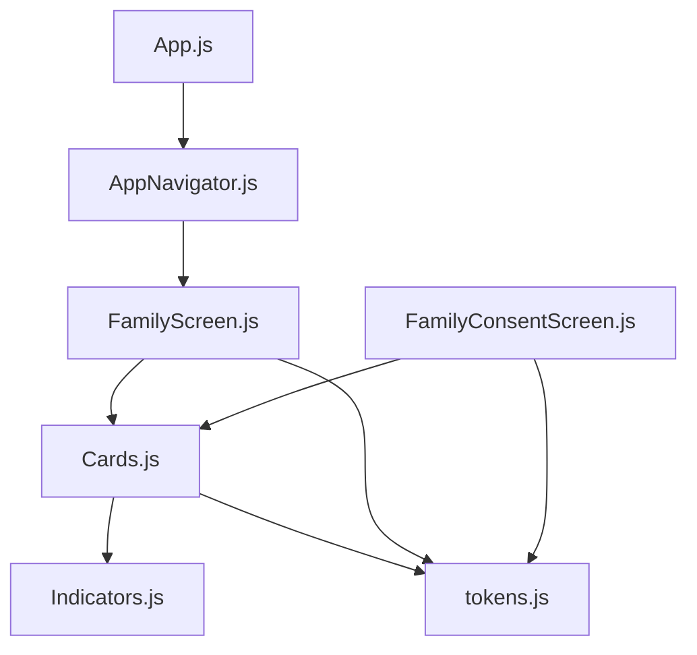
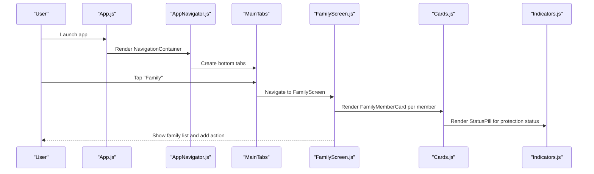
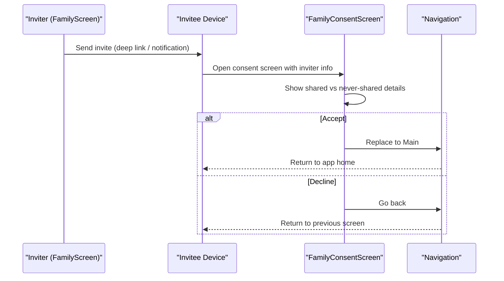
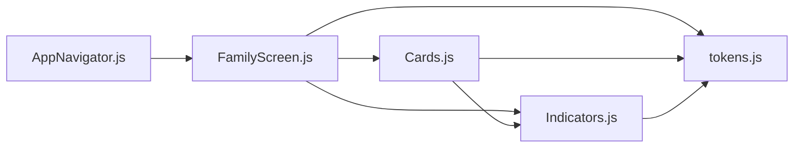

# Family Member Management

<cite>
**Referenced Files in This Document**
- [App.js](file://App.js)
- [AppNavigator.js](file://src/navigation/AppNavigator.js)
- [FamilyScreen.js](file://src/screens/FamilyScreen.js)
- [Cards.js](file://src/components/Cards.js)
- [Indicators.js](file://src/components/Indicators.js)
- [tokens.js](file://src/theme/tokens.js)
- [FamilyConsentScreen.js](file://src/screens/FamilyConsentScreen.js)
</cite>

## Table of Contents
1. [Introduction](#introduction)
2. [Project Structure](#project-structure)
3. [Core Components](#core-components)
4. [Architecture Overview](#architecture-overview)
5. [Detailed Component Analysis](#detailed-component-analysis)
6. [Dependency Analysis](#dependency-analysis)
7. [Performance Considerations](#performance-considerations)
8. [Troubleshooting Guide](#troubleshooting-guide)
9. [Conclusion](#conclusion)

## Introduction
This document explains the family member management system in Safe Pakistan with a focus on the FamilyScreen implementation, member profile display, status tracking (safe/off), relationship mapping using roles like Ammi, Abu, Behan, and Bhai, and the member invitation workflow. It also covers how members are visually represented using Avatar components and status indicators, and describes the member card interface that shows protection status, last protected time, and family role information. Finally, it outlines example data structures, state management patterns, and UI interactions for adding new family members.

## Project Structure
The family feature is implemented across screens and shared components:
- Navigation wires the Family tab into the app shell.
- FamilyScreen renders the family list, hero summary, and an “Add” action to invite or add members.
- Cards.js provides reusable UI primitives including Avatar and FamilyMemberCard.
- Indicators.js provides StatusPill and VerdictBadge used to show protection status.
- tokens.js centralizes design tokens (colors, fonts, spacing, shadows).
- FamilyConsentScreen handles the invited member’s consent flow when joining the family unit.

**Diagram sources**
- [App.js:21-40](file://App.js#L21-L40)
- [AppNavigator.js:71-76](file://src/navigation/AppNavigator.js#L71-L76)
- [FamilyScreen.js:11-18](file://src/screens/FamilyScreen.js#L11-L18)
- [Cards.js:1-10](file://src/components/Cards.js#L1-L10)
- [Indicators.js:1-9](file://src/components/Indicators.js#L1-L9)
- [tokens.js:1-5](file://src/theme/tokens.js#L1-L5)
- [FamilyConsentScreen.js:1-14](file://src/screens/FamilyConsentScreen.js#L1-L14)

**Section sources**
- [App.js:21-40](file://App.js#L21-L40)
- [AppNavigator.js:71-76](file://src/navigation/AppNavigator.js#L71-L76)

## Core Components
- FamilyScreen: Displays the family header, hero summary, member list, and an “Add” action to invite new members.
- FamilyMemberCard: Shows each member’s avatar, name, role badge, last protected timestamp, and protection status pill.
- Avatar: Renders initials with a background color derived from member data.
- StatusPill: Visual indicator for safe/off status with distinct colors and labels.
- FamilyConsentScreen: Presents what will be shared and what will never be shared during the invitation acceptance flow.

Key responsibilities:
- Render and manage the static member dataset for demonstration purposes.
- Provide a consistent visual language for roles and statuses.
- Offer a clear path to invite and onboard new family members.

**Section sources**
- [FamilyScreen.js:20-85](file://src/screens/FamilyScreen.js#L20-L85)
- [Cards.js:12-86](file://src/components/Cards.js#L12-L86)
- [Indicators.js:29-43](file://src/components/Indicators.js#L29-L43)
- [FamilyConsentScreen.js:24-131](file://src/screens/FamilyConsentScreen.js#L24-L131)

## Architecture Overview
At runtime, the app loads fonts and renders the navigation container. The bottom tabs include Home, Scan, Family, Report, and Chat. Selecting the Family tab opens FamilyScreen, which composes shared components to present the family unit and invites.

**Diagram sources**
- [App.js:21-40](file://App.js#L21-L40)
- [AppNavigator.js:71-76](file://src/navigation/AppNavigator.js#L71-L76)
- [FamilyScreen.js:27-85](file://src/screens/FamilyScreen.js#L27-L85)
- [Cards.js:61-86](file://src/components/Cards.js#L61-L86)
- [Indicators.js:29-43](file://src/components/Indicators.js#L29-L43)

## Detailed Component Analysis

### FamilyScreen: Member List, Hero Summary, and Add Action
- Header displays bilingual title and total member count.
- Hero gradient summarizes protection coverage and shows overlapping avatars for quick visibility.
- Members section lists each member via FamilyMemberCard.
- An “Add” action invites or adds a new family member.

Data model (example):
- id: string identifier
- name: full name
- role: family role such as Ammi, Abu, Behan, Bhai
- status: 'safe' or 'off'
- lastProtected: human-readable timestamp
- color: avatar background color

State management pattern:
- Currently uses a local constant array for demonstration; no global state or persistence is wired in this file.
- To enable dynamic updates, consider lifting state to a context or store and passing callbacks to handle invites and profile creation.

UI interactions:
- Tapping a member card can navigate to a detail view (onPress prop available but not bound in this screen).
- Tapping the “Add” card initiates the invitation flow (navigation hook ready to be connected).

**Section sources**
- [FamilyScreen.js:20-85](file://src/screens/FamilyScreen.js#L20-L85)

#### FamilyMemberCard: Protection Status, Last Protected Time, Role Badge
- Displays Avatar with initials and color.
- Shows name and role badge (e.g., AMMI, ABU, BEHAN, BHAI).
- Shows last protected time text.
- Uses StatusPill to indicate PROTECTED or OFFLINE based on member.status.

Visual representation:
- Role badge uses surface2 background and muted text for subtle emphasis.
- StatusPill uses left border color and background/text colors mapped to safe/off states.

Complexity:
- O(1) render per member; minimal DOM operations; efficient for typical family sizes.

**Section sources**
- [Cards.js:61-86](file://src/components/Cards.js#L61-L86)
- [Indicators.js:29-43](file://src/components/Indicators.js#L29-L43)

#### Avatar: Initials and Color
- Computes initials from the provided name and renders them centered within a circular container sized by props.
- Background color is customizable per member to differentiate identities.

Usage:
- Used both in the hero summary and in each member card.

**Section sources**
- [Cards.js:12-26](file://src/components/Cards.js#L12-L26)

#### StatusPill: Safe/Off Indicators
- Maps kind to specific color schemes and labels.
- For family members, maps member.status === 'safe' to 'safe' kind and otherwise to 'off'.

Behavior:
- Provides immediate visual feedback about protection status.

**Section sources**
- [Indicators.js:29-43](file://src/components/Indicators.js#L29-L43)

### Invitation Workflow and Consent Screen
When inviting a new member:
- The inviter triggers an invitation (via the “Add” action in FamilyScreen).
- The invitee receives a deep link or notification leading to FamilyConsentScreen.
- The consent screen clearly separates what will be shared (threat alerts, risk scores, protection status) and what will never be shared (message text, contacts, photos, location).
- Acceptance navigates back to the main app; decline returns to the previous screen.

**Diagram sources**
- [FamilyScreen.js:70-80](file://src/screens/FamilyScreen.js#L70-L80)
- [FamilyConsentScreen.js:24-131](file://src/screens/FamilyConsentScreen.js#L24-L131)

**Section sources**
- [FamilyScreen.js:70-80](file://src/screens/FamilyScreen.js#L70-L80)
- [FamilyConsentScreen.js:24-131](file://src/screens/FamilyConsentScreen.js#L24-L131)

### Data Structures and State Patterns
Example member object fields:
- id: unique identifier
- name: display name
- role: family role (Ammi, Abu, Behan, Bhai)
- status: 'safe' | 'off'
- lastProtected: relative time string
- color: avatar background color

Current state approach:
- Local constant array in FamilyScreen for demo purposes.
- No persistence or real-time sync in these files.

Recommended enhancements:
- Lift state to a context/store to support adding/removing members, updating status, and persisting changes.
- Integrate backend calls for sending invites and accepting them.
- Debounce or batch updates if syncing frequently changing status.

**Section sources**
- [FamilyScreen.js:20-25](file://src/screens/FamilyScreen.js#L20-L25)

### UI Interactions for Adding New Family Members
- The “Add” card is a Pressable with icon and bilingual label.
- On press, connect to a flow that:
  - Collects invitee phone/name.
  - Sends an invite (deep link or push).
  - Optionally creates a placeholder profile until accepted.
  - Updates the member list upon acceptance.

Accessibility and UX considerations:
- Ensure sufficient contrast for status pills and badges.
- Provide clear feedback when invites are sent or accepted.
- Support RTL and Urdu typography consistently.

**Section sources**
- [FamilyScreen.js:70-80](file://src/screens/FamilyScreen.js#L70-L80)

## Dependency Analysis
- FamilyScreen depends on:
  - Cards.js for Avatar and FamilyMemberCard
  - Indicators.js for StatusPill
  - tokens.js for colors, fonts, gradients, shadows
- Cards.js depends on:
  - Indicators.js for StatusPill and VerdictBadge
  - tokens.js for design tokens
- Indicators.js depends on:
  - tokens.js for colors and sizes
- AppNavigator wires FamilyScreen into the bottom tabs.

**Diagram sources**
- [FamilyScreen.js:11-18](file://src/screens/FamilyScreen.js#L11-L18)
- [Cards.js:1-10](file://src/components/Cards.js#L1-L10)
- [Indicators.js:1-9](file://src/components/Indicators.js#L1-L9)
- [AppNavigator.js:71-76](file://src/navigation/AppNavigator.js#L71-L76)

**Section sources**
- [FamilyScreen.js:11-18](file://src/screens/FamilyScreen.js#L11-L18)
- [Cards.js:1-10](file://src/components/Cards.js#L1-L10)
- [Indicators.js:1-9](file://src/components/Indicators.js#L1-L9)
- [AppNavigator.js:71-76](file://src/navigation/AppNavigator.js#L71-L76)

## Performance Considerations
- Rendering: Each member card is lightweight; avoid unnecessary re-renders by memoizing cards if the list grows large.
- Styling: Use shared tokens to minimize style duplication and ensure consistent rendering across platforms.
- Images/Avatars: Since Avatars use initials, there is no image loading overhead; keep this approach for fast initial render.
- Status updates: If integrating live status, consider batching updates and using optimistic UI to maintain responsiveness.

[No sources needed since this section provides general guidance]

## Troubleshooting Guide
Common issues and resolutions:
- Status not reflecting: Verify member.status values are 'safe' or 'off'; ensure StatusPill mapping is correct.
- Role badge missing: Confirm member.role is set; fallback behavior displays empty badge if undefined.
- Avatar initials incorrect: Ensure member.name contains at least two words; initials are derived from first letters.
- Invitation flow not triggering: Connect the “Add” onPress handler to your invite service and navigation logic.
- Consent screen parameters: Ensure route params (inviterName, inviterPhone) are passed correctly when opening FamilyConsentScreen.

**Section sources**
- [Cards.js:61-86](file://src/components/Cards.js#L61-L86)
- [Indicators.js:29-43](file://src/components/Indicators.js#L29-L43)
- [FamilyConsentScreen.js:24-35](file://src/screens/FamilyConsentScreen.js#L24-L35)

## Conclusion
The family member management system centers around a clean, reusable component architecture. FamilyScreen presents the family overview and enables invitations, while Cards.js and Indicators.js provide consistent visual representations for profiles and protection status. The invitation workflow is user-friendly and privacy-transparent through the consent screen. To scale, integrate state management and backend services for dynamic member updates, persistent storage, and real-time status synchronization.

[No sources needed since this section summarizes without analyzing specific files]