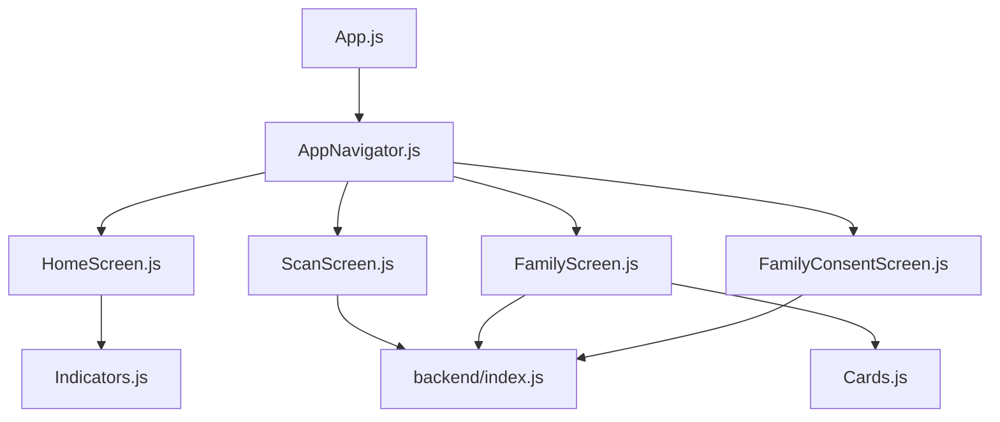
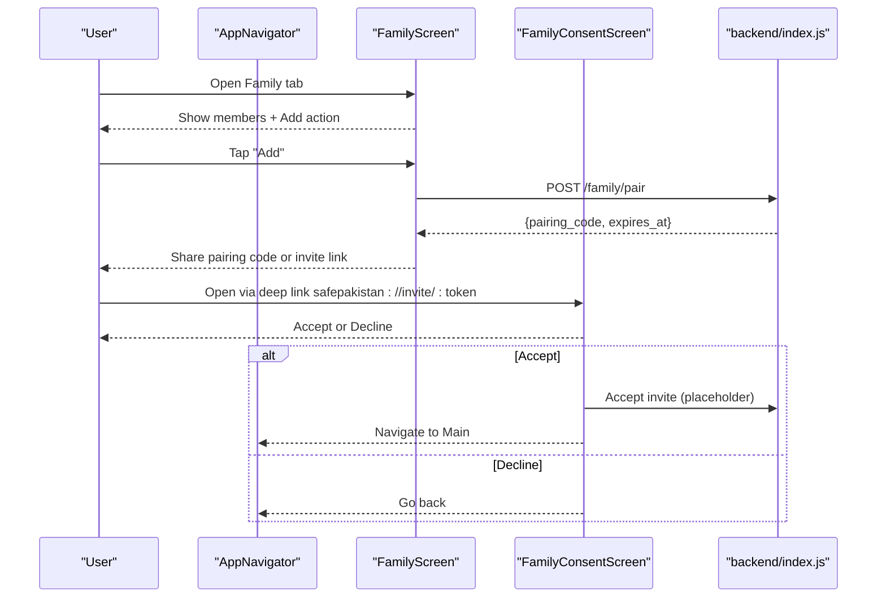
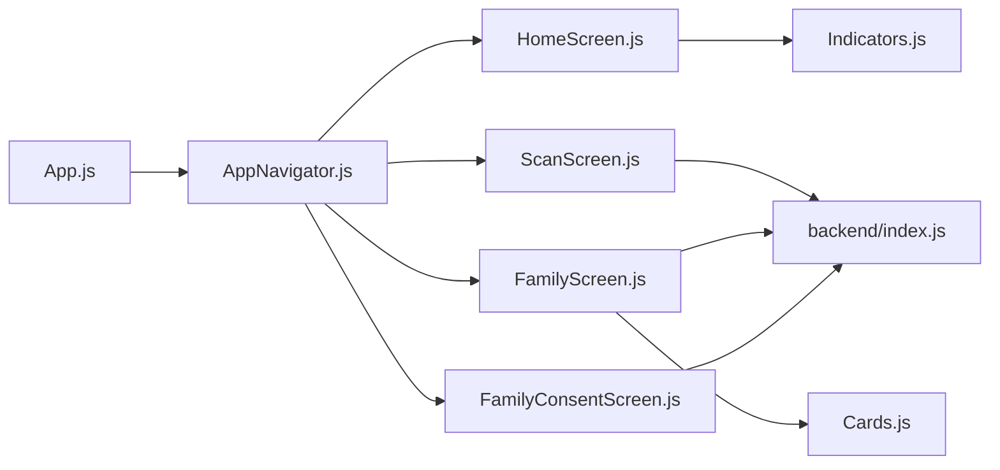

# Family Protection System

<cite>
**Referenced Files in This Document**
- [README.md](file://README.md)
- [App.js](file://App.js)
- [package.json](file://package.json)
- [backend/index.js](file://backend/index.js)
- [src/navigation/AppNavigator.js](file://src/navigation/AppNavigator.js)
- [src/screens/HomeScreen.js](file://src/screens/HomeScreen.js)
- [src/screens/ScanScreen.js](file://src/screens/ScanScreen.js)
- [src/screens/FamilyScreen.js](file://src/screens/FamilyScreen.js)
- [src/screens/FamilyConsentScreen.js](file://src/screens/FamilyConsentScreen.js)
- [src/components/Cards.js](file://src/components/Cards.js)
- [src/components/Indicators.js](file://src/components/Indicators.js)
</cite>

## Table of Contents
1. Introduction
2. Project Structure
3. Core Components
4. Architecture Overview
5. Detailed Component Analysis
6. Dependency Analysis
7. Performance Considerations
8. Troubleshooting Guide
9. Conclusion

## Introduction
This document explains Safe Pakistan’s family protection system with a focus on:
- Member management and invitation workflows
- Consent management and privacy compliance
- Real-time alert notifications to family members
- Guardian notification service for automated alerts
- Data synchronization, security considerations, offline support, and external integrations
- Typical scenarios, configuration options, and troubleshooting

The system is a React Native (Expo) application with a small backend that provides threat analysis, family pairing endpoints, and guardian alert stubs. The UI includes screens for scanning content, viewing verdicts, managing family members, and handling consent for data sharing within the family group.

## Project Structure
At a high level:
- App entry initializes fonts and mounts navigation.
- Navigation defines tabs and routes including Family and FamilyConsent flows.
- Screens implement user-facing features: Home dashboard, Scan input, Family member list, and Consent screen.
- Shared components provide cards, indicators, avatars, and status pills.
- Backend exposes endpoints for text analysis, family pairing, and guardian alerts.

**Diagram sources**
- [App.js:21-43](file://App.js#L21-L43)
- [src/navigation/AppNavigator.js:80-102](file://src/navigation/AppNavigator.js#L80-L102)
- [src/screens/HomeScreen.js:23-105](file://src/screens/HomeScreen.js#L23-L105)
- [src/screens/ScanScreen.js:15-95](file://src/screens/ScanScreen.js#L15-L95)
- [src/screens/FamilyScreen.js:27-86](file://src/screens/FamilyScreen.js#L27-L86)
- [src/screens/FamilyConsentScreen.js:24-132](file://src/screens/FamilyConsentScreen.js#L24-L132)
- [backend/index.js:63-80](file://backend/index.js#L63-L80)

**Section sources**
- [App.js:21-43](file://App.js#L21-L43)
- [src/navigation/AppNavigator.js:80-102](file://src/navigation/AppNavigator.js#L80-L102)
- [README.md:173-201](file://README.md#L173-L201)

## Core Components
- Family member list and add-member action are presented in the Family screen using reusable card components.
- Consent screen clearly communicates what data will be shared and what will never be shared, with accept/decline actions.
- Indicators and cards standardize visual states like safe/offline and verdict badges.

Key responsibilities:
- FamilyScreen: displays current members, overall shield status, and an “Add” action to invite new members.
- Cards.js: renders FamilyMemberCard, Avatar, SectionHeader, ActivityFeedItem, and other UI primitives used across screens.
- Indicators.js: provides VerdictBadge, StatusPill, ScamTypeChip, AgentStatusDot for consistent status representation.

**Section sources**
- [src/screens/FamilyScreen.js:27-86](file://src/screens/FamilyScreen.js#L27-L86)
- [src/components/Cards.js:61-86](file://src/components/Cards.js#L61-L86)
- [src/components/Indicators.js:11-43](file://src/components/Indicators.js#L11-L43)

## Architecture Overview
The family protection flow integrates UI screens with backend services:
- Invitation and consent: deep link opens FamilyConsentScreen; acceptance navigates back to main app.
- Family member management: FamilyScreen lists members and offers adding via pairing or invites.
- Alerts and notifications: backend exposes /alerts/guardian to send push notifications to designated guardians.
- Threat analysis: ScanScreen triggers analysis via backend /analyze/text; results feed into verdict and activity feeds.

**Diagram sources**
- [src/navigation/AppNavigator.js:80-102](file://src/navigation/AppNavigator.js#L80-L102)
- [src/screens/FamilyScreen.js:27-86](file://src/screens/FamilyScreen.js#L27-L86)
- [src/screens/FamilyConsentScreen.js:24-132](file://src/screens/FamilyConsentScreen.js#L24-L132)
- [backend/index.js:72-75](file://backend/index.js#L72-L75)

**Section sources**
- [src/navigation/AppNavigator.js:80-102](file://src/navigation/AppNavigator.js#L80-L102)
- [src/screens/FamilyScreen.js:27-86](file://src/screens/FamilyScreen.js#L27-L86)
- [src/screens/FamilyConsentScreen.js:24-132](file://src/screens/FamilyConsentScreen.js#L24-L132)
- [backend/index.js:72-75](file://backend/index.js#L72-L75)

## Detailed Component Analysis

### Member Management Interface
- Displays current family members with role labels and last protected timestamps.
- Shows a hero banner indicating how many members are protected.
- Provides an “Add” action to initiate invitations or pairing.

Implementation highlights:
- Uses FamilyMemberCard from Cards.js for each member row.
- StatusPill indicates PROTECTED or OFFLINE per member.
- Header shows total member count and family shield summary.

Typical interactions:
- Invite by generating a pairing code via backend endpoint.
- Deep-link consent flow for invited users to accept or decline.

**Section sources**
- [src/screens/FamilyScreen.js:27-86](file://src/screens/FamilyScreen.js#L27-L86)
- [src/components/Cards.js:61-86](file://src/components/Cards.js#L61-L86)
- [src/components/Indicators.js:30-43](file://src/components/Indicators.js#L30-L43)
- [backend/index.js:72-75](file://backend/index.js#L72-L75)

### Invitation Workflow and Consent Management
- Invitation is initiated from FamilyScreen and can use pairing codes or deep links.
- FamilyConsentScreen presents clear consent boundaries:
  - What will be shared: threat alerts, risk scores, protection status.
  - What will never be shared: message text, contacts, photos, location.
- Acceptance navigates to the main app; declining returns to previous screen.

Privacy compliance:
- Explicit consent UI ensures informed participation.
- Clear separation of shared vs non-shared data supports transparency.

**Section sources**
- [src/screens/FamilyConsentScreen.js:24-132](file://src/screens/FamilyConsentScreen.js#L24-L132)
- [src/navigation/AppNavigator.js:94-95](file://src/navigation/AppNavigator.js#L94-L95)
- [README.md:264-267](file://README.md#L264-L267)

### Relationship Mapping and Permission Levels
- Members have roles (e.g., Ammi, Abu, Behan, Bhai) displayed in member cards.
- Status reflects protection state (safe/offline).
- Permission levels are not explicitly implemented in the current code; however, the consent model limits shared data types, which acts as a baseline permission boundary.

Future enhancements could include:
- Role-based permissions (admin, viewer, editor).
- Granular toggles for specific data categories beyond the current fixed lists.

**Section sources**
- [src/screens/FamilyScreen.js:20-25](file://src/screens/FamilyScreen.js#L20-L25)
- [src/components/Cards.js:61-86](file://src/components/Cards.js#L61-L86)

### Real-Time Alert Notification System
- The backend provides /alerts/guardian to send push notifications to designated guardians.
- While real-time delivery depends on platform push services, the endpoint logs payload and returns success with a push ID.

Integration points:
- When threats are detected during scan or monitoring, the app can call this endpoint to notify guardians.
- The result includes a sent flag and push identifier for tracking.

**Section sources**
- [backend/index.js:77-80](file://backend/index.js#L77-L80)

### Guardian Notification Service
- The guardian notification service is represented by the /alerts/guardian endpoint.
- It accepts alert payloads and responds with confirmation and push ID.

Operational notes:
- Integrate with your chosen push provider (e.g., Firebase Cloud Messaging, Expo Push Notifications) by replacing the console log with actual push dispatch logic.
- Ensure device tokens are registered and maintained for each guardian.

**Section sources**
- [backend/index.js:77-80](file://backend/index.js#L77-L80)

### Data Synchronization Between Family Members
- Current implementation uses local state and UI components; explicit sync logic is not present in the provided files.
- Recommended approach:
  - Use a secure backend database to store family membership, consent records, and shared statuses.
  - Implement conflict resolution for concurrent updates (e.g., last-write-wins with versioning).
  - Provide optimistic UI updates with rollback on failure.

**Section sources**
- [src/screens/FamilyScreen.js:27-86](file://src/screens/FamilyScreen.js#L27-L86)
- [src/screens/FamilyConsentScreen.js:24-132](file://src/screens/FamilyConsentScreen.js#L24-L132)

### Security Measures for Sensitive Family Data
- Consent screen enforces minimal data sharing by design.
- Backend uses environment variables for API keys and base URLs, reducing secret exposure in code.
- HTTPS should be enforced for all network calls; ensure production endpoints use TLS.
- Consider encrypting sensitive fields at rest and in transit where applicable.

**Section sources**
- [backend/index.js:9-12](file://backend/index.js#L9-L12)
- [src/screens/FamilyConsentScreen.js:16-22](file://src/screens/FamilyConsentScreen.js#L16-L22)

### Offline Support Capabilities
- The app includes AsyncStorage dependency, enabling local caching of scans and settings.
- For family data, queue pending operations when offline and sync when connectivity resumes.
- Use background tasks to retry failed syncs and reconcile conflicts.

**Section sources**
- [package.json:33-33](file://package.json#L33-L33)
- [README.md:173-184](file://README.md#L173-L184)

### Integration with External Notification Services
- Replace the placeholder /alerts/guardian handler with a real push service integration.
- Register device tokens for family members and guardians.
- Handle token refreshes and delivery failures gracefully.

**Section sources**
- [backend/index.js:77-80](file://backend/index.js#L77-L80)

## Dependency Analysis
The following diagram maps key dependencies between screens, components, and backend endpoints.

**Diagram sources**
- [App.js:21-43](file://App.js#L21-L43)
- [src/navigation/AppNavigator.js:80-102](file://src/navigation/AppNavigator.js#L80-L102)
- [src/screens/HomeScreen.js:23-105](file://src/screens/HomeScreen.js#L23-L105)
- [src/screens/ScanScreen.js:15-95](file://src/screens/ScanScreen.js#L15-L95)
- [src/screens/FamilyScreen.js:27-86](file://src/screens/FamilyScreen.js#L27-L86)
- [src/screens/FamilyConsentScreen.js:24-132](file://src/screens/FamilyConsentScreen.js#L24-L132)
- [src/components/Cards.js:61-86](file://src/components/Cards.js#L61-L86)
- [src/components/Indicators.js:11-43](file://src/components/Indicators.js#L11-L43)
- [backend/index.js:63-80](file://backend/index.js#L63-L80)

**Section sources**
- [src/navigation/AppNavigator.js:80-102](file://src/navigation/AppNavigator.js#L80-L102)
- [backend/index.js:63-80](file://backend/index.js#L63-L80)

## Performance Considerations
- Keep family member lists lightweight; paginate if the number grows significantly.
- Debounce repeated analysis requests to avoid unnecessary backend calls.
- Use optimistic UI updates for faster perceived performance while awaiting server responses.
- Cache recent scans and stats locally to reduce re-fetch overhead.

[No sources needed since this section provides general guidance]

## Troubleshooting Guide
Common issues and resolutions:
- Deep link not opening consent screen:
  - Ensure the custom scheme is registered in app configuration and linked in navigation.
  - Verify route params (inviterName, inviterPhone, token) are passed correctly.
- Guardian alerts not delivered:
  - Confirm device tokens are valid and up-to-date.
  - Check backend logs for errors and integrate with a real push provider.
- Family pairing code expired:
  - Generate a new pairing code; the backend sets an expiration time.
- Offline sync failures:
  - Queue operations locally and retry when connectivity is restored.
  - Resolve conflicts using versioned updates.

**Section sources**
- [README.md:264-267](file://README.md#L264-L267)
- [backend/index.js:72-80](file://backend/index.js#L72-L80)
- [src/screens/FamilyConsentScreen.js:24-132](file://src/screens/FamilyConsentScreen.js#L24-L132)

## Conclusion
Safe Pakistan’s family protection system provides a clear foundation for inviting family members, managing consent, and notifying guardians about threats. The UI emphasizes transparency and simplicity, while the backend exposes essential endpoints for analysis, pairing, and alerts. To complete the system:
- Implement full consent acceptance/declination flows with backend persistence.
- Integrate a robust push notification service for guardian alerts.
- Add offline-first sync with conflict resolution for family data.
- Expand permission models to support granular access control.

[No sources needed since this section summarizes without analyzing specific files]