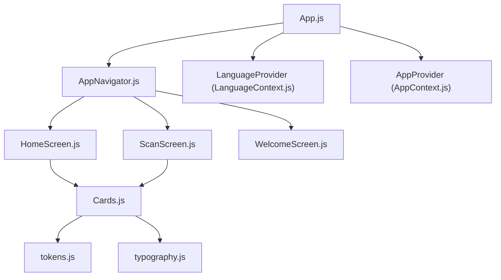
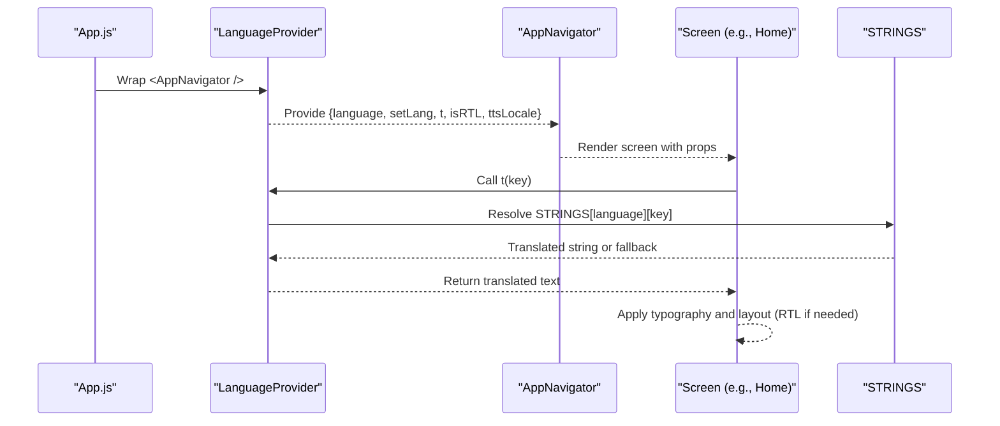
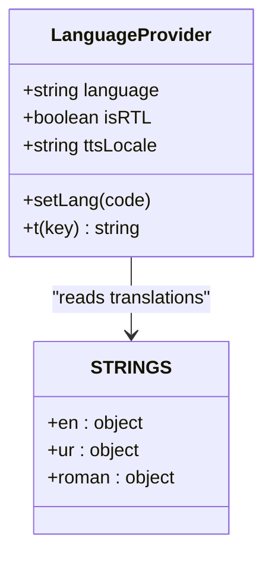
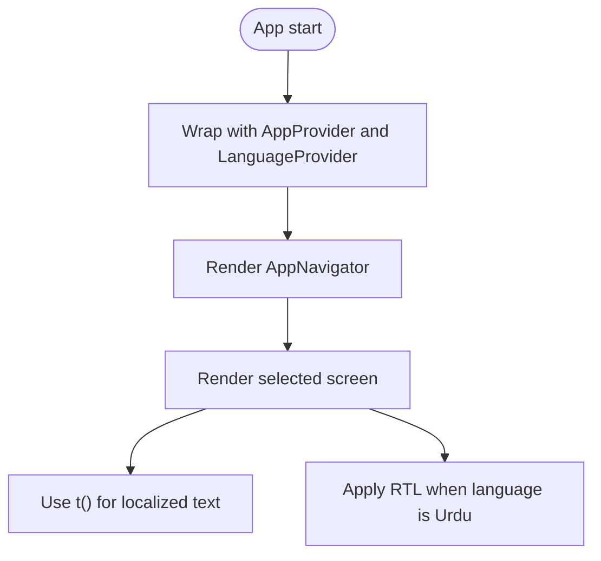
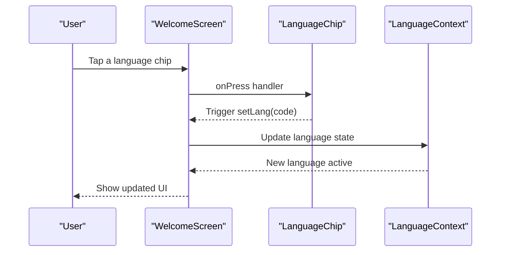
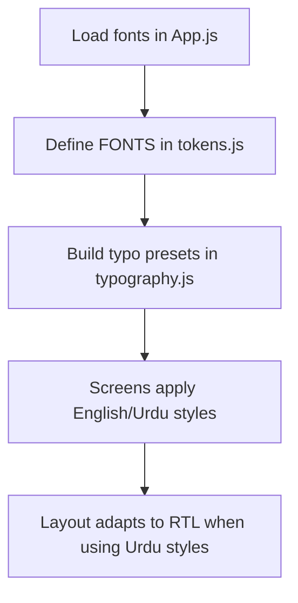
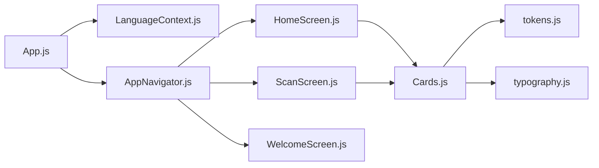

# Internationalization System

<cite>
**Referenced Files in This Document**
- [App.js](file://App.js)
- [LanguageContext.js](file://src/context/LanguageContext.js)
- [AppNavigator.js](file://src/navigation/AppNavigator.js)
- [HomeScreen.js](file://src/screens/HomeScreen.js)
- [WelcomeScreen.js](file://src/screens/WelcomeScreen.js)
- [ScanScreen.js](file://src/screens/ScanScreen.js)
- [Cards.js](file://src/components/Cards.js)
- [tokens.js](file://src/theme/tokens.js)
- [typography.js](file://src/theme/typography.js)
</cite>

## Table of Contents
1. [Introduction](#introduction)
2. [Project Structure](#project-structure)
3. [Core Components](#core-components)
4. [Architecture Overview](#architecture-overview)
5. [Detailed Component Analysis](#detailed-component-analysis)
6. [Dependency Analysis](#dependency-analysis)
7. [Performance Considerations](#performance-considerations)
8. [Troubleshooting Guide](#troubleshooting-guide)
9. [Conclusion](#conclusion)

## Introduction
This document explains the Internationalization (i18n) system for Safe Pakistan. It covers supported languages, how language state is managed and shared across screens, how translations are resolved at runtime, and how right-to-left (RTL) layout and typography are handled. The goal is to help developers understand where to add new strings, how to switch languages, and how UI adapts to different locales.

## Project Structure
The i18n system is centered around a context provider that exposes language state and translation utilities to the entire app. Screens consume this context to render localized text and adapt layout direction. Typography and fonts are configured to support both English and Urdu with appropriate sizing and alignment rules.

**Diagram sources**
- [App.js:17-49](file://App.js#L17-L49)
- [AppNavigator.js:19-30](file://src/navigation/AppNavigator.js#L19-L30)
- [LanguageContext.js:47-67](file://src/context/LanguageContext.js#L47-L67)
- [HomeScreen.js:23-104](file://src/screens/HomeScreen.js#L23-L104)
- [ScanScreen.js:33-144](file://src/screens/ScanScreen.js#L33-L144)
- [WelcomeScreen.js:18-89](file://src/screens/WelcomeScreen.js#L18-L89)
- [Cards.js:1-193](file://src/components/Cards.js#L1-L193)
- [tokens.js:56-68](file://src/theme/tokens.js#L56-L68)
- [typography.js:1-59](file://src/theme/typography.js#L1-L59)

**Section sources**
- [App.js:17-49](file://App.js#L17-L49)
- [AppNavigator.js:19-30](file://src/navigation/AppNavigator.js#L19-L30)
- [LanguageContext.js:47-67](file://src/context/LanguageContext.js#L47-L67)

## Core Components
- LanguageProvider: Holds current language, provides a translation function t(), exposes RTL flag and TTS locale, and renders children under its context.
- Translation dictionary: A small shared dictionary defines common keys for English, Urdu, and Roman Urdu.
- Typography and tokens: Provide consistent font families and sizes for English and Urdu, including automatic RTL settings and line-height adjustments for Urdu.
- UI components: Reusable components include a LanguageChip for selecting languages and helpers that can display bilingual labels.

Key responsibilities:
- Centralized language state and updates
- Consistent translation resolution with fallbacks
- RTL detection and TTS locale mapping
- Bilingual typography presets

**Section sources**
- [LanguageContext.js:8-43](file://src/context/LanguageContext.js#L8-L43)
- [LanguageContext.js:47-71](file://src/context/LanguageContext.js#L47-L71)
- [tokens.js:56-68](file://src/theme/tokens.js#L56-L68)
- [typography.js:1-59](file://src/theme/typography.js#L1-L59)
- [Cards.js:112-127](file://src/components/Cards.js#L112-L127)

## Architecture Overview
The i18n architecture uses React Context to share language state globally. Providers wrap the navigation tree so any screen can access translations and orientation hints. Screens use the provided t() function to resolve localized strings and apply typography styles based on content type (English vs Urdu).

**Diagram sources**
- [App.js:42-49](file://App.js#L42-L49)
- [LanguageContext.js:47-67](file://src/context/LanguageContext.js#L47-L67)
- [AppNavigator.js:80-101](file://src/navigation/AppNavigator.js#L80-L101)
- [HomeScreen.js:23-104](file://src/screens/HomeScreen.js#L23-L104)

## Detailed Component Analysis

### LanguageContext and Provider
- Maintains current language code and setter
- Computes isRTL based on language
- Maps language to TTS locale for speech features
- Provides t() with safe fallback to English then key
- Exposes value via context for all descendants

**Diagram sources**
- [LanguageContext.js:8-43](file://src/context/LanguageContext.js#L8-L43)
- [LanguageContext.js:47-71](file://src/context/LanguageContext.js#L47-L71)

**Section sources**
- [LanguageContext.js:8-43](file://src/context/LanguageContext.js#L8-L43)
- [LanguageContext.js:47-71](file://src/context/LanguageContext.js#L47-L71)

### Navigation Integration
- App wraps navigator with providers to make i18n available throughout navigation
- Navigator defines routes; screens inside can consume language context

**Diagram sources**
- [App.js:42-49](file://App.js#L42-L49)
- [AppNavigator.js:80-101](file://src/navigation/AppNavigator.js#L80-L101)

**Section sources**
- [App.js:42-49](file://App.js#L42-L49)
- [AppNavigator.js:80-101](file://src/navigation/AppNavigator.js#L80-L101)

### Screens Using i18n Patterns
- HomeScreen demonstrates bilingual headings and status pills; it shows how to mix English and Urdu text within a single view.
- ScanScreen includes bilingual headers and tips, illustrating inline localization patterns.
- WelcomeScreen contains a local language selector UI component (LanguageChip) for choosing a language during onboarding.

**Diagram sources**
- [WelcomeScreen.js:12-16](file://src/screens/WelcomeScreen.js#L12-L16)
- [WelcomeScreen.js:64-75](file://src/screens/WelcomeScreen.js#L64-L75)
- [Cards.js:112-127](file://src/components/Cards.js#L112-L127)
- [LanguageContext.js:47-67](file://src/context/LanguageContext.js#L47-L67)

**Section sources**
- [HomeScreen.js:23-104](file://src/screens/HomeScreen.js#L23-L104)
- [ScanScreen.js:63-144](file://src/screens/ScanScreen.js#L63-L144)
- [WelcomeScreen.js:12-16](file://src/screens/WelcomeScreen.js#L12-L16)
- [WelcomeScreen.js:64-75](file://src/screens/WelcomeScreen.js#L64-L75)
- [Cards.js:112-127](file://src/components/Cards.js#L112-L127)

### Typography and RTL Handling
- Typography presets define English and Urdu styles with consistent sizing and line heights
- Urdu styles automatically set writingDirection to RTL and align text to the right
- Token layer provides font families for Inter (English) and Noto Nastaliq Urdu (Urdu)

**Diagram sources**
- [App.js:21-26](file://App.js#L21-L26)
- [tokens.js:56-68](file://src/theme/tokens.js#L56-L68)
- [typography.js:14-29](file://src/theme/typography.js#L14-L29)
- [typography.js:31-55](file://src/theme/typography.js#L31-L55)

**Section sources**
- [tokens.js:56-68](file://src/theme/tokens.js#L56-L68)
- [typography.js:1-59](file://src/theme/typography.js#L1-L59)

## Dependency Analysis
- App.js depends on LanguageProvider and AppProvider to bootstrap global state
- AppNavigator imports screens that may consume language context
- Screens depend on typography and tokens for consistent rendering
- Cards provide reusable UI elements including language selection chips

**Diagram sources**
- [App.js:17-49](file://App.js#L17-L49)
- [AppNavigator.js:19-30](file://src/navigation/AppNavigator.js#L19-L30)
- [LanguageContext.js:47-67](file://src/context/LanguageContext.js#L47-L67)
- [HomeScreen.js:23-104](file://src/screens/HomeScreen.js#L23-L104)
- [ScanScreen.js:33-144](file://src/screens/ScanScreen.js#L33-L144)
- [WelcomeScreen.js:18-89](file://src/screens/WelcomeScreen.js#L18-L89)
- [Cards.js:1-193](file://src/components/Cards.js#L1-L193)
- [tokens.js:56-68](file://src/theme/tokens.js#L56-L68)
- [typography.js:1-59](file://src/theme/typography.js#L1-L59)

**Section sources**
- [App.js:17-49](file://App.js#L17-L49)
- [AppNavigator.js:19-30](file://src/navigation/AppNavigator.js#L19-L30)
- [LanguageContext.js:47-67](file://src/context/LanguageContext.js#L47-L67)
- [Cards.js:1-193](file://src/components/Cards.js#L1-L193)
- [tokens.js:56-68](file://src/theme/tokens.js#L56-L68)
- [typography.js:1-59](file://src/theme/typography.js#L1-L59)

## Performance Considerations
- Translation lookup uses a simple dictionary; keep the shared dictionary concise and avoid heavy computations inside t()
- Memoize derived values like isRTL and ttsLocale to prevent unnecessary re-renders
- Prefer loading fonts once at app startup to avoid layout shifts during language changes
- Avoid per-render creation of large translation objects; keep them static

[No sources needed since this section provides general guidance]

## Troubleshooting Guide
Common issues and resolutions:
- Missing translation key: t() falls back to English then the key itself; ensure keys exist in the target language dictionary to avoid showing raw keys
- Incorrect RTL behavior: Verify that Urdu text uses typography presets that set writingDirection and textAlign; confirm language code maps correctly to isRTL
- Font loading delays: Ensure fonts are loaded before rendering; handle timeout states to show a loading indicator while fonts load
- Language selector not updating UI: Confirm that the language state setter is called and that screens consume the context to re-render

**Section sources**
- [LanguageContext.js:53-56](file://src/context/LanguageContext.js#L53-L56)
- [LanguageContext.js:50-51](file://src/context/LanguageContext.js#L50-L51)
- [App.js:21-40](file://App.js#L21-L40)
- [typography.js:21-29](file://src/theme/typography.js#L21-L29)

## Conclusion
Safe Pakistan’s internationalization system centers on a lightweight context provider that manages language state, resolves translations with safe fallbacks, and exposes RTL and TTS locale information. Typography and tokens ensure consistent bilingual rendering, while screens demonstrate practical usage patterns for localized UI. This design supports maintaining three core languages (English, Urdu, Roman Urdu) with clear extension points for adding more strings and locales.

[No sources needed since this section summarizes without analyzing specific files]