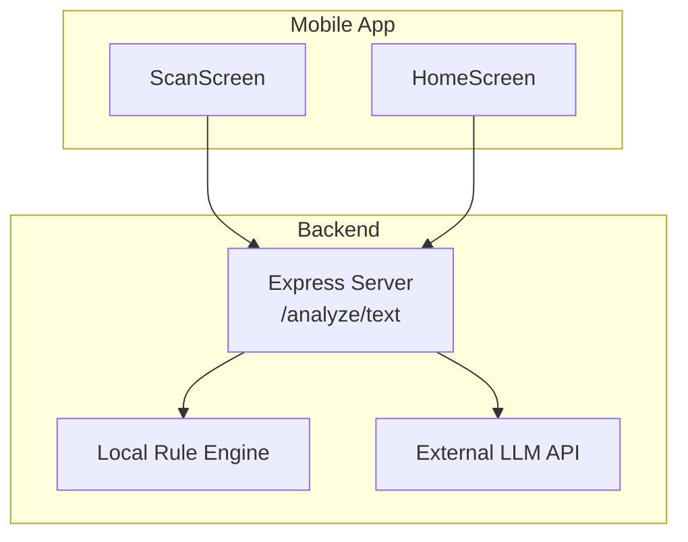
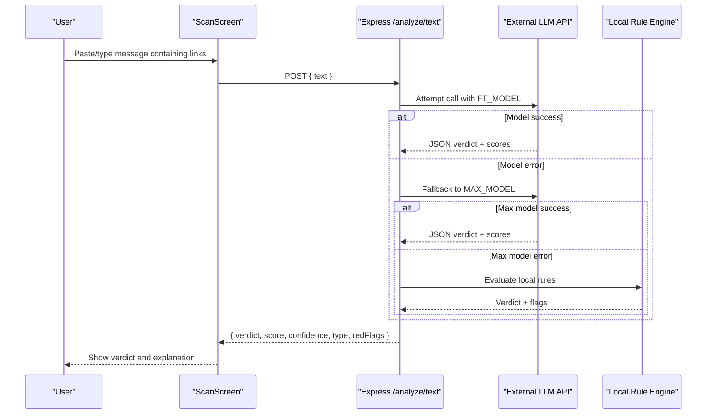
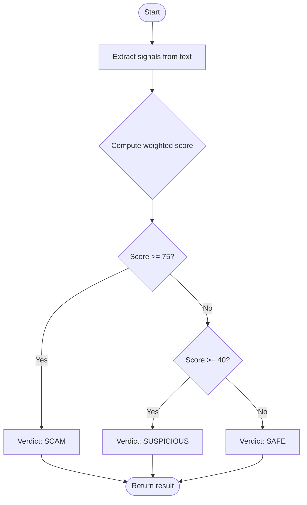
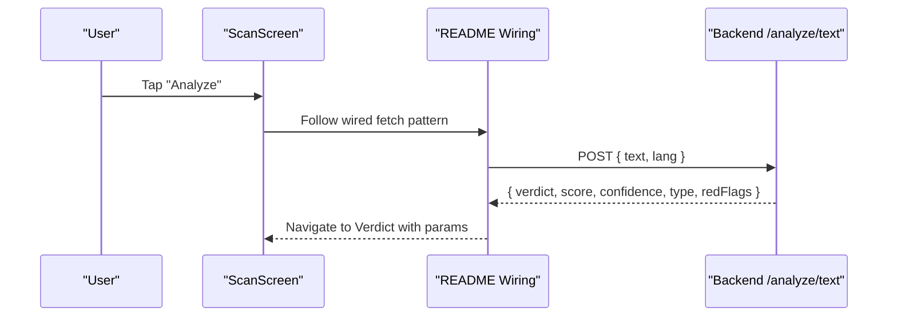
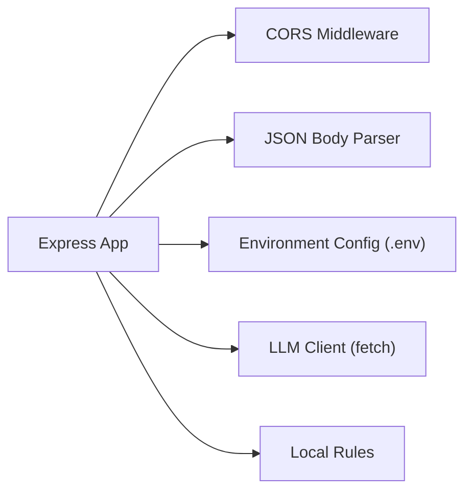

# Link Verification Service

<cite>
**Referenced Files in This Document**
- [backend/index.js](file://backend/index.js)
- [backend/test.js](file://backend/test.js)
- [README.md](file://README.md)
- [src/screens/ScanScreen.js](file://src/screens/ScanScreen.js)
- [src/screens/HomeScreen.js](file://src/screens/HomeScreen.js)
</cite>

## Table of Contents
1. [Introduction](#introduction)
2. [Project Structure](#project-structure)
3. [Core Components](#core-components)
4. [Architecture Overview](#architecture-overview)
5. [Detailed Component Analysis](#detailed-component-analysis)
6. [Dependency Analysis](#dependency-analysis)
7. [Performance Considerations](#performance-considerations)
8. [Troubleshooting Guide](#troubleshooting-guide)
9. [Conclusion](#conclusion)
10. [Appendices](#appendices)

## Introduction
This document describes the link verification service within Safe Pakistan’s threat detection system. It explains how hyperlinks embedded in SMS, emails, and other text are analyzed for safety using domain reputation checks, content scanning for phishing indicators, and integration with external security APIs and threat intelligence feeds. It also covers URL parsing, redirect following, SSL certificate validation, performance considerations (web scraping, caching, timeouts), and practical examples of link-based scam detection scenarios such as phishing URLs, fake banking portals, and malicious download links.

## Project Structure
Safe Pakistan is a React Native application with a small Node.js backend that performs analysis. The current repository includes:
- A backend Express server that analyzes text via an AI model or local rules and exposes endpoints for analysis, family pairing, and alerts.
- A mobile frontend with screens for scanning input, viewing verdicts, and exploring threat history.

**Diagram sources**
- [src/screens/ScanScreen.js:18-23](file://src/screens/ScanScreen.js#L18-L23)
- [src/screens/HomeScreen.js:60-82](file://src/screens/HomeScreen.js#L60-L82)
- [backend/index.js:63-70](file://backend/index.js#L63-L70)

**Section sources**
- [README.md:173-201](file://README.md#L173-L201)
- [backend/index.js:1-13](file://backend/index.js#L1-L13)

## Core Components
- Text analysis endpoint: Accepts text payloads and returns a structured verdict including risk score, confidence, type, and evidence spans.
- Local rule engine: Fast heuristic scoring based on patterns like OTP requests, urgency cues, prize mentions, CNIC requests, and presence of links.
- External model fallback: Attempts a fine-tuned model first, then a default model, before falling back to local rules.

Key responsibilities:
- Parse incoming text for URLs and contextual signals.
- Score risk and determine verdict categories.
- Provide explanations and red flags for user-facing feedback.

**Section sources**
- [backend/index.js:16-43](file://backend/index.js#L16-L43)
- [backend/index.js:45-70](file://backend/index.js#L45-L70)

## Architecture Overview
The link verification service integrates into the broader analysis pipeline. While the current implementation focuses on text-level analysis, it provides a foundation for adding explicit link verification steps such as URL extraction, domain reputation checks, content scanning, and certificate validation.

**Diagram sources**
- [backend/index.js:63-70](file://backend/index.js#L63-L70)
- [backend/index.js:16-43](file://backend/index.js#L16-L43)
- [src/screens/ScanScreen.js:18-23](file://src/screens/ScanScreen.js#L18-L23)

## Detailed Component Analysis

### Text Analysis Endpoint (/analyze/text)
- Purpose: Central entry point for analyzing messages that may contain links.
- Behavior:
  - Attempts to call a fine-tuned model; if it fails, tries a default model; otherwise falls back to local rules.
  - Returns normalized fields: verdict, score, confidence, type, redFlags, and multilingual explanations.
- Extensibility:
  - Add URL extraction and enrichment before calling models or rules.
  - Integrate domain reputation and content scanning modules into this flow.

**Section sources**
- [backend/index.js:63-70](file://backend/index.js#L63-L70)
- [backend/index.js:16-43](file://backend/index.js#L16-L43)

### Local Rule Engine
- Purpose: Heuristic scoring when external models are unavailable or slow.
- Signals:
  - Presence of sensitive terms (OTP, PIN, password, CVV).
  - Urgency language (foran, turant, abhi, warna).
  - Prize/lottery/bonus keywords.
  - Identity data requests (CNIC/shanakht).
  - Link-related cues (verify, update, click, http, link).
- Output:
  - Aggregated score capped at 100.
  - Verdict thresholds: scam (>=75), suspicious (>=40), safe (<40).
  - Red flags limited to top matches.

**Diagram sources**
- [backend/index.js:45-61](file://backend/index.js#L45-L61)

**Section sources**
- [backend/index.js:45-61](file://backend/index.js#L45-L61)

### Mobile Integration Points
- ScanScreen: Provides the UI for pasting or typing messages and triggering analysis.
- HomeScreen: Shows agent status including “LINK” monitoring.
- README wiring guidance: Demonstrates how to call the backend analyze endpoint and navigate to verdict results.

**Diagram sources**
- [src/screens/ScanScreen.js:18-23](file://src/screens/ScanScreen.js#L18-L23)
- [README.md:186-201](file://README.md#L186-L201)

**Section sources**
- [src/screens/ScanScreen.js:18-23](file://src/screens/ScanScreen.js#L18-L23)
- [src/screens/HomeScreen.js:60-82](file://src/screens/HomeScreen.js#L60-L82)
- [README.md:173-201](file://README.md#L173-L201)

## Dependency Analysis
- Backend dependencies:
  - Express for HTTP routing.
  - CORS for cross-origin requests.
  - dotenv for environment configuration.
- External integrations:
  - LLM provider configured via environment variables (base URL and API key).
  - Optional fine-tuned model name and default model name.

**Diagram sources**
- [backend/index.js:1-13](file://backend/index.js#L1-L13)
- [backend/index.js:16-43](file://backend/index.js#L16-L43)

**Section sources**
- [backend/package.json:1-19](file://backend/package.json#L1-L19)
- [backend/index.js:1-13](file://backend/index.js#L1-L13)

## Performance Considerations
- Web scraping and content scanning:
  - Use connection timeouts and response size limits to avoid long-running requests.
  - Implement concurrency controls to prevent resource exhaustion during bulk link checks.
  - Prefer headless browsing only when necessary; cache rendered pages and DOM snapshots for repeated domains.
- Caching strategies:
  - Domain reputation cache keyed by normalized domain with TTL (e.g., 1–24 hours depending on volatility).
  - Content scan results cache keyed by URL fingerprint (canonicalized URL without query parameters) with short TTL.
  - LLM response cache for identical inputs to reduce latency and cost.
- Timeout handling:
  - Set per-request timeouts for DNS resolution, TCP connect, TLS handshake, and HTTP request/response phases.
  - Implement retry with exponential backoff for transient failures; cap maximum retries.
  - Graceful degradation to local rules when external services time out or fail.
- Memory and CPU:
  - Stream responses where possible; avoid loading full HTML into memory for large pages.
  - Limit number of concurrent redirects and enforce a maximum depth to prevent loops.

[No sources needed since this section provides general guidance]

## Troubleshooting Guide
Common issues and resolutions:
- External model errors:
  - Symptom: Non-OK HTTP status or malformed JSON output.
  - Resolution: Log error details, fall back to next model or local rules, and return safe defaults with low confidence.
- No JSON in model output:
  - Symptom: Parsing failure due to unexpected format.
  - Resolution: Improve prompt constraints, add robust regex extraction, and log raw output for debugging.
- Slow or unresponsive websites:
  - Symptom: Timeouts during content scanning or redirect following.
  - Resolution: Enforce strict timeouts, limit redirects, and mark as suspicious with partial evidence.
- High false positives/negatives:
  - Symptom: Misclassification of benign or malicious links.
  - Resolution: Tune rule weights, expand domain reputation lists, and incorporate additional signals (SSL issuer, hostname age, WHOIS anomalies).

**Section sources**
- [backend/index.js:16-43](file://backend/index.js#L16-L43)
- [backend/index.js:63-70](file://backend/index.js#L63-L70)

## Conclusion
The current backend provides a solid foundation for link verification through text analysis and local heuristics. To fully realize link-based threat detection, extend the pipeline with explicit URL parsing, domain reputation checks, content scanning for phishing indicators, and SSL certificate validation. Incorporate robust caching, timeouts, and fallback mechanisms to ensure reliability and performance under real-world conditions.

[No sources needed since this section summarizes without analyzing specific files]

## Appendices

### Example Link-Based Scam Detection Scenarios
- Phishing URL:
  - Indicators: Shortened domains, mismatched brand names, urgent calls-to-action, login prompts.
  - Actions: Extract domain, check reputation database, follow redirects safely, inspect page content for credential forms.
- Fake Banking Portal:
  - Indicators: Typosquatting, self-signed or expired certificates, generic hosting providers.
  - Actions: Validate SSL chain, compare against known bank domains, scan for form fields requesting sensitive data.
- Malicious Download Link:
  - Indicators: Executable extensions, unknown file types, aggressive download behavior.
  - Actions: Block execution, scan file metadata, check hash against malware databases, warn users.

[No sources needed since this section provides conceptual examples]

### Implementation Details for URL Parsing, Redirect Following, and SSL Validation
- URL parsing:
  - Normalize URLs (lowercase host, remove fragments, canonicalize scheme/host/path).
  - Extract query parameters for fingerprinting while ignoring volatile tokens.
- Redirect following:
  - Respect max redirect depth (e.g., 5) and total hop count.
  - Detect and break redirect loops; record final destination for reputation checks.
- SSL certificate validation:
  - Verify certificate chain and expiration.
  - Flag self-signed, expired, or mismatched hostnames.
  - Record issuer and algorithm details for reputation scoring.

[No sources needed since this section provides conceptual implementation guidance]