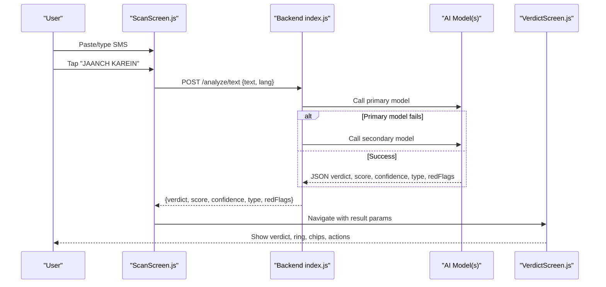
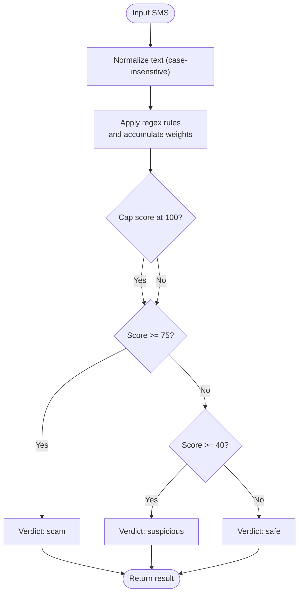
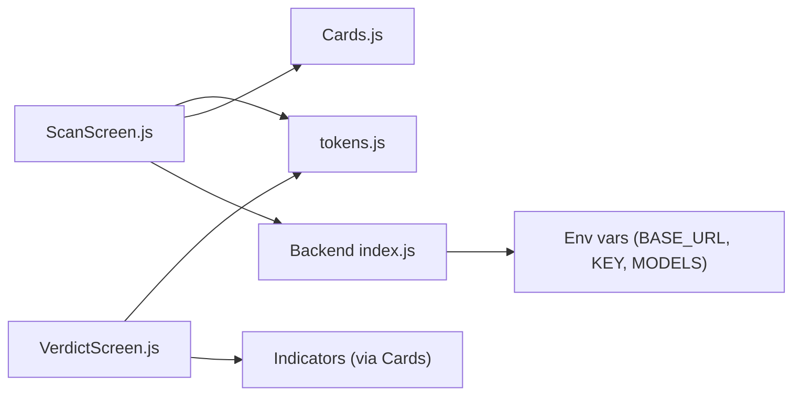

# SMS Analysis

<cite>
**Referenced Files in This Document**
- [README.md](file://README.md)
- [ScanScreen.js](file://src/screens/ScanScreen.js)
- [VerdictScreen.js](file://src/screens/VerdictScreen.js)
- [index.js](file://backend/index.js)
- [test.js](file://backend/test.js)
- [tokens.js](file://src/theme/tokens.js)
- [Cards.js](file://src/components/Cards.js)
</cite>

## Table of Contents
1. [Introduction](#introduction)
2. [Project Structure](#project-structure)
3. [Core Components](#core-components)
4. [Architecture Overview](#architecture-overview)
5. [Detailed Component Analysis](#detailed-component-analysis)
6. [Dependency Analysis](#dependency-analysis)
7. [Performance Considerations](#performance-considerations)
8. [Troubleshooting Guide](#troubleshooting-guide)
9. [Conclusion](#conclusion)
10. [Appendices](#appendices)

## Introduction
This document explains the SMS analysis feature in Safe Pakistan’s threat detection system. It covers how users paste or type SMS messages, the UI components involved (multi-line input, bilingual placeholders, and analyze button), and how the app integrates with a backend API to detect scams. It also documents error handling strategies for invalid inputs, network failures, and timeouts; common scam patterns detected; and implementation details for text preprocessing, pattern matching, and confidence scoring.

## Project Structure
The SMS analysis spans the mobile UI (React Native screens) and a Node.js backend:
- Mobile UI: ScanScreen handles user input and triggers analysis; VerdictScreen displays results.
- Backend: Express server exposes an /analyze/text endpoint that calls AI models and falls back to local rules.

```mermaid
graph TB
subgraph "Mobile App"
SS["ScanScreen.js"]
VS["VerdictScreen.js"]
TK["tokens.js"]
CD["Cards.js"]
end
subgraph "Backend"
BE["index.js"]
TST["test.js"]
end
SS --> |"POST /analyze/text"| BE
BE --> |"AI model + fallback rules"| BE
VS <--|"verdict, score, confidence, type, redFlags"| SS
SS -.->|"UI tokens & cards"| TK
SS -.->|"UI cards & headers"| CD
TST --> |"Local test call"| BE
```

**Diagram sources**
- [ScanScreen.js:15-23](file://src/screens/ScanScreen.js#L15-L23)
- [VerdictScreen.js:19-24](file://src/screens/VerdictScreen.js#L19-L24)
- [index.js:63-70](file://backend/index.js#L63-L70)
- [test.js:1-8](file://backend/test.js#L1-L8)
- [tokens.js:7-54](file://src/theme/tokens.js#L7-L54)
- [Cards.js:29-45](file://src/components/Cards.js#L29-L45)

**Section sources**
- [README.md:173-201](file://README.md#L173-L201)
- [ScanScreen.js:15-95](file://src/screens/ScanScreen.js#L15-L95)
- [VerdictScreen.js:19-116](file://src/screens/VerdictScreen.js#L19-L116)
- [index.js:63-70](file://backend/index.js#L63-L70)

## Core Components
- Multi-line text input: A large, dashed-border TextInput allows pasting or typing SMS content. It supports multiline input and uses bilingual placeholder guidance.
- Analyze button: A gradient CTA labeled “JAANCH KAREIN” triggers analysis. In the current code, it navigates directly to the verdict screen; integration with the backend is documented in README comments.
- Verdict display: VerdictScreen shows risk score, confidence, scam type, evidence chips (“WORDS FOUND”), and explanations in English and Urdu.

Key behaviors:
- Input state is held locally in ScanScreen.
- The analyze action currently demonstrates navigation; production wiring should POST to the backend and navigate to Verdict with full result data.
- VerdictScreen renders animated band, ThreatRing, chips, and action sheet buttons.

**Section sources**
- [ScanScreen.js:15-95](file://src/screens/ScanScreen.js#L15-L95)
- [VerdictScreen.js:19-116](file://src/screens/VerdictScreen.js#L19-L116)
- [README.md:173-201](file://README.md#L173-L201)

## Architecture Overview
The SMS analysis pipeline:
1. User enters or pastes SMS into ScanScreen’s multi-line input.
2. On pressing “JAANCH KAREIN”, the app sends a POST request to the backend /analyze/text with JSON body containing the text and language context.
3. Backend attempts AI-based analysis via configured models; if unavailable, it falls back to a local rule engine.
4. Response includes verdict, risk score, confidence, scam type, and evidence spans.
5. VerdictScreen renders the result with visual indicators and actionable options.



**Diagram sources**
- [ScanScreen.js:18-23](file://src/screens/ScanScreen.js#L18-L23)
- [index.js:16-43](file://backend/index.js#L16-L43)
- [index.js:63-70](file://backend/index.js#L63-L70)
- [VerdictScreen.js:19-24](file://src/screens/VerdictScreen.js#L19-L24)

## Detailed Component Analysis

### Text Input Handling Mechanism
- Multi-line TextInput: Accepts long SMS content, supports RTL-friendly typography via theme tokens.
- Placeholder text: Provides bilingual guidance to encourage pasting or typing SMS.
- State management: Local state holds the current text; onChange updates state for submission.

Implementation notes:
- The input card groups label, TextInput, and auxiliary chips (Screenshot, Voice, Share).
- The analyze function is a placeholder for backend integration; README provides the fetch pattern and expected response fields.

**Section sources**
- [ScanScreen.js:40-69](file://src/screens/ScanScreen.js#L40-L69)
- [README.md:173-201](file://README.md#L173-L201)

### Analyze Button Functionality
- Visual: Gradient button with icon and label “JAANCH KAREIN”.
- Behavior: Currently navigates to Verdict with a demo payload; production should call backend and pass full result object.

Integration reference:
- README shows how to POST to the backend and map response fields to navigation params.

**Section sources**
- [ScanScreen.js:58-69](file://src/screens/ScanScreen.js#L58-L69)
- [README.md:173-201](file://README.md#L173-L201)

### Backend API Integration
Endpoint: POST /analyze/text
Request body:
- text: string (SMS content)
- lang: optional language context (from app)

Response fields:
- verdict: "scam" | "safe" | "suspicious"
- score: number 0–100
- confidence: number 0–100
- type: string (e.g., "BISP 8171 Fraud")
- redFlags: array of strings (trigger words)
- explanation_en, explanation_roman_ur, explanation_urdu: localized explanations

Processing logic:
- Layered model calls: try configured fine-tuned model first, then qwen-max fallback.
- If both fail, use local rule engine with regex-based scoring.

Error handling:
- Network/model errors are caught and logged; fallback ensures a response even when models are unavailable.

**Section sources**
- [index.js:16-43](file://backend/index.js#L16-L43)
- [index.js:45-61](file://backend/index.js#L45-L61)
- [index.js:63-70](file://backend/index.js#L63-L70)
- [test.js:1-8](file://backend/test.js#L1-L8)

### Verdict Display and Evidence Chips
- Animated band with verdict pill and ThreatRing showing risk score.
- Confidence chip and scam type chip.
- Evidence chips (“WORDS FOUND”) highlight trigger words matched in the message.
- Action sheet offers blocking, family notification, and reporting options.

**Section sources**
- [VerdictScreen.js:19-116](file://src/screens/VerdictScreen.js#L19-L116)
- [VerdictScreen.js:118-144](file://src/screens/VerdictScreen.js#L118-L144)

### Common SMS Scam Patterns Detected
Patterns recognized by the backend’s local rule engine include:
- OTP/PIN/password/CVV requests
- Account block threats (“account band/block ho gaya/jayega”)
- Urgency cues (“foran/turant/abhi warna”)
- Prize/lottery/Eidi/bonus/kupon mentions
- CNIC/shanakht requests
- Links/verify/update/click/http

These patterns contribute to a cumulative risk score and generate red flags displayed as evidence chips.

**Section sources**
- [index.js:45-61](file://backend/index.js#L45-L61)

### Text Preprocessing, Pattern Matching, and Confidence Scoring
- Preprocessing: Minimal; the backend concatenates a prompt prefix and forwards the raw text to the model. The local rule engine operates on the raw text using case-insensitive regex.
- Pattern matching: Regex rules assign weights per match; scores accumulate and are capped at 100.
- Confidence scoring:
  - AI responses provide a confidence value normalized to 0–100.
  - Local rule engine returns a fixed confidence when used as fallback.
- Verdict thresholds:
  - Score >= 75 → "scam"
  - Score >= 40 → "suspicious"
  - Otherwise → "safe"



**Diagram sources**
- [index.js:45-61](file://backend/index.js#L45-L61)

**Section sources**
- [index.js:45-61](file://backend/index.js#L45-L61)

## Dependency Analysis
- ScanScreen depends on theme tokens and reusable cards for consistent UI.
- VerdictScreen depends on theme tokens and indicator components for badges and chips.
- Backend depends on environment variables for model endpoints and keys; it uses Express and CORS.



**Diagram sources**
- [ScanScreen.js:11-13](file://src/screens/ScanScreen.js#L11-L13)
- [VerdictScreen.js:12-15](file://src/screens/VerdictScreen.js#L12-L15)
- [index.js:9-12](file://backend/index.js#L9-L12)

**Section sources**
- [ScanScreen.js:11-13](file://src/screens/ScanScreen.js#L11-L13)
- [VerdictScreen.js:12-15](file://src/screens/VerdictScreen.js#L12-L15)
- [index.js:9-12](file://backend/index.js#L9-L12)

## Performance Considerations
- Client-side: Keep the input lightweight; avoid heavy processing on the main thread. Defer analysis to the backend.
- Network: Implement timeouts and retries for robustness; show loading states while waiting for backend responses.
- Backend: Use model fallback to ensure availability; cache frequent queries if needed; limit payload size (already set to 10mb).

[No sources needed since this section provides general guidance]

## Troubleshooting Guide
Common issues and resolutions:
- Empty or invalid input: Validate before sending; show inline hint if text is empty.
- Network failure: Wrap fetch calls in try/catch; surface user-friendly errors; retry once with exponential backoff.
- API timeout: Set explicit timeouts; fall back to offline mode or cached results; inform the user.
- Model unavailability: Backend already falls back to qwen-max and then to local rules; ensure environment variables are configured correctly.

Verification tip:
- Use the provided backend test script to validate the /analyze/text endpoint locally.

**Section sources**
- [index.js:63-70](file://backend/index.js#L63-L70)
- [test.js:1-8](file://backend/test.js#L1-L8)

## Conclusion
Safe Pakistan’s SMS analysis feature combines a clean, bilingual UI with a resilient backend that leverages AI models and a deterministic rule engine. Users can paste or type SMS content, receive clear verdicts with evidence, and take immediate protective actions. Integrating the backend call into ScanScreen and adding robust error handling will complete the end-to-end flow.

[No sources needed since this section summarizes without analyzing specific files]

## Appendices

### API Contract Summary
- Endpoint: POST /analyze/text
- Request:
  - text: string
  - lang: string (optional)
- Response:
  - verdict: "scam" | "safe" | "suspicious"
  - score: number 0–100
  - confidence: number 0–100
  - type: string
  - redFlags: string[]
  - explanation_en, explanation_roman_ur, explanation_urdu: string

**Section sources**
- [README.md:173-201](file://README.md#L173-L201)
- [index.js:63-70](file://backend/index.js#L63-L70)

### UI Tokens Used
- Colors, gradients, fonts, radii, shadows, and motion timings are centralized in tokens.js and reused across screens for consistency.

**Section sources**
- [tokens.js:7-54](file://src/theme/tokens.js#L7-L54)
- [tokens.js:56-129](file://src/theme/tokens.js#L56-L129)