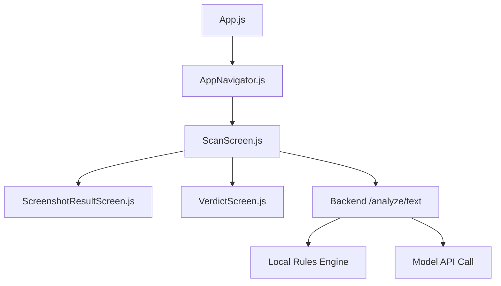
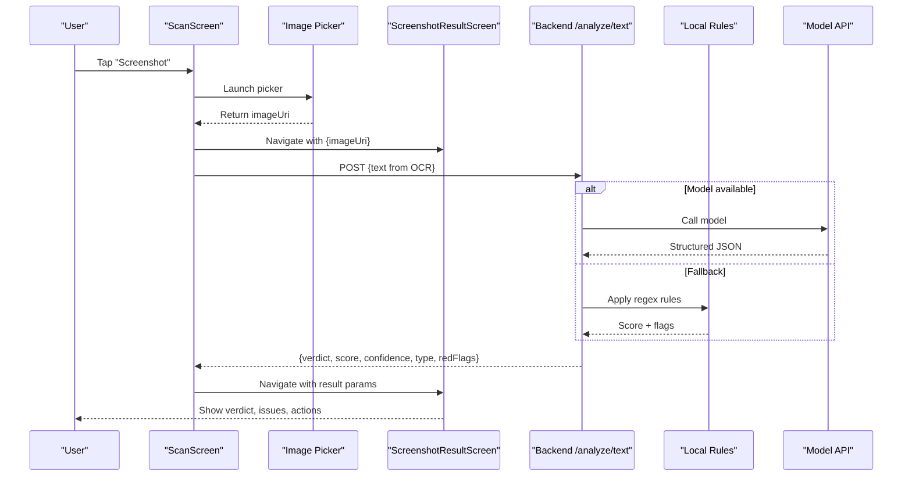
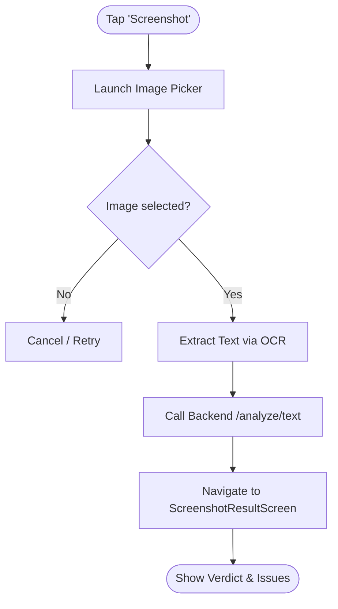
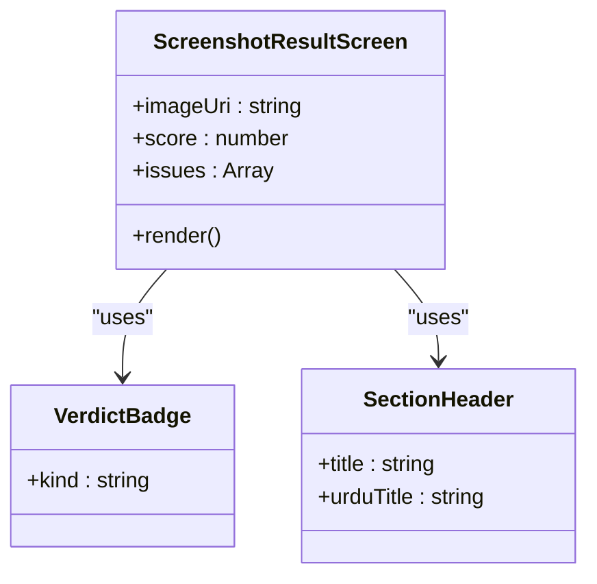
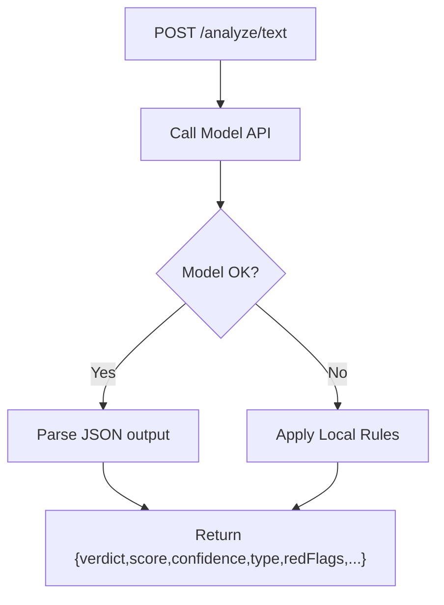
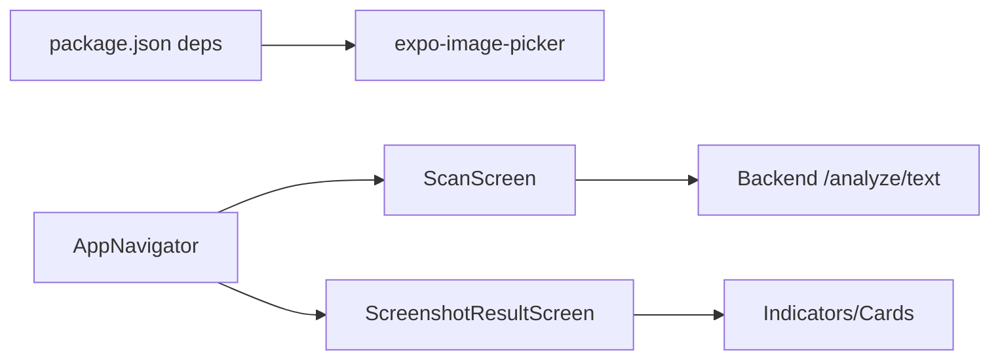

# Screenshot Scanning

<cite>
**Referenced Files in This Document**
- [App.js](file://App.js)
- [package.json](file://package.json)
- [src/navigation/AppNavigator.js](file://src/navigation/AppNavigator.js)
- [src/screens/ScanScreen.js](file://src/screens/ScanScreen.js)
- [src/screens/ScreenshotResultScreen.js](file://src/screens/ScreenshotResultScreen.js)
- [src/screens/VerdictScreen.js](file://src/screens/VerdictScreen.js)
- [backend/index.js](file://backend/index.js)
- [README.md](file://README.md)
</cite>

## Table of Contents
1. Introduction
2. Project Structure
3. Core Components
4. Architecture Overview
5. Detailed Component Analysis
6. Dependency Analysis
7. Performance Considerations
8. Troubleshooting Guide
9. Conclusion
10. Appendices

## Introduction
This document explains the screenshot scanning capability in Safe Pakistan’s threat detection system. It covers how users capture or upload screenshots of suspicious messages, emails, or social media posts; how the app integrates OCR to extract text from images; and how visual threat detection algorithms identify scam indicators such as fake logos, misleading URLs, and suspicious payment requests. It also documents the image preprocessing pipeline (quality enhancement, text extraction, metadata analysis), implementation details for handling different image formats and resolutions, storage management, example scenarios, and privacy considerations.

## Project Structure
The screenshot scanning feature spans UI screens, navigation, and a backend service:
- App entry mounts the navigator that includes the Scan flow and Screenshot Result screen.
- The Scan screen provides a “Screenshot” chip to launch image picking.
- The Screenshot Result screen displays the analyzed image, verdict, threat score, and detected issues.
- The backend exposes an analysis endpoint with rule-based and model-based scoring.

**Diagram sources**
- [App.js:21-43](file://App.js#L21-L43)
- [src/navigation/AppNavigator.js:80-101](file://src/navigation/AppNavigator.js#L80-L101)
- [src/screens/ScanScreen.js:15-23](file://src/screens/ScanScreen.js#L15-L23)
- [src/screens/ScreenshotResultScreen.js:21-25](file://src/screens/ScreenshotResultScreen.js#L21-L25)
- [backend/index.js:63-70](file://backend/index.js#L63-L70)

**Section sources**
- [App.js:21-43](file://App.js#L21-L43)
- [src/navigation/AppNavigator.js:80-101](file://src/navigation/AppNavigator.js#L80-L101)
- [src/screens/ScanScreen.js:15-23](file://src/screens/ScanScreen.js#L15-L23)
- [src/screens/ScreenshotResultScreen.js:21-25](file://src/screens/ScreenshotResultScreen.js#L21-L25)
- [backend/index.js:63-70](file://backend/index.js#L63-L70)

## Core Components
- ScanScreen: Entry point for scanning. Includes a “Screenshot” chip to pick images and a “Jaanch Karein” button to analyze content. Currently navigates to Verdict with placeholder data.
- ScreenshotResultScreen: Displays the picked image thumbnail, verdict badge, threat score, and list of detected issues. Expects route params including imageUri, score, and issues.
- VerdictScreen: Shows detailed results for both scam and safe outcomes, including animated ring and action sheet.
- Backend (/analyze/text): Accepts text input, runs local rules and/or model calls, and returns structured verdict, score, confidence, type, red flags, and explanations.

Key integration points:
- expo-image-picker is listed as a dependency and documented in README as required to enable screenshot picking from ScanScreen.
- ScreenshotResultScreen expects imageUri passed via route.params.imageUri.
- Backend supports JSON responses with fields used by UI components.

**Section sources**
- [src/screens/ScanScreen.js:15-55](file://src/screens/ScanScreen.js#L15-L55)
- [src/screens/ScreenshotResultScreen.js:15-25](file://src/screens/ScreenshotResultScreen.js#L15-L25)
- [src/screens/VerdictScreen.js:19-24](file://src/screens/VerdictScreen.js#L19-L24)
- [backend/index.js:63-70](file://backend/index.js#L63-L70)
- [README.md:252-263](file://README.md#L252-L263)
- [package.json:11-20](file://package.json#L11-L20)

## Architecture Overview
The screenshot scanning workflow involves three layers:
- Frontend UI: User picks a screenshot via expo-image-picker (to be wired into ScanScreen).
- Preprocessing and OCR: Extract text from the image using an OCR library (e.g., react-native-tesseract-ocr or ML Kit) and optionally analyze image metadata.
- Threat Detection: Send extracted text to the backend /analyze/text endpoint. The backend applies local rules and/or model inference to produce a verdict, risk score, confidence, and evidence.

**Diagram sources**
- [src/screens/ScanScreen.js:15-23](file://src/screens/ScanScreen.js#L15-L23)
- [src/screens/ScreenshotResultScreen.js:21-25](file://src/screens/ScreenshotResultScreen.js#L21-L25)
- [backend/index.js:63-70](file://backend/index.js#L63-L70)
- [README.md:252-263](file://README.md#L252-L263)

## Detailed Component Analysis

### ScanScreen — Screenshot Capture and Upload
- Purpose: Provide a user-friendly interface to paste/type SMS or capture/upload a screenshot for analysis.
- Current state: Contains a “Screenshot” chip but does not yet implement image picking. Navigation to Verdict is stubbed with placeholder data.
- Integration plan:
  - Add expo-image-picker usage to launch the gallery/camera when the “Screenshot” chip is pressed.
  - On success, navigate to ScreenshotResultScreen with imageUri and trigger OCR + analysis.
  - Wire the analyze function to call the backend /analyze/text with OCR-extracted text.

**Diagram sources**
- [src/screens/ScanScreen.js:15-55](file://src/screens/ScanScreen.js#L15-L55)
- [README.md:252-263](file://README.md#L252-L263)

**Section sources**
- [src/screens/ScanScreen.js:15-55](file://src/screens/ScanScreen.js#L15-L55)
- [README.md:252-263](file://README.md#L252-L263)

### ScreenshotResultScreen — Result Display
- Purpose: Present the analyzed screenshot with verdict, threat score, and detected issues.
- Inputs: route.params.imageUri, score, issues.
- Behavior: Renders a thumbnail of the image, verdict badge, meta chips (threat score, issue count), and a list of issues with descriptions. Provides actions like “Block Sender” and “Rescan”.

**Diagram sources**
- [src/screens/ScreenshotResultScreen.js:15-25](file://src/screens/ScreenshotResultScreen.js#L15-L25)
- [src/components/Indicators.js:10-27](file://src/components/Indicators.js#L10-L27)
- [src/components/Cards.js:28-45](file://src/components/Cards.js#L28-L45)

**Section sources**
- [src/screens/ScreenshotResultScreen.js:15-25](file://src/screens/ScreenshotResultScreen.js#L15-L25)
- [src/components/Indicators.js:10-27](file://src/components/Indicators.js#L10-L27)
- [src/components/Cards.js:28-45](file://src/components/Cards.js#L28-L45)

### Backend — Threat Detection Logic
- Endpoint: POST /analyze/text
- Input: JSON with text field.
- Processing:
  - Attempt model call with configured model(s).
  - If model fails, fallback to local rules engine based on regex patterns.
- Output: Structured JSON with verdict, score, confidence, type, redFlags, and multilingual explanations.

**Diagram sources**
- [backend/index.js:16-43](file://backend/index.js#L16-L43)
- [backend/index.js:45-61](file://backend/index.js#L45-L61)
- [backend/index.js:63-70](file://backend/index.js#L63-L70)

**Section sources**
- [backend/index.js:16-43](file://backend/index.js#L16-L43)
- [backend/index.js:45-61](file://backend/index.js#L45-L61)
- [backend/index.js:63-70](file://backend/index.js#L63-L70)

### VerdictScreen — Results Presentation
- Purpose: Unified screen for SCAM and SAFE outcomes with animated ring and contextual actions.
- Inputs: route.params.verdict, score, confidence, type.
- Behavior: Displays verdict band, threat ring, confidence, type chips, and actionable bottom sheet (block sender, report, family notify).

**Section sources**
- [src/screens/VerdictScreen.js:19-24](file://src/screens/VerdictScreen.js#L19-L24)
- [src/screens/VerdictScreen.js:35-115](file://src/screens/VerdictScreen.js#L35-L115)

## Dependency Analysis
- Dependencies relevant to screenshot scanning:
  - expo-image-picker: Required to enable image picking from ScanScreen.
  - React Navigation: Routes include Scan, ScreenshotResult, and Verdict.
  - Backend: Express server exposing /analyze/text for threat analysis.
- Coupling:
  - ScanScreen depends on navigation and will depend on image picker once integrated.
  - ScreenshotResultScreen depends on route params for imageUri and analysis results.
  - Backend is decoupled and can be swapped or extended without changing UI contracts.

**Diagram sources**
- [package.json:11-20](file://package.json#L11-L20)
- [src/navigation/AppNavigator.js:80-101](file://src/navigation/AppNavigator.js#L80-L101)
- [src/screens/ScanScreen.js:15-23](file://src/screens/ScanScreen.js#L15-L23)
- [src/screens/ScreenshotResultScreen.js:21-25](file://src/screens/ScreenshotResultScreen.js#L21-L25)
- [backend/index.js:63-70](file://backend/index.js#L63-L70)

**Section sources**
- [package.json:11-20](file://package.json#L11-L20)
- [src/navigation/AppNavigator.js:80-101](file://src/navigation/AppNavigator.js#L80-L101)
- [src/screens/ScanScreen.js:15-23](file://src/screens/ScanScreen.js#L15-L23)
- [src/screens/ScreenshotResultScreen.js:21-25](file://src/screens/ScreenshotResultScreen.js#L21-L25)
- [backend/index.js:63-70](file://backend/index.js#L63-L70)

## Performance Considerations
- Image size and resolution:
  - Compress images before OCR to reduce memory and processing time.
  - Limit maximum dimensions (e.g., 1920px width) while preserving legibility.
- OCR performance:
  - Use efficient OCR libraries optimized for mobile (e.g., ML Kit or Tesseract with prebuilt binaries).
  - Cache OCR results per image URI to avoid reprocessing identical screenshots.
- Backend latency:
  - Implement timeouts and retries for model calls.
  - Prefer local rules for quick triage; escalate to model only when needed.
- UI responsiveness:
  - Show loading states during OCR and analysis.
  - Defer heavy operations off the main thread where possible.

[No sources needed since this section provides general guidance]

## Troubleshooting Guide
Common issues and resolutions:
- Image picker not launching:
  - Ensure permissions are granted and expo-image-picker is properly configured.
  - Verify that the “Screenshot” chip triggers the picker in ScanScreen.
- Missing imageUri in ScreenshotResultScreen:
  - Confirm navigation passes imageUri in route.params.
  - Validate that the picker callback returns a valid URI.
- OCR failures:
  - Check language models and ensure they are installed/configured.
  - Handle errors gracefully and allow retry.
- Backend errors:
  - Inspect network logs and error responses from /analyze/text.
  - Fall back to local rules if model calls fail.

**Section sources**
- [src/screens/ScanScreen.js:15-23](file://src/screens/ScanScreen.js#L15-L23)
- [src/screens/ScreenshotResultScreen.js:21-25](file://src/screens/ScreenshotResultScreen.js#L21-L25)
- [backend/index.js:63-70](file://backend/index.js#L63-L70)
- [README.md:252-263](file://README.md#L252-L263)

## Conclusion
Safe Pakistan’s screenshot scanning capability is designed around a clear UI flow, robust backend analysis, and extensible preprocessing. While the current codebase provides the scaffolding for screenshot capture and result display, integrating expo-image-picker and OCR will complete the pipeline. The backend’s hybrid approach (model + local rules) ensures reliability and speed. With proper image handling, privacy safeguards, and performance optimizations, the system can effectively detect scams in screenshots of messages, emails, and social media posts.

[No sources needed since this section summarizes without analyzing specific files]

## Appendices

### Image Preprocessing Pipeline
- Quality enhancement:
  - Auto-crop and deskew to improve text alignment.
  - Adjust brightness/contrast for low-light screenshots.
- Text extraction (OCR):
  - Detect language (English, Urdu, Roman Urdu) and select appropriate OCR model.
  - Post-process text to normalize spacing and remove artifacts.
- Metadata analysis:
  - Extract timestamp, device info, and file origin to aid context.
  - Flag anomalies (e.g., mismatched timestamps vs. message logs).

[No sources needed since this section provides general guidance]

### Visual Threat Detection Algorithms
- Logo verification:
  - Compare embedded logos against known official templates using template matching or feature descriptors.
- URL validation:
  - Extract URLs and check for typosquatting, shortened links, or non-HTTPS schemes.
- Payment request detection:
  - Identify keywords and patterns indicating urgent payment requests or OTP/PIN demands.
- Layout consistency:
  - Detect deviations from official app layouts (fonts, button styles, spacing).

[No sources needed since this section provides general guidance]

### Example Scenarios
- Fake bank statements:
  - OCR extracts account numbers and amounts; rules flag inconsistencies with known bank formats.
- Counterfeit receipts:
  - Logo and layout checks reveal mismatches; metadata shows altered creation dates.
- Fraudulent investment schemes:
  - Keywords like “guaranteed returns,” “limited offer,” combined with urgency cues increase risk score.

[No sources needed since this section provides general guidance]

### Privacy and Data Retention
- Consent:
  - Obtain explicit consent before capturing or uploading screenshots.
- Minimization:
  - Process images locally when possible; send only necessary text to backend.
- Retention:
  - Delete raw images after analysis unless user opts to keep them.
  - Anonymize metadata before storage or transmission.
- Security:
  - Encrypt data in transit and at rest.
  - Provide users controls to view, export, or delete their scan history.

[No sources needed since this section provides general guidance]