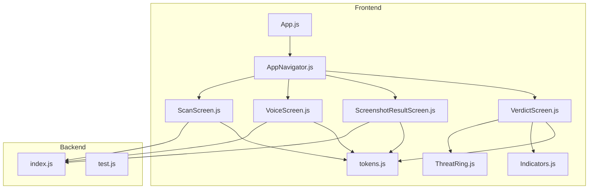
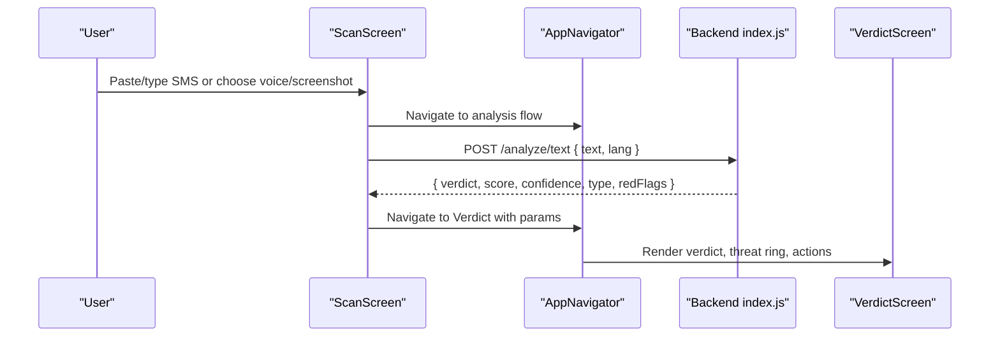
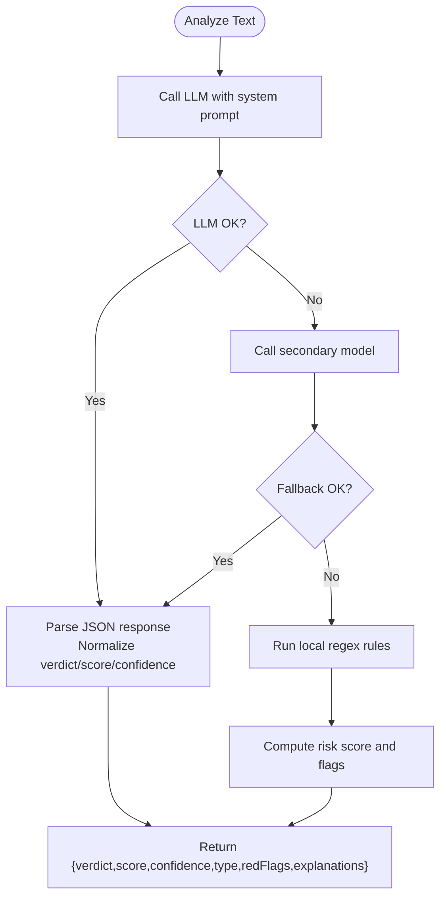
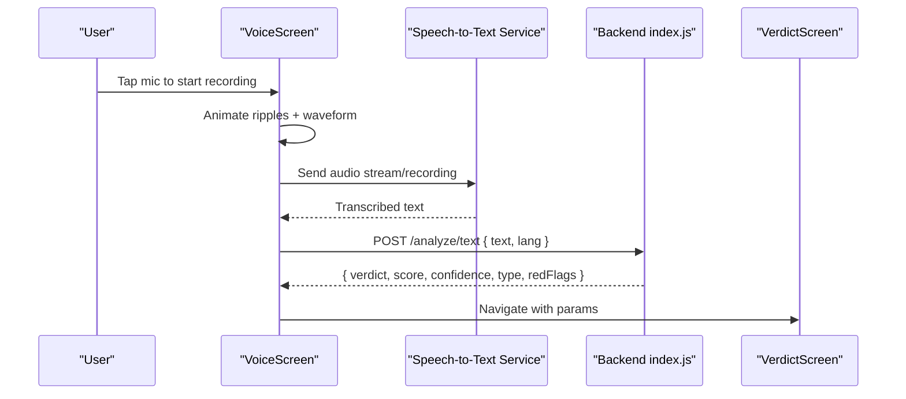
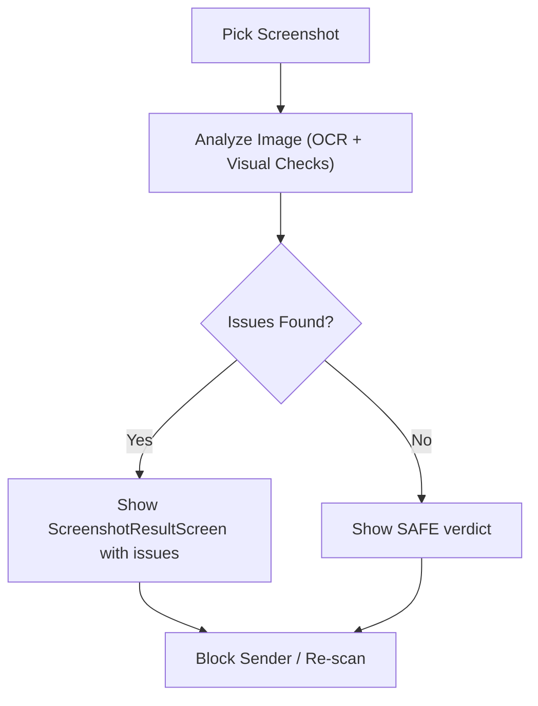
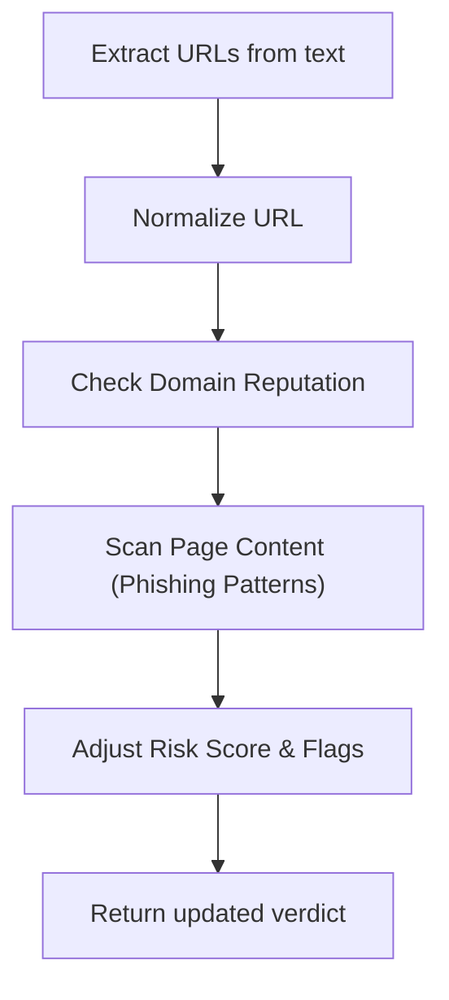
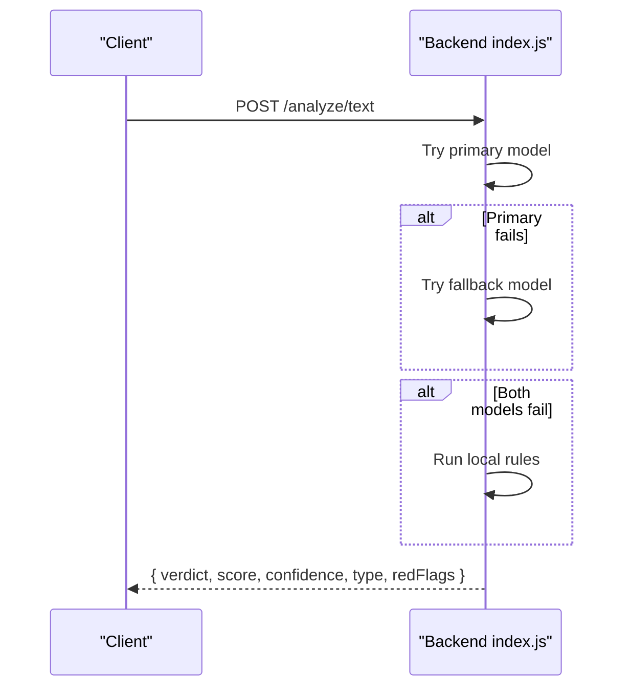
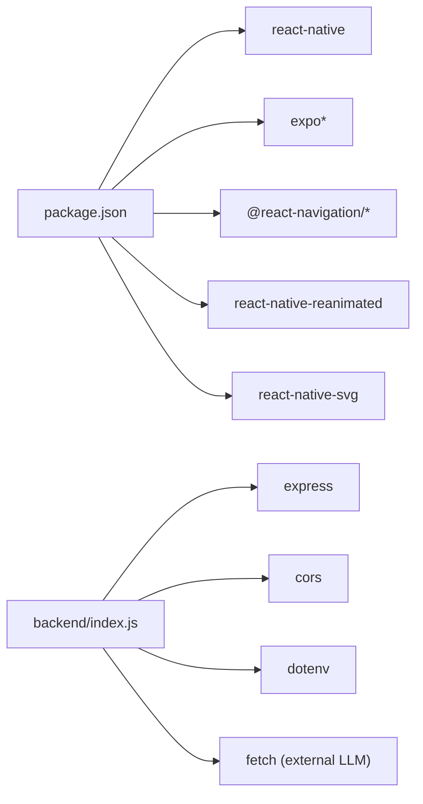

# Threat Detection System

<cite>
**Referenced Files in This Document**
- [README.md](file://README.md)
- [App.js](file://App.js)
- [package.json](file://package.json)
- [DESIGN_RULES.md](file://DESIGN_RULES.md)
- [backend/index.js](file://backend/index.js)
- [backend/test.js](file://backend/test.js)
- [src/navigation/AppNavigator.js](file://src/navigation/AppNavigator.js)
- [src/screens/ScanScreen.js](file://src/screens/ScanScreen.js)
- [src/screens/VoiceScreen.js](file://src/screens/VoiceScreen.js)
- [src/screens/ScreenshotResultScreen.js](file://src/screens/ScreenshotResultScreen.js)
- [src/screens/VerdictScreen.js](file://src/screens/VerdictScreen.js)
- [src/components/ThreatRing.js](file://src/components/ThreatRing.js)
- [src/components/Indicators.js](file://src/components/Indicators.js)
- [src/theme/tokens.js](file://src/theme/tokens.js)
</cite>

## Table of Contents
1. [Introduction](#introduction)
2. [Project Structure](#project-structure)
3. [Core Components](#core-components)
4. [Architecture Overview](#architecture-overview)
5. [Detailed Component Analysis](#detailed-component-analysis)
6. [Dependency Analysis](#dependency-analysis)
7. [Performance Considerations](#performance-considerations)
8. [Troubleshooting Guide](#troubleshooting-guide)
9. [Conclusion](#conclusion)
10. [Appendices](#appendices)

## Introduction
This document describes Safe Pakistan’s multi-modal threat detection system implemented as a React Native (Expo) application with a Node.js backend. The system analyzes SMS text, captures voice input, scans screenshots for visual threats, and verifies links through domain reputation and content scanning via a backend AI engine. It provides real-time user feedback through animated verdicts, evidence chips, and actionable next steps such as blocking senders or reporting to authorities.

The implementation integrates:
- Text analysis with pattern matching and AI-driven scoring
- Voice recording UI with waveform visualization and speech-to-text integration points
- Screenshot scanning result display with issue enumeration
- Backend API endpoints that call an LLM service and fall back to local rule-based detection
- A consistent design system and navigation structure across screens

**Section sources**
- [README.md:1-279](file://README.md#L1-L279)
- [DESIGN_RULES.md:1-204](file://DESIGN_RULES.md#L1-L204)

## Project Structure
The project is organized into:
- Frontend screens for each modality (SMS, voice, screenshot)
- Shared components for indicators and visualizations
- Navigation configuration defining routes and transitions
- Theme tokens ensuring consistent visuals
- Backend server exposing analysis endpoints and helper services

**Diagram sources**
- [App.js:1-44](file://App.js#L1-L44)
- [src/navigation/AppNavigator.js:1-121](file://src/navigation/AppNavigator.js#L1-L121)
- [src/screens/ScanScreen.js:1-151](file://src/screens/ScanScreen.js#L1-L151)
- [src/screens/VoiceScreen.js:1-228](file://src/screens/VoiceScreen.js#L1-L228)
- [src/screens/ScreenshotResultScreen.js:1-152](file://src/screens/ScreenshotResultScreen.js#L1-L152)
- [src/screens/VerdictScreen.js:1-268](file://src/screens/VerdictScreen.js#L1-L268)
- [src/components/ThreatRing.js:1-92](file://src/components/ThreatRing.js#L1-L92)
- [src/components/Indicators.js:1-106](file://src/components/Indicators.js#L1-L106)
- [src/theme/tokens.js:1-129](file://src/theme/tokens.js#L1-L129)
- [backend/index.js:1-82](file://backend/index.js#L1-L82)
- [backend/test.js:1-8](file://backend/test.js#L1-L8)

**Section sources**
- [App.js:1-44](file://App.js#L1-L44)
- [src/navigation/AppNavigator.js:1-121](file://src/navigation/AppNavigator.js#L1-L121)
- [package.json:1-41](file://package.json#L1-L41)

## Core Components
- ScanScreen: Accepts SMS text input, offers screenshot capture and voice input entry points, and triggers analysis flow.
- VoiceScreen: Full-screen voice interaction with animated mic ripples, language selection, and waveform visualization; integrates with speech-to-text and audio recording libraries.
- ScreenshotResultScreen: Displays screenshot analysis results including thumbnail, verdict, threat score, and enumerated issues.
- VerdictScreen: Presents final verdict (scam/safe), threat ring animation, confidence, type, evidence chips, and action buttons (block, report, notify family).
- ThreatRing: Animated SVG progress ring indicating threat score.
- Indicators: Reusable badges, status pills, scam type chips, and agent status dots used across screens.
- Theme tokens: Centralized colors, fonts, spacing, shadows, gradients, and motion timings.

**Section sources**
- [src/screens/ScanScreen.js:1-151](file://src/screens/ScanScreen.js#L1-L151)
- [src/screens/VoiceScreen.js:1-228](file://src/screens/VoiceScreen.js#L1-L228)
- [src/screens/ScreenshotResultScreen.js:1-152](file://src/screens/ScreenshotResultScreen.js#L1-L152)
- [src/screens/VerdictScreen.js:1-268](file://src/screens/VerdictScreen.js#L1-L268)
- [src/components/ThreatRing.js:1-92](file://src/components/ThreatRing.js#L1-L92)
- [src/components/Indicators.js:1-106](file://src/components/Indicators.js#L1-L106)
- [src/theme/tokens.js:1-129](file://src/theme/tokens.js#L1-L129)

## Architecture Overview
The system follows a client-server architecture:
- Client screens collect inputs (text, voice, images) and navigate to a verdict screen after analysis.
- Backend exposes endpoints to analyze text and provide fallback logic when AI calls fail.
- Design system ensures consistent UI behavior and accessibility.

**Diagram sources**
- [src/screens/ScanScreen.js:1-151](file://src/screens/ScanScreen.js#L1-L151)
- [src/navigation/AppNavigator.js:1-121](file://src/navigation/AppNavigator.js#L1-L121)
- [backend/index.js:1-82](file://backend/index.js#L1-L82)
- [src/screens/VerdictScreen.js:1-268](file://src/screens/VerdictScreen.js#L1-L268)

## Detailed Component Analysis

### SMS Message Analysis (Text Input Handling, Pattern Matching, Scam Detection)
- Input handling: ScanScreen provides a multiline text input for pasting or typing messages, with options to capture screenshots or use voice input.
- Backend analysis: The backend endpoint processes text using an LLM service with a system prompt tailored to detect Pakistani scams (OTP/PIN/CNIC requests, urgency cues, prize scams, official transactional checks). If the primary model fails, it falls back to a secondary model and finally to local rules.
- Local rules: Regex-based scoring identifies high-risk patterns (e.g., OTP/PIN/password/CVV, account block warnings, urgency words, prizes/bonuses, CNIC/shanakht, verification links). Scores are capped at 100 and mapped to verdicts (scam ≥75, suspicious ≥40, safe otherwise).
- Evidence and explanation: The backend returns red flags (trigger words), explanations in multiple languages, and normalized verdicts.

**Diagram sources**
- [backend/index.js:16-70](file://backend/index.js#L16-L70)

**Section sources**
- [src/screens/ScanScreen.js:1-151](file://src/screens/ScanScreen.js#L1-L151)
- [backend/index.js:16-70](file://backend/index.js#L16-L70)
- [README.md:186-201](file://README.md#L186-L201)

### Voice Call Recording (Audio Capture, Waveform Visualization, Speech-to-Text Processing, Audio-Based Threat Detection)
- Voice interface: VoiceScreen presents a full-screen microphone with animated ripples, state labels (idle/listening/processing/done), language chips, and hints for queries.
- Waveform visualization: Uses Reanimated shared values to animate bar heights; currently mocked but designed to be wired to real audio level callbacks from recording APIs.
- Integration points: The README notes replacing mock waveform bars with values from audio recording status updates and integrating speech-to-text backend.
- Threat detection: After transcription, the same text analysis pipeline can be applied to voice-derived text.

**Diagram sources**
- [src/screens/VoiceScreen.js:1-228](file://src/screens/VoiceScreen.js#L1-L228)
- [backend/index.js:63-70](file://backend/index.js#L63-L70)
- [README.md:167-170](file://README.md#L167-L170)

**Section sources**
- [src/screens/VoiceScreen.js:1-228](file://src/screens/VoiceScreen.js#L1-L228)
- [README.md:167-170](file://README.md#L167-L170)

### Screenshot Scanning (Visual Threat Detection Using Image Analysis and OCR)
- Result view: ScreenshotResultScreen displays the captured image thumbnail, verdict badge, threat score, number of issues, and detailed issue descriptions.
- Issue enumeration: Predefined issues include wrong sender shortcode, mismatched timestamp, and non-official layout mismatches.
- Integration points: The README indicates adding image picker to launch screenshot capture from ScanScreen and passing image URI to this result screen.

**Diagram sources**
- [src/screens/ScreenshotResultScreen.js:1-152](file://src/screens/ScreenshotResultScreen.js#L1-L152)
- [README.md:259-263](file://README.md#L259-L263)

**Section sources**
- [src/screens/ScreenshotResultScreen.js:1-152](file://src/screens/ScreenshotResultScreen.js#L1-L152)
- [README.md:259-263](file://README.md#L259-L263)

### Link Verification Service (Domain Reputation Analysis and Content Scanning)
- Current state: No dedicated link verification endpoint exists in the backend. However, text analysis includes link-related pattern detection (e.g., verify/update/click/http/link) which contributes to risk scoring.
- Recommended integration: Add a URL normalization step, domain reputation lookup, and content scanning before returning verdicts for messages containing links.

[No diagram sources since this section proposes conceptual integration not present in code]

**Section sources**
- [backend/index.js:45-61](file://backend/index.js#L45-L61)

### Implementation Details: API Integration Patterns, Error Handling Strategies, UI Flows
- API integration:
  - Text analysis endpoint: POST /analyze/text with JSON body containing text and language.
  - Family pairing and alerts endpoints exist for future features.
- Error handling:
  - Backend tries primary model, then fallback model, then local rules if both fail.
  - Errors are logged and handled gracefully by falling back to deterministic rules.
- UI flows:
  - ScanScreen collects input and navigates to VerdictScreen with analysis results.
  - VerdictScreen animates band entrance, renders threat ring, shows confidence and type, and provides action buttons.

**Diagram sources**
- [backend/index.js:63-70](file://backend/index.js#L63-L70)

**Section sources**
- [backend/index.js:1-82](file://backend/index.js#L1-L82)
- [src/screens/ScanScreen.js:1-151](file://src/screens/ScanScreen.js#L1-L151)
- [src/screens/VerdictScreen.js:1-268](file://src/screens/VerdictScreen.js#L1-L268)

## Dependency Analysis
Key dependencies:
- Expo SDK and related packages for media, fonts, animations, and navigation.
- React Navigation for routing between screens.
- Reanimated for smooth animations (threat ring, waveform, ripples).
- Backend uses Express, CORS, dotenv, and fetch to call external LLM service.

**Diagram sources**
- [package.json:1-41](file://package.json#L1-L41)
- [backend/index.js:1-12](file://backend/index.js#L1-L12)

**Section sources**
- [package.json:1-41](file://package.json#L1-L41)
- [backend/index.js:1-12](file://backend/index.js#L1-L12)

## Performance Considerations
- Real-time waveform: Replace mock waveform bars with live audio levels from recording callbacks to avoid unnecessary re-renders and ensure smooth animations.
- Animation efficiency: Use Reanimated shared values and animated props for performance-critical UI elements like threat rings and ripples.
- Network latency: Implement loading states and optimistic UI where appropriate; cache recent analyses to reduce redundant calls.
- Model fallback: Ensure fast fallback to local rules when AI services are slow or unavailable to maintain responsiveness.
- Memory management: Limit image sizes and avoid holding large buffers during voice recording.

[No sources needed since this section provides general guidance]

## Troubleshooting Guide
Common issues and resolutions:
- Backend errors: Check logs for model failures; verify environment variables for base URL and API key; ensure CORS allows frontend origin.
- Missing JSON output: Validate LLM response parsing; add robust extraction and error handling for malformed outputs.
- Voice waveform not updating: Wire actual metering values from audio recording status updates to shared values driving bar heights.
- Screenshot not displaying: Ensure image picker is integrated and imageUri is passed correctly to ScreenshotResultScreen.
- Navigation issues: Confirm routes are registered in AppNavigator and parameters are passed correctly between screens.

**Section sources**
- [backend/index.js:16-70](file://backend/index.js#L16-L70)
- [src/screens/VoiceScreen.js:156-185](file://src/screens/VoiceScreen.js#L156-L185)
- [src/screens/ScreenshotResultScreen.js:21-48](file://src/screens/ScreenshotResultScreen.js#L21-L48)
- [src/navigation/AppNavigator.js:80-101](file://src/navigation/AppNavigator.js#L80-L101)

## Conclusion
Safe Pakistan’s threat detection system combines text, voice, and visual modalities with a resilient backend that leverages AI and deterministic rules. The UI provides clear, accessible feedback with animated verdicts and actionable steps. Future enhancements include deep link support for family invites, dark mode theming, and advanced link verification with domain reputation and content scanning.

[No sources needed since this section summarizes without analyzing specific files]

## Appendices

### Example Scam Patterns Detected
- OTP/PIN/CVN/password requests
- Account block warnings
- Urgency cues (foran, turant, abhi, warna)
- Prize/lottery/Eidi/bonus/kupon mentions
- CNIC/shanakht requests
- Verification/update/click/http/link patterns

**Section sources**
- [backend/index.js:45-61](file://backend/index.js#L45-L61)

### Backend Test Endpoint
- Use test script to validate analysis endpoint locally.

**Section sources**
- [backend/test.js:1-8](file://backend/test.js#L1-L8)