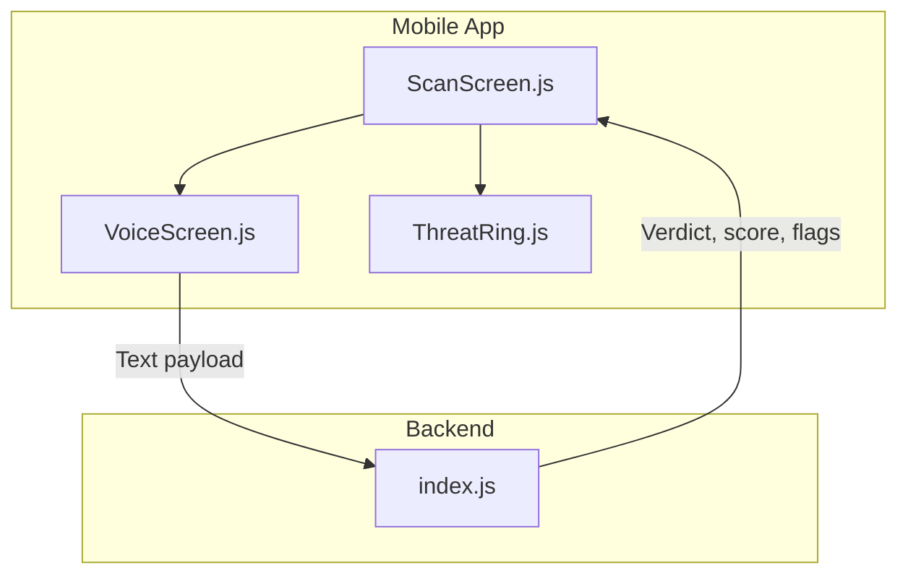
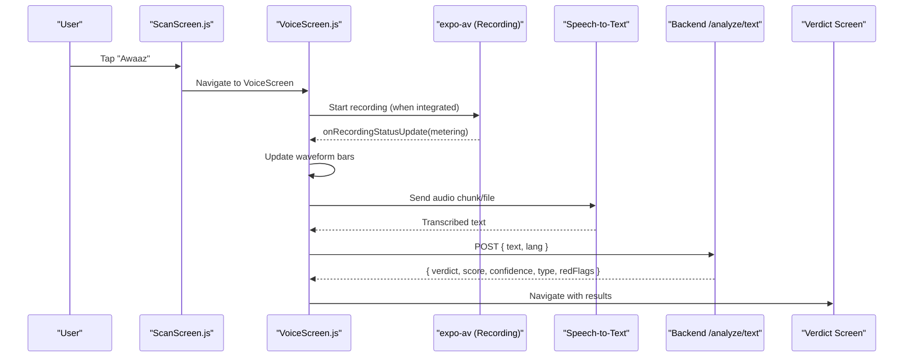
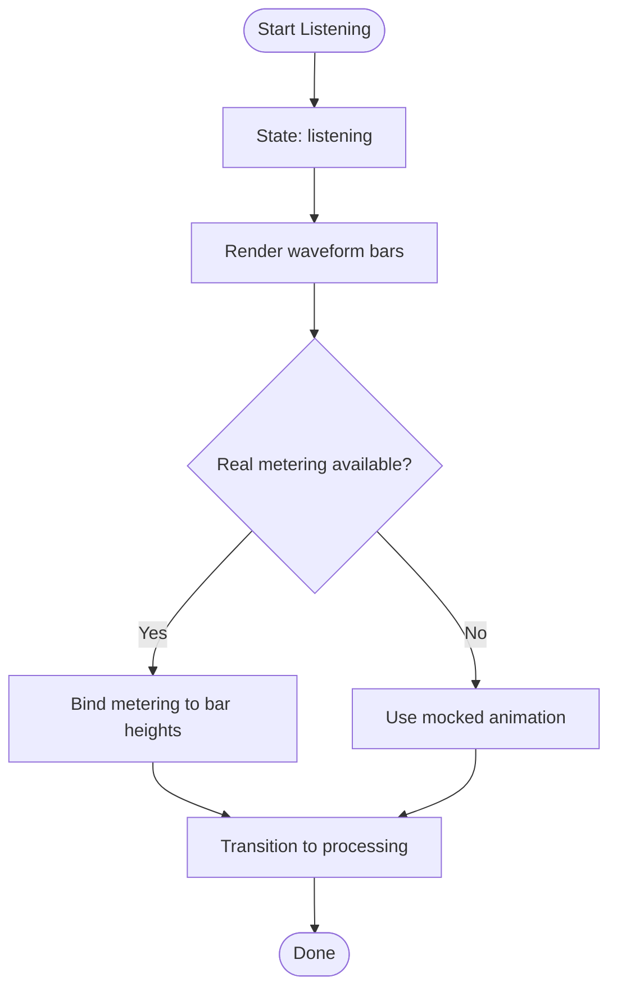
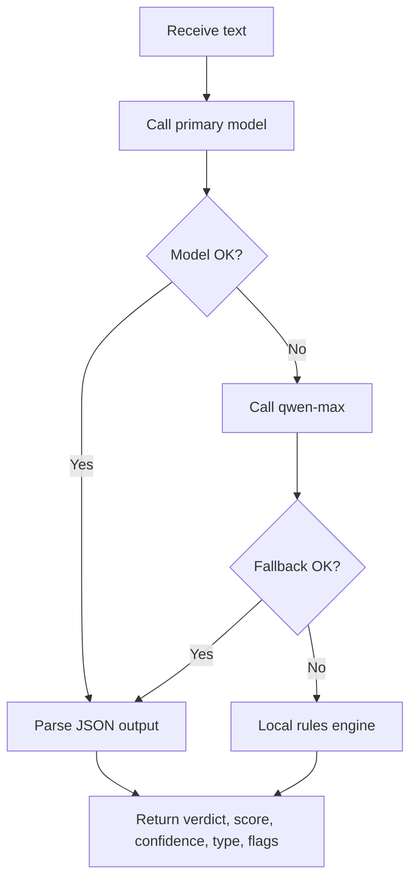
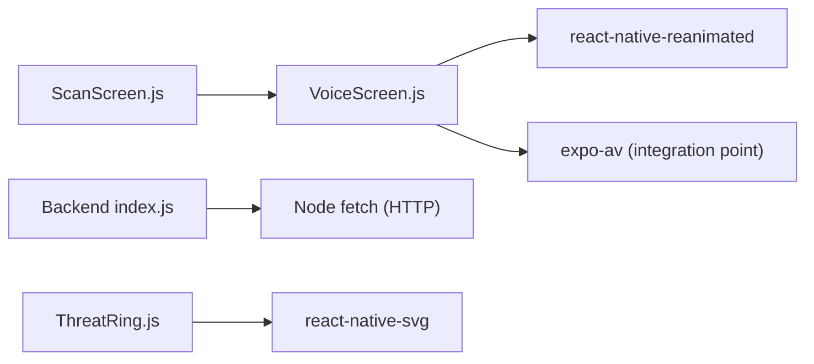

# Voice Recording & Analysis

<cite>
**Referenced Files in This Document**
- [VoiceScreen.js](file://src/screens/VoiceScreen.js)
- [ScanScreen.js](file://src/screens/ScanScreen.js)
- [index.js](file://backend/index.js)
- [package.json](file://package.json)
- [app.json](file://app.json)
- [README.md](file://README.md)
- [ThreatRing.js](file://src/components/ThreatRing.js)
</cite>

## Table of Contents
1. [Introduction](#introduction)
2. [Project Structure](#project-structure)
3. [Core Components](#core-components)
4. [Architecture Overview](#architecture-overview)
5. [Detailed Component Analysis](#detailed-component-analysis)
6. [Dependency Analysis](#dependency-analysis)
7. [Performance Considerations](#performance-considerations)
8. [Troubleshooting Guide](#troubleshooting-guide)
9. [Conclusion](#conclusion)
10. [Appendices](#appendices)

## Introduction
This document explains the voice recording and analysis feature in Safe Pakistan’s threat detection system. It covers:
- Audio capture using expo-av for recording voice calls and suspicious audio messages
- Real-time waveform visualization during recording sessions
- Speech-to-text processing pipeline to convert recorded audio into text
- Audio-based threat detection algorithms that identify suspicious voice patterns, automated call detection, and voice spoofing attempts
- Implementation details for audio file management, compression, and upload processes
- Examples of voice-based scam scenarios detected (impersonation calls, automated fraud scripts, voice phishing)
- Performance considerations for audio processing, memory management, and battery optimization during extended recordings

The current codebase provides a polished UI for voice interaction and a backend service for text-based threat analysis. The voice recording and waveform are present as a ready-to-integrate foundation with clear extension points for real audio capture and speech-to-text conversion.

## Project Structure
Safe Pakistan is an Expo-based React Native app with:
- A voice interface screen for hands-free input and feedback
- A scan entry point that routes to voice input
- A backend API that analyzes text content for scams and threats
- Shared components for visualizing threat scores and overlays

**Diagram sources**
- [ScanScreen.js:15-55](file://src/screens/ScanScreen.js#L15-L55)
- [VoiceScreen.js:27-98](file://src/screens/VoiceScreen.js#L27-L98)
- [index.js:63-70](file://backend/index.js#L63-L70)
- [ThreatRing.js:18-82](file://src/components/ThreatRing.js#L18-L82)

**Section sources**
- [ScanScreen.js:15-55](file://src/screens/ScanScreen.js#L15-L55)
- [VoiceScreen.js:27-98](file://src/screens/VoiceScreen.js#L27-L98)
- [index.js:63-70](file://backend/index.js#L63-L70)
- [ThreatRing.js:18-82](file://src/components/ThreatRing.js#L18-L82)

## Core Components
- VoiceScreen: Full-screen voice agent UI with animated mic ripples, language selection, state machine (idle/listening/processing/done), and a mocked waveform placeholder.
- ScanScreen: Entry point for SMS, screenshot, and voice inputs; navigates to VoiceScreen via a microphone chip.
- Backend index.js: Text analysis endpoint that uses a large language model with a safety-focused prompt and falls back to local rules when needed.
- ThreatRing: Animated SVG ring used to visualize threat scores on verdict screens.

Key integration notes:
- expo-av is declared as a dependency and plugin, enabling audio recording capabilities.
- The README documents how to wire real audio levels from expo-av to the waveform component.

**Section sources**
- [VoiceScreen.js:27-98](file://src/screens/VoiceScreen.js#L27-L98)
- [ScanScreen.js:15-55](file://src/screens/ScanScreen.js#L15-L55)
- [index.js:63-70](file://backend/index.js#L63-L70)
- [package.json:11-33](file://package.json#L11-L33)
- [app.json:29-33](file://app.json#L29-L33)
- [README.md:156-170](file://README.md#L156-L170)

## Architecture Overview
The voice workflow integrates UI, optional audio capture, speech-to-text, and backend analysis:

**Diagram sources**
- [ScanScreen.js:15-55](file://src/screens/ScanScreen.js#L15-L55)
- [VoiceScreen.js:27-98](file://src/screens/VoiceScreen.js#L27-L98)
- [index.js:63-70](file://backend/index.js#L63-L70)

## Detailed Component Analysis

### VoiceScreen: Voice Agent UI and Waveform
Responsibilities:
- Manage voice states: idle, listening, processing, done
- Provide language selection chips (English, Urdu, Roman Urdu)
- Render animated mic with ripple rings during listening
- Display a waveform visualization placeholder; the README specifies how to connect real audio metering from expo-av

Implementation highlights:
- State machine drives UI changes and animations
- Waveform uses react-native-reanimated shared values to animate bar heights
- The README explicitly instructs replacing the mocked waveform loop with real metering values from expo-av’s Audio.Recording onRecordingStatusUpdate callback

**Diagram sources**
- [VoiceScreen.js:27-98](file://src/screens/VoiceScreen.js#L27-L98)
- [VoiceScreen.js:156-185](file://src/screens/VoiceScreen.js#L156-L185)
- [README.md:156-170](file://README.md#L156-L170)

**Section sources**
- [VoiceScreen.js:27-98](file://src/screens/VoiceScreen.js#L27-L98)
- [VoiceScreen.js:156-185](file://src/screens/VoiceScreen.js#L156-L185)
- [README.md:156-170](file://README.md#L156-L170)

### ScanScreen: Voice Input Entry Point
Responsibilities:
- Accept SMS paste or screenshot input
- Provide a microphone chip that navigates to VoiceScreen
- Placeholder analyze flow that can be wired to backend services

Integration note:
- The microphone chip triggers navigation to the voice agent, enabling hands-free input.

**Section sources**
- [ScanScreen.js:15-55](file://src/screens/ScanScreen.js#L15-L55)

### Backend: Text-Based Threat Analysis
Responsibilities:
- Accept text payloads and return structured verdicts with risk scores, confidence, scam types, and evidence spans
- Use a system prompt tailored to Pakistani scam patterns (OTP, CNIC, BISP 8171, fake receipts, fake calls)
- Implement fallback logic to local rule-based detection if model calls fail

Analysis pipeline:
- Primary path: call configured model with safety-focused prompt
- Fallback path: use qwen-max model
- Last resort: on-device rule engine scoring keywords and urgency cues

**Diagram sources**
- [index.js:16-43](file://backend/index.js#L16-L43)
- [index.js:45-70](file://backend/index.js#L45-L70)

**Section sources**
- [index.js:16-43](file://backend/index.js#L16-L43)
- [index.js:45-70](file://backend/index.js#L45-L70)

### ThreatRing: Visualizing Risk Scores
Responsibilities:
- Animate a circular progress ring proportional to a risk score
- Provide a consistent visual indicator across verdict screens

Usage context:
- Displays threat scores derived from backend analysis results

**Section sources**
- [ThreatRing.js:18-82](file://src/components/ThreatRing.js#L18-L82)

## Dependency Analysis
External dependencies relevant to voice recording and analysis:
- expo-av: Audio recording and playback APIs
- expo-speech: Text-to-speech for feedback (optional)
- react-native-reanimated: Smooth animations for waveform and mic ripples
- react-native-svg: SVG rendering for ThreatRing

App configuration:
- expo-av is registered as a plugin in app.json
- Dependencies listed in package.json confirm availability

**Diagram sources**
- [package.json:11-33](file://package.json#L11-L33)
- [app.json:29-33](file://app.json#L29-L33)
- [VoiceScreen.js:13-16](file://src/screens/VoiceScreen.js#L13-L16)
- [ThreatRing.js:8-13](file://src/components/ThreatRing.js#L8-L13)

**Section sources**
- [package.json:11-33](file://package.json#L11-L33)
- [app.json:29-33](file://app.json#L29-L33)

## Performance Considerations
- Audio capture and streaming
  - Use expo-av’s Audio.Recording with appropriate sample rate and bit depth to balance quality and memory usage.
  - Stream short chunks to the speech-to-text service to reduce latency and memory pressure.
- Waveform updates
  - Bind metering values directly to reanimated shared values to avoid unnecessary React state churn.
  - Limit the number of bars and update frequency to maintain smooth 60fps visuals.
- Memory management
  - Dispose of recording instances promptly after transcription to free native resources.
  - Avoid retaining large buffers; process and discard audio data as soon as it is transcribed.
- Battery optimization
  - Pause or stop recording when the app is backgrounded.
  - Reduce update rates for waveform and analytics when not visible.
- Network resilience
  - Implement retries and timeouts for backend calls.
  - Cache recent transcripts locally to allow offline review and resubmission.

[No sources needed since this section provides general guidance]

## Troubleshooting Guide
Common issues and resolutions:
- No audio captured
  - Ensure expo-av permissions are granted on device.
  - Verify that recording starts and onRecordingStatusUpdate emits metering values.
- Waveform not updating
  - Confirm that metering values are bound to shared values in the waveform component.
  - Check that the recording session remains active while updating.
- Transcription failures
  - Validate network connectivity and retry failed requests.
  - Fall back to local rules if models are unavailable.
- High memory or battery drain
  - Reduce recording duration and chunk size.
  - Stop recording immediately after successful transcription.

**Section sources**
- [README.md:156-170](file://README.md#L156-L170)
- [index.js:63-70](file://backend/index.js#L63-L70)

## Conclusion
Safe Pakistan’s voice recording and analysis feature provides a robust foundation for hands-free threat detection:
- A polished UI with animated feedback and language support
- Clear extension points to integrate expo-av recording and speech-to-text
- A resilient backend analysis pipeline with model and rule-based fallbacks
- Visual indicators for risk scoring

Next steps include integrating real audio capture, wiring metering to the waveform, implementing speech-to-text, and adding audio file management and upload flows.

[No sources needed since this section summarizes without analyzing specific files]

## Appendices

### Audio Capture Integration Checklist
- Add expo-av recording initialization and permission handling
- Start recording on user action; update state to “listening”
- Bind onRecordingStatusUpdate metering to waveform bars
- On silence detection or user stop, finalize recording and send to speech-to-text
- Handle errors and cleanup recording resources

**Section sources**
- [README.md:156-170](file://README.md#L156-L170)
- [VoiceScreen.js:27-98](file://src/screens/VoiceScreen.js#L27-L98)

### Speech-to-Text Processing Pipeline
- Choose a reliable STT provider compatible with Urdu and English
- Segment audio into manageable chunks for faster transcription
- Normalize audio (noise reduction, volume normalization) before sending
- Combine partial results and post-process for punctuation and casing

[No sources needed since this section provides general guidance]

### Audio-Based Threat Detection Algorithms
- Pattern recognition for impersonation calls (e.g., bank or government officials requesting OTP/CNIC)
- Automated script detection (repetitive phrases, urgency cues like “foran,” “turant”)
- Voice spoofing indicators (background anomalies, synthetic voice artifacts)
- Combine keyword scoring with acoustic features for higher accuracy

[No sources needed since this section provides general guidance]

### Audio File Management, Compression, and Upload
- Store temporary recordings in secure cache directories
- Compress audio using efficient codecs (e.g., AAC) to reduce size
- Upload only necessary segments to minimize bandwidth
- Retain metadata (timestamp, language, transcript) for auditability

[No sources needed since this section provides general guidance]

### Example Scenarios Detected by Voice Analysis
- Impersonation calls claiming to be from banks or government agencies
- Automated fraud scripts offering prizes or bonuses requiring immediate action
- Voice phishing attempts asking for OTP, PIN, or CNIC over the phone

[No sources needed since this section provides general guidance]