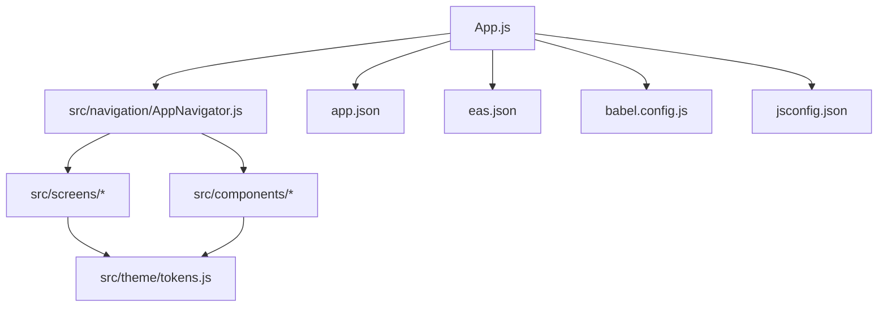
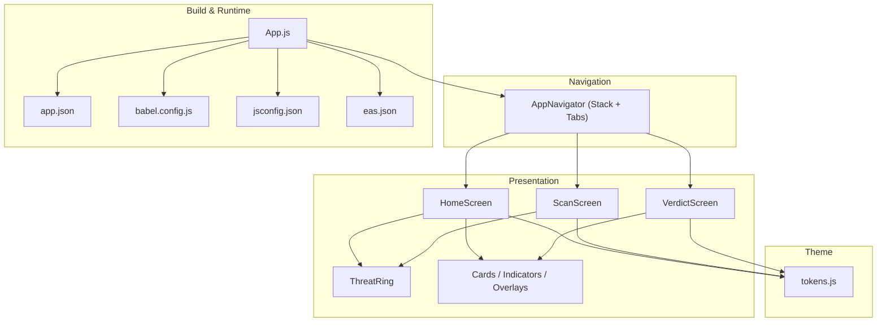
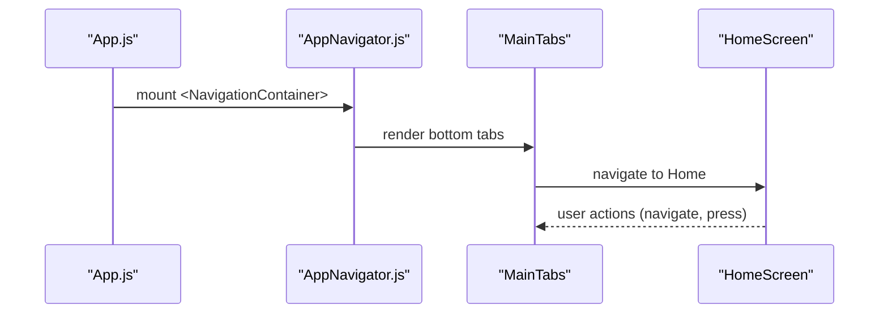
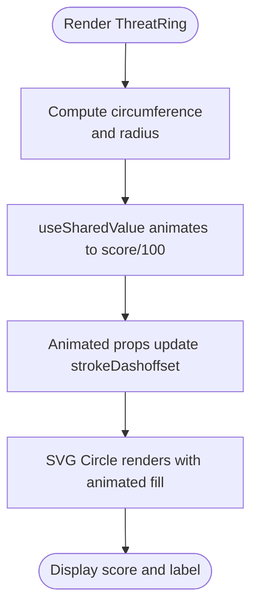
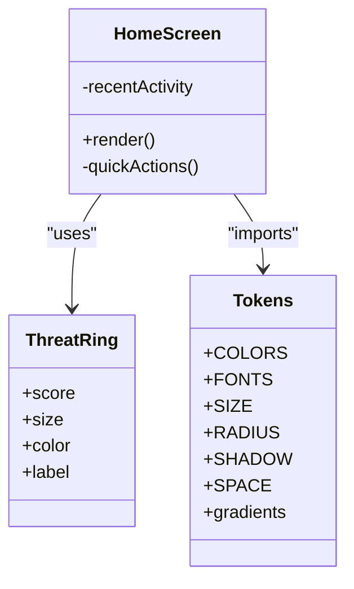
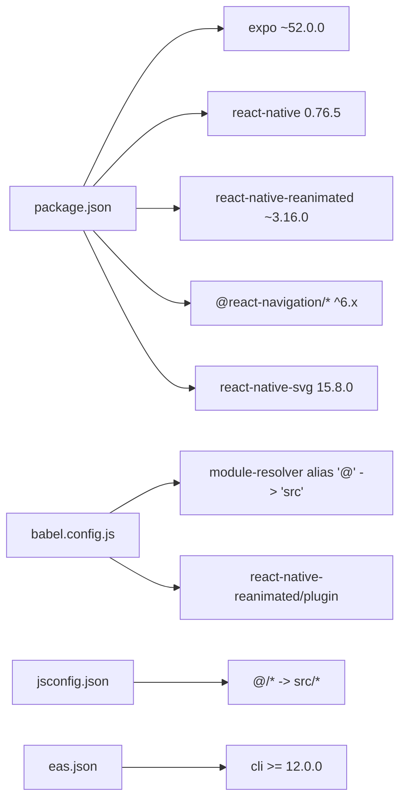

# Development Guide

<cite>
**Referenced Files in This Document**
- [package.json](file://package.json)
- [babel.config.js](file://babel.config.js)
- [jsconfig.json](file://jsconfig.json)
- [eas.json](file://eas.json)
- [app.json](file://app.json)
- [App.js](file://App.js)
- [src/navigation/AppNavigator.js](file://src/navigation/AppNavigator.js)
- [src/theme/tokens.js](file://src/theme/tokens.js)
- [src/components/ThreatRing.js](file://src/components/ThreatRing.js)
- [src/screens/HomeScreen.js](file://src/screens/HomeScreen.js)
- [README.md](file://README.md)
- [START-HERE.md](file://START-HERE.md)
- [DESIGN_RULES.md](file://DESIGN_RULES.md)
</cite>

## Table of Contents
1. Introduction
2. Project Structure
3. Core Components
4. Architecture Overview
5. Detailed Component Analysis
6. Dependency Analysis
7. Performance Considerations
8. Troubleshooting Guide
9. Conclusion
10. Appendices

## Introduction
This guide explains how to set up and develop the Safe Pakistan application using Expo SDK 52 with React Native. It covers environment setup, build configuration (Babel path aliases and Reanimated), IDE support via jsconfig.json, EAS cloud builds, code organization principles, adding screens and components, animations with Reanimated 3, backend integration points, testing strategies, debugging techniques, performance profiling, common workflows, and troubleshooting for build issues and platform-specific problems.

## Project Structure
Safe Pakistan is an Expo-based app organized by feature areas:
- App entry and navigation live at the root and under src/navigation
- Screens are grouped under src/screens
- Shared UI primitives and reusable widgets live under src/components
- Design tokens and typography live under src/theme
- Platform and build metadata are defined in app.json and eas.json
- Babel and IDE configs are at babel.config.js and jsconfig.json

**Diagram sources**
- [App.js:1-44](file://App.js#L1-L44)
- [src/navigation/AppNavigator.js:1-121](file://src/navigation/AppNavigator.js#L1-L121)
- [src/theme/tokens.js:1-129](file://src/theme/tokens.js#L1-L129)
- [app.json:1-36](file://app.json#L1-L36)
- [eas.json:1-14](file://eas.json#L1-L14)
- [babel.config.js:1-11](file://babel.config.js#L1-L11)
- [jsconfig.json:1-15](file://jsconfig.json#L1-L15)

**Section sources**
- [README.md:12-46](file://README.md#L12-L46)
- [START-HERE.md:1-26](file://START-HERE.md#L1-L26)

## Core Components
- App entry loads fonts and mounts the navigator inside a safe area provider.
- Navigation uses React Navigation v6 with a native stack and a bottom tab navigator for main flows.
- Theme tokens centralize colors, fonts, spacing, radius, shadows, gradients, and motion timings.
- Reusable components include animated rings, badges, cards, overlays, and status indicators.

Key responsibilities:
- App.js: font loading, safe area wrapping, mounting navigator
- AppNavigator.js: route definitions, tab bar styling, screen transitions
- tokens.js: single source of truth for design tokens
- ThreatRing.js: animated SVG ring driven by Reanimated shared values

**Section sources**
- [App.js:1-44](file://App.js#L1-L44)
- [src/navigation/AppNavigator.js:1-121](file://src/navigation/AppNavigator.js#L1-L121)
- [src/theme/tokens.js:1-129](file://src/theme/tokens.js#L1-L129)
- [src/components/ThreatRing.js:1-92](file://src/components/ThreatRing.js#L1-L92)

## Architecture Overview
The app follows a layered architecture:
- Presentation layer: screens and reusable components
- Navigation layer: React Navigation stack and tabs
- Theming layer: centralized tokens and typography
- Build/runtime layer: Expo config, Babel plugins, EAS settings

**Diagram sources**
- [App.js:1-44](file://App.js#L1-L44)
- [src/navigation/AppNavigator.js:1-121](file://src/navigation/AppNavigator.js#L1-L121)
- [src/theme/tokens.js:1-129](file://src/theme/tokens.js#L1-L129)
- [src/components/ThreatRing.js:1-92](file://src/components/ThreatRing.js#L1-L92)
- [app.json:1-36](file://app.json#L1-L36)
- [babel.config.js:1-11](file://babel.config.js#L1-L11)
- [jsconfig.json:1-15](file://jsconfig.json#L1-L15)
- [eas.json:1-14](file://eas.json#L1-L14)

## Detailed Component Analysis

### App Entry and Navigation
- The app entry loads Inter and Noto Nastaliq Urdu fonts before rendering the navigator.
- Navigation defines a native stack with a Welcome flow and a Main tab group, plus full-screen modals like Verdict and Voice.
- Tab icons use Ionicons and theme tokens for active/inactive states.

**Diagram sources**
- [App.js:1-44](file://App.js#L1-L44)
- [src/navigation/AppNavigator.js:1-121](file://src/navigation/AppNavigator.js#L1-L121)
- [src/screens/HomeScreen.js:1-158](file://src/screens/HomeScreen.js#L1-L158)

**Section sources**
- [App.js:1-44](file://App.js#L1-L44)
- [src/navigation/AppNavigator.js:1-121](file://src/navigation/AppNavigator.js#L1-L121)

### Animated Threat Ring
- Uses react-native-svg and react-native-reanimated to animate strokeDashoffset based on a score.
- Leverages shared values and timing functions from Reanimated for smooth transitions.
- Displays a label and numeric value centered over the ring.

**Diagram sources**
- [src/components/ThreatRing.js:1-92](file://src/components/ThreatRing.js#L1-L92)

**Section sources**
- [src/components/ThreatRing.js:1-92](file://src/components/ThreatRing.js#L1-L92)

### Home Screen Composition
- Combines hero gradient card, threat ring, stat cards, and recent activity feed.
- Demonstrates usage of tokens, typography helpers, and reusable components.
- Shows navigation patterns to Library and other features.

**Diagram sources**
- [src/screens/HomeScreen.js:1-158](file://src/screens/HomeScreen.js#L1-L158)
- [src/components/ThreatRing.js:1-92](file://src/components/ThreatRing.js#L1-L92)
- [src/theme/tokens.js:1-129](file://src/theme/tokens.js#L1-L129)

**Section sources**
- [src/screens/HomeScreen.js:1-158](file://src/screens/HomeScreen.js#L1-L158)

## Dependency Analysis
- Expo SDK 52 with React Native 0.76.x and Reanimated 3 are pinned for compatibility.
- Navigation v6 is used with native stack and bottom tabs.
- Path aliasing via module-resolver enables @/ imports; jsconfig mirrors this for IDE IntelliSense.
- EAS CLI version constraint ensures consistent cloud builds.

**Diagram sources**
- [package.json:1-41](file://package.json#L1-L41)
- [babel.config.js:1-11](file://babel.config.js#L1-L11)
- [jsconfig.json:1-15](file://jsconfig.json#L1-L15)
- [eas.json:1-14](file://eas.json#L1-L14)

**Section sources**
- [package.json:1-41](file://package.json#L1-L41)
- [babel.config.js:1-11](file://babel.config.js#L1-L11)
- [jsconfig.json:1-15](file://jsconfig.json#L1-L15)
- [eas.json:1-14](file://eas.json#L1-L14)

## Performance Considerations
- Prefer Reanimated shared values and animated styles for smooth 60fps animations instead of core Animated API.
- Use tokenized shadows and avoid heavy gradients where possible; reserve gradients for hero surfaces.
- Keep lists virtualized if growing beyond current datasets; currently small arrays are fine.
- Avoid unnecessary re-renders by memoizing expensive computations or extracting stable components.
- Profile animations and layout shifts using React DevTools Profiler and Flipper when needed.

[No sources needed since this section provides general guidance]

## Troubleshooting Guide

### Environment Setup
- Node.js: Use a recent LTS version compatible with Expo CLI and your toolchain.
- Expo CLI: Ensure you can run npx expo start and that the CLI version meets eas.json constraints.
- Dependencies: Install dependencies listed in package.json; do not mix incompatible versions of Reanimated, SVG, Screens, and Safe Area Context.

**Section sources**
- [package.json:1-41](file://package.json#L1-L41)
- [eas.json:1-14](file://eas.json#L1-L14)

### Build Configuration
- Babel path alias: The module-resolver plugin maps @/ to src/. Ensure it is present and configured correctly.
- Reanimated plugin: Must be included last in Babel plugins to transform Reanimated code properly.
- jsconfig paths: Mirror Babel alias so your IDE resolves @/ imports and provides IntelliSense.

**Section sources**
- [babel.config.js:1-11](file://babel.config.js#L1-L11)
- [jsconfig.json:1-15](file://jsconfig.json#L1-L15)

### EAS Cloud Builds
- CLI version: eas.json requires CLI version >= 12.0.0.
- Preview profile: Configured to produce an Android APK for internal distribution.
- App metadata: app.json defines name, slug, scheme, orientation, splash, and platform identifiers.

**Section sources**
- [eas.json:1-14](file://eas.json#L1-L14)
- [app.json:1-36](file://app.json#L1-L36)

### Common Issues
- Reanimated build errors: Verify the Reanimated plugin is last in babel.config.js and that all required packages are installed.
- Path resolution failures: Confirm both babel.config.js and jsconfig.json define the same @/ alias mapping to src/.
- Navigation crashes: Ensure all screens referenced in AppNavigator exist and are exported correctly.
- Font loading: Fonts must be loaded in App.js before rendering content; otherwise text may not appear.
- Platform-specific styling: Tab bar heights differ between iOS and Android; ensure safe area insets are respected.

**Section sources**
- [babel.config.js:1-11](file://babel.config.js#L1-L11)
- [jsconfig.json:1-15](file://jsconfig.json#L1-L15)
- [src/navigation/AppNavigator.js:1-121](file://src/navigation/AppNavigator.js#L1-L121)
- [App.js:1-44](file://App.js#L1-L44)

## Conclusion
Safe Pakistan is a well-structured Expo app with clear separation of concerns, centralized theming, and robust navigation. By following the development guidelines—using Reanimated for animations, adhering to design tokens, configuring Babel and IDE support consistently, and leveraging EAS for builds—you can extend the app confidently while maintaining performance and consistency.

[No sources needed since this section summarizes without analyzing specific files]

## Appendices

### Development Workflow
- Initialize and run:
  - Install dependencies and start the dev server using the scripts in package.json.
  - Use platform-specific commands for Android, iOS, or web.
- Add a new screen:
  - Create a file under src/screens with a default export component.
  - Register it in AppNavigator within the appropriate navigator (stack or tabs).
  - Wire navigation from existing screens using the navigation prop.
- Create a reusable component:
  - Place it under src/components and import tokens from src/theme/tokens.
  - Keep props minimal and focused; prefer composition over complex logic.
- Implement animations:
  - Use Reanimated 3 APIs (shared values, animated styles, timing/easing).
  - Reference ThreatRing for an example of SVG animation with Reanimated.
- Integrate backend services:
  - Use fetch or a preferred HTTP client to call the backend endpoint documented in README.
  - Handle loading states and navigate to result screens with parameters.

**Section sources**
- [package.json:1-41](file://package.json#L1-L41)
- [src/navigation/AppNavigator.js:1-121](file://src/navigation/AppNavigator.js#L1-L121)
- [src/components/ThreatRing.js:1-92](file://src/components/ThreatRing.js#L1-L92)
- [README.md:173-202](file://README.md#L173-L202)

### Testing Strategies
- Unit tests: Test pure utility functions and hooks in isolation using Jest.
- Component tests: Render components with mocked contexts and navigation to verify behavior.
- Integration tests: Validate navigation flows and data fetching with test doubles.
- Visual regression: Capture screenshots of key screens to detect unintended UI changes.

[No sources needed since this section provides general guidance]

### Debugging Techniques
- Metro logs: Inspect console output for runtime errors and warnings.
- React DevTools: Inspect component trees, props, and state; profile renders.
- Network inspection: Use browser or device network tools to inspect API calls.
- Platform differences: Test on both iOS and Android emulators/devices to catch platform-specific issues.

[No sources needed since this section provides general guidance]

### Performance Profiling
- Use React DevTools Profiler to identify expensive re-renders and long tasks.
- Measure animation performance with frame rate monitoring.
- Audit bundle size and lazy-load non-critical modules if necessary.

[No sources needed since this section provides general guidance]