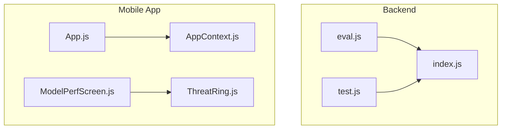
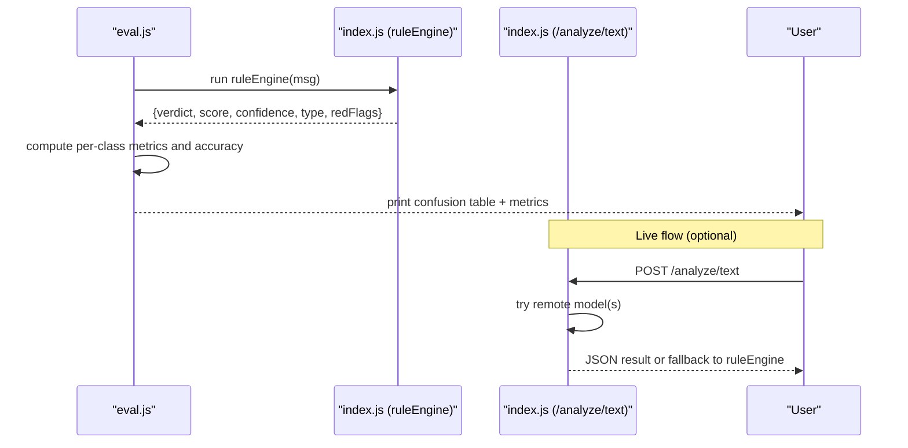
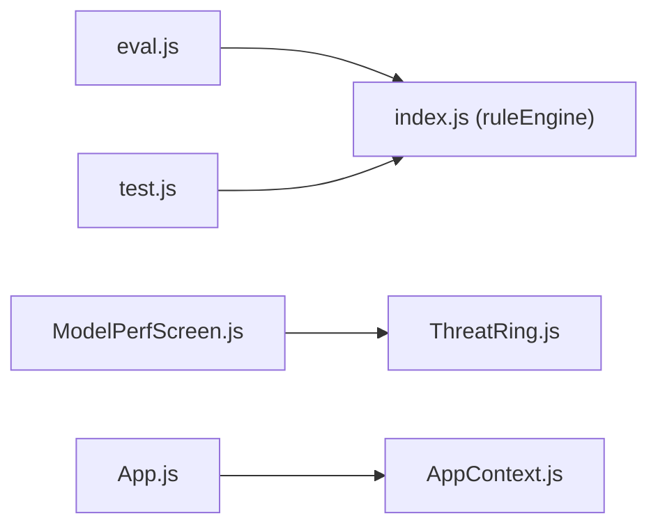

# Evaluation Harness

<cite>
**Referenced Files in This Document**
- [eval.js](file://backend/eval.js)
- [index.js](file://backend/index.js)
- [test.js](file://backend/test.js)
- [App.js](file://App.js)
- [ModelPerfScreen.js](file://src/screens/ModelPerfScreen.js)
- [ThreatRing.js](file://src/components/ThreatRing.js)
- [AppContext.js](file://src/context/AppContext.js)
- [README.md](file://README.md)
- [package.json](file://package.json)
</cite>

## Table of Contents
1. [Introduction](#introduction)
2. [Project Structure](#project-structure)
3. [Core Components](#core-components)
4. [Architecture Overview](#architecture-overview)
5. [Detailed Component Analysis](#detailed-component-analysis)
6. [Dependency Analysis](#dependency-analysis)
7. [Performance Considerations](#performance-considerations)
8. [Troubleshooting Guide](#troubleshooting-guide)
9. [Conclusion](#conclusion)
10. [Appendices](#appendices)

## Introduction
This document describes the Evaluation Harness for Safe Pakistan, focusing on how the offline rule engine is evaluated against a labeled dataset and how results are presented to users. It explains the evaluation script, the scoring logic used by the backend, and the user-facing performance transparency screen that visualizes model metrics.

## Project Structure
The evaluation harness lives under the backend folder and integrates with the main application through shared logic and UI components:
- Backend evaluation script runs a small labeled test set through the rule engine and prints a confusion table plus per-class metrics and latency.
- The backend exposes an API endpoint for text analysis and also exports the rule engine for offline evaluation.
- The mobile app includes a Model Performance screen that displays accuracy, false positives, latency, dataset size, and a comparison between keyword baseline and AI system.

**Diagram sources**
- [eval.js:1-89](file://backend/eval.js#L1-L89)
- [index.js:1-87](file://backend/index.js#L1-L87)
- [test.js:1-8](file://backend/test.js#L1-L8)
- [App.js:1-50](file://App.js#L1-L50)
- [ModelPerfScreen.js:1-170](file://src/screens/ModelPerfScreen.js#L1-L170)
- [ThreatRing.js:1-92](file://src/components/ThreatRing.js#L1-L92)
- [AppContext.js:1-35](file://src/context/AppContext.js#L1-L35)

**Section sources**
- [README.md:11-49](file://README.md#L11-L49)
- [package.json:1-42](file://package.json#L1-L42)

## Core Components
- Evaluation harness (offline): Runs a fixed set of labeled messages through the rule engine, computes per-class precision/recall/F1, overall accuracy, and average latency, then prints a formatted confusion table.
- Rule engine (local fallback): Implements a simple regex-based scoring function that returns verdict, score, confidence, type, red flags, and multilingual explanations.
- API server (Express): Provides /analyze/text which attempts remote models first and falls back to the local rule engine; also provides helper endpoints for family pairing and alerts.
- Mobile performance screen: Displays live model metrics and a comparison chart between keyword baseline and AI system.

Key responsibilities:
- eval.js: orchestrate evaluation, compute metrics, format output.
- index.js: implement local rules and expose them via module export and HTTP endpoint.
- ModelPerfScreen.js: visualize metrics and comparisons for transparency.
- ThreatRing.js: animated ring component used to show scores visually.
- AppContext.js: global state provider used by the app (not directly part of evaluation but relevant to integration).

**Section sources**
- [eval.js:1-89](file://backend/eval.js#L1-L89)
- [index.js:45-87](file://backend/index.js#L45-L87)
- [ModelPerfScreen.js:19-121](file://src/screens/ModelPerfScreen.js#L19-L121)
- [ThreatRing.js:18-83](file://src/components/ThreatRing.js#L18-L83)
- [AppContext.js:10-34](file://src/context/AppContext.js#L10-L34)

## Architecture Overview
The evaluation harness executes offline using the exported rule engine from the backend. The same rule engine is used as a fallback in the live API when remote calls fail.

**Diagram sources**
- [eval.js:41-89](file://backend/eval.js#L41-L89)
- [index.js:16-70](file://backend/index.js#L16-L70)

## Detailed Component Analysis

### Evaluation Harness (backend/eval.js)
Purpose:
- Execute a labeled dataset through the rule engine.
- Compute per-class precision, recall, F1, overall accuracy, and average latency.
- Print a human-readable confusion table.

Data:
- CASES: 10 labeled messages across three classes (scam, suspicious, safe).
- CLASSES: ['scam', 'suspicious', 'safe'].

Processing:
- For each message, call ruleEngine and record truth vs predicted verdict along with score.
- Compute TP/FP/FN per class and derive precision, recall, F1.
- Calculate overall accuracy and average latency across all cases.

Output:
- Formatted table with columns: #, Message, True, Predicted, Score, Correct?
- Per-class metrics and overall accuracy.
- Average latency per message.

Complexity:
- Time complexity O(N*C) where N is number of cases and C is number of classes for metric computation. With small N=10, this is negligible.
- Space complexity O(N) to store rows.

Error handling:
- No explicit error handling around ruleEngine calls; assumes consistent return shape.

Optimization opportunities:
- Add support for larger datasets and streaming output.
- Export metrics as JSON for CI pipelines.

**Section sources**
- [eval.js:11-89](file://backend/eval.js#L11-L89)

### Rule Engine and API (backend/index.js)
Rule engine (localRules):
- Uses regex patterns to detect scam indicators such as OTP/PIN/CNIC requests, urgency words, prize keywords, links, and account blocking threats.
- Accumulates weighted scores and thresholds to determine verdict: scam (>=75), suspicious (>=40), safe (<40).
- Returns structured result including verdict, score, confidence, type, redFlags, and explanations in multiple languages.

API endpoints:
- POST /analyze/text: Attempts remote model calls first; if they fail, falls back to localRules. Returns JSON with verdict, score, confidence, type, redFlags, and explanations. Also indicates which model was used.
- POST /family/pair: Generates a temporary pairing code and expiry.
- POST /alerts/guardian: Logs push alert payload and returns confirmation.

Export:
- Exports ruleEngine for offline evaluation via eval.js.

Error handling:
- Remote calls catch errors and log details before falling back.
- Local rules always succeed and provide a deterministic result.

Performance characteristics:
- Local rules are fast and deterministic; average latency measured by eval.js reflects this.
- Remote calls add variability and potential failure paths.

**Section sources**
- [index.js:16-70](file://backend/index.js#L16-L70)
- [index.js:72-87](file://backend/index.js#L72-L87)

### Mobile Performance Transparency (ModelPerfScreen.js)
Purpose:
- Provide transparency into model performance with key metrics: accuracy, false positives, average latency, dataset size.
- Show a two-bar comparison between keyword baseline and Hifazat AI.

UI elements:
- Hero section with overall accuracy and a ThreatRing visualization.
- Metric grid with units and Urdu translations.
- Comparison bars with gradient styling and callout text.

Integration points:
- Uses ThreatRing for score visualization.
- Can be wired to fetch live metrics from a backend endpoint (commented guidance in file).

Accessibility and design:
- Follows design tokens and typography guidelines.
- Supports RTL and bilingual labels.

**Section sources**
- [ModelPerfScreen.js:19-121](file://src/screens/ModelPerfScreen.js#L19-L121)
- [ThreatRing.js:18-83](file://src/components/ThreatRing.js#L18-L83)

### Animated Score Ring (ThreatRing.js)
Purpose:
- Render an animated circular progress ring indicating a score out of 100.
- Animate strokeDashoffset based on score using Reanimated.

Props:
- score (0–100), size, color, label.

Behavior:
- Animates progress over ~1.2 seconds with easing.
- Uses tabular numbers to prevent digit jitter during animation.

Usage:
- Used in ModelPerfScreen to visualize accuracy and other scores.

**Section sources**
- [ThreatRing.js:18-83](file://src/components/ThreatRing.js#L18-L83)

### App Context (AppContext.js)
Purpose:
- Provide global state for scan counts, blocked counts, and analyzing flag.
- Offer incrementScan callback to update counts after scans.

Relevance:
- While not part of the evaluation harness itself, it demonstrates how the app tracks usage and can be extended to include evaluation-related counters (e.g., number of evaluations run).

**Section sources**
- [AppContext.js:10-34](file://src/context/AppContext.js#L10-L34)

## Dependency Analysis
- eval.js depends on index.js to access ruleEngine.
- index.js defines both the API server and the rule engine; eval.js uses only the exported ruleEngine.
- test.js is a quick smoke test for the API endpoint.
- ModelPerfScreen.js depends on ThreatRing.js for visualizing scores.
- App.js wires providers and navigator; not directly involved in evaluation but sets up context for the app.

**Diagram sources**
- [eval.js:9-9](file://backend/eval.js#L9-L9)
- [index.js:86-87](file://backend/index.js#L86-L87)
- [test.js:1-8](file://backend/test.js#L1-L8)
- [ModelPerfScreen.js:16-16](file://src/screens/ModelPerfScreen.js#L16-L16)
- [ThreatRing.js:1-92](file://src/components/ThreatRing.js#L1-L92)
- [App.js:17-19](file://App.js#L17-L19)
- [AppContext.js:1-35](file://src/context/AppContext.js#L1-L35)

**Section sources**
- [eval.js:1-89](file://backend/eval.js#L1-L89)
- [index.js:1-87](file://backend/index.js#L1-L87)
- [test.js:1-8](file://backend/test.js#L1-L8)
- [ModelPerfScreen.js:1-170](file://src/screens/ModelPerfScreen.js#L1-L170)
- [ThreatRing.js:1-92](file://src/components/ThreatRing.js#L1-L92)
- [App.js:1-50](file://App.js#L1-L50)
- [AppContext.js:1-35](file://src/context/AppContext.js#L1-L35)

## Performance Considerations
- The evaluation harness measures average latency per message using high-resolution timers; expect very low latency due to local regex rules.
- The rule engine’s time complexity is linear in the number of regex patterns and input length; with a small fixed set of patterns, performance is excellent.
- For larger datasets, consider batching and parallelization in eval.js to reduce total runtime.
- The API fallback ensures robustness; however, remote calls introduce variable latency and potential failures.

[No sources needed since this section provides general guidance]

## Troubleshooting Guide
Common issues and resolutions:
- Missing dependencies: Ensure required packages are installed (express, cors, dotenv) for the backend.
- Environment variables: Set DASHSCOPE_BASE_URL, QWEN_API_KEY, FT_MODEL, MAX_MODEL for remote model calls; otherwise, the API will fall back to local rules.
- Port conflicts: The server listens on port 3000; ensure no other process is using it.
- Network errors: If remote calls fail, logs indicate layer failures; verify credentials and connectivity.
- Evaluation output: If eval.js does not print expected metrics, confirm that ruleEngine returns the expected shape (verdict, score, confidence, type, redFlags).

Verification steps:
- Run the API smoke test to validate endpoint behavior.
- Run eval.js to check offline evaluation output and latency.

**Section sources**
- [index.js:1-14](file://backend/index.js#L1-L14)
- [index.js:63-70](file://backend/index.js#L63-L70)
- [test.js:1-8](file://backend/test.js#L1-L8)
- [eval.js:41-89](file://backend/eval.js#L41-L89)

## Conclusion
The Evaluation Harness provides a concise, offline method to assess the rule engine’s effectiveness on a labeled dataset, delivering clear metrics and latency insights. The same rule engine powers the backend’s fallback path, ensuring reliability even when remote models are unavailable. The mobile app’s Model Performance screen offers transparency to users, reinforcing trust in the system’s capabilities.

[No sources needed since this section summarizes without analyzing specific files]

## Appendices

### Running the Evaluation Harness
- Execute the evaluation script in the backend directory to run the labeled dataset through the rule engine and view metrics.
- Use the provided test script to quickly verify the API endpoint behavior.

**Section sources**
- [eval.js:1-89](file://backend/eval.js#L1-L89)
- [test.js:1-8](file://backend/test.js#L1-L8)

### Integration Notes
- The app’s entry point loads fonts and providers; ensure these are present when integrating the evaluation outputs into the app.
- The performance screen can be wired to fetch live metrics from a backend endpoint for real-time transparency.

**Section sources**
- [App.js:1-50](file://App.js#L1-L50)
- [ModelPerfScreen.js:1-170](file://src/screens/ModelPerfScreen.js#L1-L170)