# Mock Data and Services

<cite>
**Referenced Files in This Document**
- [mockData.js](file://src/data/mockData.js)
- [PushService.js](file://src/services/PushService.js)
- [AppContext.js](file://src/context/AppContext.js)
- [LanguageContext.js](file://src/context/LanguageContext.js)
- [HomeScreen.js](file://src/screens/HomeScreen.js)
- [LibraryScreen.js](file://src/screens/LibraryScreen.js)
- [ScanScreen.js](file://src/screens/ScanScreen.js)
- [VerdictScreen.js](file://src/screens/VerdictScreen.js)
- [Cards.js](file://src/components/Cards.js)
- [Indicators.js](file://src/components/Indicators.js)
- [AppNavigator.js](file://src/navigation/AppNavigator.js)
- [App.js](file://App.js)
</cite>

## Table of Contents
1. Introduction
2. Project Structure
3. Core Components
4. Architecture Overview
5. Detailed Component Analysis
6. Dependency Analysis
7. Performance Considerations
8. Troubleshooting Guide
9. Conclusion

## Introduction
This document explains how mock data and services are structured and used across the application to power UI flows before real backend or device integrations are wired up. It focuses on:
- Local mock data for scan history and statistics
- A stubbed push notification service
- Global contexts that provide app-wide state and language support
- How screens consume these abstractions to render dashboards, libraries, and verdicts

The goal is to make it easy to understand where data comes from, how it flows through components, and where to swap mocks for real implementations later.

## Project Structure
At a high level:
- src/data holds mock datasets and a small local database abstraction
- src/services provides service-level APIs (e.g., push notifications)
- src/context provides global state and localization
- Screens compose reusable UI components and consume contexts and services
- App.js wires providers around navigation

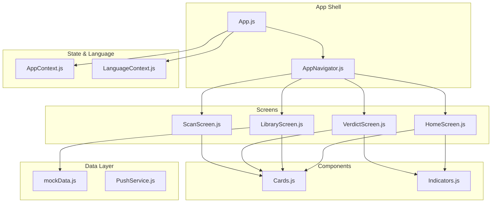

**Diagram sources**
- [App.js:17-49](file://App.js#L17-L49)
- [AppNavigator.js:19-30](file://src/navigation/AppNavigator.js#L19-L30)
- [AppContext.js:1-35](file://src/context/AppContext.js#L1-L35)
- [LanguageContext.js:1-72](file://src/context/LanguageContext.js#L1-L72)
- [mockData.js:1-25](file://src/data/mockData.js#L1-L25)
- [PushService.js:1-10](file://src/services/PushService.js#L1-L10)
- [HomeScreen.js:1-158](file://src/screens/HomeScreen.js#L1-L158)
- [LibraryScreen.js:29-57](file://src/screens/LibraryScreen.js#L29-L57)
- [VerdictScreen.js:1-268](file://src/screens/VerdictScreen.js#L1-L268)
- [ScanScreen.js:1-61](file://src/screens/ScanScreen.js#L1-L61)
- [Cards.js:1-193](file://src/components/Cards.js#L1-L193)
- [Indicators.js:1-106](file://src/components/Indicators.js#L1-L106)

**Section sources**
- [App.js:17-49](file://App.js#L17-L49)
- [AppNavigator.js:19-30](file://src/navigation/AppNavigator.js#L19-L30)

## Core Components
- Mock data layer:
  - Provides static arrays and objects representing scan history and stats
  - Exposes a simple LocalDBService interface with async methods for future replacement
- Push service:
  - A minimal stub that returns success without sending real notifications
- Contexts:
  - AppContext: global counters and analysis state
  - LanguageContext: language selection, translation helper, RTL and TTS locale hints

These pieces together enable screens to render meaningful UI while keeping integration points clean for later wiring to real backends or native services.

**Section sources**
- [mockData.js:1-25](file://src/data/mockData.js#L1-L25)
- [PushService.js:1-10](file://src/services/PushService.js#L1-L10)
- [AppContext.js:1-35](file://src/context/AppContext.js#L1-L35)
- [LanguageContext.js:1-72](file://src/context/LanguageContext.js#L1-L72)

## Architecture Overview
The app uses a provider-based architecture:
- App.js wraps the navigator with AppProvider and LanguageProvider
- Screens consume contexts via hooks
- Data flows from mock data into screens via either direct imports or service calls
- Reusable components render consistent UI based on props

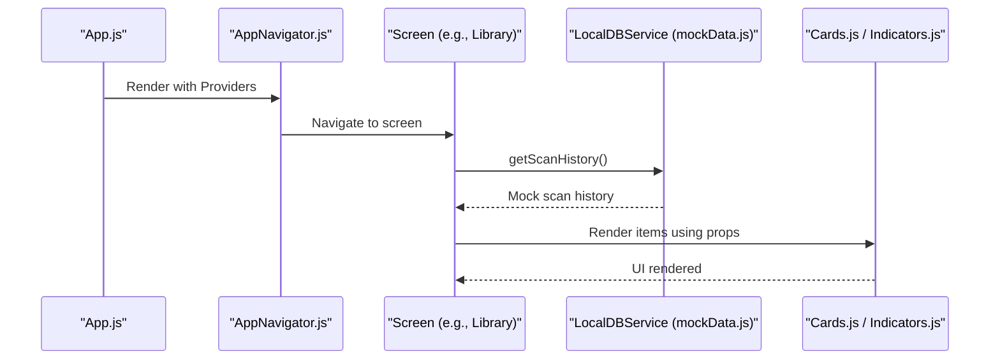

**Diagram sources**
- [App.js:17-49](file://App.js#L17-L49)
- [AppNavigator.js:19-30](file://src/navigation/AppNavigator.js#L19-L30)
- [LibraryScreen.js:29-57](file://src/screens/LibraryScreen.js#L29-L57)
- [mockData.js:1-25](file://src/data/mockData.js#L1-L25)
- [Cards.js:1-193](file://src/components/Cards.js#L1-L193)
- [Indicators.js:1-106](file://src/components/Indicators.js#L1-L106)

## Detailed Component Analysis

### Mock Data Layer
- Purpose: Provide stable shapes for UI until real storage or API is available
- Key exports:
  - Static arrays and objects for scan history and stats
  - LocalDBService with async methods returning those values
- Design notes:
  - Methods are async to mirror real DB calls, making future swaps straightforward
  - Shapes match UI expectations (e.g., ActivityFeedItem fields)

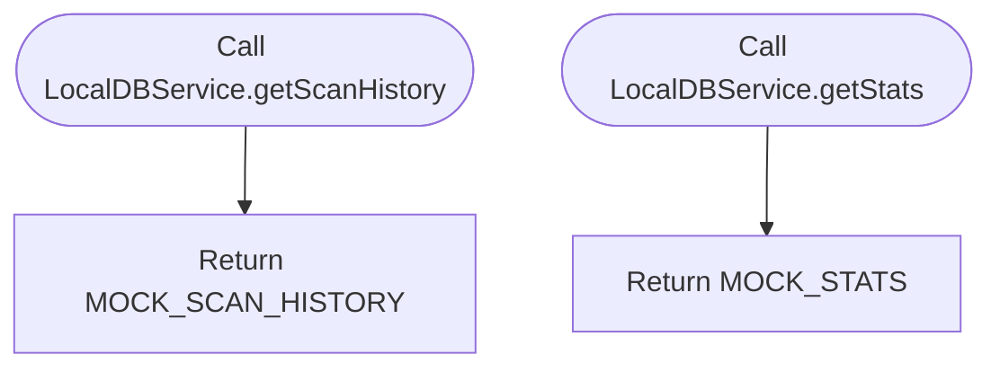

**Diagram sources**
- [mockData.js:20-24](file://src/data/mockData.js#L20-L24)

**Section sources**
- [mockData.js:1-25](file://src/data/mockData.js#L1-L25)

### Push Notification Service
- Purpose: Placeholder for guardian alert delivery
- Behavior:
  - Returns a resolved promise indicating success and timestamp
  - Intended to be replaced by FCM/APNs later

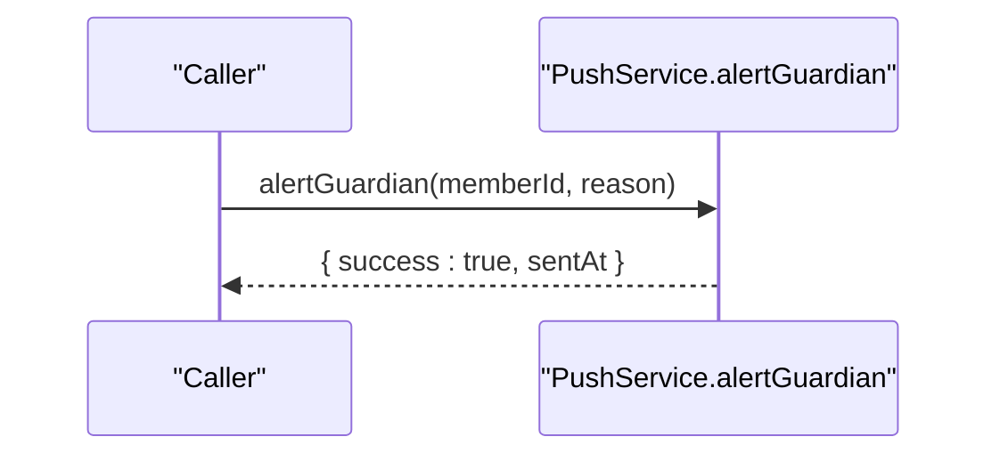

**Diagram sources**
- [PushService.js:6-9](file://src/services/PushService.js#L6-L9)

**Section sources**
- [PushService.js:1-10](file://src/services/PushService.js#L1-L10)

### Global State Context (AppContext)
- Purpose: Centralize scan counts, blocked counts, and analysis state
- Key behaviors:
  - incrementScan updates counts and optionally increments blocked count
  - Exposes isAnalyzing flag and setter for UI feedback

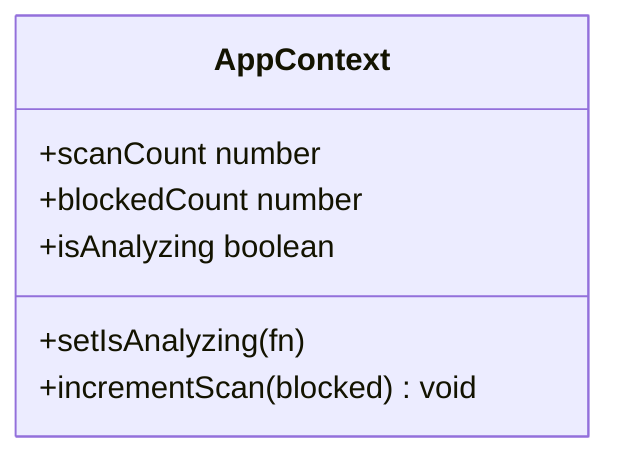

**Diagram sources**
- [AppContext.js:10-27](file://src/context/AppContext.js#L10-L27)

**Section sources**
- [AppContext.js:1-35](file://src/context/AppContext.js#L1-L35)

### Language Context
- Purpose: Manage app language, translations, RTL behavior, and TTS locale
- Key features:
  - Supports English, Urdu, and Roman Urdu
  - Provides t(key) for localized strings
  - Computes isRTL and ttsLocale based on selected language

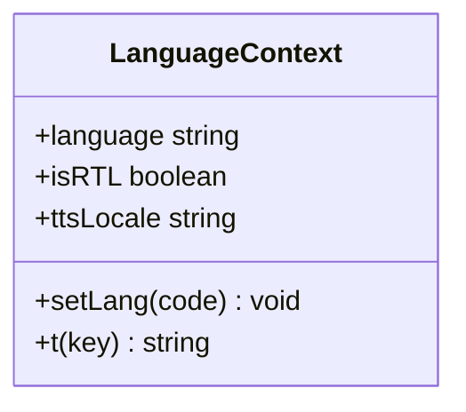

**Diagram sources**
- [LanguageContext.js:8-64](file://src/context/LanguageContext.js#L8-L64)

**Section sources**
- [LanguageContext.js:1-72](file://src/context/LanguageContext.js#L1-L72)

### Home Screen
- Purpose: Dashboard showing protection status, quick stats, and recent activity
- Data usage:
  - Uses hardcoded sample data for demonstration
  - Renders cards and indicators for threat stats and agents
- Integration points:
  - Navigation to other screens (e.g., Library)
  - Could consume AppContext and LanguageContext when wired

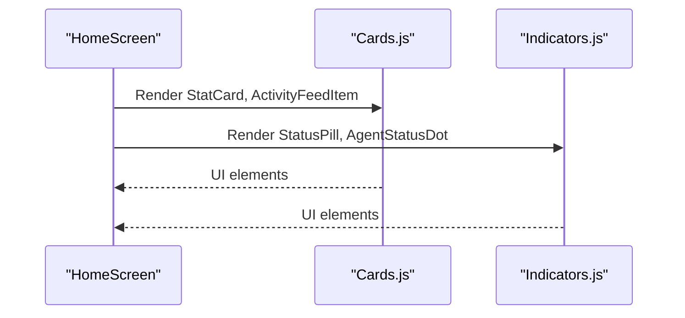

**Diagram sources**
- [HomeScreen.js:23-100](file://src/screens/HomeScreen.js#L23-L100)
- [Cards.js:47-110](file://src/components/Cards.js#L47-L110)
- [Indicators.js:10-77](file://src/components/Indicators.js#L10-L77)

**Section sources**
- [HomeScreen.js:1-158](file://src/screens/HomeScreen.js#L1-L158)

### Library Screen
- Purpose: Display scan history with filtering
- Data flow:
  - Attempts to load scan history via LocalDBService
  - Falls back to mock data if empty or error occurs
  - Filters items by tone (scam, suspicious, safe)

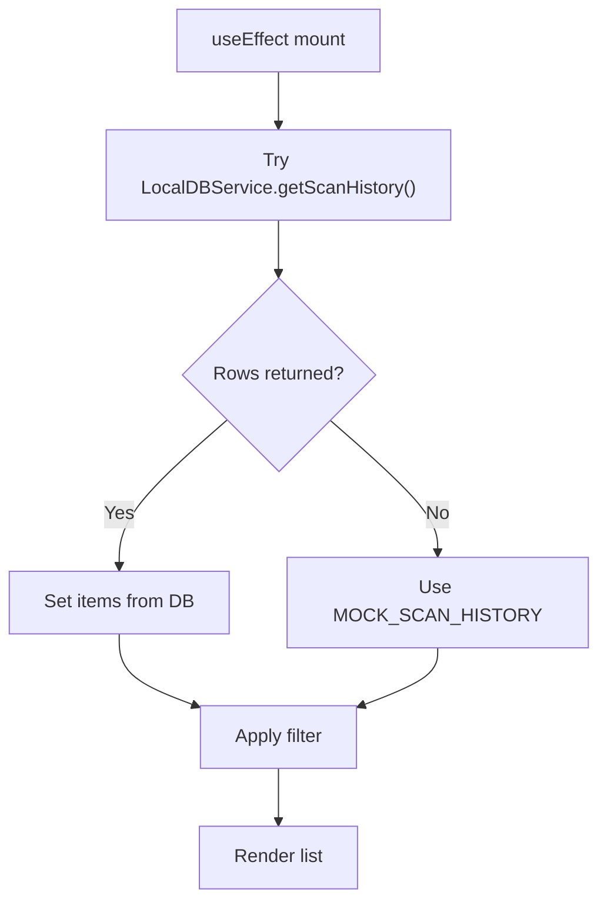

**Diagram sources**
- [LibraryScreen.js:29-57](file://src/screens/LibraryScreen.js#L29-L57)
- [mockData.js:8-18](file://src/data/mockData.js#L8-L18)

**Section sources**
- [LibraryScreen.js:29-57](file://src/screens/LibraryScreen.js#L29-L57)
- [mockData.js:1-25](file://src/data/mockData.js#L1-L25)

### Scan Screen
- Purpose: Input text, pick screenshot, or voice input to analyze content
- Mock behavior:
  - Preset samples demonstrate scam/safe/suspicious inputs
  - Navigates to Verdict screen with mock parameters
  - Screenshot picker navigates to result screen with mock issues

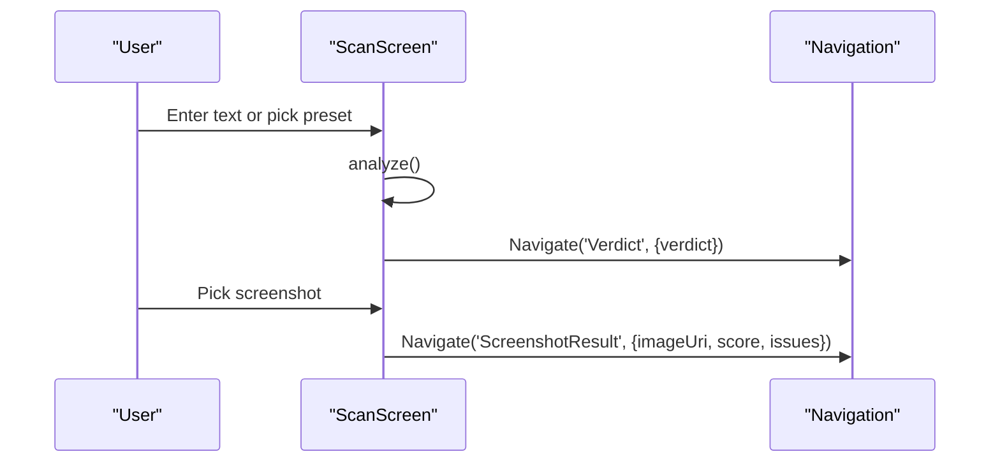

**Diagram sources**
- [ScanScreen.js:23-61](file://src/screens/ScanScreen.js#L23-L61)

**Section sources**
- [ScanScreen.js:1-61](file://src/screens/ScanScreen.js#L1-L61)

### Verdict Screen
- Purpose: Show outcome of analysis with animated band and details
- Behavior:
  - Reads route params to determine verdict, score, confidence, type
  - Displays different detail sections for scam vs safe
  - Action sheet offers follow-up actions

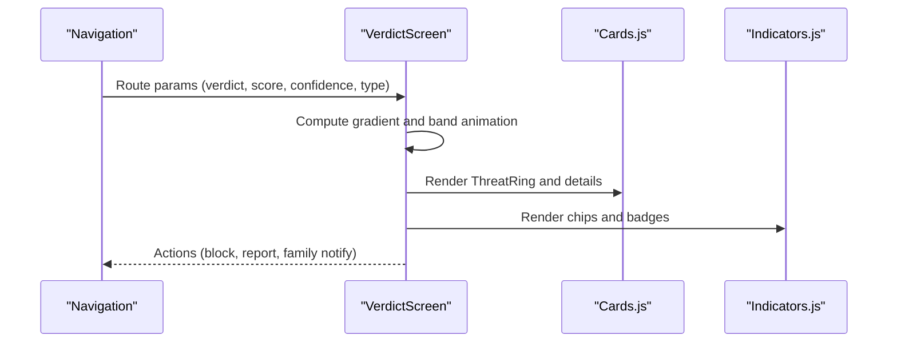

**Diagram sources**
- [VerdictScreen.js:19-116](file://src/screens/VerdictScreen.js#L19-L116)
- [Cards.js:88-110](file://src/components/Cards.js#L88-L110)
- [Indicators.js:10-58](file://src/components/Indicators.js#L10-L58)

**Section sources**
- [VerdictScreen.js:1-268](file://src/screens/VerdictScreen.js#L1-L268)

### Reusable Components
- Cards:
  - Avatar, SectionHeader, StatCard, FamilyMemberCard, ActivityFeedItem, LanguageChip, EmptyState
  - Used across screens to render consistent UI
- Indicators:
  - VerdictBadge, StatusPill, ScamTypeChip, AgentStatusDot
  - Small visual cues for status and verdicts

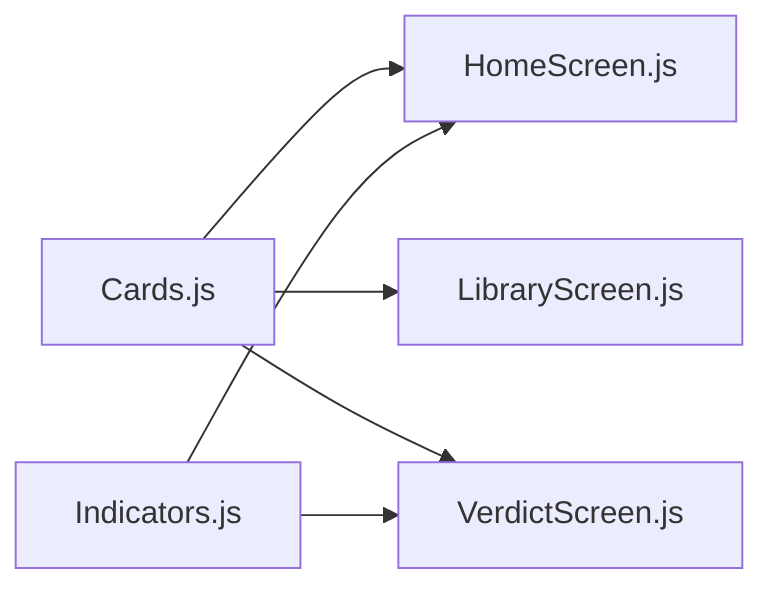

**Diagram sources**
- [Cards.js:1-193](file://src/components/Cards.js#L1-L193)
- [Indicators.js:1-106](file://src/components/Indicators.js#L1-L106)
- [HomeScreen.js:1-158](file://src/screens/HomeScreen.js#L1-L158)
- [LibraryScreen.js:29-57](file://src/screens/LibraryScreen.js#L29-L57)
- [VerdictScreen.js:1-268](file://src/screens/VerdictScreen.js#L1-L268)

**Section sources**
- [Cards.js:1-193](file://src/components/Cards.js#L1-L193)
- [Indicators.js:1-106](file://src/components/Indicators.js#L1-L106)

## Dependency Analysis
- Provider wiring:
  - App.js wraps navigation with AppProvider and LanguageProvider
- Screen dependencies:
  - Screens depend on contexts for state and language
  - Screens import reusable components for rendering
- Data dependencies:
  - LibraryScreen depends on LocalDBService (mock) for scan history
  - Other screens use inline mock data for demo purposes

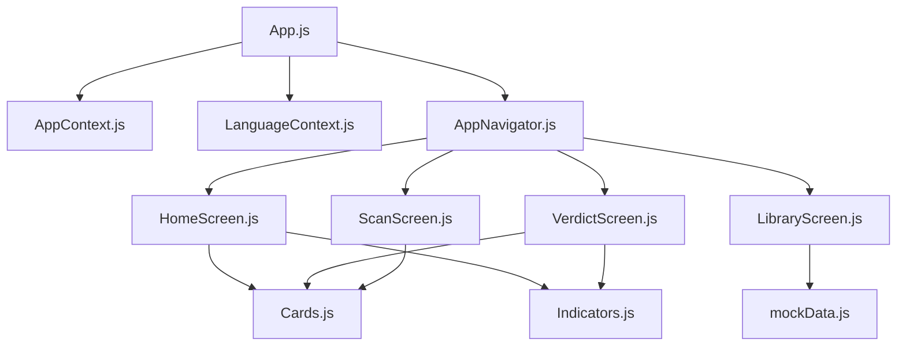

**Diagram sources**
- [App.js:17-49](file://App.js#L17-L49)
- [AppNavigator.js:19-30](file://src/navigation/AppNavigator.js#L19-L30)
- [LibraryScreen.js:29-57](file://src/screens/LibraryScreen.js#L29-L57)
- [mockData.js:1-25](file://src/data/mockData.js#L1-L25)
- [HomeScreen.js:1-158](file://src/screens/HomeScreen.js#L1-L158)
- [VerdictScreen.js:1-268](file://src/screens/VerdictScreen.js#L1-L268)
- [ScanScreen.js:1-61](file://src/screens/ScanScreen.js#L1-L61)
- [Cards.js:1-193](file://src/components/Cards.js#L1-L193)
- [Indicators.js:1-106](file://src/components/Indicators.js#L1-L106)

**Section sources**
- [App.js:17-49](file://App.js#L17-L49)
- [AppNavigator.js:19-30](file://src/navigation/AppNavigator.js#L19-L30)
- [LibraryScreen.js:29-57](file://src/screens/LibraryScreen.js#L29-L57)
- [mockData.js:1-25](file://src/data/mockData.js#L1-L25)

## Performance Considerations
- Mock data is lightweight and synchronous; no network overhead
- LibraryScreen loads once and filters locally; consider pagination if dataset grows
- Avoid heavy computations in render paths; keep transformations in effects or memoized callbacks
- PushService stub resolves immediately; ensure real implementation batches or throttles alerts if needed

[No sources needed since this section provides general guidance]

## Troubleshooting Guide
- Library shows no items:
  - Check LocalDBService.getScanHistory return value; fallback to mock data if empty
  - Verify try/catch block handles errors gracefully
- Verdict not updating:
  - Ensure route params are passed correctly from previous screen
  - Confirm navigation stack order and parameter names
- Push alerts not received:
  - Current implementation is a stub; replace with real FCM/APNs integration
  - Validate memberId and reason arguments when integrating

**Section sources**
- [LibraryScreen.js:29-57](file://src/screens/LibraryScreen.js#L29-L57)
- [VerdictScreen.js:19-116](file://src/screens/VerdictScreen.js#L19-L116)
- [PushService.js:6-9](file://src/services/PushService.js#L6-L9)

## Conclusion
The mock data and services provide a robust foundation for UI development and testing. They isolate presentation logic from backend concerns, enabling rapid iteration. When ready, replace LocalDBService and PushService with real implementations without altering screen contracts. The provider-based state and language contexts ensure consistent app-wide behavior and localization.

[No sources needed since this section summarizes without analyzing specific files]