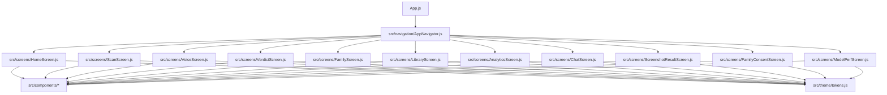
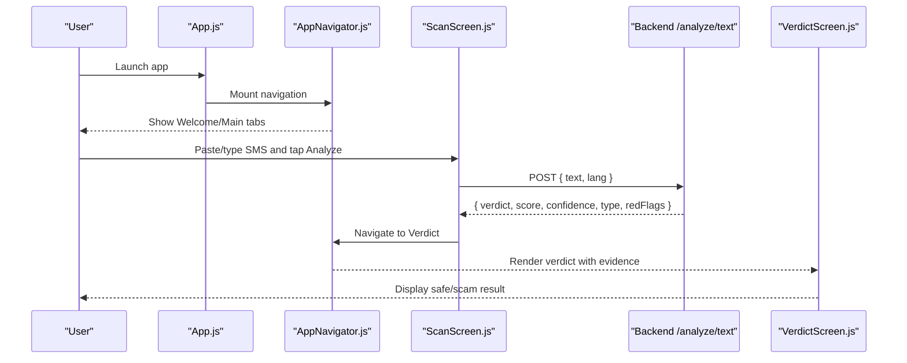
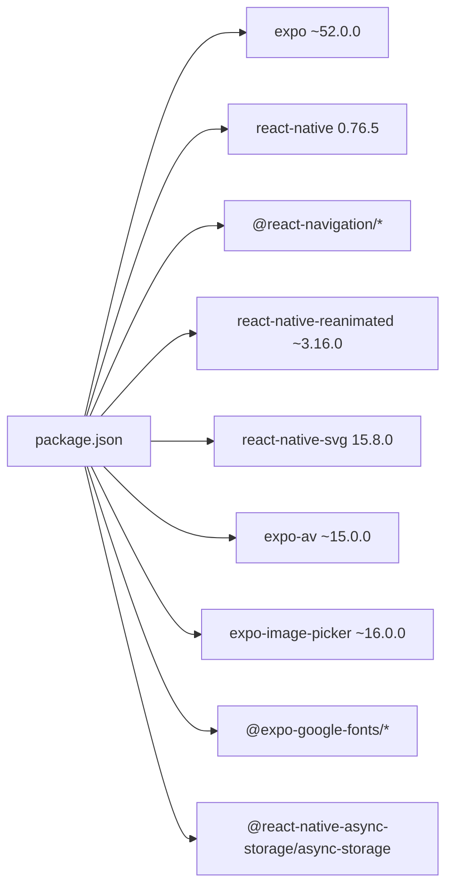

# Getting Started

<cite>
**Referenced Files in This Document**
- [README.md](file://README.md)
- [package.json](file://package.json)
- [App.js](file://App.js)
- [babel.config.js](file://babel.config.js)
- [app.json](file://app.json)
- [jsconfig.json](file://jsconfig.json)
- [src/navigation/AppNavigator.js](file://src/navigation/AppNavigator.js)
- [src/screens/HomeScreen.js](file://src/screens/HomeScreen.js)
- [src/screens/ScanScreen.js](file://src/screens/ScanScreen.js)
- [src/theme/tokens.js](file://src/theme/tokens.js)
- [backend/index.js](file://backend/index.js)
</cite>

## Table of Contents
1. Introduction
2. Project Structure
3. Core Components
4. Architecture Overview
5. Detailed Component Analysis
6. Dependency Analysis
7. Performance Considerations
8. Troubleshooting Guide
9. Conclusion

## Introduction
Safe Pakistan is an AI-powered scam detection guardian for Pakistani citizens. It helps users protect themselves from fraud by analyzing SMS, voice recordings, screenshots, and links. The app provides a simple, accessible interface with clear verdicts and actionable guidance. It supports English and Urdu (including Roman Urdu) to serve a broad audience across Pakistan.

Core capabilities:
- SMS analysis: paste or type messages to detect scams and suspicious content.
- Voice recording: record audio input to analyze spoken content for scam indicators.
- Screenshot scanning: capture or upload screenshots to identify risky elements.
- Link verification: check URLs for safety and phishing risk.

Target audience:
- Everyday Pakistani users seeking protection against common scams such as fake prize messages, OTP requests, and fraudulent links.

## Project Structure
The project follows a clean separation of concerns:
- src/components: Reusable UI components like cards, indicators, overlays, and the animated threat ring.
- src/screens: Feature screens including Home, Scan, Verdict, Voice, Family, Library, Analytics, Chat, and more.
- src/navigation: Navigation setup using React Navigation with a bottom tab bar and stack navigation.
- src/theme: Centralized design tokens for colors, typography, spacing, shadows, and gradients.

**Diagram sources**
- [App.js:17-40](file://App.js#L17-L40)
- [src/navigation/AppNavigator.js:17-30](file://src/navigation/AppNavigator.js#L17-L30)
- [src/screens/HomeScreen.js:15-21](file://src/screens/HomeScreen.js#L15-L21)
- [src/screens/ScanScreen.js:11-13](file://src/screens/ScanScreen.js#L11-L13)
- [src/theme/tokens.js:1-5](file://src/theme/tokens.js#L1-L5)

**Section sources**
- [README.md:11-46](file://README.md#L11-L46)
- [src/navigation/AppNavigator.js:1-30](file://src/navigation/AppNavigator.js#L1-L30)
- [src/theme/tokens.js:1-5](file://src/theme/tokens.js#L1-L5)

## Core Components
- ThreatRing: Animated SVG progress ring that visualizes threat scores with smooth transitions.
- Indicators: Status pills, badges, and agent status dots to communicate safety and state.
- Cards: Stat cards, family member cards, activity feed items, avatars, section headers, language chips, and empty states.
- Overlays: Loading shield and bottom sheet for modal actions.

These components are designed around a consistent design system defined in theme tokens, ensuring cohesive visuals and accessibility.

**Section sources**
- [README.md:21-26](file://README.md#L21-L26)
- [src/components/ThreatRing.js:1-15](file://src/components/ThreatRing.js#L1-L15)
- [src/theme/tokens.js:7-54](file://src/theme/tokens.js#L7-L54)

## Architecture Overview
At runtime, App.js loads fonts and mounts the navigation container. The navigator defines a welcome flow, main tabs (Home, Scan, Family, Report, Chat), and full-screen flows (Verdict, Voice, Library, etc.). Screens consume shared components and theme tokens. Backend integration is wired via fetch calls to the API endpoint for analysis.

**Diagram sources**
- [App.js:21-40](file://App.js#L21-L40)
- [src/navigation/AppNavigator.js:80-101](file://src/navigation/AppNavigator.js#L80-L101)
- [src/screens/ScanScreen.js:18-23](file://src/screens/ScanScreen.js#L18-L23)
- [backend/index.js:63-70](file://backend/index.js#L63-L70)

## Detailed Component Analysis

### Setup and Installation
- Install dependencies:
  - Run yarn install to install all Expo SDK 52 dependencies and dev tools.
- Configure path aliases:
  - Ensure babel.config.js includes the module-resolver plugin with root set to ./src and alias @ to ./src.
  - Add babel-plugin-module-resolver as a dev dependency if not present.
  - jsconfig.json also maps @/* to src/* for editor support.
- Expo development environment:
  - Use npx expo start to run the app on your device or simulator.
  - app.json configures the app scheme, orientation, splash, and platform-specific settings.

Key configuration references:
- Dependencies and scripts: package.json
- Path alias plugin: babel.config.js
- Editor path mapping: jsconfig.json
- App entry and font loading: App.js
- Expo metadata and plugins: app.json

**Section sources**
- [package.json:1-41](file://package.json#L1-L41)
- [babel.config.js:1-11](file://babel.config.js#L1-L11)
- [jsconfig.json:1-15](file://jsconfig.json#L1-L15)
- [App.js:1-44](file://App.js#L1-L44)
- [app.json:1-36](file://app.json#L1-L36)

### Running the App
- Start the development server:
  - Execute npx expo start from the project root.
- Choose your target:
  - Android: npx expo start --android
  - iOS: npx expo start --ios
  - Web: npx expo start --web

**Section sources**
- [package.json:5-10](file://package.json#L5-L10)
- [README.md:52-82](file://README.md#L52-L82)

### Configuring the Backend API Endpoint
- The backend exposes an analyze endpoint for text-based analysis.
- To integrate:
  - Update the fetch call in ScanScreen.js to point to your deployed API URL.
  - Send JSON payload with text and language.
  - Handle response fields: verdict, score, confidence, type, redFlags.
  - Optionally navigate through a loading screen before showing the verdict.

Example integration points:
- Backend route: /analyze/text
- Response shape includes verdict, score, confidence, type, redFlags, and explanations.

**Section sources**
- [src/screens/ScanScreen.js:18-23](file://src/screens/ScanScreen.js#L18-L23)
- [backend/index.js:63-70](file://backend/index.js#L63-L70)
- [README.md:173-203](file://README.md#L173-L203)

### Integrating with Existing Apps via Context Providers
- The app is designed to be integrated into existing projects by enabling context providers:
  - AppContext: Provides scanCount, blockedCount, isAnalyzing, incrementScan.
  - LanguageContext: Provides language, setLang, t(), isRTL, ttsLocale.
- In App.js, uncomment the provider wrappers to enable these contexts.
- In screens, uncomment useAppContext() and useLanguageContext() hooks where needed.

Integration steps:
- Uncomment provider wrappers in App.js.
- Import and use contexts in screens as indicated by comments.
- Confirm import paths match your project structure.

**Section sources**
- [App.js:17-20](file://App.js#L17-L20)
- [App.js:36-41](file://App.js#L36-L41)
- [src/screens/HomeScreen.js:20-25](file://src/screens/HomeScreen.js#L20-L25)
- [README.md:173-184](file://README.md#L173-L184)

### Core Capabilities Walkthrough
- SMS analysis:
  - Use ScanScreen to paste or type SMS content and trigger analysis.
  - Wire the analyze function to your backend endpoint.
- Voice recording:
  - Navigate to VoiceScreen to record audio; integrate with expo-av for real-time waveform updates.
- Screenshot scanning:
  - Use ScreenshotResultScreen expecting an imageUri parameter; integrate expo-image-picker to capture images.
- Link verification:
  - Extend ScanScreen to parse and verify links; leverage backend logic for URL safety checks.

**Section sources**
- [src/screens/ScanScreen.js:15-56](file://src/screens/ScanScreen.js#L15-L56)
- [README.md:252-267](file://README.md#L252-L267)
- [app.json:29-33](file://app.json#L29-L33)

## Dependency Analysis
The app relies on Expo SDK 52 and a curated set of libraries for navigation, animations, media, and fonts. Key categories:
- Expo ecosystem: expo, expo-status-bar, expo-linear-gradient, expo-haptics, expo-speech, expo-font, expo-av, expo-image-picker.
- Fonts: Inter and Noto Nastaliq Urdu via @expo-google-fonts.
- UI and animation: react-native-svg, react-native-reanimated, react-native-gesture-handler, react-native-safe-area-context, react-native-screens.
- Navigation: @react-navigation/native, native-stack, bottom-tabs.
- Storage: @react-native-async-storage/async-storage.

**Diagram sources**
- [package.json:11-34](file://package.json#L11-L34)

**Section sources**
- [package.json:11-34](file://package.json#L11-L34)
- [README.md:239-248](file://README.md#L239-L248)

## Performance Considerations
- Keep animations efficient:
  - Use react-native-reanimated for performant animations like ThreatRing and ripples.
- Optimize network calls:
  - Minimize payload size and handle errors gracefully when calling the backend.
- Manage fonts:
  - Load only necessary font weights to reduce startup time.
- Avoid heavy computations on the UI thread:
  - Offload processing to background tasks or the backend where possible.

[No sources needed since this section provides general guidance]

## Troubleshooting Guide
Common setup issues and resolutions:
- Path alias errors (@ imports):
  - Ensure babel.config.js has the module-resolver plugin configured with root ./src and alias @ to ./src.
  - Verify jsconfig.json maps @/* to src/* for editor IntelliSense.
- Missing dev dependencies:
  - Install babel-plugin-module-resolver as a dev dependency.
- Expo version mismatches:
  - If upgrading Expo SDK, align versions of reanimated, svg, screens, and safe-area-context using expo install --check.
- Font loading delays:
  - Confirm fonts are loaded in App.js before rendering the navigator.
- Backend connectivity:
  - Check CORS settings and ensure the API endpoint is reachable from the device/emulator.
  - Validate request payload format and response schema.

**Section sources**
- [babel.config.js:1-11](file://babel.config.js#L1-L11)
- [jsconfig.json:1-15](file://jsconfig.json#L1-L15)
- [README.md:52-82](file://README.md#L52-L82)
- [README.md:239-248](file://README.md#L239-L248)
- [backend/index.js:1-7](file://backend/index.js#L1-L7)

## Conclusion
Safe Pakistan provides a robust, user-friendly foundation for protecting citizens from scams through AI-powered analysis. With clear project structure, reusable components, and a scalable architecture, you can quickly set up the app, integrate your backend, and extend features like voice recognition and screenshot scanning. Follow the setup steps, configure path aliases, and wire the API endpoint to get started. For deeper customization, leverage the design tokens and context providers to align with your existing application.

[No sources needed since this section summarizes without analyzing specific files]