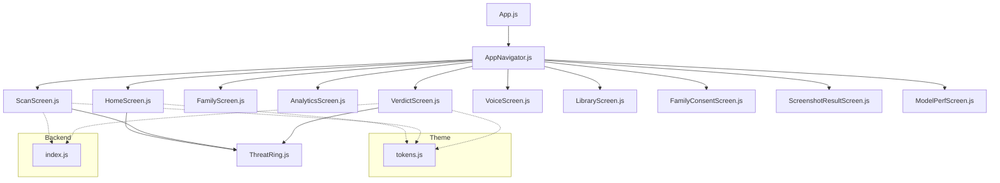
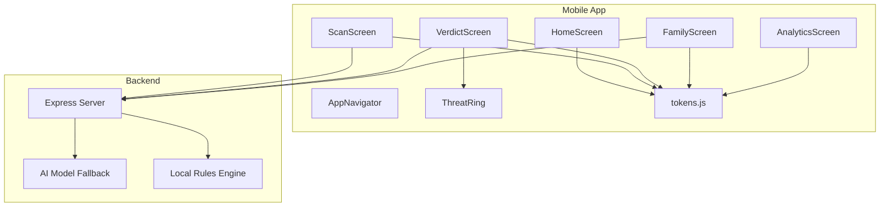
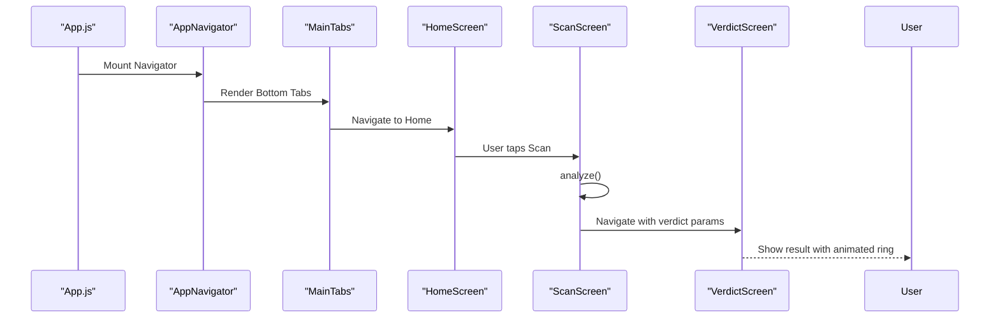
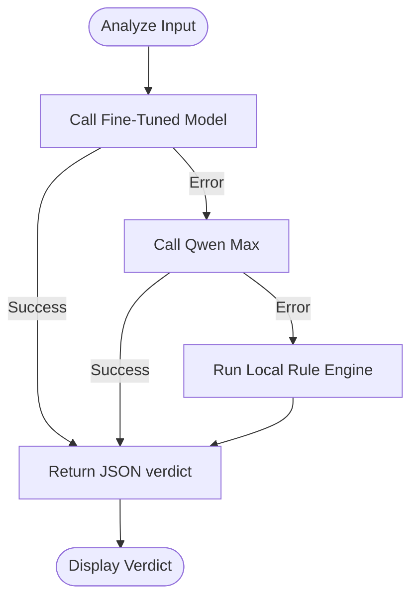
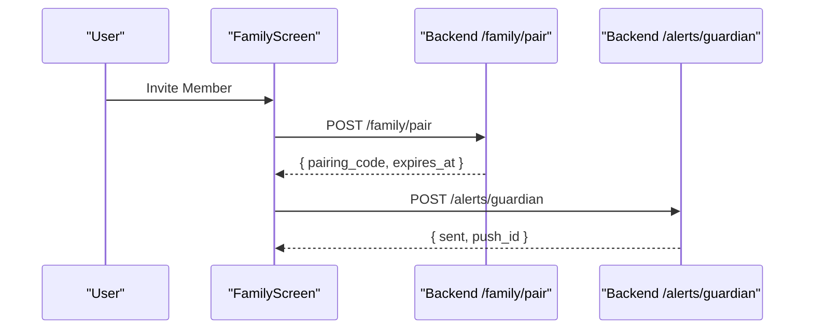
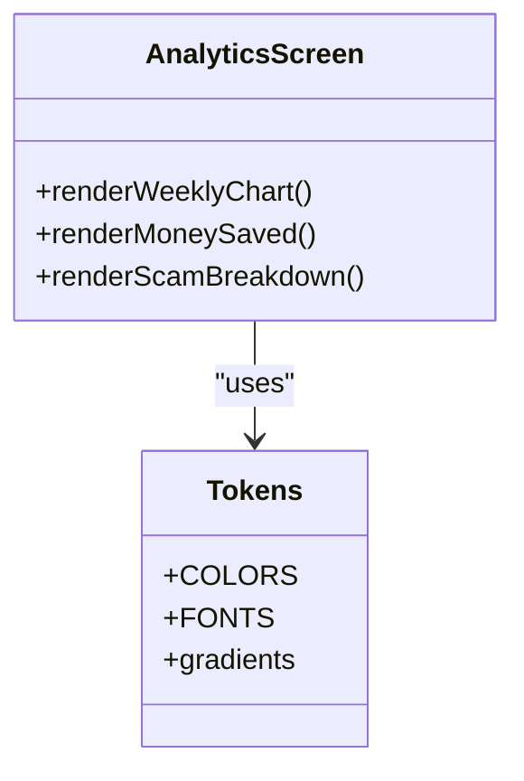
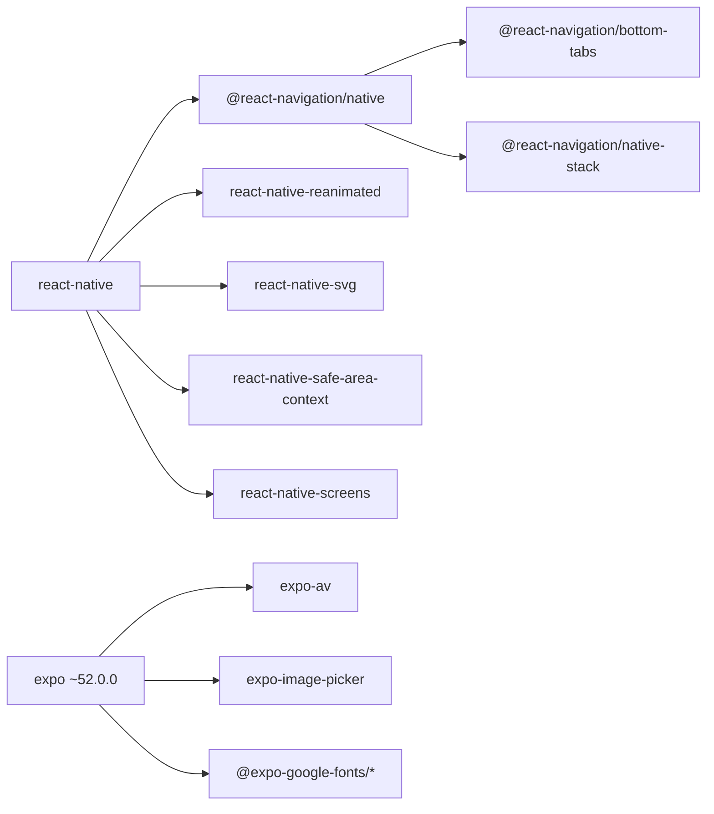

# Project Overview

<cite>
**Referenced Files in This Document**
- [README.md](file://README.md)
- [package.json](file://package.json)
- [App.js](file://App.js)
- [app.json](file://app.json)
- [DESIGN_RULES.md](file://DESIGN_RULES.md)
- [START-HERE.md](file://START-HERE.md)
- [src/navigation/AppNavigator.js](file://src/navigation/AppNavigator.js)
- [src/theme/tokens.js](file://src/theme/tokens.js)
- [src/screens/HomeScreen.js](file://src/screens/HomeScreen.js)
- [src/screens/ScanScreen.js](file://src/screens/ScanScreen.js)
- [src/screens/VerdictScreen.js](file://src/screens/VerdictScreen.js)
- [src/screens/FamilyScreen.js](file://src/screens/FamilyScreen.js)
- [src/screens/AnalyticsScreen.js](file://src/screens/AnalyticsScreen.js)
- [src/components/ThreatRing.js](file://src/components/ThreatRing.js)
- [backend/index.js](file://backend/index.js)
</cite>

## Table of Contents
1. Introduction
2. Project Structure
3. Core Components
4. Architecture Overview
5. Detailed Component Analysis
6. Dependency Analysis
7. Performance Considerations
8. Troubleshooting Guide
9. Conclusion

## Introduction
Safe Pakistan is an AI-powered scam detection mobile application designed to protect Pakistani citizens from SMS phishing, voice scams, suspicious links, and fraudulent screenshots. It provides multi-modal threat detection through text analysis, voice recording, screenshot scanning, and link verification, with a family protection system that allows pairing members and managing consent. The app includes an educational dashboard with analytics and money saved tracking, a bilingual interface (English and Urdu) with RTL support, and an AI-powered analysis engine backed by a multi-tier model fallback system.

The project uses React Native with Expo SDK 52, React Navigation v6, React Native Reanimated 3 for animations, and an Express.js backend for AI analysis and family features. It follows a component-based architecture, token-based theming, and strategy pattern for analysis methods to ensure maintainability and scalability.

## Project Structure
The application is organized into clear layers:
- Entry point and configuration files at the root
- Frontend screens, components, navigation, and theme under src
- Backend API server under backend

**Diagram sources**
- [App.js:17-40](file://App.js#L17-L40)
- [src/navigation/AppNavigator.js:19-30](file://src/navigation/AppNavigator.js#L19-L30)
- [src/screens/HomeScreen.js:15-20](file://src/screens/HomeScreen.js#L15-L20)
- [src/screens/ScanScreen.js:11-13](file://src/screens/ScanScreen.js#L11-L13)
- [src/screens/VerdictScreen.js:12-15](file://src/screens/VerdictScreen.js#L12-L15)
- [src/components/ThreatRing.js:8-14](file://src/components/ThreatRing.js#L8-L14)
- [src/theme/tokens.js:7-68](file://src/theme/tokens.js#L7-L68)
- [backend/index.js:1-14](file://backend/index.js#L1-L14)

**Section sources**
- [README.md:11-48](file://README.md#L11-L48)
- [package.json:11-33](file://package.json#L11-L33)
- [App.js:21-40](file://App.js#L21-L40)
- [src/navigation/AppNavigator.js:80-101](file://src/navigation/AppNavigator.js#L80-L101)

## Core Components
- App entry and navigation: App.js initializes fonts and mounts the navigator; AppNavigator defines stack and tab routes for onboarding, main tabs, and full-screen flows.
- Screens: HomeScreen shows dashboard stats and quick actions; ScanScreen accepts SMS input, screenshot, or voice and triggers analysis; VerdictScreen displays results with animated ring and evidence chips; FamilyScreen manages member protection status; AnalyticsScreen presents weekly activity and money saved metrics.
- Theme: tokens.js centralizes colors, gradients, fonts, spacing, radius, shadows, and motion timings used across all UI.
- Components: ThreatRing renders an animated SVG score ring using Reanimated.

Key responsibilities:
- Navigation orchestration and route transitions
- User input capture and analysis initiation
- Result visualization with accessible, large typography
- Family management and consent flow
- Analytics and reporting

**Section sources**
- [App.js:21-40](file://App.js#L21-L40)
- [src/navigation/AppNavigator.js:32-101](file://src/navigation/AppNavigator.js#L32-L101)
- [src/screens/HomeScreen.js:23-104](file://src/screens/HomeScreen.js#L23-L104)
- [src/screens/ScanScreen.js:15-95](file://src/screens/ScanScreen.js#L15-L95)
- [src/screens/VerdictScreen.js:19-116](file://src/screens/VerdictScreen.js#L19-L116)
- [src/screens/FamilyScreen.js:27-85](file://src/screens/FamilyScreen.js#L27-L85)
- [src/screens/AnalyticsScreen.js:24-118](file://src/screens/AnalyticsScreen.js#L24-L118)
- [src/theme/tokens.js:7-129](file://src/theme/tokens.js#L7-L129)
- [src/components/ThreatRing.js:18-83](file://src/components/ThreatRing.js#L18-L83)

## Architecture Overview
Safe Pakistan follows a layered architecture:
- Presentation layer: React Native screens and reusable components
- Navigation layer: React Navigation v6 with native stack and bottom tabs
- Theming layer: Token-driven design system ensuring consistency and accessibility
- Business logic layer: Screen-level state and interactions
- Integration layer: Express.js backend providing AI analysis, family pairing, and alerts

**Diagram sources**
- [src/navigation/AppNavigator.js:80-101](file://src/navigation/AppNavigator.js#L80-L101)
- [src/screens/ScanScreen.js:18-23](file://src/screens/ScanScreen.js#L18-L23)
- [src/screens/VerdictScreen.js:19-116](file://src/screens/VerdictScreen.js#L19-L116)
- [src/screens/FamilyScreen.js:27-85](file://src/screens/FamilyScreen.js#L27-L85)
- [src/screens/AnalyticsScreen.js:24-118](file://src/screens/AnalyticsScreen.js#L24-L118)
- [src/components/ThreatRing.js:18-83](file://src/components/ThreatRing.js#L18-L83)
- [src/theme/tokens.js:7-129](file://src/theme/tokens.js#L7-L129)
- [backend/index.js:63-70](file://backend/index.js#L63-L70)

## Detailed Component Analysis

### Navigation and Routing
- Uses React Navigation v6 with a native stack for full-screen flows and a bottom tab navigator for primary destinations: Home, Scan, Family, Report, Chat.
- Initial route depends on onboarding state; slide-from-bottom animations enhance transitions for critical flows like Verdict and Voice.

**Diagram sources**
- [App.js:17-40](file://App.js#L17-L40)
- [src/navigation/AppNavigator.js:58-101](file://src/navigation/AppNavigator.js#L58-L101)
- [src/screens/HomeScreen.js:23-104](file://src/screens/HomeScreen.js#L23-L104)
- [src/screens/ScanScreen.js:18-23](file://src/screens/ScanScreen.js#L18-L23)
- [src/screens/VerdictScreen.js:19-116](file://src/screens/VerdictScreen.js#L19-L116)

**Section sources**
- [src/navigation/AppNavigator.js:32-101](file://src/navigation/AppNavigator.js#L32-L101)

### Analysis Flow and Multi-Tier Fallback
- ScanScreen initiates analysis via a backend call or local mock; VerdictScreen renders results with confidence, type, and evidence chips.
- Backend implements a strategy pattern:
  - Layer 1: Custom fine-tuned model
  - Layer 2: General model fallback
  - Layer 3: On-device rule engine if both fail

**Diagram sources**
- [backend/index.js:16-43](file://backend/index.js#L16-L43)
- [backend/index.js:45-61](file://backend/index.js#L45-L61)
- [backend/index.js:63-70](file://backend/index.js#L63-L70)
- [src/screens/ScanScreen.js:18-23](file://src/screens/ScanScreen.js#L18-L23)
- [src/screens/VerdictScreen.js:19-116](file://src/screens/VerdictScreen.js#L19-L116)

**Section sources**
- [backend/index.js:16-70](file://backend/index.js#L16-L70)
- [src/screens/ScanScreen.js:18-23](file://src/screens/ScanScreen.js#L18-L23)
- [src/screens/VerdictScreen.js:19-116](file://src/screens/VerdictScreen.js#L19-L116)

### Family Protection System
- FamilyScreen lists members with protection status and supports adding new members.
- Backend provides pairing endpoints to generate temporary codes for inviting family members and sending alerts to guardians.

**Diagram sources**
- [src/screens/FamilyScreen.js:27-85](file://src/screens/FamilyScreen.js#L27-L85)
- [backend/index.js:72-80](file://backend/index.js#L72-L80)

**Section sources**
- [src/screens/FamilyScreen.js:27-85](file://src/screens/FamilyScreen.js#L27-L85)
- [backend/index.js:72-80](file://backend/index.js#L72-L80)

### Analytics and Money Saved Tracking
- AnalyticsScreen visualizes weekly scans and blocked threats, total money saved, and scam breakdown by type.
- Data is presented with accessible color coding and clear labels for quick comprehension.

**Diagram sources**
- [src/screens/AnalyticsScreen.js:24-118](file://src/screens/AnalyticsScreen.js#L24-L118)
- [src/theme/tokens.js:7-68](file://src/theme/tokens.js#L7-L68)

**Section sources**
- [src/screens/AnalyticsScreen.js:24-118](file://src/screens/AnalyticsScreen.js#L24-L118)

### Design System and Accessibility
- All visual values are sourced from tokens.js, enforcing brand consistency and accessibility.
- Typography rules ensure minimum body size for verdicts and proper Urdu rendering with RTL support.
- Color contrast meets WCAG AA standards; hit targets meet minimum sizes for usability.

**Section sources**
- [DESIGN_RULES.md:15-27](file://DESIGN_RULES.md#L15-L27)
- [DESIGN_RULES.md:53-113](file://DESIGN_RULES.md#L53-L113)
- [DESIGN_RULES.md:116-127](file://DESIGN_RULES.md#L116-L127)
- [DESIGN_RULES.md:129-153](file://DESIGN_RULES.md#L129-L153)
- [README.md:226-236](file://README.md#L226-L236)

## Dependency Analysis
The app relies on a curated set of dependencies aligned with Expo SDK 52:
- UI and navigation: react-native, @react-navigation/*, react-native-screens, react-native-safe-area-context
- Animations and media: react-native-reanimated, expo-av, expo-image-picker
- Fonts and icons: @expo-google-fonts/*, @expo/vector-icons
- Storage: @react-native-async-storage/async-storage

**Diagram sources**
- [package.json:11-33](file://package.json#L11-L33)

**Section sources**
- [package.json:11-33](file://package.json#L11-L33)
- [README.md:239-248](file://README.md#L239-L248)

## Performance Considerations
- Use Reanimated for smooth animations; avoid heavy synchronous work on the JS thread.
- Keep verdict explanations concise and split into short lines to reduce layout reflows.
- Prefer tokenized styles to minimize style recalculations.
- Optimize image handling with expo-image-picker and lazy loading where applicable.
- Backend fallback ensures responsiveness even when models are unavailable.

[No sources needed since this section provides general guidance]

## Troubleshooting Guide
Common issues and resolutions:
- Font loading delays: Ensure fonts are loaded before rendering the navigator; App.js handles this with useFonts and a loading indicator.
- RTL layout problems: Confirm writingDirection and textAlign settings for Urdu content; follow strict separation of English and Urdu text nodes.
- Animation glitches: Verify Reanimated plugin is last in babel config and dependencies match Expo SDK version.
- Backend connectivity: Check CORS, environment variables, and payload shape; verify fallback behavior when models fail.

**Section sources**
- [App.js:21-34](file://App.js#L21-L34)
- [README.md:130-153](file://README.md#L130-L153)
- [README.md:156-170](file://README.md#L156-L170)
- [backend/index.js:63-70](file://backend/index.js#L63-L70)

## Conclusion
Safe Pakistan delivers a robust, accessible, and user-friendly platform for detecting and preventing scams through multi-modal analysis and family protection features. Its token-driven design system, component-based architecture, and resilient backend strategy ensure reliability and maintainability. With bilingual support and thoughtful UX patterns, it empowers users to stay safe while educating them about common threats.

[No sources needed since this section summarizes without analyzing specific files]