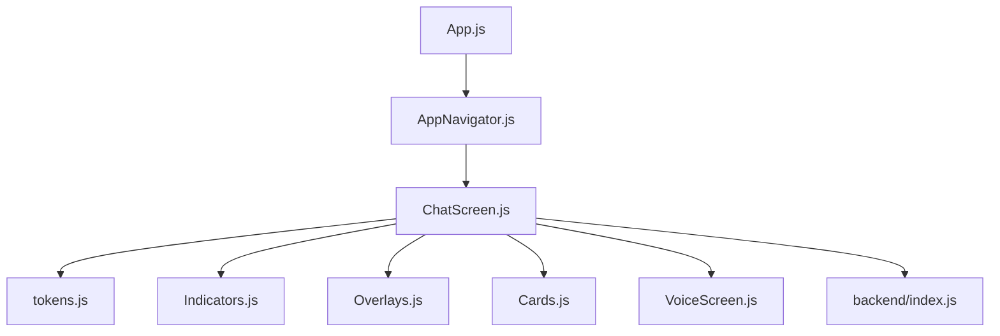
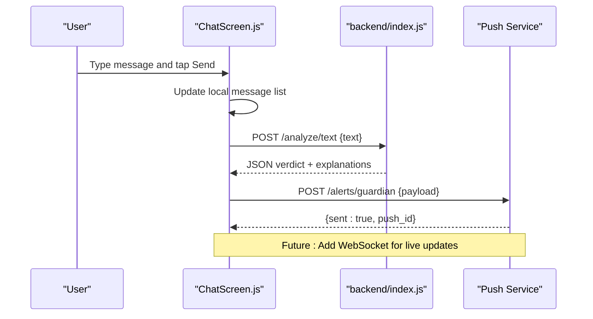
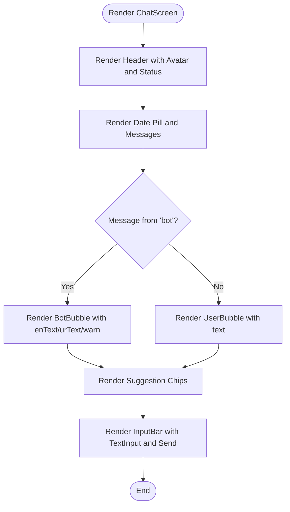
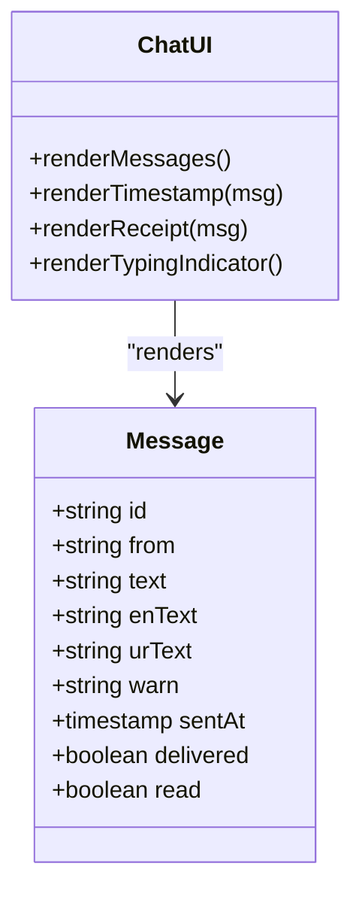
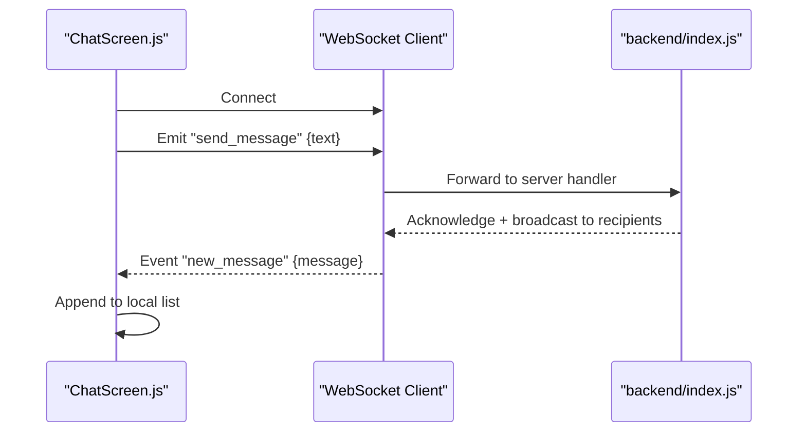
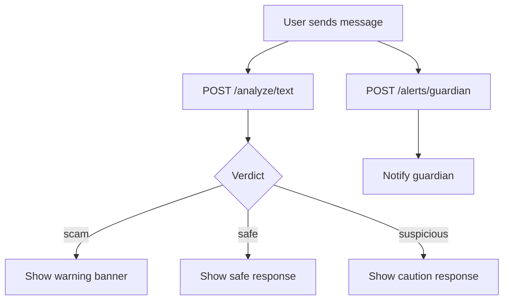
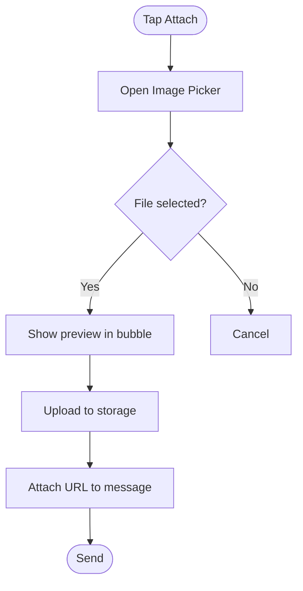
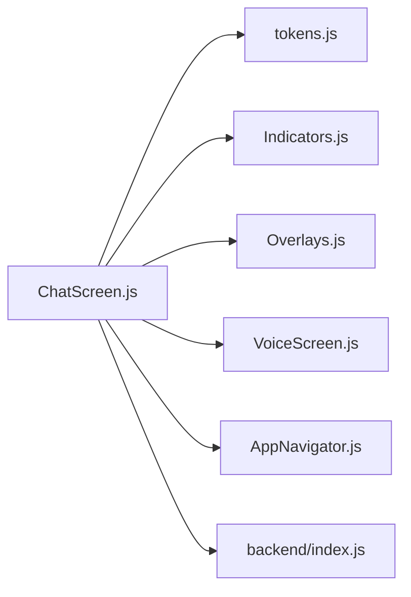

# ChatBot Guardian Interface

<cite>
**Referenced Files in This Document**
- [ChatScreen.js](file://src/screens/ChatScreen.js)
- [AppNavigator.js](file://src/navigation/AppNavigator.js)
- [tokens.js](file://src/theme/tokens.js)
- [index.js](file://backend/index.js)
- [package.json](file://package.json)
- [VoiceScreen.js](file://src/screens/VoiceScreen.js)
- [Overlays.js](file://src/components/Overlays.js)
- [Indicators.js](file://src/components/Indicators.js)
- [Cards.js](file://src/components/Cards.js)
</cite>

## Table of Contents
1. [Introduction](#introduction)
2. [Project Structure](#project-structure)
3. [Core Components](#core-components)
4. [Architecture Overview](#architecture-overview)
5. [Detailed Component Analysis](#detailed-component-analysis)
6. [Dependency Analysis](#dependency-analysis)
7. [Performance Considerations](#performance-considerations)
8. [Troubleshooting Guide](#troubleshooting-guide)
9. [Conclusion](#conclusion)
10. [Appendices](#appendices)

## Introduction
This document provides comprehensive documentation for the ChatScreen that implements a WhatsApp-inspired messaging interface for guardian communication within the Safe Pakistan application. It covers chat bubble design patterns, message timestamps, read receipts, typing indicators, real-time messaging capabilities, backend integration for persistence and delivery notifications, attachment handling (screenshots, documents, location), accessibility features including voice support and screen reader compatibility, and security measures for encryption and privacy protection.

The current implementation focuses on a local UI with sample messages and a send input bar. The backend exposes endpoints for analysis and push alerts, which can be extended to support persistent messaging and real-time updates.

## Project Structure
The ChatScreen is part of a React Native app using Expo and React Navigation. The navigation stack includes a bottom tab navigator where the Chat tab renders the ChatScreen. Theme tokens define colors, gradients, fonts, spacing, and shadows used across screens. The backend is an Express server exposing endpoints for text analysis and push notifications.

**Diagram sources**
- [AppNavigator.js:1-121](file://src/navigation/AppNavigator.js#L1-L121)
- [ChatScreen.js:1-186](file://src/screens/ChatScreen.js#L1-L186)
- [tokens.js:1-129](file://src/theme/tokens.js#L1-L129)
- [index.js:1-82](file://backend/index.js#L1-L82)

**Section sources**
- [AppNavigator.js:1-121](file://src/navigation/AppNavigator.js#L1-L121)
- [ChatScreen.js:1-186](file://src/screens/ChatScreen.js#L1-L186)
- [tokens.js:1-129](file://src/theme/tokens.js#L1-L129)
- [index.js:1-82](file://backend/index.js#L1-L82)

## Core Components
- ChatScreen: Renders the chat header, scrollable message list, suggestions, and input bar with microphone icon and send button. Uses theme tokens for consistent styling and supports Urdu and English text rendering.
- Indicators: Provides small status badges and chips used throughout the app; can be reused for message status indicators like read receipts or typing indicators.
- Overlays: Includes animated loading components and a bottom sheet modal; useful for showing processing states during message sending or attachment handling.
- Cards: Reusable cards and avatars; can be adapted for contact avatars and message metadata.
- VoiceScreen: Demonstrates voice interaction patterns and state management; relevant for adding voice messages to chats.
- Backend index.js: Express server with endpoints for text analysis and push notifications; foundation for message persistence and delivery notifications.

**Section sources**
- [ChatScreen.js:1-186](file://src/screens/ChatScreen.js#L1-L186)
- [Indicators.js:1-106](file://src/components/Indicators.js#L1-L106)
- [Overlays.js:1-123](file://src/components/Overlays.js#L1-L123)
- [Cards.js:1-193](file://src/components/Cards.js#L1-L193)
- [VoiceScreen.js:1-98](file://src/screens/VoiceScreen.js#L1-L98)
- [index.js:1-82](file://backend/index.js#L1-L82)

## Architecture Overview
The ChatScreen currently displays static messages and allows user input without network calls. The backend provides endpoints that can be integrated to persist messages, analyze content, and send push notifications. Real-time updates can be implemented via WebSocket or polling against these endpoints.

**Diagram sources**
- [ChatScreen.js:15-88](file://src/screens/ChatScreen.js#L15-L88)
- [index.js:63-80](file://backend/index.js#L63-L80)

## Detailed Component Analysis

### ChatScreen: Chat Bubble Design Patterns
- Header: Displays bot avatar with gradient background, online indicator dot, title “Guardian”, AI badge, and status line indicating online presence and bilingual replies.
- Message List: ScrollView with date pill separator and mapped message components. Bot messages show left-aligned bubbles with optional English and Urdu text and warning banners. User messages show right-aligned gradient bubbles.
- Suggestions: Horizontal scrollable chips for quick prompts.
- Input Bar: Rounded input field with microphone icon and gradient send button. KeyboardAvoidingView ensures proper layout on iOS and Android.

**Diagram sources**
- [ChatScreen.js:25-88](file://src/screens/ChatScreen.js#L25-L88)
- [ChatScreen.js:91-123](file://src/screens/ChatScreen.js#L91-L123)

**Section sources**
- [ChatScreen.js:25-88](file://src/screens/ChatScreen.js#L25-L88)
- [ChatScreen.js:91-123](file://src/screens/ChatScreen.js#L91-L123)

### Message Timestamps, Read Receipts, Typing Indicators
- Current state: No timestamp or read receipt fields are present in the message data structure.
- Implementation guidance:
  - Add timestamp fields to message objects and render them below each bubble.
  - Add read receipt indicators (single check, double check) next to timestamps.
  - Add typing indicators when the user is composing a message; use a small animated component similar to the LoadingShield pattern.

[No sources needed since this diagram shows conceptual extension]

### Real-Time Messaging Capabilities
- Current state: No WebSocket or polling logic is implemented in ChatScreen.
- Backend readiness: The Express server exposes endpoints for analysis and push notifications. These can be extended to support:
  - Persistent message storage and retrieval
  - Real-time updates via WebSocket (e.g., using socket.io)
  - Delivery and read receipts via event streams
- Recommended approach:
  - Use WebSocket for bidirectional communication between client and server.
  - On send, emit a message event; on receive, append to local message list.
  - Use polling fallback if WebSocket is unavailable.

[No sources needed since this diagram shows conceptual flow]

### Integration with Backend Services
- Text analysis endpoint: POST /analyze/text returns verdict, risk score, confidence, scam type, evidence spans, and multilingual explanations. Can be used to enrich bot responses with safety insights.
- Push notification endpoint: POST /alerts/guardian simulates push delivery; can be wired to notify guardians about suspicious messages.
- Pairing endpoint: POST /family/pair generates pairing codes for family linkage; can be used to associate chats with specific guardians.

**Diagram sources**
- [index.js:63-80](file://backend/index.js#L63-L80)

**Section sources**
- [index.js:63-80](file://backend/index.js#L63-L80)

### Attachment Handling
- Current state: ChatScreen does not include attachment UI or handlers.
- Available tools:
  - expo-image-picker is listed in dependencies, enabling screenshot/document selection.
  - VoiceScreen demonstrates voice recording patterns and state transitions suitable for voice messages.
- Implementation guidance:
  - Add an attachment button in the input bar to open image picker.
  - Render attachments within bubbles with preview thumbnails and file metadata.
  - For location sharing, integrate a map picker and embed coordinates in message payloads.
  - Upload attachments to a secure storage service and reference URLs in messages.

[No sources needed since this diagram shows conceptual workflow]

### Accessibility Features
- Voice message support: VoiceScreen shows state machine patterns (idle/listening/processing/done) and animations suitable for voice interactions. Integrate speech-to-text and text-to-speech APIs for full accessibility.
- Screen reader compatibility:
  - Ensure all interactive elements have accessible labels and roles.
  - Provide descriptive hints for buttons (e.g., “Send message”, “Attach file”).
  - Announce message status changes (delivered/read) via accessibility events.
- Multilingual support: Use typography utilities for correct Urdu rendering and RTL alignment.

**Section sources**
- [VoiceScreen.js:1-98](file://src/screens/VoiceScreen.js#L1-L98)
- [tokens.js:56-68](file://src/theme/tokens.js#L56-L68)

### Security Measures
- Current state: No encryption or transport security is implemented in the frontend or backend shown.
- Recommendations:
  - Use HTTPS/TLS for all API calls.
  - Implement end-to-end encryption for sensitive messages using libraries like react-native-encrypted-storage or WebCrypto.
  - Validate and sanitize inputs on both client and server to prevent injection attacks.
  - Rate-limit endpoints and add authentication/authorization for guardian access.
  - Store secrets (API keys) securely using environment variables and secret managers.

[No sources needed since this section provides general guidance]

## Dependency Analysis
The ChatScreen depends on theme tokens for styling and uses reusable components for indicators and overlays. The navigation integrates the ChatScreen into the main tabs. The backend provides endpoints that can be consumed by the client for analysis and notifications.

**Diagram sources**
- [ChatScreen.js:1-186](file://src/screens/ChatScreen.js#L1-L186)
- [tokens.js:1-129](file://src/theme/tokens.js#L1-L129)
- [Indicators.js:1-106](file://src/components/Indicators.js#L1-L106)
- [Overlays.js:1-123](file://src/components/Overlays.js#L1-L123)
- [VoiceScreen.js:1-98](file://src/screens/VoiceScreen.js#L1-L98)
- [AppNavigator.js:1-121](file://src/navigation/AppNavigator.js#L1-L121)
- [index.js:1-82](file://backend/index.js#L1-L82)

**Section sources**
- [package.json:1-41](file://package.json#L1-L41)
- [ChatScreen.js:1-186](file://src/screens/ChatScreen.js#L1-L186)
- [index.js:1-82](file://backend/index.js#L1-L82)

## Performance Considerations
- Virtualize long message lists using FlatList or SectionList to improve scrolling performance.
- Debounce input changes and avoid unnecessary re-renders by memoizing components.
- Batch network requests and implement caching for repeated analyses.
- Optimize images and attachments by compressing before upload and lazy-loading previews.
- Use WebSocket for efficient real-time updates instead of frequent polling.

[No sources needed since this section provides general guidance]

## Troubleshooting Guide
- Input not submitting: Verify TextInput value binding and ensure send handler is attached.
- Layout issues on keyboard open: Confirm KeyboardAvoidingView behavior per platform.
- Urdu text misalignment: Ensure separate Text nodes for Urdu and English with correct font families and RTL settings.
- Backend errors: Check CORS configuration and payload format for /analyze/text and /alerts/guardian endpoints.
- Missing dependencies: Ensure expo-image-picker and other required packages are installed and linked.

**Section sources**
- [ChatScreen.js:68-86](file://src/screens/ChatScreen.js#L68-L86)
- [index.js:1-82](file://backend/index.js#L1-L82)
- [package.json:11-34](file://package.json#L11-L34)

## Conclusion
The ChatScreen provides a solid foundation for a WhatsApp-inspired guardian messaging interface with bilingual support and a clean design system. To achieve full functionality, extend the UI with timestamps, read receipts, typing indicators, attachment handling, and real-time messaging via WebSocket or polling. Integrate the backend endpoints for message analysis and push notifications, and implement robust security measures to protect sensitive communications.

[No sources needed since this section summarizes without analyzing specific files]

## Appendices
- Environment setup: Configure backend environment variables for API keys and base URLs.
- Testing: Add unit tests for message rendering and integration tests for backend endpoints.
- Deployment: Package the Expo app and deploy the backend to a secure hosting provider.

[No sources needed since this section provides general guidance]