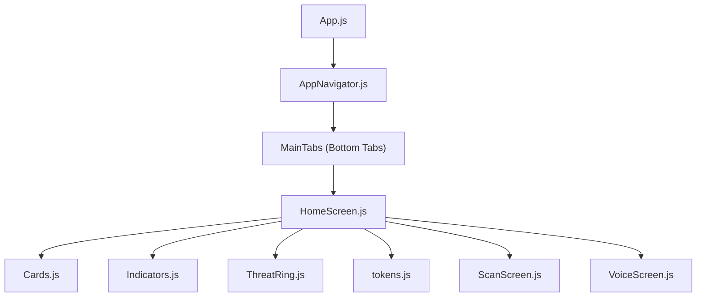
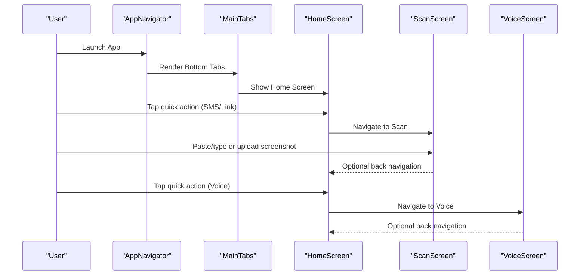
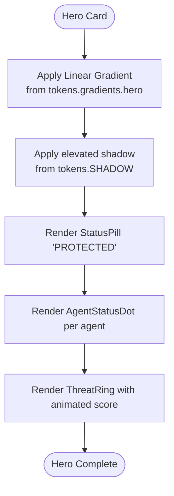
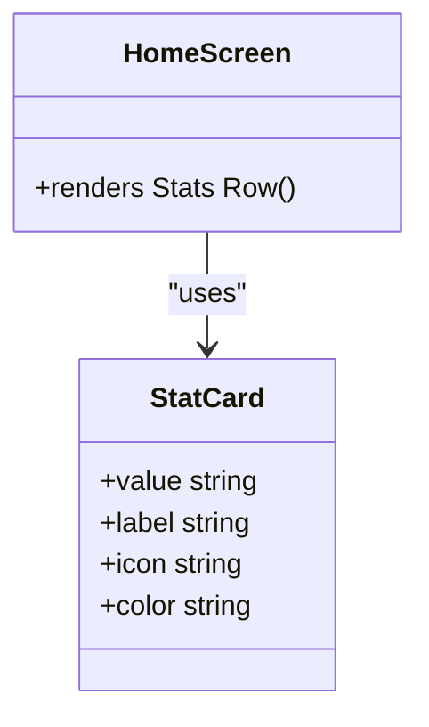
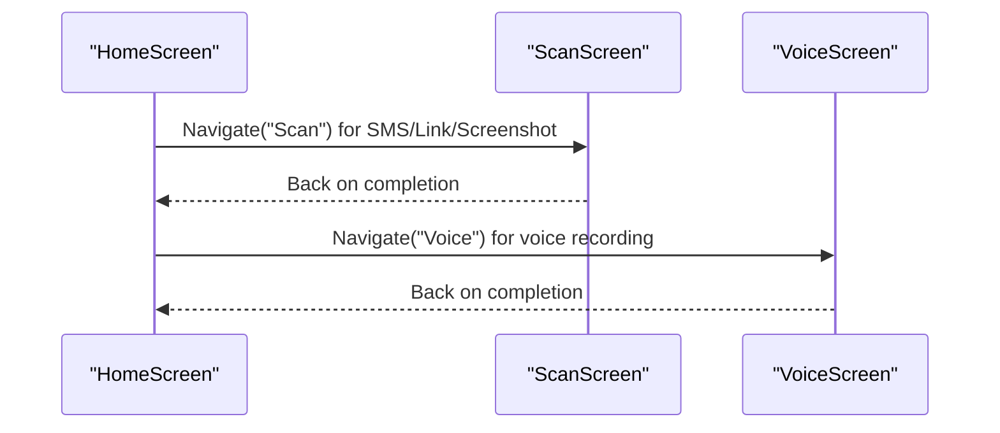
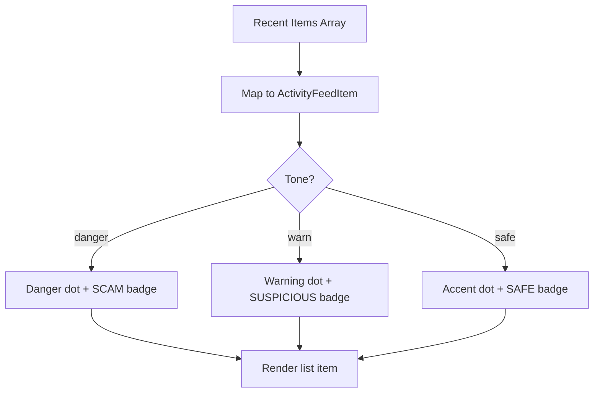
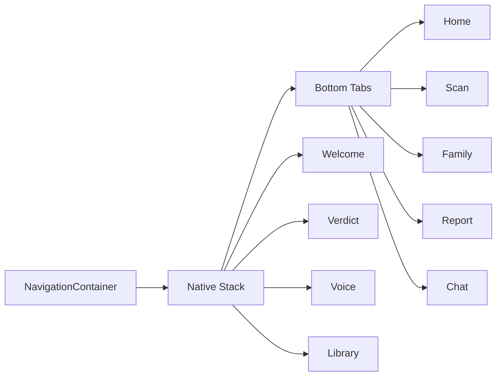
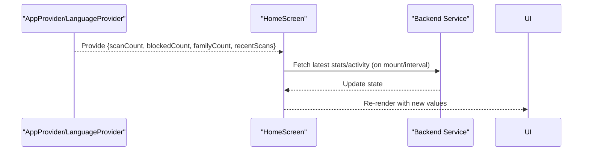
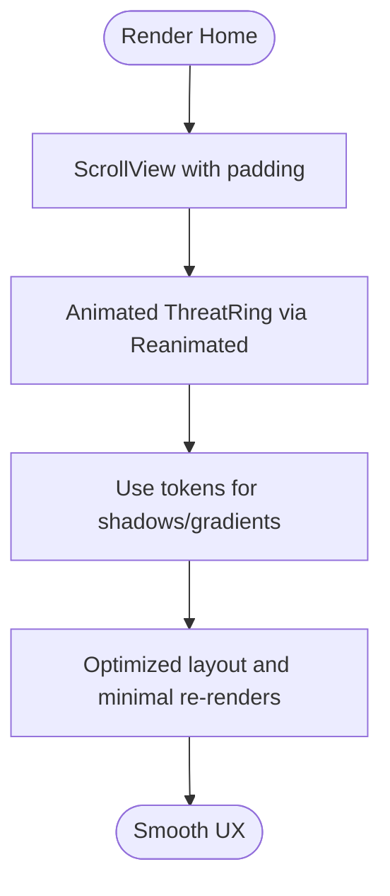
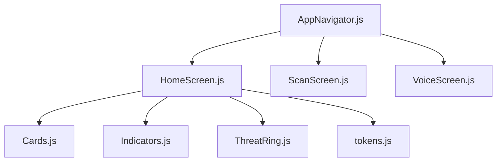

# Home Dashboard

<cite>
**Referenced Files in This Document**
- [App.js](file://App.js)
- [HomeScreen.js](file://src/screens/HomeScreen.js)
- [AppNavigator.js](file://src/navigation/AppNavigator.js)
- [Cards.js](file://src/components/Cards.js)
- [Indicators.js](file://src/components/Indicators.js)
- [ThreatRing.js](file://src/components/ThreatRing.js)
- [tokens.js](file://src/theme/tokens.js)
- [ScanScreen.js](file://src/screens/ScanScreen.js)
- [VoiceScreen.js](file://src/screens/VoiceScreen.js)
</cite>

## Table of Contents
1. [Introduction](#introduction)
2. [Project Structure](#project-structure)
3. [Core Components](#core-components)
4. [Architecture Overview](#architecture-overview)
5. [Detailed Component Analysis](#detailed-component-analysis)
6. [Dependency Analysis](#dependency-analysis)
7. [Performance Considerations](#performance-considerations)
8. [Troubleshooting Guide](#troubleshooting-guide)
9. [Conclusion](#conclusion)

## Introduction
This document explains the Home dashboard that serves as the main application interface. It covers:
- The glass hero section with gradient and elevation effects
- Statistics display for protection metrics, scans, and family safety
- Quick actions to SMS scanning, voice recording, screenshot analysis, and link verification
- Activity feed showing recent threats and protection history
- Navigation integration via bottom tabs and stack navigation
- State management hooks (prepared for real-time updates), data binding points, and performance techniques used for smooth scrolling and animations

## Project Structure
The Home dashboard is implemented as a screen within a React Navigation setup. It composes reusable UI components and design tokens to present a cohesive experience.

**Diagram sources**
- [App.js:17-40](file://App.js#L17-L40)
- [AppNavigator.js:32-77](file://src/navigation/AppNavigator.js#L32-L77)
- [HomeScreen.js:15-19](file://src/screens/HomeScreen.js#L15-L19)
- [Cards.js:1-10](file://src/components/Cards.js#L1-L10)
- [Indicators.js:1-9](file://src/components/Indicators.js#L1-L9)
- [ThreatRing.js:1-14](file://src/components/ThreatRing.js#L1-L14)
- [tokens.js:1-5](file://src/theme/tokens.js#L1-L5)

**Section sources**
- [App.js:17-40](file://App.js#L17-L40)
- [AppNavigator.js:32-77](file://src/navigation/AppNavigator.js#L32-L77)
- [HomeScreen.js:15-19](file://src/screens/HomeScreen.js#L15-L19)

## Core Components
- HomeScreen: Main dashboard layout with greeting, hero card, stats row, and activity feed.
- Cards: Reusable building blocks including StatCard, SectionHeader, ActivityFeedItem, Avatar.
- Indicators: StatusPill, VerdictBadge, AgentStatusDot for inline status and verdicts.
- ThreatRing: Animated SVG ring visualizing protection score.
- Theme tokens: Centralized colors, typography, spacing, radius, shadows, gradients, and motion timings.

Key responsibilities:
- HomeScreen orchestrates layout and user interactions.
- Cards and Indicators provide consistent UI primitives.
- ThreatRing animates the protection score.
- Tokens ensure design consistency across screens.

**Section sources**
- [HomeScreen.js:23-104](file://src/screens/HomeScreen.js#L23-L104)
- [Cards.js:13-110](file://src/components/Cards.js#L13-L110)
- [Indicators.js:11-77](file://src/components/Indicators.js#L11-L77)
- [ThreatRing.js:18-83](file://src/components/ThreatRing.js#L18-L83)
- [tokens.js:7-129](file://src/theme/tokens.js#L7-L129)

## Architecture Overview
The app uses React Navigation v6 with a native stack and bottom tabs. The Home screen is one of the primary tab destinations and integrates with other screens like Scan and Voice through navigation.

**Diagram sources**
- [AppNavigator.js:58-77](file://src/navigation/AppNavigator.js#L58-L77)
- [HomeScreen.js:52-57](file://src/screens/HomeScreen.js#L52-L57)
- [ScanScreen.js:18-23](file://src/screens/ScanScreen.js#L18-L23)
- [VoiceScreen.js:27-31](file://src/screens/VoiceScreen.js#L27-L31)

## Detailed Component Analysis

### Glass Hero Effect
- Visual composition: A gradient hero card using LinearGradient with brand colors and elevated shadow.
- Transparency and depth: Uses token-based gradients and SHADOW.elevated to create a layered, glass-like appearance.
- Content: Status pill indicating protection state, headline text, agent status dots, and an animated ThreatRing.

Implementation highlights:
- Gradient background from tokens.gradients.hero.
- Elevated shadow from tokens.SHADOW.elevated.
- AgentStatusDot shows active agents (SMS, VOICE, LINK, FAMILY).
- ThreatRing displays a protection score with animation.

**Diagram sources**
- [HomeScreen.js:61-82](file://src/screens/HomeScreen.js#L61-L82)
- [tokens.js:46-54](file://src/theme/tokens.js#L46-L54)
- [tokens.js:95-119](file://src/theme/tokens.js#L95-L119)
- [Indicators.js:60-77](file://src/components/Indicators.js#L60-L77)
- [ThreatRing.js:18-83](file://src/components/ThreatRing.js#L18-L83)

**Section sources**
- [HomeScreen.js:61-82](file://src/screens/HomeScreen.js#L61-L82)
- [tokens.js:46-54](file://src/theme/tokens.js#L46-L54)
- [tokens.js:95-119](file://src/theme/tokens.js#L95-L119)
- [Indicators.js:60-77](file://src/components/Indicators.js#L60-L77)
- [ThreatRing.js:18-83](file://src/components/ThreatRing.js#L18-L83)

### Statistics Display
- Three stat cards show key metrics:
  - Threats Blocked
  - Total Scans
  - Family Safe
- Each card uses a consistent icon, value, and label style.

Behavior:
- Values are currently static in the HomeScreen but designed to be bound to context/state for live updates.
- Styling leverages tokens for color, radius, and shadow.

**Diagram sources**
- [Cards.js:47-59](file://src/components/Cards.js#L47-L59)
- [HomeScreen.js:84-89](file://src/screens/HomeScreen.js#L84-L89)

**Section sources**
- [HomeScreen.js:84-89](file://src/screens/HomeScreen.js#L84-L89)
- [Cards.js:47-59](file://src/components/Cards.js#L47-L59)

### Quick Actions
- The HomeScreen includes a QuickTile component pattern for quick actions. While not rendered in the current HomeScreen snippet, the pattern is available for integrating:
  - SMS scanning
  - Voice recording
  - Screenshot analysis
  - Link verification
- Integration points:
  - Navigate to ScanScreen for SMS/link input and screenshot capture.
  - Navigate to VoiceScreen for voice recording and processing.

Navigation flows:
- From Home to Scan: Direct navigation to paste/type or upload content.
- From Home to Voice: Direct navigation to start voice interaction.

**Diagram sources**
- [HomeScreen.js:107-127](file://src/screens/HomeScreen.js#L107-L127)
- [ScanScreen.js:18-23](file://src/screens/ScanScreen.js#L18-L23)
- [VoiceScreen.js:27-31](file://src/screens/VoiceScreen.js#L27-L31)

**Section sources**
- [HomeScreen.js:107-127](file://src/screens/HomeScreen.js#L107-L127)
- [ScanScreen.js:18-23](file://src/screens/ScanScreen.js#L18-L23)
- [VoiceScreen.js:27-31](file://src/screens/VoiceScreen.js#L27-L31)

### Activity Feed
- Displays recent threats and protection events with tone indicators and verdict badges.
- Uses ActivityFeedItem for each entry, with VerdictBadge and time stamps.

Features:
- Color-coded dots for danger/warn/safe tones.
- Compact layout with type, message, verdict badge, and timestamp.

**Diagram sources**
- [HomeScreen.js:28-32](file://src/screens/HomeScreen.js#L28-L32)
- [Cards.js:88-110](file://src/components/Cards.js#L88-L110)
- [Indicators.js:11-27](file://src/components/Indicators.js#L11-L27)

**Section sources**
- [HomeScreen.js:28-32](file://src/screens/HomeScreen.js#L28-L32)
- [Cards.js:88-110](file://src/components/Cards.js#L88-L110)
- [Indicators.js:11-27](file://src/components/Indicators.js#L11-L27)

### Navigation Integration
- Bottom tabs include Home, Scan, Family, Report, Chat.
- Stack navigator wraps tabs and additional full-screen flows (Welcome, Verdict, Voice, Library, etc.).
- Deep linking is supported by React Navigation’s NavigationContainer; routes can be configured for deep links at the container level.

Key behaviors:
- Home is a tab destination.
- Scan and Voice are navigated to from Home or other flows.
- Stack transitions use fade or slide_from_bottom for specific screens.

**Diagram sources**
- [AppNavigator.js:32-100](file://src/navigation/AppNavigator.js#L32-L100)

**Section sources**
- [AppNavigator.js:32-100](file://src/navigation/AppNavigator.js#L32-L100)

### State Management and Data Binding
- Prepared hooks:
  - useAppContext: intended to provide scanCount, blockedCount, familyCount, recentScans.
  - useLanguageContext: intended to provide language and translation function t().
- Current implementation:
  - HomeScreen uses local variables for demo values.
  - Context providers are commented out in App.js, ready to be enabled for real-time updates.

Integration points:
- Replace local values with context-derived data for live statistics and activity feed.
- Bind recentScans to ActivityFeedItem list for dynamic updates.

**Diagram sources**
- [App.js:18-19](file://App.js#L18-L19)
- [HomeScreen.js:20-25](file://src/screens/HomeScreen.js#L20-L25)

**Section sources**
- [App.js:18-19](file://App.js#L18-L19)
- [HomeScreen.js:20-25](file://src/screens/HomeScreen.js#L20-L25)

### Performance Optimization Techniques
- Smooth scrolling: ScrollView with padding and hidden scroll indicator for cleaner UX.
- Animations:
  - ThreatRing uses react-native-reanimated to animate strokeDashoffset smoothly.
  - VoiceScreen uses reanimated for ripple and waveform animations.
- Design tokens:
  - Centralized shadows and gradients reduce duplication and improve consistency.
- Layout efficiency:
  - Flat lists or memoization can be added when scaling the activity feed.
  - Avoid unnecessary re-renders by keeping small components pure and leveraging keys.

**Diagram sources**
- [HomeScreen.js:37-40](file://src/screens/HomeScreen.js#L37-L40)
- [ThreatRing.js:11-13](file://src/components/ThreatRing.js#L11-L13)
- [ThreatRing.js:29-38](file://src/components/ThreatRing.js#L29-L38)
- [tokens.js:95-119](file://src/theme/tokens.js#L95-L119)

**Section sources**
- [HomeScreen.js:37-40](file://src/screens/HomeScreen.js#L37-L40)
- [ThreatRing.js:11-13](file://src/components/ThreatRing.js#L11-L13)
- [ThreatRing.js:29-38](file://src/components/ThreatRing.js#L29-L38)
- [tokens.js:95-119](file://src/theme/tokens.js#L95-L119)

## Dependency Analysis
- HomeScreen depends on:
  - Cards (StatCard, SectionHeader, ActivityFeedItem, Avatar)
  - Indicators (StatusPill, AgentStatusDot)
  - ThreatRing for animated score visualization
  - Theme tokens for consistent styling
- Navigation depends on:
  - React Navigation v6 (Stack and Tabs)
  - Screens: Home, Scan, Voice, Family, Report, Chat, Welcome, Verdict, Library, etc.

**Diagram sources**
- [HomeScreen.js:15-19](file://src/screens/HomeScreen.js#L15-L19)
- [AppNavigator.js:19-30](file://src/navigation/AppNavigator.js#L19-L30)

**Section sources**
- [HomeScreen.js:15-19](file://src/screens/HomeScreen.js#L15-L19)
- [AppNavigator.js:19-30](file://src/navigation/AppNavigator.js#L19-L30)

## Performance Considerations
- Use ScrollView judiciously; consider FlatList for large activity feeds to optimize rendering.
- Keep animations GPU-accelerated via Reanimated shared values.
- Leverage tokens for consistent shadow and gradient usage to avoid redundant computations.
- Debounce or throttle backend calls for real-time updates to prevent excessive re-renders.
- Memoize expensive components if needed (e.g., custom charts or heavy lists).

[No sources needed since this section provides general guidance]

## Troubleshooting Guide
- If the hero appears flat:
  - Ensure LinearGradient and SHADOW.elevated are applied correctly.
  - Verify tokens.gradients.hero and tokens.SHADOW.elevated are imported and used.
- If ThreatRing does not animate:
  - Confirm react-native-svg and react-native-reanimated are installed and linked.
  - Check that score prop changes trigger useEffect and progress animation.
- If navigation fails:
  - Verify routes are registered in AppNavigator.
  - Ensure navigation prop is passed correctly to HomeScreen.
- If activity feed does not update:
  - Enable AppProvider and LanguageProvider in App.js.
  - Bind recentScans from context to the ActivityFeedItem list.

**Section sources**
- [HomeScreen.js:61-82](file://src/screens/HomeScreen.js#L61-L82)
- [ThreatRing.js:11-13](file://src/components/ThreatRing.js#L11-L13)
- [AppNavigator.js:80-100](file://src/navigation/AppNavigator.js#L80-L100)
- [App.js:18-19](file://App.js#L18-L19)

## Conclusion
The Home dashboard provides a polished, accessible interface with a glass-inspired hero, clear statistics, quick actions, and an activity feed. It integrates seamlessly with bottom tabs and stack navigation, supports animations for engaging feedback, and is structured to integrate with context-driven state for real-time updates. With centralized design tokens and reusable components, the codebase remains maintainable and scalable as features grow.

[No sources needed since this section summarizes without analyzing specific files]