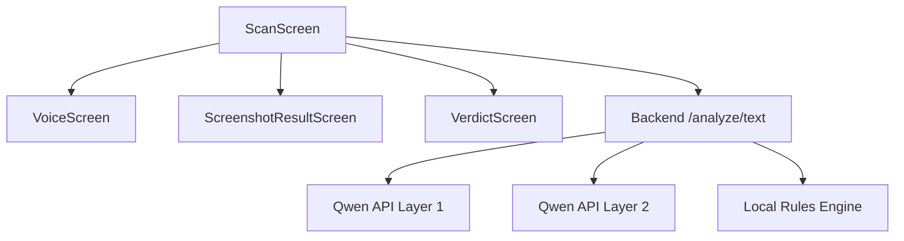
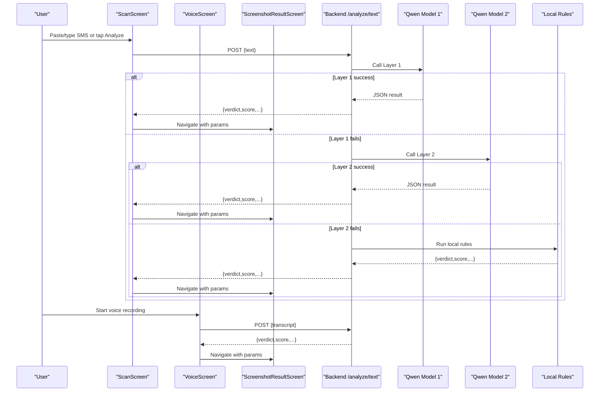
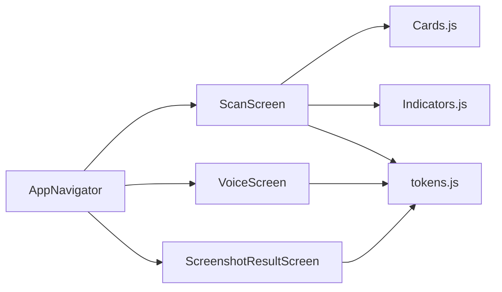

# Scan Interface

<cite>
**Referenced Files in This Document**
- [ScanScreen.js](file://src/screens/ScanScreen.js)
- [VoiceScreen.js](file://src/screens/VoiceScreen.js)
- [ScreenshotResultScreen.js](file://src/screens/ScreenshotResultScreen.js)
- [AppNavigator.js](file://src/navigation/AppNavigator.js)
- [index.js](file://backend/index.js)
- [package.json](file://package.json)
- [Cards.js](file://src/components/Cards.js)
- [Indicators.js](file://src/components/Indicators.js)
- [tokens.js](file://src/theme/tokens.js)
</cite>

## Table of Contents
1. Introduction
2. Project Structure
3. Core Components
4. Architecture Overview
5. Detailed Component Analysis
6. Dependency Analysis
7. Performance Considerations
8. Troubleshooting Guide
9. Conclusion

## Introduction
This document explains the Scan interface that serves as the primary threat detection entry point for Safe Pakistan. It covers multi-modal input (SMS text, screenshot capture via image picker, voice recording), analysis initiation with loading and progress states, integration with backend AI services, error handling for network failures, input validation patterns, file size constraints for screenshots, audio recording quality settings, user feedback during processing, and result presentation patterns.

## Project Structure
The scan workflow spans several screens and a backend service:
- ScanScreen: Primary UI to paste/type SMS, initiate screenshot capture, start voice recording, and trigger analysis.
- VoiceScreen: Full-screen voice agent with animated mic, waveform visualization, and language selection.
- ScreenshotResultScreen: Displays screenshot analysis results including verdict, score, and detected issues.
- AppNavigator: Registers routes and navigation between screens.
- Backend index.js: Provides /analyze/text endpoint with layered model fallback and local rules engine.
- Shared components and theme tokens are used across screens for consistent UI.

**Diagram sources**
- [ScanScreen.js:15-23](file://src/screens/ScanScreen.js#L15-L23)
- [VoiceScreen.js:27-119](file://src/screens/VoiceScreen.js#L27-L119)
- [ScreenshotResultScreen.js:21-109](file://src/screens/ScreenshotResultScreen.js#L21-L109)
- [AppNavigator.js:80-101](file://src/navigation/AppNavigator.js#L80-L101)
- [index.js:63-70](file://backend/index.js#L63-L70)

**Section sources**
- [ScanScreen.js:15-96](file://src/screens/ScanScreen.js#L15-L96)
- [VoiceScreen.js:27-119](file://src/screens/VoiceScreen.js#L27-L119)
- [ScreenshotResultScreen.js:21-109](file://src/screens/ScreenshotResultScreen.js#L21-L109)
- [AppNavigator.js:80-101](file://src/navigation/AppNavigator.js#L80-L101)
- [index.js:63-70](file://backend/index.js#L63-L70)

## Core Components
- ScanScreen: Provides an input card for pasting or typing SMS, chips for screenshot capture, voice recording, and sharing, and a primary “Analyze” button that navigates to results.
- VoiceScreen: Implements a state machine (idle/listening/processing/done) with animated mic ripples and waveform visualization; includes language chips for English, Urdu, and Roman Urdu.
- ScreenshotResultScreen: Renders the picked image thumbnail, verdict badge, threat score, number of issues, and actionable buttons like block sender and re-scan.
- AppNavigator: Defines stack and tab routes, including Verdict, Voice, and ScreenshotResult destinations.
- Backend index.js: Exposes /analyze/text with layered fallbacks to two Qwen models and a local rule-based engine when APIs fail.

Key UI building blocks:
- Cards.js: SectionHeader, ActivityFeedItem, EmptyState, etc., used by ScanScreen and other screens.
- Indicators.js: VerdictBadge and StatusPill for consistent status display.
- tokens.js: Centralized design tokens (colors, fonts, radii, shadows) ensuring visual consistency.

**Section sources**
- [ScanScreen.js:15-96](file://src/screens/ScanScreen.js#L15-L96)
- [VoiceScreen.js:27-119](file://src/screens/VoiceScreen.js#L27-L119)
- [ScreenshotResultScreen.js:21-109](file://src/screens/ScreenshotResultScreen.js#L21-L109)
- [AppNavigator.js:80-101](file://src/navigation/AppNavigator.js#L80-L101)
- [Cards.js:28-45](file://src/components/Cards.js#L28-L45)
- [Indicators.js:10-27](file://src/components/Indicators.js#L10-L27)
- [tokens.js:7-54](file://src/theme/tokens.js#L7-L54)

## Architecture Overview
The scan flow integrates front-end inputs with a resilient backend pipeline:
- User provides input via text, screenshot, or voice.
- The app triggers analysis, showing loading/progress feedback.
- Backend attempts Qwen API calls with two models; if both fail, it falls back to a local rules engine.
- Results include verdict, risk score, confidence, scam type, red flags, and explanations in multiple languages.
- Frontend renders results on dedicated screens with clear actions.

**Diagram sources**
- [ScanScreen.js:18-23](file://src/screens/ScanScreen.js#L18-L23)
- [VoiceScreen.js:27-119](file://src/screens/VoiceScreen.js#L27-L119)
- [ScreenshotResultScreen.js:21-109](file://src/screens/ScreenshotResultScreen.js#L21-L109)
- [index.js:63-70](file://backend/index.js#L63-L70)

## Detailed Component Analysis

### ScanScreen: Multi-modal Input and Analysis Initiation
- Text input: Multiline TextInput supports pasting or typing SMS content.
- Screenshot capture: Chip labeled “Screenshot” is present; integration with expo-image-picker is indicated by comments and route usage in ScreenshotResultScreen.
- Voice recording: Chip labeled “Awaaz” navigates to VoiceScreen for full-screen voice interaction.
- Share action: Placeholder chip for sharing content.
- Analysis CTA: Gradient button triggers analyze function; currently navigates to Verdict with a sample payload. In production, this should call backend /analyze/text and handle loading states.

Input validation patterns:
- Basic presence check before sending to backend (e.g., ensure non-empty text).
- Optional length limits to avoid oversized payloads.
- Sanitization of input to remove unnecessary whitespace or control characters.

File size limitations for screenshots:
- Use expo-image-picker options to constrain max file size and resolution.
- Enforce maximum dimensions (e.g., width/height caps) and compression to reduce payload size.

Audio recording quality settings:
- Configure sampling rate, bit rate, and format suitable for transcription.
- Balance quality vs. performance; prefer efficient codecs for mobile.

User feedback mechanisms:
- Show loading indicators while calling backend.
- Provide progress messages (“Analyzing…”, “Processing voice…”).
- Handle errors gracefully with retry prompts and user-friendly messages.

Result presentation:
- Navigate to Verdict or ScreenshotResult with structured params: verdict, score, issues, explanation.
- Use VerdictBadge and issue lists to communicate findings clearly.

**Section sources**
- [ScanScreen.js:15-96](file://src/screens/ScanScreen.js#L15-L96)
- [package.json:11-20](file://package.json#L11-L20)

### VoiceScreen: Voice Recording and State Management
- State machine: idle → listening → processing → done.
- Animated mic with ripple rings and waveform visualization to indicate active listening.
- Language chips: EN, اردو, Roman Urdu for transcription context.
- Integration points: Hook into speech recognition and audio recording libraries; update state based on real-time events.

User feedback:
- Dynamic labels and hints guide users through recording.
- Visual cues (ripples, waveform) confirm microphone activity.

Error handling:
- Gracefully handle permission denials and recording failures.
- Provide retry flows and clear messaging.

**Section sources**
- [VoiceScreen.js:27-119](file://src/screens/VoiceScreen.js#L27-L119)
- [VoiceScreen.js:122-185](file://src/screens/VoiceScreen.js#L122-L185)

### ScreenshotResultScreen: Result Presentation
- Displays picked image thumbnail with zoom indicator.
- Shows verdict badge, threat score, and count of issues.
- Lists detected issues with concise descriptions.
- Action buttons: Block sender and re-scan.

Data contract:
- Accepts route.params.imageUri, score, and issues array.
- Uses shared components for badges and section headers.

Accessibility and clarity:
- Clear headings in English and Urdu.
- Consistent color coding for danger/safe statuses.

**Section sources**
- [ScreenshotResultScreen.js:21-109](file://src/screens/ScreenshotResultScreen.js#L21-L109)
- [Cards.js:28-45](file://src/components/Cards.js#L28-L45)
- [Indicators.js:10-27](file://src/components/Indicators.js#L10-L27)

### Backend Integration: /analyze/text Endpoint
- Accepts JSON payload with text field.
- Attempts Qwen API calls with two models; on failure, falls back to local rules engine.
- Returns standardized result object: verdict, score, confidence, scam_type, redFlags, explanations in multiple languages.

Error handling:
- Logs layer-specific errors and continues to next fallback.
- Ensures response always contains a valid structure even under failures.

Security and configuration:
- Reads base URL and API key from environment variables.
- Limits request body size to prevent abuse.

**Section sources**
- [index.js:1-14](file://backend/index.js#L1-L14)
- [index.js:16-43](file://backend/index.js#L16-L43)
- [index.js:45-70](file://backend/index.js#L45-L70)

## Dependency Analysis
- Navigation dependencies: AppNavigator registers Scan, Voice, Verdict, and ScreenshotResult routes.
- UI dependencies: ScanScreen uses Cards and Indicators for consistent layout and status display.
- Theme dependencies: All screens consume tokens for colors, fonts, and spacing.
- External libraries: expo-image-picker for screenshots, expo-av and expo-speech for voice workflows, react-native-reanimated for animations.

**Diagram sources**
- [AppNavigator.js:80-101](file://src/navigation/AppNavigator.js#L80-L101)
- [ScanScreen.js:11-13](file://src/screens/ScanScreen.js#L11-L13)
- [VoiceScreen.js:18-19](file://src/screens/VoiceScreen.js#L18-L19)
- [ScreenshotResultScreen.js:10-13](file://src/screens/ScreenshotResultScreen.js#L10-L13)
- [tokens.js:7-54](file://src/theme/tokens.js#L7-L54)

**Section sources**
- [AppNavigator.js:80-101](file://src/navigation/AppNavigator.js#L80-L101)
- [package.json:11-20](file://package.json#L11-L20)

## Performance Considerations
- Image optimization: Compress screenshots before upload; limit dimensions and file size to reduce network overhead.
- Audio efficiency: Use appropriate sampling rates and codecs to balance quality and bandwidth.
- Backend resilience: Layered model fallback minimizes downtime; local rules provide instant results when APIs are unavailable.
- UI responsiveness: Defer heavy computations off the main thread; use animations sparingly to maintain smooth interactions.

[No sources needed since this section provides general guidance]

## Troubleshooting Guide
Common issues and resolutions:
- Network failures: Backend logs layer errors and falls back to local rules; ensure client displays retry prompts and offline-friendly messages.
- Permission denied for microphone or camera: Prompt users to enable permissions in device settings; provide clear instructions.
- Large images causing timeouts: Enforce size limits and compression; show progress indicators during upload.
- Invalid JSON from AI models: Backend validates output shape; on failure, returns safe defaults and logs details for debugging.

Operational checks:
- Verify environment variables for API keys and base URLs.
- Confirm CORS and request body size limits are correctly configured.
- Monitor logs for repeated failures and adjust thresholds accordingly.

**Section sources**
- [index.js:63-70](file://backend/index.js#L63-L70)
- [package.json:11-20](file://package.json#L11-L20)

## Conclusion
The Scan interface offers a robust, multi-modal threat detection experience with clear user feedback and resilient backend integration. By combining text, screenshot, and voice inputs with layered AI analysis and local fallbacks, the system ensures reliability and usability. Adhering to input validation, file size constraints, and audio quality settings will further enhance performance and user trust.

[No sources needed since this section summarizes without analyzing specific files]