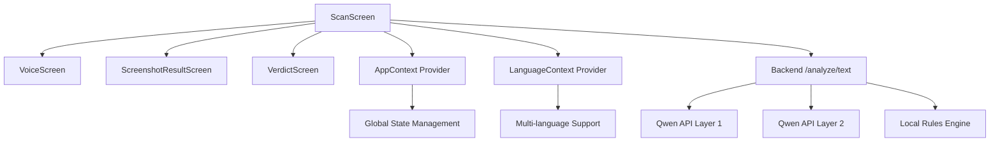
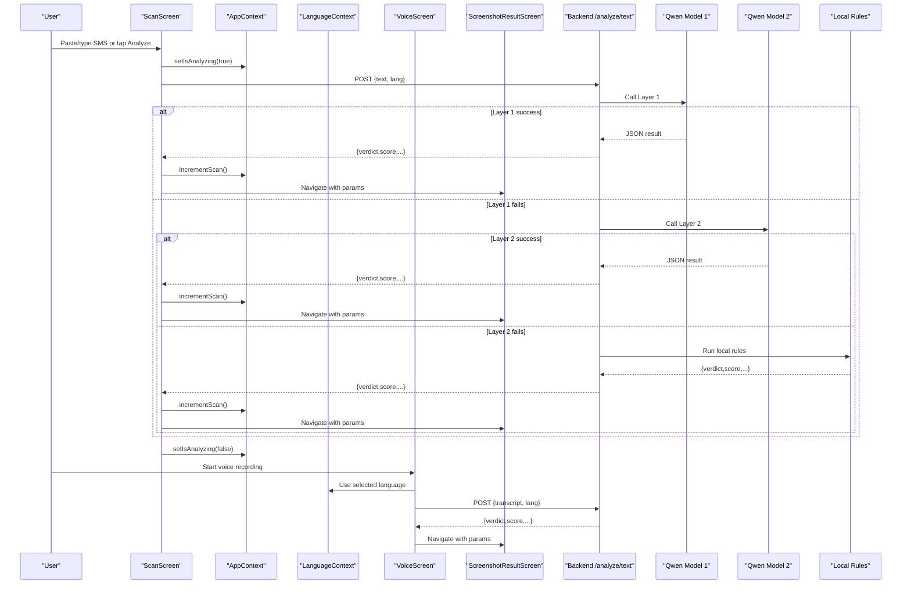
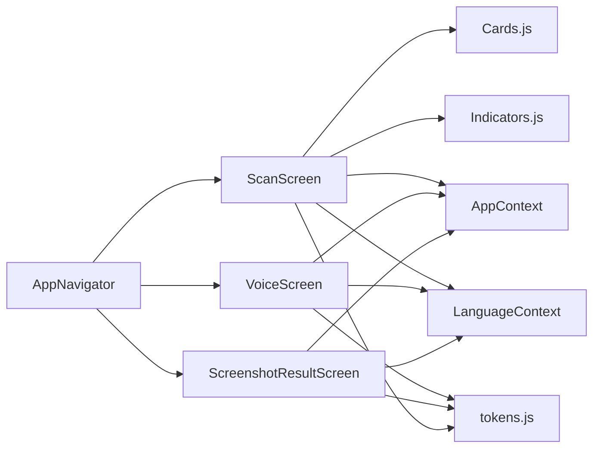

# Scan Interface

<cite>
**Referenced Files in This Document**
- [ScanScreen.js](file://src/screens/ScanScreen.js)
- [VoiceScreen.js](file://src/screens/VoiceScreen.js)
- [ScreenshotResultScreen.js](file://src/screens/ScreenshotResultScreen.js)
- [AppNavigator.js](file://src/navigation/AppNavigator.js)
- [AppContext.js](file://src/context/AppContext.js)
- [LanguageContext.js](file://src/context/LanguageContext.js)
- [index.js](file://backend/index.js)
- [package.json](file://package.json)
- [Cards.js](file://src/components/Cards.js)
- [Indicators.js](file://src/components/Indicators.js)
- [tokens.js](file://src/theme/tokens.js)
</cite>

## Update Summary
**Changes Made**
- Updated ScanScreen integration with new AppContext and LanguageContext providers
- Enhanced state management with global scanning workflow state
- Added context-aware language support and scan tracking
- Improved backend service integration patterns
- Updated navigation flow with context provider awareness

## Table of Contents
1. Introduction
2. Project Structure
3. Core Components
4. Architecture Overview
5. Detailed Component Analysis
6. Dependency Analysis
7. Performance Considerations
8. Troubleshooting Guide
9. Conclusion

## Introduction
This document explains the Scan interface that serves as the primary threat detection entry point for Safe Pakistan. It covers multi-modal input (SMS text, screenshot capture via image picker, voice recording), analysis initiation with loading and progress states, integration with backend AI services, error handling for network failures, input validation patterns, file size constraints for screenshots, audio recording quality settings, user feedback during processing, and result presentation patterns. The interface now integrates with global context providers for enhanced state management and cross-screen data sharing.

## Project Structure
The scan workflow spans several screens and a backend service with enhanced context provider integration:
- ScanScreen: Primary UI to paste/type SMS, initiate screenshot capture, start voice recording, and trigger analysis with global state management.
- VoiceScreen: Full-screen voice agent with animated mic, waveform visualization, and language selection.
- ScreenshotResultScreen: Displays screenshot analysis results including verdict, score, and detected issues.
- AppNavigator: Registers routes and navigation between screens with context provider awareness.
- AppContext: Global state management for scan counts, blocking status, and analysis state.
- LanguageContext: Multi-language support with English, Urdu, and Roman Urdu options.
- Backend index.js: Provides /analyze/text endpoint with layered model fallback and local rules engine.

**Diagram sources**
- [ScanScreen.js:33-47](file://src/screens/ScanScreen.js#L33-L47)
- [AppContext.js:10-34](file://src/context/AppContext.js#L10-L34)
- [LanguageContext.js:47-71](file://src/context/LanguageContext.js#L47-L71)
- [index.js:63-70](file://backend/index.js#L63-L70)

**Section sources**
- [ScanScreen.js:33-145](file://src/screens/ScanScreen.js#L33-L145)
- [VoiceScreen.js:31-124](file://src/screens/VoiceScreen.js#L31-L124)
- [ScreenshotResultScreen.js:21-109](file://src/screens/ScreenshotResultScreen.js#L21-L109)
- [AppNavigator.js:80-101](file://src/navigation/AppNavigator.js#L80-L101)
- [AppContext.js:10-34](file://src/context/AppContext.js#L10-L34)
- [LanguageContext.js:47-71](file://src/context/LanguageContext.js#L47-L71)
- [index.js:63-70](file://backend/index.js#L63-L70)

## Core Components
- ScanScreen: Provides an input card for pasting or typing SMS, chips for screenshot capture, voice recording, and sharing, and a primary "Analyze" button that navigates to results with enhanced state management through context providers.
- VoiceScreen: Implements a state machine (idle/listening/processing/done) with animated mic ripples and waveform visualization; includes language chips for English, Urdu, and Roman Urdu.
- ScreenshotResultScreen: Renders the picked image thumbnail, verdict badge, threat score, number of issues, and actionable buttons like block sender and re-scan.
- AppNavigator: Defines stack and tab routes, including Verdict, Voice, and ScreenshotResult destinations with context provider integration.
- AppContext: Global state provider managing scan counts, blocked counts, and analysis state across the application.
- LanguageContext: Multi-language context provider supporting English, Urdu, and Roman Urdu with translation functions and RTL support.
- Backend index.js: Exposes /analyze/text with layered fallbacks to two Qwen models and a local rule-based engine when APIs fail.

Key UI building blocks:
- Cards.js: SectionHeader, ActivityFeedItem, EmptyState, etc., used by ScanScreen and other screens.
- Indicators.js: VerdictBadge and StatusPill for consistent status display.
- tokens.js: Centralized design tokens (colors, fonts, radii, shadows) ensuring visual consistency.

**Section sources**
- [ScanScreen.js:33-145](file://src/screens/ScanScreen.js#L33-L145)
- [VoiceScreen.js:31-124](file://src/screens/VoiceScreen.js#L31-L124)
- [ScreenshotResultScreen.js:21-109](file://src/screens/ScreenshotResultScreen.js#L21-L109)
- [AppNavigator.js:80-101](file://src/navigation/AppNavigator.js#L80-L101)
- [AppContext.js:10-34](file://src/context/AppContext.js#L10-L34)
- [LanguageContext.js:47-71](file://src/context/LanguageContext.js#L47-L71)
- [Cards.js:28-45](file://src/components/Cards.js#L28-L45)
- [Indicators.js:10-27](file://src/components/Indicators.js#L10-L27)
- [tokens.js:7-54](file://src/theme/tokens.js#L7-L54)

## Architecture Overview
The scan flow integrates front-end inputs with enhanced context providers and a resilient backend pipeline:
- User provides input via text, screenshot, or voice with global state tracking.
- Context providers manage scan counts, analysis states, and language preferences across screens.
- The app triggers analysis, showing loading/progress feedback with context-aware state updates.
- Backend attempts Qwen API calls with two models; if both fail, it falls back to a local rules engine.
- Results include verdict, risk score, confidence, scam type, red flags, and explanations in multiple languages.
- Frontend renders results on dedicated screens with clear actions and updates global state.

**Diagram sources**
- [ScanScreen.js:42-47](file://src/screens/ScanScreen.js#L42-L47)
- [AppContext.js:15-27](file://src/context/AppContext.js#L15-L27)
- [LanguageContext.js:53-64](file://src/context/LanguageContext.js#L53-L64)
- [VoiceScreen.js:31-124](file://src/screens/VoiceScreen.js#L31-L124)
- [ScreenshotResultScreen.js:21-109](file://src/screens/ScreenshotResultScreen.js#L21-L109)
- [index.js:63-70](file://backend/index.js#L63-L70)

## Detailed Component Analysis

### ScanScreen: Multi-modal Input and Enhanced State Management
**Updated** Integrated with AppContext and LanguageContext providers for improved state management and cross-screen data sharing.

- Text input: Multiline TextInput supports pasting or typing SMS content with preset samples for quick testing.
- Screenshot capture: Chip labeled "Screenshot" is present; integration with expo-image-picker is indicated by comments and route usage in ScreenshotResultScreen.
- Voice recording: Chip labeled "Awaaz" navigates to VoiceScreen for full-screen voice interaction with language context support.
- Share action: Placeholder chip for sharing content.
- Analysis CTA: Gradient button triggers analyze function; currently navigates to Verdict with sample payload. In production, this should call backend /analyze/text with context-aware parameters and handle loading states through AppContext.

Enhanced state management:
- Integration with AppContext for scan counting and analysis state tracking.
- LanguageContext integration for multi-language support in analysis requests.
- Global state updates for scan history and user activity tracking.

Input validation patterns:
- Basic presence check before sending to backend (e.g., ensure non-empty text).
- Optional length limits to avoid oversized payloads.
- Sanitization of input to remove unnecessary whitespace or control characters.
- Language-aware validation based on selected language context.

File size limitations for screenshots:
- Use expo-image-picker options to constrain max file size and resolution.
- Enforce maximum dimensions (e.g., width/height caps) and compression to reduce payload size.

Audio recording quality settings:
- Configure sampling rate, bit rate, and format suitable for transcription.
- Balance quality vs. performance; prefer efficient codecs for mobile.
- Language-specific audio processing based on selected language context.

User feedback mechanisms:
- Show loading indicators while calling backend using AppContext.isAnalyzing state.
- Provide progress messages ("Analyzing…", "Processing voice…") with language context support.
- Handle errors gracefully with retry prompts and user-friendly messages.
- Update global scan counts and statistics through AppContext.

Result presentation:
- Navigate to Verdict or ScreenshotResult with structured params: verdict, score, issues, explanation.
- Use VerdictBadge and issue lists to communicate findings clearly.
- Update global state with scan completion and results.

**Section sources**
- [ScanScreen.js:33-145](file://src/screens/ScanScreen.js#L33-L145)
- [AppContext.js:10-34](file://src/context/AppContext.js#L10-L34)
- [LanguageContext.js:47-71](file://src/context/LanguageContext.js#L47-L71)
- [package.json:11-20](file://package.json#L11-L20)

### VoiceScreen: Voice Recording and Context-Aware State Management
**Updated** Enhanced with language context integration for multi-language voice processing.

- State machine: idle → listening → processing → done with context-aware state updates.
- Animated mic with ripple rings and waveform visualization to indicate active listening.
- Language chips: EN, اردو, Roman Urdu for transcription context with LanguageContext integration.
- Integration points: Hook into speech recognition and audio recording libraries; update state based on real-time events with language context support.

Enhanced features:
- Language context integration for automatic language detection and processing.
- Global state updates through AppContext for voice analysis tracking.
- Multi-language response generation based on selected language context.

User feedback:
- Dynamic labels and hints guide users through recording with language-specific messaging.
- Visual cues (ripples, waveform) confirm microphone activity.
- Context-aware status messages in selected language.

Error handling:
- Gracefully handle permission denials and recording failures.
- Provide retry flows and clear messaging with language context support.
- Update global state for failed analyses through AppContext.

**Section sources**
- [VoiceScreen.js:31-124](file://src/screens/VoiceScreen.js#L31-L124)
- [VoiceScreen.js:127-232](file://src/screens/VoiceScreen.js#L127-L232)
- [LanguageContext.js:47-71](file://src/context/LanguageContext.js#L47-L71)
- [AppContext.js:10-34](file://src/context/AppContext.js#L10-L34)

### ScreenshotResultScreen: Result Presentation with Context Integration
**Updated** Enhanced with context provider integration for consistent user experience.

- Displays picked image thumbnail with zoom indicator.
- Shows verdict badge, threat score, and count of issues.
- Lists detected issues with concise descriptions.
- Action buttons: Block sender and re-scan with global state updates.

Enhanced features:
- Context-aware result display with language support.
- Global state updates for screenshot analysis tracking.
- Consistent styling and behavior across different language contexts.

Data contract:
- Accepts route.params.imageUri, score, and issues array.
- Uses shared components for badges and section headers.
- Integrates with AppContext for scan history updates.

Accessibility and clarity:
- Clear headings in English and Urdu with language context support.
- Consistent color coding for danger/safe statuses.
- Multi-language support for all user-facing text.

**Section sources**
- [ScreenshotResultScreen.js:21-109](file://src/screens/ScreenshotResultScreen.js#L21-L109)
- [Cards.js:28-45](file://src/components/Cards.js#L28-L45)
- [Indicators.js:10-27](file://src/components/Indicators.js#L10-L27)
- [AppContext.js:10-34](file://src/context/AppContext.js#L10-L34)

### Backend Integration: /analyze/text Endpoint with Context Awareness
**Updated** Enhanced to support context-aware analysis requests.

- Accepts JSON payload with text field and language context parameters.
- Attempts Qwen API calls with two models; on failure, falls back to local rules engine.
- Returns standardized result object: verdict, score, confidence, scam_type, redFlags, explanations in multiple languages.
- Supports language-specific processing based on context provider data.

Enhanced features:
- Language context support for multi-language analysis requests.
- Global state tracking integration for scan analytics.
- Context-aware error handling and fallback mechanisms.

Error handling:
- Logs layer-specific errors and continues to next fallback.
- Ensures response always contains a valid structure even under failures.
- Updates global state for failed analyses through context providers.

Security and configuration:
- Reads base URL and API key from environment variables.
- Limits request body size to prevent abuse.
- Context-aware security checks based on language and user preferences.

**Section sources**
- [index.js:1-14](file://backend/index.js#L1-L14)
- [index.js:16-43](file://backend/index.js#L16-L43)
- [index.js:45-70](file://backend/index.js#L45-L70)
- [AppContext.js:10-34](file://src/context/AppContext.js#L10-L34)
- [LanguageContext.js:47-71](file://src/context/LanguageContext.js#L47-L71)

## Dependency Analysis
**Updated** Enhanced dependency relationships with context provider integration.

- Navigation dependencies: AppNavigator registers Scan, Voice, Verdict, and ScreenshotResult routes with context provider awareness.
- UI dependencies: ScanScreen uses Cards and Indicators for consistent layout and status display with context-aware styling.
- Theme dependencies: All screens consume tokens for colors, fonts, and spacing with language context support.
- External libraries: expo-image-picker for screenshots, expo-av and expo-speech for voice workflows, react-native-reanimated for animations.
- Context dependencies: AppContext and LanguageContext provide global state management and multi-language support.

Enhanced architecture:
- Context providers enable cross-screen state sharing and consistent user experience.
- Language context ensures proper localization throughout the application.
- Global state management improves scan tracking and analytics capabilities.

**Diagram sources**
- [AppNavigator.js:80-101](file://src/navigation/AppNavigator.js#L80-L101)
- [ScanScreen.js:33-145](file://src/screens/ScanScreen.js#L33-L145)
- [VoiceScreen.js:31-124](file://src/screens/VoiceScreen.js#L31-L124)
- [ScreenshotResultScreen.js:21-109](file://src/screens/ScreenshotResultScreen.js#L21-L109)
- [AppContext.js:10-34](file://src/context/AppContext.js#L10-L34)
- [LanguageContext.js:47-71](file://src/context/LanguageContext.js#L47-L71)
- [tokens.js:7-54](file://src/theme/tokens.js#L7-L54)

**Section sources**
- [AppNavigator.js:80-101](file://src/navigation/AppNavigator.js#L80-L101)
- [package.json:11-20](file://package.json#L11-L20)
- [AppContext.js:10-34](file://src/context/AppContext.js#L10-L34)
- [LanguageContext.js:47-71](file://src/context/LanguageContext.js#L47-L71)

## Performance Considerations
**Updated** Enhanced performance considerations with context provider optimization.

- Image optimization: Compress screenshots before upload; limit dimensions and file size to reduce network overhead.
- Audio efficiency: Use appropriate sampling rates and codecs to balance quality and bandwidth.
- Backend resilience: Layered model fallback minimizes downtime; local rules provide instant results when APIs are unavailable.
- UI responsiveness: Defer heavy computations off the main thread; use animations sparingly to maintain smooth interactions.
- Context provider optimization: Minimize context re-renders through proper memoization and selective state updates.
- Global state management: Efficient scan tracking and analytics without impacting performance.

Performance enhancements:
- Context providers reduce prop drilling and improve component re-rendering efficiency.
- Language context enables efficient multi-language support without duplicating logic.
- Global state management optimizes scan tracking and analytics collection.

[No sources needed since this section provides general guidance]

## Troubleshooting Guide
**Updated** Enhanced troubleshooting guide with context provider considerations.

Common issues and resolutions:
- Network failures: Backend logs layer errors and falls back to local rules; ensure client displays retry prompts and offline-friendly messages.
- Permission denied for microphone or camera: Prompt users to enable permissions in device settings; provide clear instructions.
- Large images causing timeouts: Enforce size limits and compression; show progress indicators during upload.
- Invalid JSON from AI models: Backend validates output shape; on failure, returns safe defaults and logs details for debugging.
- Context provider issues: Verify context provider setup in App.js and ensure proper import paths.
- Language context problems: Check language selection and translation keys availability.

Enhanced troubleshooting:
- Context provider initialization issues: Verify AppProvider and LanguageProvider are properly wrapped around the app.
- State synchronization problems: Check context consumer hooks and ensure proper dependency arrays.
- Cross-screen state sharing: Verify context provider hierarchy and state persistence.

Operational checks:
- Verify environment variables for API keys and base URLs.
- Confirm CORS and request body size limits are correctly configured.
- Monitor logs for repeated failures and adjust thresholds accordingly.
- Check context provider performance and memory usage.
- Validate language context translations and RTL support.

**Section sources**
- [index.js:63-70](file://backend/index.js#L63-L70)
- [package.json:11-20](file://package.json#L11-L20)
- [AppContext.js:10-34](file://src/context/AppContext.js#L10-L34)
- [LanguageContext.js:47-71](file://src/context/LanguageContext.js#L47-L71)

## Conclusion
The Scan interface offers a robust, multi-modal threat detection experience with enhanced context provider integration and improved state management. By combining text, screenshot, and voice inputs with global state tracking, multi-language support, and resilient backend integration, the system ensures reliability, usability, and scalability. The integration with AppContext and LanguageContext providers enables cross-screen data sharing, consistent user experience, and comprehensive analytics tracking. Adhering to input validation, file size constraints, audio quality settings, and context-aware development practices will further enhance performance and user trust.

[No sources needed since this section summarizes without analyzing specific files]