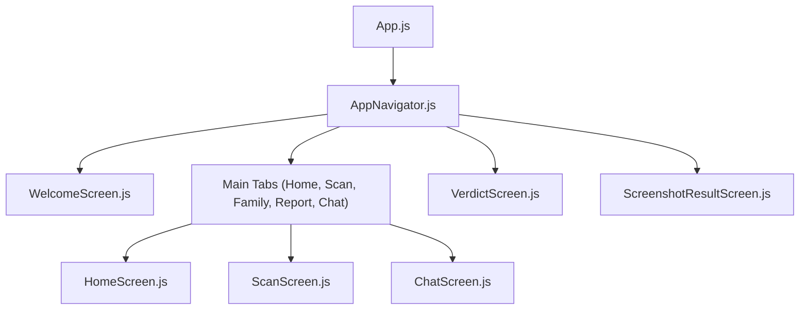
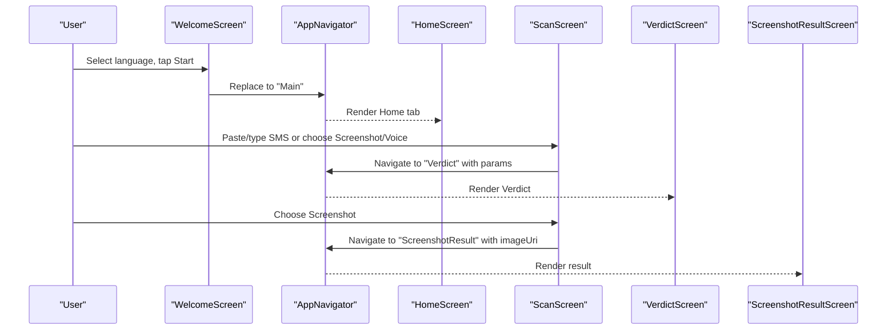
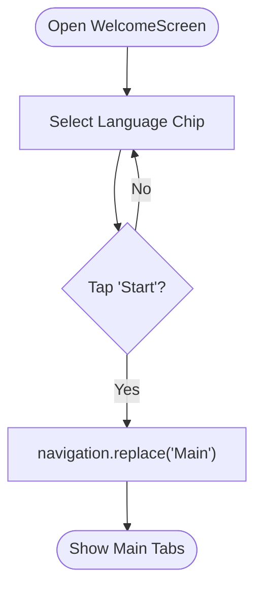
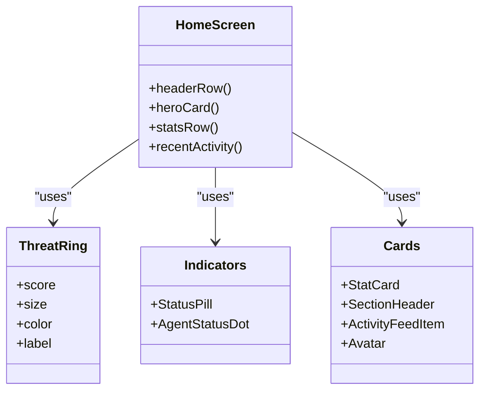
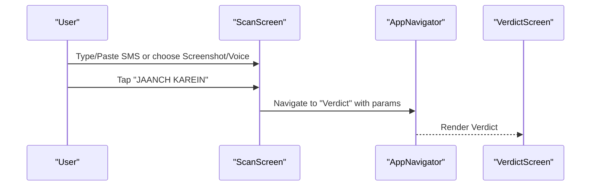
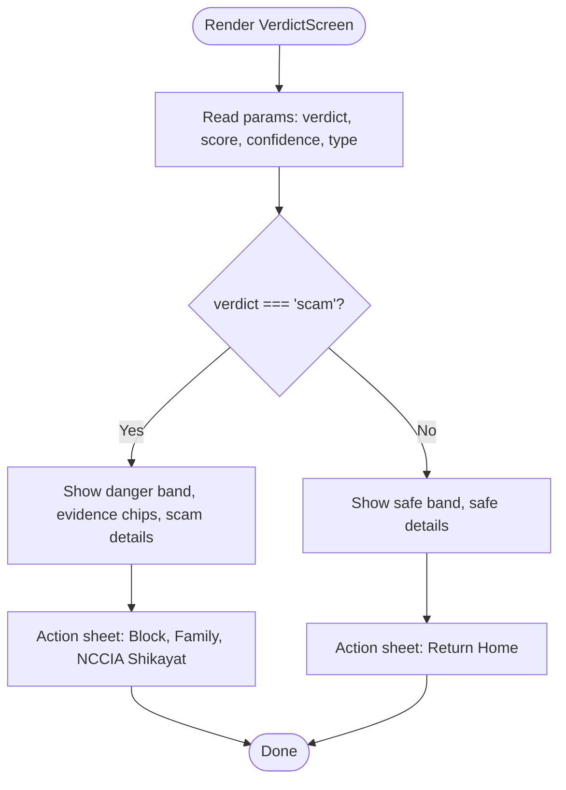
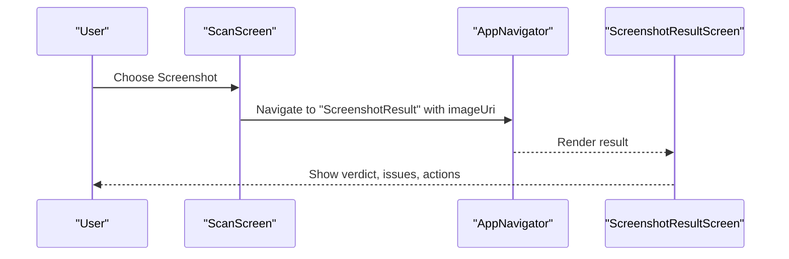
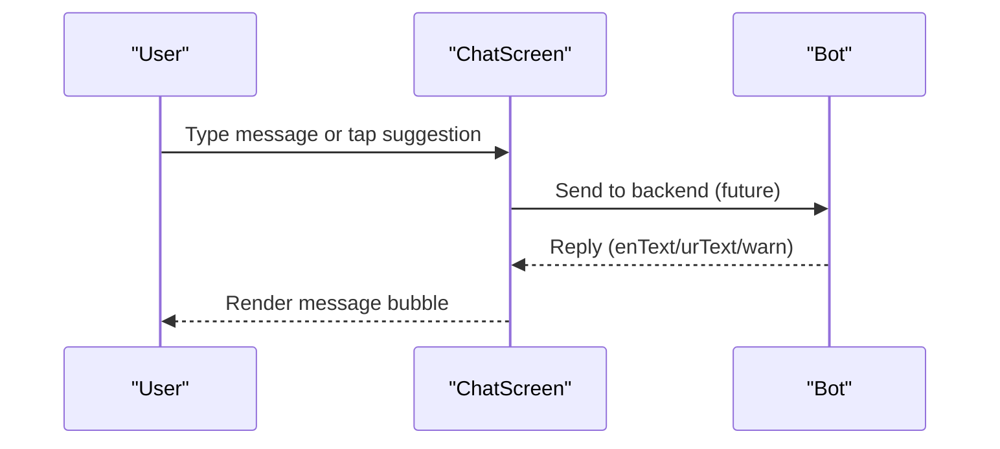
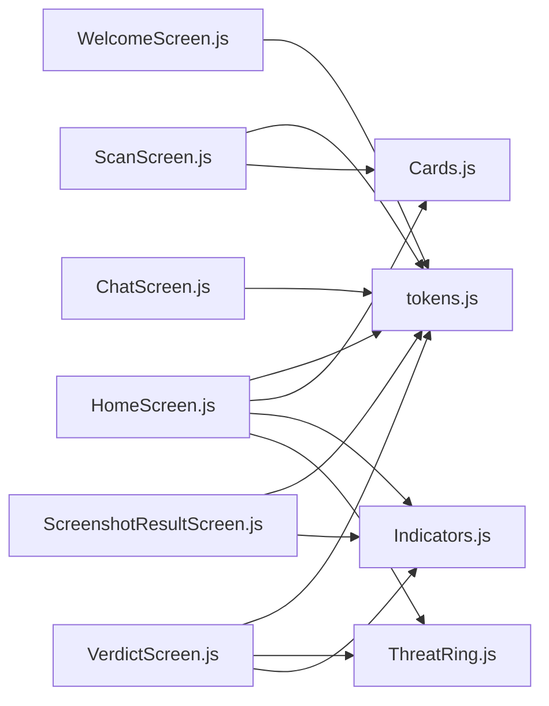

# Screens & User Workflows

<cite>
**Referenced Files in This Document**
- [App.js](file://App.js)
- [AppNavigator.js](file://src/navigation/AppNavigator.js)
- [WelcomeScreen.js](file://src/screens/WelcomeScreen.js)
- [HomeScreen.js](file://src/screens/HomeScreen.js)
- [ScanScreen.js](file://src/screens/ScanScreen.js)
- [VerdictScreen.js](file://src/screens/VerdictScreen.js)
- [ScreenshotResultScreen.js](file://src/screens/ScreenshotResultScreen.js)
- [ChatScreen.js](file://src/screens/ChatScreen.js)
- [Cards.js](file://src/components/Cards.js)
- [Indicators.js](file://src/components/Indicators.js)
- [ThreatRing.js](file://src/components/ThreatRing.js)
- [tokens.js](file://src/theme/tokens.js)
- [README.md](file://README.md)
- [DESIGN_RULES.md](file://DESIGN_RULES.md)
</cite>

## Table of Contents
1. Introduction
2. Project Structure
3. Core Components
4. Architecture Overview
5. Detailed Component Analysis
6. Dependency Analysis
7. Performance Considerations
8. Troubleshooting Guide
9. Conclusion

## Introduction
This document explains the screen implementations and user workflows for Safe Pakistan’s mobile app. It covers onboarding, dashboard, scanning, verdicts, screenshot results, and guardian chat. For each screen, it describes user interactions, navigation transitions, state management, data binding, backend integration points, accessibility considerations, RTL handling, and performance techniques used in the codebase.

## Project Structure
The app is built with React Native (Expo), React Navigation v6, Reanimated 3, and a centralized design token system. The entry point loads fonts and mounts the navigator. A native stack hosts full-screen flows (Welcome, Verdict, Voice, Library, etc.), while a bottom tab navigator groups the main destinations: Home, Scan, Family, Report, Chat.

**Diagram sources**
- [App.js:21-41](file://App.js#L21-L41)
- [AppNavigator.js:80-101](file://src/navigation/AppNavigator.js#L80-L101)

**Section sources**
- [App.js:1-44](file://App.js#L1-L44)
- [AppNavigator.js:1-121](file://src/navigation/AppNavigator.js#L1-L121)

## Core Components
Reusable UI primitives power consistency across screens:
- Cards: StatCard, ActivityFeedItem, SectionHeader, Avatar, LanguageChip, EmptyState
- Indicators: VerdictBadge, StatusPill, ScamTypeChip, AgentStatusDot
- ThreatRing: Animated SVG ring showing threat score
- Theme tokens: colors, fonts, spacing, radius, shadows, gradients

These components are consumed by screens to render consistent layouts and status indicators.

**Section sources**
- [Cards.js:1-193](file://src/components/Cards.js#L1-L193)
- [Indicators.js:1-106](file://src/components/Indicators.js#L1-L106)
- [ThreatRing.js:1-92](file://src/components/ThreatRing.js#L1-L92)
- [tokens.js:1-129](file://src/theme/tokens.js#L1-L129)

## Architecture Overview
Navigation and flow:
- On first launch, WelcomeScreen shows language selection chips and an introductory hero. Tapping “Start” navigates to the main tabs.
- Main tabs include Home (dashboard), Scan (input + analysis), Family, Report (analytics), and Chat (guardian).
- From Scan, users can paste/type SMS, capture a screenshot, or record voice. After analysis, the app navigates to VerdictScreen.
- Screenshot-based scans navigate to ScreenshotResultScreen with image URI and detected issues.
- ChatScreen provides a WhatsApp-inspired messaging interface with suggestions and bilingual bot responses.

**Diagram sources**
- [AppNavigator.js:80-101](file://src/navigation/AppNavigator.js#L80-L101)
- [WelcomeScreen.js:18-89](file://src/screens/WelcomeScreen.js#L18-L89)
- [ScanScreen.js:15-95](file://src/screens/ScanScreen.js#L15-L95)
- [VerdictScreen.js:19-115](file://src/screens/VerdictScreen.js#L19-L115)
- [ScreenshotResultScreen.js:21-109](file://src/screens/ScreenshotResultScreen.js#L21-L109)

## Detailed Component Analysis

### WelcomeScreen — Onboarding Flow
- Purpose: Introduce the app and let users select language before entering the main experience.
- Key elements:
  - Hero gradient background with shield illustration and bilingual headline/subtitle.
  - Horizontal language chip list (English, Urdu, Roman Urdu) using LanguageChip from Cards.
  - Primary CTA (“Shuru Karen”) that replaces the current route with “Main”.
  - Secondary link for existing accounts.
- Interaction flow:
  - User selects a language via chips; local state updates the active chip.
  - Tapping CTA navigates to the main tab navigator.
- State management: Local useState for selected language.
- Data binding: Uses theme tokens and typography helpers for consistent styling.
- Backend integration: None at this screen; language choice can be persisted later via context.
- Accessibility: Large hit targets, clear labels, high contrast text on gradient backgrounds.
- RTL handling: Layout uses semantic start/end; when RTL is enabled globally, Urdu content aligns correctly.
- Performance: Minimal re-renders; static assets and gradients; no heavy computations.

**Diagram sources**
- [WelcomeScreen.js:18-89](file://src/screens/WelcomeScreen.js#L18-L89)
- [Cards.js:112-127](file://src/components/Cards.js#L112-L127)

**Section sources**
- [WelcomeScreen.js:1-127](file://src/screens/WelcomeScreen.js#L1-L127)
- [Cards.js:112-127](file://src/components/Cards.js#L112-L127)

### HomeScreen — Dashboard
- Purpose: Provide a quick overview of protection status, stats, and recent activity.
- Key elements:
  - Greeting row with avatar and notifications icon.
  - Glass-like hero card with status pill, agent dots (SMS, VOICE, LINK, FAMILY), and ThreatRing score.
  - Stats row: Threats Blocked, Total Scans, Family Safe.
  - Recent Activity feed with ActivityFeedItem entries.
- Interaction flow:
  - Tap notifications to open Notifications (route exists in navigator).
  - Tap “See All →” to go to Library.
- State management: Currently uses local sample data; hooks for AppContext/LanguageContext are commented and ready to wire.
- Data binding: Uses tokens, typography, and shared components for consistent look and feel.
- Backend integration: Placeholder data; connect to LocalDBService and analytics when wired.
- Accessibility: Clear hierarchy, readable sizes, sufficient contrast.
- RTL handling: Bilingual titles and body text follow typography rules; layout uses semantic spacing.
- Performance: Flat lists not yet implemented; consider virtualization if history grows.

**Diagram sources**
- [HomeScreen.js:23-105](file://src/screens/HomeScreen.js#L23-L105)
- [ThreatRing.js:18-83](file://src/components/ThreatRing.js#L18-L83)
- [Indicators.js:10-77](file://src/components/Indicators.js#L10-L77)
- [Cards.js:13-109](file://src/components/Cards.js#L13-L109)

**Section sources**
- [HomeScreen.js:1-158](file://src/screens/HomeScreen.js#L1-L158)
- [Indicators.js:1-106](file://src/components/Indicators.js#L1-L106)
- [Cards.js:1-193](file://src/components/Cards.js#L1-L193)

### ScanScreen — Input and Analysis
- Purpose: Accept SMS input, offer screenshot capture, voice recording, and initiate analysis.
- Key elements:
  - Multiline TextInput for pasting or typing SMS.
  - Chips for Screenshot, Awaaz (Voice), Share.
  - Primary CTA “JAANCH KAREIN” to analyze.
  - Tip box explaining how to use the scanner.
  - Recent checks section using ActivityFeedItem.
- Interaction flow:
  - User enters text or chooses Screenshot/Voice.
  - Tapping CTA triggers analyze function; currently navigates to Verdict with a demo payload.
  - Voice chip navigates to VoiceScreen.
- State management: Local state for input text.
- Data binding: Uses tokens and typography; integrates with navigation params for Verdict.
- Backend integration: Comments show where to call the backend endpoint and pass language; save scan history and increment counters.
- Accessibility: Large input area, clear labels, high contrast buttons.
- RTL handling: Bilingual headings; layout respects RTL through semantic styles.
- Performance: Lightweight; avoid unnecessary re-renders; debounce input if needed.

**Diagram sources**
- [ScanScreen.js:15-95](file://src/screens/ScanScreen.js#L15-L95)
- [AppNavigator.js:80-101](file://src/navigation/AppNavigator.js#L80-L101)
- [VerdictScreen.js:19-115](file://src/screens/VerdictScreen.js#L19-L115)

**Section sources**
- [ScanScreen.js:1-151](file://src/screens/ScanScreen.js#L1-L151)
- [README.md:173-203](file://README.md#L173-L203)

### VerdictScreen — Results Display
- Purpose: Present SCAM or SAFE verdicts with animated bands, evidence chips, and bilingual explanations following strict copy rules.
- Key elements:
  - Animated band entrance with gradient based on verdict type.
  - Verdict pill, ThreatRing, confidence chip, and scam/safe type chip.
  - Scam details: “WORDS FOUND” evidence chips and concise explanation lines.
  - Safe details: reasons why the message appears safe.
  - Action sheet: Block sender, inform family, report to NCCIA (for scam); return home (for safe).
- Interaction flow:
  - Reads params (verdict, score, confidence, type) from navigation.
  - Renders appropriate details and actions based on verdict.
- State management: Derived from route params; animation values via Reanimated.
- Data binding: Uses tokens, typography, and shared components.
- Backend integration: Params expected from backend response; redFlags/triggerWords should populate evidence chips per README guidance.
- Accessibility: Minimum 17pt body text, clear status indicators, high contrast.
- RTL handling: Bilingual text separated into distinct Text nodes; follows typography rules.
- Performance: Reanimated for smooth animations; minimal re-renders.

**Diagram sources**
- [VerdictScreen.js:19-115](file://src/screens/VerdictScreen.js#L19-L115)
- [README.md:104-127](file://README.md#L104-L127)

**Section sources**
- [VerdictScreen.js:1-268](file://src/screens/VerdictScreen.js#L1-L268)
- [README.md:104-127](file://README.md#L104-L127)
- [DESIGN_RULES.md:129-139](file://DESIGN_RULES.md#L129-L139)

### ScreenshotResultScreen — Image-Based Threat Detection
- Purpose: Show results for scanned screenshots with thumbnail, verdict badge, threat score, and detected issues.
- Key elements:
  - Thumbnail with zoom badge; placeholder if no image.
  - VerdictBadge, threat score chip, issue count chip.
  - Detected Issues list with numbered rows and descriptions.
  - Actions: Block sender, rescan.
- Interaction flow:
  - Receives imageUri and issues via route params.
  - Displays findings and offers next steps.
- State management: Props-driven rendering from navigation params.
- Data binding: Uses tokens and typography; reusable indicators and cards.
- Backend integration: Expect image processing results to populate issues and score.
- Accessibility: Clear badges, large text, high contrast.
- RTL handling: Bilingual headers; layout uses semantic spacing.
- Performance: Efficient image display; avoid heavy processing on UI thread.

**Diagram sources**
- [ScanScreen.js:51-55](file://src/screens/ScanScreen.js#L51-L55)
- [AppNavigator.js:96-97](file://src/navigation/AppNavigator.js#L96-L97)
- [ScreenshotResultScreen.js:21-109](file://src/screens/ScreenshotResultScreen.js#L21-L109)

**Section sources**
- [ScreenshotResultScreen.js:1-152](file://src/screens/ScreenshotResultScreen.js#L1-L152)

### ChatScreen — Guardian Chatbot Interface
- Purpose: Provide a WhatsApp-inspired chat experience with AI guardian responses and suggestions.
- Key elements:
  - Header with bot avatar, online indicator, and AI badge.
  - Message list with bot and user bubbles; bot messages support bilingual text and warning blocks.
  - Horizontal suggestion chips for common queries.
  - Input bar with keyboard avoidance and send button.
- Interaction flow:
  - User types or taps suggestions; messages appear in chat.
  - Bot replies may include warnings about suspicious numbers.
- State management: Local state for input and messages (sample data).
- Data binding: Uses tokens, typography, and shared components.
- Backend integration: Ready to integrate STT/TTS and backend chat API; comments indicate where to hook up.
- Accessibility: Large hit targets, clear message separation, high contrast.
- RTL handling: Bilingual messages; separate Text nodes for English and Urdu.
- Performance: ScrollView with efficient rendering; avoid excessive re-renders on new messages.

**Diagram sources**
- [ChatScreen.js:15-88](file://src/screens/ChatScreen.js#L15-L88)
- [ChatScreen.js:91-123](file://src/screens/ChatScreen.js#L91-L123)

**Section sources**
- [ChatScreen.js:1-186](file://src/screens/ChatScreen.js#L1-L186)

## Dependency Analysis
Screens depend on shared components and theme tokens for consistent UI. Navigation orchestrates transitions between screens.

**Diagram sources**
- [tokens.js:1-129](file://src/theme/tokens.js#L1-L129)
- [Cards.js:1-193](file://src/components/Cards.js#L1-L193)
- [Indicators.js:1-106](file://src/components/Indicators.js#L1-L106)
- [ThreatRing.js:1-92](file://src/components/ThreatRing.js#L1-L92)
- [WelcomeScreen.js:1-127](file://src/screens/WelcomeScreen.js#L1-L127)
- [HomeScreen.js:1-158](file://src/screens/HomeScreen.js#L1-L158)
- [ScanScreen.js:1-151](file://src/screens/ScanScreen.js#L1-L151)
- [VerdictScreen.js:1-268](file://src/screens/VerdictScreen.js#L1-L268)
- [ScreenshotResultScreen.js:1-152](file://src/screens/ScreenshotResultScreen.js#L1-L152)
- [ChatScreen.js:1-186](file://src/screens/ChatScreen.js#L1-L186)

**Section sources**
- [tokens.js:1-129](file://src/theme/tokens.js#L1-L129)
- [Cards.js:1-193](file://src/components/Cards.js#L1-L193)
- [Indicators.js:1-106](file://src/components/Indicators.js#L1-L106)
- [ThreatRing.js:1-92](file://src/components/ThreatRing.js#L1-L92)

## Performance Considerations
- Animations: Use Reanimated for smooth transitions (ThreatRing strokeDashoffset, Verdict band slide-in). Avoid core Animated.
- Rendering: Keep screens lightweight; avoid heavy computations during render. Use memoization if lists grow.
- Images: Optimize images and use appropriate resizing modes; avoid loading large images on the main thread.
- Inputs: Debounce long inputs if calling backend frequently.
- Navigation: Prefer replace over nested navigations for full-screen flows to reduce stack depth.
- Tokens: Centralized tokens ensure consistent rendering and minimize style recalculations.

[No sources needed since this section provides general guidance]

## Troubleshooting Guide
- Missing backend wiring:
  - In ScanScreen, uncomment and implement the fetch call to the backend endpoint; pass language and text; handle response fields (verdict, score, confidence, type, redFlags).
  - Save scan history and update counters via LocalDBService and context once available.
- Screenshot flow:
  - Ensure expo-image-picker is installed and launched from the Screenshot chip; pass imageUri to ScreenshotResultScreen via route params.
- Voice flow:
  - Hook up expo-av recording and STT backend; replace mock waveform with real metering values.
- Verdict copy rules:
  - Follow strict copy guidelines: minimum 17pt body text, max ~11 words per line, decisive language, and correct button labels (e.g., “NCCIA Shikayat”).
- RTL and Urdu:
  - Ensure Urdu text uses Nastaliq font, proper line height, and separate Text nodes for English and Urdu.
  - Enable global RTL when needed; all styles use semantic start/end.

**Section sources**
- [README.md:173-203](file://README.md#L173-L203)
- [README.md:252-267](file://README.md#L252-L267)
- [DESIGN_RULES.md:116-139](file://DESIGN_RULES.md#L116-L139)

## Conclusion
Safe Pakistan’s screens provide a cohesive, accessible, and performant user experience for scam detection and protection. The architecture leverages shared components and tokens, with clear navigation flows and strong RTL support. Integrating backend services will complete the end-to-end workflow for scanning, analysis, and reporting. Adhering to the design rules ensures consistency and readability for all users.

[No sources needed since this section summarizes without analyzing specific files]