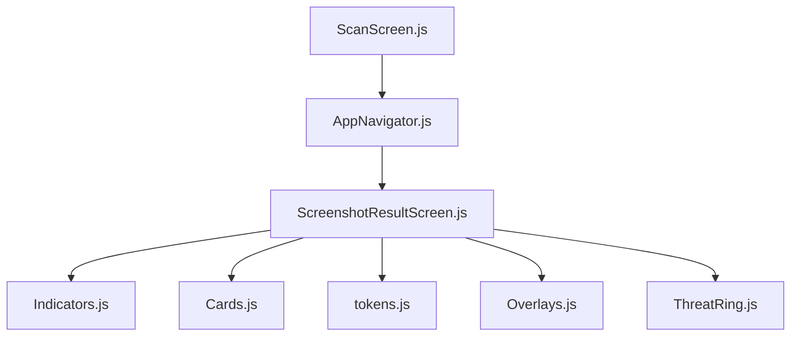
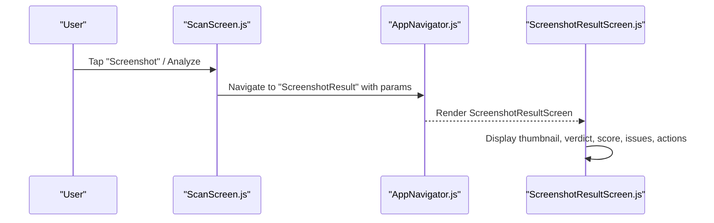
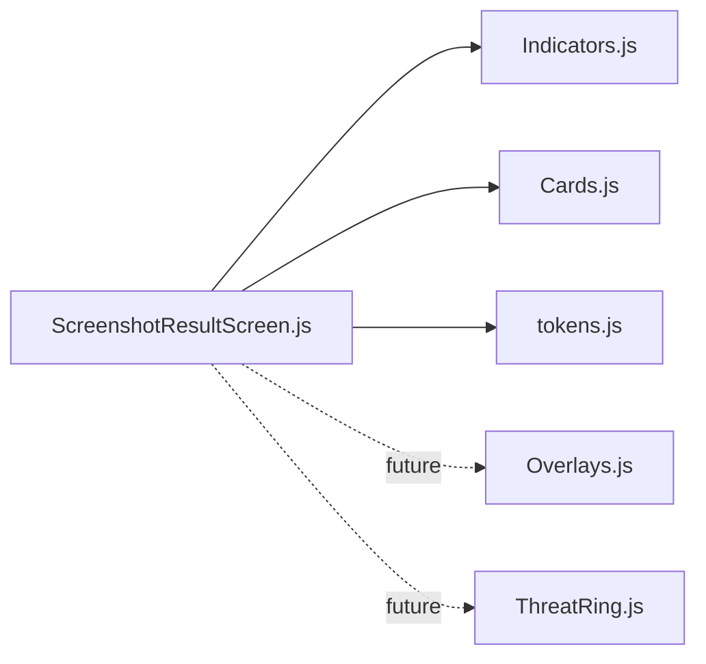

# Screenshot Result Screen

<cite>
**Referenced Files in This Document**
- [ScreenshotResultScreen.js](file://src/screens/ScreenshotResultScreen.js)
- [Overlays.js](file://src/components/Overlays.js)
- [Indicators.js](file://src/components/Indicators.js)
- [Cards.js](file://src/components/Cards.js)
- [ThreatRing.js](file://src/components/ThreatRing.js)
- [ScanScreen.js](file://src/screens/ScanScreen.js)
- [AppNavigator.js](file://src/navigation/AppNavigator.js)
- [tokens.js](file://src/theme/tokens.js)
- [README.md](file://README.md)
</cite>

## Table of Contents
1. [Introduction](#introduction)
2. [Project Structure](#project-structure)
3. [Core Components](#core-components)
4. [Architecture Overview](#architecture-overview)
5. [Detailed Component Analysis](#detailed-component-analysis)
6. [Dependency Analysis](#dependency-analysis)
7. [Performance Considerations](#performance-considerations)
8. [Troubleshooting Guide](#troubleshooting-guide)
9. [Conclusion](#conclusion)

## Introduction
This document explains the ScreenshotResultScreen, which displays image-based threat detection results for screenshots. It covers how the screen presents a thumbnail preview, shows verdict and confidence information, lists detected issues, and provides actions such as blocking senders or re-scanning. It also documents the current state of features like zoom/pan overlays, bounding box annotations, sharing to guardians or authorities, OCR integration, and performance considerations for large images. Where functionality is not yet implemented, this document clarifies what exists versus what should be added.

## Project Structure
The ScreenshotResultScreen is part of a React Native (Expo) app organized by feature:
- Screens: user-facing pages including ScreenshotResultScreen
- Components: reusable UI pieces like indicators, cards, overlays, and animated rings
- Navigation: stack configuration that registers ScreenshotResultScreen
- Theme: design tokens for colors, fonts, spacing, shadows, and gradients

**Diagram sources**
- [AppNavigator.js:80-120](file://src/navigation/AppNavigator.js#L80-L120)
- [ScreenshotResultScreen.js:1-152](file://src/screens/ScreenshotResultScreen.js#L1-L152)
- [Indicators.js:1-106](file://src/components/Indicators.js#L1-L106)
- [Cards.js:1-193](file://src/components/Cards.js#L1-L193)
- [tokens.js:1-129](file://src/theme/tokens.js#L1-L129)
- [Overlays.js:1-123](file://src/components/Overlays.js#L1-L123)
- [ThreatRing.js:1-92](file://src/components/ThreatRing.js#L1-L92)

**Section sources**
- [AppNavigator.js:80-120](file://src/navigation/AppNavigator.js#L80-L120)
- [ScreenshotResultScreen.js:1-152](file://src/screens/ScreenshotResultScreen.js#L1-L152)
- [README.md:14-49](file://README.md#L14-L49)

## Core Components
- ScreenshotResultScreen: Displays a screenshot thumbnail, verdict badge, threat score chip, number-of-issues chip, a list of detected issues, and action buttons (block sender, re-scan).
- Indicators: Provides VerdictBadge used to show SCAM/SAFE/SUSPICIOUS status.
- Cards: Provides SectionHeader used to label sections like “Detected Issues”.
- Overlays: Provides LoadingShield and BottomSheet; currently not used by ScreenshotResultScreen but available for future use (e.g., full-screen image viewer with overlays).
- ThreatRing: Animated SVG ring component that can visualize threat scores; not embedded in ScreenshotResultScreen but useful for richer score visualization.
- Theme tokens: Centralized design system for colors, fonts, radius, shadows, and motion timings.

Key responsibilities:
- Present the result of an image analysis in a clear, scannable layout
- Communicate verdict and severity via badges and chips
- List concrete issues found in the screenshot
- Provide immediate actions to mitigate risk

**Section sources**
- [ScreenshotResultScreen.js:21-109](file://src/screens/ScreenshotResultScreen.js#L21-L109)
- [Indicators.js:10-27](file://src/components/Indicators.js#L10-L27)
- [Cards.js:28-45](file://src/components/Cards.js#L28-L45)
- [Overlays.js:18-94](file://src/components/Overlays.js#L18-L94)
- [ThreatRing.js:18-83](file://src/components/ThreatRing.js#L18-L83)
- [tokens.js:7-129](file://src/theme/tokens.js#L7-L129)

## Architecture Overview
At runtime, the flow from scanning to viewing results involves:
- User initiates scan from ScanScreen
- App navigates to ScreenshotResultScreen with route params (image URI, score, issues)
- ScreenshotResultScreen renders the result using shared components and theme tokens

**Diagram sources**
- [ScanScreen.js:15-23](file://src/screens/ScanScreen.js#L15-L23)
- [AppNavigator.js:80-120](file://src/navigation/AppNavigator.js#L80-L120)
- [ScreenshotResultScreen.js:21-109](file://src/screens/ScreenshotResultScreen.js#L21-L109)

## Detailed Component Analysis

### ScreenshotResultScreen
- Inputs: route.params.imageUri, route.params.score, route.params.issues
- UI elements:
  - Header with back navigation and bilingual title
  - Thumbnail card with a small zoom indicator badge
  - VerdictBadge indicating scam/safe/suspicious
  - Meta chips showing threat score and issue count
  - SectionHeader titled “Detected Issues” followed by a list of issues
  - Action buttons: block sender and re-scan
- Current capabilities:
  - Image preview: static thumbnail via RN Image with cover scaling
  - Verdict display: via VerdictBadge
  - Confidence/threat score: displayed as a chip
  - Issue listing: rendered from an array of objects
  - Actions: placeholder handlers for blocking and re-scanning

What is not yet implemented:
- Zoom and pan on the thumbnail or full-screen image viewer
- Overlay system with bounding boxes and annotations over the image
- Sharing mechanisms to guardians or authorities
- OCR text extraction pipeline wired into this screen

Implementation notes:
- Uses ScrollView for vertical content
- Uses SafeAreaView for safe area handling
- Leverages theme tokens for consistent styling

**Section sources**
- [ScreenshotResultScreen.js:21-109](file://src/screens/ScreenshotResultScreen.js#L21-L109)
- [ScreenshotResultScreen.js:112-151](file://src/screens/ScreenshotResultScreen.js#L112-L151)

#### Data model for issues
- Each issue is an object with:
  - t: short title of the issue
  - d: description or explanation
- The screen maps over this array to render numbered rows with title and description

**Section sources**
- [ScreenshotResultScreen.js:15-19](file://src/screens/ScreenshotResultScreen.js#L15-L19)
- [ScreenshotResultScreen.js:75-95](file://src/screens/ScreenshotResultScreen.js#L75-L95)

### Overlays and Loading
- LoadingShield: Animated progress ring with pulsing glow; suitable for “Analyzing…” states before results are ready
- BottomSheet: Modal sheet for action menus; could host share/block/report options in the future

These components are not currently integrated into ScreenshotResultScreen but are available for extending the experience (e.g., opening a full-screen image viewer with overlay annotations).

**Section sources**
- [Overlays.js:18-94](file://src/components/Overlays.js#L18-L94)

### Indicators and Cards
- VerdictBadge: Shows SCAM/SAFE/SUSPICIOUS with icon and color-coded background
- SectionHeader: Provides section titles with optional Urdu subtitle and optional action button

Used by ScreenshotResultScreen to communicate verdict and structure the issues list.

**Section sources**
- [Indicators.js:10-27](file://src/components/Indicators.js#L10-L27)
- [Cards.js:28-45](file://src/components/Cards.js#L28-L45)

### ThreatRing
- Animated SVG ring that fills based on a score value
- Useful for visualizing threat scores in a more prominent way than a simple chip

Not currently embedded in ScreenshotResultScreen but can be adopted to enhance score visualization.

**Section sources**
- [ThreatRing.js:18-83](file://src/components/ThreatRing.js#L18-L83)

### Navigation
- ScreenshotResultScreen is registered in the stack navigator with slide-from-bottom animation
- Routes include Welcome, Main tabs, Verdict, Voice, Library, FamilyConsent, ScreenshotResult, ModelPerf

**Section sources**
- [AppNavigator.js:80-120](file://src/navigation/AppNavigator.js#L80-L120)

## Dependency Analysis
- ScreenshotResultScreen depends on:
  - Indicators (VerdictBadge)
  - Cards (SectionHeader)
  - Theme tokens (colors, fonts, radius, shadows)
  - React Native core components (Image, ScrollView, Pressable, etc.)
- Optional dependencies for future enhancements:
  - Overlays (LoadingShield, BottomSheet)
  - ThreatRing (for richer score visualization)
  - Image picker and image processing libraries for zoom/pan and overlays
  - OCR service integration for text extraction from images

**Diagram sources**
- [ScreenshotResultScreen.js:1-152](file://src/screens/ScreenshotResultScreen.js#L1-L152)
- [Indicators.js:1-106](file://src/components/Indicators.js#L1-L106)
- [Cards.js:1-193](file://src/components/Cards.js#L1-L193)
- [tokens.js:1-129](file://src/theme/tokens.js#L1-L129)
- [Overlays.js:1-123](file://src/components/Overlays.js#L1-L123)
- [ThreatRing.js:1-92](file://src/components/ThreatRing.js#L1-L92)

**Section sources**
- [ScreenshotResultScreen.js:1-152](file://src/screens/ScreenshotResultScreen.js#L1-L152)
- [AppNavigator.js:80-120](file://src/navigation/AppNavigator.js#L80-L120)

## Performance Considerations
Current implementation observations:
- Image preview uses a fixed-size thumbnail with resizeMode="cover", which is efficient for memory usage
- No explicit image caching or resizing logic is present; consider adding caching and downsampling for large images
- No dedicated image processing pipeline is wired into this screen

Recommended optimizations for handling large images:
- Downsample images before rendering to reduce memory footprint
- Use image caching strategies to avoid reloading the same assets
- Implement lazy loading for thumbnails and defer heavy operations until needed
- Avoid holding references to large bitmaps longer than necessary; release resources when navigating away

[No sources needed since this section provides general guidance]

## Troubleshooting Guide
Common issues and checks:
- Missing image: If imageUri is undefined, the screen shows a placeholder icon; ensure the upstream flow passes a valid URI
- Incorrect params: Verify that route.params includes imageUri, score, and issues when navigating to this screen
- Layout issues: Ensure SafeAreaView and ScrollView are configured correctly to avoid content clipping
- Accessibility: Confirm hit targets meet minimum sizes and contrast ratios per design tokens

Where to look:
- Parameter handling and fallbacks in ScreenshotResultScreen
- Styles for thumbnail, meta chips, and buttons
- VerdictBadge and SectionHeader usage

**Section sources**
- [ScreenshotResultScreen.js:21-109](file://src/screens/ScreenshotResultScreen.js#L21-L109)
- [ScreenshotResultScreen.js:112-151](file://src/screens/ScreenshotResultScreen.js#L112-L151)

## Conclusion
The ScreenshotResultScreen currently provides a concise, accessible view of screenshot analysis results, including a thumbnail preview, verdict badge, threat score chip, issue list, and basic actions. It leverages shared components and a consistent design system. Several advanced features—zoom/pan image viewer, overlay bounding boxes and annotations, sharing to guardians or authorities, and OCR integration—are not yet implemented but can be built upon the existing foundation using the provided components and navigation setup.

[No sources needed since this section summarizes without analyzing specific files]