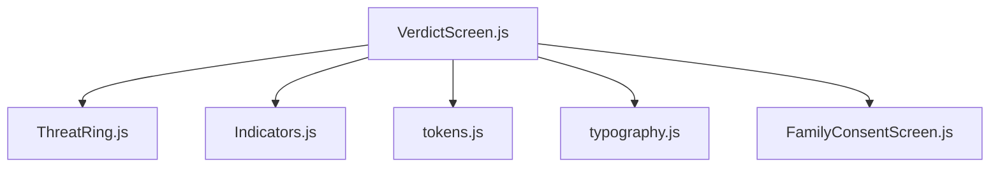
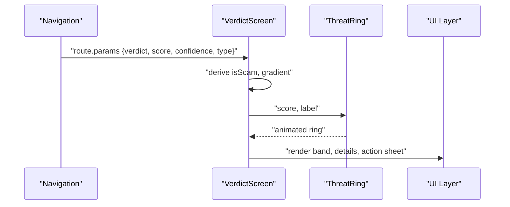
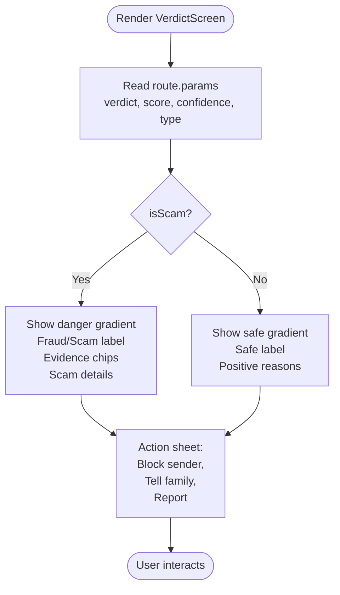
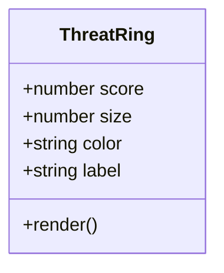
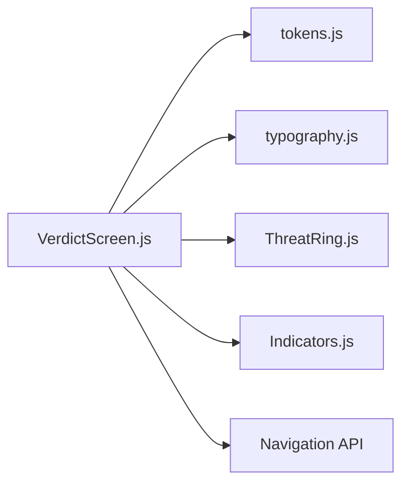

# Verdict Display Screen

<cite>
**Referenced Files in This Document**
- [VerdictScreen.js](file://src/screens/VerdictScreen.js)
- [ThreatRing.js](file://src/components/ThreatRing.js)
- [Indicators.js](file://src/components/Indicators.js)
- [tokens.js](file://src/theme/tokens.js)
- [typography.js](file://src/theme/typography.js)
- [FamilyConsentScreen.js](file://src/screens/FamilyConsentScreen.js)
</cite>

## Table of Contents
1. [Introduction](#introduction)
2. [Project Structure](#project-structure)
3. [Core Components](#core-components)
4. [Architecture Overview](#architecture-overview)
5. [Detailed Component Analysis](#detailed-component-analysis)
6. [Dependency Analysis](#dependency-analysis)
7. [Performance Considerations](#performance-considerations)
8. [Troubleshooting Guide](#troubleshooting-guide)
9. [Conclusion](#conclusion)
10. [Appendices](#appendices)

## Introduction
This document explains the VerdictDisplay screen that presents threat analysis results with a polished, animated user interface. It covers:
- Animated verdict bands for Safe and Dangerous states with color-coded indicators
- Evidence chips that highlight specific red flags found during analysis
- Bilingual explanations (English and Urdu) following strict typography rules
- Animations powered by React Native Reanimated for smooth transitions
- Sharing capabilities and family alert integration points
- Accessibility considerations including screen reader support and high contrast compatibility

The goal is to help developers and product contributors understand how the screen works, how to extend it, and how to maintain consistency across language and accessibility requirements.

## Project Structure
The VerdictDisplay screen lives under screens and composes several reusable components and theme tokens:
- VerdictScreen orchestrates the UI flow and state derived from navigation params
- ThreatRing renders an animated circular progress indicator for threat score
- Indicators provides small status badges and chips used elsewhere in the app
- Theme tokens define colors, gradients, fonts, radii, shadows, and motion timings
- Typography presets enforce bilingual text rules for English and Urdu
- FamilyConsentScreen outlines what data is shared within the family system

**Diagram sources**
- [VerdictScreen.js:1-116](file://src/screens/VerdictScreen.js#L1-L116)
- [ThreatRing.js:1-92](file://src/components/ThreatRing.js#L1-L92)
- [Indicators.js:1-106](file://src/components/Indicators.js#L1-L106)
- [tokens.js:1-129](file://src/theme/tokens.js#L1-L129)
- [typography.js:1-60](file://src/theme/typography.js#L1-L60)
- [FamilyConsentScreen.js:1-177](file://src/screens/FamilyConsentScreen.js#L1-L177)

**Section sources**
- [VerdictScreen.js:1-116](file://src/screens/VerdictScreen.js#L1-L116)
- [tokens.js:1-129](file://src/theme/tokens.js#L1-L129)
- [typography.js:1-60](file://src/theme/typography.js#L1-L60)

## Core Components
- VerdictScreen: Renders the top band with gradient background, verdict pill, threat ring, confidence/type chips, and detail cards for scam or safe outcomes. Includes an action sheet at the bottom for post-scan actions.
- ThreatRing: Animated SVG circle that fills proportionally to the threat score using Reanimated.
- Indicators: Provides small visual indicators like VerdictBadge, StatusPill, ScamTypeChip, and AgentStatusDot.
- Theme tokens: Centralized design tokens for colors, gradients, fonts, spacing, radius, shadows, and motion timings.
- Typography: Predefined styles for English and Urdu text with consistent sizing, line height, and directionality.

Key responsibilities:
- Present clear verdicts with immediate visual cues (colors, icons, labels)
- Communicate risk via an animated ring and supporting metrics
- Provide concise, bilingual explanations for users
- Offer actionable next steps through the action sheet

**Section sources**
- [VerdictScreen.js:19-116](file://src/screens/VerdictScreen.js#L19-L116)
- [ThreatRing.js:18-83](file://src/components/ThreatRing.js#L18-L83)
- [Indicators.js:10-58](file://src/components/Indicators.js#L10-L58)
- [tokens.js:7-54](file://src/theme/tokens.js#L7-L54)
- [typography.js:14-55](file://src/theme/typography.js#L14-L55)

## Architecture Overview
The screen composes a layered UI:
- Top band: Gradient header with verdict label and bilingual message
- Center: Animated threat ring showing score and label
- Details: Cards for scam evidence or safe reasons
- Bottom: Action sheet with contextual actions based on verdict

**Diagram sources**
- [VerdictScreen.js:19-116](file://src/screens/VerdictScreen.js#L19-L116)
- [ThreatRing.js:18-83](file://src/components/ThreatRing.js#L18-L83)

## Detailed Component Analysis

### VerdictScreen
Responsibilities:
- Reads route parameters to determine verdict, score, confidence, and type
- Applies appropriate gradient and labels based on verdict
- Animates the top band entrance using Reanimated
- Displays bilingual verdict messages and supporting chips
- Shows detail cards tailored to scam or safe outcomes
- Presents an action sheet with context-aware actions

Animation highlights:
- Band slide-down entrance with spring easing and delay
- Threat ring fill animation driven by score

Bilingual content:
- Uses typography presets to render English and Urdu text consistently
- Follows Urdu rules: RTL direction, right alignment, increased font size, and line height

Evidence chips:
- For scam verdicts, shows short trigger words as evidence chips
- For safe verdicts, lists positive reasons with checkmarks

Action sheet:
- Scam: options to block sender, inform family, and file a complaint
- Safe: option to return home

**Diagram sources**
- [VerdictScreen.js:19-116](file://src/screens/VerdictScreen.js#L19-L116)

**Section sources**
- [VerdictScreen.js:19-116](file://src/screens/VerdictScreen.js#L19-L116)
- [VerdictScreen.js:118-188](file://src/screens/VerdictScreen.js#L118-L188)
- [VerdictScreen.js:190-268](file://src/screens/VerdictScreen.js#L190-L268)

### ThreatRing
Responsibilities:
- Renders an SVG circle with a background track and an animated foreground stroke
- Animates the stroke to reflect the provided score (0–100)
- Centers score and label text inside the ring

Animation details:
- Uses Reanimated’s useSharedValue and withTiming to animate strokeDashoffset
- Easing curve tuned for smooth, natural motion

Accessibility notes:
- The ring visually communicates risk; ensure surrounding text conveys meaning for screen readers

**Diagram sources**
- [ThreatRing.js:18-83](file://src/components/ThreatRing.js#L18-L83)

**Section sources**
- [ThreatRing.js:18-83](file://src/components/ThreatRing.js#L18-L83)

### Indicators
Responsibilities:
- Provides small, reusable status indicators such as VerdictBadge, StatusPill, ScamTypeChip, and AgentStatusDot
- Encapsulates styling and semantics for consistent use across screens

Usage note:
- While available in this module, the VerdictScreen intentionally uses inline evidence chips for its scam section to keep the card compact

**Section sources**
- [Indicators.js:10-58](file://src/components/Indicators.js#L10-L58)

### Theme Tokens and Typography
Tokens:
- Colors: brand, status helpers, surfaces, and transparent overlays
- Gradients: hero, danger, safe, warn, and safeBg
- Fonts: English Inter weights and Urdu Noto Nastaliq Urdu
- Radii, spacing, shadows, and motion timings

Typography:
- Prebuilt style objects for English and Urdu
- Enforces Urdu rules: RTL, right-aligned, larger sizes, and taller line-height
- Inverse variants for dark backgrounds

**Section sources**
- [tokens.js:7-129](file://src/theme/tokens.js#L7-L129)
- [typography.js:14-55](file://src/theme/typography.js#L14-L55)

### Family Alert Integration Points
- The VerdictScreen includes an action to “Tell family” when a scam is detected. This can be wired to a service that notifies family members.
- FamilyConsentScreen defines what data is shared with family (threat alerts, risk scores, protection status) and explicitly excludes sensitive data (message text, contacts, photos, location).

Integration guidance:
- On “Tell family,” invoke a family notification service with minimal, privacy-preserving data per the consent model
- Ensure deep links or invites are handled by FamilyConsentScreen for new members

**Section sources**
- [VerdictScreen.js:93-112](file://src/screens/VerdictScreen.js#L93-L112)
- [FamilyConsentScreen.js:16-22](file://src/screens/FamilyConsentScreen.js#L16-L22)
- [FamilyConsentScreen.js:62-110](file://src/screens/FamilyConsentScreen.js#L62-L110)

## Dependency Analysis
High-level dependencies:
- VerdictScreen depends on:
  - Theme tokens for colors, gradients, fonts, radii, shadows
  - Typography presets for bilingual text
  - ThreatRing for animated score visualization
  - Indicators for reusable status elements
  - Navigation for back action and potential routing to family flows

**Diagram sources**
- [VerdictScreen.js:1-116](file://src/screens/VerdictScreen.js#L1-L116)
- [tokens.js:1-129](file://src/theme/tokens.js#L1-L129)
- [typography.js:1-60](file://src/theme/typography.js#L1-L60)
- [ThreatRing.js:1-92](file://src/components/ThreatRing.js#L1-L92)
- [Indicators.js:1-106](file://src/components/Indicators.js#L1-L106)

**Section sources**
- [VerdictScreen.js:1-116](file://src/screens/VerdictScreen.js#L1-L116)

## Performance Considerations
- Use Reanimated for animations to keep UI responsive and avoid main-thread jank
- Keep evidence chips short to prevent layout shifts and wrapping
- Prefer memoization for expensive computations if adding dynamic scoring logic
- Avoid heavy re-renders by keeping state local and minimizing prop drilling
- Optimize SVG rendering by limiting unnecessary recalculations in ThreatRing

[No sources needed since this section provides general guidance]

## Troubleshooting Guide
Common issues and resolutions:
- Animation not triggering:
  - Ensure Reanimated is installed and configured
  - Verify shared values are updated in useEffect and styles bind to animated styles
- Incorrect verdict display:
  - Confirm route.params contains valid verdict, score, confidence, and type
  - Check conditional branches for isScam logic
- Bilingual text misalignment:
  - Use typography presets to apply correct RTL and line-height for Urdu
  - Validate font loading for both English and Urdu families
- Family sharing not working:
  - Ensure “Tell family” action calls the intended service
  - Confirm consent model aligns with FamilyConsentScreen’s shared vs never-shared lists

**Section sources**
- [VerdictScreen.js:29-33](file://src/screens/VerdictScreen.js#L29-L33)
- [VerdictScreen.js:19-27](file://src/screens/VerdictScreen.js#L19-L27)
- [typography.js:21-29](file://src/theme/typography.js#L21-L29)
- [FamilyConsentScreen.js:16-22](file://src/screens/FamilyConsentScreen.js#L16-L22)

## Conclusion
The VerdictDisplay screen delivers a clear, engaging presentation of threat analysis results with:
- Animated verdict bands and threat rings for immediate risk perception
- Evidence chips and detailed explanations for transparency
- Bilingual text adhering to strict typography rules
- Contextual actions for blocking, reporting, and family notifications
- A privacy-first family sharing model

By leveraging Reanimated, centralized tokens, and reusable components, the screen remains performant, accessible, and easy to extend.

[No sources needed since this section summarizes without analyzing specific files]

## Appendices

### Bilingual Copy Rules Summary
- English and Urdu texts coexist with distinct typographic treatments
- Urdu text uses RTL direction, right alignment, larger sizes, and taller line-height
- Inverse variants are available for dark backgrounds

**Section sources**
- [typography.js:21-29](file://src/theme/typography.js#L21-L29)
- [typography.js:50-55](file://src/theme/typography.js#L50-L55)

### Accessibility Notes
- Screen readers:
  - Ensure meaningful labels around interactive elements (e.g., back button, action buttons)
  - Provide descriptive text for the threat ring outcome alongside visuals
- High contrast mode:
  - Rely on tokenized colors and status helpers to maintain contrast
  - Test with system high contrast settings to verify readability

[No sources needed since this section provides general guidance]