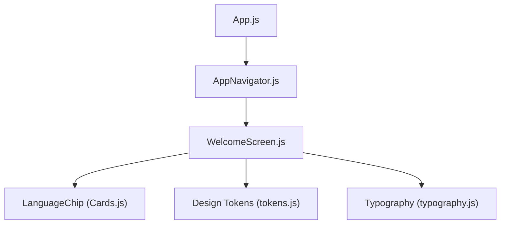
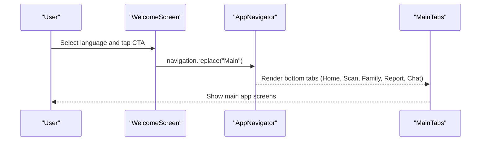
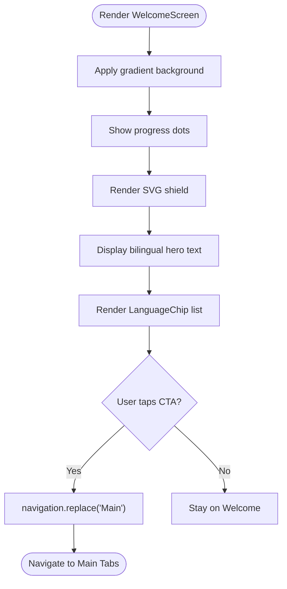
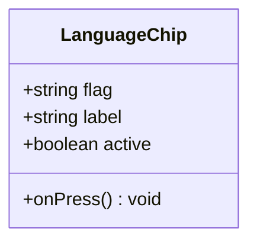
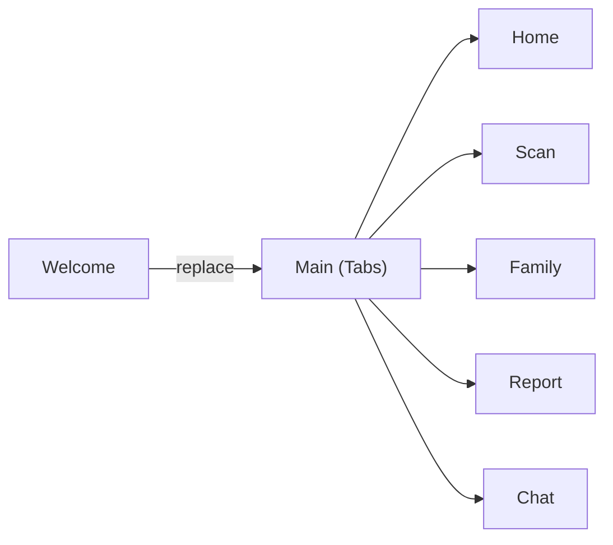
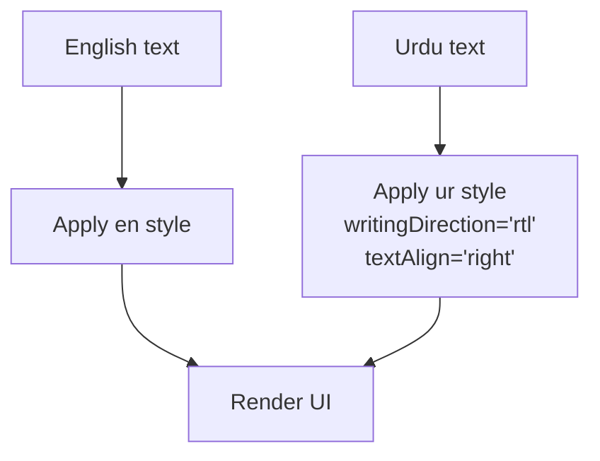
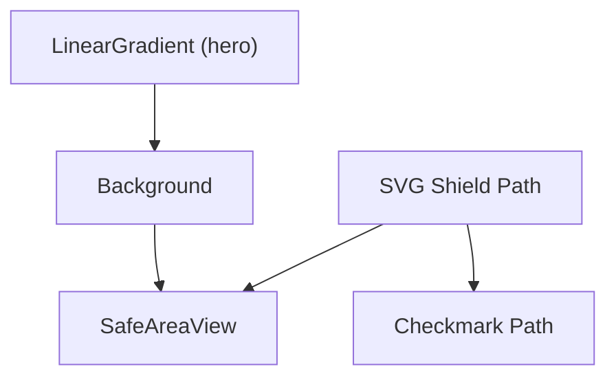
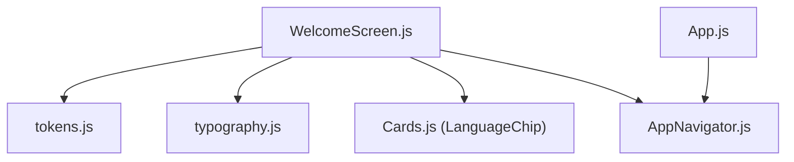

# Welcome Screen & Onboarding

<cite>
**Referenced Files in This Document**
- [WelcomeScreen.js](file://src/screens/WelcomeScreen.js)
- [AppNavigator.js](file://src/navigation/AppNavigator.js)
- [Cards.js](file://src/components/Cards.js)
- [tokens.js](file://src/theme/tokens.js)
- [typography.js](file://src/theme/typography.js)
- [App.js](file://App.js)
- [DESIGN_RULES.md](file://DESIGN_RULES.md)
- [README.md](file://README.md)
</cite>

## Table of Contents
1. [Introduction](#introduction)
2. [Project Structure](#project-structure)
3. [Core Components](#core-components)
4. [Architecture Overview](#architecture-overview)
5. [Detailed Component Analysis](#detailed-component-analysis)
6. [Dependency Analysis](#dependency-analysis)
7. [Performance Considerations](#performance-considerations)
8. [Troubleshooting Guide](#troubleshooting-guide)
9. [Conclusion](#conclusion)
10. [Appendices](#appendices)

## Introduction
This document explains the WelcomeScreen component that guides new users through onboarding and language selection. It covers:
- Multi-language support for English, Urdu, and Roman Urdu using LanguageChip components
- Gradient background with SVG shield graphics and progress indicators
- Navigation flow from Welcome to the main application screens
- Bilingual text display patterns and RTL handling for Urdu
- Accessibility considerations for screen readers
- State management for language selection and guidance for persistence across sessions
- Examples for extending language support and customizing the onboarding flow

## Project Structure
The WelcomeScreen is part of a React Native app structured around screens, navigation, shared components, and design tokens. The entry point loads fonts and renders the navigator, which wires the Welcome screen to the main tabbed experience.

**Diagram sources**
- [App.js:17-40](file://App.js#L17-L40)
- [AppNavigator.js:19-29](file://src/navigation/AppNavigator.js#L19-L29)
- [WelcomeScreen.js:1-10](file://src/screens/WelcomeScreen.js#L1-L10)
- [Cards.js:112-127](file://src/components/Cards.js#L112-L127)
- [tokens.js:46-68](file://src/theme/tokens.js#L46-L68)
- [typography.js:1-29](file://src/theme/typography.js#L1-L29)

**Section sources**
- [App.js:1-44](file://App.js#L1-L44)
- [AppNavigator.js:1-121](file://src/navigation/AppNavigator.js#L1-L121)
- [WelcomeScreen.js:1-127](file://src/screens/WelcomeScreen.js#L1-L127)

## Core Components
- WelcomeScreen: Renders the onboarding view with gradient background, SVG shield, bilingual hero text, language chips, and primary call-to-action.
- LanguageChip: A reusable chip displaying flag and label, highlighting the active language.
- AppNavigator: Defines the stack and tabs; controls initial route based on whether the user has onboarded.

Key responsibilities:
- Present a visually cohesive welcome experience
- Allow users to select a preferred language
- Navigate to the main application after selection

**Section sources**
- [WelcomeScreen.js:18-90](file://src/screens/WelcomeScreen.js#L18-L90)
- [Cards.js:112-127](file://src/components/Cards.js#L112-L127)
- [AppNavigator.js:80-102](file://src/navigation/AppNavigator.js#L80-L102)

## Architecture Overview
The app uses a native stack navigator with a bottom tab navigator for the main experience. The Welcome screen triggers navigation to the Main tabs via a replace action.

**Diagram sources**
- [WelcomeScreen.js:77-86](file://src/screens/WelcomeScreen.js#L77-L86)
- [AppNavigator.js:58-78](file://src/navigation/AppNavigator.js#L58-L78)
- [AppNavigator.js:80-102](file://src/navigation/AppNavigator.js#L80-L102)

## Detailed Component Analysis

### WelcomeScreen
- Layout and visuals:
  - Full-screen gradient background using design tokens for colors and direction.
  - Progress indicator dots at the top to signal multi-step onboarding.
  - SVG shield graphic with a linear gradient and checkmark path.
- Bilingual text:
  - English hero text and Urdu hero text are rendered in separate Text components to avoid mixed-direction issues.
  - Subtitle supports Roman Urdu copy.
- Language selection:
  - Horizontal scroll of LanguageChip components for English, Urdu, and Roman Urdu.
  - Local state tracks the selected language code.
- Navigation:
  - Primary CTA navigates to the Main tabs by replacing the current route.
  - Secondary link for existing accounts.

**Diagram sources**
- [WelcomeScreen.js:21-89](file://src/screens/WelcomeScreen.js#L21-L89)

**Section sources**
- [WelcomeScreen.js:12-16](file://src/screens/WelcomeScreen.js#L12-L16)
- [WelcomeScreen.js:21-89](file://src/screens/WelcomeScreen.js#L21-L89)
- [WelcomeScreen.js:92-126](file://src/screens/WelcomeScreen.js#L92-L126)

### LanguageChip
- Displays a flag emoji and label.
- Highlights the active language with contrasting background and border.
- Emits an onPress callback to update the parent’s selected language.

**Diagram sources**
- [Cards.js:112-127](file://src/components/Cards.js#L112-L127)

**Section sources**
- [Cards.js:112-127](file://src/components/Cards.js#L112-L127)

### AppNavigator
- Stack configuration:
  - Initial route depends on whether the user has already onboarded.
  - Screens include Welcome, Main (tabs), and feature-specific screens.
- Bottom tabs:
  - Home, Scan, Family, Report, Chat with icons and labels.

**Diagram sources**
- [AppNavigator.js:32-78](file://src/navigation/AppNavigator.js#L32-L78)
- [AppNavigator.js:80-102](file://src/navigation/AppNavigator.js#L80-L102)

**Section sources**
- [AppNavigator.js:1-121](file://src/navigation/AppNavigator.js#L1-L121)

### Typography and RTL Handling
- English and Urdu typography presets enforce correct sizing, line height, and direction.
- Urdu styles automatically set right-to-left writing direction and right alignment.
- Design rules emphasize separating English and Urdu into distinct Text nodes to prevent layout issues.

**Diagram sources**
- [typography.js:14-29](file://src/theme/typography.js#L14-L29)
- [typography.js:31-55](file://src/theme/typography.js#L31-L55)

**Section sources**
- [typography.js:1-59](file://src/theme/typography.js#L1-L59)
- [DESIGN_RULES.md:116-126](file://DESIGN_RULES.md#L116-L126)
- [README.md:130-152](file://README.md#L130-L152)

### Gradient Background and SVG Shield
- Gradient:
  - Uses design token gradients for hero backgrounds with defined start/end coordinates.
- SVG Shield:
  - Custom Path shapes a shield outline with a linear gradient fill and a checkmark stroke.
  - Wrapped in a circular container with subtle shadow and border for visual depth.

**Diagram sources**
- [tokens.js:46-54](file://src/theme/tokens.js#L46-L54)
- [WelcomeScreen.js:21-50](file://src/screens/WelcomeScreen.js#L21-L50)

**Section sources**
- [WelcomeScreen.js:21-50](file://src/screens/WelcomeScreen.js#L21-L50)
- [tokens.js:46-54](file://src/theme/tokens.js#L46-L54)

## Dependency Analysis
- WelcomeScreen depends on:
  - Design tokens for colors, fonts, and gradients
  - Typography presets for consistent bilingual rendering
  - LanguageChip for selectable language options
  - React Navigation for routing to the main tabs
- AppNavigator orchestrates routes and provides the Main tab structure
- App initializes fonts and wraps the navigator with SafeAreaProvider

**Diagram sources**
- [WelcomeScreen.js:1-10](file://src/screens/WelcomeScreen.js#L1-L10)
- [AppNavigator.js:19-29](file://src/navigation/AppNavigator.js#L19-L29)
- [App.js:17-40](file://App.js#L17-L40)

**Section sources**
- [WelcomeScreen.js:1-127](file://src/screens/WelcomeScreen.js#L1-L127)
- [AppNavigator.js:1-121](file://src/navigation/AppNavigator.js#L1-L121)
- [App.js:1-44](file://App.js#L1-L44)

## Performance Considerations
- Keep language selection local to the WelcomeScreen to avoid unnecessary re-renders elsewhere until needed.
- Use design tokens consistently to minimize style duplication and improve maintainability.
- Prefer functional components and hooks for predictable performance.
- Avoid mixing languages within a single Text node to reduce shaping overhead and layout recalculations.

[No sources needed since this section provides general guidance]

## Troubleshooting Guide
- Urdu text not aligned correctly:
  - Ensure Urdu text uses the Urdu typography preset which sets right-to-left direction and right alignment.
  - Do not mix English and Urdu in the same Text component.
- Fonts not loading:
  - Confirm fonts are registered in the app entry point before rendering the navigator.
- Navigation does not switch to Main:
  - Verify the navigation prop is available and the route name matches the navigator definition.
- Language selection not persisting:
  - Current implementation stores the selected language locally. To persist across sessions, integrate a storage mechanism and a context provider as indicated by commented providers in the app entry point.

**Section sources**
- [typography.js:21-29](file://src/theme/typography.js#L21-L29)
- [App.js:21-40](file://App.js#L21-L40)
- [AppNavigator.js:80-102](file://src/navigation/AppNavigator.js#L80-L102)
- [DESIGN_RULES.md:116-126](file://DESIGN_RULES.md#L116-L126)

## Conclusion
The WelcomeScreen delivers a polished onboarding experience with clear language selection, strong visual branding via gradients and SVG graphics, and smooth navigation to the main app. Its bilingual text handling follows established typography rules for correct RTL behavior. While language selection is currently local, the architecture supports easy integration of persistent storage and global language context as outlined in the project’s comments and guidelines.

[No sources needed since this section summarizes without analyzing specific files]

## Appendices

### Extending Language Support
- Add a new language entry to the language list used by the WelcomeScreen.
- Provide appropriate flag and label values.
- If the new language requires different typography or direction, extend the typography presets accordingly.

**Section sources**
- [WelcomeScreen.js:12-16](file://src/screens/WelcomeScreen.js#L12-L16)
- [typography.js:14-29](file://src/theme/typography.js#L14-L29)

### Customizing the Onboarding Flow
- Modify the number and state of progress dots to reflect additional steps.
- Adjust the CTA behavior to navigate to different screens or show additional confirmation flows.
- Integrate a language context provider to manage and persist language preferences globally.

**Section sources**
- [WelcomeScreen.js:28-33](file://src/screens/WelcomeScreen.js#L28-L33)
- [WelcomeScreen.js:77-86](file://src/screens/WelcomeScreen.js#L77-L86)
- [App.js:17-40](file://App.js#L17-L40)

### Accessibility Considerations
- Ensure interactive elements have sufficient hit targets and contrast per design rules.
- When integrating a language context, expose accessible labels for language chips and provide meaningful announcements for screen readers.
- For full RTL screens, configure the internationalization manager appropriately at app startup as recommended by the documentation.

**Section sources**
- [DESIGN_RULES.md:116-126](file://DESIGN_RULES.md#L116-L126)
- [README.md:130-152](file://README.md#L130-L152)