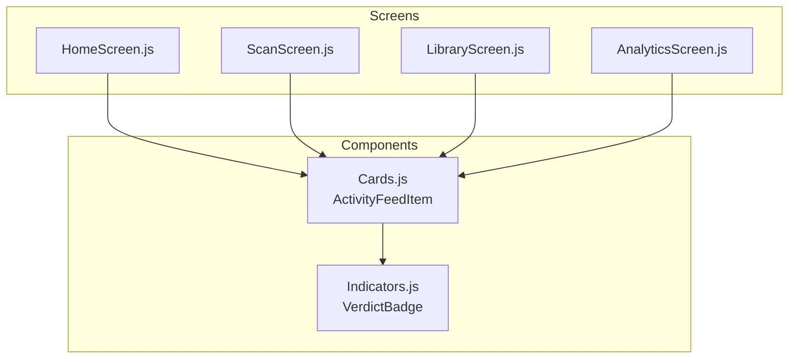
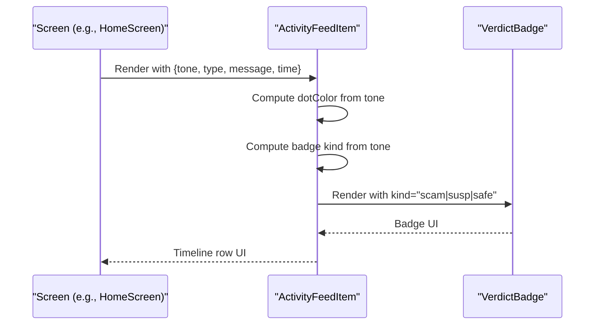
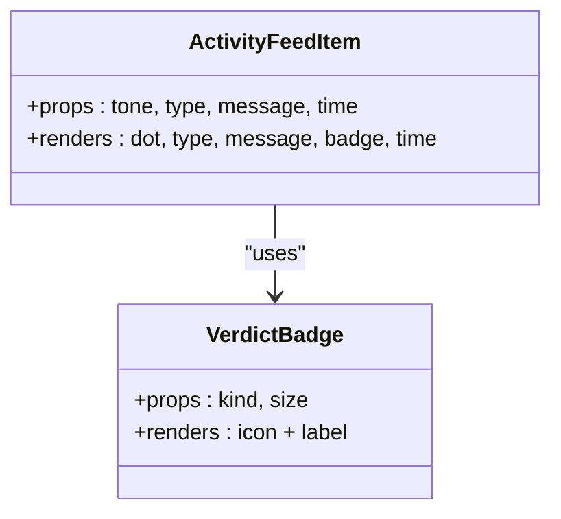

# ActivityFeedItem Component

<cite>
**Referenced Files in This Document**
- [Cards.js](file://src/components/Cards.js)
- [Indicators.js](file://src/components/Indicators.js)
- [HomeScreen.js](file://src/screens/HomeScreen.js)
- [ScanScreen.js](file://src/screens/ScanScreen.js)
- [LibraryScreen.js](file://src/screens/LibraryScreen.js)
- [AnalyticsScreen.js](file://src/screens/AnalyticsScreen.js)
</cite>

## Table of Contents
1. [Introduction](#introduction)
2. [Project Structure](#project-structure)
3. [Core Components](#core-components)
4. [Architecture Overview](#architecture-overview)
5. [Detailed Component Analysis](#detailed-component-analysis)
6. [Dependency Analysis](#dependency-analysis)
7. [Performance Considerations](#performance-considerations)
8. [Troubleshooting Guide](#troubleshooting-guide)
9. [Conclusion](#conclusion)
10. [Appendices](#appendices)

## Introduction
ActivityFeedItem is a timeline item used to display activity logs and threat detection events across the app. It shows scan results, alerts, and user activities with contextual visual indicators: a colored dot for severity, a verdict badge (scam/suspicious/safe), and a timestamp. The component supports responsive text truncation for long messages and integrates into screens that present recent or historical activity.

## Project Structure
ActivityFeedItem lives in the shared components library and is consumed by multiple screens to render consistent activity rows.

**Diagram sources**
- [Cards.js:88-110](file://src/components/Cards.js#L88-L110)
- [Indicators.js:10-27](file://src/components/Indicators.js#L10-L27)
- [HomeScreen.js:19-100](file://src/screens/HomeScreen.js#L19-L100)
- [ScanScreen.js:13-92](file://src/screens/ScanScreen.js#L13-L92)
- [LibraryScreen.js:8-26](file://src/screens/LibraryScreen.js#L8-L26)
- [AnalyticsScreen.js:1-8](file://src/screens/AnalyticsScreen.js#L1-L8)

**Section sources**
- [Cards.js:88-110](file://src/components/Cards.js#L88-L110)
- [HomeScreen.js:19-100](file://src/screens/HomeScreen.js#L19-L100)
- [ScanScreen.js:13-92](file://src/screens/ScanScreen.js#L13-L92)
- [LibraryScreen.js:8-26](file://src/screens/LibraryScreen.js#L8-L26)
- [AnalyticsScreen.js:1-8](file://src/screens/AnalyticsScreen.js#L1-L8)

## Core Components
- ActivityFeedItem: Renders a single row with a severity dot, category label, truncated message, verdict badge, and time.
- VerdictBadge: Renders small status badges for scam, suspicious, and safe outcomes.

Key behaviors:
- Severity mapping: tone determines dot color and badge kind.
- Text truncation: message is limited to one line to keep rows compact.
- Visual hierarchy: bold type label, muted message, compact badge, subtle time.

**Section sources**
- [Cards.js:88-110](file://src/components/Cards.js#L88-L110)
- [Indicators.js:10-27](file://src/components/Indicators.js#L10-L27)

## Architecture Overview
ActivityFeedItem is a presentational component. Screens provide data via props; the component renders based on those values and delegates badge rendering to VerdictBadge.

**Diagram sources**
- [Cards.js:88-110](file://src/components/Cards.js#L88-L110)
- [Indicators.js:10-27](file://src/components/Indicators.js#L10-L27)
- [HomeScreen.js:28-100](file://src/screens/HomeScreen.js#L28-L100)

## Detailed Component Analysis

### Props and Behavior
- tone: 'danger' | 'warn' | 'safe'
  - Maps to severity dot color and badge kind.
  - danger → red dot + SCAM badge
  - warn → amber dot + SUSPICIOUS badge
  - safe → accent dot + SAFE badge
- type: string
  - Category label shown in bold above the message.
- message: string
  - Activity description; truncated to one line for readability.
- time: string
  - Relative or formatted timestamp displayed under the badge.

Visual mapping:
- Dot color derived from tone using theme tokens.
- VerdictBadge kind derived from tone using a fixed mapping.

**Section sources**
- [Cards.js:88-110](file://src/components/Cards.js#L88-L110)
- [Indicators.js:10-27](file://src/components/Indicators.js#L10-L27)

### Usage Examples

- Scam detection alert
  - Use tone='danger', type set to the detected scam category, message summarizing the alert, time showing when it occurred.
  - Example usage pattern: [HomeScreen.js:28-32](file://src/screens/HomeScreen.js#L28-L32), [ScanScreen.js:88-92](file://src/screens/ScanScreen.js#L88-L92)

- Voice analysis result
  - Represent voice agent outcomes similarly; choose tone based on the analysis outcome and set type to reflect the voice context.
  - Pattern reference: [HomeScreen.js:28-32](file://src/screens/HomeScreen.js#L28-L32)

- Screenshot scanning activity
  - Show screenshot-related events with appropriate tone and descriptive message.
  - Pattern reference: [HomeScreen.js:28-32](file://src/screens/HomeScreen.js#L28-L32)

- Family protection event
  - Display family shield actions or alerts using tone and type that reflect the protection status.
  - Pattern reference: [HomeScreen.js:28-32](file://src/screens/HomeScreen.js#L28-L32)

### Visual Hierarchy and Responsiveness
- Left-aligned severity dot communicates urgency at a glance.
- Type label is bold and larger than the message to establish primary information.
- Message uses single-line truncation to maintain consistent row height.
- VerdictBadge provides a compact, color-coded summary of the outcome.
- Time is smaller and muted to avoid competing with primary content.

**Section sources**
- [Cards.js:96-108](file://src/components/Cards.js#L96-L108)
- [Indicators.js:10-27](file://src/components/Indicators.js#L10-L27)

### Integration Patterns

- Historical data display
  - Screens can map stored activity records to ActivityFeedItem rows.
  - Example filtering and mapping patterns are visible in the library screen where items are filtered by tone and rendered consistently.
  - Reference: [LibraryScreen.js:8-26](file://src/screens/LibraryScreen.js#L8-L26)

- Real-time feed updates
  - Append new items to the top of the list to preserve chronological order.
  - Ensure each item has a stable key (e.g., id or timestamp) to optimize re-renders.

- Filtering capabilities
  - Use tone to filter between scam, suspicious, and safe entries.
  - Library screen demonstrates horizontal filters that toggle visibility based on tone.
  - Reference: [LibraryScreen.js:16-26](file://src/screens/LibraryScreen.js#L16-L26)

- Analytics integration
  - While AnalyticsScreen focuses on charts, you can extend it to include an activity feed section by mapping analytics events to ActivityFeedItem rows using the same tone/type/message/time structure.
  - Reference: [AnalyticsScreen.js:1-8](file://src/screens/AnalyticsScreen.js#L1-L8)

### Guidelines for Consistent Activity Logging
- Always set tone according to the outcome:
  - danger for confirmed threats/scams
  - warn for uncertain or potentially risky items
  - safe for benign or verified-safe events
- Keep type concise and specific to the event category (e.g., “BISP 8171 Fraud”, “Unknown Link”, “JazzCash Official”).
- Write clear, short messages; rely on truncation rather than long lines.
- Provide human-friendly time strings (e.g., relative times like “2m”, “1h”) or formatted timestamps.
- Maintain chronological order: newest first, oldest last.
- Use stable keys for list items to ensure smooth updates and navigation.

**Section sources**
- [LibraryScreen.js:8-26](file://src/screens/LibraryScreen.js#L8-L26)
- [HomeScreen.js:28-32](file://src/screens/HomeScreen.js#L28-L32)
- [ScanScreen.js:88-92](file://src/screens/ScanScreen.js#L88-L92)

## Dependency Analysis
ActivityFeedItem depends on:
- Theme tokens for colors, fonts, spacing, and shadows
- VerdictBadge for rendering outcome badges
- React Native primitives for layout and text

**Diagram sources**
- [Cards.js:88-110](file://src/components/Cards.js#L88-L110)
- [Indicators.js:10-27](file://src/components/Indicators.js#L10-L27)

**Section sources**
- [Cards.js:88-110](file://src/components/Cards.js#L88-L110)
- [Indicators.js:10-27](file://src/components/Indicators.js#L10-L27)

## Performance Considerations
- Single-line truncation keeps rows compact and reduces layout recalculations.
- Avoid heavy computations inside ActivityFeedItem; keep it purely presentational.
- Use stable keys for list items to minimize re-renders when the feed updates.
- Batch updates when adding multiple new items to the feed.

[No sources needed since this section provides general guidance]

## Troubleshooting Guide
- Incorrect tone mapping
  - Verify that tone maps to the expected dot color and badge kind.
  - Check the mapping logic in the component implementation.
  - Reference: [Cards.js:88-110](file://src/components/Cards.js#L88-L110)

- Badge not displaying correctly
  - Ensure kind passed to VerdictBadge is one of the supported values ('scam', 'susp', 'safe').
  - Reference: [Indicators.js:10-27](file://src/components/Indicators.js#L10-L27)

- Long messages breaking layout
  - Rely on single-line truncation; if more detail is needed, consider expanding to a dedicated view or tooltip.
  - Reference: [Cards.js:96-108](file://src/components/Cards.js#L96-L108)

- Chronological order issues
  - Ensure lists are sorted by time before rendering and prepend new items to the top.
  - Reference: [LibraryScreen.js:8-26](file://src/screens/LibraryScreen.js#L8-L26)

**Section sources**
- [Cards.js:88-110](file://src/components/Cards.js#L88-L110)
- [Indicators.js:10-27](file://src/components/Indicators.js#L10-L27)
- [LibraryScreen.js:8-26](file://src/screens/LibraryScreen.js#L8-L26)

## Conclusion
ActivityFeedItem provides a consistent, accessible way to display activity logs and threat detection events. Its simple prop interface enables flexible usage across dashboards, scans, libraries, and analytics views. By following the guidelines for tone, type, message, and time, teams can maintain a coherent visual language and reliable chronological ordering in activity feeds.

[No sources needed since this section summarizes without analyzing specific files]

## Appendices

### Prop Specification Summary
- tone: 'danger' | 'warn' | 'safe'
  - Controls severity dot color and badge kind.
- type: string
  - Event category label.
- message: string
  - Activity description; truncated to one line.
- time: string
  - Timestamp display.

**Section sources**
- [Cards.js:88-110](file://src/components/Cards.js#L88-L110)

### Example Data Patterns
- Recent activity examples in HomeScreen demonstrate all three tones and typical categories.
- LibraryScreen shows how to filter and render items by tone.
- ScanScreen shows inline usage for immediate feedback after a scan.

**Section sources**
- [HomeScreen.js:28-32](file://src/screens/HomeScreen.js#L28-L32)
- [LibraryScreen.js:8-26](file://src/screens/LibraryScreen.js#L8-L26)
- [ScanScreen.js:88-92](file://src/screens/ScanScreen.js#L88-L92)