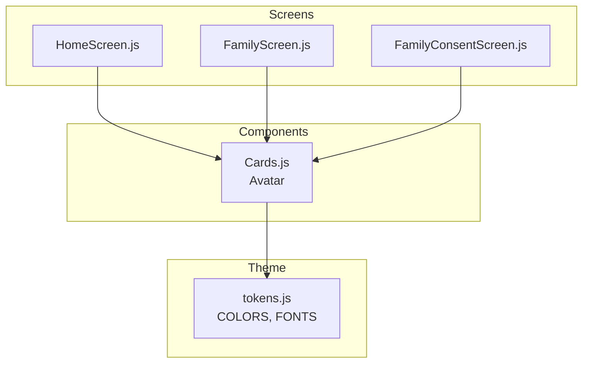
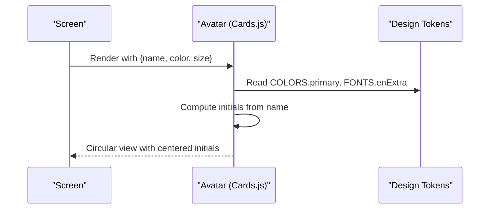
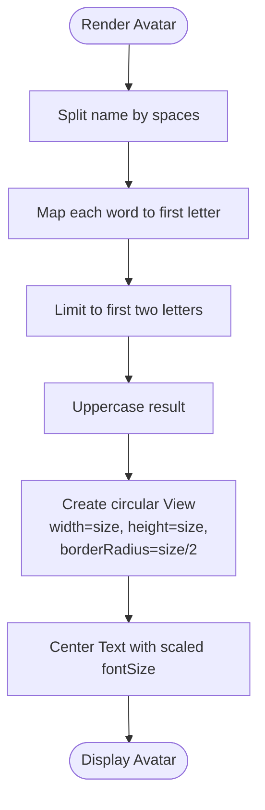
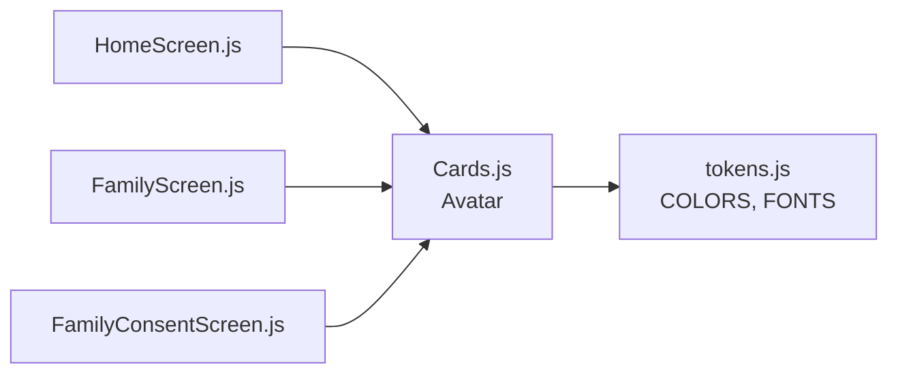

# Avatar Component

<cite>
**Referenced Files in This Document**
- [Cards.js](file://src/components/Cards.js)
- [tokens.js](file://src/theme/tokens.js)
- [FamilyScreen.js](file://src/screens/FamilyScreen.js)
- [HomeScreen.js](file://src/screens/HomeScreen.js)
- [FamilyConsentScreen.js](file://src/screens/FamilyConsentScreen.js)
</cite>

## Table of Contents
1. [Introduction](#introduction)
2. [Project Structure](#project-structure)
3. [Core Components](#core-components)
4. [Architecture Overview](#architecture-overview)
5. [Detailed Component Analysis](#detailed-component-analysis)
6. [Dependency Analysis](#dependency-analysis)
7. [Performance Considerations](#performance-considerations)
8. [Troubleshooting Guide](#troubleshooting-guide)
9. [Conclusion](#conclusion)
10. [Appendices](#appendices)

## Introduction
The Avatar component renders a circular user representation using initials derived from a provided name. It is used across the application to provide consistent visual identification for family members, contacts, and user profiles. The component supports customization via props for background color and size, enabling flexible integration into various UI contexts such as dashboards, family lists, and invitation flows.

## Project Structure
The Avatar component is defined within the shared components module and consumed by multiple screens:
- Definition: src/components/Cards.js
- Consumption examples:
  - Family member avatars in a hero section: src/screens/FamilyScreen.js
  - User profile avatar in the header: src/screens/HomeScreen.js
  - Inviter identity avatar in consent flow: src/screens/FamilyConsentScreen.js
- Design tokens (colors, fonts, spacing): src/theme/tokens.js

**Diagram sources**
- [Cards.js:12-26](file://src/components/Cards.js#L12-L26)
- [HomeScreen.js:19-57](file://src/screens/HomeScreen.js#L19-L57)
- [FamilyScreen.js:18-64](file://src/screens/FamilyScreen.js#L18-L64)
- [FamilyConsentScreen.js:14-44](file://src/screens/FamilyConsentScreen.js#L14-L44)
- [tokens.js:7-68](file://src/theme/tokens.js#L7-L68)

**Section sources**
- [Cards.js:12-26](file://src/components/Cards.js#L12-L26)
- [HomeScreen.js:19-57](file://src/screens/HomeScreen.js#L19-L57)
- [FamilyScreen.js:18-64](file://src/screens/FamilyScreen.js#L18-L64)
- [FamilyConsentScreen.js:14-44](file://src/screens/FamilyConsentScreen.js#L14-L44)
- [tokens.js:7-68](file://src/theme/tokens.js#L7-L68)

## Core Components
- Avatar: A functional React Native component that:
  - Accepts props for name, color, and size
  - Generates initials from the name
  - Renders a circular container with centered text

Props:
- name: string (default empty). Used to generate initials.
- color: string (default primary brand color). Background fill for the circle.
- size: number (default 44). Controls width, height, border radius, and font size scaling.

Behavior:
- Initials are computed by splitting the name on spaces, taking the first character of each word, limiting to two characters, and uppercasing.
- The container is a square View with border-radius set to half the size to ensure a perfect circle.
- Text is centered both horizontally and vertically inside the circle.
- Font size scales proportionally with size to maintain visual balance.

Usage highlights:
- Family member avatars in a compact row with overlapping borders: src/screens/FamilyScreen.js
- User profile avatar in the dashboard header: src/screens/HomeScreen.js
- Inviter avatar in the consent screen: src/screens/FamilyConsentScreen.js

**Section sources**
- [Cards.js:12-26](file://src/components/Cards.js#L12-L26)
- [FamilyScreen.js:56-64](file://src/screens/FamilyScreen.js#L56-L64)
- [HomeScreen.js:51-57](file://src/screens/HomeScreen.js#L51-L57)
- [FamilyConsentScreen.js:42-44](file://src/screens/FamilyConsentScreen.js#L42-L44)

## Architecture Overview
The Avatar component is a leaf UI primitive that depends on design tokens for colors and typography. Screens import and render it with context-specific data (names, roles, statuses) and styling (size, color).

**Diagram sources**
- [Cards.js:12-26](file://src/components/Cards.js#L12-L26)
- [tokens.js:7-68](file://src/theme/tokens.js#L7-L68)

## Detailed Component Analysis

### Avatar Implementation Details
- Initials generation algorithm:
  - Splits the input name by spaces
  - Maps each word to its first character
  - Limits to two characters
  - Joins and uppercases the result
- Edge cases:
  - Empty or whitespace-only names produce an empty string; consider adding fallback behavior if needed
  - Single-word names yield one initial
  - Names with more than two words truncate to two initials
- Visual centering:
  - Container uses flex alignment to center content
  - Font size scales with size to keep proportions consistent
  - Border radius equals half of size to create a perfect circle

**Diagram sources**
- [Cards.js:13-24](file://src/components/Cards.js#L13-L24)

**Section sources**
- [Cards.js:13-24](file://src/components/Cards.js#L13-L24)

### Usage Examples Across Screens
- Family member avatars:
  - Compact size with custom colors per member
  - Overlapping layout achieved via negative margins in parent containers
  - Reference: src/screens/FamilyScreen.js
- User profile placeholder:
  - Header avatar sized to fit navigation area
  - Uses brand color for consistency
  - Reference: src/screens/HomeScreen.js
- Invitation flow:
  - Larger avatar to emphasize inviter identity
  - Paired with contact details and consent actions
  - Reference: src/screens/FamilyConsentScreen.js

**Section sources**
- [FamilyScreen.js:56-64](file://src/screens/FamilyScreen.js#L56-L64)
- [HomeScreen.js:51-57](file://src/screens/HomeScreen.js#L51-L57)
- [FamilyConsentScreen.js:42-44](file://src/screens/FamilyConsentScreen.js#L42-L44)

### Customization Options
- Size variations:
  - Use size prop to adapt to different contexts (e.g., 32 for compact rows, 40–44 for headers, 52 for prominent identities)
- Color schemes:
  - Pass color prop to match roles or statuses (e.g., brand primary, accent, danger, warning)
  - Leverage design tokens for consistent palette usage
- Typography:
  - Font family and weight are controlled via tokens; text color is white for contrast against colored backgrounds

**Section sources**
- [tokens.js:7-68](file://src/theme/tokens.js#L7-L68)
- [FamilyScreen.js:20-25](file://src/screens/FamilyScreen.js#L20-L25)
- [HomeScreen.js:15-19](file://src/screens/HomeScreen.js#L15-L19)

### Integration With Image Loading Fallbacks
- Current implementation:
  - Pure initials-based rendering without image support
- Recommended approach for future enhancement:
  - Add optional imageUri prop
  - Attempt to load image; if unavailable or failed, fall back to initials
  - Maintain circular shape and sizing while overlaying initials when images fail
  - Ensure accessibility labels reflect either image alt text or initials

[No sources needed since this section provides general guidance]

## Dependency Analysis
- Direct dependencies:
  - React Native primitives: View, Text
  - Design tokens: COLORS, FONTS
- Consumed by:
  - HomeScreen, FamilyScreen, FamilyConsentScreen
- Cohesion:
  - Avatar encapsulates initials logic and presentation, keeping screens focused on data and layout
- Coupling:
  - Low coupling to screens; high cohesion within component
- External dependencies:
  - None beyond React Native and theme tokens

**Diagram sources**
- [Cards.js:12-26](file://src/components/Cards.js#L12-L26)
- [tokens.js:7-68](file://src/theme/tokens.js#L7-L68)
- [HomeScreen.js:19-57](file://src/screens/HomeScreen.js#L19-L57)
- [FamilyScreen.js:18-64](file://src/screens/FamilyScreen.js#L18-L64)
- [FamilyConsentScreen.js:14-44](file://src/screens/FamilyConsentScreen.js#L14-L44)

**Section sources**
- [Cards.js:12-26](file://src/components/Cards.js#L12-L26)
- [tokens.js:7-68](file://src/theme/tokens.js#L7-L68)
- [HomeScreen.js:19-57](file://src/screens/HomeScreen.js#L19-L57)
- [FamilyScreen.js:18-64](file://src/screens/FamilyScreen.js#L18-L64)
- [FamilyConsentScreen.js:14-44](file://src/screens/FamilyConsentScreen.js#L14-L44)

## Performance Considerations
- Minimal re-renders:
  - Avatar is stateless; only re-renders when props change
- Efficient calculations:
  - Initials computation is O(n) where n is number of words; negligible for typical names
- Scaling considerations:
  - Avoid excessively large sizes that increase layout cost
  - Keep color values stable to prevent unnecessary style recalculations

[No sources needed since this section provides general guidance]

## Troubleshooting Guide
Common issues and resolutions:
- Empty initials display:
  - Cause: Empty or whitespace-only name
  - Resolution: Provide a non-empty name or implement a fallback (e.g., default initials like “U” for unknown users)
- Misaligned text:
  - Cause: Incorrect size or font settings
  - Resolution: Ensure size prop is positive and consistent; rely on tokenized font families
- Contrast problems:
  - Cause: Inappropriate background color with white text
  - Resolution: Choose colors with sufficient contrast; verify with design tokens
- Accessibility gaps:
  - Cause: No accessible label for screen readers
  - Resolution: Add appropriate accessibilityLabel to convey user identity (e.g., “Avatar for Ahmed Khan”)

**Section sources**
- [Cards.js:13-24](file://src/components/Cards.js#L13-L24)

## Conclusion
The Avatar component provides a simple, reusable way to represent users visually through initials within a circular container. It integrates seamlessly with the app’s design system and is used consistently across key screens to identify family members, contacts, and user profiles. By leveraging props for name, color, and size, teams can maintain visual consistency while adapting to different contexts. Future enhancements may include image loading with fallbacks and improved accessibility labeling.

[No sources needed since this section summarizes without analyzing specific files]

## Appendices

### Prop Specification Summary
- name: string (default empty)
  - Purpose: Source for initials generation
  - Behavior: Split by spaces, take first letter of up to two words, uppercase
- color: string (default primary brand color)
  - Purpose: Background color of the circle
  - Recommendation: Use tokens for consistency
- size: number (default 44)
  - Purpose: Dimension control for width, height, border radius, and font size scaling

**Section sources**
- [Cards.js:13-24](file://src/components/Cards.js#L13-L24)
- [tokens.js:7-68](file://src/theme/tokens.js#L7-L68)

### Accessibility Guidelines
- Screen readers:
  - Add accessibilityLabel to describe the user represented by the avatar
- Keyboard navigation:
  - If making the avatar interactive (e.g., clickable), ensure focus states and keyboard events are handled
- Contrast:
  - Ensure text color contrasts adequately with background color

[No sources needed since this section provides general guidance]