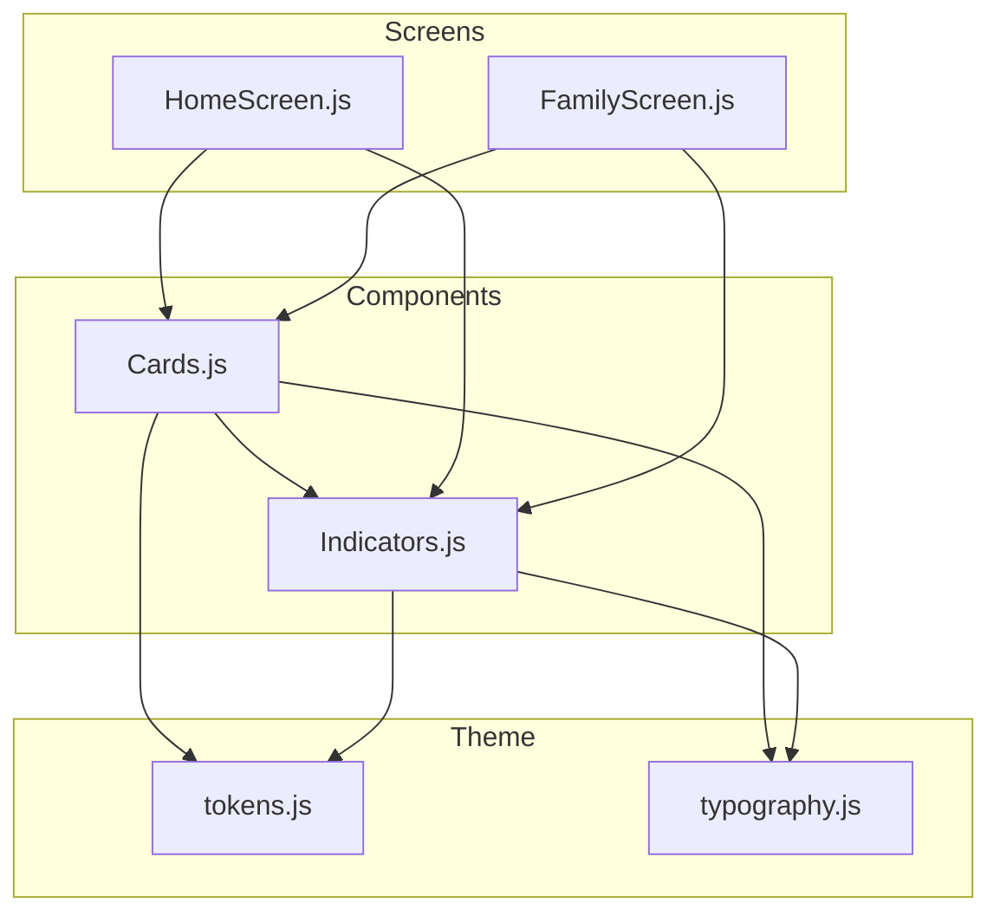
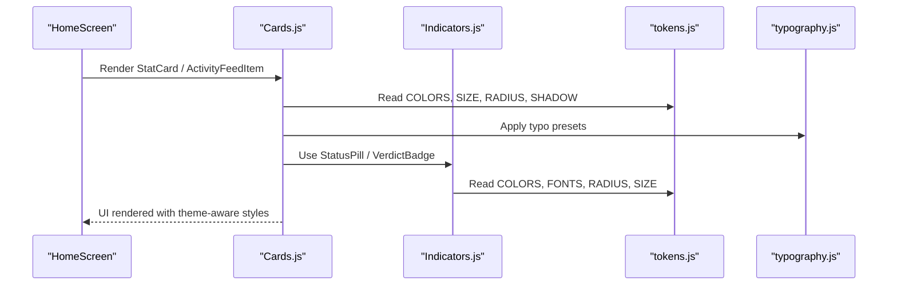
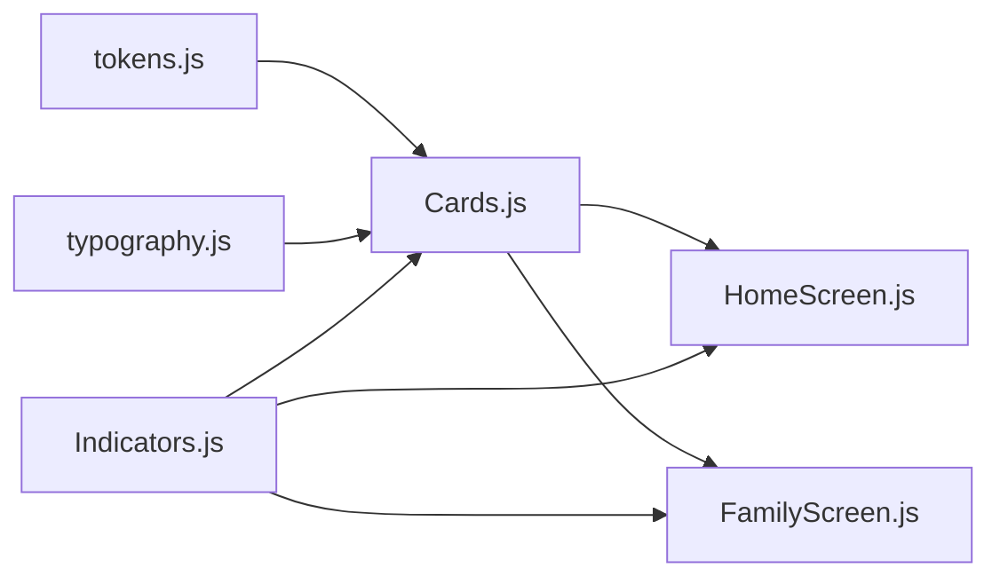

# Card Components

<cite>
**Referenced Files in This Document**
- [Cards.js](file://src/components/Cards.js)
- [Indicators.js](file://src/components/Indicators.js)
- [tokens.js](file://src/theme/tokens.js)
- [typography.js](file://src/theme/typography.js)
- [HomeScreen.js](file://src/screens/HomeScreen.js)
- [FamilyScreen.js](file://src/screens/FamilyScreen.js)
</cite>

## Table of Contents
1. [Introduction](#introduction)
2. [Project Structure](#project-structure)
3. [Core Components](#core-components)
4. [Architecture Overview](#architecture-overview)
5. [Detailed Component Analysis](#detailed-component-analysis)
6. [Dependency Analysis](#dependency-analysis)
7. [Performance Considerations](#performance-considerations)
8. [Troubleshooting Guide](#troubleshooting-guide)
9. [Conclusion](#conclusion)
10. [Appendices](#appendices)

## Introduction
This document provides comprehensive documentation for the Card components library used across the application. It covers:
- StatCard for metrics display
- FamilyMemberCard for family member management
- ActivityFeedItem for activity logs
- Avatar for user representation

For each component, we explain purpose, visual design, interactive behaviors, data binding patterns, prop specifications, styling customization options, layout configurations, and usage examples from screens. We also address responsive design patterns, accessibility considerations, and integration with the theme system to help you create consistent card layouts and maintain visual hierarchy across screen sizes.

## Project Structure
The card components live under src/components and are consumed by screens such as HomeScreen and FamilyScreen. They rely on a shared design token system (colors, typography, spacing, radius, shadows) and small indicator components for status and verdict badges.

**Diagram sources**
- [Cards.js:1-193](file://src/components/Cards.js#L1-L193)
- [Indicators.js:1-106](file://src/components/Indicators.js#L1-L106)
- [tokens.js:1-129](file://src/theme/tokens.js#L1-L129)
- [typography.js:1-60](file://src/theme/typography.js#L1-L60)
- [HomeScreen.js:1-158](file://src/screens/HomeScreen.js#L1-L158)
- [FamilyScreen.js:1-101](file://src/screens/FamilyScreen.js#L1-L101)

**Section sources**
- [Cards.js:1-193](file://src/components/Cards.js#L1-L193)
- [tokens.js:1-129](file://src/theme/tokens.js#L1-L129)
- [typography.js:1-60](file://src/theme/typography.js#L1-L60)
- [HomeScreen.js:1-158](file://src/screens/HomeScreen.js#L1-L158)
- [FamilyScreen.js:1-101](file://src/screens/FamilyScreen.js#L1-L101)

## Core Components
- Avatar: Renders initials inside a circular container with configurable size and color.
- StatCard: Displays a numeric value, label, optional Urdu label, and an icon within a styled card.
- FamilyMemberCard: Shows a family member’s avatar, name, role badge, last protected time, and a status pill; pressable to navigate or act.
- ActivityFeedItem: Presents a timeline entry with a tone-based dot, type, message, verdict badge, and timestamp.

These components are built with React Native primitives and styled using the centralized tokens and typography presets.

**Section sources**
- [Cards.js:12-110](file://src/components/Cards.js#L12-L110)
- [tokens.js:7-119](file://src/theme/tokens.js#L7-L119)
- [typography.js:31-55](file://src/theme/typography.js#L31-L55)

## Architecture Overview
The cards integrate tightly with the theme system and indicators:
- Theme tokens provide colors, fonts, spacing, radius, and shadows.
- Typography presets standardize text styles for English and Urdu.
- Indicator components supply consistent status pills and verdict badges.
- Screens compose these components into dashboards and lists.

**Diagram sources**
- [HomeScreen.js:84-100](file://src/screens/HomeScreen.js#L84-L100)
- [Cards.js:47-110](file://src/components/Cards.js#L47-L110)
- [Indicators.js:10-43](file://src/components/Indicators.js#L10-L43)
- [tokens.js:7-119](file://src/theme/tokens.js#L7-L119)
- [typography.js:31-55](file://src/theme/typography.js#L31-L55)

## Detailed Component Analysis

### Avatar
Purpose:
- Provides a compact, accessible user representation using initials and a colored circle.

Visual Design:
- Circular shape with background color and white initials.
- Font size scales proportionally with the configured size.

Interactive Behaviors:
- None by default; can be wrapped in Pressable if needed.

Data Binding:
- name: string used to derive initials.
- color: background color for the avatar circle.
- size: diameter of the avatar.

Styling Customization:
- Override via props; internal styles use tokens for font family and color.

Layout Configuration:
- Fixed aspect ratio square; commonly used in headers and lists.

Usage Examples:
- Header avatar in HomeScreen.
- Overlapping avatars in FamilyScreen hero section.

Accessibility:
- Provide meaningful labels when wrapped in interactive elements.
- Ensure sufficient contrast between initials and background color.

Prop Specifications:
- name: string (default empty)
- color: string (default primary)
- size: number (default 44)

**Section sources**
- [Cards.js:12-26](file://src/components/Cards.js#L12-L26)
- [HomeScreen.js:51-57](file://src/screens/HomeScreen.js#L51-L57)
- [FamilyScreen.js:56-63](file://src/screens/FamilyScreen.js#L56-L63)

### StatCard
Purpose:
- Display key metrics with an icon, large numeric value, and descriptive label(s).

Visual Design:
- Card with subtle border, surface background, and shadow elevation.
- Icon in a tinted container; large number; concise label; optional Urdu label.

Interactive Behaviors:
- None by default; can be made pressable by wrapping in a parent Pressable.

Data Binding:
- value: string or number displayed prominently.
- label: string describing the metric.
- urduLabel: optional string for bilingual support.
- color: accent color for icon container.
- icon: Ionicons name for the icon.

Styling Customization:
- Uses tokens for radius, shadow, and colors; typography preset for numbers and labels.

Layout Configuration:
- Designed to flex within a row; works well in horizontal stacks with gap spacing.

Usage Examples:
- Row of three StatCards on HomeScreen dashboard.

Accessibility:
- Pair with accessible labels if interactive.
- Ensure color contrast for icon and text.

Prop Specifications:
- value: any (string/number)
- label: string
- urduLabel?: string
- color?: string (default primary)
- icon?: string (default shield-checkmark)

**Section sources**
- [Cards.js:47-59](file://src/components/Cards.js#L47-L59)
- [HomeScreen.js:84-89](file://src/screens/HomeScreen.js#L84-L89)

### FamilyMemberCard
Purpose:
- Represent a family member with identity, role, protection status, and last protected time.

Visual Design:
- Horizontal card with avatar, name, role badge, last protected text, and status pill.
- Soft shadow and border; press feedback reduces opacity.

Interactive Behaviors:
- Pressable; supports onPress callback for navigation or actions.

Data Binding:
- member: object containing name, role, status, lastProtected, color.
- onPress: function invoked on press.

Styling Customization:
- Role badge uses surface2 background; status pill maps status to safe/off variants.

Layout Configuration:
- Flex row with aligned items; margin around avatar and content.

Usage Examples:
- List of members in FamilyScreen with add-card action below.

Accessibility:
- Provide accessible hints for status (e.g., “Protected” vs “Offline”).
- Ensure readable role and status text.

Prop Specifications:
- member: { name: string, role: string, status: 'safe'|'off', lastProtected: string, color: string }
- onPress?: () => void

**Section sources**
- [Cards.js:61-86](file://src/components/Cards.js#L61-L86)
- [FamilyScreen.js:20-25](file://src/screens/FamilyScreen.js#L20-L25)
- [FamilyScreen.js:66-81](file://src/screens/FamilyScreen.js#L66-L81)

### ActivityFeedItem
Purpose:
- Show recent activity entries with severity tone, type, message, verdict badge, and time.

Visual Design:
- Left dot color indicates tone (danger/warn/safe).
- Compact card with type, truncated message, verdict badge, and timestamp.

Interactive Behaviors:
- None by default; can be wrapped in Pressable for detail views.

Data Binding:
- tone: 'danger' | 'warn' | 'safe'
- type: string
- message: string
- time: string

Styling Customization:
- Dot color and badge kind derived from tone.
- Uses typography presets and tokens for consistent look.

Layout Configuration:
- Horizontal layout with left dot, flexible content area, and right-aligned metadata.

Usage Examples:
- Recent activity list on HomeScreen.

Accessibility:
- Announce tone context when possible (e.g., “Danger: Scam alert”).
- Ensure truncation does not hide critical info.

Prop Specifications:
- tone?: 'danger'|'warn'|'safe' (default 'danger')
- type: string
- message: string
- time: string

**Section sources**
- [Cards.js:88-110](file://src/components/Cards.js#L88-L110)
- [HomeScreen.js:28-32](file://src/screens/HomeScreen.js#L28-L32)
- [HomeScreen.js:92-100](file://src/screens/HomeScreen.js#L92-L100)

### Supporting Indicators
- StatusPill: Displays contextual status with a colored left border and background.
- VerdictBadge: Shows scam/safe/suspicious verdict with icon and label.

These are used by FamilyMemberCard and ActivityFeedItem to communicate state consistently.

**Section sources**
- [Indicators.js:10-43](file://src/components/Indicators.js#L10-L43)
- [Cards.js:61-110](file://src/components/Cards.js#L61-L110)

## Dependency Analysis
- Cards depend on:
  - tokens.js for colors, fonts, spacing, radius, shadows
  - typography.js for standardized text styles
  - Indicators.js for status pills and verdict badges
- Screens depend on Cards and Indicators to compose UI quickly and consistently.

**Diagram sources**
- [Cards.js:1-110](file://src/components/Cards.js#L1-L110)
- [Indicators.js:1-43](file://src/components/Indicators.js#L1-L43)
- [tokens.js:1-119](file://src/theme/tokens.js#L1-L119)
- [typography.js:1-55](file://src/theme/typography.js#L1-L55)
- [HomeScreen.js:1-100](file://src/screens/HomeScreen.js#L1-L100)
- [FamilyScreen.js:1-81](file://src/screens/FamilyScreen.js#L1-L81)

**Section sources**
- [Cards.js:1-110](file://src/components/Cards.js#L1-L110)
- [Indicators.js:1-43](file://src/components/Indicators.js#L1-L43)
- [tokens.js:1-119](file://src/theme/tokens.js#L1-L119)
- [typography.js:1-55](file://src/theme/typography.js#L1-L55)
- [HomeScreen.js:1-100](file://src/screens/HomeScreen.js#L1-L100)
- [FamilyScreen.js:1-81](file://src/screens/FamilyScreen.js#L1-L81)

## Performance Considerations
- Keep lists of cards lightweight; avoid heavy computations in render.
- Reuse tokens and typography presets to minimize style recalculations.
- For long activity feeds, consider pagination or virtualized lists.
- Minimize unnecessary re-renders by memoizing expensive children if needed.

[No sources needed since this section provides general guidance]

## Troubleshooting Guide
Common issues and resolutions:
- Missing props: Ensure required props like member.name, member.status, and ActivityFeedItem.type/message/time are provided.
- Incorrect tone mapping: Verify tone values map to expected colors and badges.
- Style conflicts: If overriding styles, ensure tokens are respected to maintain consistency.
- Accessibility gaps: Add accessible labels and roles where components are wrapped in interactive elements.

**Section sources**
- [Cards.js:61-110](file://src/components/Cards.js#L61-L110)
- [Indicators.js:10-43](file://src/components/Indicators.js#L10-L43)

## Conclusion
The Card components provide a cohesive, theme-driven set of UI building blocks for metrics, family management, activity timelines, and user avatars. By leveraging tokens and typography presets, they ensure consistent visuals and behavior across the app. Follow the prop specifications and usage examples to integrate them effectively while maintaining accessibility and responsive design.

[No sources needed since this section summarizes without analyzing specific files]

## Appendices

### Prop Specifications Summary
- Avatar
  - name: string
  - color: string
  - size: number
- StatCard
  - value: string|number
  - label: string
  - urduLabel?: string
  - color?: string
  - icon?: string
- FamilyMemberCard
  - member: { name: string, role: string, status: 'safe'|'off', lastProtected: string, color: string }
  - onPress?: () => void
- ActivityFeedItem
  - tone?: 'danger'|'warn'|'safe'
  - type: string
  - message: string
  - time: string

**Section sources**
- [Cards.js:12-110](file://src/components/Cards.js#L12-L110)

### Usage Examples Reference
- Metrics row: See HomeScreen stats row.
- Family member list: See FamilyScreen member list.
- Activity timeline: See HomeScreen recent activity list.
- User avatar: See HomeScreen header and FamilyScreen hero avatars.

**Section sources**
- [HomeScreen.js:84-100](file://src/screens/HomeScreen.js#L84-L100)
- [FamilyScreen.js:66-81](file://src/screens/FamilyScreen.js#L66-L81)

### Responsive Design Patterns
- Use flex rows with gap for stat cards to adapt to varying widths.
- Truncate long messages in ActivityFeedItem to prevent overflow.
- Scale avatar size based on context (header vs hero).
- Maintain consistent padding and radius using tokens for visual harmony.

[No sources needed since this section provides general guidance]

### Accessibility Considerations
- Provide clear labels for interactive elements.
- Ensure sufficient color contrast for text and icons.
- Support bilingual content (English/Urdu) with appropriate typography settings.
- Announce status and verdicts meaningfully in assistive technologies.

[No sources needed since this section provides general guidance]

### Integration With Theme System
- Colors, fonts, spacing, radius, and shadows come from tokens.js.
- Typography presets from typography.js standardize text appearance.
- Indicators reuse tokens for consistent status and verdict visuals.

**Section sources**
- [tokens.js:7-119](file://src/theme/tokens.js#L7-L119)
- [typography.js:31-55](file://src/theme/typography.js#L31-L55)
- [Indicators.js:10-43](file://src/components/Indicators.js#L10-L43)