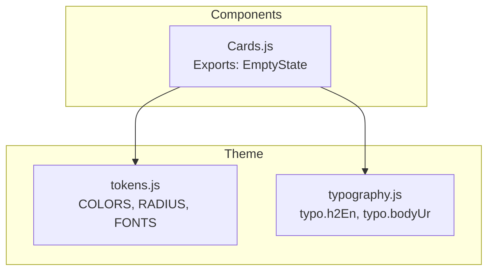
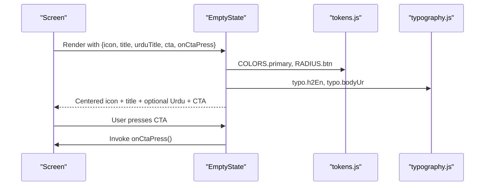
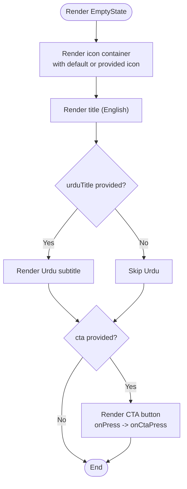
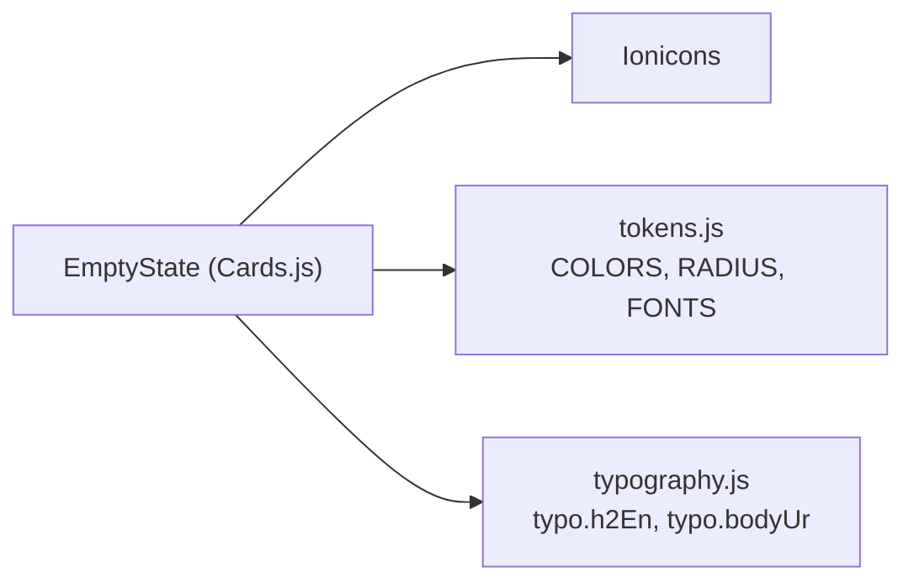

# EmptyState Component

<cite>
**Referenced Files in This Document**
- [Cards.js](file://src/components/Cards.js)
- [tokens.js](file://src/theme/tokens.js)
- [typography.js](file://src/theme/typography.js)
</cite>

## Table of Contents
1. [Introduction](#introduction)
2. [Project Structure](#project-structure)
3. [Core Components](#core-components)
4. [Architecture Overview](#architecture-overview)
5. [Detailed Component Analysis](#detailed-component-analysis)
6. [Dependency Analysis](#dependency-analysis)
7. [Performance Considerations](#performance-considerations)
8. [Troubleshooting Guide](#troubleshooting-guide)
9. [Conclusion](#conclusion)
10. [Appendices](#appendices)

## Introduction
The EmptyState component provides a consistent, accessible way to communicate when there is no data or action available in a screen. It displays a centered icon, a primary English title, an optional Urdu translation, and a prominent call-to-action (CTA) button that guides users toward the next meaningful step. It is designed for scenarios such as empty family member lists, inactive protection status, missing scan history, and initial setup prompts.

## Project Structure
EmptyState lives within the shared components library and is consumed by screens that need to render empty states consistently across the app.

**Diagram sources**
- [Cards.js:129-145](file://src/components/Cards.js#L129-L145)
- [tokens.js:7-93](file://src/theme/tokens.js#L7-L93)
- [typography.js:31-49](file://src/theme/typography.js#L31-L49)

**Section sources**
- [Cards.js:129-145](file://src/components/Cards.js#L129-L145)
- [tokens.js:7-93](file://src/theme/tokens.js#L7-L93)
- [typography.js:31-49](file://src/theme/typography.js#L31-L49)

## Core Components
EmptyState is a functional React Native component with the following props:
- icon: The Ionicons name used for the empty-state icon. Default is shield-outline.
- title: Primary message displayed below the icon.
- urduTitle: Optional Urdu translation shown beneath the title.
- cta: Optional call-to-action label text.
- onCtaPress: Optional handler invoked when the CTA is pressed.

Visual behavior:
- Centered layout with generous padding.
- Icon displayed inside a rounded container with a subtle background.
- Hierarchical text: English title first, then optional Urdu subtitle.
- Prominent CTA button styled with brand color and rounded corners.

Accessibility notes:
- The CTA is implemented using Pressable, which supports focus and keyboard interaction out of the box in React Native.
- For improved screen reader experience, consider adding accessibilityLabel to the Pressable and ensuring title and urduTitle are announced clearly.

Usage examples (conceptual):
- Empty family member list: Show a friendly message encouraging the user to add family members, with a CTA to invite them.
- Inactive protection status: Explain that protection is off and prompt to enable it.
- Missing scan history: Inform the user that no scans have been performed yet and guide them to start scanning.
- Initial setup prompt: Encourage completing onboarding steps to activate features.

**Section sources**
- [Cards.js:129-145](file://src/components/Cards.js#L129-L145)

## Architecture Overview
EmptyState composes theme tokens and typography presets to ensure visual consistency across the app.

**Diagram sources**
- [Cards.js:129-145](file://src/components/Cards.js#L129-L145)
- [tokens.js:7-93](file://src/theme/tokens.js#L7-L93)
- [typography.js:31-49](file://src/theme/typography.js#L31-L49)

## Detailed Component Analysis

### EmptyState Component
- Purpose: Communicate “no content” states clearly and guide users to the next action.
- Props:
  - icon: string (default 'shield-outline')
  - title: string (required for meaningful messaging)
  - urduTitle: string (optional; renders only if provided)
  - cta: string (optional; renders CTA button only if provided)
  - onCtaPress: function (optional; called when CTA is pressed)
- Layout:
  - Container uses centered alignment and padding for breathing room.
  - Icon container is a rounded square with a subtle surface background.
  - Title uses a large, bold English style; Urdu subtitle follows with appropriate RTL and line-height rules.
  - CTA is a full-width-ish button with brand color and rounded corners.
- Styling dependencies:
  - Colors from tokens (primary, surface2).
  - Typography presets for English heading and Urdu body.
  - Radius token for button corners.

**Diagram sources**
- [Cards.js:129-145](file://src/components/Cards.js#L129-L145)

**Section sources**
- [Cards.js:129-145](file://src/components/Cards.js#L129-L145)

### Visual Design Details
- Icon display: Centered in a rounded container sized to emphasize importance without overwhelming the screen.
- Text hierarchy:
  - English title uses a large, bold style for immediate comprehension.
  - Urdu subtitle uses proper RTL settings and increased line height for readability.
- CTA styling:
  - Uses brand primary color for high visibility.
  - Rounded corners match the design system’s button radius.
  - Sufficient padding ensures comfortable tap targets.

**Section sources**
- [tokens.js:7-93](file://src/theme/tokens.js#L7-L93)
- [typography.js:31-49](file://src/theme/typography.js#L31-L49)
- [Cards.js:129-145](file://src/components/Cards.js#L129-L145)

### Accessibility Guidelines
- Screen readers:
  - Ensure title and urduTitle are separate Text elements so they can be announced distinctly.
  - Add accessibilityLabel to the CTA Pressable to describe its action (e.g., “Add family member”).
- Keyboard navigation:
  - Pressable supports focus and activation via keyboard; ensure onCtaPress performs the intended action.
- Contrast and sizing:
  - Follow WCAG AA contrast guidelines for text and CTAs.
  - Maintain minimum hit target sizes for interactive elements.

[No sources needed since this section provides general guidance]

### Usage Scenarios and Messaging Guidelines
- Empty family member list:
  - Message: Encourage adding family members to protect loved ones.
  - CTA: “Add Family Member” or similar.
- Inactive protection status:
  - Message: Explain that protection is currently off and why it matters.
  - CTA: “Enable Protection”.
- Missing scan history:
  - Message: Invite users to scan SMS or links to detect threats.
  - CTA: “Scan Now”.
- Initial setup prompts:
  - Message: Guide users through essential setup steps.
  - CTA: “Get Started” or “Complete Setup”.

Crafting effective messages:
- Be clear, concise, and action-oriented.
- Educate users about benefits and next steps.
- Keep language simple and inclusive; avoid jargon.
- Maintain brand tone: supportive, trustworthy, and empowering.

[No sources needed since this section provides general guidance]

## Dependency Analysis
EmptyState depends on:
- Ionicons for rendering icons.
- Theme tokens for colors, radii, and fonts.
- Typography presets for consistent text styles.

**Diagram sources**
- [Cards.js:129-145](file://src/components/Cards.js#L129-L145)
- [tokens.js:7-93](file://src/theme/tokens.js#L7-L93)
- [typography.js:31-49](file://src/theme/typography.js#L31-L49)

**Section sources**
- [Cards.js:129-145](file://src/components/Cards.js#L129-L145)
- [tokens.js:7-93](file://src/theme/tokens.js#L7-L93)
- [typography.js:31-49](file://src/theme/typography.js#L31-L49)

## Performance Considerations
- EmptyState is lightweight and stateless; rendering cost is minimal.
- Avoid unnecessary re-renders by memoizing parent components when passing dynamic props.
- Use static icon names where possible to prevent icon library overhead.

[No sources needed since this section provides general guidance]

## Troubleshooting Guide
Common issues and resolutions:
- CTA not visible:
  - Ensure cta prop is provided; otherwise, the button will not render.
- Urdu text not displaying:
  - Verify urduTitle is passed; it is conditionally rendered only when provided.
- Incorrect styling:
  - Confirm that tokens and typography are imported correctly and not overridden locally.
- Accessibility concerns:
  - Add accessibilityLabel to the CTA Pressable for better screen reader announcements.
  - Ensure sufficient contrast between text and background.

**Section sources**
- [Cards.js:129-145](file://src/components/Cards.js#L129-L145)

## Conclusion
EmptyState offers a consistent, accessible, and visually aligned way to handle empty states across the application. By leveraging theme tokens and typography presets, it maintains brand consistency while guiding users toward meaningful actions. Proper messaging and accessibility enhancements ensure that users understand the context and can proceed confidently.

[No sources needed since this section summarizes without analyzing specific files]

## Appendices

### Prop Reference
- icon: string (default 'shield-outline')
- title: string (primary message)
- urduTitle: string (optional Urdu translation)
- cta: string (optional call-to-action text)
- onCtaPress: function (optional handler)

**Section sources**
- [Cards.js:129-145](file://src/components/Cards.js#L129-L145)

### Design Tokens Used
- COLORS.primary: Brand blue for CTA and icon color.
- COLORS.surface2: Subtle background for icon container.
- RADIUS.btn: Button corner radius.
- FONTS: Font families for English and Urdu.

**Section sources**
- [tokens.js:7-93](file://src/theme/tokens.js#L7-L93)

### Typography Presets Used
- typo.h2En: Large, bold English heading for title.
- typo.bodyUr: Urdu body with RTL and appropriate line height.

**Section sources**
- [typography.js:31-49](file://src/theme/typography.js#L31-L49)