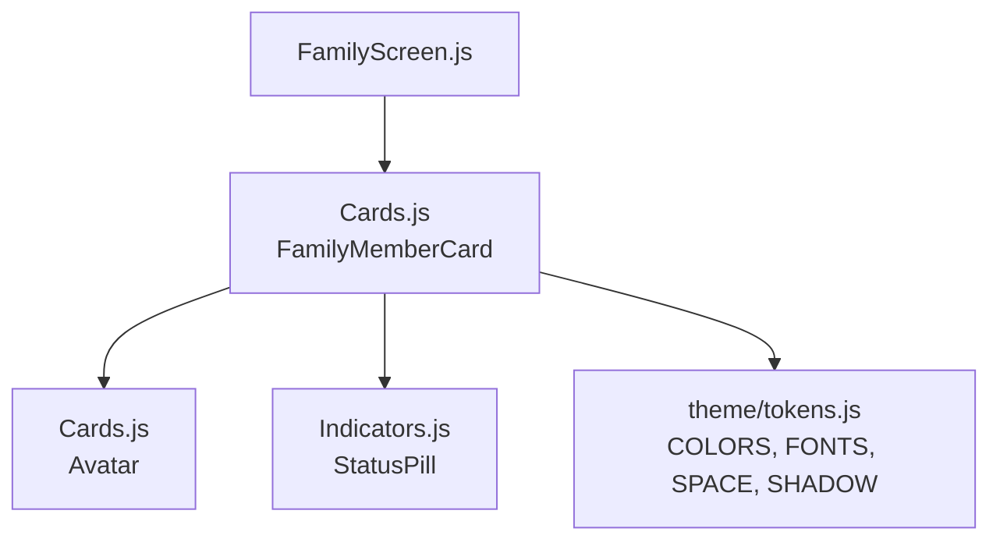
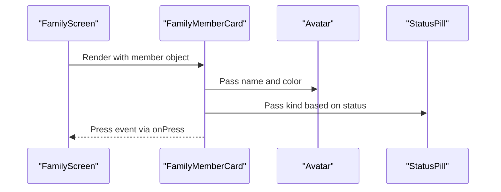
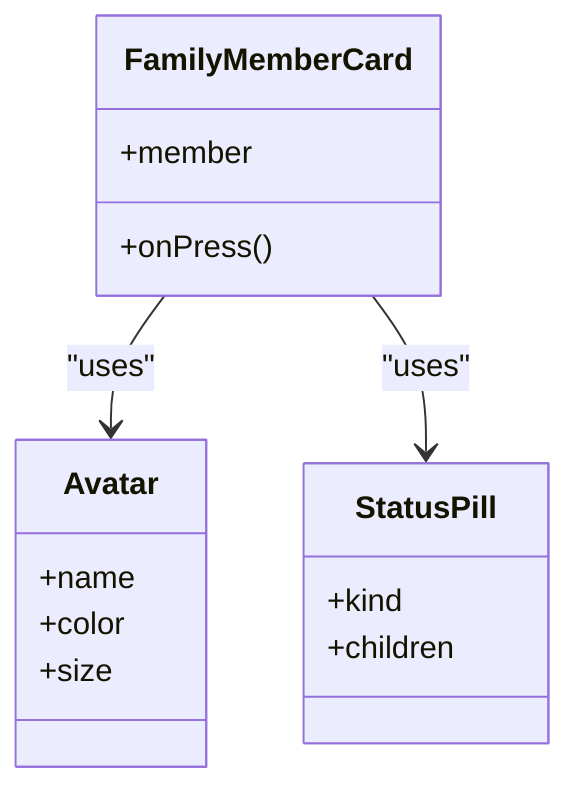
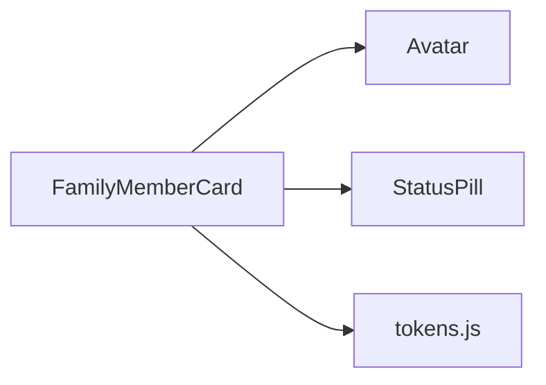

# FamilyMemberCard Component

<cite>
**Referenced Files in This Document**
- [Cards.js](file://src/components/Cards.js)
- [Indicators.js](file://src/components/Indicators.js)
- [FamilyScreen.js](file://src/screens/FamilyScreen.js)
- [tokens.js](file://src/theme/tokens.js)
</cite>

## Table of Contents
1. [Introduction](#introduction)
2. [Project Structure](#project-structure)
3. [Core Components](#core-components)
4. [Architecture Overview](#architecture-overview)
5. [Detailed Component Analysis](#detailed-component-analysis)
6. [Dependency Analysis](#dependency-analysis)
7. [Performance Considerations](#performance-considerations)
8. [Troubleshooting Guide](#troubleshooting-guide)
9. [Conclusion](#conclusion)
10. [Appendices](#appendices)

## Introduction
The FamilyMemberCard component displays a family member’s profile and real-time protection status within the family protection system. It shows an avatar, name, role badge, last protection timestamp, and a status pill indicating whether the member is currently protected or offline. The card is interactive via a press handler to support navigation or detailed views.

## Project Structure
The FamilyMemberCard lives in the shared components library and is consumed by the Family screen to render the list of family members. Visual tokens (colors, fonts, spacing, shadows) are centralized for consistent styling across the app.

**Diagram sources**
- [FamilyScreen.js:18-69](file://src/screens/FamilyScreen.js#L18-L69)
- [Cards.js:12-86](file://src/components/Cards.js#L12-L86)
- [Indicators.js:29-43](file://src/components/Indicators.js#L29-L43)
- [tokens.js:7-93](file://src/theme/tokens.js#L7-L93)

**Section sources**
- [FamilyScreen.js:18-69](file://src/screens/FamilyScreen.js#L18-L69)
- [Cards.js:12-86](file://src/components/Cards.js#L12-L86)
- [Indicators.js:29-43](file://src/components/Indicators.js#L29-L43)
- [tokens.js:7-93](file://src/theme/tokens.js#L7-L93)

## Core Components
- FamilyMemberCard: Renders a single family member row with avatar, name, role badge, last protection time, and status pill. It responds to press events for interaction.
- Avatar: Displays initials on a colored background derived from the member’s color prop.
- StatusPill: Shows a small status indicator with a left border accent and text; supports safe/off variants used by FamilyMemberCard.

Key responsibilities:
- Display member identity and role visually.
- Communicate current protection state at a glance.
- Provide an accessible press target for further actions.

**Section sources**
- [Cards.js:12-86](file://src/components/Cards.js#L12-L86)
- [Indicators.js:29-43](file://src/components/Indicators.js#L29-L43)

## Architecture Overview
The Family screen owns the member data and renders multiple FamilyMemberCard instances. Each card composes smaller UI primitives (Avatar, StatusPill) and uses design tokens for consistent appearance.

**Diagram sources**
- [FamilyScreen.js:20-69](file://src/screens/FamilyScreen.js#L20-L69)
- [Cards.js:61-86](file://src/components/Cards.js#L61-L86)
- [Indicators.js:29-43](file://src/components/Indicators.js#L29-L43)

## Detailed Component Analysis

### FamilyMemberCard
Role:
- Presents a compact, scannable view of a family member’s profile and protection status.
- Provides an interactive surface for user actions through onPress.

Props:
- member: Object containing:
  - name: string — displayed as both label and avatar initials.
  - color: string — background color for the avatar.
  - role: string — shown in a small role badge (e.g., Ammi, Abu, Behan, Bhai).
  - lastProtected: string — human-readable timestamp shown under the name.
  - status: string — 'safe' or 'off', mapped to PROTECTED or OFFLINE.
- onPress: function — invoked when the card is pressed.

Visual behavior:
- Avatar shows initials derived from the name.
- Role badge displays the uppercase role value.
- Last protection timestamp is shown beneath the name.
- Status pill shows:
  - PROTECTED when status is 'safe'.
  - OFFLINE when status is 'off'.

Interaction:
- Pressing the card applies a visual opacity change and triggers onPress.

Data binding pattern:
- The Family screen maps over its MEMBERS array and passes each member object to FamilyMemberCard. No internal state is managed by the card; it is fully controlled by props.

Extensibility:
- To add new roles, simply pass different role strings; the badge will render them consistently.
- To introduce additional statuses, extend the mapping logic inside the component and update StatusPill usage accordingly.

**Section sources**
- [Cards.js:61-86](file://src/components/Cards.js#L61-L86)
- [FamilyScreen.js:20-69](file://src/screens/FamilyScreen.js#L20-L69)

#### Class-like structure diagram

**Diagram sources**
- [Cards.js:12-86](file://src/components/Cards.js#L12-L86)
- [Indicators.js:29-43](file://src/components/Indicators.js#L29-L43)

### StatusPill
Purpose:
- Renders a compact status indicator with a colored left border and background/text colors determined by kind.

Supported kinds used by FamilyMemberCard:
- safe: green-toned background and text for PROTECTED.
- off: muted background and text for OFFLINE.

Mapping:
- kind determines border color, background, and text color via a lookup table.

**Section sources**
- [Indicators.js:29-43](file://src/components/Indicators.js#L29-L43)

### Avatar
Purpose:
- Displays initials computed from the member’s name on a circular background using the provided color.

Behavior:
- Extracts first two letters from space-separated name parts and uppercases them.
- Uses a size-based font scale for readability.

**Section sources**
- [Cards.js:12-26](file://src/components/Cards.js#L12-L26)

### Data Flow and State Updates
- Data source: Family screen defines a static MEMBERS array and renders cards from it.
- State updates: Since FamilyMemberCard is presentational, any changes to protection status should be handled in the parent (FamilyScreen) by updating the MEMBERS array/state and re-rendering.
- Real-time status: Integrate a provider or context that updates member.status and lastProtected values; the cards will reflect changes automatically due to React’s declarative rendering.

Integration points:
- Family screen imports and renders FamilyMemberCard for each member.
- Cards use theme tokens for consistent visuals.

**Section sources**
- [FamilyScreen.js:20-69](file://src/screens/FamilyScreen.js#L20-L69)
- [Cards.js:61-86](file://src/components/Cards.js#L61-L86)

## Dependency Analysis
FamilyMemberCard depends on:
- Avatar (local component)
- StatusPill (from Indicators)
- Design tokens (colors, fonts, spacing, shadows)

**Diagram sources**
- [Cards.js:61-86](file://src/components/Cards.js#L61-L86)
- [Indicators.js:29-43](file://src/components/Indicators.js#L29-L43)
- [tokens.js:7-93](file://src/theme/tokens.js#L7-L93)

**Section sources**
- [Cards.js:61-86](file://src/components/Cards.js#L61-L86)
- [Indicators.js:29-43](file://src/components/Indicators.js#L29-L43)
- [tokens.js:7-93](file://src/theme/tokens.js#L7-L93)

## Performance Considerations
- Presentational component: FamilyMemberCard has no internal state, minimizing re-renders to when parent props change.
- Lightweight composition: Uses simple layout primitives and avoids heavy computations.
- Token-driven styles: Centralized tokens reduce style duplication and improve consistency.

[No sources needed since this section provides general guidance]

## Troubleshooting Guide
Common issues and resolutions:
- Missing member fields: Ensure member includes name, color, role, lastProtected, and status. Missing fields may cause undefined labels or empty badges.
- Incorrect status mapping: If status is not 'safe' or 'off', the card will default to OFFLINE. Validate incoming data before rendering.
- Press handling not firing: Verify onPress is passed and bound correctly in the parent. Check that the container is a Pressable and not blocked by other touch handlers.
- Inconsistent visuals: Confirm that tokens (COLORS, FONTS, SPACE, SHADOW) are imported and available. Misconfigured tokens can lead to unexpected colors or spacing.

**Section sources**
- [Cards.js:61-86](file://src/components/Cards.js#L61-L86)
- [Indicators.js:29-43](file://src/components/Indicators.js#L29-L43)
- [FamilyScreen.js:20-69](file://src/screens/FamilyScreen.js#L20-L69)

## Conclusion
FamilyMemberCard is a focused, reusable component for displaying family member profiles and protection status. It integrates seamlessly with the Family screen and leverages shared UI primitives and design tokens for consistency. Its presentational nature makes it easy to integrate into stateful flows where the parent manages data and updates.

[No sources needed since this section summarizes without analyzing specific files]

## Appendices

### Prop Specification
- member.name: string — displayed as label and avatar initials.
- member.color: string — background color for avatar.
- member.role: string — shown in a small role badge (e.g., Ammi, Abu, Behan, Bhai).
- member.lastProtected: string — human-readable timestamp shown below the name.
- member.status: 'safe' | 'off' — maps to PROTECTED or OFFLINE.
- onPress: function — invoked on card press.

**Section sources**
- [Cards.js:61-86](file://src/components/Cards.js#L61-L86)
- [FamilyScreen.js:20-69](file://src/screens/FamilyScreen.js#L20-L69)

### Usage Example Reference
- Rendering a list of family members with their protection status and role badges is demonstrated in the Family screen.

**Section sources**
- [FamilyScreen.js:20-69](file://src/screens/FamilyScreen.js#L20-L69)

### Extending the Component
To add new attributes or custom status indicators:
- Add new fields to the member object and render them conditionally in FamilyMemberCard.
- Extend StatusPill’s kind mapping to support new statuses with appropriate colors and labels.
- Update the parent’s data model and state management to propagate new fields and statuses.

**Section sources**
- [Indicators.js:29-43](file://src/components/Indicators.js#L29-L43)
- [Cards.js:61-86](file://src/components/Cards.js#L61-L86)