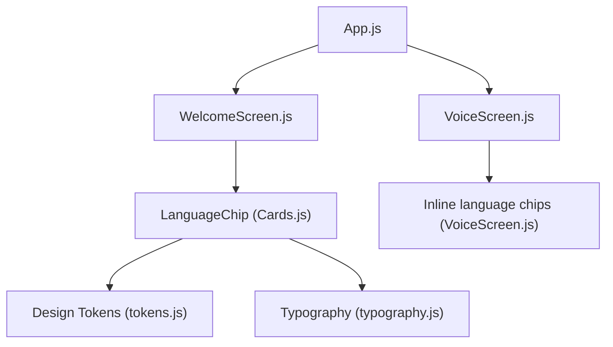
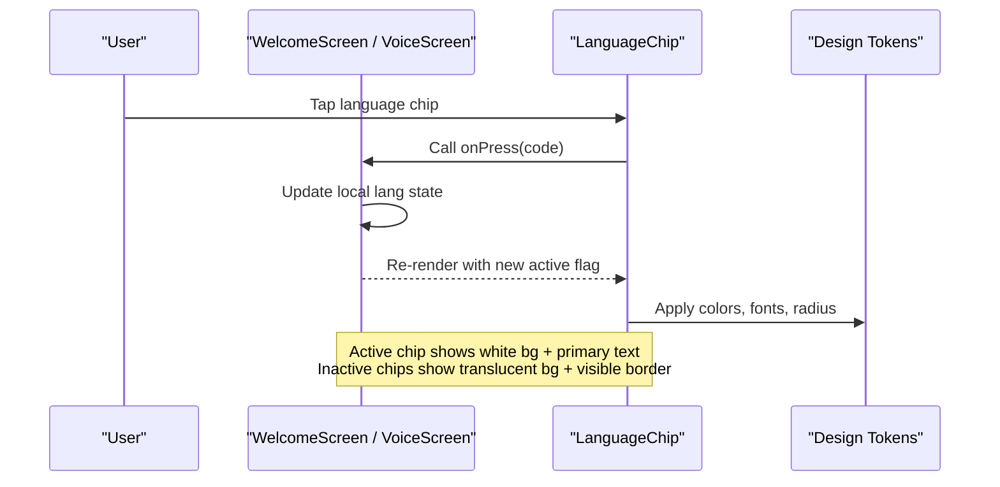
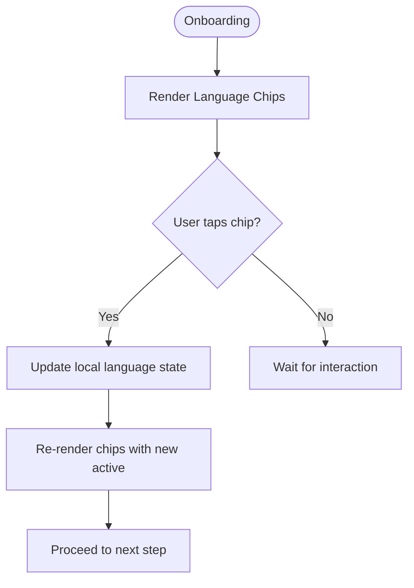
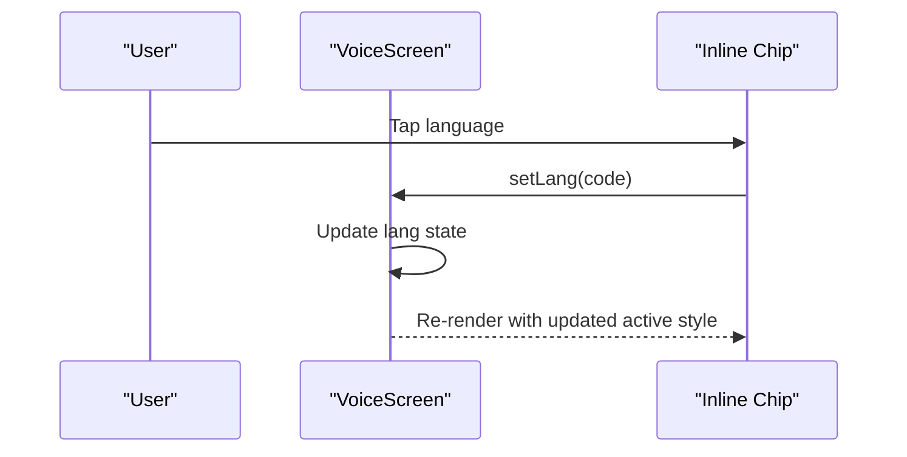
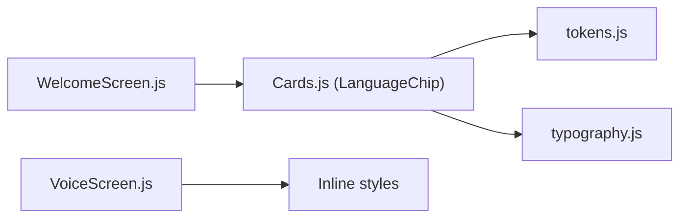

# LanguageChip Component

<cite>
**Referenced Files in This Document**
- [Cards.js](file://src/components/Cards.js)
- [WelcomeScreen.js](file://src/screens/WelcomeScreen.js)
- [VoiceScreen.js](file://src/screens/VoiceScreen.js)
- [tokens.js](file://src/theme/tokens.js)
- [typography.js](file://src/theme/typography.js)
- [App.js](file://App.js)
</cite>

## Table of Contents
1. [Introduction](#introduction)
2. [Project Structure](#project-structure)
3. [Core Components](#core-components)
4. [Architecture Overview](#architecture-overview)
5. [Detailed Component Analysis](#detailed-component-analysis)
6. [Dependency Analysis](#dependency-analysis)
7. [Performance Considerations](#performance-considerations)
8. [Troubleshooting Guide](#troubleshooting-guide)
9. [Conclusion](#conclusion)
10. [Appendices](#appendices)

## Introduction
LanguageChip is a reusable selection chip used to choose a language (English, Urdu, Roman Urdu) within the app’s bilingual interface. It visually indicates the active language and triggers an onPress callback to update the selected language. It is primarily used during onboarding and voice interactions to let users switch languages before proceeding or speaking.

## Project Structure
The LanguageChip component lives in the shared components library and is consumed by screens that need language selection:
- Component definition: src/components/Cards.js
- Onboarding usage: src/screens/WelcomeScreen.js
- Voice interaction usage: src/screens/VoiceScreen.js
- Design tokens and typography: src/theme/tokens.js, src/theme/typography.js
- App-level font loading for English and Urdu: App.js

**Diagram sources**
- [App.js:1-43](file://App.js#L1-L43)
- [WelcomeScreen.js:1-127](file://src/screens/WelcomeScreen.js#L1-L127)
- [VoiceScreen.js:1-228](file://src/screens/VoiceScreen.js#L1-L228)
- [Cards.js:112-127](file://src/components/Cards.js#L112-L127)
- [tokens.js:1-129](file://src/theme/tokens.js#L1-L129)
- [typography.js:1-60](file://src/theme/typography.js#L1-L60)

**Section sources**
- [Cards.js:112-127](file://src/components/Cards.js#L112-L127)
- [WelcomeScreen.js:10-16](file://src/screens/WelcomeScreen.js#L10-L16)
- [VoiceScreen.js:21-25](file://src/screens/VoiceScreen.js#L21-L25)
- [tokens.js:56-89](file://src/theme/tokens.js#L56-L89)
- [typography.js:1-60](file://src/theme/typography.js#L1-L60)
- [App.js:21-43](file://App.js#L21-L43)

## Core Components
- LanguageChip: A pressable chip that displays a flag emoji and a language label. It toggles visual state based on the active prop and calls onPress when tapped.
- Usage patterns:
  - Onboarding flow: Horizontal scroll of LanguageChip instances to pick the initial language.
  - Voice screen: Inline chips to select the language for voice input/output.

Key responsibilities:
- Visual feedback for active vs inactive states via background color and border changes.
- Clear label display with consistent typography and brand colors.
- Minimal, accessible tap target suitable for quick selection.

**Section sources**
- [Cards.js:112-127](file://src/components/Cards.js#L112-L127)
- [WelcomeScreen.js:64-75](file://src/screens/WelcomeScreen.js#L64-L75)
- [VoiceScreen.js:57-72](file://src/screens/VoiceScreen.js#L57-L72)

## Architecture Overview
LanguageChip integrates with the app’s design system and is used across screens to manage language selection state locally within each screen. The component relies on theme tokens for colors, fonts, and radii, ensuring consistent styling.

**Diagram sources**
- [WelcomeScreen.js:64-75](file://src/screens/WelcomeScreen.js#L64-L75)
- [VoiceScreen.js:57-72](file://src/screens/VoiceScreen.js#L57-L72)
- [Cards.js:112-127](file://src/components/Cards.js#L112-L127)
- [tokens.js:7-44](file://src/theme/tokens.js#L7-L44)

## Detailed Component Analysis

### LanguageChip Props and Behavior
- flag: Displays a small emoji icon representing the language (e.g., country flag).
- label: Human-readable language name shown next to the flag.
- active: Boolean indicating whether this chip is currently selected.
- onPress: Callback invoked when the chip is pressed; typically updates the parent’s language state.

Visual states:
- Active:
  - Background becomes solid white.
  - Border becomes transparent.
  - Label text color switches to the brand primary color.
- Inactive:
  - Background is semi-transparent white.
  - Border is visible with a subtle white tone.
  - Label text remains white.

Layout and typography:
- Uses a horizontal layout with gap between flag and label.
- Flag uses a fixed small font size.
- Label uses bold English font from tokens and a fixed size.

Accessibility considerations:
- Ensure hit targets meet minimum sizes (≥44pt) at the container level.
- Provide meaningful labels for screen readers (e.g., “Select English”) if needed in future enhancements.

Integration notes:
- The component does not manage persistence or i18n itself; it delegates to the parent screen’s state management.
- For RTL support, rely on the app’s typography and layout conventions; Urdu text should be rendered using dedicated Urdu styles elsewhere in the UI.

**Section sources**
- [Cards.js:112-127](file://src/components/Cards.js#L112-L127)
- [tokens.js:56-89](file://src/theme/tokens.js#L56-L89)
- [typography.js:1-60](file://src/theme/typography.js#L1-L60)

### Onboarding Flow Example (WelcomeScreen)
- Presents a horizontal list of LanguageChip components.
- Each chip receives its own flag and label, and active is computed by comparing the current language state with the item code.
- Pressing a chip updates the local language state, which can later drive navigation or further setup steps.

**Diagram sources**
- [WelcomeScreen.js:12-16](file://src/screens/WelcomeScreen.js#L12-L16)
- [WelcomeScreen.js:64-75](file://src/screens/WelcomeScreen.js#L64-L75)

**Section sources**
- [WelcomeScreen.js:12-16](file://src/screens/WelcomeScreen.js#L12-L16)
- [WelcomeScreen.js:64-75](file://src/screens/WelcomeScreen.js#L64-L75)

### Voice Interaction Example (VoiceScreen)
- Renders inline chips to select the language for voice input/output.
- Uses a similar active/inactive pattern but with custom inline styles tailored to the dark gradient background.
- State is managed locally per screen and drives UI updates immediately.

**Diagram sources**
- [VoiceScreen.js:21-25](file://src/screens/VoiceScreen.js#L21-L25)
- [VoiceScreen.js:57-72](file://src/screens/VoiceScreen.js#L57-L72)

**Section sources**
- [VoiceScreen.js:21-25](file://src/screens/VoiceScreen.js#L21-L25)
- [VoiceScreen.js:57-72](file://src/screens/VoiceScreen.js#L57-L72)

### Global Language Controls (Guidance)
While the current implementation manages language state per screen, a global control can be introduced by:
- Lifting language state to a context provider.
- Using LanguageChip in settings or header to update the global language.
- Persisting the choice to storage and applying it on app start.

This guidance aligns with existing architecture comments about a LanguageContext and persistent preferences.

[No sources needed since this section provides general guidance]

## Dependency Analysis
LanguageChip depends on:
- React Native primitives: View, Text, Pressable, I18nManager (imported in Cards.js).
- Design tokens: COLORS, FONTS, RADIUS from tokens.js.
- Typography presets: typo from typography.js (used by other components; LanguageChip uses direct font families).

Screens depend on LanguageChip:
- WelcomeScreen imports and renders LanguageChip for onboarding.
- VoiceScreen implements a similar inline chip pattern without importing LanguageChip.

**Diagram sources**
- [Cards.js:1-10](file://src/components/Cards.js#L1-L10)
- [Cards.js:112-127](file://src/components/Cards.js#L112-L127)
- [WelcomeScreen.js:10-16](file://src/screens/WelcomeScreen.js#L10-L16)
- [VoiceScreen.js:57-72](file://src/screens/VoiceScreen.js#L57-L72)
- [tokens.js:7-44](file://src/theme/tokens.js#L7-L44)
- [typography.js:1-60](file://src/theme/typography.js#L1-L60)

**Section sources**
- [Cards.js:1-10](file://src/components/Cards.js#L1-L10)
- [Cards.js:112-127](file://src/components/Cards.js#L112-L127)
- [WelcomeScreen.js:10-16](file://src/screens/WelcomeScreen.js#L10-L16)
- [VoiceScreen.js:57-72](file://src/screens/VoiceScreen.js#L57-L72)
- [tokens.js:7-44](file://src/theme/tokens.js#L7-L44)
- [typography.js:1-60](file://src/theme/typography.js#L1-L60)

## Performance Considerations
- Keep LanguageChip lightweight: it only renders two Text nodes inside a Pressable.
- Avoid unnecessary re-renders by passing stable references for onPress callbacks where possible.
- Use memoization in parent screens if rendering many chips (e.g., wrap with React.memo or useMemo for derived props).

[No sources needed since this section provides general guidance]

## Troubleshooting Guide
Common issues and resolutions:
- Chip not visually updating:
  - Ensure active prop correctly reflects the current language state in the parent.
  - Verify onPress updates the parent’s state and triggers re-render.
- Inconsistent styling:
  - Confirm design tokens are imported and used consistently.
  - Check that background and border values match the intended active/inactive states.
- Accessibility:
  - Ensure touch targets meet minimum sizes.
  - Add appropriate accessibility labels if needed for screen readers.

**Section sources**
- [Cards.js:112-127](file://src/components/Cards.js#L112-L127)
- [WelcomeScreen.js:64-75](file://src/screens/WelcomeScreen.js#L64-L75)
- [VoiceScreen.js:57-72](file://src/screens/VoiceScreen.js#L57-L72)

## Conclusion
LanguageChip provides a simple, consistent way to select languages in both onboarding and voice flows. It leverages the app’s design tokens for cohesive visuals and integrates cleanly with screen-level state management. For advanced needs like global language switching and persistence, lift state to a context and persist choices to storage while maintaining the same visual contract.

[No sources needed since this section summarizes without analyzing specific files]

## Appendices

### Prop Specifications Summary
- flag: Emoji or icon representing the language.
- label: Display name of the language.
- active: Boolean selection state controlling visual emphasis.
- onPress: Handler invoked on press to update language selection.

**Section sources**
- [Cards.js:112-127](file://src/components/Cards.js#L112-L127)

### Visual States Reference
- Active:
  - Background: Solid white.
  - Border: Transparent.
  - Label color: Brand primary.
- Inactive:
  - Background: Semi-transparent white.
  - Border: Visible subtle white tone.
  - Label color: White.

**Section sources**
- [Cards.js:112-127](file://src/components/Cards.js#L112-L127)

### Integration Guidelines
- Internationalization:
  - Manage language state in the parent screen or a global context.
  - Use typography helpers for Urdu text elsewhere in the UI.
- RTL support:
  - Follow typography rules for Urdu (writing direction and alignment).
- Persistence:
  - Store the selected language in local storage and apply on app start.
- Adding new languages:
  - Extend the language list in the consuming screen.
  - Ensure flags and labels are accurate and culturally appropriate.
- Consistent styling:
  - Prefer using LanguageChip for uniform appearance across screens.
  - If creating inline chips, mirror the active/inactive styles for consistency.
- Accessibility:
  - Maintain adequate contrast and hit targets.
  - Provide clear labels for assistive technologies.

**Section sources**
- [tokens.js:56-89](file://src/theme/tokens.js#L56-L89)
- [typography.js:1-60](file://src/theme/typography.js#L1-L60)
- [App.js:21-43](file://App.js#L21-L43)