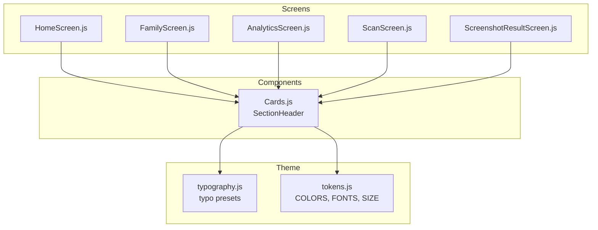
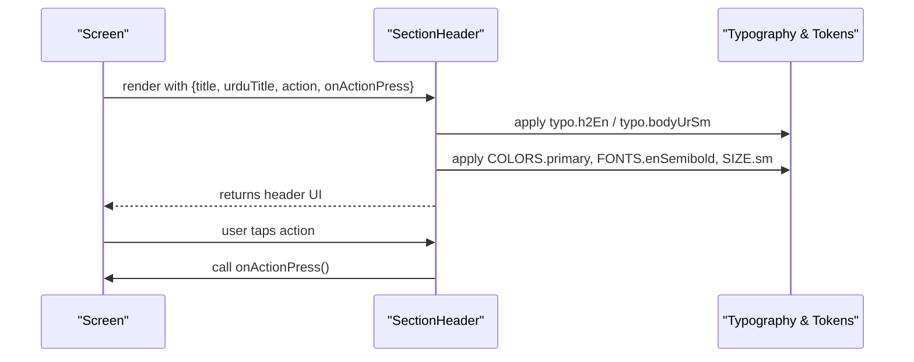
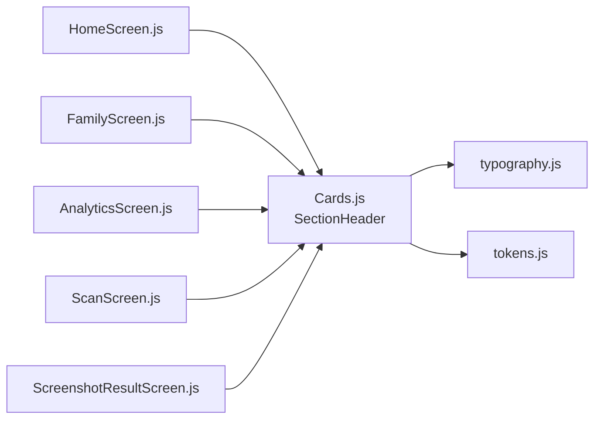

# SectionHeader Component

<cite>
**Referenced Files in This Document**
- [Cards.js](file://src/components/Cards.js)
- [typography.js](file://src/theme/typography.js)
- [tokens.js](file://src/theme/tokens.js)
- [HomeScreen.js](file://src/screens/HomeScreen.js)
- [FamilyScreen.js](file://src/screens/FamilyScreen.js)
- [AnalyticsScreen.js](file://src/screens/AnalyticsScreen.js)
- [ScanScreen.js](file://src/screens/ScanScreen.js)
- [ScreenshotResultScreen.js](file://src/screens/ScreenshotResultScreen.js)
</cite>

## Table of Contents
1. [Introduction](#introduction)
2. [Project Structure](#project-structure)
3. [Core Components](#core-components)
4. [Architecture Overview](#architecture-overview)
5. [Detailed Component Analysis](#detailed-component-analysis)
6. [Dependency Analysis](#dependency-analysis)
7. [Performance Considerations](#performance-considerations)
8. [Troubleshooting Guide](#troubleshooting-guide)
9. [Conclusion](#conclusion)
10. [Appendices](#appendices)

## Introduction
SectionHeader is a reusable component for creating consistent section titles across screens. It displays an English heading and an optional Urdu translation, with an optional action button on the right side to navigate or trigger actions. It integrates with the app’s typography system and design tokens to ensure visual consistency and bilingual support.

## Project Structure
The SectionHeader component lives in the shared components layer and is consumed by multiple screens to label content sections such as family members, recent activity, analytics breakdowns, and scan results.

**Diagram sources**
- [Cards.js:28-45](file://src/components/Cards.js#L28-L45)
- [typography.js:31-48](file://src/theme/typography.js#L31-L48)
- [tokens.js:7-78](file://src/theme/tokens.js#L7-L78)
- [HomeScreen.js:93-97](file://src/screens/HomeScreen.js#L93-L97)
- [FamilyScreen.js:67-67](file://src/screens/FamilyScreen.js#L67-L67)
- [AnalyticsScreen.js:89-89](file://src/screens/AnalyticsScreen.js#L89-L89)
- [ScanScreen.js:87-87](file://src/screens/ScanScreen.js#L87-L87)
- [ScreenshotResultScreen.js:77-77](file://src/screens/ScreenshotResultScreen.js#L77-L77)

**Section sources**
- [Cards.js:28-45](file://src/components/Cards.js#L28-L45)
- [typography.js:31-48](file://src/theme/typography.js#L31-L48)
- [tokens.js:7-78](file://src/theme/tokens.js#L7-L78)
- [HomeScreen.js:93-97](file://src/screens/HomeScreen.js#L93-L97)
- [FamilyScreen.js:67-67](file://src/screens/FamilyScreen.js#L67-L67)
- [AnalyticsScreen.js:89-89](file://src/screens/AnalyticsScreen.js#L89-L89)
- [ScanScreen.js:87-87](file://src/screens/ScanScreen.js#L87-L87)
- [ScreenshotResultScreen.js:77-77](file://src/screens/ScreenshotResultScreen.js#L77-L77)

## Core Components
SectionHeader renders:
- A primary English heading using the typography system.
- An optional Urdu subtitle beneath the English heading.
- An optional action button aligned to the right that triggers a provided handler.

It uses:
- Typography presets for English and Urdu text styles.
- Design tokens for colors, font families, and sizes.
- A horizontal layout with space-between alignment to separate title and action.

**Section sources**
- [Cards.js:28-45](file://src/components/Cards.js#L28-L45)
- [Cards.js:147-151](file://src/components/Cards.js#L147-L151)
- [typography.js:31-48](file://src/theme/typography.js#L31-L48)
- [tokens.js:7-78](file://src/theme/tokens.js#L7-L78)

## Architecture Overview
SectionHeader composes smaller UI primitives (View, Text, Pressable) and relies on centralized theme modules for styling. Screens import it from the components module and pass props to customize labels and actions.

**Diagram sources**
- [Cards.js:28-45](file://src/components/Cards.js#L28-L45)
- [typography.js:31-48](file://src/theme/typography.js#L31-L48)
- [tokens.js:7-78](file://src/theme/tokens.js#L7-L78)
- [HomeScreen.js:93-97](file://src/screens/HomeScreen.js#L93-L97)

## Detailed Component Analysis

### Props and Behavior
- title: English heading displayed prominently.
- urduTitle: Optional Urdu subtitle shown below the English heading.
- action: Optional action button text displayed on the right.
- onActionPress: Optional callback invoked when the action button is pressed.

Rendering rules:
- The title uses the English heading style from the typography system.
- If urduTitle is provided, it appears under the title with a small top margin.
- If action is provided, a pressable action button appears on the right; otherwise, the header is left-aligned only.

Layout:
- Horizontal row with space-between alignment.
- Title area takes available space; action aligns to the end.
- Bottom margin separates the header from following content.

**Section sources**
- [Cards.js:28-45](file://src/components/Cards.js#L28-L45)
- [Cards.js:147-151](file://src/components/Cards.js#L147-L151)

### Bilingual Support and RTL
- English heading uses the English typography preset.
- Urdu subtitle uses the Urdu typography preset which enforces RTL writing direction and right-aligned text.
- Urdu size is automatically adjusted relative to English via the design token helper.

This ensures correct reading order and alignment for both languages within the same header.

**Section sources**
- [typography.js:21-29](file://src/theme/typography.js#L21-L29)
- [typography.js:31-48](file://src/theme/typography.js#L31-L48)
- [tokens.js:80-81](file://src/theme/tokens.js#L80-L81)

### Integration With Typography System
- English heading: uses the h2 English preset.
- Urdu subtitle: uses the small Urdu body preset.
- Action text: uses semibold English font at the small size token and primary color.

This keeps headings consistent across screens and leverages the central typography definitions.

**Section sources**
- [Cards.js:33-40](file://src/components/Cards.js#L33-L40)
- [typography.js:31-48](file://src/theme/typography.js#L31-L48)
- [tokens.js:56-78](file://src/theme/tokens.js#L56-L78)

### Usage Examples Across Screens
- Family members list: displays “Members” with Urdu subtitle.
- Recent activity feed: displays “Recent Activity” with an action to see all items.
- Analytics dashboard: displays “Scam Breakdown” with Urdu subtitle.
- Scan results: displays “Last Check” with Urdu subtitle.
- Screenshot result issues: displays “Detected Issues” with Urdu subtitle.

These examples demonstrate consistent spacing, bilingual labeling, and optional actions.

**Section sources**
- [FamilyScreen.js:67-67](file://src/screens/FamilyScreen.js#L67-L67)
- [HomeScreen.js:93-97](file://src/screens/HomeScreen.js#L93-L97)
- [AnalyticsScreen.js:89-89](file://src/screens/AnalyticsScreen.js#L89-L89)
- [ScanScreen.js:87-87](file://src/screens/ScanScreen.js#L87-L87)
- [ScreenshotResultScreen.js:77-77](file://src/screens/ScreenshotResultScreen.js#L77-L77)

### Accessibility Considerations
- Semantic headings: Use SectionHeader to visually group sections. For strict semantic semantics, pair with native heading elements where appropriate in your navigation framework.
- Keyboard navigation: The action button is implemented with a pressable primitive that supports focus and activation via keyboard on supported platforms. Ensure onActionPress is meaningful and accessible.
- Screen reader announcements: Provide descriptive action text so screen readers can announce the purpose of the action. When possible, keep action text concise but informative.

[No sources needed since this section provides general guidance]

### Responsive Layout Handling
- The header uses a flexible row layout that adapts to different screen widths.
- The title area expands to fill available space while the action remains anchored to the right.
- Consistent bottom margin ensures predictable vertical rhythm between sections.

**Section sources**
- [Cards.js:147-151](file://src/components/Cards.js#L147-L151)

## Dependency Analysis
SectionHeader depends on:
- Typography presets for English and Urdu text styles.
- Design tokens for colors, fonts, and sizes.
- React Native primitives for layout and interaction.

Screens depend on SectionHeader to standardize section titles and provide consistent spacing and typography.

**Diagram sources**
- [Cards.js:28-45](file://src/components/Cards.js#L28-L45)
- [typography.js:31-48](file://src/theme/typography.js#L31-L48)
- [tokens.js:7-78](file://src/theme/tokens.js#L7-L78)
- [HomeScreen.js:93-97](file://src/screens/HomeScreen.js#L93-L97)
- [FamilyScreen.js:67-67](file://src/screens/FamilyScreen.js#L67-L67)
- [AnalyticsScreen.js:89-89](file://src/screens/AnalyticsScreen.js#L89-L89)
- [ScanScreen.js:87-87](file://src/screens/ScanScreen.js#L87-L87)
- [ScreenshotResultScreen.js:77-77](file://src/screens/ScreenshotResultScreen.js#L77-L77)

**Section sources**
- [Cards.js:28-45](file://src/components/Cards.js#L28-L45)
- [typography.js:31-48](file://src/theme/typography.js#L31-L48)
- [tokens.js:7-78](file://src/theme/tokens.js#L7-L78)

## Performance Considerations
- Minimal re-renders: SectionHeader is a simple functional component with no internal state.
- Lightweight dependencies: Uses static typography and token objects.
- Avoid unnecessary prop changes: Keep action and onActionPress stable to prevent extra renders in parent screens.

[No sources needed since this section provides general guidance]

## Troubleshooting Guide
- Urdu text not right-aligned: Ensure you are using the Urdu typography preset for subtitles; it enforces RTL and right alignment.
- Action button not visible: Verify that the action prop is provided; without it, the action area is omitted.
- Inconsistent spacing: Confirm that SectionHeader is placed with adequate top margin before content and that its built-in bottom margin is respected.
- Font sizing mismatch: Rely on the typography presets instead of hardcoding font sizes to maintain consistency.

**Section sources**
- [typography.js:21-29](file://src/theme/typography.js#L21-L29)
- [Cards.js:28-45](file://src/components/Cards.js#L28-L45)
- [Cards.js:147-151](file://src/components/Cards.js#L147-L151)

## Conclusion
SectionHeader provides a consistent, bilingual section title pattern with optional actions. It integrates tightly with the typography system and design tokens to ensure uniform visual hierarchy across screens. Use it to organize content into clear sections, support both English and Urdu, and maintain accessibility and responsive behavior.

[No sources needed since this section summarizes without analyzing specific files]

## Appendices

### Prop Specification Summary
- title: string — English heading.
- urduTitle: string? — Optional Urdu subtitle.
- action: string? — Optional action button text.
- onActionPress: function? — Optional handler for action button press.

**Section sources**
- [Cards.js:28-45](file://src/components/Cards.js#L28-L45)

### Example Scenarios
- Family members list: Show “Members” with Urdu subtitle above a list of family cards.
- Activity feeds: Show “Recent Activity” with an action to navigate to a full list.
- Analytics dashboards: Show “Scam Breakdown” with Urdu subtitle above chart or breakdown lists.

**Section sources**
- [FamilyScreen.js:67-67](file://src/screens/FamilyScreen.js#L67-L67)
- [HomeScreen.js:93-97](file://src/screens/HomeScreen.js#L93-L97)
- [AnalyticsScreen.js:89-89](file://src/screens/AnalyticsScreen.js#L89-L89)