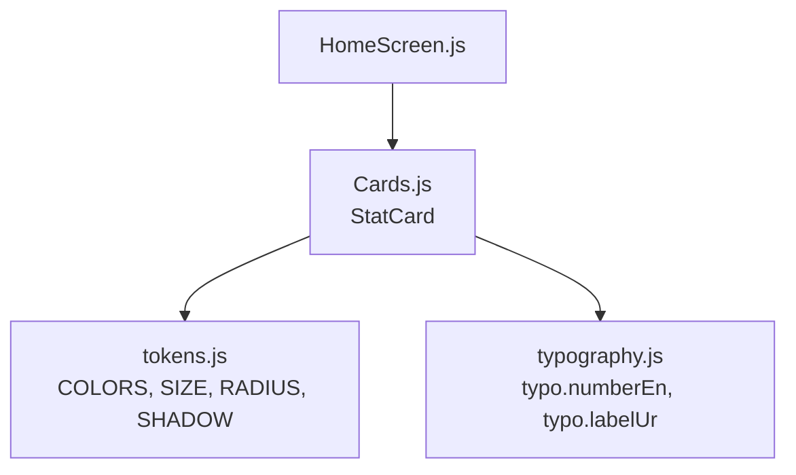
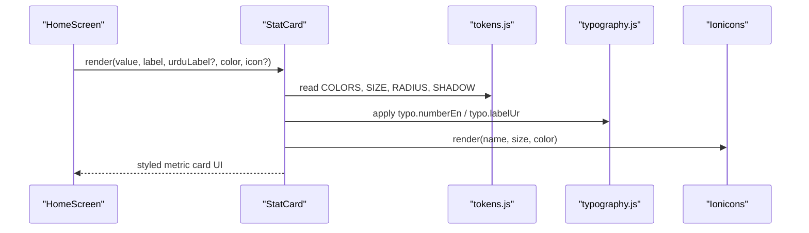
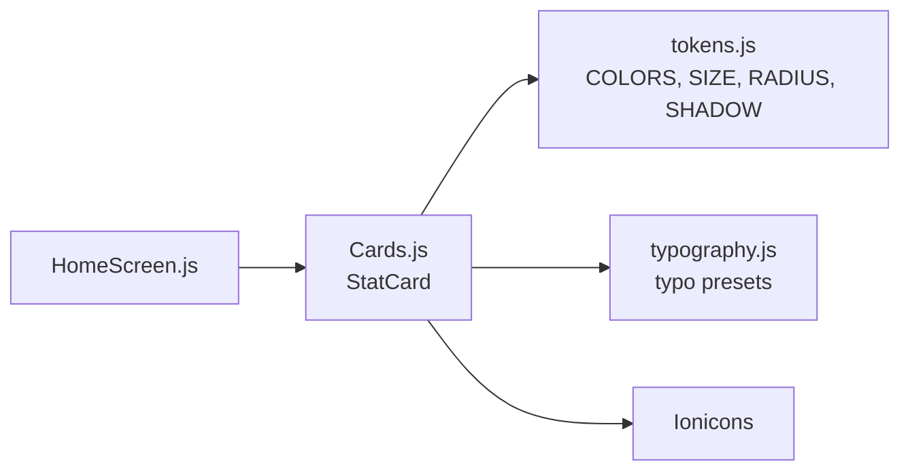

# StatCard Component

<cite>
**Referenced Files in This Document**
- [Cards.js](file://src/components/Cards.js)
- [HomeScreen.js](file://src/screens/HomeScreen.js)
- [tokens.js](file://src/theme/tokens.js)
- [typography.js](file://src/theme/typography.js)
</cite>

## Table of Contents
1. [Introduction](#introduction)
2. [Project Structure](#project-structure)
3. [Core Components](#core-components)
4. [Architecture Overview](#architecture-overview)
5. [Detailed Component Analysis](#detailed-component-analysis)
6. [Dependency Analysis](#dependency-analysis)
7. [Performance Considerations](#performance-considerations)
8. [Troubleshooting Guide](#troubleshooting-guide)
9. [Conclusion](#conclusion)
10. [Appendices](#appendices)

## Introduction
The StatCard component is a compact, reusable card used to display key metrics and statistics within the Safe Pakistan application. It presents a numeric value with an icon, an English label, and an optional Urdu translation. The component integrates with the app’s design system for colors, typography, spacing, and shadows, ensuring consistent visual presentation across screens.

Typical use cases include:
- Protection statistics (e.g., threats blocked)
- Money saved counters
- Threat detection metrics (e.g., total scans, family safe count)

## Project Structure
StatCard lives in the shared components library and is consumed by feature screens such as the Home dashboard. It relies on centralized theme tokens and typography presets to maintain consistency.

**Diagram sources**
- [HomeScreen.js:84-89](file://src/screens/HomeScreen.js#L84-L89)
- [Cards.js:47-59](file://src/components/Cards.js#L47-L59)
- [tokens.js:7-44](file://src/theme/tokens.js#L7-L44)
- [typography.js:31-48](file://src/theme/typography.js#L31-L48)

**Section sources**
- [Cards.js:47-59](file://src/components/Cards.js#L47-L59)
- [HomeScreen.js:84-89](file://src/screens/HomeScreen.js#L84-L89)
- [tokens.js:7-44](file://src/theme/tokens.js#L7-L44)
- [typography.js:31-48](file://src/theme/typography.js#L31-L48)

## Core Components
- StatCard: Displays a metric with an icon, numeric value, English label, and optional Urdu label. It uses the design system for styling and layout.

Key responsibilities:
- Render a visually distinct card with subtle shadow and border
- Show an icon inside a colored background tint derived from the accent color
- Display a large numeric value using tabular numbers for alignment
- Provide bilingual labeling support (English required; Urdu optional)

**Section sources**
- [Cards.js:47-59](file://src/components/Cards.js#L47-L59)

## Architecture Overview
StatCard composes React Native primitives and leverages the theme system:
- Icons come from Ionicons
- Colors, sizes, radii, and shadows are imported from tokens
- Typography presets ensure consistent font weights, sizes, and line heights
- Screens compose multiple StatCards into responsive rows or grids

**Diagram sources**
- [HomeScreen.js:84-89](file://src/screens/HomeScreen.js#L84-L89)
- [Cards.js:47-59](file://src/components/Cards.js#L47-L59)
- [tokens.js:7-44](file://src/theme/tokens.js#L7-L44)
- [typography.js:31-48](file://src/theme/typography.js#L31-L48)

## Detailed Component Analysis

### Props
- value: Numeric or string displayed prominently as the metric. Uses tabular numbers for stable digit width.
- label: English text describing the metric.
- urduLabel: Optional Urdu translation shown beneath the English label when provided.
- color: Accent color for the icon and its background tint. Defaults to the brand primary color.
- icon: Ionicons name used for the metric icon. Defaults to a shield-related icon if not provided.

Behavioral notes:
- If urduLabel is omitted, only the English label is shown.
- The icon background tint is computed by appending a transparency suffix to the provided color.
- The numeric value uses a dedicated typography preset that enables tabular numerals for alignment.

**Section sources**
- [Cards.js:47-59](file://src/components/Cards.js#L47-L59)

### Styling and Theme Integration
- Background and borders: Surface color and border color from tokens.
- Shadow: Elevated card shadow from tokens for depth.
- Radius: Rounded corners via token radius.
- Typography:
  - Number uses a bold, large preset with tabular numbers.
  - Label uses a small semibold style with muted text color.
  - Urdu label uses a dedicated Urdu preset with right-to-left alignment and increased line height.
- Spacing: Internal padding and margins are applied to create a balanced layout.

**Section sources**
- [Cards.js:147-159](file://src/components/Cards.js#L147-L159)
- [tokens.js:7-44](file://src/theme/tokens.js#L7-L44)
- [tokens.js:83-119](file://src/theme/tokens.js#L83-L119)
- [typography.js:31-48](file://src/theme/typography.js#L31-L48)

### Usage Examples
- Protection statistics: Display threats blocked with a danger color and shield icon.
- Money saved counters: Use a neutral or success color to highlight savings.
- Threat detection metrics: Show total scans or family-safe counts with appropriate icons and colors.

Example usage pattern in a screen row:
- Three StatCards side-by-side showing different metrics with distinct colors and icons.

**Section sources**
- [HomeScreen.js:84-89](file://src/screens/HomeScreen.js#L84-L89)

### Accessibility Considerations
- Color contrast: Ensure the chosen color provides sufficient contrast against the card surface for the icon and any overlaid elements.
- Semantic labels: When StatCard is part of a larger interactive element, provide accessible names/descriptions at the parent level to convey context to assistive technologies.
- Numeric clarity: Tabular numbers improve readability for aligned metrics; avoid overly compressed layouts that reduce legibility.
- Language: When providing both English and Urdu labels, ensure the order and hierarchy remain clear for screen readers.

[No sources needed since this section provides general guidance]

### Responsive Behavior
- Layout: StatCards are designed to flex within a row, allowing them to wrap or adjust based on available space.
- Typography: Fixed sizes are used for clarity; consider wrapping containers to prevent overflow on very narrow screens.
- Icons: Small, fixed-size icons keep the card compact and readable across devices.

[No sources needed since this section provides general guidance]

## Dependency Analysis
StatCard depends on:
- React Native primitives for layout and text rendering
- Ionicons for icons
- Design tokens for colors, sizes, radii, and shadows
- Typography presets for number and Urdu label styles

**Diagram sources**
- [Cards.js:47-59](file://src/components/Cards.js#L47-L59)
- [tokens.js:7-44](file://src/theme/tokens.js#L7-L44)
- [typography.js:31-48](file://src/theme/typography.js#L31-L48)
- [HomeScreen.js:84-89](file://src/screens/HomeScreen.js#L84-L89)

**Section sources**
- [Cards.js:47-59](file://src/components/Cards.js#L47-L59)
- [tokens.js:7-44](file://src/theme/tokens.js#L7-L44)
- [typography.js:31-48](file://src/theme/typography.js#L31-L48)
- [HomeScreen.js:84-89](file://src/screens/HomeScreen.js#L84-L89)

## Performance Considerations
- Minimal re-renders: StatCard is a simple presentational component; pass stable props to avoid unnecessary updates.
- Icon rendering: Ionicons are lightweight; reuse common icons where possible.
- Text rendering: Using tabular numbers prevents layout shifts during dynamic number changes.

[No sources needed since this section provides general guidance]

## Troubleshooting Guide
- Icon not visible: Verify the icon prop matches a valid Ionicons name; otherwise, the default icon will be used.
- Urdu label not appearing: Ensure the urduLabel prop is provided; it is conditionally rendered.
- Color issues: Confirm the color prop has adequate contrast with the card background; check token values for accessibility.
- Layout overflow: On very small screens, ensure the container allows wrapping or horizontal scrolling for the stat row.

**Section sources**
- [Cards.js:47-59](file://src/components/Cards.js#L47-L59)

## Conclusion
StatCard provides a consistent, accessible, and theme-aware way to present metrics in Safe Pakistan. By leveraging the design tokens and typography presets, it ensures visual harmony across the app while supporting bilingual labeling and flexible customization through props.

[No sources needed since this section summarizes without analyzing specific files]

## Appendices

### Prop Reference Summary
- value: Numeric or string to display as the metric
- label: English description of the metric
- urduLabel: Optional Urdu translation
- color: Accent color for icon and background tint (defaults to brand primary)
- icon: Ionicons name for the metric icon (defaults to a shield-related icon)

**Section sources**
- [Cards.js:47-59](file://src/components/Cards.js#L47-L59)

### Example Scenarios
- Protection statistics: Show threats blocked with a danger color and shield icon
- Money saved counters: Highlight savings with a success or neutral color
- Threat detection metrics: Display scan counts or family safety status with appropriate icons

**Section sources**
- [HomeScreen.js:84-89](file://src/screens/HomeScreen.js#L84-L89)