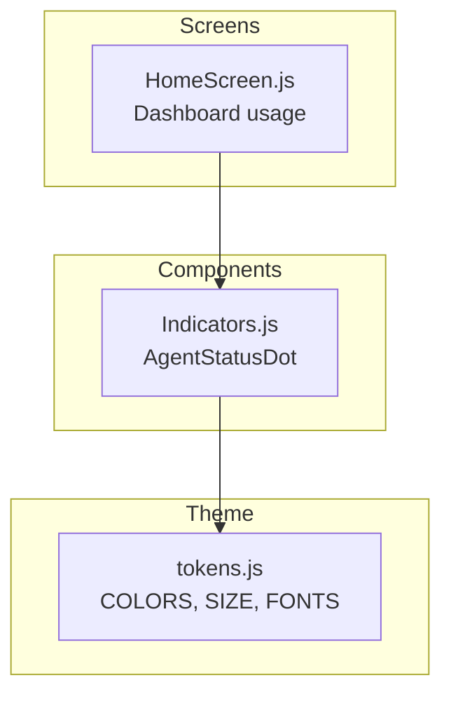
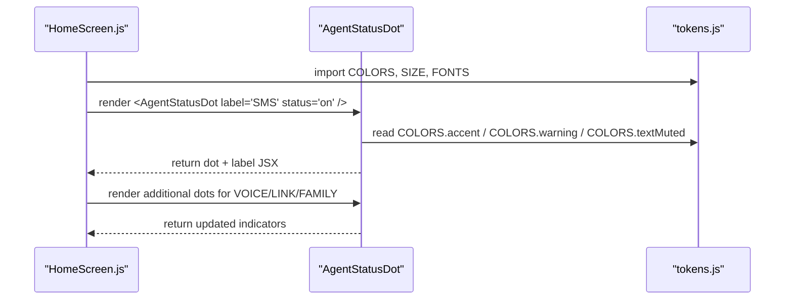
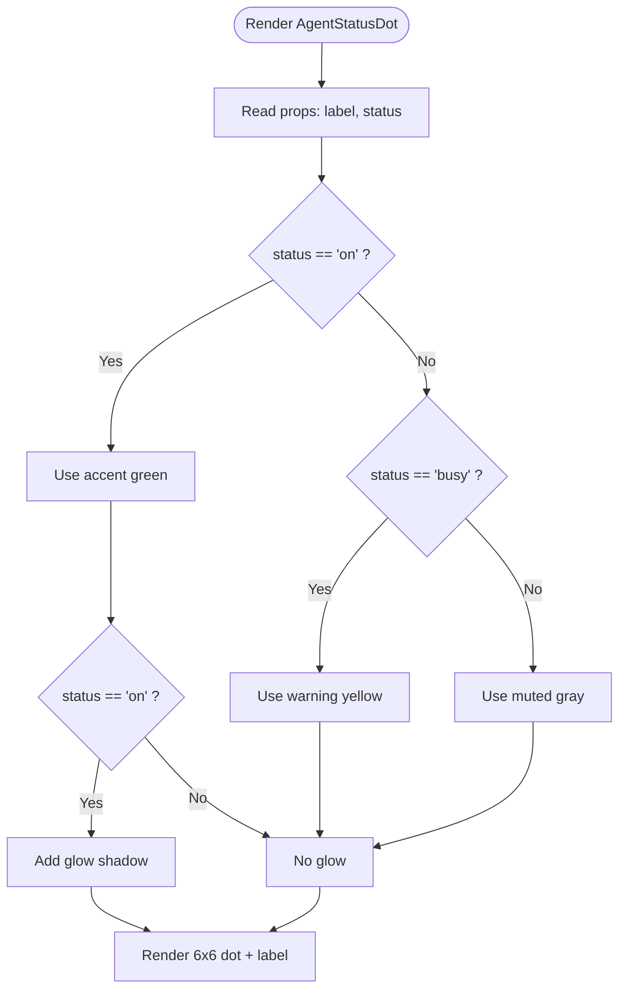
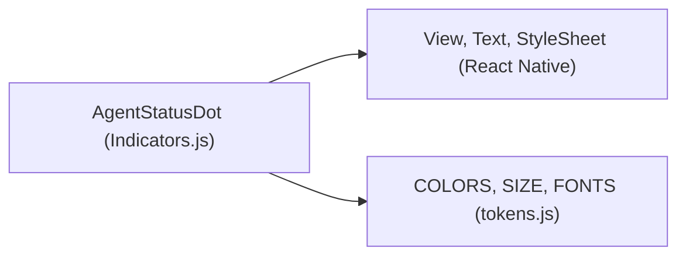

# AgentStatusDot Component

<cite>
**Referenced Files in This Document**
- [Indicators.js](file://src/components/Indicators.js)
- [HomeScreen.js](file://src/screens/HomeScreen.js)
- [tokens.js](file://src/theme/tokens.js)
</cite>

## Table of Contents
1. [Introduction](#introduction)
2. [Project Structure](#project-structure)
3. [Core Components](#core-components)
4. [Architecture Overview](#architecture-overview)
5. [Detailed Component Analysis](#detailed-component-analysis)
6. [Dependency Analysis](#dependency-analysis)
7. [Performance Considerations](#performance-considerations)
8. [Troubleshooting Guide](#troubleshooting-guide)
9. [Conclusion](#conclusion)
10. [Appendices](#appendices)

## Introduction
The AgentStatusDot component is a compact, real-time availability indicator used to display the status of agents (e.g., SMS, VOICE, LINK, FAMILY). It renders a small circular dot with an accompanying label and visually communicates three states:
- On: Active agent with a glow effect
- Busy: Warning state for limited or busy availability
- Default (muted): Inactive or unavailable agent

It is designed for dashboards and monitoring views where quick scanning of multiple agent statuses is essential.

## Project Structure
AgentStatusDot lives within a shared indicators module alongside other small UI indicators and is consumed by screens such as the Home dashboard. Design tokens define colors, typography, spacing, and motion timings used across the app.

**Diagram sources**
- [Indicators.js:60-77](file://src/components/Indicators.js#L60-L77)
- [HomeScreen.js:74-79](file://src/screens/HomeScreen.js#L74-L79)
- [tokens.js:7-44](file://src/theme/tokens.js#L7-L44)

**Section sources**
- [Indicators.js:1-106](file://src/components/Indicators.js#L1-L106)
- [HomeScreen.js:1-158](file://src/screens/HomeScreen.js#L1-L158)
- [tokens.js:1-129](file://src/theme/tokens.js#L1-L129)

## Core Components
AgentStatusDot is a functional React Native component that:
- Accepts two props:
  - label: string describing the agent (e.g., "SMS", "VOICE")
  - status: one of 'on', 'busy', or default (muted)
- Renders a 6x6 pixel circular dot with color mapped from design tokens
- Applies a glow shadow when status is 'on'
- Displays the label next to the dot using consistent typography and muted text color

Key behaviors:
- Color mapping:
  - 'on' → accent green
  - 'busy' → warning yellow
  - default → muted gray
- Glow effect:
  - Applied only when status === 'on'
  - Uses shadowColor, shadowOpacity, shadowRadius, and shadowOffset to create a soft glow around the dot

**Section sources**
- [Indicators.js:60-77](file://src/components/Indicators.js#L60-L77)
- [tokens.js:7-44](file://src/theme/tokens.js#L7-L44)

## Architecture Overview
AgentStatusDot integrates into the dashboard via HomeScreen, which demonstrates typical usage patterns for monitoring multiple agents side-by-side. The component relies on centralized design tokens for visual consistency.

**Diagram sources**
- [HomeScreen.js:74-79](file://src/screens/HomeScreen.js#L74-L79)
- [Indicators.js:60-77](file://src/components/Indicators.js#L60-L77)
- [tokens.js:7-44](file://src/theme/tokens.js#L7-L44)

## Detailed Component Analysis

### Visual Design and States
- Dot size: 6x6 pixels, fully rounded (borderRadius large enough to be circular)
- Colors:
  - Accent green for active ('on')
  - Warning yellow for busy ('busy')
  - Muted gray for default/inactive
- Typography:
  - Label uses semibold font at a small size with muted text color
- Spacing:
  - Row layout with gap between dot and label for clear alignment

**Diagram sources**
- [Indicators.js:60-77](file://src/components/Indicators.js#L60-L77)
- [tokens.js:7-44](file://src/theme/tokens.js#L7-L44)

### Props API
- label: string — descriptive name for the agent (e.g., "SMS", "VOICE", "LINK", "FAMILY")
- status: enum-like string — current availability state:
  - 'on': active with glow
  - 'busy': warning state
  - default (undefined or any other value): muted inactive

Usage example in dashboard:
- Multiple AgentStatusDot instances are rendered horizontally to show live status for different agents.

**Section sources**
- [Indicators.js:60-77](file://src/components/Indicators.js#L60-L77)
- [HomeScreen.js:74-79](file://src/screens/HomeScreen.js#L74-L79)

### Integration Patterns
- Dashboard row: Place several AgentStatusDot components in a horizontal row to compare agent statuses at a glance.
- Real-time updates: Bind the status prop to application state so changes reflect immediately in the UI.
- Theming: All colors and typography come from tokens, ensuring consistency across the app.

Example integration points:
- Import AgentStatusDot from the indicators module
- Pass dynamic label and status values derived from your data source
- Arrange in a flex row with appropriate gaps

**Section sources**
- [HomeScreen.js:18-19](file://src/screens/HomeScreen.js#L18-L19)
- [HomeScreen.js:74-79](file://src/screens/HomeScreen.js#L74-L79)

## Dependency Analysis
AgentStatusDot depends on:
- React Native primitives: View, Text, StyleSheet
- Theme tokens: COLORS, SIZE, FONTS
- Optional vector icons are not used by this component

**Diagram sources**
- [Indicators.js:5-8](file://src/components/Indicators.js#L5-L8)
- [tokens.js:7-44](file://src/theme/tokens.js#L7-L44)

**Section sources**
- [Indicators.js:5-8](file://src/components/Indicators.js#L5-L8)
- [tokens.js:7-44](file://src/theme/tokens.js#L7-L44)

## Performance Considerations
- Lightweight rendering: The component renders minimal native elements (two Views and one Text), keeping re-renders fast.
- Conditional styling: Shadow is applied only when status is 'on', avoiding unnecessary shadow calculations for inactive states.
- Reusability: Since it is a pure function of props, it can be safely reused across lists without extra overhead.
- Animation readiness: While no animation is currently implemented, the component’s structure allows easy extension with animations (e.g., pulsing glow) using standard timing or animation libraries.

[No sources needed since this section provides general guidance]

## Troubleshooting Guide
Common issues and resolutions:
- Status not updating: Ensure the parent component passes the correct status prop and triggers re-renders when state changes.
- Missing glow effect: Verify status is set to 'on'; glow is only applied in that case.
- Incorrect colors: Confirm that theme tokens are correctly imported and not overridden elsewhere.
- Label not visible: Check that the label prop is provided; the component expects a string for accessibility and clarity.

**Section sources**
- [Indicators.js:60-77](file://src/components/Indicators.js#L60-L77)
- [tokens.js:7-44](file://src/theme/tokens.js#L7-L44)

## Conclusion
AgentStatusDot provides a concise, accessible way to communicate agent availability in real-time dashboards. With clear state semantics, consistent theming, and a lightweight implementation, it fits seamlessly into monitoring interfaces. Extend it with animations or additional states as your product needs evolve, while maintaining the same prop contract and token-driven design.

[No sources needed since this section summarizes without analyzing specific files]

## Appendices

### Usage Examples
- Dashboard row showing multiple agents:
  - Render several AgentStatusDot components with distinct labels and statuses to indicate live availability.
- Real-time updates:
  - Bind status to application state; update state when backend signals change in agent availability.
- Availability indicators:
  - Use 'on' for active agents, 'busy' for limited capacity, and default for inactive or offline agents.

**Section sources**
- [HomeScreen.js:74-79](file://src/screens/HomeScreen.js#L74-L79)
- [Indicators.js:60-77](file://src/components/Indicators.js#L60-L77)