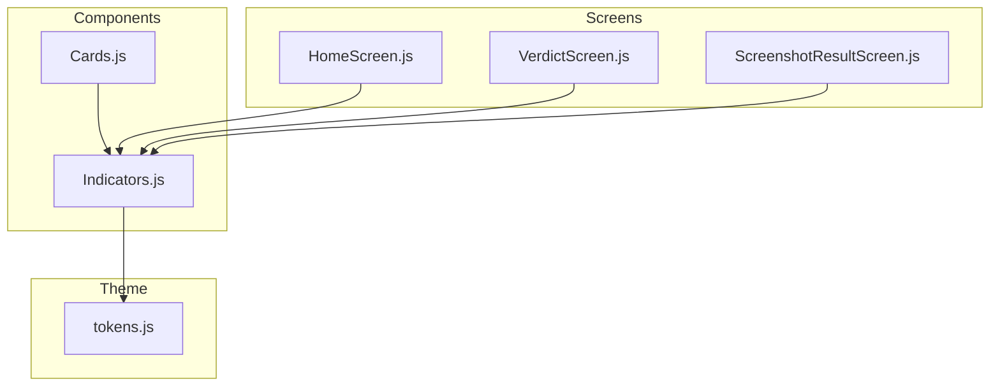
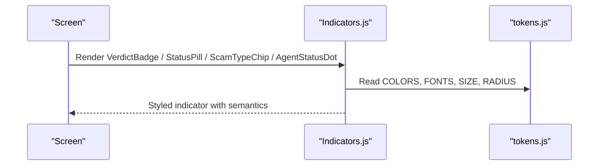
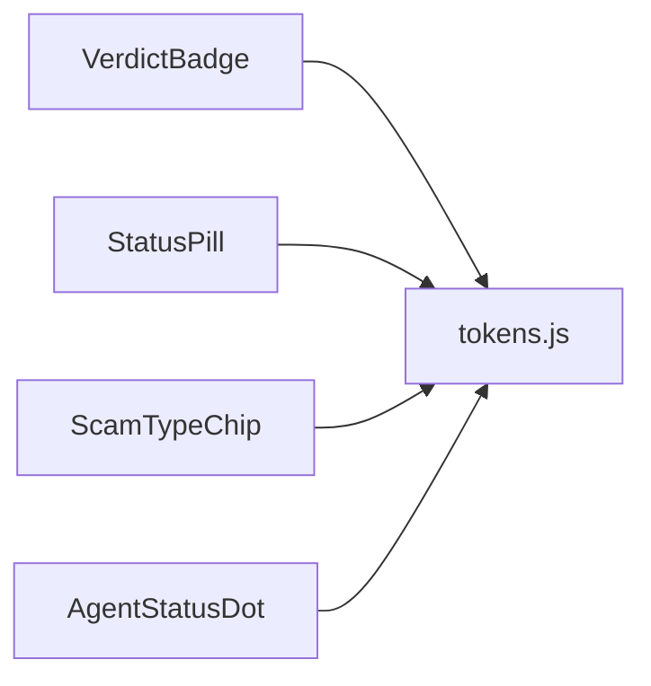

# Indicator Components

<cite>
**Referenced Files in This Document**
- [Indicators.js](file://src/components/Indicators.js)
- [tokens.js](file://src/theme/tokens.js)
- [HomeScreen.js](file://src/screens/HomeScreen.js)
- [Cards.js](file://src/components/Cards.js)
- [VerdictScreen.js](file://src/screens/VerdictScreen.js)
- [ScreenshotResultScreen.js](file://src/screens/ScreenshotResultScreen.js)
</cite>

## Table of Contents
1. Introduction
2. Project Structure
3. Core Components
4. Architecture Overview
5. Detailed Component Analysis
6. Dependency Analysis
7. Performance Considerations
8. Troubleshooting Guide
9. Conclusion
10. Appendices

## Introduction
This document provides comprehensive documentation for the Indicator components used across the application: VerdictBadge, StatusPill, ScamTypeChip, and AgentStatusDot. It explains each component’s visual appearance, semantic meaning, contextual usage, prop configurations, color schemes, sizing options, animation behaviors, accessibility considerations, internationalization notes, and guidelines for consistent usage throughout the interface.

## Project Structure
The indicators are implemented as small, reusable UI primitives in a single file and consumed by screens and cards to communicate status, verdicts, scam classifications, and agent availability at a glance.

**Diagram sources**
- [Indicators.js:1-106](file://src/components/Indicators.js#L1-L106)
- [HomeScreen.js:18-82](file://src/screens/HomeScreen.js#L18-L82)
- [Cards.js:10-109](file://src/components/Cards.js#L10-L109)
- [VerdictScreen.js:15-87](file://src/screens/VerdictScreen.js#L15-L87)
- [ScreenshotResultScreen.js:12-73](file://src/screens/ScreenshotResultScreen.js#L12-L73)
- [tokens.js:7-44](file://src/theme/tokens.js#L7-L44)

**Section sources**
- [Indicators.js:1-106](file://src/components/Indicators.js#L1-L106)
- [tokens.js:7-44](file://src/theme/tokens.js#L7-L44)

## Core Components
- VerdictBadge: A compact badge that communicates scan verdicts (SCAM, SAFE, SUSPICIOUS) with an icon and label. Supports two sizes.
- StatusPill: A pill-shaped indicator with a colored left border and background, used for status messages like “PROTECTED” or “OFFLINE”.
- ScamTypeChip: A categorized chip for scam types with tone-based coloring and optional icon.
- AgentStatusDot: A small dot with a label indicating real-time agent availability (on, busy, off).

These components rely on shared design tokens for colors, typography, spacing, and radii to ensure consistency.

**Section sources**
- [Indicators.js:10-77](file://src/components/Indicators.js#L10-L77)
- [tokens.js:7-44](file://src/theme/tokens.js#L7-L44)

## Architecture Overview
The indicators are decoupled from business logic and consume only theme tokens. Screens compose them into meaningful contexts:
- HomeScreen uses StatusPill and AgentStatusDot to show overall protection status and agent availability.
- Cards composes VerdictBadge and StatusPill within list items and family member cards.
- VerdictScreen and ScreenshotResultScreen use VerdictBadge and ScamTypeChip to present results and categorizations.

**Diagram sources**
- [Indicators.js:1-106](file://src/components/Indicators.js#L1-L106)
- [tokens.js:7-44](file://src/theme/tokens.js#L7-L44)
- [HomeScreen.js:67-82](file://src/screens/HomeScreen.js#L67-L82)
- [Cards.js:81-109](file://src/components/Cards.js#L81-L109)
- [VerdictScreen.js:69-78](file://src/screens/VerdictScreen.js#L69-L78)
- [ScreenshotResultScreen.js:54-73](file://src/screens/ScreenshotResultScreen.js#L54-L73)

## Detailed Component Analysis

### VerdictBadge
Purpose: Communicate scan verdicts with high visibility using an icon and uppercase label.

Visual appearance:
- Rounded chip with solid background color based on verdict kind.
- White icon and white text label.
- Two sizes: default and small.

Semantic meaning:
- scam: High risk; danger color.
- safe: Low risk; accent/dark green.
- susp: Medium risk; warning color.

Props:
- kind: 'scam' | 'safe' | 'susp'
- size: 'md' | 'sm'

Color scheme:
- Uses COLORS.danger, COLORS.accentDk, COLORS.warning for backgrounds.
- Text is always white for contrast.

Sizing:
- Small reduces padding, icon size, and font size.

Animation:
- None; static indicator.

Usage examples:
- Activity feed item shows a small VerdictBadge next to timestamp.
- Screenshot result screen displays a verdict badge alongside threat score and issues.

Accessibility:
- The component renders a visible label and icon. For improved screen reader support, consider adding accessible labels via aria attributes if wrapping in interactive elements.

Internationalization:
- Label strings are hardcoded in English. For i18n, externalize labels and map kinds to localized strings.

Guidelines:
- Use VerdictBadge when you need a concise verdict summary. Prefer small size in dense lists.

**Section sources**
- [Indicators.js:11-27](file://src/components/Indicators.js#L11-L27)
- [Cards.js:88-109](file://src/components/Cards.js#L88-L109)
- [ScreenshotResultScreen.js:54-73](file://src/screens/ScreenshotResultScreen.js#L54-L73)
- [tokens.js:7-44](file://src/theme/tokens.js#L7-L44)

### StatusPill
Purpose: Display short status messages with a colored left border and subtle background.

Visual appearance:
- Pill shape with rounded corners.
- Left border indicates severity or category.
- Background tint matches status context.

Semantic meaning:
- safe: Protected or low-risk state.
- danger: Error or high-risk state.
- warn: Warning or caution.
- info: Informational or neutral.
- off: Inactive or offline.

Props:
- kind: 'safe' | 'danger' | 'warn' | 'info' | 'off'
- children: Status message text

Color scheme:
- Border, background, and text colors mapped per kind using status helper tokens.

Sizing:
- Compact vertical padding and small font size suitable for inline placement.

Animation:
- None; static indicator.

Usage examples:
- HomeScreen hero shows “PROTECTED · MEHFOOZ” to indicate overall protection.
- Family member card shows “PROTECTED” or “OFFLINE” next to member name.

Accessibility:
- Ensure surrounding context conveys meaning. If used interactively, add appropriate roles and labels.

Internationalization:
- Children text should be localized through your i18n layer.

Guidelines:
- Use StatusPill for brief status summaries where color coding adds clarity. Avoid long text inside pills.

**Section sources**
- [Indicators.js:30-43](file://src/components/Indicators.js#L30-L43)
- [HomeScreen.js:67-82](file://src/screens/HomeScreen.js#L67-L82)
- [Cards.js:61-86](file://src/components/Cards.js#L61-L86)
- [tokens.js:32-38](file://src/theme/tokens.js#L32-L38)

### ScamTypeChip
Purpose: Categorize scam types with a tone-based palette and optional icon.

Visual appearance:
- Horizontal chip with icon and label.
- Background and text colors reflect tone.

Semantic meaning:
- danger: High-severity scam classification.
- warn: Caution-level classification.
- info: Neutral or informational classification.

Props:
- icon: Icon character or symbol (default warning-like).
- label: Classification label text.
- tone: 'danger' | 'warn' | 'info'

Color scheme:
- Uses status helper tokens for background and text per tone.

Sizing:
- Compact horizontal layout with small font size.

Animation:
- None; static indicator.

Usage examples:
- VerdictScreen references ScamTypeChip for categorization in library/screenshot flows.

Accessibility:
- Provide descriptive labels for icons if they convey meaning beyond text.

Internationalization:
- Localize label text and consider translating icon meanings where applicable.

Guidelines:
- Use ScamTypeChip to group related scam categories consistently across lists and detail views.

**Section sources**
- [Indicators.js:45-58](file://src/components/Indicators.js#L45-L58)
- [VerdictScreen.js:15-17](file://src/screens/VerdictScreen.js#L15-L17)
- [tokens.js:32-38](file://src/theme/tokens.js#L32-L38)

### AgentStatusDot
Purpose: Show real-time availability of agents with a small dot and label.

Visual appearance:
- Tiny circular dot with optional glow when active.
- Muted label text.

Semantic meaning:
- on: Active and available.
- busy: Occupied or processing.
- off: Inactive or unavailable.

Props:
- label: Agent name or type (e.g., SMS, VOICE, LINK, FAMILY).
- status: 'on' | 'busy' | 'off'

Color scheme:
- Accent for on, warning for busy, muted for off.

Sizing:
- Very small dot (6x6) with minimal spacing.

Animation:
- When status is 'on', a shadow glow is applied to emphasize availability.

Usage examples:
- HomeScreen hero lists multiple agents with their current status.

Accessibility:
- Add accessible hints for screen readers to describe agent states.

Internationalization:
- Labels should be localized to match app language settings.

Guidelines:
- Use AgentStatusDot in dashboards or headers to quickly communicate agent availability.

**Section sources**
- [Indicators.js:61-77](file://src/components/Indicators.js#L61-L77)
- [HomeScreen.js:74-82](file://src/screens/HomeScreen.js#L74-L82)
- [tokens.js:7-44](file://src/theme/tokens.js#L7-L44)

## Dependency Analysis
All indicators depend on shared design tokens for consistent styling. They do not import other components except icons and React Native primitives.

**Diagram sources**
- [Indicators.js:1-106](file://src/components/Indicators.js#L1-L106)
- [tokens.js:7-44](file://src/theme/tokens.js#L7-L44)

**Section sources**
- [Indicators.js:1-106](file://src/components/Indicators.js#L1-L106)
- [tokens.js:7-44](file://src/theme/tokens.js#L7-L44)

## Performance Considerations
- Indicators are lightweight and render minimal DOM nodes.
- No heavy animations; AgentStatusDot applies a simple shadow when active.
- Reuse tokens to avoid recalculating styles.
- Keep text concise to prevent layout shifts in tight spaces.

[No sources needed since this section provides general guidance]

## Troubleshooting Guide
Common issues and resolutions:
- Incorrect colors: Ensure correct token values are used and verify kind/status mappings.
- Misaligned pills: Check container flex behavior and padding; StatusPill uses left border and compact padding.
- Badge readability: Verify contrast between background and text; VerdictBadge uses white text on colored backgrounds.
- Agent dot visibility: Confirm status prop is set correctly; only 'on' triggers glow effect.

If issues persist:
- Inspect computed styles in the debugger.
- Validate token imports and ensure theme updates propagate.

**Section sources**
- [Indicators.js:11-77](file://src/components/Indicators.js#L11-L77)
- [tokens.js:7-44](file://src/theme/tokens.js#L7-L44)

## Conclusion
The Indicator components provide a consistent, token-driven way to communicate verdicts, statuses, scam classifications, and agent availability. By adhering to the documented props, color schemes, and usage guidelines, teams can maintain visual and semantic consistency across the application while ensuring accessibility and supporting future internationalization efforts.

[No sources needed since this section summarizes without analyzing specific files]

## Appendices

### Prop Reference Summary
- VerdictBadge
  - kind: 'scam' | 'safe' | 'susp'
  - size: 'md' | 'sm'
- StatusPill
  - kind: 'safe' | 'danger' | 'warn' | 'info' | 'off'
  - children: string
- ScamTypeChip
  - icon: string (default warning-like)
  - label: string
  - tone: 'danger' | 'warn' | 'info'
- AgentStatusDot
  - label: string
  - status: 'on' | 'busy' | 'off'

**Section sources**
- [Indicators.js:11-77](file://src/components/Indicators.js#L11-L77)

### Usage Examples by Context
- Verdict results: Use VerdictBadge in result screens and activity feeds to summarize outcomes.
- Status updates: Use StatusPill in hero sections and list items to show protection or offline states.
- Scam classifications: Use ScamTypeChip to categorize detected scam types with tone-appropriate colors.
- Agent availability: Use AgentStatusDot in dashboards to display real-time agent states.

**Section sources**
- [HomeScreen.js:67-82](file://src/screens/HomeScreen.js#L67-L82)
- [Cards.js:81-109](file://src/components/Cards.js#L81-L109)
- [VerdictScreen.js:69-78](file://src/screens/VerdictScreen.js#L69-L78)
- [ScreenshotResultScreen.js:54-73](file://src/screens/ScreenshotResultScreen.js#L54-L73)