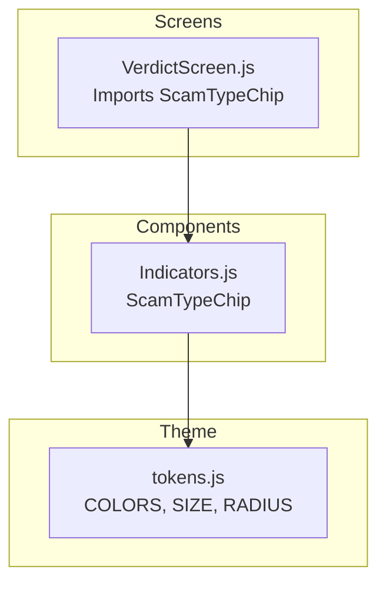
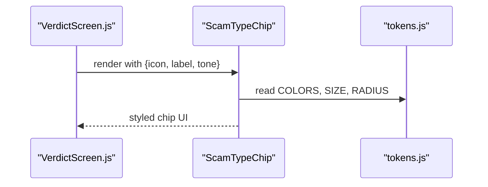
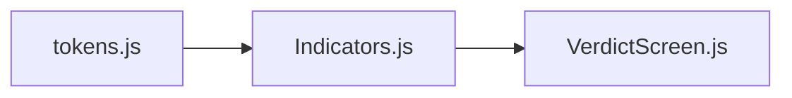

# ScamTypeChip Component

<cite>
**Referenced Files in This Document**
- [Indicators.js](file://src/components/Indicators.js)
- [tokens.js](file://src/theme/tokens.js)
- [VerdictScreen.js](file://src/screens/VerdictScreen.js)
</cite>

## Table of Contents
1. [Introduction](#introduction)
2. [Project Structure](#project-structure)
3. [Core Components](#core-components)
4. [Architecture Overview](#architecture-overview)
5. [Detailed Component Analysis](#detailed-component-analysis)
6. [Dependency Analysis](#dependency-analysis)
7. [Performance Considerations](#performance-considerations)
8. [Troubleshooting Guide](#troubleshooting-guide)
9. [Conclusion](#conclusion)
10. [Appendices](#appendices)

## Introduction
This document provides comprehensive documentation for the ScamTypeChip component, which categorizes and displays scam type classifications with an icon and a label. It supports three visual tones—danger (red), warn (yellow), and info (blue)—and uses a rounded chip design with appropriate background and text colors to ensure clarity and contrast. The component is designed for small inline indicators and integrates with the project’s design tokens for consistent theming.

## Project Structure
The ScamTypeChip component resides within the shared components module alongside other small indicators. It consumes centralized design tokens for colors, typography sizes, and border radius to maintain consistency across the app.

**Diagram sources**
- [Indicators.js:45-58](file://src/components/Indicators.js#L45-L58)
- [tokens.js:7-44](file://src/theme/tokens.js#L7-L44)
- [VerdictScreen.js:15-17](file://src/screens/VerdictScreen.js#L15-L17)

**Section sources**
- [Indicators.js:45-58](file://src/components/Indicators.js#L45-L58)
- [tokens.js:7-44](file://src/theme/tokens.js#L7-L44)
- [VerdictScreen.js:15-17](file://src/screens/VerdictScreen.js#L15-L17)

## Core Components
- ScamTypeChip: A compact, rounded chip that shows an icon and a label with tone-based styling. It accepts props for icon, label, and tone, and derives its palette from the design tokens.

Key responsibilities:
- Render a horizontal chip with icon and label
- Apply tone-specific background and text color
- Use consistent spacing, typography size, and border radius from tokens

**Section sources**
- [Indicators.js:45-58](file://src/components/Indicators.js#L45-L58)
- [Indicators.js:93-98](file://src/components/Indicators.js#L93-L98)

## Architecture Overview
ScamTypeChip is a presentational component that depends on the theme tokens for colors, font sizes, and border radius. Screens import it where they need to display scam type classifications.

**Diagram sources**
- [VerdictScreen.js:15-17](file://src/screens/VerdictScreen.js#L15-L17)
- [Indicators.js:45-58](file://src/components/Indicators.js#L45-L58)
- [tokens.js:7-44](file://src/theme/tokens.js#L7-L44)

## Detailed Component Analysis

### Props
- icon: string or React node representing the emoji or custom icon displayed inside the chip. Default value is provided.
- label: string used as the classification text shown next to the icon.
- tone: one of 'danger', 'warn', 'info' controlling the color scheme.

Behavior:
- tone maps to a palette object containing background and foreground colors.
- Icon and label both inherit the foreground color for contrast.
- Chip layout uses a row with gap and rounded corners based on token values.

**Section sources**
- [Indicators.js:45-58](file://src/components/Indicators.js#L45-L58)
- [Indicators.js:93-98](file://src/components/Indicators.js#L93-L98)

### Tone Options and Color Schemes
- danger: light red background with strong red text
- warn: light orange/yellow background with warm dark text
- info: light blue surface with primary blue text

These palettes are derived from the central color tokens to ensure consistency.

**Section sources**
- [Indicators.js:47-51](file://src/components/Indicators.js#L47-L51)
- [tokens.js:7-44](file://src/theme/tokens.js#L7-L44)

### Visual Appearance
- Rounded chip with horizontal layout
- Consistent padding and gap between icon and label
- Background color set by tone; text color set by tone for readability
- Typography size and font weight come from tokens for consistency

**Section sources**
- [Indicators.js:93-98](file://src/components/Indicators.js#L93-L98)
- [tokens.js:70-89](file://src/theme/tokens.js#L70-L89)

### Usage Examples
Below are example usages demonstrating different scam categories and tones. Replace the placeholder values with your actual data.

- Phishing (danger):
  - icon: "⚠" or a custom icon
  - label: "Phishing"
  - tone: "danger"

- Financial Fraud (warn):
  - icon: "⚠" or a custom icon
  - label: "Financial Fraud"
  - tone: "warn"

- Identity Theft (info):
  - icon: "⚠" or a custom icon
  - label: "Identity Theft"
  - tone: "info"

Note: These examples illustrate how to configure the component for different scam categories and tones.

[No sources needed since this section provides usage guidance without analyzing specific files]

### Accessibility
- Contrast: Each tone uses a background and text color pair selected from tokens to provide sufficient contrast for readability.
- Semantic structure: The chip groups an icon and label together using a container view, making it easy for screen readers to announce the combined content.
- Focus and interaction: As a presentational component, it does not handle focus or interactions directly. If you need accessibility features like aria-labels or focus management, wrap the chip in a parent component that adds those behaviors.

[No sources needed since this section provides general guidance]

### Responsive Behavior
- Layout: The chip uses a horizontal row with a fixed gap and flexible sizing based on content length. On smaller screens, chips can be arranged in rows or wrapped depending on their container layout.
- Typography: Uses token-based font sizes to scale consistently across devices.
- Spacing: Token-driven radius and padding ensure consistent appearance regardless of screen size.

[No sources needed since this section provides general guidance]

## Dependency Analysis
ScamTypeChip depends on:
- Design tokens for colors, typography sizes, and border radius
- Native primitives (View, Text) for rendering

It is imported by screens that require displaying scam type classifications.

**Diagram sources**
- [tokens.js:7-44](file://src/theme/tokens.js#L7-L44)
- [Indicators.js:45-58](file://src/components/Indicators.js#L45-L58)
- [VerdictScreen.js:15-17](file://src/screens/VerdictScreen.js#L15-L17)

**Section sources**
- [Indicators.js:45-58](file://src/components/Indicators.js#L45-L58)
- [tokens.js:7-44](file://src/theme/tokens.js#L7-L44)
- [VerdictScreen.js:15-17](file://src/screens/VerdictScreen.js#L15-L17)

## Performance Considerations
- Lightweight: The component renders minimal native views and text nodes.
- No heavy computations: Styling is derived from simple lookups and token values.
- Reuse: Since it relies on tokens, changes to theme propagate automatically without per-component updates.

[No sources needed since this section provides general guidance]

## Troubleshooting Guide
Common issues and resolutions:
- Missing label: Ensure the label prop is provided; otherwise, the chip will render without text.
- Invalid tone: Only 'danger', 'warn', and 'info' are supported. Using an unsupported tone may result in undefined styles.
- Icon rendering: If passing a custom icon, ensure it is compatible with the text context or use a string emoji for simplicity.
- Contrast concerns: Verify that the chosen tone provides adequate contrast against the app background.

**Section sources**
- [Indicators.js:45-58](file://src/components/Indicators.js#L45-L58)

## Conclusion
ScamTypeChip offers a simple, consistent way to display scam type classifications with clear visual cues via tone-based styling. By leveraging centralized design tokens, it ensures cohesive appearance and maintainability across the application. Use it to communicate risk levels and categories effectively in your screens.

[No sources needed since this section summarizes without analyzing specific files]

## Appendices

### API Reference Summary
- Props:
  - icon: string or React node (default provided)
  - label: string (required for meaningful content)
  - tone: 'danger' | 'warn' | 'info' (default 'danger')
- Styling:
  - Background and text colors determined by tone
  - Rounded chip with consistent padding and gap
  - Typography size and font weight from tokens

**Section sources**
- [Indicators.js:45-58](file://src/components/Indicators.js#L45-L58)
- [Indicators.js:93-98](file://src/components/Indicators.js#L93-L98)
- [tokens.js:7-44](file://src/theme/tokens.js#L7-L44)