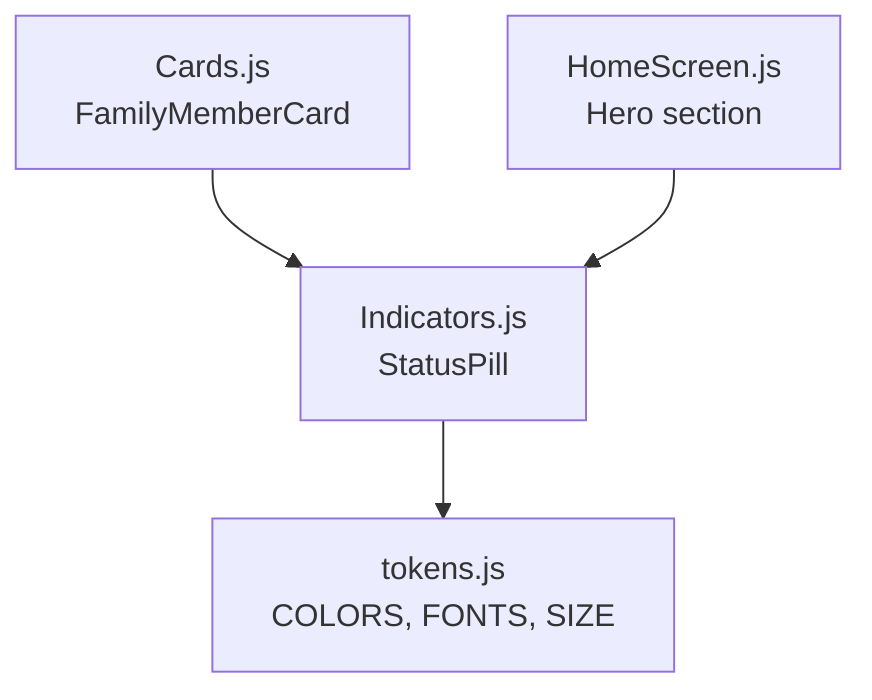
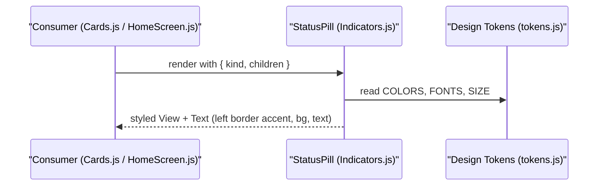
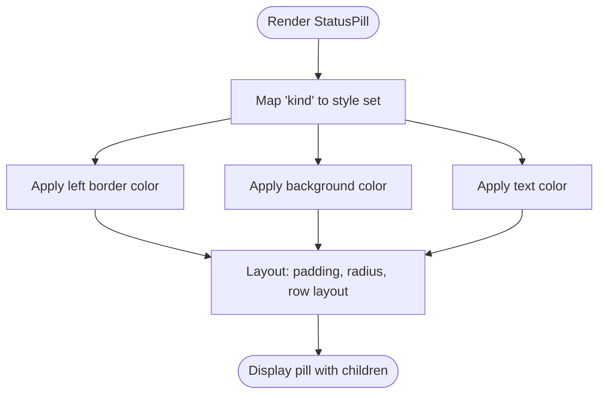
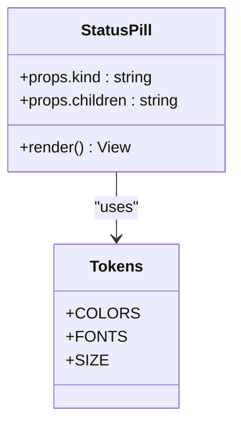
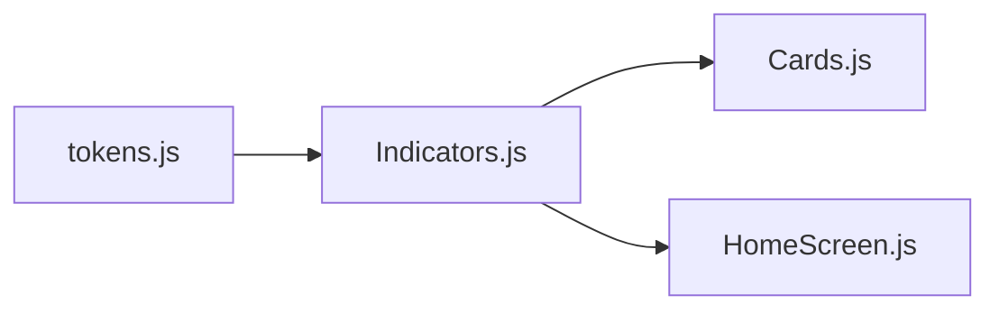

# StatusPill Component

<cite>
**Referenced Files in This Document**
- [Indicators.js](file://src/components/Indicators.js)
- [tokens.js](file://src/theme/tokens.js)
- [Cards.js](file://src/components/Cards.js)
- [HomeScreen.js](file://src/screens/HomeScreen.js)
</cite>

## Table of Contents
1. [Introduction](#introduction)
2. [Project Structure](#project-structure)
3. [Core Components](#core-components)
4. [Architecture Overview](#architecture-overview)
5. [Detailed Component Analysis](#detailed-component-analysis)
6. [Dependency Analysis](#dependency-analysis)
7. [Performance Considerations](#performance-considerations)
8. [Troubleshooting Guide](#troubleshooting-guide)
9. [Conclusion](#conclusion)
10. [Appendices](#appendices)

## Introduction
StatusPill is a compact inline indicator that displays status messages with a colored left border accent and themed background/text colors. It supports five status types: safe, danger, warn, info, and off. The component accepts a kind prop to select the visual theme and children content for custom text. It is used across the app to communicate safety, warnings, informational states, and inactive conditions consistently.

## Project Structure
StatusPill lives in the shared indicators module and is consumed by screens and cards throughout the application. Its styling relies on centralized design tokens for colors, typography, spacing, and radii.

**Diagram sources**
- [Indicators.js:29-43](file://src/components/Indicators.js#L29-L43)
- [tokens.js:7-44](file://src/theme/tokens.js#L7-L44)
- [Cards.js:61-86](file://src/components/Cards.js#L61-L86)
- [HomeScreen.js:60-82](file://src/screens/HomeScreen.js#L60-L82)

**Section sources**
- [Indicators.js:1-106](file://src/components/Indicators.js#L1-L106)
- [tokens.js:1-129](file://src/theme/tokens.js#L1-L129)
- [Cards.js:1-193](file://src/components/Cards.js#L1-L193)
- [HomeScreen.js:1-158](file://src/screens/HomeScreen.js#L1-L158)

## Core Components
- StatusPill: Renders a pill-shaped badge with a colored left border, themed background, and themed text color based on the selected kind.
- Design tokens: Centralized color palette and typography used by StatusPill to ensure consistent theming.

Key responsibilities:
- Map kind to a style set (border color, background color, text color).
- Render a container View with a left border accent and rounded corners.
- Render child text with appropriate font weight and size.

**Section sources**
- [Indicators.js:29-43](file://src/components/Indicators.js#L29-L43)
- [Indicators.js:86-91](file://src/components/Indicators.js#L86-L91)
- [tokens.js:7-44](file://src/theme/tokens.js#L7-L44)
- [tokens.js:56-78](file://src/theme/tokens.js#L56-L78)

## Architecture Overview
StatusPill composes React Native primitives and applies styles derived from design tokens. It is imported into feature components and screens where status communication is needed.

**Diagram sources**
- [Indicators.js:29-43](file://src/components/Indicators.js#L29-L43)
- [tokens.js:7-44](file://src/theme/tokens.js#L7-L44)
- [Cards.js:81-83](file://src/components/Cards.js#L81-L83)
- [HomeScreen.js:67-67](file://src/screens/HomeScreen.js#L67-L67)

## Detailed Component Analysis

### Props and Behavior
- kind: Selects one of five themes:
  - safe: green accent, light green background, green text
  - danger: red accent, light red background, red text
  - warn: yellow/orange accent, light orange background, warm text
  - info: blue accent, light blue surface background, blue text
  - off: muted gray accent, neutral background, muted text
- children: Custom text displayed inside the pill.

Visual design:
- Left border width and color provide a clear status accent.
- Background color provides subtle context without overwhelming content.
- Text color ensures readability and aligns with the chosen theme.
- Rounded corners and padding create a compact, pill-like shape.

Usage examples in the codebase:
- Family member status: shows “PROTECTED” or “OFFLINE” using safe/off kinds.
- Hero banner: shows a protected state with a safe kind.

Practical scenarios:
- Safety status: use kind="safe" to indicate protection or success.
- Danger warnings: use kind="danger" for critical alerts.
- Informational messages: use kind="info" for neutral guidance.
- Inactive states: use kind="off" for disabled or offline indicators.

Styling customization:
- To change the accent color, background, or text color per kind, update the mapping in the component.
- To adjust shape or spacing, modify the shared styles for the pill container and text.
- For global consistency, prefer updating design tokens rather than ad-hoc overrides.

Integration patterns:
- Import StatusPill from the indicators module and place it inline within lists, cards, or headers.
- Combine with other indicators like VerdictBadge or AgentStatusDot for richer status contexts.

**Section sources**
- [Indicators.js:29-43](file://src/components/Indicators.js#L29-L43)
- [Indicators.js:86-91](file://src/components/Indicators.js#L86-L91)
- [Cards.js:81-83](file://src/components/Cards.js#L81-L83)
- [HomeScreen.js:67-67](file://src/screens/HomeScreen.js#L67-L67)

### Visual Design Details
- Border accent: left border width and color are applied via the mapped style for each kind.
- Background: uses semantic background tokens for each status to maintain contrast and clarity.
- Text: uses semantic text tokens for legibility and thematic consistency.
- Typography: bold font weight and small font size for concise labels.

**Diagram sources**
- [Indicators.js:29-43](file://src/components/Indicators.js#L29-L43)
- [Indicators.js:86-91](file://src/components/Indicators.js#L86-L91)

### Class Diagram

**Diagram sources**
- [Indicators.js:29-43](file://src/components/Indicators.js#L29-L43)
- [tokens.js:7-44](file://src/theme/tokens.js#L7-L44)
- [tokens.js:56-78](file://src/theme/tokens.js#L56-L78)

## Dependency Analysis
StatusPill depends on:
- React Native primitives (View, Text, StyleSheet)
- Design tokens (colors, fonts, sizes)
- Optional vector icons are not used by StatusPill itself but are present in the same module for other indicators

Consumers:
- Cards.js uses StatusPill to show family member protection status.
- HomeScreen.js uses StatusPill in the hero area to display overall protection status.

**Diagram sources**
- [Indicators.js:1-106](file://src/components/Indicators.js#L1-L106)
- [tokens.js:1-129](file://src/theme/tokens.js#L1-L129)
- [Cards.js:1-193](file://src/components/Cards.js#L1-L193)
- [HomeScreen.js:1-158](file://src/screens/HomeScreen.js#L1-L158)

**Section sources**
- [Indicators.js:1-106](file://src/components/Indicators.js#L1-L106)
- [Cards.js:1-193](file://src/components/Cards.js#L1-L193)
- [HomeScreen.js:1-158](file://src/screens/HomeScreen.js#L1-L158)
- [tokens.js:1-129](file://src/theme/tokens.js#L1-L129)

## Performance Considerations
- StatusPill is lightweight: no network calls, animations, or heavy computations.
- Styles are static and derived from tokens; rendering cost is minimal.
- Reuse the component frequently in lists without performance concerns.

[No sources needed since this section provides general guidance]

## Troubleshooting Guide
Common issues and resolutions:
- Wrong appearance: verify the kind prop matches one of the supported values (safe, danger, warn, info, off).
- Missing text: ensure children are provided; otherwise the pill will render empty.
- Unexpected colors: confirm that design tokens have been updated correctly and that the mapping includes the intended kind.
- Integration errors: check imports and ensure StatusPill is imported from the correct module path.

Validation checklist:
- Confirm kind is one of the supported values.
- Ensure tokens file exports the required colors and fonts.
- Verify consumer components pass valid props and wrap meaningful text in children.

**Section sources**
- [Indicators.js:29-43](file://src/components/Indicators.js#L29-L43)
- [tokens.js:7-44](file://src/theme/tokens.js#L7-L44)

## Conclusion
StatusPill provides a simple, consistent way to communicate status through a compact pill with a colored left border and themed colors. By leveraging design tokens and a clear kind-based mapping, it integrates seamlessly across the app’s interface. Use it to convey safety, warnings, information, and inactive states while maintaining visual coherence and accessibility.

[No sources needed since this section summarizes without analyzing specific files]

## Appendices

### Supported Status Types and Visual Mapping
- safe: green accent, light green background, green text
- danger: red accent, light red background, red text
- warn: yellow/orange accent, light orange background, warm text
- info: blue accent, light blue surface background, blue text
- off: muted gray accent, neutral background, muted text

**Section sources**
- [Indicators.js:31-37](file://src/components/Indicators.js#L31-L37)
- [tokens.js:7-44](file://src/theme/tokens.js#L7-L44)

### Usage Examples in Codebase
- Family member card: renders “PROTECTED” or “OFFLINE” using safe/off kinds.
- Hero banner: renders a protected status using safe kind.

**Section sources**
- [Cards.js:81-83](file://src/components/Cards.js#L81-L83)
- [HomeScreen.js:67-67](file://src/screens/HomeScreen.js#L67-L67)